# 🟢 Vue.js 核心知识详解版（含 Mermaid 图解）

> 🚀 前端面试必备 - Vue.js 核心知识全面梳理 | 建议收藏 ⭐

---

## 🧠 知识脑图（Mindmap）

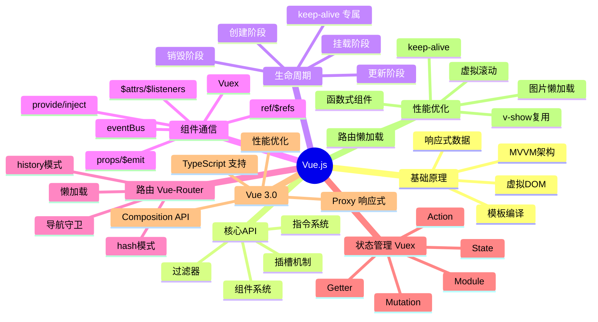

---

## 📑 目录（Table of Contents）

- [🎯 一、Vue 基础](#-一vue-基础)
- [🔄 二、生命周期](#-二生命周期)
- [📡 三、组件通信](#-三组件通信)
- [🧭 四、Vue Router](#-四vue-router)
- [🏪 五、Vuex 状态管理](#-五vuex-状态管理)
- [🚀 六、Vue 3.0](#-六vue-30)
- [⚡ 七、虚拟 DOM 与 Diff 算法](#-七虚拟-dom-与-diff-算法)
- [📦 八、Pinia（新一代 Vue 状态管理）](#-八pinia新一代-vue-状态管理)
- [🔧 九、Vue 3 组合式 API 进阶](#-九vue-3-组合式-api-进阶)
- [🌳 十、Vue 生态](#-十vue-生态)
- [❓ 十一、Vue 3 常见面试题](#-十一vue-3-常见面试题)
- [✅ 十二、Vue 开发最佳实践总结](#-十二vue-开发最佳实践总结)
- [📑 附录：Mermaid 图例说明](#-附录mermaid-图例说明)

---

## 🎯 一、Vue 基础

---

### 1️⃣ Vue 的基本原理

> 💡 **要点**：Vue 通过 `Object.defineProperty`（Vue2）/ `Proxy`（Vue3）实现数据响应式，核心三要素是 Observer（观察者）、Dep（依赖收集器）、Watcher（订阅者），三者协作驱动视图更新。

当一个 Vue 实例创建时，Vue 会遍历 `data` 中的属性，用 `Object.defineProperty`（Vue 3.0 使用 `Proxy`）将它们转为 `getter/setter`，并在内部追踪相关依赖。当属性被访问时收集依赖，被修改时通知变化。每个组件实例都有相应的 `watcher` 实例，它在组件渲染过程中把属性记录为依赖，当依赖项的 `setter` 被调用时，通知 `watcher` 重新计算，从而驱动关联的组件更新。

**核心三要素：**
- **Observer**（观察者）：递归遍历 data，为每个属性添加 getter/setter
- **Dep**（依赖收集器）：每个响应式属性对应一个 Dep，管理订阅它的 Watcher
- **Watcher**（订阅者）：组件渲染 Watcher、计算属性 Watcher、用户 Watcher

---

### 2️⃣ 双向数据绑定的原理

> 💡 **要点**：采用"数据劫持 + 发布者-订阅者模式"，通过 Observer、Dep、Watcher、Compile 四者协作，实现数据变化自动更新视图、用户操作自动同步数据。

Vue 采用**数据劫持** + **发布者-订阅者模式**，通过 `Object.defineProperty()` 劫持各属性的 `setter/getter`，在数据变动时发布消息给订阅者，触发相应监听回调。

```mermaid
flowchart TB
    subgraph MVVM
        View["View (DOM)"]
        ViewModel["ViewModel (Vue 实例)"]
        Model["Model (data 对象)"]
    end

    Model -->|"数据变更"| ViewModel
    ViewModel -->|"视图更新"| View

    View -->|"用户交互"| ViewModel
    ViewModel -->|"数据同步"| Model

    subgraph ViewModel内部
        Observer["Observer\n("数据劫持")\n为 data 添加 getter/setter"]
        Dep["Dep\n("依赖收集器")\n管理 Watcher 列表"]
        Compile["Compile\n("模板编译")\n解析指令 / 绑定更新函数"]
        Watcher["Watcher\n("订阅者")\n连接 Observer 和 Compile\n当数据变化时执行 update()"]
    end

    Observer -->|"getter 收集依赖"| Dep
    Observer -->|"setter 触发通知"| Dep
    Dep -->|"notify()"| Watcher
    Watcher -->|"update()"| Compile
    Compile -->|"更新视图"| View
    View -->|"用户输入"| Compile
    Compile -->|"数据绑定"| Model
```

**核心流程四步：**

> 📌 **数据驱动机制**：Observer 负责数据劫持，Compile 解析模板指令，Watcher 作为桥梁连接数据和视图，MVVM 整合三者实现双向绑定。

1. **Observer**：递归遍历 data 对象，通过 `Object.defineProperty()` 为所有属性添加 getter/setter。当读取属性时触发 getter（依赖收集），当修改属性时触发 setter（派发更新）。
2. **Compile**：解析模板指令，将模板中的变量替换为数据，初始化渲染页面视图，并为每个指令对应的节点绑定更新函数，添加监听数据的订阅者。
3. **Watcher**：作为 Observer 和 Compile 之间的通信桥梁——实例化时向 Dep 添加自己；持有 `update()` 方法；当属性变动 `dep.notify()` 时调用自身 `update()` 并触发 Compile 中绑定的回调。
4. **MVVM**：作为数据绑定的入口，整合 Observer、Compile 和 Watcher 三者，实现双向绑定效果。

---

### 3️⃣ `Object.defineProperty()` 的缺陷与 Proxy 的改进

> ⚠️ **注意**：Vue2 的 `Object.defineProperty` 有 4 大缺陷（无法监听数组下标、长度变化、新增/删除属性），Vue3 的 `Proxy` 完美解决了这些问题，且支持 `Map/Set`。

**Object.defineProperty 的局限：**

| 问题 | 说明 | Vue 2 的变通方案 |
|------|------|-----------------|
| 无法监听数组下标赋值 | `arr[0] = newVal` 不会触发 setter | 重写数组的 7 个方法 |
| 无法监听数组长度变化 | `arr.length = 0` 无响应 | 同上 |
| 无法监听对象新增属性 | `obj.newKey = val` 无响应 | 使用 `Vue.set()` |
| 无法监听对象删除属性 | `delete obj.key` 无响应 | 使用 `Vue.delete()` |
| 需要递归遍历 | 初始化时就要深度遍历所有属性 | 一次性开销 |

**Proxy 的优势（Vue 3）：**

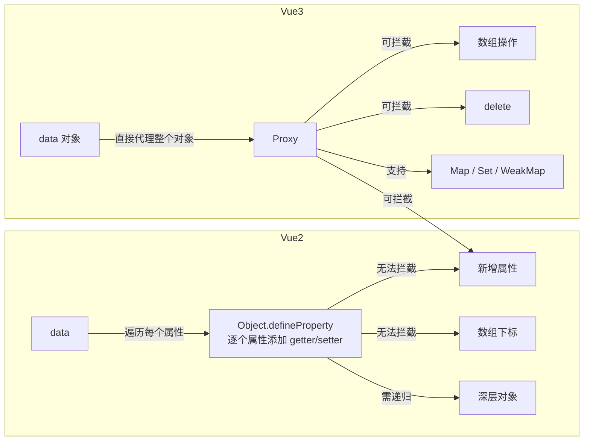

---

> 🎯 **Vue 3 改进总结**：Proxy 解决了 Vue 2 中 `Object.defineProperty` 的 4 大痛点：数组下标修改、新增属性、删除属性、Map/Set 支持。且采用懒代理机制，访问时才代理深层对象，初始化性能更优。

---

### 4️⃣ MVVM / MVC / MVP 架构对比

> 💡 **要点**：MVVM 的核心优势是 View 和 Model 完全解耦，通过 ViewModel 实现双向自动同步，无需手动操作 DOM。

```mermaid
    subgraph MVC["MVC 架构"]
        direction LR
        M1["Model\n("数据 + 业务逻辑")"] -->|"通知更新"| V1["View\n("页面展示")"]
        V1 -->|"用户操作"| C1["Controller\n("事件处理")"]
        C1 -->|"修改数据"| M1
    end

    subgraph MVP["MVP 架构"]
        direction LR
        M2["Model"] -->|"数据变更"| P["Presenter\n("调度中心")"]
        P -->|"更新视图"| V2["View\n("暴露接口")"]
        V2 -->|"用户事件"| P
        P -->|"修改数据"| M2
    end

    subgraph MVVM["MVVM 架构"]
        direction LR
        M3["Model\n("数据层")"] <-->|"双向绑定"| VM["ViewModel\n("Vue 实例")"]
        VM <-->|"自动同步"| V3["View\n("声明式模板")"]
    end
```

**三种架构的核心区别：**

| 特性 | MVC | MVP | MVVM |
|------|-----|-----|------|
| View 与 Model 关系 | 观察者模式，直接耦合 | 完全解耦 | 完全解耦 |
| 通信中枢 | Controller | Presenter | ViewModel |
| 数据流 | 单向 | 单向 | 双向 |
| 更新方式 | Model 主动通知 View | Presenter 协调 | 自动同步 |
| 测试性 | 一般 | 好（可 mock View 接口） | 好（可 mock ViewModel） |
| DOM 操作 | 需要手动操作 | 需要手动操作 | 自动完成 |

---

### 5️⃣ Computed vs Watch vs Methods

> 💡 **要点**：Computed 有缓存且只返回派生值，Watch 适合执行副作用（支持异步），Methods 每次调用都重新执行。三者在 Vue 中各司其职。

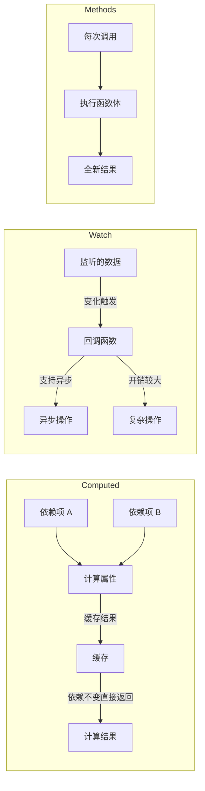

**对比总结：**

| 特性 | Computed | Watch | Methods |
|------|----------|-------|---------|
| 缓存 | ✅ 依赖不变不重新计算 | ❌ 每次变化都触发 | ❌ 每次调用都执行 |
| 异步支持 | ❌ 不支持 | ✅ 支持 | ✅ 支持 |
| 适用场景 | 派生数据、模板简化 | 数据变化后执行副作用 | 事件处理、主动调用 |
| 返回值 | 必须返回一个值 | 不要求返回值 | 不要求返回值 |
| 是否模板可用 | ✅ `{{ computedProp }}` | ❌ 不可直接用 | ✅ `{{ method() }}` |

---

### 6️⃣ Slot 插槽机制

> 💡 **要点**：插槽是组件内容分发的核心机制，分为默认插槽（匿名）、具名插槽（name 属性）、作用域插槽（子传数据给父）。

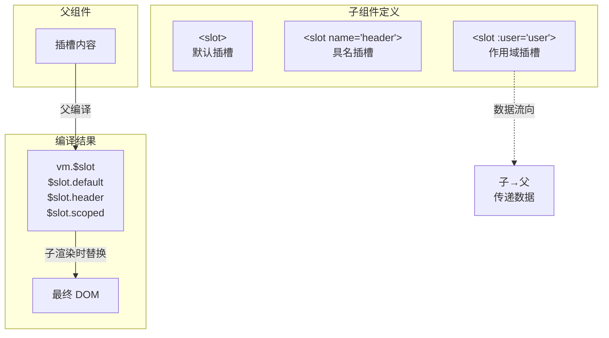

**插槽分类：**
- **默认插槽**（匿名插槽）：`<slot>`，组件内只有一个
- **具名插槽**：`<slot name="xxx">`，一个组件可有多个
- **作用域插槽**：子组件通过 `slot` 标签属性传递数据给父组件，父组件通过 `v-slot="{ data }"` 接收

---

### 9️⃣ 保持页面状态的方案

> 💡 **要点**：根据组件是否被卸载选择不同方案——卸载时用 `localStorage`/路由传值，未卸载时用 `keep-alive` 缓存组件实例。

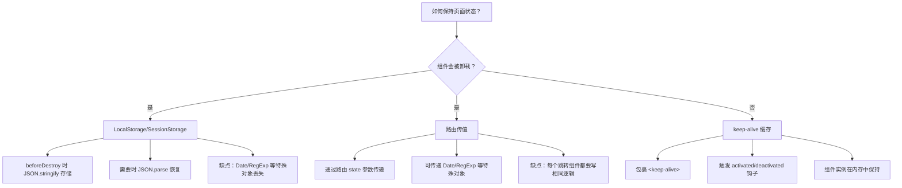

---

### 1️⃣1️⃣ v-if vs v-show vs v-html 原理

> 💡 **要点**：`v-if` 条件渲染（销毁/创建 DOM），`v-show` 始终渲染（切换 `display`），`v-html` 直接设置 `innerHTML`（有 XSS 风险）。

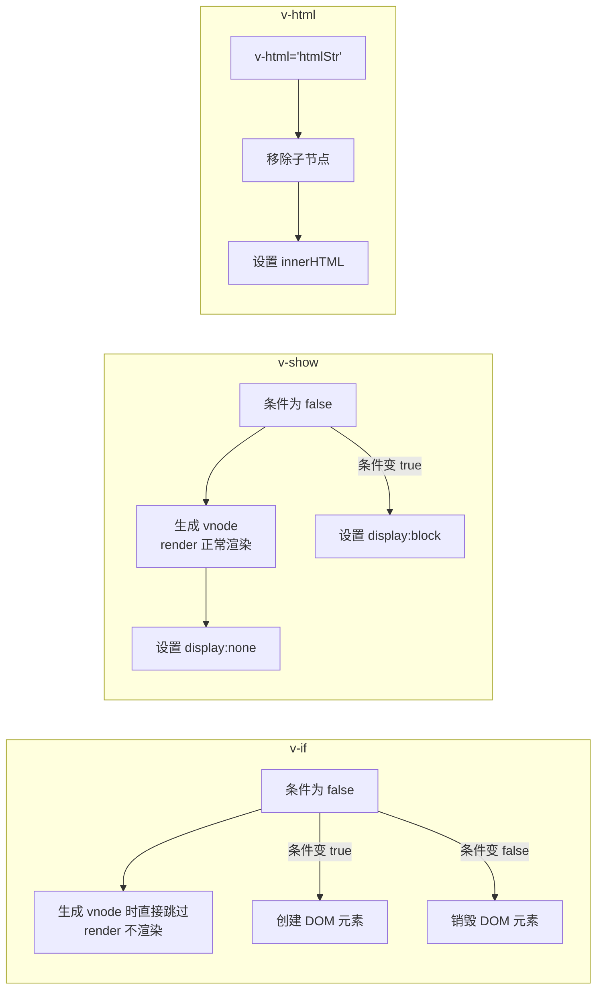

---

### 1️⃣4️⃣ v-model 实现原理（语法糖）

> 💡 **要点**：`v-model` 本质是 `:value + @input` 的语法糖，表单元素监听原生事件，自定义组件默认利用 `value` prop 和 `input` 事件。

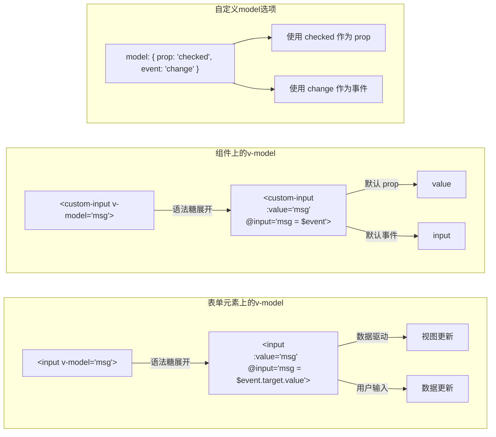

**实现本质：**

```text
// v-model 语法糖本质：绑定 value 与监听 input 事件
v-model = v-bind:value + v-on:input
```

在表单元素上，它动态绑定了 `input` 的 `value` 指向 `message` 变量，并在触发 `input` 事件时将 `message` 设为目标值。在自定义组件中，它默认利用 `value` prop 和 `input` 事件，形成父子组件通信的语法糖。

---

### 1️⃣6️⃣ data 为什么是函数

> ⚠️ **注意**：组件 data 必须是函数，每次创建组件实例时返回新的数据对象，避免多个实例共享同一引用导致数据污染。

```mermaid
flowchart TD
    subgraph 对象定义（错误）
        obj_data["data: { count: 0 }"] --> compA1["组件实例 A\ncount: 0"]
        obj_data --> compB1["组件实例 B\ncount: 0"]
        compA1 -->|"A 修改 count++"| conflict["B 的 count 也被修改！"]
    end

    subgraph 函数定义（正确）
        func_data["data() { return { count: 0 } }"] --> factory["工厂函数\n每次返回新对象"]
        factory --> compA2["组件实例 A\n{"count: 0"}"]
        factory --> compB2["组件实例 B\n{"count: 0"}"]
        compA2 -->|"A 修改 count++"| safe["B 的 count 不受影响"]
    end
```

---

### 1️⃣7️⃣ keep-alive 实现原理

> 🏆 **要点**：keep-alive 是抽象组件，通过 LRU 缓存策略缓存组件 vnode，新增 `activated`/`deactivated` 生命周期，命中缓存时不触发 `created`/`mounted`。

```mermaid
flowchart TB
    subgraph keep-alive 工作流程
        start["组件切换触发"] --> includeCheck{"匹配 include/exclude？"}
        includeCheck -->|"不匹配"| noCache["直接返回 vnode\n不缓存"]
        includeCheck -->|"匹配"| keyGen["生成组件 key\ncid::tag"]
        keyGen --> cacheCheck{"cache["key"] 存在？"}
        cacheCheck -->|"✅ 缓存命中"| lru["LRU 策略\n将 key 移到数组末尾"]
        cacheCheck -->|"❌ 未命中"| addCache["加入缓存\ncache["key"] = vnode"]
        addCache --> maxCheck{"超过 max 限制？"}
        maxCheck -->|"是"| prune["淘汰最久未使用的\n（keys["0"]）"]
        maxCheck -->|"否"| setKeepAlive["设置 keepAlive=true"]
        lru --> setKeepAlive
        setKeepAlive --> render["返回 vnode"]
    end

    subgraph LRU策略
        direction LR
        keys["keys 数组"] --> recent["最近使用的 key\n（push 到末尾）"]
        keys --> oldest["最久未使用的 key\n（位于头部，优先淘汰）"]
    end
```

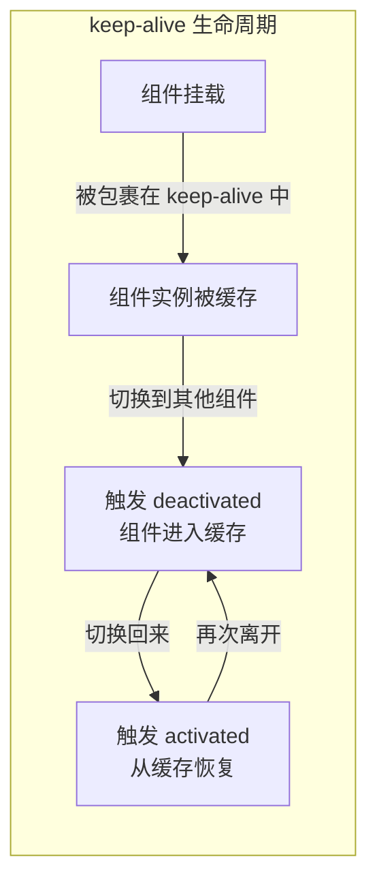

**核心要点：**

- `keep-alive` 是一个抽象组件（`abstract: true`），自身不渲染 DOM 元素
- 通过 `cache` 对象缓存组件的 `vnode` 实例
- 采用 **LRU（Least Recently Used）** 缓存淘汰策略
- 缓存命中时不会执行 `created`、`mounted` 等钩子，而是直接插入缓存的 DOM
- 新增 `activated` 和 `deactivated` 两个生命周期钩子

---

### 1️⃣8️⃣ $nextTick 原理

> 💡 **要点**：$nextTick 利用微任务/宏任务机制在 DOM 更新后执行回调，实现数据变更与 DOM 操作的时序协调。

```mermaid
flowchart TB
    subgraph Event Loop 中的 nextTick
        direction TB
        dataChange["数据变更"] --> queueWatcher["将 Watcher 加入异步队列"]
        queueWatcher --> flushSchedulerQueue["flushSchedulerQueue\n（去重、排序、执行）"]

        subgraph 异步任务优先级
            promise["Promise.then（微任务）"]
            mutationObserver["MutationObserver（微任务）"]
            setImmediate["setImmediate（宏任务）"]
            setTimeout["setTimeout（宏任务）"]
        end

        flushSchedulerQueue -->|"尝试"| promise
        promise -->|"不支持"| mutationObserver
        mutationObserver -->|"不支持"| setImmediate
        setImmediate -->|"不支持"| setTimeout
    end

    subgraph 使用场景
        sync["同步代码修改数据"] --> domNotUpdated["此时 DOM 尚未更新"]
        domNotUpdated --> nextTick["$nextTick("(") => { ... })"]
        nextTick -->|"DOM 更新后执行"| domUpdated["可以获取最新 DOM"]
    end
```

**为什么需要异步更新？**

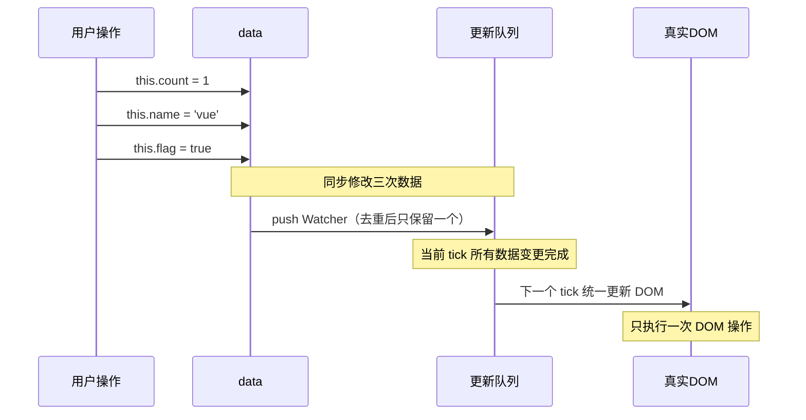

**异步更新的好处：**
1. **去重**：多次对同一个属性赋值，只会触发一次更新
2. **合并**：同一 tick 内的多次数据变更合并为一次 DOM 操作
3. **性能**：避免频繁的 DOM 重排重绘

---

### 1️⃣9️⃣ $set 原理

> 💡 **要点**：$set 用于向响应式对象添加新属性或修改数组元素，内部通过 `defineReactive` 为新属性添加响应式并手动触发 `dep.notify()`。

```mermaid
flowchart TD
    subgraph $set 实现逻辑
        target["this.$set("target, key, value")"] --> isArray{"target 是数组？"}
        isArray -->|"✅ 是数组"| splice["使用 splice 方法\n（触发数组重写）"]
        isArray -->|"❌ 不是数组"| hasKey{"key 已存在？"}
        hasKey -->|"✅ 存在"| direct["直接赋值\n已有 setter 会触发更新"]
        hasKey -->|"❌ 不存在"| isReactive{"target 是响应式的？"}
        isReactive -->|"✅ 是"| define["调用 defineReactive\n为新属性添加 getter/setter"]
        isReactive -->|"❌ 不是"| fallback["直接赋值\n（非响应式对象无需处理）"]
        define --> notify["手动通知 dep.notify()"]
    end
```

---

> 📌 **LRU 策略**：keep-alive 内部维护 `keys` 数组记录访问顺序，最新访问的 key 被移到最后，超出 `max` 限制时淘汰头部（最久未使用）的缓存。

---

### 2️⃣0️⃣ Vue 数组方法重写

> 💡 **要点**：Vue 2 通过重写数组的 7 个方法（`push/pop/shift/unshift/splice/sort/reverse`）实现数组响应式，拦截后先执行原生方法，再监听新值并通知更新。

\`\`\`mermaid
flowchart LR
    subgraph 原型链拦截
        direction TB
        arrProto["Array.prototype"] -->|"Vue 重写"| overridden["arrayMethods\n（新对象）"]
        overridden -->|"通过 __proto__ 覆盖"| arrInstance["数组实例\narr.__proto__ = arrayMethods"]
    end

    subgraph 重写的方法
        methods["push / pop / shift / unshift\nsplice / sort / reverse"]
    end

    subgraph 执行流程
        call["arr.push("newVal")"] --> original["执行原生 push"]
        original --> observeNew["observeArray("inserted")\n监听新增元素"]
        observeNew --> notify2["dep.notify()\n通知 Watcher 更新"]
    end
```

**被重写的 7 个方法：**

| 方法 | 需要额外监听新值 | 说明 |
|------|-----------------|------|
| `push` | ✅ | 新增的元素需要转为响应式 |
| `pop` | ❌ | 移除元素，无需监听 |
| `shift` | ❌ | 移除第一个元素 |
| `unshift` | ✅ | 新增的元素需要转为响应式 |
| `splice` | ✅（第三个参数起） | 新增的元素需要转为响应式 |
| `sort` | ❌ | 排序不产生新元素 |
| `reverse` | ❌ | 反转不产生新元素 |

---

> 🎯 **异步优先级**：Vue 优先使用微任务（`Promise.then`），降级到 `MutationObserver` → `setImmediate` → `setTimeout`，确保在当前 tick 数据变更完成后统一更新 DOM。

---

### 2️⃣2️⃣ Template → Render 编译过程

> 💡 **要点**：模板编译分三阶段：`parse`（解析为 AST）→ `optimize`（标记静态节点）→ `generate`（生成 render 函数），静态节点在后续 diff 中被跳过。

\`\`\`mermaid
flowchart TB
    subgraph 编译三阶段
        template["Template\n（字符串模板）"] -->|"阶段一：解析"| parse["parse()\n正则表达式逐词解析"]

        parse -->|"开始标签"| startTag["生成 Element AST\ntype: 1"]
        parse -->|"表达式"| expTag["生成 Expression AST\n type: 2"]
        parse -->|"纯文本"| textTag["生成 Text AST\n type: 3"]
        startTag & expTag & textTag --> ast["AST\n（抽象语法树）"]

        ast -->|"阶段二：优化"| optimize["optimize()\n标记静态节点"]

        optimize --> static["静态节点标记 static:true"]
        optimize --> dynamic["动态节点保持 static:false"]
        static & dynamic -->|"阶段三：生成"| generate["generate()\n生成 render 函数字符串"]

        generate --> renderFn["render 函数\nnew Function("'render'")"]
        generate --> staticRenderFns["staticRenderFns\n静态节点函数"]
    end

    subgraph 运行阶段
        renderFn --> vnode["VNode 虚拟节点树"]
        vnode --> patch["patch() → 真实 DOM"]
    end
```

**详细流程：**

| 阶段 | 函数 | 输入 | 输出 | 核心工作 |
|------|------|------|------|---------|
| 解析 | `parse()` | template 字符串 | AST | 正则表达式解析标签、指令、属性 |
| 优化 | `optimize()` | AST | 带标记的 AST | 标记静态节点，跳过后续 diff |
| 生成 | `generate()` | AST | render 函数字符串 | 拼接成可执行的 JS 代码 |

**AST 节点类型：**
- `type: 1` — 普通元素（div、span 等）
- `type: 2` — 表达式（`{{ message }}`）
- `type: 3` — 纯文本

---

### 2️⃣3️⃣ 响应式数据更新流程

> 💡 **要点**：数据变更触发 setter → Dep.notify() → Watcher 入异步队列（去重+排序）→ 下一个 tick 统一执行 patch 更新 DOM。

\`\`\`mermaid
sequenceDiagram
    participant Data as data 属性
    participant Dep as Dep
    participant Watcher as 渲染 Watcher
    participant Queue as 异步更新队列
    participant DOM as 真实 DOM

    Note over Data: 初始化 Object.defineProperty
    Data->>Dep: getter 触发，dep.depend()
    Dep->>Watcher: 收集当前 Watcher 到 subs

    Note over Data: 数据发生变化
    Data->>Dep: setter 触发，dep.notify()
    Dep->>Watcher: 通知所有 subs Watcher

    Watcher->>Queue: 推入异步队列
    Note over Queue: 去重：同一 Watcher 只入队一次
    Note over Queue: 排序：父组件优先于子组件

    Queue->>Watcher: 下一个 tick 执行
    Watcher->>Watcher: 重新计算 render()
    Watcher->>DOM: patch 更新 DOM
```

---

### 2️⃣4️⃣ mixin / extends 合并策略

```mermaid
flowchart TD
    subgraph mergeOptions 执行流程
        options["组件选项 options"] --> normalize["规范化\nnormalizeProps\nnormalizeInject\nnormalizeDirectives"]
        normalize --> extendCheck{"child.extends 存在？"}
        extendCheck -->|"✅"| mergeExtends["parent = mergeOptions("parent, child.extends")"]
        mergeExtends --> mixinCheck
        extendCheck -->|"❌"| mixinCheck{"child.mixins 存在？"}
        mixinCheck -->|"✅"| mergeMixins["遍历 mixins 数组\n依次合并"]
        mergeMixins --> mergeAll["逐类合并"]
        mixinCheck -->|"❌"| mergeAll

        subgraph 合并策略
            mergeAll --> dataStrategy["data：同名合并，冲突以组件为主"]
            mergeAll --> hookStrategy["生命周期钩子：\n合并为数组，mixin 先执行"]
            mergeAll --> watchStrategy["watch：合并为数组"]
            mergeAll --> methodsStrategy["methods：同名以组件为准"]
            mergeAll --> computedStrategy["computed：同名以组件为准"]
        end

        mergeAll --> result["返回合并后的 options"]
    end
```

**合并优先级：** 组件自身 > mixins（后传入优先）> extends > 全局 mixin

---

### 2️⃣7️⃣ 依赖收集原理

> 💡 **要点**：渲染时触发 data 的 getter → 当前 Watcher 被 `dep.depend()` 收集到 `subs` 数组；数据变化时 setter → `dep.notify()` → 遍历 subs 通知所有 Watcher 更新。

\`\`\`mermaid
flowchart TB
    subgraph 1.初始化
        init["new Vue()"] --> initState["initState()"]
        initState --> defineReactive["defineReactive()\n为 data 属性添加 getter/setter"]
        defineReactive --> depInit["创建 Dep 实例"]
    end

    subgraph 2.依赖收集
        mount["mount 过程"] --> newWatcher["new Watcher("render")"]
        newWatcher --> pushTarget["pushTarget("this")\nDep.target = 当前 Watcher"]
        pushTarget --> render["执行 render()"]
        render --> readData["访问 data 属性"]
        readData --> getter["触发 getter"]
        getter --> depDepend["dep.depend()"]
        depDepend --> addDep["Watcher.addDep("dep")"]
        addDep --> depAddSub["dep.addSub("Watcher")\nWatcher 被添加到 subs"]
    end

    subgraph 3.派发更新
        modify["修改数据"] --> setter["触发 setter"]
        setter --> depNotify["dep.notify()"]
        depNotify --> subsLoop["遍历 subs"]
        subsLoop --> watcherUpdate["Watcher.update()"]
        watcherUpdate --> queueWatcher["queueWatcher\n加入异步队列"]
    end
```

**关键角色：**

| 角色 | 作用 |
|------|------|
| `Dep` | 依赖收集器，`subs` 数组存储所有订阅它的 Watcher |
| `Watcher` | 订阅者，有 `update()`、`get()`、`addDep()` 等方法 |
| `Dep.target` | 静态属性，全局唯一，指向当前正在计算的 Watcher |

---

### 2️⃣8️⃣ 模板语法完全参考

#### 插值与绑定

```html
<!-- 插值表达式 -->
<div>{{ message }}</div>
<div>{{ count + 1 }}</div>
<div>{{ ok ? '是' : '否' }}</div>

<!-- 属性绑定 -->

<button :disabled="isDisabled">按钮</button>
<div :class="{ active: isActive }">动态类</div>
<div :style="{ color: activeColor }">动态样式</div>

<!-- 事件绑定 -->
<button @click="handleClick">点击</button>
<input @keyup.enter="submitForm" />

<!-- 双向绑定 -->
<input v-model="message" />
<input v-model.number="age" />
<input v-model.trim="name" />

<!-- 条件渲染 -->
<div v-if="visible">显示</div>
<div v-else-if="loading">加载中...</div>
<div v-else>隐藏</div>
<div v-show="visible">始终存在于 DOM</div>

<!-- 列表渲染 -->
<ul>
  <li v-for="item in items" :key="item.id">{{ item.name }}</li>
</ul>

<!-- 特殊属性 -->
<component :is="currentComponent" />
<KeepAlive>
  <component :is="currentComponent" />
</KeepAlive>
```

#### v-model 修饰符

| 修饰符 | 作用 | 示例 |
|--------|------|------|
| `.number` | 自动转为数字 | `v-model.number="age"` |
| `.trim` | 去除首尾空格 | `v-model.trim="name"` |
| `.lazy` | 改为 change 事件触发 | `v-model.lazy="message"` |

#### 动态指令参数（Vue 3.3+）

```html
<div :[attributeName]="value">动态属性</div>
<button @[eventName]="handler">动态事件</button>
```

---

## 🔄 二、生命周期

---

### 1️⃣ 完整生命周期流程图

> 💡 **要点**：Vue 生命周期共 8 个阶段：`beforeCreate` → `created` → `beforeMount` → `mounted` → `beforeUpdate` → `updated` → `beforeDestroy` → `destroyed`。`created` 可访问 data 但无 DOM，`mounted` 可操作 DOM。

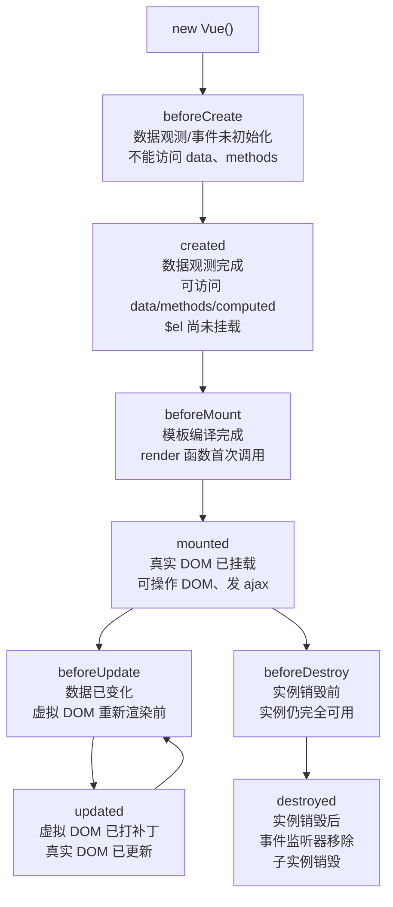

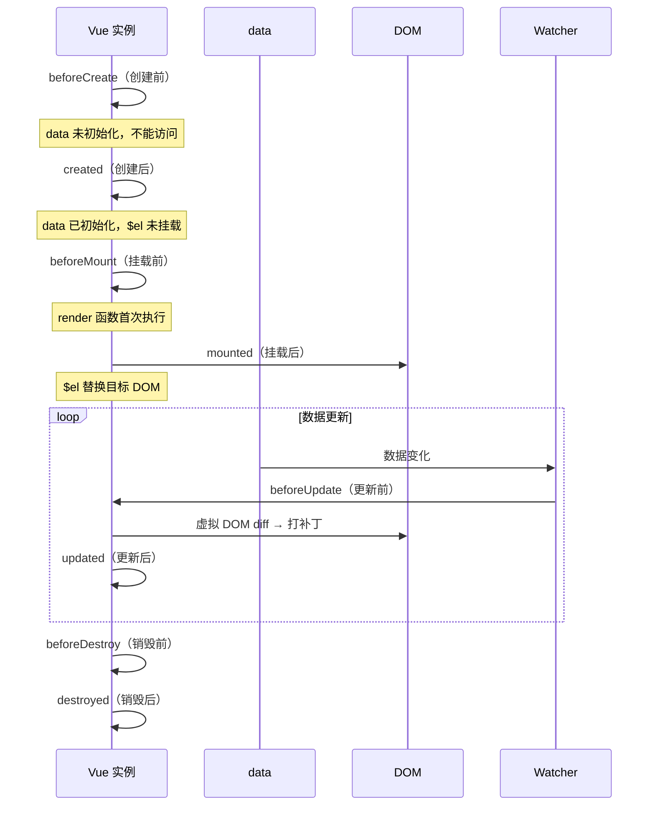

---

### 2️⃣ 父子组件生命周期顺序

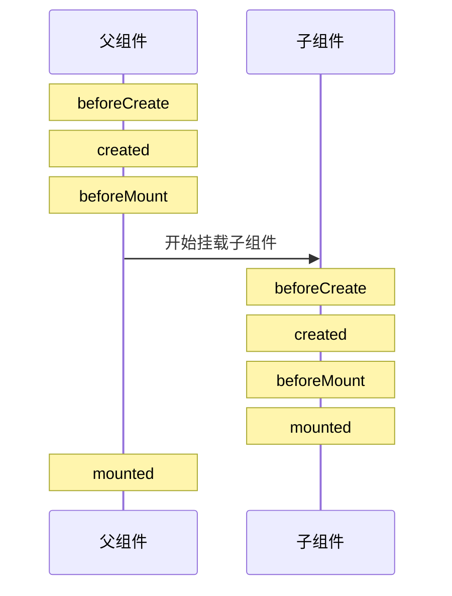

**更新阶段：**

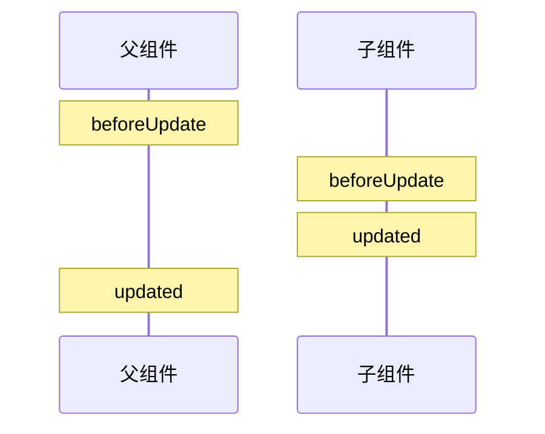

**销毁阶段：**

```mermaid
sequenceDiagram
    participant Parent as 父组件
    participant Child as 子组件

    Note over Parent: beforeDestroy
    Note over Child: beforeDestroy
    Note over Child: destroyed
    Note over Parent: destroyed
```

---

> 💡 **关键提示**：生命周期遵循"父组件创建 → 子组件创建 → 子组件挂载 → 父组件挂载"的顺序。更新阶段父 beforeUpdate 先触发，子更新完成后再触发父 updated。销毁阶段同理。

### 5️⃣ keep-alive 生命周期

```mermaid
sequenceDiagram
    participant 未使用keepalive
    participant 使用keepalive

    Note over 未使用keepalive: beforeCreate
    Note over 未使用keepalive: created
    Note over 未使用keepalive: beforeMount
    Note over 未使用keepalive: mounted
    Note over 未使用keepalive: 切换 → beforeDestroy
    Note over 未使用keepalive: 切换 → destroyed

    Note over 使用keepalive: beforeCreate
    Note over 使用keepalive: created
    Note over 使用keepalive: beforeMount
    Note over 使用keepalive: mounted
    Note over 使用keepalive: 切换 → deactivated（缓存）
    Note over 使用keepalive: 切换回来 → activated（恢复）
    Note over 使用keepalive: 再次切换 → deactivated
```

---

## 📡 三、组件通信

```mermaid
flowchart TB
    subgraph 父子通信
        props["props\n父→子"] --> Child
        Child -->|"$emit"| parent["父组件"]
        ref["ref / $refs\n父调用子方法"] -.-> Child
        Parent -.->|"$parent"| child["子组件"]
    end

    subgraph 跨级通信
        Provider["祖先 provide"] -->|"数据传递"| Injector["后代 inject"]
        A["A 组件"] -->|"$attrs + v-bind"| B["B 组件"]
        B -->|"$listeners + v-on"| C["C 组件"]
        A -.->|"跨级通信"| C
    end

    subgraph 全局通信
        EventBus["EventBus\n事件总线"] -->|"任意组件"| All["任意组件"]
        Vuex["Vuex Store\n集中状态管理"] -->|"所有组件"| All2["任意组件"]
    end
```

**通信方式总结：**

| 方式 | 适用场景 | 方向 |
|------|----------|------|
| `props` / `$emit` | 父子组件 | 父→子 / 子→父 |
| `ref` / `$refs` | 父子组件 | 父调用子实例 |
| `$parent` / `$children` | 父子组件 | 任意方向 |
| `provide` / `inject` | 祖孙组件 | 祖先→后代 |
| `$attrs` / `$listeners` | 隔代组件 | 祖先→深层后代 |
| `eventBus` | 任意组件 | 双向 |
| `Vuex` | 复杂状态管理 | 全局 |

---

## 🧭 四、Vue Router

---

### 2️⃣ hash 模式 vs history 模式

> 💡 **要点**：hash 模式使用 `#` 后的 URL 变化触发 `onhashchange`，无需后端配置；history 模式使用 `pushState` 修改 URL，刷新时需后端配合返回 index.html 避免 404。

\`\`\`mermaid
flowchart TB
    subgraph hash模式
        url_hash["http://abc.com/#/user/123"]
        hash_change["#/user/123 变化"]
        hash_event["触发 onhashchange 事件"]
        hash_event --> route_match["前端路由匹配"]
        route_match --> render_view["渲染对应组件"]
        hash_event -->|"不发送 HTTP 请求"| no_request["对后端无影响"]
    end

    subgraph history模式
        url_history["http://abc.com/user/123"]
        history_api["调用 history.pushState()"]
        history_api --> change_url["修改 URL\n（不刷新页面）"]
        change_url --> route_match2["前端路由匹配"]
        route_match2 --> render_view2["渲染对应组件"]
        refresh["用户刷新页面"] --> server_request["发送 HTTP 请求到服务器"]
        server_request -->|"需要后端配置\n否则 404"| backend["后端返回 index.html\n或 404 错误"]
    end
```

**两种模式对比：**

| 特性 | hash 模式 | history 模式 |
|------|-----------|-------------|
| URL 格式 | 带 `#` | 正常 URL |
| 浏览器兼容性 | IE8+ | IE10+ |
| 后端配置 | 无需 | 需要 |
| 刷新行为 | 不触发请求 | 触发真实 HTTP 请求 |
| 传递数据 | 只能传短字符串 | 可通过 stateObject 传递任意类型 |

---

### 6️⃣ 导航守卫执行顺序

```mermaid
flowchart TD
    trigger["导航被触发"] --> beforeRouteLeave["beforeRouteLeave\n（离开的组件内）"]
    beforeRouteLeave --> beforeEach["router.beforeEach\n（全局前置守卫）"]
    beforeEach --> beforeRouteUpdate["beforeRouteUpdate\n（可复用的组件内）"]
    beforeRouteUpdate --> beforeEnter["beforeEnter\n（路由独享守卫）"]
    beforeEnter --> resolveAsync["解析异步路由组件"]
    resolveAsync --> beforeRouteEnter["beforeRouteEnter\n（进入的组件内）"]
    beforeRouteEnter --> beforeResolve["router.beforeResolve\n（全局解析守卫）"]
    beforeResolve --> confirm["导航被确认"]
    confirm --> afterEach["router.afterEach\n（全局后置钩子）"]
    afterEach --> mount["组件生命周期\nbeforeCreate → created\nbeforeMount → mounted"]
    mount --> nextCallback["执行 beforeRouteEnter\n中传给 next 的回调"]
    mount --> activated["activated\n（keep-alive 缓存组件）"]
```

---

## 🏪 五、Vuex 状态管理

---

### 1️⃣ Vuex 核心架构

> 💡 **要点**：Vuex 采用单向数据流：Component → dispatch → Action → commit → Mutation → mutate → State → 响应式渲染到 Component。Mutation 是唯一修改 State 的途径且必须同步。

```mermaid
flowchart TB
    subgraph Vuex 数据流
        Components["Vue Components\n（视图组件）"] -->|"dispatch"| Actions["Actions\n（异步/同步操作）"]
        Actions -->|"commit"| Mutations["Mutations\n（同步修改 State）"]

        Mutations -->|"mutate"| State["State\n（单一状态树）"]
        State -->|"响应式渲染"| Components

        Components -->|"读取"| Getters["Getters\n（计算属性）"]
        Getters -->|"派生数据"| Components
    end

    subgraph 核心原则
        rule1["单向数据流"]
        rule2["Mutation 是唯一修改 State 的途径"]
        rule3["Action 可包含异步操作"]
        rule4["State 变更可预测、可追踪"]
    end

    subgraph 工具
        DevTools["Vue DevTools\n调试追踪"]
        DevTools -->|"记录每个 Mutation"| TimeTravel["Time Travel\n时间旅行调试"]
    end
```

**五大核心属性：**

| 属性 | 作用 | 特点 |
|------|------|------|
| `State` | 数据源 | 单一状态树，响应式 |
| `Getter` | 派生数据 | 类似计算属性，有缓存 |
| `Mutation` | 同步修改 State | 唯一修改方式，必须同步 |
| `Action` | 异步操作 | 提交 Mutation，可含异步逻辑 |
| `Module` | 模块化 | 拆分 Store，命名空间 |

---

### 6️⃣ Vuex Action vs Mutation 对比

```mermaid
flowchart LR
    subgraph Action
        actionFn["Action"] --> commit["context.commit("'mutationName'")"]
        commit --> async["可包含异步操作\n（API 请求、延时等）"]
    end

    subgraph Mutation
        mutationFn["Mutation("state, payload")"] --> modify["直接修改 state"]
        modify --> sync["必须同步执行"]
        modify --> track["DevTools 可追踪"]
    end
```

---

## 🚀 六、Vue 3.0

---

### 1️⃣ Vue 2 vs Vue 3 对比

> 💡 **要点**：Vue 3 核心改进：Composition API（逻辑复用）、Proxy（完整响应式）、原生 TypeScript 支持、Fragment（多根节点）、Tree-shaking（按需引入）。

```mermaid
flowchart LR
    subgraph Vue 2
        v2_options["Options API\n（data、methods、computed 分散）"]
        v2_proxy["Object.defineProperty\n（逐个属性代理）"]
        v2_ts["TypeScript 支持差\n需装饰器辅助"]
        v2_root["单根节点模板"]
        v2_this["复杂的 this 上下文"]
    end

    subgraph Vue 3
        v3_composition["Composition API\n（setup 函数集中组织）"]
        v3_proxy["Proxy\n（代理整个对象）"]
        v3_ts["原生 TypeScript 支持"]
        v3_frag["Fragment\n（多根节点）"]
        v3_tree["Tree-shaking\n（按需引入）"]
    end
```

---

### 4️⃣ Composition API 详解

> 💡 **要点**：Composition API 通过 `setup()` 函数按功能组织代码，解决了 Options API 跨关注点分散的问题，配合 `ref`/`reactive`/`computed`/`watch` 实现更灵活的逻辑复用。

```mermaid
flowchart LR
    subgraph 真实DOM
        real["真实 DOM 节点\ndiv#app"]
        real --> realAttr["大量属性\n（getElementById、innerHTML 等）"]
        real --> realHeavy["创建/修改成本高\n引起重排重绘"]
    end

    subgraph 虚拟DOM
        virtual["VNode 对象\n{"tag, data, children, text, ..."}"]
        virtual --> virtualLight["轻量级 JS 对象\n只有必要属性"]
        virtual --> virtualFast["创建/对比成本低\n纯 JS 计算"]
    end

    real -.->|"每次修改都引发"| expensive["Layout → Paint → Composite"]
    virtual -->|"批量对比差异"| diff["Diff 算法"]
    diff -->|"一次批量更新"| real
```

**VNode 核心结构：**
```javascript
// VNode 对象结构示例
{
  tag: 'div',           // 标签名
  data: {               // 属性/指令
    attrs: { id: 'app' },
    class: ['foo'],
    style: { color: 'red' }
  },
  children: [           // 子节点
    { tag: 'span', text: 'hello' },
    { text: 'world' }
  ],
  elm: null,            // 对应的真实 DOM
  key: 'unique-id',     // 唯一标识
  componentOptions: {}  // 组件选项
}
```

---

### 5️⃣ Diff 算法详解

> ⚠️ **注意**：Vue 的 Diff 算法采用"同层比较 + 四个指针遍历"策略，通过 key 建立 Map 快速查找可复用节点，有效降低时间复杂度。

```mermaid
flowchart TD
    patch["patch("oldVnode, newVnode")"] --> same{"sameVnode?\n（key 和 tag 相同？）"}

    same -->|"❌ 不同"| replace["用新 vnode 替换旧 vnode"]
    same -->|"✅ 相同"| patchVnode["patchVnode"]

    patchVnode --> newHas{"newVnode 有子节点？"}
    newHas -->|"❌ 无"| removeOld["移除旧节点的所有子节点"]

    newHas -->|"✅ 有"| oldHas{"oldVnode 有子节点？"}
    oldHas -->|"❌ 无"| addNew["将新子节点添加到 DOM"]
    oldHas -->|"✅ 有"| updateChildren["updateChildren\n（核心 diff）"]

    subgraph updateChildren [同层子节点对比]
        direction TB
        start["新旧 children 各四个指针"] --> compare["头头 / 尾尾 / 头尾 / 尾头\n依次比较"]

        compare -->|"key 匹配"| sameNode["递归 patchVnode\n移动指针"]
        compare -->|"未匹配"| createKeyMap["用新 child 的 key 建立 Map"]

        createKeyMap --> keyInOld{"旧 children 中有\n同 key 节点？"}
        keyInOld -->|"有"| moveNode["移动节点位置"]
        keyInOld -->|"没有"| createNew["创建新节点插入"]

        moveNode --> checkRemaining{"对比完所有节点后\n检查剩余"}
        createNew --> checkRemaining
        sameNode --> checkRemaining

        checkRemaining -->|"旧的有剩余"| removeRemaining["批量删除"]
        checkRemaining -->|"新的有剩余"| addRemaining["批量新增"]
    end
```

**Diff 的关键优化：**

1. **只做同层比较**：不跨层级比较 DOM 节点，时间复杂度从 O(n³) 降至 O(n)
2. **四个指针遍历**：头头、尾尾、头尾、尾头四组比较，提高匹配效率
3. **key 建立 Map**：通过 key 的 Map 快速查找可复用的节点

**四种指针比较：**

```mermaid
flowchart LR
    subgraph 新旧子节点列表
        oldStart["旧开始"] --> oldEnd["旧结束"]
        newStart["新开始"] --> newEnd["新结束"]
    end

    subgraph 比较策略
        s1["① 旧开始 vs 新开始\n（sameVnode？）"]
        s2["② 旧结束 vs 新结束\n（sameVnode？）"]
        s3["③ 旧开始 vs 新结束\n（sameVnode？）"]
        s4["④ 旧结束 vs 新开始\n（sameVnode？）"]
    end

    s1 -->|"匹配则指针移动"| move1["旧开始++\n新开始++"]
    s2 -->|"匹配则指针移动"| move2["旧结束--\n新结束--"]
    s3 -->|"匹配则移动节点"| move3["将旧开始节点移到旧结束后\n旧开始++\n新结束--"]
    s4 -->|"匹配则移动节点"| move4["将旧结束节点移到旧开始前\n旧结束--\n新开始++"]
```

---

### 6️⃣ Key 的作用

> ⚠️ **注意**：key 帮助 Diff 算法准确识别节点身份，避免就地复用导致的渲染错误。**不要使用 index 作为 key**，否则在列表头部插入时会导致所有节点重新渲染。

```mermaid
flowchart TB
    subgraph 不设置 key（就地复用）
        list1["#quot;旧列表：[A, B, C"]"]
        list2["#quot;新列表：[B, A, C"]"]
        list1 -->|"对比"| noKey["默认就地复用\n依次替换文本"]
        noKey --> inefficient["操作：\n1. A 变 B（文本替换）\n2. B 变 A（文本替换）\n3. C 不变"]

        noKey_prob["问题：\n节点被错误复用\n输入框内容错乱\n需要更少的 DOM 操作"]
    end

    subgraph 设置唯一 key
        list1k["#quot;旧列表：[A-id1, B-id2, C-id3"]"]
        list2k["#quot;新列表：[B-id2, A-id1, C-id3"]"]
        list1k -->|"对比"| withKey["根据 key 匹配\n识别出 B 和 A 只是交换了位置"]
        withKey --> efficient["操作：\n1. 移动 B 到前面\n2. A 自动排到 B 后面\n3. C 不变"]
    end
```

**为什么不建议用 index 作为 key：**

```mermaid
flowchart LR
    subgraph index 作为 key 的陷阱
        arr["#quot;[a, b, c"]\nindex: 0, 1, 2"] -->|"在头部插入 z"| newArr["#quot;[z, a, b, c"]\nindex: 0→z, 1→a, 2→b, 3→c"]
        newArr -->|"Vue 对比 key"| wrong["0 匹配 0：z vs a → 不同\n1 匹配 1：a vs b → 不同\n2 匹配 2：b vs c → 不同\n全部节点需要修改"]
        wrong --> waste["本应只在 0 位置插入 z\n却导致所有节点重新渲染"]
    end
```

---

### 7️⃣ 虚拟 DOM 的完整工作流程

```mermaid
flowchart TB
    subgraph 首次渲染
        template2["Vue Template"] --> compile2["编译"]
        compile2 --> renderFn2["render 函数"]
        renderFn2 --> vnodeTree["VNode 树"]
        vnodeTree --> createElm["createElm\n创建真实 DOM"]
        createElm --> insert["插入到页面"]
    end

    subgraph 更新渲染
        dataChange2["数据变化"] --> newVnode["新 VNode 树"]
        newVnode --> diff2["diff("oldVnode, newVnode")"]
        oldVnode["旧 VNode 树（已保存）"] --> diff2
        diff2 --> patches["找出差异 patch 列表"]
        patches --> patchOps["批量 DOM 操作\n（增删改移动）"]
        patchOps --> updateDOM["更新真实 DOM"]
    end
```

---

## 📑 附录：Mermaid 图例说明

本文档中的图表类型：

| 前缀 | 类型 | 用途 |
|------|------|------|
| `flowchart` | 流程图 | 过程、流程、分支逻辑 |
| `sequenceDiagram` | 时序图 | 时序、生命周期、消息传递 |
| `mindmap` | 脑图 | 知识结构、概览 |
| `graph` | （flowchart 旧称） | 关系、对比 |

---

## 📦 八、Pinia（新一代 Vue 状态管理）

---

### 1️⃣ Pinia 核心概念

> 💡 **要点**：Pinia 是 Vue 3 官方推荐的状态管理方案，相比 Vuex 去掉了 Mutation、原生 TypeScript 支持、每个 Store 独立模块化、体积仅 ~1KB。

| 对比维度 | Pinia | Vuex |
|----------|-------|------|
| 推出时间 | Vue 3 官方推荐 | Vue 2 时代 |
| API 设计 | Composition API 风格，简洁直观 | Options API 风格，冗余模版 |
| TypeScript 支持 | 原生极佳，无需额外类型声明 | 需要复杂类型推导 |
| 模块化 | 无 Module 概念，每个 Store 独立 | Module + 命名空间 |
|  Mutation | ❌ 无 Mutation，直接修改 State | ✅ 必须通过 Mutation |
| DevTools 支持 | ✅ 完整支持 | ✅ 完整支持 |
| 代码体积 | ~1KB | ~10KB |
| HMR | ✅ 支持热更新 | ❌ 不支持 |

```mermaid
flowchart TB
    subgraph Pinia 核心概念
        Store["Store\n（独立状态单元）"] --> State["State\n（响应式状态）"]
        Store --> Getters["Getters\n（派生数据）"]
        Store --> Actions["Actions\n（同步/异步操作）"]

        State -->|"直接修改 / $patch"| Update["状态更新"]
        Actions -->|"可包含异步逻辑"| Async["API 请求"]
        Getters -->|"类似 computed"| Derived["缓存派生值"]
    end

    subgraph Store 定义方式
        OptionStore["Option Store\nstate / getters / actions\n适合选项式写法"]
        SetupStore["Setup Store\nref / computed / function\n适合组合式写法"]
    end
```

**Store 定义方式对比：**

| 特性 | Option Store | Setup Store |
|------|-------------|-------------|
| 语法风格 | Options API 风格（state/getters/actions） | Composition API 风格（setup 函数） |
| 响应式 | 自动包装 | 手动使用 ref/reactive |
| 灵活性 | 较低 | 极高（可组合 composables） |
| 适用场景 | 简单数据管理 | 复杂逻辑、需要复用组合式函数 |
| 类型推导 | 良好 | 最佳 |

**defineStore 基本用法：**

```javascript
// 定义 Pinia Store 的两种方式：Option Store 与 Setup Store
// Option Store
import { defineStore } from 'pinia'

export const useCounterStore = defineStore('counter', {
  state: () => ({
    count: 0,
    name: 'Pinia'
  }),
  getters: {
    doubleCount: (state) => state.count * 2
  },
  actions: {
    increment() {
      this.count++
    }
  }
})

// Setup Store
export const useSetupCounterStore = defineStore('counter', () => {
  const count = ref(0)
  const name = ref('Pinia')
  const doubleCount = computed(() => count.value * 2)

  function increment() {
    count.value++
  }

  return { count, name, doubleCount, increment }
})
```

---

### 2️⃣ 核心功能

**State：**

```mermaid
flowchart TB
    subgraph State 操作方式
        Direct["直接访问\nstore.count = 1"] --> Reactive["响应式更新"]
        Patch["$patch({ count: 1, name: 'new' })\n批量修改"] --> Merge["合并多个属性\n只触发一次更新"]
        Reset["$reset()\n重置为初始值"] --> Initial["恢复 state 初始状态"]
    end

    subgraph 解构问题
        Destruct["const { count } = store"] --> Loss["失去响应性 ❌"]
        StoreToRefs["storeToRefs(store)"] --> Keep["保持响应性 ✅"]
    end
```

```javascript
// Pinia State 的四种操作方式：直接修改、$patch 批量、$reset 重置、storeToRefs 解构
const store = useCounterStore()

// 直接修改
store.count++

// $patch 批量修改（推荐多个属性同时修改）
store.$patch({
  count: store.count + 1,
  name: 'updated'
})

// $patch 函数式
store.$patch((state) => {
  state.count++
  state.name = 'updated'
})

// $reset 重置
store.$reset()

// 保持响应式解构
import { storeToRefs } from 'pinia'
const { count, name } = storeToRefs(store)
```

**Getters：**

```javascript
// 使用 Getter 获取派生数据，支持访问其他 getter 和传参
export const useStore = defineStore('store', {
  state: () => ({
    todos: [
      { id: 1, text: '学习 Pinia', done: true },
      { id: 2, text: '学习 Vue 3', done: false }
    ]
  }),
  getters: {
    // 自动推导返回类型
    doneTodos: (state) => state.todos.filter(todo => todo.done),
    
    // 访问其他 getter
    doneTodosCount: (state, getters) => getters.doneTodos.length,
    
    // 返回函数实现传参 getter
    getTodoById: (state) => (id) => state.todos.find(todo => todo.id === id)
  }
})
```

**Actions：**

```javascript
// Action 支持同步/异步操作，可调用其他 Store 的 Action
export const useStore = defineStore('store', {
  actions: {
    // 同步 Action
    increment() {
      this.count++
    },
    
    // 异步 Action
    async fetchUser(id) {
      this.loading = true
      try {
        const res = await api.getUser(id)
        this.user = res.data
      } finally {
        this.loading = false
      }
    },
    
    // 调用其他 Store 的 Action
    async complexAction() {
      const otherStore = useOtherStore()
      await otherStore.someAction()
      this.counter = otherStore.value
    }
  }
})
```

**插件机制：**

```mermaid
flowchart LR
    subgraph Pinia 插件
        Plugin["pinia.use("plugin")"] --> Lifecycle["插件在 Store 创建时执行"]
        Lifecycle --> Context["接收 context\n{"store, app, options, pinia"}"]
        Context --> Extend["扩展能力\n• 添加属性\n• 包装 action\n• 持久化\n• 日志记录"]
    end

    subgraph 常用插件
        Persist["pinia-plugin-persistedstate\n状态持久化"]
        Sync["自定义同步插件"]
    end
```

---

### 3️⃣ Pinia vs Vuex 对比

**API 设计差异：**

```mermaid
flowchart TB
    subgraph Vuex 使用方式
        V1["this.$store.commit("'increment'")"] --> V2["必须通过 Mutation 修改"]
        V3["this.$store.dispatch("'fetchUser'")"] --> V4["Action 需 commit"]
        V5["#quot;computed: { ...mapState("#quot;['count'#quot;]#quot;") }"] --> V6["需要 map 辅助函数"]
    end

    subgraph Pinia 使用方式
        P1["store.count++"] --> P2["直接修改 State"]
        P3["await store.fetchUser()"] --> P4["Action 直接调用"]
        P5["const { count } = storeToRefs("store")"] --> P6["响应式解构"]
    end
```

**TypeScript 支持差异：**

| 特性 | Pinia | Vuex |
|------|-------|------|
| State 类型推断 | 自动推导 | 需手动声明 RootState 接口 |
| Getters 类型 | 自动推导 | 需手动标注返回类型 |
| Actions 参数类型 | 自动推导 this | 需手动标注 context 类型 |
| 模块合并类型 | 无需额外操作 | 需 Module 类型合并 |
| 开发体验 | 开箱即用 | 配置繁琐 |

**模块化方式差异：**

| 特性 | Pinia | Vuex |
|------|-------|------|
| 模块定义 | 每个 Store 独立文件 | Module 嵌套 |
| 命名空间 | 默认隔离（通过 id） | 需显式声明 namespaced: true |
| 跨模块访问 | 直接引入其他 Store | 通过 rootState/rootGetters |
| 模块热更新 | 原生支持 | 不支持 |
| 树摇优化 | 未使用的 Store 被 tree-shaking | 整个 Store 打包 |

**迁移指南：**

```mermaid
flowchart TB
    subgraph Vuex → Pinia 迁移
        Start["Vuex Store"] --> ReplaceModule["将 Module 改为独立 Store"]

        ReplaceModule --> State["state → state"]
        ReplaceModule --> Getters["getters → getters"]
        ReplaceModule --> Mutations["mutations → 改为 Action 或直接修改"]
        ReplaceModule --> Actions["actions → actions"]

        State --> RemoveNs["移除 namespaced\nStore id 天然隔离"]
        Getters --> RemoveCommit["移除 commit 调用\n改为 store.xxx 直接修改"]

        RemoveNs --> UpdateComponent["更新组件使用方式"]
        RemoveCommit --> UpdateComponent

        UpdateComponent --> RemoveMap["移除 mapState/mapGetters"]
        UpdateComponent --> UseComposable["改为 useStore() 组合式调用"]
    end
```

---

### 4️⃣ 实战

**购物车 Store 示例：**

```javascript
// 完整的购物车状态管理：包含商品增删、优惠券、结算逻辑
// stores/cart.js
import { defineStore } from 'pinia'
import { useAuthStore } from './auth'

export const useCartStore = defineStore('cart', {
  state: () => ({
    items: [],
    couponCode: null,
    discount: 0
  }),

  getters: {
    totalCount: (state) => state.items.reduce((sum, item) => sum + item.quantity, 0),

    subtotal: (state) => state.items.reduce((sum, item) => sum + item.price * item.quantity, 0),

    total: function (state) {
      return this.subtotal - state.discount
    },

    isCartEmpty: (state) => state.items.length === 0
  },

  actions: {
    addItem(product, quantity = 1) {
      const existing = this.items.find(item => item.id === product.id)
      if (existing) {
        existing.quantity += quantity
      } else {
        this.items.push({ ...product, quantity })
      }
    },

    removeItem(productId) {
      this.items = this.items.filter(item => item.id !== productId)
    },

    clearCart() {
      this.items = []
      this.couponCode = null
      this.discount = 0
    },

    async checkout() {
      const authStore = useAuthStore()
      if (!authStore.isLoggedIn) {
        throw new Error('请先登录')
      }
      const res = await api.createOrder({ items: this.items, total: this.total })
      this.clearCart()
      return res
    }
  }
})
```

**组合式 Store 示例：**

```javascript
// 使用 Composition API 风格定义 Store，更灵活且 TypeScript 友好
// stores/useUserStore.js
import { defineStore } from 'pinia'
import { ref, computed } from 'vue'
import { useLocalStorage } from '@vueuse/core'

export const useUserStore = defineStore('user', () => {
  const user = ref(null)
  const token = useLocalStorage('token', null)
  const loginTime = ref(null)

  const isLoggedIn = computed(() => !!token.value)
  const username = computed(() => user.value?.name ?? '未登录')

  async function login(credentials) {
    const res = await api.login(credentials)
    token.value = res.data.token
    user.value = res.data.user
    loginTime.value = Date.now()
  }

  function logout() {
    token.value = null
    user.value = null
    loginTime.value = null
  }

  return { user, token, loginTime, isLoggedIn, username, login, logout }
})
```

**Pinia 数据流：**

```mermaid
flowchart TB
    subgraph Component
        C1["组件 A\n（商品列表）"]
        C2["组件 B\n（购物车图标）"]
        C3["组件 C\n（购物车详情）"]
        C4["组件 D\n（结算页）"]
    end

    subgraph Pinia Stores
        Cart["Cart Store\n状态：items, coupon, discount"]
        User["User Store\n状态：user, token, loginTime"]
        Product["Product Store\n状态：products, categories"]
    end

    subgraph Actions
        A1["addItem()"]
        A2["removeItem()"]
        A3["checkout()"]
        A4["login() / logout()"]
    end

    subgraph Effects
        E1["API 请求"]
        E2["LocalStorage"]
        E3["路由跳转"]
    end

    C1 -->|"调用"| A1
    C1 -->|"读取"| Product
    A1 --> Cart
    C2 -->|"展示数量"| Cart
    C3 --> Cart
    C3 -->|"调用"| A2
    C4 --> Cart
    C4 -->|"调用"| A3
    C4 -->|"读取"| User
    A3 -->|"需要用户信息"| User
    A3 --> E1
    A4 --> E1
    A4 --> E2
```

---

## 🔧 九、Vue 3 组合式 API 进阶

---

### 1️⃣ `<script setup>` 语法

**基本用法：**

```vue
<!-- <script setup> 语法：顶层的绑定和函数可直接在模板中使用 -->
<script setup>
// 所有代码在 setup 函数中执行
import { ref, onMounted } from 'vue'

const count = ref(0)
const msg = ref('Hello')

onMounted(() => {
  console.log('mounted')
})
</script>

<template>
  <div>{{ count }} - {{ msg }}</div>
</template>
```

**defineProps / defineEmits / defineExpose：**

```vue
// 编译时宏，无需导入即可使用
<script setup>
// 无需导入，编译时宏
const props = defineProps({
  title: String,
  count: { type: Number, default: 0 }
})

const emit = defineEmits(['update', 'delete'])

function handleClick() {
  emit('update', props.count + 1)
}

// 暴露给父组件通过 ref 访问
defineExpose({
  resetCount() { /* ... */ }
})
</script>
```

**defineModel（v-model 语法糖，Vue 3.4+）：**

```vue
<!-- defineModel 简化了自定义组件上的 v-model 实现 -->
<!-- 子组件 -->
<script setup>
const model = defineModel({ type: String, default: '' })
// 等价于：
// const props = defineProps(['modelValue'])
// const emit = defineEmits(['update:modelValue'])
// const model = computed({
//   get: () => props.modelValue,
//   set: (val) => emit('update:modelValue', val)
// })
</script>

<template>
  <input v-model="model" />
</template>

<!-- 父组件 -->
<ChildComponent v-model="value" />
```

**defineOptions（Vue 3.3+）：**

```vue
// defineOptions 用于在 <script setup> 中设置组件选项
<script setup>
defineOptions({
  name: 'MyComponent',
  inheritAttrs: false
})
</script>
```

**withDefaults：**

```vue
// withDefaults 为 defineProps 的泛型方式提供默认值
<script setup>
interface Props {
  title?: string
  count?: number
  items?: string[]
}

const props = withDefaults(defineProps<Props>(), {
  title: '默认标题',
  count: 0,
  items: () => []
})
</script>
```

---

### 2️⃣ 进阶响应式 API

**响应式层次图：**

```mermaid
flowchart TB
    subgraph 响应式分类
        Deep["深度响应式"] --> Ref["ref()\n深度监听"]
        Deep --> Reactive["reactive()\n深度监听"]

        Shallow["浅层响应式"] --> ShallowRef["shallowRef()\n只监听 .value 变化"]
        Shallow --> ShallowReactive["shallowReactive()\n只监听第一层属性"]

        Utility["工具函数"] --> ToRef["toRef() / toRefs()"]
        Utility --> ToRaw["toRaw()"]
        Utility --> MarkRaw["markRaw()"]
        Utility --> TriggerRef["triggerRef()"]
        Utility --> CustomRef["customRef()"]
    end

    subgraph 作用域
        Scope["effectScope()"] --> Effects["管理 effect 生命周期"]
        Effects --> OnScopeDispose["onScopeDispose()"]
        Effects --> Stop["scope.stop() 停止所有 effect"]
    end
```

**shallowRef / shallowReactive：**

```javascript
// shallowRef：只追踪 .value 变化，不深度监听；shallowReactive：只监听第一层属性
import { shallowRef, shallowReactive } from 'vue'

// shallowRef：只追踪 .value 的变化，不深度监听内部属性
const state = shallowRef({ count: 0 })
state.value.count = 1  // ❌ 不触发响应式
state.value = { count: 1 }  // ✅ 触发响应式

// 适用场景：大型数据结构（如图表配置），不需要深层响应
// 性能优化：避免深度递归监听的开销

// shallowReactive：只监听第一层属性的变化
const obj = shallowReactive({
  nested: { count: 0 }
})
obj.nested = { count: 1 }  // ❌ 不触发响应式（新对象直接赋值不追踪）
obj.nested.count = 1       // ❌ 不触发响应式（深层对象不监听）
```

**triggerRef / customRef：**

```javascript
// triggerRef 手动触发更新，customRef 显式控制依赖收集和触发时机
import { triggerRef, customRef, shallowRef } from 'vue'

// triggerRef：强制触发依赖更新
const shallow = shallowRef({ count: 0 })
shallow.value.count = 1
triggerRef(shallow)  // 手动触发更新

// customRef：显式控制依赖收集和触发更新
function useDebouncedRef(value, delay = 200) {
  let timeout
  return customRef((track, trigger) => ({
    get() {
      track()  // 收集依赖
      return value
    },
    set(newValue) {
      clearTimeout(timeout)
      timeout = setTimeout(() => {
        value = newValue
        trigger()  // 触发更新
      }, delay)
    }
  }))
}

const debouncedMsg = useDebouncedRef('hello', 500)
```

**toRef / toRefs / toRaw / markRaw：**

```javascript
// toRef/toRefs 保持响应式解构，toRaw 获取原始对象，markRaw 阻止转为响应式
import { reactive, toRef, toRefs, toRaw, markRaw } from 'vue'

const state = reactive({ a: 1, b: 2 })

// toRef：为 reactive 对象的单个属性创建 ref
const aRef = toRef(state, 'a')
aRef.value++  // state.a 也会改变

// toRefs：将 reactive 对象的所有属性转为 ref
const { a, b } = toRefs(state)
// 解构后仍保持响应性（区别于直接解构 reactive）

// toRaw：获取响应式对象的原始对象
const raw = toRaw(state)
// 修改 raw 不会触发更新

// markRaw：标记对象永远不会转为响应式
const heavyData = markRaw({
  /* 大型不可变数据 */
})
const state2 = reactive({
  data: heavyData  // heavyData 不会变为响应式
})
```

**effectScope / onScopeDispose：**

```javascript
// effectScope 管理多个 effect（computed/watch）的生命周期，可统一停止
import { effectScope, onScopeDispose, ref, computed, watch } from 'vue'

// 创建一个 effect 作用域
const scope = effectScope()

scope.run(() => {
  const count = ref(0)
  const double = computed(() => count.value * 2)

  watch(count, (newVal) => {
    console.log('count changed:', newVal)
  })

  // 在作用域内注册清理函数
  onScopeDispose(() => {
    console.log('scope disposed')
  })
})

// 停止作用域：所有 effect（computed、watch、ref 等）被自动清理
scope.stop()
```

---

### 3️⃣ 内置组件

**`<Teleport>`（传送门）：**

```vue
<!-- Teleport 将 DOM 渲染到指定位置，但逻辑上仍属于当前组件 -->
<template>
  <div class="component">
    <button @click="showModal = true">打开模态框</button>

    <!-- 模态框渲染到 body 下，避免父组件 overflow:hidden 裁剪 -->
    <Teleport to="body">
      <div v-if="showModal" class="modal">
        <p>模态框内容</p>
      </div>
    </Teleport>

    <!-- 支持动态目标 -->
    <Teleport :to="target">
      <slot />
    </Teleport>

    <!-- 可禁用传送 -->
    <Teleport :disabled="!isMobile">
      <MobileNav />
    </Teleport>
  </div>
</template>
```

**`<Suspense>`（异步依赖处理）：**

```vue
<script setup>
// Suspense 处理异步依赖，提供 fallback 加载状态
// 异步组件
import { defineAsyncComponent } from 'vue'

const AsyncComp = defineAsyncComponent(() => import('./HeavyComponent.vue'))
</script>

<template>
  <Suspense>
    <!-- 默认插槽：异步内容 -->
    <AsyncComp />

    <!-- fallback：加载状态 -->
    <template #fallback>
      <div>加载中...</div>
    </template>
  </Suspense>
</template>
```

**嵌套 Suspense：**

```mermaid
flowchart TB
    subgraph 顶层 Suspense
        Fallback["fallback：全局加载动画"] --> Resolve1["✅ 异步组件 A 完成"]
        Resolve1 --> SubSuspense["子 Suspense"]
        SubSuspense --> Fallback2["fallback：局部加载"]
        Fallback2 --> Resolve2["✅ 异步组件 B 完成"]
        Resolve2 --> Final["最终渲染"]
    end
```

**`<KeepAlive>` 进阶：**

```vue
<script setup>
// KeepAlive 支持 max 限制和 include/exclude 动态筛选
const tabs = ['Home', 'About', 'Contact']
const activeTab = ref('Home')

// 最大缓存 5 个组件实例
// include/exclude 支持正则和函数
const isCached = (comp) => comp.name !== 'Contact'
</script>

<template>
  <KeepAlive :max="5" :include="isCached">
    <component :is="activeTab" />
  </KeepAlive>
</template>

<!-- KeepAlive + Router -->
<template>
  <RouterView v-slot="{ Component, route }">
    <KeepAlive :include="route.meta.keepAlive ? [route.name] : []">
      <component :is="Component" :key="route.name" />
    </KeepAlive>
  </RouterView>
</template>
```

**`<Transition>` / `<TransitionGroup>` 增强：**

```vue
<template>
  <!-- Transition 支持自定义 class 和 JavaScript 钩子 -->
  <!-- 自定义过渡 class -->
  <Transition name="fade"
    enter-from-class="opacity-0"
    enter-active-class="transition duration-500"
    leave-active-class="transition duration-300"
    @before-enter="onBeforeEnter"
    @enter="onEnter"
    @after-enter="onAfterEnter"
    @enter-cancelled="onEnterCancelled"
  >
    <div v-if="show">内容</div>
  </Transition>

  <!-- 列表动画 -->
  <TransitionGroup name="list" tag="ul">
    <li v-for="item in items" :key="item.id">
      {{ item.text }}
    </li>
  </TransitionGroup>
</template>

<style>
.list-enter-active,
.list-leave-active {
  transition: all 0.5s ease;
}
.list-enter-from,
.list-leave-to {
  opacity: 0;
  transform: translateX(30px);
}
/* 列表移动动画 */
.list-move {
  transition: transform 0.5s ease;
}
</style>
```

---

### 4️⃣ 函数式组件与渲染函数

**h() 函数：**

```javascript
// h() 是 createVNode 的缩写，用于以编程方式创建虚拟节点
import { h, ref } from 'vue'

export default {
  setup() {
    const count = ref(0)

    return () => h('div', { class: 'counter' }, [
      h('span', `计数: ${count.value}`),
      h('button', { onClick: () => count.value++ }, '增加')
    ])
  }
}
```

**渲染函数 + 指令/插槽：**

```javascript
// 使用 resolveComponent 和 withDirectives 实现渲染函数高级用法
import { h, withDirectives, resolveComponent } from 'vue'

export default {
  render() {
    const MyComp = resolveComponent('MyComponent')
    const vnode = h(
      MyComp,
      {
        title: 'Hello',
        onClick: this.handleClick
      },
      {
        default: () => h('span', '默认插槽'),
        header: () => h('h1', '标题插槽')
      }
    )

    return withDirectives(vnode, [
      [vShow, this.visible]
    ])
  }
}
```

**JSX/TSX 支持：**

```tsx
// Button.tsx - Vue 组件支持 JSX/TSX 语法
// Button.tsx
import { defineComponent, ref } from 'vue'

export default defineComponent({
  name: 'Button',
  props: {
    type: { type: String, default: 'primary' }
  },
  emits: ['click'],
  setup(props, { emit, slots }) {
    const count = ref(0)

    const handleClick = () => {
      count.value++
      emit('click', count.value)
    }

    return () => (
      <button
        class={['btn', `btn-${props.type}`]}
        onClick={handleClick}
      >
        {slots.default?.() ?? '按钮'}
        {count.value > 0 && <span>（点击{count.value}次）</span>}
      </button>
    )
  }
})
```

---

### 5️⃣ 可组合函数（Composables）

#### 常用 Composables 封装

```typescript
// 封装通用 useFetch 和 useCounter 组合式函数
// composables/useFetch.ts
import { ref, onMounted } from 'vue'

export function useFetch<T>(url: string) {
  const data = ref<T | null>(null)
  const loading = ref(false)
  const error = ref<string | null>(null)

  const fetchData = async () => {
    loading.value = true
    error.value = null
    try {
      const response = await fetch(url)
      if (!response.ok) throw new Error(`HTTP ${response.status}`)
      data.value = await response.json()
    } catch (e) {
      error.value = (e as Error).message
    } finally {
      loading.value = false
    }
  }

  onMounted(() => fetchData())

  return { data, loading, error, fetch: fetchData }
}

// composables/useCounter.ts
import { ref, computed } from 'vue'

export function useCounter(initialValue = 0) {
  const count = ref(initialValue)
  const doubled = computed(() => count.value * 2)
  const increment = () => count.value++
  const decrement = () => count.value--
  const reset = () => count.value = initialValue
  return { count, doubled, increment, decrement, reset }
}
```

#### 在组件中使用

```vue
<script setup lang="ts">
// 在组件中组合使用多个 composables
import { useFetch } from '../composables/useFetch'
import { useCounter } from '../composables/useCounter'

interface Post {
  id: number
  title: string
  body: string
}

const { data: posts, loading, error } = useFetch<Post[]>(
  'https://jsonplaceholder.typicode.com/posts?_limit=5'
)
const { count, doubled, increment, decrement } = useCounter(0)
</script>

<template>
  <div>
    <div>
      <h2>计数器: {{ count }} (Double: {{ doubled }})</h2>
      <button @click="increment">+</button>
      <button @click="decrement">-</button>
    </div>

    <div>
      <h2>文章列表</h2>
      <div v-if="loading">加载中...</div>
      <div v-if="error" class="error">{{ error }}</div>
      <ul v-if="posts">
        <li v-for="post in posts" :key="post.id">
          <strong>{{ post.title }}</strong>
          <p>{{ post.body }}</p>
        </li>
      </ul>
    </div>
  </div>
</template>
```

#### Composables vs Mixins

| 维度 | Mixins | Composables |
|------|--------|-------------|
| 命名冲突 | 合并时可能冲突 | 解构可重命名，无冲突 |
| 来源清晰 | 不确定属性来自哪个 mixin | 每次调用显式返回 |
| 参数传递 | 无法传递参数 | 支持接受参数 |
| Tree-shaking | 全部打包 | 按需导入 |

---

## 🌳 十、Vue 生态

---

### 1️⃣ Vite

> 💡 **要点**：Vite 基于原生 ES Module 实现秒级启动，开发时按需编译（esbuild），生产环境用 Rollup 打包；HMR 毫秒级，远快于 Webpack。

**为什么 Vite 是默认构建工具：**

```mermaid
flowchart TB
    subgraph Webpack 开发阶段
        W1["启动 dev server"] --> W2["全量打包整个应用\n（Webpack bundle）"]
        W2 --> W3["等待打包完成\n大型项目 10-30s"]
        W3 --> W4["浏览器加载 bundle"]
        W4 --> W5["修改代码 → 重新打包\n（HMR 也要 1-5s）"]
    end

    subgraph Vite 开发阶段
        V1["启动 dev server"] --> V2["按需编译\n（ES Module 原生加载）"]
        V2 --> V3["秒启动\n无需打包"]
        V3 --> V4["浏览器加载单个 ESM 文件"]
        V4 --> V5["修改代码 → 只编译变动的模块\n（HMR 毫秒级）"]
    end
```

**基于 ES Module 的开发服务器：**

```mermaid
sequenceDiagram
    participant Browser as 浏览器
    participant ViteDev as Vite Dev Server
    participant FS as 文件系统

    Browser->>ViteDev: GET /main.ts
    ViteDev->>FS: 读取源文件
    ViteDev->>ViteDev: 编译（esbuild 转译 ts/jsx）
    ViteDev-->>Browser: 返回 ESM 格式的 JS

    Browser->>ViteDev: GET /vue?v=xxx（dep预构建）
    Note over Browser: 原生 &lt;script type="module"&gt; 加载
    Note over ViteDev: 依赖预构建\n（esbuild 打包 node_modules 为 ESM）
```

**热更新原理（Vite vs Webpack）：**

```mermaid
sequenceDiagram
    participant Dev as 开发者
    participant ViteS as Vite Server
    participant ESBuild as esbuild
    participant WS as WebSocket
    participant Browser as 浏览器

    Dev->>ViteS: 修改代码
    ViteS->>ESBuild: 编译修改的模块
    Note over ESBuild: 只编译单个文件
    ESBuild-->>ViteS: 转换后的代码
    ViteS->>WS: 发送更新信息
    WS->>Browser: 模块热替换
    Note over Browser: 只替换变动的 ESM 模块
```

```mermaid
sequenceDiagram
    participant Dev as 开发者
    participant WP as Webpack Server
    participant Bundle as Webpack Bundle
    participant WS as WebSocket
    participant Browser as 浏览器

    Dev->>WP: 修改代码
    WP->>Bundle: 重新编译 chunk
    Note over Bundle: 重新构建整个 chunk
    Bundle-->>WP: 打包后的 bundle
    WP->>WS: 发送更新信息
    WS->>Browser: 下载整个 chunk
```

**构建基于 Rollup：**

```
开发环境：esbuild（快，适用于 Dev）
    ↓
生产环境：Rollup（成熟，Tree-shaking 最佳）
    ↓
    • 自动 CSS 代码分割
    • 预加载指令生成
    • 异步 chunk 加载
    • 资源内联/优化
```

---

### 2️⃣ Nuxt.js

> 💡 **要点**：Nuxt 提供 SSR/SSG/CSR 三种渲染模式，基于文件系统路由，自动导入 composables 和组件，丰富的模块生态（Content、Image、Auth 等）。

**服务端渲染（SSR）/ 静态生成（SSG）：**

```mermaid
flowchart TB
    subgraph Vue SPA（传统）
        SPA1["用户请求"] --> SPA2["服务器返回空的 index.html"]
        SPA2 --> SPA3["浏览器下载 JS bundle"]
        SPA3 --> SPA4["JS 执行创建 DOM"]
        SPA4 --> SPA5["页面可交互"]
        Note over SPA4: 白屏时间较长\nSEO 不友好
    end

    subgraph Nuxt SSR
        SSR1["用户请求"] --> SSR2["Node.js 服务器执行 Vue"]
        SSR2 --> SSR3["生成完整 HTML"]
        SSR3 --> SSR4["浏览器直接展示 HTML"]
        SSR4 --> SSR5["hydrate 激活交互"]
        Note over SSR3: 首屏内容快\nSEO 友好
    end

    subgraph Nuxt SSG
        SSG1["构建时"] --> SSG2["预渲染所有页面为 HTML"]
        SSG2 --> SSG3["静态部署 CDN"]
        SSG3 --> SSG4["请求直接返回 HTML"]
        Note over SSG3: 静态站点\n无需 Node 服务器
    end
```

**文件系统路由：**

```
pages/
├── index.vue          → /
├── about.vue          → /about
├── blog/
│   ├── index.vue      → /blog
│   └── [id].vue       → /blog/:id
├── category/
│   └── [...slug].vue  → /category/*（catch-all）
└── admin/
    ├── login.vue      → /admin/login
    └── dashboard.vue  → /admin/dashboard
```

**自动导入：**

```javascript
// 无需手动 import，Nuxt 自动扫描 composables/ 和 components/ 目录
// 无需手动 import，Nuxt 自动扫描并注册
// composables/ 下的导出自动可用
// components/ 下的组件自动注册

// composables/useCounter.js
export const useCounter = () => {
  const count = ref(0)
  const increment = () => count.value++
  return { count, increment }
}

// pages/index.vue —— 直接使用
const { count, increment } = useCounter()
```

**模块生态：**

| 模块 | 功能 |
|------|------|
| `@nuxt/content` | 基于文件的 CMS，支持 Markdown/JSON 内容管理 |
| `@nuxt/image` | 自动图片优化、格式转换、懒加载 |
| `@nuxtjs/tailwindcss` | Tailwind CSS 集成 |
| `@pinia/nuxt` | Pinia 状态管理集成 |
| `nuxt-auth` | 认证集成（OAuth、JWT、Session） |
| `nuxt-i18n` | 国际化多语言 |
| `@nuxtjs/sitemap` | 自动生成 sitemap.xml |

**Nuxt vs Vue SPA 对比：**

```mermaid
flowchart LR
    subgraph Vue SPA
        VSPA["Vue SPA"] --> V1["客户端渲染 CSR"]
        V1 --> V2["首屏白屏 ❌"]
        V1 --> V3["SEO 差 ❌"]
        V1 --> V4["部署简单 ✅"]
        V1 --> V5["适合后台管理系统"]
    end

    subgraph Nuxt
        N["Nuxt"] --> N1["SSR / SSG / CSR 可选"]
        N1 --> N2["首屏内容完整 ✅"]
        N1 --> N3["SEO 优秀 ✅"]
        N1 --> N4["需要 Node 服务 / 构建配置"]
        N1 --> N5["适合官网/电商/博客"]
    end
```

---

### 3️⃣ VueUse

**概念：** 基于 Composition API 的工具函数集合，提供 200+ 常用组合式函数。

**常用函数分类图：**

```mermaid
mindmap
  root((VueUse))
    状态
      useLocalStorage
      useSessionStorage
      useStorage
      useRefHistory
    浏览器
      useMouse
      useScroll
      useWindowSize
      useIntersectionObserver
    网络
      useFetch
      useWebSocket
      useWebWorker
    时间
      useNow
      useTimestamp
      useInterval
      useTimeout
    工具
      useDebounceFn
      useThrottleFn
      useToggle
      useCounter
    动画
      useTransition
      useRafFn
      useElementVisibility
```

**常用函数示例：**

```javascript
// VueUse 提供的常用组合式函数：持久化状态、鼠标追踪、元素可见性、防抖搜索
import { useStorage, useMouse, useIntersectionObserver } from '@vueuse/core'

// 持久化状态（自动同步 localStorage）
const theme = useStorage('theme', 'light')  // ref，自动序列化
theme.value = 'dark'  // 自动写入 localStorage

// 鼠标追踪
const { x, y, sourceType } = useMouse()

// 元素可见性
const target = ref(null)
const targetIsVisible = ref(false)

const { stop } = useIntersectionObserver(
  target,
  ([{ isIntersecting }]) => {
    targetIsVisible.value = isIntersecting
  },
  { threshold: 0.5 }
)

// 组合示例：带防抖的搜索
import { useStorage, useDebounceFn } from '@vueuse/core'

export function useSearch() {
  const keyword = useStorage('search-keyword', '')
  const results = ref([])
  const loading = ref(false)

  const search = useDebounceFn(async (kw) => {
    loading.value = true
    results.value = await api.search(kw)
    loading.value = false
  }, 300)

  watch(keyword, search)

  return { keyword, results, loading }
}
```

**自定义组合式函数模式：**

```javascript
// 自定义 composables 的推荐模式：返回 { state, computed, methods }
// composables/useCounter.js
import { ref, computed } from 'vue'

export function useCounter(initialValue = 0) {
  const count = ref(initialValue)
  const double = computed(() => count.value * 2)
  const isEven = computed(() => count.value % 2 === 0)

  function increment() { count.value++ }
  function decrement() { count.value-- }
  function reset() { count.value = initialValue }

  return { count, double, isEven, increment, decrement, reset }
}

// composables/useApi.js —— 通用请求封装
import { ref, unref } from 'vue'

export function useApi(url) {
  const data = ref(null)
  const error = ref(null)
  const loading = ref(false)

  async function execute(payload) {
    loading.value = true
    error.value = null
    try {
      const res = await fetch(unref(url), {
        method: payload ? 'POST' : 'GET',
        body: payload ? JSON.stringify(payload) : undefined
      })
      data.value = await res.json()
    } catch (e) {
      error.value = e
    } finally {
      loading.value = false
    }
  }

  return { data, error, loading, execute }
}
```

---

### 4️⃣ Vapor Mode

**概念：** Vapor Mode 是 Vue 3 的一种可选编译策略，编译时跳过虚拟 DOM，直接生成高效的命令式 DOM 操作代码。

```mermaid
flowchart LR
    subgraph 传统模式（虚拟 DOM）
        T1["Template"] --> T2["编译为 render 函数"]
        T2 --> T3["运行时生成 VNode"]
        T3 --> T4["Diff + Patch → DOM"]
    end

    subgraph Vapor Mode
        V1["Template"] --> V2["编译为命令式 DOM 代码"]
        V2 --> V3["直接操作 DOM"]
        V3 --> V4["跳过 VNode 和 Diff"]
    end
```

**与现有模式的对比：**

| 特性 | 传统模式 | Vapor Mode |
|------|----------|------------|
| 虚拟 DOM | ✅ 使用 | ❌ 跳过 |
| 运行时体积 | 较大（~32KB） | 极小（~6KB） |
| 内存占用 | 较高（VNode 树） | 更低 |
| 更新性能 | 依赖 Diff 算法 | 精确更新 |
| 灵活度 | 支持动态渲染、JSX | 受限（编译时优化） |
| 兼容性 | 完整 | 部分指令/功能受限 |
| 迁移成本 | 现有项目 | 需新项目或部分采用 |

**性能优势：**

```mermaid
flowchart TB
    subgraph 更新流程对比
        Old["数据变更"] --> VNode["生成新 VNode 树"]
        VNode --> Diff["Diff 比较"]
        Diff --> DOM_Ops["批量 DOM 操作"]

        New["数据变更"] --> Direct_Ops["直接生成 DOM 操作指令"]
        Direct_Ops --> Fast_Update["精确更新目标元素"]
    end

    subgraph 优势
        Skip["跳过\n• VNode 创建\n• Diff 比较\n• 内存分配"]
        Precision["精确到具体属性\n而非整个组件"]
    end
```

**当前状态：**
- 开发中（Experimental），Vue 核心团队正在推进
- 目标：Vue 3.x 中作为可选模式共存
- 不兼容所有功能（如 `<Transition>`、`<KeepAlive>` 等需运行时的特性）
- 最终目标：用户可在组件级别选择使用 Vapor 或传统模式

---

## ❓ 十一、Vue 3 常见面试题

---

### 1️⃣ 为什么 Vue 3 使用 Proxy 代替 Object.defineProperty？

> ⚠️ **注意**：Proxy 代理整个对象而非逐个属性，支持 13 种拦截操作（包括 `delete`、`in`、`for...in`），且采用懒代理策略——只在访问时才代理深层对象，初始化性能更好。

**对比表格：**

| 能力 | Object.defineProperty（Vue 2） | Proxy（Vue 3） |
|------|-------------------------------|----------------|
| 拦截方式 | 逐个定义属性 | 代理整个对象 |
| 对象新增属性 | ❌ 需 Vue.set() | ✅ 自动检测 |
| 对象删除属性 | ❌ 需 Vue.delete() | ✅ 自动检测 |
| 数组下标修改 | ❌ 需重写方法 | ✅ 原生支持 |
| 数组长度变更 | ❌ 不可检测 | ✅ 原生支持 |
| Map / Set | ❌ 不支持 | ✅ 原生支持 |
| in 操作符 | ❌ 不可拦截 | ✅ has 拦截 |
| for...in | ❌ 不可拦截 | ✅ ownKeys 拦截 |
| 初始化性能 | 递归遍历所有属性 | 懒代理（访问时才代理深层对象） |

**可检测的操作差异：**

```mermaid
flowchart TB
    subgraph Object.defineProperty 能力
        OP_get["set / get"]
        OP_set["属性读取/赋值"]
    end

    subgraph Proxy 能力
        P_get["get —— 读取属性"]
        P_set["set —— 赋值属性"]
        P_has["has —— in 操作符"]
        P_delete["deleteProperty —— 删除"]
        P_ownKeys["ownKeys —— for...in"]
        P_apply["apply —— 函数调用"]
        P_construct["construct —— new 调用"]
        P_define["defineProperty"]
    end
```

**性能优势：**

```mermaid
flowchart LR
    subgraph Vue 2 初始化
        V2_init["组件初始化"] --> V2_traverse["深度遍历 data"]
        V2_traverse --> V2_recursive["递归 Object.defineProperty"]
        V2_recursive --> V2_overhead["所有属性一次性转为 getter/setter\n即使从未被访问"]
    end

    subgraph Vue 3 初始化
        V3_init["组件初始化"] --> V3_wrap["Proxy 包装对象"]
        V3_wrap --> V3_lazy["深层对象延迟代理\n只在访问时才代理"]
        V3_lazy --> V3_fast["大型对象初始化更快"]
    end
```

---

### 2️⃣ Composition API vs Options API

> 💡 **要点**：Options API 按类型组织代码（data/methods/computed 分散），小型组件清晰；Composition API 按功能组织代码，大型项目逻辑复用更好，TypeScript 支持更优。

**对比图：**

```mermaid
flowchart TB
    subgraph Options API
        O1["data() { return { ... } }"]
        O2["methods: { ... }"]
        O3["computed: { ... }"]
        O4["watch: { ... }"]
        O5["生命周期钩子"]
        O1 & O2 & O3 & O4 & O5 --> O6["同一个功能的逻辑分散在各选项中"]
        O6 --> O7["小型组件清晰\n大型组件难维护"]
    end

    subgraph Composition API
        C1["setup() {\n  // 功能 A\n  const a = ref()\n  function doA() {}\n  const aComputed = computed()\n\n  // 功能 B\n  const b = ref()\n  function doB() {}\n}"]
        C1 --> C2["功能相关的代码集中在一起"]
        C2 --> C3["大型项目逻辑复用更方便"]
    end
```

**逻辑复用能力对比：**

| 维度 | Options API（mixin） | Composition API（composable） |
|------|---------------------|------------------------------|
| 命名冲突 | mixin 合并时可能冲突 | 解构可重命名，无冲突 |
| 来源清晰 | 不确定属性来自哪个 mixin | 每次调用显式返回 |
| 参数传递 | 无法传递参数 | 支持接受参数，可配置 |
| 多个实例 | 同一个 mixin 只能用一次 | 可多次调用同一组合式函数 |
| Tree-shaking | mixin 内容全部打包 | 导入/导出按需打包 |
| 类型推导 | 困难 | 优秀 |

**TypeScript 支持对比：**

```vue
<!-- Options API TypeScript -->
<script lang="ts">
import Vue from 'vue'

export default Vue.extend({
  data() {
    return {
      count: 0 as number
    }
  },
  methods: {
    increment(): void {
      this.count++  // this.count 类型已知
    }
  }
})
</script>

<!-- Composition API TypeScript -->
<script setup lang="ts">
const count = ref<number>(0)  // 类型自动推导
const double = computed(() => count.value * 2)

function increment(): void {
  count.value++
}
</script>
```

**大型项目 vs 小型项目选择：**

| 项目规模 | 推荐方案 | 原因 |
|----------|----------|------|
| 小型组件（< 50 行） | Options API | 简洁直观，开箱即用 |
| 中型组件（50-200 行） | 两者皆可 | 看团队偏好 |
| 大型组件（> 200 行） | Composition API | 逻辑拆分、复用性更好 |
| 跨组件逻辑复用 | Composition API | composable 模式 |
| 库/插件开发 | Composition API | 更好的类型支持 |

---

### 3️⃣ Vue 3 性能优化技巧

> 💡 **要点**：关键优化手段包括 `shallowRef`（大型数据）、`v-once`/`v-memo`（静态内容）、函数式组件（无状态开销）、异步组件（代码分割）、虚拟列表（大量数据渲染）。

**合理使用 shallowRef：**

```javascript
// 大型数据用 shallowRef 避免深度响应式开销，配合 triggerRef 手动控制更新
import { shallowRef, shallowReactive } from 'vue'

// ❌ 大型数据结构使用 ref 导致深度响应式
const data = ref({
  users: new Array(10000).fill({ /* ... */ }),
  config: { /* ... */ }
})

// ✅ 改为 shallowRef + triggerRef 手动控制
const data = shallowRef({
  users: new Array(10000).fill({ /* ... */ }),
  config: { /* ... */ }
})

function updateUsers(newUsers) {
  data.value = { ...data.value, users: newUsers }
  triggerRef(data)  // 手动触发更新
}
```

**v-once / v-memo：**

```vue
<template>
  <!-- v-once 只渲染一次，v-memo 依赖不变时不更新 -->
  <!-- v-once：只渲染一次，后续不再更新 -->
  <div v-once>
    <h1>静态标题</h1>
    <p>创建时间：{{ createdTime }}</p>
  </div>

  <!-- v-memo（Vue 3.2+）：依赖不变时不更新 -->
  <div v-memo="[item.id, item.selected]">
    <span>{{ item.name }}</span>
    <span>{{ item.price }}</span>
    <span v-if="item.selected">已选中</span>
  </div>

  <!-- 大型列表优化 -->
  <div v-for="item in list" :key="item.id" v-memo="[item.updated]">
    <!-- 只有 item.updated 变化时才重新渲染 -->
  </div>
</template>
```

**函数式组件：**

```javascript
// 函数式组件无状态、无实例，渲染开销极低
// 函数式组件：无状态、无实例，渲染开销极低
import { h } from 'vue'

// 普通函数（不是 defineComponent）
function StatelessButton(props, { slots, emit }) {
  return h('button', {
    class: `btn btn-${props.type}`,
    onClick: () => emit('click')
  }, slots.default?.())
}

// 使用方式
<StatelessButton type="primary" @click="handleClick">
  按钮
</StatelessButton>
```

**异步组件 defineAsyncComponent：**

```vue
<script setup>
// 异步加载大型组件，支持 loading/error 状态和重试机制
import { defineAsyncComponent } from 'vue'

// 基础用法
const HeavyComp = defineAsyncComponent(() => import('./HeavyComponent.vue'))

// 完整配置
const AsyncComp = defineAsyncComponent({
  loader: () => import('./HeavyComponent.vue'),
  loadingComponent: () => h('div', '加载中...'),
  errorComponent: () => h('div', '加载失败'),
  delay: 200,     // 延迟显示 loading 组件
  timeout: 3000,  // 超时时间
  suspensible: true,  // 配合 Suspense 使用
  onError(error, retry, fail, attempts) {
    if (attempts <= 3) {
      retry()  // 重试
    } else {
      fail()
    }
  }
})
</script>
```

**虚拟列表：**

```mermaid
flowchart TB
    subgraph 普通列表
        UL["全量渲染"] --> Items["10,000 个 DOM 节点"]
        Items --> Heavy["内存占用大\n滚动卡顿"]
    end

    subgraph 虚拟列表（虚拟滚动）
        VL["可视区域渲染"] --> Container["容器（固定高度 + overflow）"]
        Container --> Visible["只渲染可见的 20 项"]
        Visible --> Scroll["滚动时动态替换内容"]
        Scroll --> Efficient["始终保持少量 DOM 节点\n内存占用低"]
    end
```

**简化版虚拟列表：**

```vue
<template>
  <!-- 虚拟列表：只渲染可视区域内的节点 -->
  <div
    ref="container"
    class="virtual-list"
    @scroll="onScroll"
  >
    <!-- 占位撑开滚动条 -->
    <div class="spacer" :style="{ height: totalHeight + 'px' }" />

    <!-- 可见区域 -->
    <div class="visible-area" :style="{ transform: `translateY(${offsetY}px)` }">
      <div
        v-for="item in visibleItems"
        :key="item.id"
        class="list-item"
        :style="{ height: itemHeight + 'px' }"
      >
        {{ item.text }}
      </div>
    </div>
  </div>
</template>

<script setup>
import { ref, computed } from 'vue'

const props = defineProps({
  items: { type: Array, required: true },
  itemHeight: { type: Number, default: 50 }
})

const container = ref(null)
const scrollTop = ref(0)
const containerHeight = ref(600)

const totalHeight = computed(() => props.items.length * props.itemHeight)

const visibleCount = computed(() => Math.ceil(containerHeight.value / props.itemHeight) + 2)

const startIndex = computed(() => Math.floor(scrollTop.value / props.itemHeight))

const offsetY = computed(() => startIndex.value * props.itemHeight)

const visibleItems = computed(() =>
  props.items.slice(startIndex.value, startIndex.value + visibleCount.value + 2)
)

function onScroll() {
  scrollTop.value = container.value.scrollTop
}
</script>
```

---

## ✅ 十二、Vue 开发最佳实践总结

### Vue 开发黄金法则

```
1️⃣ 优先使用 Composition API (＜script setup＞)
   → 更易维护、易于复用，TypeScript 支持更好

2️⃣ 充分利用 TypeScript
   → 类型安全、IDE 智能提示、减少运行时错误

3️⃣ 为列表提供稳定的 key
   → 避免使用 index，确保 Diff 算法高效复用

4️⃣ 及时清理副作用
   → onUnmounted 中清理定时器、事件监听、订阅

5️⃣ 合理选择状态管理方案
   → 小应用用 Props + emit，大应用用 Pinia

6️⃣ 利用 computed 缓存计算
   → 避免不必要的重复计算

7️⃣ 组件按功能拆分
   → 单一职责原则，易于维护和测试

8️⃣ 充分利用 slot 进行组件组合
   → 增强组件的灵活性和可复用性

9️⃣ 编写可复用的 Composables
   → 抽取业务逻辑为组合式函数，提高复用性

🔟 使用 shallowRef 优化大型数据结构
   → 避免深度响应式监听的开销
```
