# React 核心知识详解（增强版）

---

## React 知识体系脑图

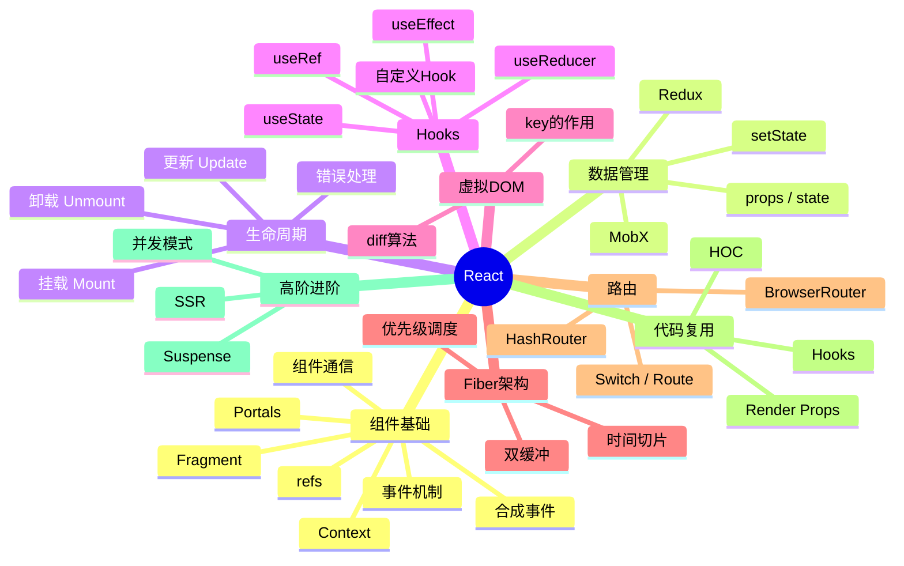

---

## 一、组件基础

### 1. React 事件机制

#### 合成事件（SyntheticEvent）

React 的事件并非绑定在真实的 DOM 节点上，而是通过**事件代理（Event Delegation）**的方式，将所有事件统一绑定在 `document` 上。当事件冒泡到 `document` 时，React 将事件内容封装并交由真正的处理函数运行。

```javascript
<div onClick={this.handleClick}>点我</div>
```

上述 JSX 经过编译后，并不会在 div 上注册 click 事件监听器，而是在 document 上统一托管。

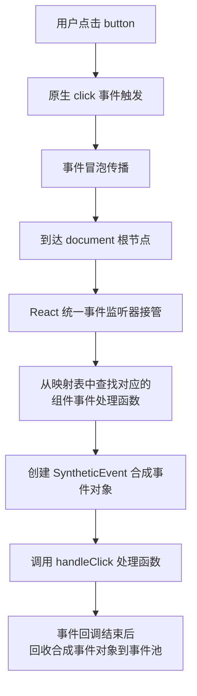

#### 实现合成事件的目的

| 目的 | 说明 |
|------|------|
| 抹平浏览器兼容差异 | 跨浏览器原生事件包装器 |
| 减少内存分配 | 事件池复用对象，避免频繁 GC |
| 统一管理 | 组件挂载/销毁时统一订阅/移除 |

#### React 事件与原生 HTML 事件的区别

| 对比项 | 原生事件 | React 事件 |
|--------|---------|-----------|
| 命名方式 | 全小写 `onclick` | 小驼峰 `onClick` |
| 处理函数语法 | 字符串 `"handle()"` | 函数 `{handleClick}` |
| 阻止默认行为 | `return false` | `e.preventDefault()` |
| 执行顺序 | 先执行 | 后执行（冒泡到 document） |

> **重要：** 合成事件冒泡到 document 才执行，若原生事件阻止冒泡，会导致合成事件不执行。

---

### 2. React 高阶组件、Render props、Hooks 对比

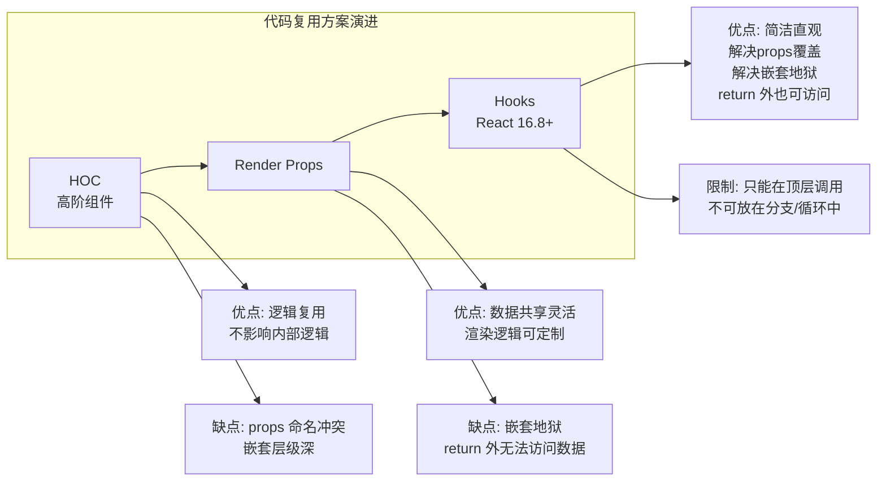

#### （1）高阶组件（HOC）

**定义：** 参数是组件，返回值是新组件的函数。

```javascript
function withSubscription(WrappedComponent, selectData) {
  return class extends React.Component {
    constructor(props) {
      super(props)
      this.state = { data: selectData(DataSource, props) }
    }
    render() {
      return <WrappedComponent data={this.state.data} {...this.props} />
    }
  }
}
```

**适用场景：** 权限控制、性能追踪、页面复用

**原理：** 装饰器模式——不改变被包裹组件，在外层套一层容器组件来增强功能。

#### （2）Render Props

**定义：** 组件间使用一个值为函数的 prop 共享代码。

```javascript
class DataProvider extends React.Component {
  state = { name: 'Tom' }
  render() {
    return <div>{this.props.render(this.state)}</div>
  }
}
// 使用
<DataProvider render={data => <h1>Hello {data.name}</h1>} />
```

#### （3）Hooks

```javascript
function useSubscription() {
  const [data] = useState(DataSource.getComments())
  return [data]
}
```

**总结：** Hooks 解决了 HOC 的 props 覆盖问题和 Render Props 的嵌套地狱问题。

---

### 3. Fiber 架构

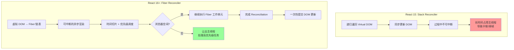

**Fiber 架构核心概念：**

- **Fiber Node：** 每个组件对应一个 Fiber 节点，构成 Fiber 树（单链表结构）
- **双缓冲：** `current` 树（当前 UI）和 `workInProgress` 树（内存中构建的新树）
- **时间切片（Time Slicing）：** 将一个渲染任务拆分成多个小单元，每执行完一个单元就让出主线程
- **优先级调度：** 任务分优先级，高优先级任务（如用户输入）可打断低优先级任务（如数据加载）

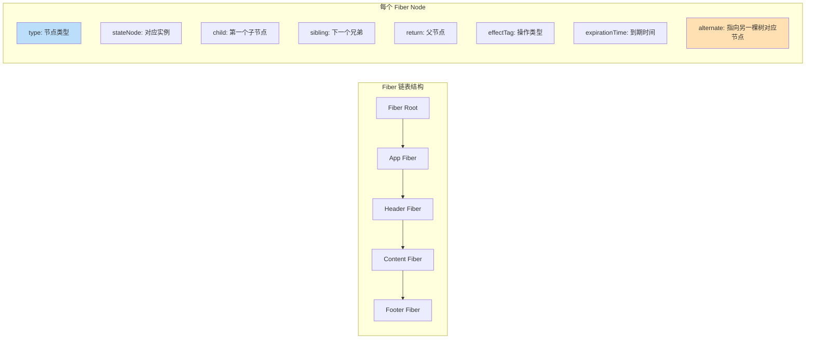

**解决问题：**

- 渲染过程可中断，让浏览器及时响应交互
- 分批延时操作 DOM，避免一次性大量操作
- 给浏览器喘息机会进行 JIT 编译优化和 reflow 修正

---

### 4. setState 流程（批量更新机制）

```mermaid
flowchart TD
    A["调用 setState"] --> B{"setState 入口函数"}
    B --> C["enqueueSetState\n将新的 state 放入\n_pendingStateQueue 队列"]
    C --> D["调用 enqueueUpdate"]
    D --> E{"batchingStrategy\nisBatchingUpdates?"}
    E -->|true 当前处于批量模式| F["推入 dirtyComponents 队列\n等待批量处理"]
    E -->|false 非批量模式| G["立即执行 batchedUpdates"]
    F --> H["同步代码执行完毕\n批量处理开始"]
    H --> I["合并 dirtyComponents 中的\n多个 setState 操作"]
    I --> J["执行 shouldComponentUpdate"]
    J --> K["重新渲染 Virtual DOM"]
    K --> L["Diff + Patch 更新真实 DOM"]
    G --> J
    
    subgraph 批量合并规则
        M1["相同属性: 只保留最后一次"]
        M2["函数式 setState("prev=>new"): 依次执行"]
        M3["null 值: 不触发重新渲染"]
    end
```

**setState 是同步还是异步？**

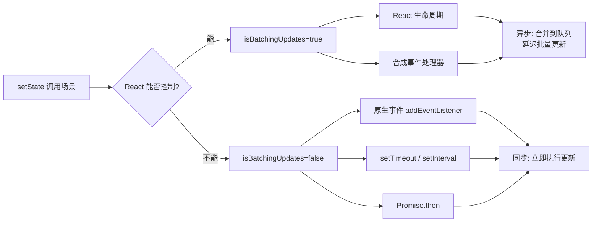

**源码级流程：**

```javascript
// 1. setState 入口
ReactComponent.prototype.setState = function (partialState, callback) {
  this.updater.enqueueSetState(this, partialState)
  if (callback) {
    this.updater.enqueueCallback(this, callback, 'setState')
  }
}

// 2. enqueueSetState 将 state 放入队列
enqueueSetState: function (publicInstance, partialState) {
  var internalInstance = getInternalInstanceReadyForUpdate(publicInstance, 'setState')
  var queue = internalInstance._pendingStateQueue || (internalInstance._pendingStateQueue = [])
  queue.push(partialState)
  enqueueUpdate(internalInstance)
}

// 3. enqueueUpdate 判断是否批量模式
function enqueueUpdate(component) {
  if (!batchingStrategy.isBatchingUpdates) {
    batchingStrategy.batchedUpdates(enqueueUpdate, component)
    return
  }
  dirtyComponents.push(component)
}
```

---

### 5. Virtual DOM & Diff 算法

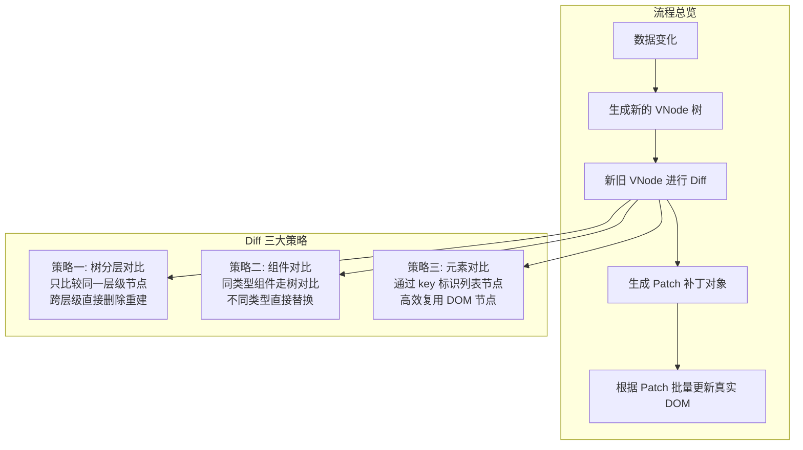

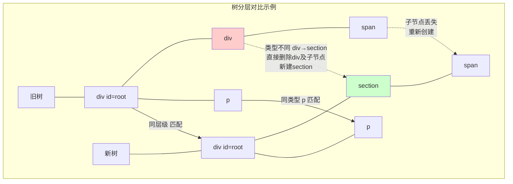

**key 的作用：**

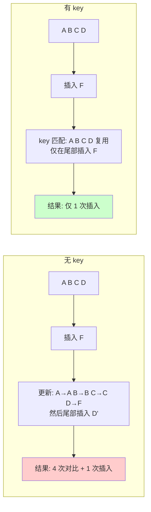

---

### 6. 组件生命周期（React 16+）

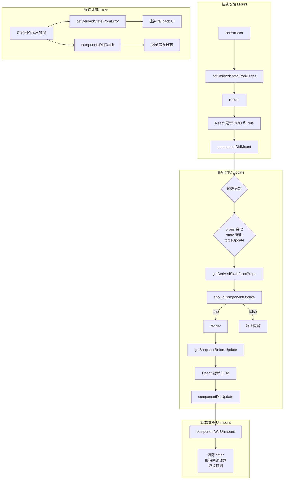

#### 各阶段详细说明

**挂载阶段调用顺序：**

| 方法 | 说明 |
|------|------|
| `constructor` | 初始化 state、绑定事件 this |
| `getDerivedStateFromProps(props, state)` | 静态方法，根据 props 映射 state |
| `render()` | **唯一必须实现的方法**，返回 JSX |
| `componentDidMount()` | DOM 已挂载，发起网络请求、操作 DOM |

**更新阶段调用顺序：**

| 方法 | 说明 |
|------|------|
| `getDerivedStateFromProps(props, state)` | 每次更新都会调用 |
| `shouldComponentUpdate(nextProps, nextState)` | 性能优化，返回 false 跳过渲染 |
| `render()` | 重新计算虚拟 DOM |
| `getSnapshotBeforeUpdate(prevProps, prevState)` | 获取更新前的 DOM 快照 |
| `componentDidUpdate(prevProps, prevState, snapshot)` | 更新完成，操作更新后的 DOM |

#### 废弃的生命周期（React 16+）

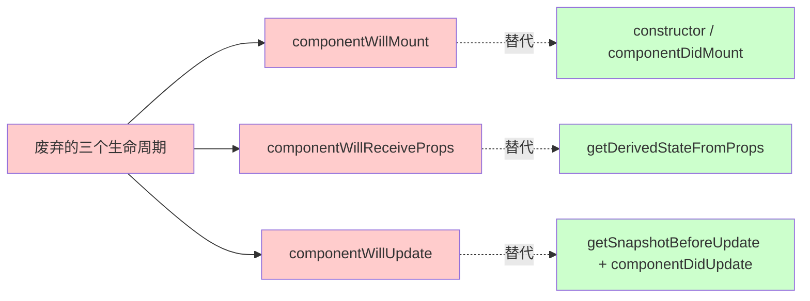

**废弃原因（Fiber 架构导致）：**

- Fiber 让渲染过程可中断，`render` 之前的生命周期可能被执行多次
- `componentWillMount`：功能可被 constructor 和 componentDidMount 替代
- `componentWillReceiveProps`：容易破坏单一数据源，被 `getDerivedStateFromProps` 替代
- `componentWillUpdate`：回调可能被多次调用，且无法可靠获取 DOM 信息

---

### 7. Reconciliation（协调）过程

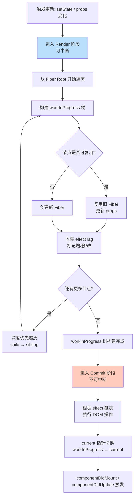

**三个阶段的职责：**

| 阶段 | 是否可中断 | 主要工作 |
|------|-----------|---------|
| Render | 可中断 | 构建 workInProgress 树，diff 对比，标记 effect |
| Pre-commit | 不可中断 | 读取 DOM 快照（getSnapshotBeforeUpdate） |
| Commit | 不可中断 | 执行 DOM 操作，触发生命周期 |

---

### 8. 组件通信方式

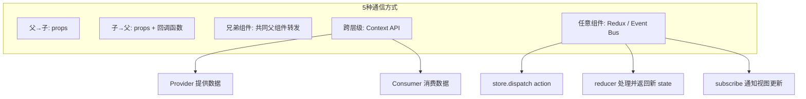

---

### 9. React.Component vs React.PureComponent

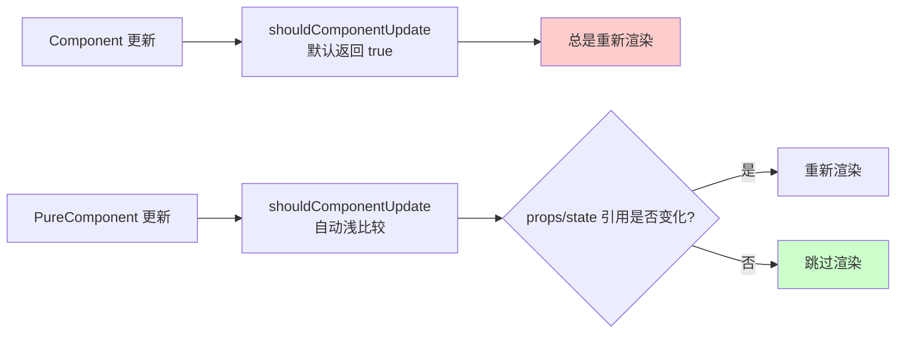

**注意：** PureComponent 进行**浅比较**，引用类型只比较地址。如需深比较的数据变更，必须创建新对象。

---

### 10. 受控组件 vs 非受控组件

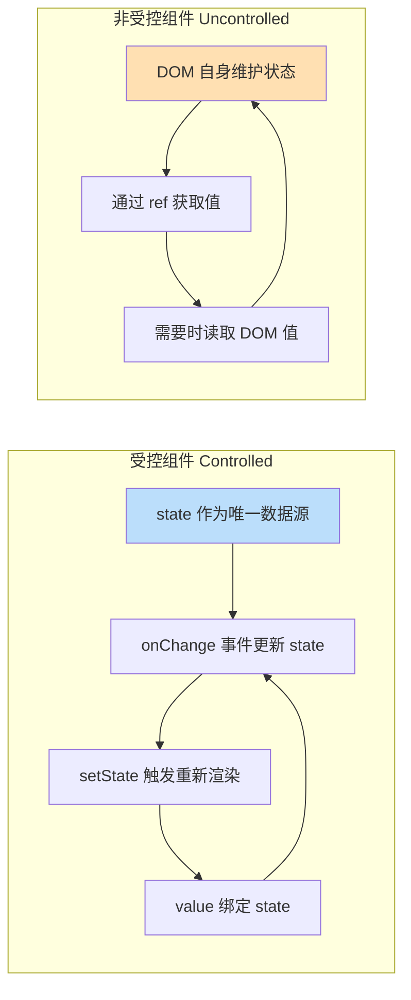

---

### 11. JSX 详解

#### JSX 的本质

JSX 是 **JavaScript XML** 的语法糖，让你能在 JS 中写类 HTML 结构。它最终会被 Babel 编译为 `React.createElement` 调用。

```jsx
// JSX 写法
const element = <h1 className="greeting">Hello, {name}!</h1>;

// Babel 编译后
const element = React.createElement(
  "h1",
  { className: "greeting" },
  "Hello, ", name, "!"
);
```

#### JSX 转换流程

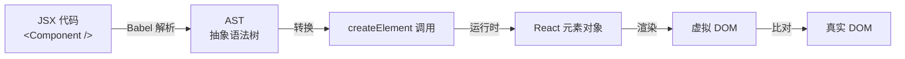

#### JSX 规则

```jsx
// ✅ 根元素唯一
return (
  <div>
    <p>Hello</p>
    <p>World</p>
  </div>
);

// ✅ 使用 Fragment 避免多余 DOM
return (
  <>
    <p>Hello</p>
    <p>World</p>
  </>
);

// ✅ 属性驼峰命名
<div className="card" data-testid="card" />

// ✅ 表达式插值（任意 JS 表达式）
<p>Count: {count * 2}</p>

// ✅ 条件渲染
{showTitle ? <h1>Title</h1> : null}
{showTitle && <h1>Title</h1>}
```

---

## 二、数据管理

### Redux 工作流

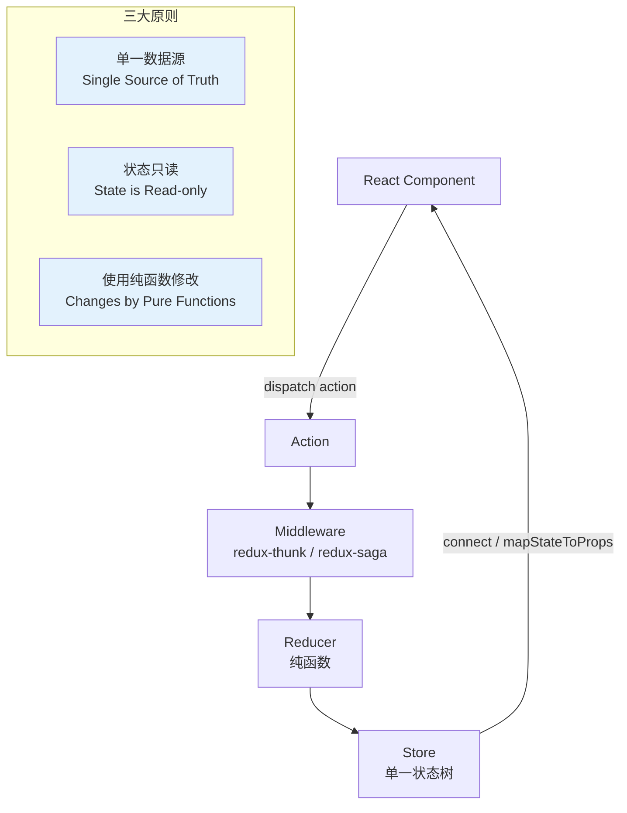

**Redux 中间件原理：**

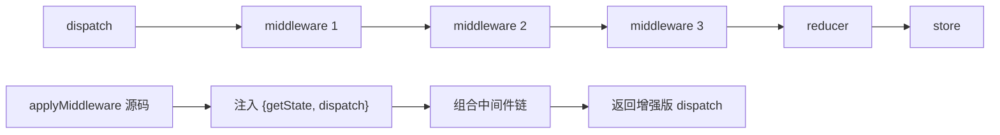

---

## 三、Hooks 详解

### Hooks 与 Class 生命周期对照

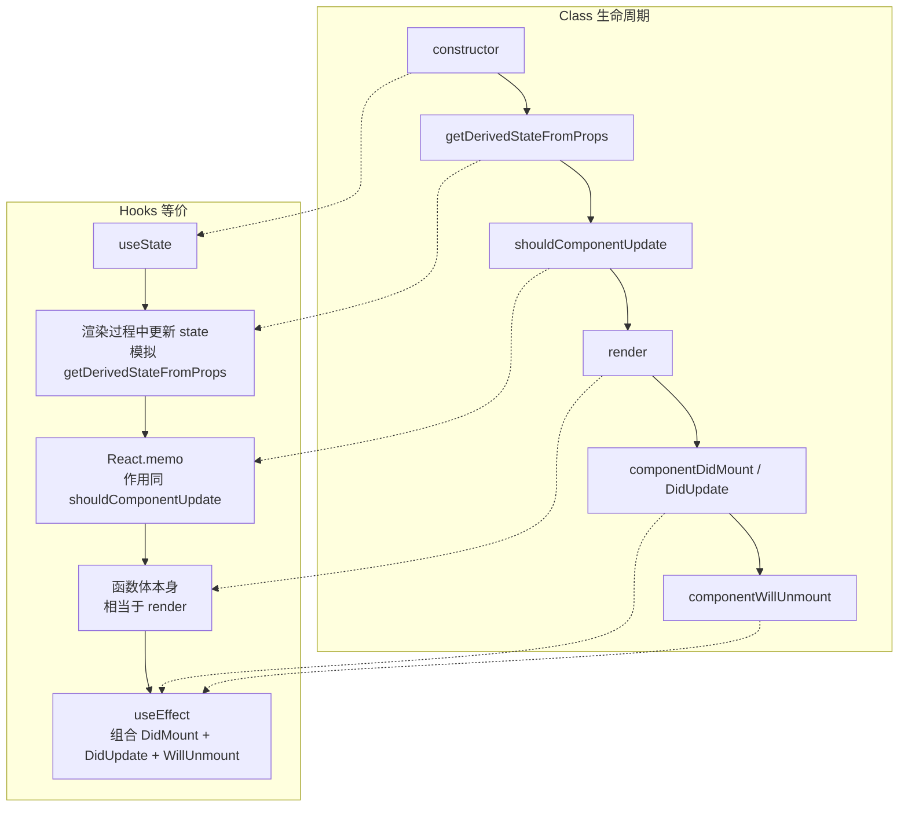

### useEffect vs useLayoutEffect

```mermaid
sequenceDiagram
    participant R as 组件渲染
    participant D as DOM 更新
    participant B as 浏览器绘制
    participant E as useEffect
    participant LE as useLayoutEffect
    
    Note over R,LE: 执行顺序对比
    
    R->>D: render 输出 VNode
    D->>B: React 更新真实 DOM
    
    Note over B: 浏览器尚未绘制屏幕
    
    D->>LE: useLayoutEffect (同步)
    LE->>D: 同步执行副作用，阻塞绘制
    D->>B: 浏览器绘制（已包含布局效果变更）
    
    B->>E: useEffect (异步)
    Note over E: 此时用户可见更新
    
    Note over E: useEffect 延迟执行\n不会阻塞浏览器绘制
```

---

### 3. 自定义 Hooks 实战

#### useAsync - 异步操作管理

```typescript
function useAsync<T>(
  asyncFunction: () => Promise<T>,
  immediate = true
) {
  const [state, setState] = useState<{
    status: 'idle' | 'pending' | 'success' | 'error';
    data: T | null;
    error: Error | null;
  }>({
    status: 'idle',
    data: null,
    error: null,
  });

  const execute = useCallback(async () => {
    setState({ status: 'pending', data: null, error: null });
    try {
      const response = await asyncFunction();
      setState({ status: 'success', data: response, error: null });
      return response;
    } catch (error) {
      setState({ status: 'error', data: null, error: error as Error });
    }
  }, [asyncFunction]);

  useEffect(() => {
    if (immediate) execute();
  }, [execute, immediate]);

  return { ...state, execute };
}

// 使用
function UserProfile({ userId }: { userId: string }) {
  const { status, data: user, error } = useAsync(
    () => fetch(`/api/users/${userId}`).then(r => r.json())
  );
  if (status === 'pending') return <div>Loading...</div>;
  if (status === 'error') return <div>Error: {error?.message}</div>;
  if (status === 'success') return <div>{user?.name}</div>;
}
```

#### useLocalStorage - 本地存储 Hook

```typescript
function useLocalStorage<T>(key: string, initialValue: T) {
  const [storedValue, setStoredValue] = useState<T>(() => {
    try {
      const item = window.localStorage.getItem(key);
      return item ? JSON.parse(item) : initialValue;
    } catch (error) {
      return initialValue;
    }
  });

  const setValue = (value: T | ((val: T) => T)) => {
    try {
      const valueToStore = value instanceof Function ? value(storedValue) : value;
      setStoredValue(valueToStore);
      window.localStorage.setItem(key, JSON.stringify(valueToStore));
    } catch (error) {
      console.error(error);
    }
  };

  return [storedValue, setValue] as const;
}

// 使用
function DarkModeToggle() {
  const [isDark, setIsDark] = useLocalStorage('darkMode', false);
  return <button onClick={() => setIsDark(!isDark)}>{isDark ? '🌙' : '☀️'}</button>;
}
```

#### useDebounce - 防抖 Hook

```typescript
function useDebounce<T>(value: T, delay: number): T {
  const [debouncedValue, setDebouncedValue] = useState(value);

  useEffect(() => {
    const handler = setTimeout(() => setDebouncedValue(value), delay);
    return () => clearTimeout(handler);
  }, [value, delay]);

  return debouncedValue;
}

// 使用
function SearchUsers() {
  const [search, setSearch] = useState('');
  const debouncedSearch = useDebounce(search, 500);

  useEffect(() => {
    if (debouncedSearch) fetchUsers(debouncedSearch);
  }, [debouncedSearch]);

  return <input value={search} onChange={(e) => setSearch(e.target.value)} />;
}
```

---

## 四、路由

### React Router 实现原理

```mermaid
flowchart TD
    subgraph HashRouter
        H1["URL: http://xxx/#/path"] --> H2["监听 hashchange 事件"]
        H2 --> H3["hash 变化 → 匹配路由"]
        H3 --> H4["渲染对应组件"]
    end
    
    subgraph BrowserRouter
        B1["URL: http://xxx/path"] --> B2["使用 History API"]
        B2 --> B3["pushState / replaceState\n改变 URL 不刷新页面"]
        B3 --> B4["监听 popstate 事件"]
        B4 --> B5["匹配路由 → 渲染组件"]
    end
    
    subgraph react-router 封装
        L1["history 库\n抹平 hash 与 history 差异"]
        L2["Route 组件\npath 匹配当前 URL"]
        L3["Switch 组件\n渲染第一个匹配的 Route"]
        L4["Link 组件\n阻止 a 默认行为\n通过 history 跳转"]
    end
```

---

## 五、React 与 Vue 对比

```mermaid
flowchart LR
    subgraph React
        R1["单向数据流"]
        R2["JSX 模板"]
        R3["不可变数据\n手动优化 shouldComponentUpdate"]
        R4["HOC 扩展"]
        R5["Create React App"]
        R6["React Native"]
    end
    
    subgraph Vue
        V1["双向数据绑定"]
        V2["HTML 模板"]
        V3["可变数据\n自动追踪依赖"]
        V4["Mixins 扩展"]
        V5["Vue CLI"]
        V6["Weex"]
    end
    
    C1["相同点"] --- C2["Virtual DOM"]
    C1 --- C3["组件化"]
    C1 --- C4["props 数据传递"]
    C1 --- C5["核心库 + 生态路由/状态管理"]
    
    style C1 fill:#e8f5e9
```

---

## 六、React 设计理念

1. **声明式：** 为每个状态设计简洁的视图，数据变更时 React 高效更新
2. **组件化：** 可组合、可复用、可维护、可测试
3. **虚拟 DOM：** 函数式 UI 编程 + 保证性能下限
4. **函数式编程：** 给定输入 → 确定输出，无副作用
5. **一次学习，随处编写：** Web / Native / SSR

---

## 七、总结脑图

```mermaid
mindmap
  root((React 面试要点))
    组件基础
      合成事件
      Fiber 架构可中断
      生命周期 16+
      通信方式5种
    数据流
      setState 批量合并
      props 不可变
      Redux 三大原则
      Redux 中间件
    性能优化
      PureComponent 浅比较
      React.memo
      shouldComponentUpdate
      key 优化列表
    代码复用
      HOC 装饰模式
      Render Props
      Hooks 更优方案
    核心机制
      虚拟 DOM
      Diff 算法 O(n)
      Reconciliation
      双缓冲 Fiber树
    未来特性
      并发模式 Concurrent
      Suspense 异步渲染
      Server Components
```

---

> 本文档由原版面试总结大幅扩展而成，增加了 Mermaid 可视化图表辅助理解，涵盖 React 核心概念、原理、流程、对比等全方位知识体系。

---

## 八、React 18/19 新特性

### 1. React 18 并发特性

#### startTransition 和 useTransition
- **startTransition**：标记非紧急更新，让高优先级更新（如用户输入）优先渲染
- **useTransition**：返回 `[isPending, startTransition]`，可获取过渡状态
- 适用场景：搜索过滤、大量数据渲染、页面切换

```tsx
const [isPending, startTransition] = useTransition();
const [query, setQuery] = useState('');

function handleChange(e) {
  // 高优先级：更新输入框
  setQuery(e.target.value);
  // 低优先级：过滤大量数据
  startTransition(() => {
    setFilteredResults(filterData(e.target.value));
  });
}
```

#### useDeferredValue
- 延迟更新某个值，类似于防抖但由 React 调度控制
- 常用于接收 props 的组件，让组件延迟响应变化的值

```tsx
const [query, setQuery] = useState('');
const deferredQuery = useDeferredValue(query);
// deferredQuery 会在空闲时更新，query 始终保持最新
```

#### Automatic Batching (自动批处理)
- React 18 之前：仅在事件处理函数中批量更新
- React 18：Promise、setTimeout、原生事件中也能自动批处理

```tsx
// React 18 中以下代码只触发一次渲染
setTimeout(() => {
  setCount(c => c + 1);
  setFlag(f => !f);
}, 1000);
```

#### Suspense 增强 (流式SSR)
- 服务端渲染支持 `<Suspense>` 包裹的组件流式输出 HTML
- 页面无需等待所有数据加载完成即可发送给客户端
- 结合 `streaming` 和 `selective hydration` 提升首屏性能

#### useId
- 生成唯一且稳定的 ID，用于 SSR 场景下的无障碍属性关联

```tsx
const id = useId();
return <><label htmlFor={id}>Name</label><input id={id} /></>;
```

#### useSyncExternalStore
- 用于订阅外部存储（如 Redux、Zustand），避免撕裂问题
- React 推荐第三方状态库使用此 API 作为桥梁

```tsx
const state = useSyncExternalStore(store.subscribe, store.getSnapshot);
```

#### useInsertionEffect
- 在 DOM 变更前同步执行，专用于 CSS-in-JS 库注入样式
- 比 `useEffect` 执行时机更早，避免样式闪烁

#### 并发渲染流程图

```mermaid
graph TD
    A["用户交互"] --> B{"优先级判断"}
    B -->|高优先级| C["立即渲染"]
    B -->|低优先级| D["startTransition"]
    D --> E["标记为过渡更新"]
    E --> F{"是否有高优更新插入?"}
    F -->|是| G["中断当前渲染"]
    G --> B
    F -->|否| H["完成渲染"]
    H --> I["提交到DOM"]

    style C fill:#4CAF50,color:#fff
    style D fill:#FF9800,color:#fff
    style I fill:#2196F3,color:#fff
```

### 2. React 19 新特性

#### use() 钩子
- 在渲染阶段直接读取 Promise 或 Context 的值
- 配合 `<Suspense>` 使用，让组件更简洁

```tsx
function Comments({ commentsPromise }) {
  const comments = use(commentsPromise); // 直接读取 Promise
  return <ul>{comments.map(c => <li key={c.id}>{c.text}</li>)}</ul>;
}

// 配合 Context
const theme = use(ThemeContext); // 替代 useContext
```

#### useOptimistic (乐观更新)
- 在异步操作完成前先显示预期结果，提升用户体验

```tsx
const [optimisticState, addOptimistic] = useOptimistic(
  state,
  (currentState, optimisticValue) => ({ ...currentState, ...optimisticValue })
);

async function handleSubmit(formData) {
  addOptimistic({ text: formData.get('text'), pending: true });
  await saveToServer(formData); // 实际请求
}
```

#### useFormStatus
- 获取表单提交状态，替代手动管理 loading state

```tsx
function SubmitButton() {
  const { pending, data, method, action } = useFormStatus();
  return <button disabled={pending}>{pending ? '提交中...' : '提交'}</button>;
}
```

#### useActionState
- 管理表单 Action 的状态和返回值

```tsx
const [state, formAction, isPending] = useActionState(
  async (prevState, formData) => {
    const result = await updateName(formData.get('name'));
    return result;
  },
  null
);
```

#### Server Components (RSC) 稳定
- 服务端组件成为 React 19 的一等公民
- 服务端组件不产生 JavaScript bundle，减少客户端体积

#### Server Actions
- 在服务端组件中定义可直接调用的异步函数

```tsx
// app/actions.ts
'use server';
export async function createItem(formData: FormData) {
  const item = await db.insert(formData);
  revalidatePath('/items');
  return item;
}
```

#### ref 作为 prop 直接传递
- React 19 中不再需要 `forwardRef`，ref 可直接作为 prop

```tsx
// React 19 写法
function MyInput({ ref, ...props }) {
  return <input ref={ref} {...props} />;
}
```

#### React 新旧版本对比

```mermaid
graph LR
    subgraph React 18
        A1["Concurrent Mode"]
        B1["Suspense SSR"]
        C1["Auto Batching"]
        D1["useId / useSyncExternalStore"]
    end

    subgraph React 19
        A2["use 读取Promise/Context"]
        B2["useOptimistic 乐观更新"]
        C2["Server Components 稳定"]
        D2["Server Actions"]
        E2["ref 直接传"]
        F2["useFormStatus / useActionState"]
    end

    A1 --> A2
    B1 --> C2
    C1 --> A2

    style A2 fill:#E91E63,color:#fff
    style B2 fill:#9C27B0,color:#fff
    style C2 fill:#FF5722,color:#fff
    style D2 fill:#4CAF50,color:#fff
```

### 3. React Server Components (RSC) 详解

#### 客户端组件 vs 服务端组件

| 对比维度 | 服务端组件 (RSC) | 客户端组件 |
|---------|----------------|-----------|
| 运行环境 | 服务器 | 浏览器 |
| Bundle 大小 | 0 KB（不发送到客户端） | 包含全部 JS |
| 数据获取 | 直接访问数据库/文件系统 | 通过 API 调用 |
| 状态/效果 | ❌ 不支持 useState/useEffect | ✅ 完整支持 |
| 交互能力 | ❌ 不支持事件处理 | ✅ 完整支持 |
| 渲染时机 | 每次请求时 | 客户端渲染/水合 |

#### RSC 流式传输
- 服务端组件渲染结果为 `RSC Payload`（一种特殊格式）
- 客户端逐步接收并渲染，无需等待所有 RSC 完成
- 结合 `<Suspense>` 实现按需加载

#### Server-only code vs Client-only code

```tsx
// ✅ 服务端代码 - 不会泄漏到客户端
import 'server-only';
import fs from 'fs';
import db from 'database';

// ❌ 客户端代码 - 'use client' 指令
'use client';
import { useState } from 'react';

// ⚠️ 共享组件 - 同时在服务端和客户端渲染
function SharedComponent() { /* 无状态、无副作用、无 API 调用 */ }
```

#### 与 SSR 的区别

| 维度 | SSR | RSC |
|-----|-----|-----|
| 输出 | HTML | RSC Payload（序列化数据结构） |
| 水合 | 需要完整水合 | 选择性水合 |
| Bundle | 全部 JS 发送到客户端 | 服务端组件不产生 JS |
| 数据源 | 通常在服务端获取 | 可无限深层嵌套获取 |
| 交互 | 水合后才有交互 | 客户端组件部分立即可交互 |

#### 架构对比图

```mermaid
graph TB
    subgraph "传统 SSR"
        A1["请求"] --> B1["服务端获取所有数据"]
        B1 --> C1["渲染完整 HTML"]
        C1 --> D1["发送 HTML + 全部 JS"]
        D1 --> E1["客户端水合"]
    end

    subgraph "RSC 架构"
        A2["请求"] --> B2["服务端渲染 RSC"]
        B2 --> C2["流式传输 RSC Payload"]
        C2 --> D2{"按 Suspense 边界"}
        D2 -->|就绪部分| E2["客户端增量渲染"]
        D2 -->|等待中| F2["显示 fallback"]
        F2 --> D2
    end

    style E1 fill:#FF9800,color:#fff
    style E2 fill:#4CAF50,color:#fff
    style C2 fill:#2196F3,color:#fff
```

---

## 九、现代React状态管理

### 1. Zustand

#### 极简状态管理
- 轻量级（~1KB），无 Provider 包裹
- 基于不可变数据模式的 Mutable API
- 天然支持 TypeScript
- 无需 action/reducer 模板代码

#### 创建 Store

```tsx
import { create } from 'zustand';

interface BearStore {
  bears: number;
  increase: () => void;
  reset: () => void;
}

const useBearStore = create<BearStore>((set) => ({
  bears: 0,
  increase: () => set((state) => ({ bears: state.bears + 1 })),
  reset: () => set({ bears: 0 }),
}));

// 在组件中使用
function BearCounter() {
  const bears = useBearStore((state) => state.bears);
  return <h1>{bears} around here...</h1>;
}
```

#### 与 Redux 对比

| 维度 | Zustand | Redux Toolkit |
|------|---------|---------------|
| Bundle 大小 | ~1KB | ~12KB |
| Provider | 不需要 | 需要 `<Provider>` |
| 模板代码 | 极少 | 中等（slice/reducer/action） |
| 学习曲线 | 低 | 中 |
| DevTools | 支持 | 内置 |
| 中间件 | 插件式 | 内置 |

#### 数据流图

```mermaid
graph LR
    A["组件"] -->|调用 action| B["Zustand Store"]
    B -->|返回新状态| C{"不可变更新"}
    C --> D["触发订阅"]
    D -->|精确选择| E["订阅该片段的组件"]
    E -->|重新渲染| A

    subgraph Store 内部
        B --> F["set 函数"]
        F --> C
    end

    style B fill:#E91E63,color:#fff
    style C fill:#FF9800,color:#fff
    style D fill:#4CAF50,color:#fff
```

#### 代码示例：带中间件

```tsx
import { create } from 'zustand';
import { persist, devtools } from 'zustand/middleware';

interface Store {
  count: number;
  increment: () => void;
}

const useStore = create<Store>()(
  devtools(
    persist(
      (set) => ({
        count: 0,
        increment: () => set((state) => ({ count: state.count + 1 })),
      }),
      { name: 'count-storage' }
    )
  )
);
```

### 2. TanStack Query (React Query)

#### 服务端状态管理
- 将服务端状态与客户端状态分离
- 自动缓存、重新获取、后台刷新
- 减少 90% 的样板代码

#### useQuery / useMutation

```tsx
import { useQuery, useMutation, useQueryClient } from '@tanstack/react-query';

// 获取数据
function Todos() {
  const { data, isLoading, error } = useQuery({
    queryKey: ['todos'],
    queryFn: () => fetch('/api/todos').then(r => r.json()),
    staleTime: 5 * 60 * 1000, // 5分钟内不重新获取
    cacheTime: 30 * 60 * 1000, // 30分钟缓存
  });

  if (isLoading) return <Spinner />;
  if (error) return <Error error={error} />;
  return <TodoList todos={data} />;
}

// 修改数据
function AddTodo() {
  const queryClient = useQueryClient();
  const mutation = useMutation({
    mutationFn: (newTodo) => fetch('/api/todos', {
      method: 'POST',
      body: JSON.stringify(newTodo),
    }),
    onSuccess: () => {
      queryClient.invalidateQueries({ queryKey: ['todos'] });
    },
  });

  return (
    <button onClick={() => mutation.mutate({ text: 'New Todo' })}>
      {mutation.isPending ? 'Adding...' : 'Add Todo'}
    </button>
  );
}
```

#### 缓存和重新获取策略

| 策略 | 说明 | 配置 |
|------|------|------|
| staleTime | 数据过期时间 | `staleTime: 5000` |
| cacheTime | 缓存保留时间 | `cacheTime: 300000` |
| refetchOnWindowFocus | 窗口聚焦时重新获取 | `refetchOnWindowFocus: true` |
| refetchInterval | 轮询间隔 | `refetchInterval: 30000` |
| retry | 失败重试次数 | `retry: 3` |

#### 与 Redux 的职责划分

```mermaid
graph LR
    subgraph "TanStack Query"
        A["服务端数据"] -->|useQuery| B["缓存"]
        B -->|自动同步| A
        C["useMutation"] -->|变更| A
    end

    subgraph "Redux / Zustand"
        D["客户端数据"] -->|dispatch| E["Reducer"]
        E --> F["Store"]
        F -->|select| G["组件"]
    end

    subgraph "配合使用"
        B -->|只读| H["组件展示"]
        F -->|可变| H
    end

    style A fill:#2196F3,color:#fff
    style B fill:#4CAF50,color:#fff
    style F fill:#E91E63,color:#fff
```

#### 数据获取流程图

```mermaid
sequenceDiagram
    participant C as Component
    participant Q as QueryClient
    participant Cache as 缓存
    participant API as API Server

    C->>Q: useQuery(['todos'])
    Q->>Cache: 检查缓存

    alt 缓存命中且未过期
        Cache-->>C: 返回缓存数据
    else 缓存未命中或过期
        Q->>API: 发送请求
        API-->>Q: 返回数据
        Q->>Cache: 更新缓存
        Cache-->>C: 返回数据
    end

    Note over C,API: 窗口重新聚焦时自动刷新
    Q->>API: refetchOnWindowFocus
    API-->>Q: 最新数据
    Q->>Cache: 对比更新
```

### 3. Jotai / Recoil

#### 原子化状态管理
- 以原子（Atom）为最小状态单元
- 组合原子形成派生状态
- 按需渲染，避免不必要的组件重渲染

#### Jotai 示例

```tsx
import { atom, useAtom } from 'jotai';

// 基础原子
const countAtom = atom(0);
// 派生原子
const doubledAtom = atom((get) => get(countAtom) * 2);

function Counter() {
  const [count, setCount] = useAtom(countAtom);
  const [doubled] = useAtom(doubledAtom);

  return (
    <div>
      <p>Count: {count}</p>
      <p>Doubled: {doubled}</p>
      <button onClick={() => setCount(c => c + 1)}>+1</button>
    </div>
  );
}
```

#### 与 Context API 对比

| 维度 | Context API | Jotai/Recoil |
|------|-------------|--------------|
| 渲染优化 | 所有消费者重渲染 | 仅关联原子变化时重渲染 |
| 组合性 | 多层 Provider 嵌套 | 原子自由组合 |
| 代码拆分 | 需要多个 Context | 原子可分散定义 |
| TypeScript | 中等 | 优秀 |
| Bundle 大小 | 内置 | ~3KB (Jotai) |

#### 按需渲染

```mermaid
graph TD
    subgraph "Context API"
        A["Provider"] --> B["Consumer A"]
        A --> C["Consumer B"]
        A --> D["Consumer C"]
        B -.->|任何值变化| B
        B -.->|全部重渲染| C
        B -.->|全部重渲染| D
    end

    subgraph "Jotai Atoms"
        E["Atom A"] --> F["Component A"]
        G["Atom B"] --> H["Component B"]
        I["Atom C"] --> J["Component C"]
        F -.->|仅A重渲染| F
        H -.->|仅B重渲染| H
    end

    style A fill:#FF5722,color:#fff
    style E fill:#4CAF50,color:#fff
    style G fill:#2196F3,color:#fff
    style I fill:#9C27B0,color:#fff
```

---

## 十、Next.js (React元框架)

### 1. App Router vs Pages Router

#### 文件系统路由

**Pages Router（旧）**
```
pages/
  index.tsx        → /
  about.tsx        → /about
  blog/
    [slug].tsx     → /blog/:slug
```

**App Router（新，推荐）**
```
app/
  page.tsx         → /
  layout.tsx       → 根布局
  about/
    page.tsx       → /about
  blog/
    [slug]/
      page.tsx     → /blog/:slug
  api/
    route.ts       → /api
```

#### Layout 嵌套布局
- App Router 通过 `layout.tsx` 实现持久化布局
- 布局切换时不会卸载内部组件，保持状态

```tsx
// app/layout.tsx - 根布局
export default function RootLayout({ children }: { children: React.ReactNode }) {
  return (
    <html>
      <body>
        <Header />
        <nav>导航</nav>
        <main>{children}</main>
        <Footer />
      </body>
    </html>
  );
}

// app/dashboard/layout.tsx - 仪表盘布局
export default function DashboardLayout({ children }: { children: React.ReactNode }) {
  return (
    <section>
      <DashboardSidebar />
      {children}
    </section>
  );
}
```

#### Loading / Error 边界
- `loading.tsx` - 自动包裹 Suspense，显示加载状态
- `error.tsx` - 自动包裹 ErrorBoundary，捕获渲染错误
- `not-found.tsx` - 404 页面

```tsx
// app/dashboard/loading.tsx
export default function Loading() {
  return <div>Loading dashboard...</div>;
}

// app/dashboard/error.tsx
'use client';
export default function Error({ error, reset }: {
  error: Error;
  reset: () => void;
}) {
  return (
    <div>
      <h2>Something went wrong!</h2>
      <button onClick={() => reset()}>Try again</button>
    </div>
  );
}
```

#### 路由对比图

```mermaid
graph TD
    subgraph "Pages Router (旧)"
        A1["pages/index.tsx"] -->|CSR/SSR| B1["传统页面"]
        C1["_app.tsx"] -->|全局包装| A1
        D1["_document.tsx"] -->|HTML结构| A1
    end

    subgraph "App Router (新)"
        A2["app/layout.tsx"] --> B2["根Layout，持久化"]
        B2 --> C2["app/page.tsx"]
        B2 --> D2["app/dashboard"]
        D2 --> E2["dashboard layout.tsx"]
        E2 --> F2["dashboard page.tsx"]
        E2 --> G2["dashboard loading.tsx"]
        E2 --> H2["dashboard error.tsx"]
        G2 -->|Suspense| I2["Loading UI"]
        H2 -->|ErrorBoundary| J2["Error UI"]
    end

    style A2 fill:#4CAF50,color:#fff
    style B2 fill:#2196F3,color:#fff
    style E2 fill:#FF9800,color:#fff
    style G2 fill:#9C27B0,color:#fff
    style H2 fill:#E91E63,color:#fff
```

### 2. 数据获取模式

#### Server-side fetching (async 组件 fetch)
- App Router 中，服务端组件可以直接 `async` + `await`

```tsx
// app/posts/page.tsx
async function PostsPage() {
  const posts = await fetch('https://api.example.com/posts', {
    next: { revalidate: 60 } // ISR: 60秒后重新验证
  }).then(r => r.json());

  return (
    <ul>
      {posts.map(post => (
        <li key={post.id}>{post.title}</li>
      ))}
    </ul>
  );
}
```

#### Static Generation
- 构建时生成静态 HTML，适合内容型页面

```tsx
// 静态生成（构建时）
export const dynamic = 'force-static';

async function AboutPage() {
  const content = await getContent(); // 构建时获取
  return <article>{content}</article>;
}
```

#### Incremental Static Regeneration (ISR)
- 构建后按需重新生成静态页面，结合静态和动态优势

```tsx
// app/products/[id]/page.tsx
interface Props {
  params: { id: string };
}

async function ProductPage({ params }: Props) {
  const product = await fetch(`https://api.example.com/products/${params.id}`, {
    next: { revalidate: 300 } // 5分钟后重新验证
  }).then(r => r.json());

  return <ProductDetail product={product} />;
}

// 预生成热门商品页面
export async function generateStaticParams() {
  const products = await getTopProducts(100);
  return products.map(p => ({ id: p.id }));
}
```

#### Streaming SSR
- 使用 `loading.tsx` 和 `<Suspense>` 实现流式渲染
- 页面无需等待所有数据就绪即可开始发送

```tsx
import { Suspense } from 'react';

async function Dashboard() {
  return (
    <div>
      <h1>Dashboard</h1>
      <Suspense fallback={<SlowWidgetSkeleton />}>
        <SlowWidget />
      </Suspense>
      <Suspense fallback={<FastWidgetSkeleton />}>
        <FastWidget />
      </Suspense>
    </div>
  );
}
```

### 3. 缓存策略

#### Full Route Cache
- 静态路由默认在构建时缓存
- 后续请求直接返回缓存 HTML
- 通过 `revalidate` 或 `dynamic` 配置控制

#### Data Cache
- `fetch` 响应默认缓存
- 通过 `cache: 'no-store'` 或 `next: { revalidate }` 控制

```tsx
// 不缓存
fetch(url, { cache: 'no-store' });
// 按时间重新验证
fetch(url, { next: { revalidate: 60 } });
// 手动重新验证
import { revalidatePath, revalidateTag } from 'next/cache';
revalidatePath('/posts');
revalidateTag('posts');
```

#### Router Cache
- 客户端路由缓存，预加载即将访问的页面
- 导航瞬间完成，无需等待服务端响应
- 通过 `prefetch` 或 `<Link prefetch>` 控制

#### 缓存层次图

```mermaid
graph TB
    subgraph "请求生命周期"
        A["用户请求"] --> B["Router Cache"]
        B -->|命中| C["客户端缓存页面"]
        B -->|未命中| D["Next.js Server"]
    end

    subgraph "服务端缓存层"
        D --> E["Full Route Cache"]
        E -->|命中| F["返回缓存的HTML"]
        E -->|未命中| G["渲染组件"]
        G --> H["Data Cache"]
        H -->|命中| I["使用缓存数据"]
        H -->|未命中| J["执行 fetch / DB查询"]
        J --> K["写入 Data Cache"]
        I --> L["生成HTML"]
        K --> L
        L --> M["写入 Full Route Cache"]
    end

    M --> N["返回HTML给客户端"]
    N --> O["更新 Router Cache"]

    style B fill:#4CAF50,color:#fff
    style E fill:#2196F3,color:#fff
    style H fill:#FF9800,color:#fff
    style M fill:#9C27B0,color:#fff
```

---

## 十一、React 设计模式和最佳实践

### 1. 现代组件模式

#### Compound Components (复合组件)
- 多个子组件共享隐式状态，无需手动传递 props

```tsx
import { createContext, useContext, useState } from 'react';

const AccordionContext = createContext(null);

function Accordion({ children }) {
  const [openIndex, setOpenIndex] = useState(null);
  return (
    <AccordionContext.Provider value={{ openIndex, setOpenIndex }}>
      <div className="accordion">{children}</div>
    </AccordionContext.Provider>
  );
}

function Item({ index, children }) {
  const { openIndex, setOpenIndex } = useContext(AccordionContext);
  const isOpen = openIndex === index;
  return (
    <div className="accordion-item">
      <button onClick={() => setOpenIndex(isOpen ? null : index)}>
        {children}
      </button>
      {isOpen && <div className="accordion-content">{children}</div>}
    </div>
  );
}

Accordion.Item = Item; // 复合组件
// 使用: <Accordion><Accordion.Item index={0}>内容</Accordion.Item></Accordion>
```

#### Control Props (受控属性)
- 组件接受外部控制的状态，同时支持非受控模式

```tsx
function Toggle({ on, onChange, defaultOn = false }) {
  const isControlled = on !== undefined;
  const [internalOn, setInternalOn] = useState(defaultOn);
  const isOn = isControlled ? on : internalOn;

  function toggle() {
    if (isControlled) {
      onChange?.(!isOn);
    } else {
      setInternalOn(!isOn);
    }
  }

  return <button onClick={toggle}>{isOn ? 'ON' : 'OFF'}</button>;
}
```

#### State Reducer (状态归约器)
- 允许使用者覆盖内部状态变更逻辑

```tsx
function useToggle({ reducer = defaultReducer } = {}) {
  const [state, dispatch] = useReducer(reducer, { on: false });

  function toggle() {
    dispatch({ type: 'toggle' });
  }

  return { on: state.on, toggle };
}

// 使用者自定义 reducer
function customReducer(state, action) {
  switch (action.type) {
    case 'toggle':
      return { on: !state.on };
    default:
      return state;
  }
}
```

#### Props Collection (属性集合)
- 将一组相关 props 合并为一个集合返回

```tsx
function useToggle() {
  const [on, setOn] = useState(false);
  const toggle = () => setOn(!on);

  const getTogglerProps = ({ onClick, ...props } = {}) => ({
    'aria-expanded': on,
    onClick: () => {
      onClick?.();
      toggle();
    },
    ...props,
  });

  return { on, toggle, getTogglerProps };
}

// 使用
function MyComponent() {
  const { on, getTogglerProps } = useToggle();
  return <button {...getTogglerProps({ onClick: () => console.log('clicked') })}>
    {on ? 'ON' : 'OFF'}
  </button>;
}
```

### 2. React 性能优化

#### React.memo 最佳实践
- 仅对纯展示组件使用，避免不必要的重渲染
- 配合 `useMemo` 传递稳定引用避免失效
- 不要在所有地方滥用

```tsx
const ExpensiveList = React.memo(function ExpensiveList({ items, onItemClick }) {
  return items.map(item => (
    <div key={item.id} onClick={() => onItemClick(item.id)}>
      {item.name}
    </div>
  ));
});
```

#### useMemo / useCallback 合理使用

```tsx
// ✅ 需要：计算开销大
const sortedList = useMemo(() => {
  return items.sort((a, b) => a.name.localeCompare(b.name));
}, [items]);

// ✅ 需要：作为依赖传递给 useEffect / React.memo
const handleClick = useCallback((id) => {
  dispatch({ type: 'SELECT', payload: id });
}, [dispatch]);

// ❌ 不需要：简单计算
const fullName = `${firstName} ${lastName}`;

// ❌ 不需要：作为 prop 传递给原生 DOM 元素
<div onClick={() => setCount(c => c + 1)} />
```

#### 虚拟列表 (react-window / react-virtuoso)

```tsx
import { FixedSizeList } from 'react-window';

function VirtualList({ items }) {
  const Row = ({ index, style }) => (
    <div style={style}>
      {items[index].name}
    </div>
  );

  return (
    <FixedSizeList
      height={400}
      itemCount={items.length}
      itemSize={50}
      width={300}
    >
      {Row}
    </FixedSizeList>
  );
}
```

#### Code Splitting (React.lazy + Suspense)

```tsx
import { lazy, Suspense } from 'react';

const HeavyComponent = lazy(() => import('./HeavyComponent'));

function App() {
  return (
    <Suspense fallback={<Loading />}>
      <HeavyComponent />
    </Suspense>
  );
}
```

#### Bundle 分析优化
- 使用 `vite-bundle-visualizer` 或 `webpack-bundle-analyzer`
- 分析首屏不必要的第三方库
- 动态导入大型库（`import('moment')` → 按需使用）
- 使用 `lodash-es` 替代 `lodash`

### 3. 测试策略

#### Vitest + React Testing Library

```tsx
import { render, screen, fireEvent } from '@testing-library/react';
import { describe, it, expect, vi } from 'vitest';
import Counter from './Counter';

describe('Counter', () => {
  it('renders initial count', () => {
    render(<Counter />);
    expect(screen.getByText('Count: 0')).toBeInTheDocument();
  });

  it('increments count on click', () => {
    render(<Counter />);
    fireEvent.click(screen.getByText('+1'));
    expect(screen.getByText('Count: 1')).toBeInTheDocument();
  });
});
```

#### Hooks 测试

```tsx
import { renderHook, act } from '@testing-library/react';
import useCounter from './useCounter';

describe('useCounter', () => {
  it('should increment counter', () => {
    const { result } = renderHook(() => useCounter());

    act(() => {
      result.current.increment();
    });

    expect(result.current.count).toBe(1);
  });
});
```

#### E2E 测试 (Playwright)

```tsx
import { test, expect } from '@playwright/test';

test('user can complete purchase flow', async ({ page }) => {
  await page.goto('/products');
  await page.click('[data-testid="add-to-cart"]');
  await expect(page.locator('.cart-count')).toHaveText('1');
  await page.click('[data-testid="checkout"]');
  await expect(page).toHaveURL('/checkout');
});
```

### 4. React Router v6+

#### 嵌套路由

```tsx
import { createBrowserRouter, RouterProvider, Outlet } from 'react-router-dom';

const router = createBrowserRouter([
  {
    path: '/',
    element: <RootLayout />,
    children: [
      { index: true, element: <Home /> },
      {
        path: 'dashboard',
        element: <DashboardLayout />,
        children: [
          { index: true, element: <DashboardHome /> },
          { path: 'settings', element: <Settings /> },
        ],
      },
      { path: 'products/:id', element: <ProductDetail /> },
    ],
  },
]);

function RootLayout() {
  return (
    <div>
      <Header />
      <Outlet /> {/* 子路由在此渲染 */}
    </div>
  );
}

export default function App() {
  return <RouterProvider router={router} />;
}
```

#### loaders / actions

```tsx
// router 配置
const router = createBrowserRouter([
  {
    path: '/products/:id',
    element: <ProductDetail />,
    loader: async ({ params }) => {
      const product = await fetch(`/api/products/${params.id}`);
      return product.json();
    },
    action: async ({ request, params }) => {
      const formData = await request.formData();
      await fetch(`/api/products/${params.id}`, {
        method: 'PUT',
        body: formData,
      });
      return { success: true };
    },
  },
]);

// 组件中使用
import { useLoaderData, useActionData, Form } from 'react-router-dom';

function ProductDetail() {
  const product = useLoaderData();
  const actionData = useActionData();

  return (
    <div>
      <h1>{product.name}</h1>
      <Form method="put">
        <input name="price" defaultValue={product.price} />
        <button type="submit">更新</button>
        {actionData?.success && <p>更新成功</p>}
      </Form>
    </div>
  );
}
```

#### defer / Await
- 延迟数据加载，配合 Suspense 实现流式加载

```tsx
import { defer, Await, useLoaderData } from 'react-router-dom';
import { Suspense } from 'react';

// loader 返回 defer
async function loader() {
  const productPromise = fetch('/api/product').then(r => r.json());
  const reviewsPromise = fetch('/api/reviews').then(r => r.json());

  return defer({
    product: await productPromise, // 等待 product
    reviews: reviewsPromise, // 延迟 reviews
  });
}

function ProductPage() {
  const data = useLoaderData();

  return (
    <div>
      <ProductDetail product={data.product} />
      <Suspense fallback={<ReviewsSkeleton />}>
        <Await resolve={data.reviews}>
          {(reviews) => <ReviewsList reviews={reviews} />}
        </Await>
      </Suspense>
    </div>
  );
}
```

#### 路由架构图

```mermaid
graph TD
    A["createBrowserRouter"] --> B["根路由 /"]
    B --> C["RootLayout"]
    C --> D["Outlet 子路由出口"]

    B --> E["首页 index"]
    B --> F["dashboard 布局"]
    F --> G["DashboardLayout"]
    G --> H["Dashboard Outlet"]
    H --> I["首页 Dashboard"]
    H --> J["settings 页面"]

    B --> K["products/:id"]
    K --> L["loader 获取数据"]
    K --> M["action 提交表单"]
    L --> N["useLoaderData"]
    M --> O["useActionData"]

    B --> P["* 404页面"]

    style C fill:#4CAF50,color:#fff
    style G fill:#2196F3,color:#fff
    style L fill:#FF9800,color:#fff
    style M fill:#E91E63,color:#fff
```

---

## 十二、React 面试常考对比

### 1. React 18 vs React 19 vs React 20 关键变化

| 特性 | React 18 (2022) | React 19 (2024) | React 20 (2025+) |
|------|-----------------|-----------------|------------------|
| 并发模式 | 可选启用 | 默认启用 | 默认启用，更深度集成 |
| Scheduler | 基础优先级 | 改进调度算法 | 自动优先级推断 |
| startTransition | ✅ | ✅ 增强 | ✅ 自动 |
| use() | ❌ | ✅ 读取Promise/Context | ✅ 增强 |
| useOptimistic | ❌ | ✅ | ✅ 自动乐观更新 |
| Server Components | 实验性 | ✅ 稳定 | ✅ 默认推荐 |
| Server Actions | ❌ | ✅ | ✅ |
| ref 传参 | forwardRef | 直接传 ref | 直接传 ref |
| useFormStatus | ❌ | ✅ | ✅ |
| useActionState | ❌ | ✅ | ✅ |
| Compiler (React Forget) | 实验性 | ✅ 自动 memo | ✅ 默认 |
| 元框架集成 | 基础 | 深化 | 原生支持 |

### 2. 常见 Hooks 实现原理

#### useState 实现原理

```tsx
// 简化版 useState 实现（基于 Fiber 架构）
let stateIndex = 0;
const stateQueue = [];

function useState(initialValue) {
  const currentIndex = stateIndex;

  if (stateQueue[currentIndex] === undefined) {
    stateQueue[currentIndex] = initialValue;
  }

  function setState(newValue) {
    const resolvedValue = typeof newValue === 'function'
      ? newValue(stateQueue[currentIndex])
      : newValue;

    stateQueue[currentIndex] = resolvedValue;
    // 触发重新渲染（调度更新）
    scheduleUpdate();
  }

  stateIndex++;
  return [stateQueue[currentIndex], setState];
}
```

**核心要点**：
- 每个组件实例有一个 Fiber 节点，存储 hooks 链表
- 通过 `stateIndex` 按调用顺序匹配状态
- **不能在条件/循环中调用 Hooks**（保证调用顺序一致）
- `setState` 触发更新调度，合并到批量更新队列

#### useEffect 实现原理

```tsx
// 简化版 useEffect 实现
function useEffect(callback, deps) {
  const currentIndex = effectIndex;
  const previousDeps = effectQueue[currentIndex];

  // 比较依赖项
  const hasChanged = !previousDeps || deps.some((dep, i) =>
    !Object.is(dep, previousDeps[i])
  );

  if (hasChanged) {
    // 清除上一次副作用
    if (effectQueue[currentIndex]?.cleanup) {
      effectQueue[currentIndex].cleanup();
    }

    // 等待浏览器绘制完成后执行
    scheduleAfterPaint(() => {
      const cleanup = callback();
      effectQueue[currentIndex] = { deps, cleanup };
    });
  }

  effectIndex++;
}
```

**核心要点**：
- 在 commit 阶段后异步执行（LayoutEffect 则是同步）
- 通过 `Object.is` 比较依赖项
- 返回的 cleanup 函数在下一次 effect 执行前调用

#### useRef 实现原理

```tsx
function useRef(initialValue) {
  const currentIndex = refIndex;
  if (refQueue[currentIndex] === undefined) {
    refQueue[currentIndex] = { current: initialValue };
  }
  refIndex++;
  return refQueue[currentIndex];
}
```

**核心要点**：
- 返回一个稳定的对象引用（整个生命周期不变）
- `.current` 变化不会触发重新渲染
- 常用于 DOM 引用、保存可变值

#### useContext 实现原理

```tsx
function useContext(Context) {
  // 从当前 Fiber 节点向上查找最近的 Provider
  const fiber = getCurrentFiber();
  let provider = fiber;

  while (provider) {
    if (provider.type === Context.Provider) {
      return provider.memoizedProps.value;
    }
    provider = provider.return; // 父 Fiber
  }

  // 未找到 Provider，使用默认值
  return Context._defaultValue;
}
```

**核心要点**：
- 本质是沿着 Fiber 树向上遍历查找最近的 Context.Provider
- Provider 的 value 变化时，所有消费该 Context 的组件会强制更新
- 不阻塞渲染（与 useState 不同）

### 3. React 生态对比

#### Next.js vs Remix vs Gatsby

| 维度 | Next.js | Remix | Gatsby |
|------|---------|-------|--------|
| 渲染模式 | SSR/SSG/ISR/CSR | SSR + 渐进增强 | 纯 SSG |
| 路由 | App Router (RSC) + Pages Router | 嵌套路由 + loaders | 基于 GraphQL |
| 数据获取 | 服务端 fetch / RSC | loaders / actions | GraphQL 查询 |
| 缓存 | 多层缓存策略 | HTTP 缓存优先 | 静态文件 CDN |
| 热更新 | 快速刷新 | 组件 HMR | 较慢 |
| 学习曲线 | 中等 | 低 | 中 |
| 适用场景 | 通用/企业级 | SaaS/CRUD | 内容型网站 |
| 社区生态 | 最大 | 成长中 | 衰退趋势 |

#### Zustand vs Redux vs MobX

| 维度 | Zustand | Redux Toolkit | MobX |
|------|---------|---------------|------|
| 范式 | 不可变 | 不可变（Immer） | 可变（响应式） |
| 模板代码 | 极少 | 中等 | 少 |
| Bundle | ~1KB | ~12KB | ~16KB |
| 学习曲线 | 低 | 中 | 低 |
| TypeScript | 优秀 | 优秀 | 一般 |
| DevTools | 第三方 | 内置 | 第三方 |
| 最适合 | 中小型项目 | 大型复杂项目 | 响应式思维项目 |

#### React Query vs SWR vs Apollo

| 维度 | TanStack Query | SWR | Apollo Client |
|------|----------------|-----|---------------|
| 协议 | REST/GraphQL | REST/GraphQL | GraphQL |
| 缓存策略 | 精细（GC/Stale） | 基础 | 规范化缓存 |
| 重试策略 | 可配置指数退避 | 基础 | 基础 |
| 乐观更新 | ✅ | ✅ | ✅ |
| 分页/无限滚动 | ✅ useInfiniteQuery | ✅ useSWRInfinite | ✅ fetchMore |
| Bundle | ~13KB | ~5KB | ~35KB |
| 适用场景 | REST 优先 | 轻量需求 | GraphQL 专用 |

#### 生态对比图

```mermaid
graph TB
    subgraph "元框架"
        A["Next.js"] --> B["App Router + RSC"]
        C["Remix"] --> D["loaders + actions"]
        E["Gatsby"] --> F["GraphQL + SSG"]
    end

    subgraph "状态管理"
        G["Zustand"] -->|轻量| L["中小项目"]
        H["Redux Toolkit"] -->|重型| M["大型项目"]
        I["MobX"] -->|响应式| N["特定场景"]
        J["Jotai"] -->|原子化| O["灵活组合"]
        K["TanStack Query"] -->|服务端状态| P["数据同步"]
    end

    subgraph "测试"
        Q["Vitest + RTL"] --> R["单元/集成"]
        S["Playwright"] --> T["E2E"]
    end

    subgraph "构建工具"
        U["Vite"] --> V["开发/构建"]
        W["Turbopack"] --> X["Next.js 构建"]
    end

    style A fill:#4CAF50,color:#fff
    style C fill:#2196F3,color:#fff
    style G fill:#E91E63,color:#fff
    style H fill:#FF9800,color:#fff
    style K fill:#9C27B0,color:#fff
    style U fill:#00BCD4,color:#fff
```

---

## 十三、React 面试题汇总

### Q1: React 是什么？核心特性？

React 是一个用于构建用户界面的 JavaScript 库。核心特性：

| 特性 | 说明 |
|------|------|
| 声明式 | 描述 UI 应该是什么样子，而非如何构建 |
| 组件化 | 将 UI 拆分成独立、可复用的组件 |
| 虚拟 DOM | 通过 Diff 最小化真实 DOM 操作 |
| 单向数据流 | 数据从父组件流向子组件 |

### Q2: 虚拟 DOM 如何提高性能？

```mermaid
graph LR
    A["状态改变"] --> B["创建新 VNode 树"]
    B --> C["与旧 VNode 树 Diff"]
    C --> D["只更新变更的 DOM"]
```

- **批量更新**：多个状态变化合并为一次 DOM 更新
- **高效 Diff**：只更新改变的部分（O(n) 复杂度）
- **避免频繁回流**：直接操作 DOM 是最慢的

### Q3: useState 闭包陷阱及解决方法？

```typescript
function Counter() {
  const [count, setCount] = useState(0);

  // ❌ 闭包陷阱：setTimeout 捕获的是旧值
  const handleClick = () => {
    setTimeout(() => console.log(count), 1000);
  };

  // ✅ 解决：函数式更新
  setCount(prev => prev + 1);

  // ✅ 解决：useRef 保存最新值
  const countRef = useRef(count);
  useEffect(() => { countRef.current = count; }, [count]);
}
```

### Q4: 如何优化 React 应用性能？

| 分类 | 优化手段 |
|------|---------|
| 渲染优化 | React.memo、useCallback、useMemo、稳定 key |
| 代码优化 | 代码分割、Tree shaking、减少依赖库 |
| 网络优化 | 预加载关键资源、懒加载图片/组件、CDN |
| 服务器优化 | SSR/SSG、API 响应缓存、数据预取 |

### Q5: Hooks 和 Class 组件如何选择？

| 对比 | Hooks（函数组件） | Class 组件 |
|------|------------------|-----------|
| 语法 | 简洁 | 复杂 |
| 状态 | useState | this.state |
| 副作用 | useEffect | 生命周期方法 |
| 趋势 | ⭐⭐⭐⭐⭐ | ⭐⭐ |

**建议**：新项目优先 Hooks；需要 Error Boundary 或集成旧代码时用 Class。

### Q6: 实现一个具有分页、搜索、排序的数据表格

```typescript
function DataTable() {
  const [data, setData] = useState<Item[]>([]);
  const [searchTerm, setSearchTerm] = useState('');
  const [sortBy, setSortBy] = useState<'name' | 'date'>('name');
  const [page, setPage] = useState(1);
  const pageSize = 10;

  const filtered = useMemo(() => data.filter(item =>
    item.name.toLowerCase().includes(searchTerm.toLowerCase())
  ), [data, searchTerm]);

  const sorted = useMemo(() => {
    const newData = [...filtered];
    newData.sort((a, b) => sortBy === 'name'
      ? a.name.localeCompare(b.name)
      : new Date(a.date).getTime() - new Date(b.date).getTime());
    return newData;
  }, [filtered, sortBy]);

  const paginatedData = useMemo(() => {
    const start = (page - 1) * pageSize;
    return sorted.slice(start, start + pageSize);
  }, [sorted, page]);

  return (
    <div>
      <input placeholder="搜索..." value={searchTerm}
        onChange={(e) => { setSearchTerm(e.target.value); setPage(1); }} />
      <table>
        {paginatedData.map(item => <tr key={item.id}>
          <td>{item.name}</td><td>{item.date}</td>
        </tr>)}
      </table>
      <button onClick={() => setPage(Math.max(1, page - 1))}>上一页</button>
      <span>{page}</span>
      <button onClick={() => setPage(page + 1)}>下一页</button>
    </div>
  );
}
```

### React 开发黄金法则

```
1️⃣ 优先使用函数组件和 Hooks
2️⃣ 合理拆分组件（单一职责）
3️⃣ 使用 TypeScript
4️⃣ 为列表提供稳定的 key（避免 index）
5️⃣ 避免在渲染时创建新对象
6️⃣ 及时清理副作用
7️⃣ 使用受控组件处理表单
8️⃣ 分离关注点，使用自定义 Hooks
```

---

> 本文档涵盖 React 18/19/20 核心特性、现代状态管理方案、Next.js 元框架、设计模式、性能优化、测试策略及生态对比。所有图表均使用 Mermaid 绘制，可在支持 Mermaid 的 Markdown 渲染器中直接查看。
