## 知识脑图

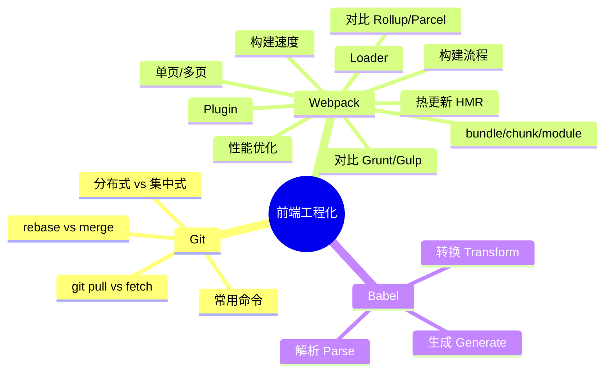

---

## 零、模块化规范

### 1. CommonJS 和 ES Module 的区别

**一句话总结：CJS 是运行时的值的拷贝，ESM 是编译时的值的引用。**

| 对比维度 | CommonJS (CJS) | ES Module (ESM) |
| :--- | :--- | :--- |
| **加载时机** | 🕒 **运行时加载**（同步），可写在 if 语句里 | 🛠️ **编译时加载**（静态），必须在文件顶层 |
| **导出机制** | 📄 导出值的 **浅拷贝**（内部变化不影响外部） | 🔗 导出值的 **动态引用**（内部变化外部同步） |
| **运行环境** | 🟢 Node.js（服务端为主） | 🌐 浏览器原生支持 + Node.js (v14+) |
| **`this` 指向** | 当前模块对象 | `undefined` |

### 2. 为什么 Tree Shaking 必须依赖 ES Module？

因为 ESM 是**静态结构**。Webpack 在构建的 **AST（抽象语法树）分析阶段**，不需要执行代码，就能清楚地知道模块导入了哪些变量、又使用了哪些变量。而 CJS 是动态引入的（`require(condition ? 'a' : 'b')`），打包工具在运行前无法确定依赖，因此不敢随便删代码。

---

## 一、Git

### 1. git 和 svn 的区别

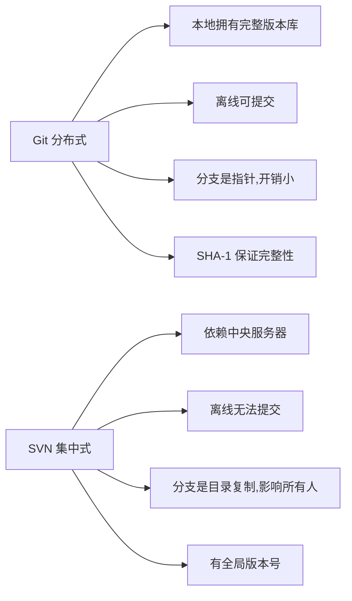

- git 和 svn 最大的区别在于 git 是分布式的，而 svn 是集中式的。因此我们不能再离线的情况下使用 svn。如果服务器出现问题，就没有办法使用 svn 来提交代码。
- svn 中的分支是整个版本库的复制的一份完整目录，而 git 的分支是指针指向某次提交，因此 git 的分支创建更加开销更小并且分支上的变化不会影响到其他人。svn 的分支变化会影响到所有的人。
- svn 的指令相对于 git 来说要简单一些，比 git 更容易上手。
- **GIT把内容按元数据方式存储，而SVN是按文件：**因为git目录是处于个人机器上的一个克隆版的版本库，它拥有中心版本库上所有的东西，例如标签，分支，版本记录等。
- **GIT分支和SVN的分支不同：**svn会发生分支遗漏的情况，而git可以同一个工作目录下快速的在几个分支间切换，很容易发现未被合并的分支，简单而快捷的合并这些文件。
- **GIT没有一个全局的版本号，而SVN有**
- **GIT的内容完整性要优于SVN：**GIT的内容存储使用的是SHA-1哈希算法。这能确保代码内容的完整性，确保在遇到磁盘故障和网络问题时降低对版本库的破坏

### 2. 经常使用的 git 命令？

```javascript
git init                     // 新建 git 代码库
git add                      // 添加指定文件到暂存区
git rm                       // 删除工作区文件，并且将这次删除放入暂存区
git commit -m [message]      // 提交暂存区到仓库区
git branch                   // 列出所有分支
git checkout -b [branch]     // 新建一个分支，并切换到该分支
git status                   // 显示有变更文件的状态
```

### 3. git pull 和 git fetch 的区别

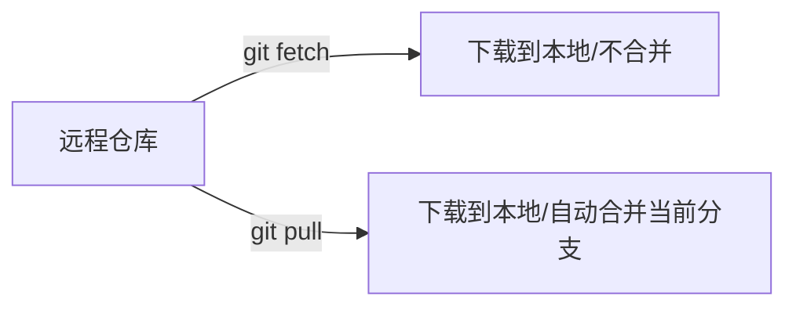

- git fetch 只是将远程仓库的变化下载下来，并没有和本地分支合并。
- git pull 会将远程仓库的变化下载下来，并和当前分支合并。

### 4. git rebase 和 git merge 的区别

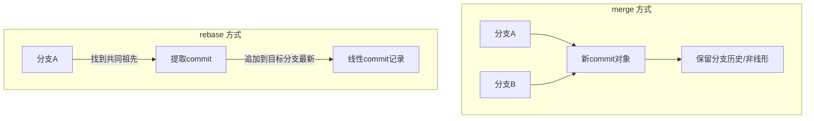

git merge 和 git rebase 都是用于分支合并，关键**在** **commit 记录的处理上不同**：

- git merge 会新建一个新的 commit 对象，然后两个分支以前的 commit 记录都指向这个新 commit 记录。这种方法会保留之前每个分支的 commit 历史。
- git rebase 会先找到两个分支的第一个共同的 commit 祖先记录，然后将提取当前分支这之后的所有 commit 记录，然后将这个 commit 记录添加到目标分支的最新提交后面。经过这个合并后，两个分支合并后的 commit 记录就变为了线性的记录了。

---

## 二、Webpack

### 1. **webpack**与**grunt**、**gulp**的不同？

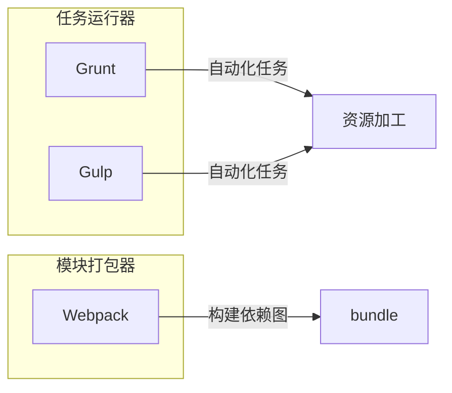

**Grunt****、Gulp是基于任务运⾏的⼯具**： 它们会⾃动执⾏指定的任务，就像流⽔线，把资源放上去然后通过不同插件进⾏加⼯，它们包含活跃的社区，丰富的插件，能⽅便的打造各种⼯作流。

**Webpack是基于模块化打包的⼯具:** ⾃动化处理模块，webpack把⼀切当成模块，当 webpack 处理应⽤程序时，它会递归地构建⼀个依赖关系图 (dependency graph)，其中包含应⽤程序需要的每个模块，然后将所有这些模块打包成⼀个或多个 bundle。

因此这是完全不同的两类⼯具,⽽现在主流的⽅式是⽤npm script代替Grunt、Gulp，npm script同样可以打造任务流。

### 2. **webpack**、**rollup**、**parcel**优劣？

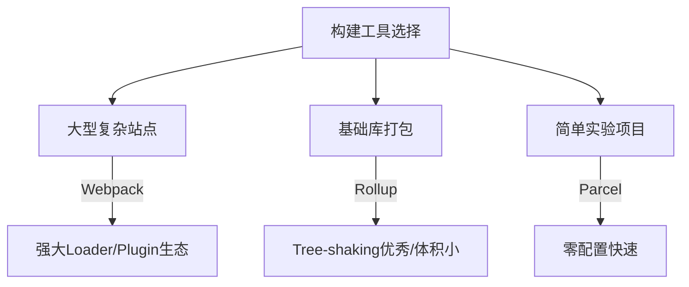

- webpack适⽤于⼤型复杂的前端站点构建: webpack有强⼤的loader和插件⽣态,打包后的⽂件实际上就是⼀个⽴即执⾏函数，这个⽴即执⾏函数接收⼀个参数，这个参数是模块对象，键为各个模块的路径，值为模块内容。⽴即执⾏函数内部则处理模块之间的引⽤，执⾏模块等,这种情况更适合⽂件依赖复杂的应⽤开发。
- rollup适⽤于基础库的打包，如vue、d3等: Rollup 就是将各个模块打包进⼀个⽂件中，并且通过 Tree-shaking 来删除⽆⽤的代码,可以最⼤程度上降低代码体积,但是rollup没有webpack如此多的的如代码分割、按需加载等⾼级功能，其更聚焦于库的打包，因此更适合库的开发。
- parcel适⽤于简单的实验性项⽬: 他可以满⾜低⻔槛的快速看到效果,但是⽣态差、报错信息不够全⾯都是他的硬伤，除了⼀些玩具项⽬或者实验项⽬不建议使⽤。

### 3. 有哪些常⻅的**Loader**？

- file-loader：把⽂件输出到⼀个⽂件夹中，在代码中通过相对 URL 去引⽤输出的⽂件
- url-loader：和 file-loader 类似，但是能在⽂件很⼩的情况下以 base64 的⽅式把⽂件内容注⼊到代码中去
- source-map-loader：加载额外的 Source Map ⽂件，以⽅便断点调试
- image-loader：加载并且压缩图⽚⽂件
- babel-loader：把 ES6 转换成 ES5
- css-loader：加载 CSS，⽀持模块化、压缩、⽂件导⼊等特性
- style-loader：把 CSS 代码注⼊到 JavaScript 中，通过 DOM 操作去加载 CSS。
- eslint-loader：通过 ESLint 检查 JavaScript 代码

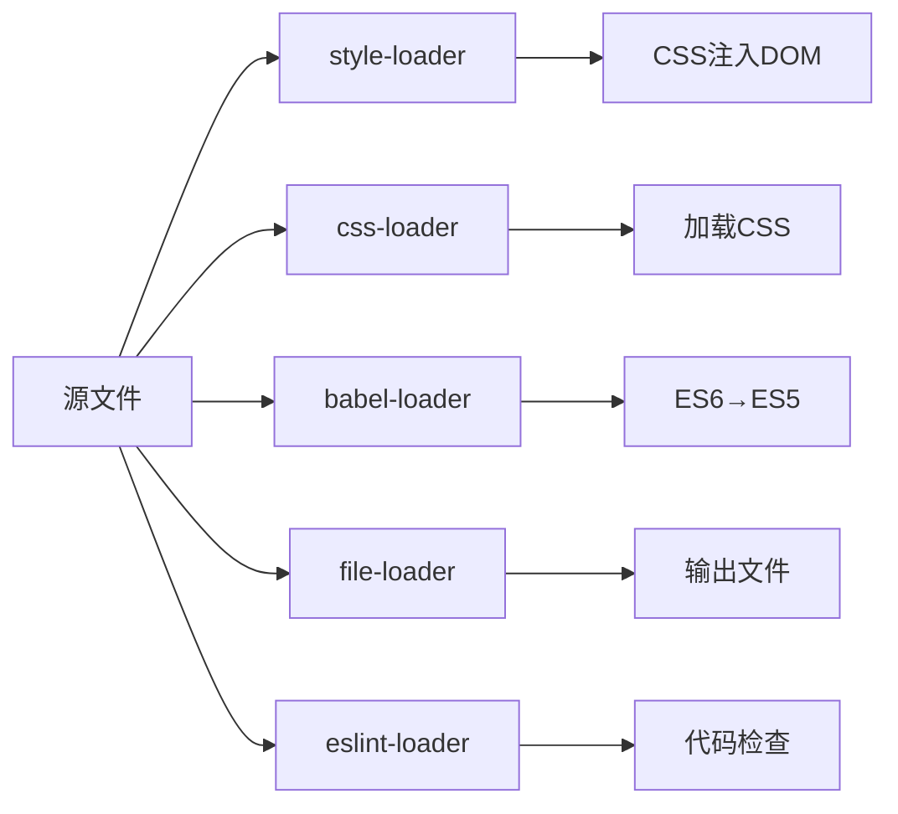

**注意：**在Webpack中，loader的执行顺序是**从右向左**执行的。因为webpack选择了**compose这样的函数式编程方式**，这种方式的表达式执行是从右向左的。

### 4. 有哪些常⻅的**Plugin**？

- define-plugin：定义环境变量
- html-webpack-plugin：简化html⽂件创建
- uglifyjs-webpack-plugin：通过 UglifyES 压缩 ES6 代码
- webpack-parallel-uglify-plugin: 多核压缩，提⾼压缩速度
- webpack-bundle-analyzer: 可视化webpack输出⽂件的体积
- mini-css-extract-plugin: CSS提取到单独的⽂件中，⽀持按需加载

### 5. **bundle**，**chunk**，**module**是什么？

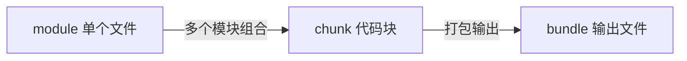

- bundle：是由webpack打包出来的⽂件；
- chunk：代码块，⼀个chunk由多个模块组合⽽成，⽤于代码的合并和分割；
- module：是开发中的单个模块，在webpack的世界，⼀切皆模块，⼀个模块对应⼀个⽂件，webpack会从配置的 entry中递归开始找出所有依赖的模块。

### 6. **Loader**和**Plugin**的不同？

**不同的作⽤:**

- **Loader**直译为"加载器"。Webpack将⼀切⽂件视为模块，但是webpack原⽣是只能解析js⽂件，如果想将其他⽂件也打包的话，就会⽤到 loader 。 所以Loader的作⽤是让webpack拥有了加载和解析⾮JavaScript⽂件的能⼒。
- **Plugin**直译为"插件"。Plugin可以扩展webpack的功能，让webpack具有更多的灵活性。 在 Webpack 运⾏的⽣命周期中会⼴播出许多事件，Plugin 可以监听这些事件，在合适的时机通过 Webpack 提供的 API 改变输出结果。

**不同的⽤法:**

- **Loader**在 module.rules 中配置，也就是说他作为模块的解析规则⽽存在。 类型为数组，每⼀项都是⼀个 Object ，⾥⾯描述了对于什么类型的⽂件（ test ），使⽤什么加载( loader )和使⽤的参数（ options ）
- **Plugin**在 plugins 中单独配置。 类型为数组，每⼀项是⼀个 plugin 的实例，参数都通过构造函数传⼊。

### 7. **webpack**的构建流程**?**

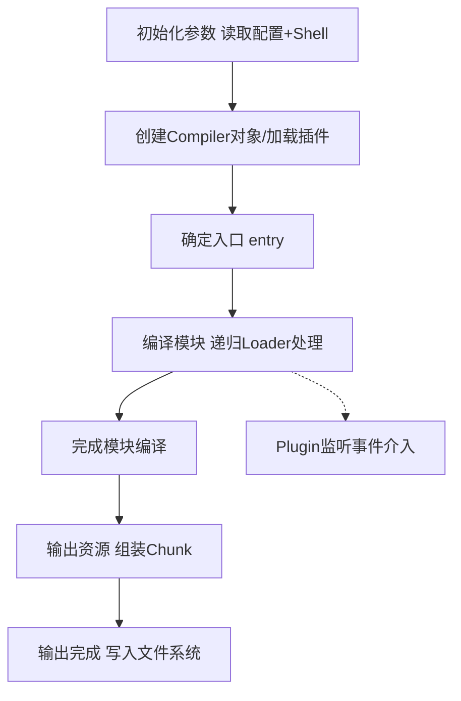

Webpack 的运⾏流程是⼀个串⾏的过程，从启动到结束会依次执⾏以下流程：

1. 初始化参数：从配置⽂件和 Shell 语句中读取与合并参数，得出最终的参数；
2. 开始编译：⽤上⼀步得到的参数初始化 Compiler 对象，加载所有配置的插件，执⾏对象的 run ⽅法开始执⾏编译；
3. 确定⼊⼝：根据配置中的 entry 找出所有的⼊⼝⽂件；
4. 编译模块：从⼊⼝⽂件出发，调⽤所有配置的 Loader 对模块进⾏翻译，再找出该模块依赖的模块，再递归本步骤直到所有⼊⼝依赖的⽂件都经过了本步骤的处理；
5. 完成模块编译：在经过第4步使⽤ Loader 翻译完所有模块后，得到了每个模块被翻译后的最终内容以及它们之间的依赖关系；
6. 输出资源：根据⼊⼝和模块之间的依赖关系，组装成⼀个个包含多个模块的 Chunk，再把每个 Chunk 转换成⼀个单独的⽂件加⼊到输出列表，这步是可以修改输出内容的最后机会；
7. 输出完成：在确定好输出内容后，根据配置确定输出的路径和⽂件名，把⽂件内容写⼊到⽂件系统。

在以上过程中，Webpack 会在特定的时间点⼴播出特定的事件，插件在监听到感兴趣的事件后会执⾏特定的逻辑，并且插件可以调⽤ Webpack 提供的 API 改变 Webpack 的运⾏结果。

### 8. 编写**loader**或**plugin**的思路？

Loader像⼀个"翻译官"把读到的源⽂件内容转义成新的⽂件内容，并且每个Loader通过链式操作，将源⽂件⼀步步翻译成想要的样⼦。

编写Loader时要遵循单⼀原则，每个Loader只做⼀种"转义"⼯作。 每个Loader的拿到的是源⽂件内容（source），可以通过返回值的⽅式将处理后的内容输出，也可以调⽤ this.callback() ⽅法，将内容返回给webpack。 还可以通过this.async() ⽣成⼀个 callback 函数，再⽤这个callback将处理后的内容输出出去。 此外 webpack 还为开发者准备了开发loader的⼯具函数集——loader-utils 。

相对于Loader⽽⾔，Plugin的编写就灵活了许多。 webpack在运⾏的⽣命周期中会⼴播出许多事件，Plugin 可以监听这些事件，在合适的时机通过 Webpack 提供的 API 改变输出结果。

### 9. **webpack** 热更新的实现原理？

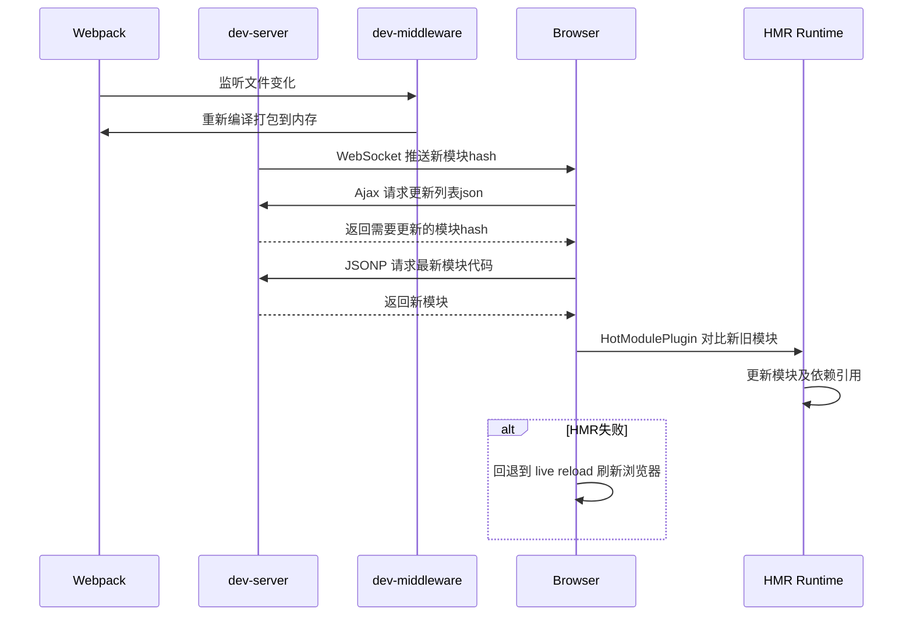

webpack的热更新⼜称热替换（Hot Module Replacement），缩写为HMR。 这个机制可以做到不⽤刷新浏览器⽽将新变更的模块替换掉旧的模块。

原理：

1. 第⼀步，在 webpack 的 watch 模式下，⽂件系统中某⼀个⽂件发⽣修改，webpack 监听到⽂件变化，根据配置⽂件对模块重新编译打包，并将打包后的代码通过简单的 JavaScript 对象保存在内存中。
2. 第⼆步是 webpack-dev-server 和 webpack 之间的接⼝交互，主要是 dev-server 的中间件 webpack-dev-middleware 和 webpack 之间的交互，webpack-dev-middleware 调⽤ webpack 暴露的 API对代码变化进⾏监控，并且告诉 webpack，将代码打包到内存中。
3. 第三步是 webpack-dev-server 对⽂件变化的⼀个监控，当我们在配置⽂件中配置了devServer.watchContentBase 为 true 的时候，Server 会监听这些配置⽂件夹中静态⽂件的变化，变化后会通知浏览器端对应⽤进⾏ live reload。
4. 第四步主要是通过 sockjs 在浏览器端和服务端之间建⽴⼀个 websocket ⻓连接，将 webpack 编译打包的各个阶段的状态信息告知浏览器端，浏览器端根据这些 socket 消息进⾏不同的操作。服务端传递的最主要信息还是新模块的 hash 值。
5. webpack-dev-server/client 端并不能够请求更新的代码，也不会执⾏热更模块操作，⽽把这些⼯作⼜交回给了webpack，webpack/hot/dev-server 的⼯作就是根据 webpack-dev-server/client 传给它的信息以及 dev-server 的配置决定是刷新浏览器呢还是进⾏模块热更新。
6. HotModuleReplacement.runtime 是客户端 HMR 的中枢，它接收到新模块的 hash 值，它通过 JsonpMainTemplate.runtime 向 server 端发送 Ajax 请求，服务端返回⼀个 json，该 json 包含了所有要更新的模块的 hash 值，获取到更新列表后，该模块再次通过 jsonp 请求，获取到最新的模块代码。
7. 在第 10 步中，HotModulePlugin 将会对新旧模块进⾏对⽐，决定是否更新模块，在决定更新模块后，检查模块之间的依赖关系，更新模块的同时更新模块间的依赖引⽤。
8. 最后⼀步，当 HMR 失败后，回退到 live reload 操作，也就是进⾏浏览器刷新来获取最新打包代码。

### 10. 如何⽤**webpack**来优化前端性能？

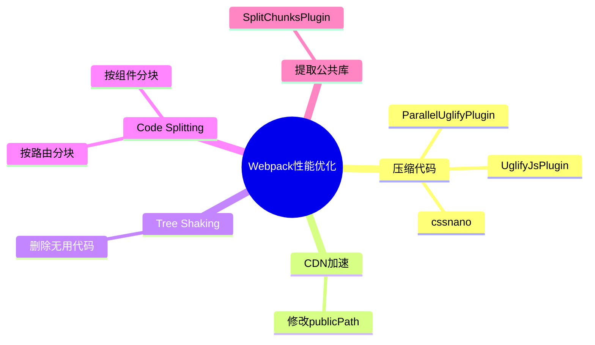

### 11. 如何提⾼**webpack**的打包速度**?**

- happypack: 利⽤进程并⾏编译loader,利⽤缓存来使得 rebuild 更快,遗憾的是作者表示已经不会继续开发此项⽬,类似的替代者是thread-loader
- 外部扩展(externals): 将不怎么需要更新的第三⽅库脱离webpack打包，不被打⼊bundle中，从⽽减少打包时间，⽐如jQuery⽤script标签引⼊
- dll: 采⽤webpack的 DllPlugin 和 DllReferencePlugin 引⼊dll，让⼀些基本不会改动的代码先打包成静态资源，避免反复编译浪费时间
- 利⽤缓存: webpack.cache 、babel-loader.cacheDirectory、 HappyPack.cache 都可以利⽤缓存提⾼rebuild效率缩⼩⽂件搜索范围: ⽐如babel-loader插件,如果你的⽂件仅存在于src中,那么可以 include: path.resolve(__dirname,'src') ,当然绝⼤多数情况下这种操作的提升有限，除⾮不⼩⼼build了node_modules⽂件

### 12. 如何提⾼**webpack**的构建速度？

1. 多⼊⼝情况下，使⽤ CommonsChunkPlugin 来提取公共代码
2. 通过 externals 配置来提取常⽤库
3. 利⽤ DllPlugin 和 DllReferencePlugin 预编译资源模块
4. 使⽤ Happypack 实现多线程加速编译
5. 使⽤ webpack-uglify-parallel 来提升 uglifyPlugin 的压缩速度
6. 使⽤ Tree-shaking 和 Scope Hoisting 来剔除多余代码

### 13. 怎么配置单⻚应⽤？怎么配置多⻚应⽤？

单⻚应⽤可以理解为webpack的标准模式，直接在 entry 中指定单⻚应⽤的⼊⼝即可。多⻚应⽤的话，可以使⽤webpack的 AutoWebPlugin 来完成简单⾃动化的构建，但是前提是项⽬的⽬录结构必须遵守他预设的规范。 多⻚应⽤中要注意的是：

- 每个⻚⾯都有公共的代码，可以将这些代码抽离出来，避免重复的加载
- 随着业务的不断扩展，⻚⾯可能会不断的追加，所以⼀定要让⼊⼝的配置⾜够灵活，避免每次添加新⻚⾯还需要修改构建配置

---

## 三、其他

### **1. Babel**的原理是什么**?**


babel 的转译过程也分为三个阶段：

- **解析 Parse**: 将代码解析⽣成抽象语法树（AST），即词法分析与语法分析的过程；
- **转换 Transform**: 对于 AST 进⾏变换⼀系列的操作，babel 接受得到 AST 并通过 babel-traverse 对其进⾏遍历，在此过程中进⾏添加、更新及移除等操作；
- **⽣成 Generate**: 将变换后的 AST 再转换为 JS 代码, 使⽤到的模块是 babel-generator。

---

## 四、现代构建工具

### 1. Vite

Vite 是由 Vue 作者 Evan You 开发的下一代前端构建工具。

**基于 ES Module 的开发服务器：**
- 开发阶段无需打包，浏览器直接通过 `<script type="module">` 加载 ESM
- 服务器按需编译，仅编译当前页面需要的模块
- 利用浏览器原生解析，省去打包时间

**为什么比 Webpack 快：**
- Webpack 冷启动需要全量打包构建依赖图，项目越大越慢
- Vite 冷启动：esbuild 预构建依赖 + 按需编译源码 → 秒级启动
- 依赖预构建使用 esbuild（Go 编写），比 Webpack 使用 JavaScript 快 10-100 倍

**热更新原理（与 Webpack 对比）：**

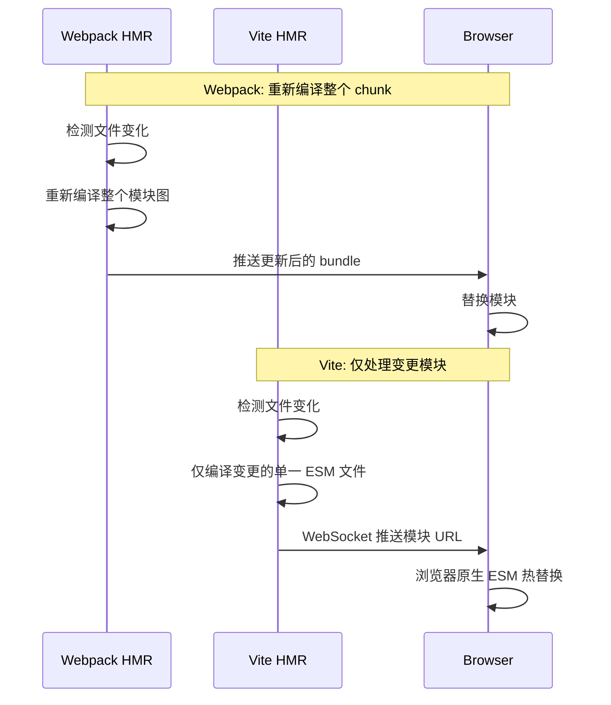

- Webpack HMR：文件变化 → 重新打包整个模块链 → 推送完整 chunk
- Vite HMR：文件变化 → 仅编译变更文件 → 推送 ESM 更新 URL → 浏览器原生加载
- 大型项目中 Vite 热更新保持在毫秒级，Webpack 随项目增大线性变慢

**构建基于 Rollup：**
- 生产构建使用 Rollup，成熟的 Tree-shaking 和代码分割
- 提供 Rollup 兼容层，可使用 @rollup/plugin-* 插件

**插件机制：**
- 兼容 Rollup 插件接口
- Vite 特有钩子：config、configResolved、configureServer 等
- 官方插件：@vitejs/plugin-vue、@vitejs/plugin-react

**与 Vue/React 的集成：**
- Vue：@vitejs/plugin-vue（SFC 支持）、@vitejs/plugin-vue-jsx
- React：@vitejs/plugin-react（Fast Refresh、JSX 编译）
- 脚手架工具：create-vite 快速创建项目

### 2. esbuild

**Go 语言编写，极快的构建速度：**
- 使用 Go 编译为原生代码，充分利用多核 CPU
- 并行解析和代码生成，无需 AST 序列化
- 比 JavaScript 编写的同类工具快 10-100 倍

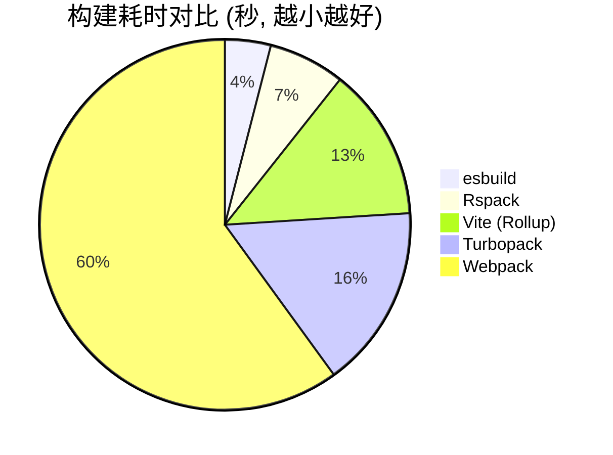

**核心功能：**
- **打包**：支持 ESM / CommonJS 模块
- **压缩**：内置压缩器（minify），比 Terser 快 10-20 倍
- **转译**：支持 TypeScript / JSX → JavaScript，支持 ES2024+ → ES2015

**与 Webpack/Vite 的关系：**
- Vite 底层使用 esbuild 进行依赖预构建
- 非 Webpack 的完整替代：缺少 HMR、代码分割、丰富的插件生态
- 最佳实践：Vite（开发用 esbuild，构建用 Rollup）+ esbuild（单独用于转译/压缩）

### 3. Turbopack

- Vercel 开发的 **Rust 增量打包器**，基于 Next.js 团队
- **Next.js 13+ 默认打包器**（开发环境）
- 核心优势：函数级别的增量缓存，仅重新计算变更部分

**与 Webpack/Vite 的对比：**

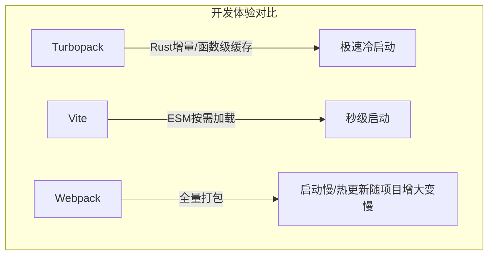

- 优势：大型项目中比 Vite 更快（Vite 冷启动需处理大量 ESM 请求）
- 劣势：生态不如 Vite 成熟，目前仅深度绑定 Next.js
- 目前仅支持开发环境，生产构建仍用 Webpack

### 4. SWC (Speedy Web Compiler)

**Rust 编写的 JS/TS 编译器，作为 Babel 的替代：**

**与 Babel 速度对比：**

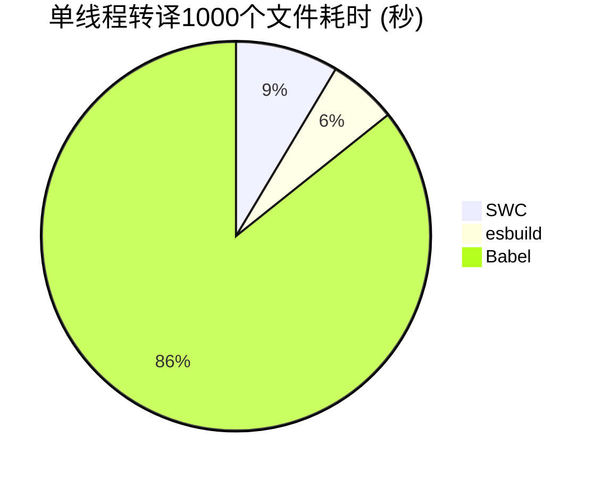

- SWC 比 Babel 快 10-15 倍（Rust vs JavaScript 实现）
- 自带解析器，支持 JS/TS/JSX，无需第三方依赖
- 被 Next.js、Deno、Parcel 等广泛采用

**编译流程对比：**

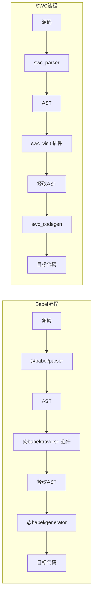

- 两者流程相似（解析 → 转换 → 生成），但 SWC 全程 Rust 实现
- SWC 还支持压缩（swc_minifier）和打包（spack）

### 5. Rspack

- **字节跳动（ByteDance）** 开发的 Rust 打包器
- **Webpack 兼容 API**：配置、Loader、Plugin 生态高度兼容
- 性能：比 Webpack 快 5-10 倍

**核心特点：**
- 使用 Rust 编写核心打包逻辑
- 支持 webpack 配置直接迁移（rspack.config.js 兼容 webpack.config.js）
- 提供 @rspack/plugin-compat 兼容 webpack-loader
- 内置常见 Loader（css-loader、less-loader、sass-loader 等）
- 支持 Module Federation、HMR、Tree Shaking 等 Webpack 核心特性

**适用场景：**
- 大型 Webpack 项目迁移，最低迁移成本
- 需要 Webpack 生态但追求更快构建速度的团队

---

## 五、包管理器和运行时

### 1. pnpm

**硬链接 + 软链接的 node_modules 结构：**
- **内容寻址存储**：所有包版本存储在全局 store 中
- **硬链接**：项目中文件通过硬链接指向 store，不重复存储
- **软链接**：依赖关系通过符号链接组织，形成严格的嵌套结构

**磁盘空间节省：**

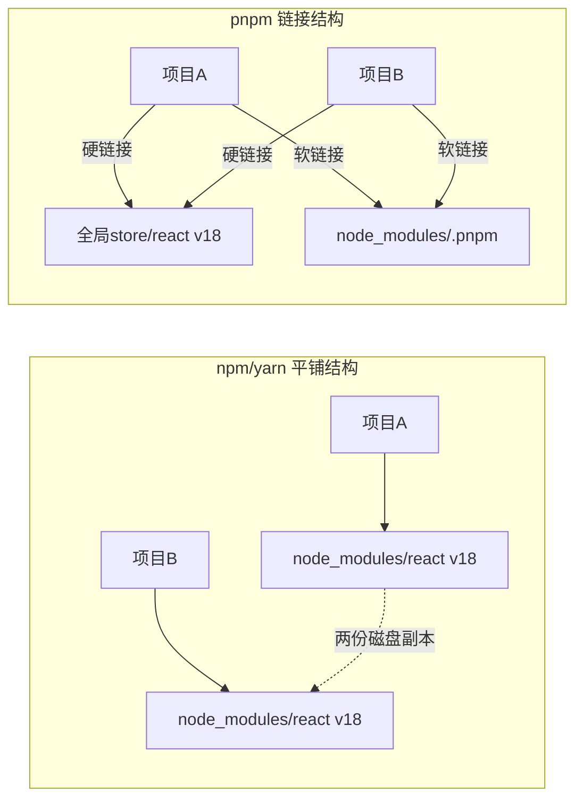

- 多个项目共享同一版本的依赖，只需一份磁盘存储
- 比 npm/yarn 节省 50-70% 磁盘空间

**与 npm/yarn 的对比：**

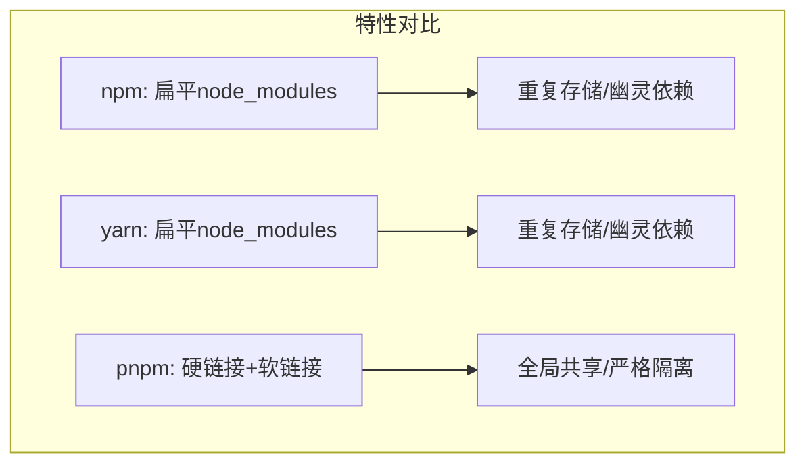

| 特性 | npm | yarn | pnpm |
|------|-----|------|------|
| node_modules 结构 | 扁平（hoist） | 扁平 | 硬链接 + 软链接 |
| 磁盘空间 | 重复存储 | 重复存储 | 全局共享 |
| 安装速度 | 中等 | 较快 | 最快 |
| Monorepo 支持 | workspaces | workspaces | workspace（更完善） |
| 严格性 | 可访问未声明依赖 | 可访问未声明依赖 | 仅可访问声明的依赖 |

**pnpm workspace 实现 monorepo：**
- `pnpm-workspace.yaml` 定义 workspace
- 自动 link 内部 package
- 支持 `pnpm --filter` 过滤操作

### 2. Bun

**一体化的 JavaScript 运行时（Zig 编写）：**
- 集运行时、打包器、转译器、包管理器、测试运行器于一体
- 基于 WebKit 的 JavaScriptCore 引擎，启动比 Node.js 快 4x
- 兼容大部分 Node.js API

**核心内置工具：**
- **Bun runtime**：原生 TypeScript/JSX 支持，无需配置
- **Bun package manager**：比 npm/yarn/pnpm 快 10-30x
- **Bun bundler**：内置打包器（兼容 esbuild API）
- **Bun test**：兼容 Jest API 的测试运行器

**与 Node.js/Deno 对比：**

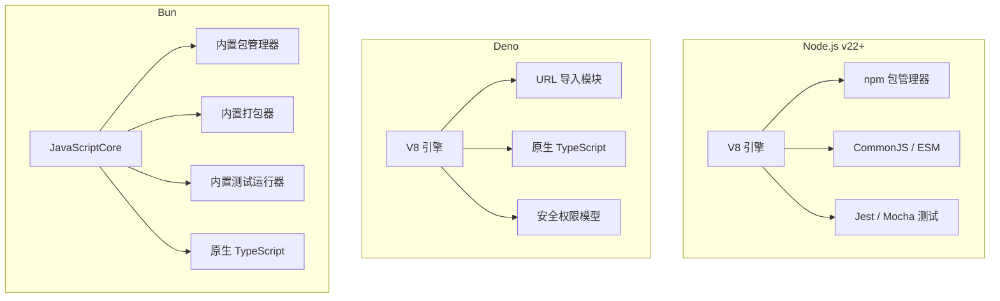

| 特性 | Node.js | Deno | Bun |
|------|---------|------|-----|
| 引擎 | V8 | V8 | JavaScriptCore |
| 包管理 | npm | URL / npm: | 内置（极快） |
| TypeScript | 需配置 | 原生 | 原生 |
| 测试 | 需安装 | 内置 | 内置 |
| 启动速度 | 慢 | 中 | 快 |
| 生态 | 最丰富 | 一般 | 快速增长 |

### 3. Deno

**安全优先的 JS/TS 运行时（Rust + V8）：**
- 默认无文件、网络、环境变量访问权限（需 `--allow-*` 显式授权）

**原生 TypeScript 支持：**
- 内置 TypeScript 编译器（基于 SWC），无需额外配置
- 直接运行 `.ts` 文件

**URL 导入模块：**
```javascript
import { serve } from "https://deno.land/std@0.220.0/http/server.ts"
```
- 无需 node_modules，直接从 URL 导入
- 支持 npm 包（通过 `npm:` 前缀）

**与 Node.js 对比：**

| 特性 | Node.js | Deno |
|------|---------|------|
| 模块系统 | CJS + ESM | ESM 优先 |
| TypeScript | 需配置转译 | 原生支持 |
| 包管理 | npm / node_modules | URL 导入 / npm: |
| 安全模型 | 默认全部权限 | 默认无权限 |
| 标准库 | 内置但分散 | 统一标准库（deno_std） |
| 配置文件 | package.json | deno.json(c) |

---

## 六、Monorepo

### 1. 什么是 Monorepo

**Single Repo vs Multi Repo：**

```mermaid
graph LR
    subgraph Multi-Repo 多仓库
        MR1["项目A - 独立仓库"]
        MR2["项目B - 独立仓库"]
        MR3["项目C - 独立仓库"]
    end
    subgraph Monorepo 单仓库
        M1["一个 Git 仓库"]
        M1 --> M2["├── apps/app-a"]
        M1 --> M3["├── apps/app-b"]
        M1 --> M4["├── packages/shared"]
        M1 --> M5["└── packages/utils"]
    end
```

**Monorepo 的优势：**
- **代码共享**：多个项目共享组件、工具库、类型定义
- **原子提交**：跨项目的修改可在一次提交中完成
- **统一构建**：共享构建配置、lint 规则、测试框架
- **依赖管理**：统一的版本控制，避免依赖冲突

**Monorepo 的挑战：**
- 仓库体积大（git 操作变慢）
- 构建时间长（需优化增量构建）
- 权限管理不够精细
- 需要专门工具（Turborepo / Nx / Lerna）

### 2. Turborepo

**Vercel 的 Monorepo 工具：**
- 专注于任务编排和缓存
- 与 pnpm / npm / yarn workspaces 配合使用

**流水线任务编排：**
```json
{
  "pipeline": {
    "build": {
      "dependsOn": ["^build"],
      "outputs": ["dist/**"]
    },
    "test": {
      "dependsOn": ["build"],
      "inputs": ["src/**"]
    },
    "lint": {}
  }
}
```

**缓存策略（Remote Caching）：**
- 本地缓存：内容可寻址缓存，跳过未变更的任务
- 远程缓存（Vercel Remote Cache）：团队共享缓存
- 缓存命中时直接恢复产物，构建时间趋近于 0

**与 Nx 对比：**

| 特性 | Turborepo | Nx |
|------|-----------|-----|
| 缓存 | 本地 + 远程(Vercel) | 本地 + 远程(Nx Cloud) |
| 并行执行 | ✓ | ✓ |
| 依赖图 | 命令行 | 可视化 UI |
| 代码生成 | ✗ | ✓（强大的 generators） |
| 学习曲线 | 低 | 中高 |
| 与 Vercel 集成 | 深度集成 | 通用 |

### 3. Nx

**任务编排和计算缓存：**
- 智能依赖分析，仅重新计算受影响的包（`nx affected`）
- 计算缓存，跳过未变更的任务
- 分布式任务执行（Nx Cloud）

**代码生成（Code Generation）：**
```bash
nx generate @nx/react:component my-component
```
- 丰富的生成器：组件、库、服务等
- 支持自定义生成器

**依赖图可视化：**
```bash
nx graph
```
- 浏览器中实时显示项目依赖关系
- 帮助理解 monorepo 结构

**与 Turborepo 对比：**

```mermaid
graph TD
    subgraph Turborepo
        T1["轻量 / 简单配置"]
        T2["Vercel 生态"]
        T3["缓存优先"]
    end
    subgraph Nx
        N1["功能全面 / 配置复杂"]
        N2["生成器 / 插件"]
        N3["依赖图可视化"]
        N4["affected 命令"]
    end
```

- 小团队 / 轻量项目 → Turborepo
- 大型项目 / 需要代码生成 → Nx
- 两者都支持 pnpm/npm/yarn 作为包管理器

### 4. pnpm workspace + Changesets

**pnpm workspace 配置：**
```yaml
# pnpm-workspace.yaml
packages:
  - "packages/*"
  - "apps/*"
```

```bash
pnpm add lodash --filter @myapp/ui          # 给特定包安装依赖
pnpm add @myapp/utils --filter @myapp/web   # 引用 workspace 内部包
```

**Changesets 版本管理和发布：**

```mermaid
flowchart LR
    A["开发功能"] --> B["pnpm changeset 记录变更"]
    B --> C["提交代码"]
    C --> D["CI 检测到 changeset"]
    D --> E["pnpm changeset version"]
    E --> F["自动更新版本号 + CHANGELOG"]
    F --> G["CI 自动发布到 npm"]
```

- `pnpm changeset`：交互式生成变更记录
- `pnpm changeset version`：自动升级版本、生成 CHANGELOG
- 配合 CI 实现自动化发布流程

---

## 七、微前端 (Micro-Frontends)

### 1. 微前端概念

**原理和适用场景：**
- 将前端应用分解为多个独立子应用
- 每个子应用独立开发、独立部署、独立技术栈
- 适用于大型企业级应用、多团队协作场景

**与 Monolith 架构对比：**

```mermaid
graph TD
    subgraph Monolith 单体架构
        M1["单个应用"]
        M1 --> M2["单个代码仓库"]
        M1 --> M3["单个部署单元"]
        M1 --> M4["技术栈固定/团队耦合"]
    end
    subgraph Micro-Frontends 微前端
        F1["主应用容器"]
        F1 --> F2["子应用A - React"]
        F1 --> F3["子应用B - Vue"]
        F1 --> F4["子应用C - Angular"]
        F2 --> F5["独立仓库/部署/团队"]
        F3 --> F5
        F4 --> F5
    end
```

**优势：** 技术栈无关、独立部署、独立团队、增量升级
**挑战：** 首屏加载性能、统一体验、CSS/JS 隔离、通信复杂度

### 2. Module Federation (Webpack 5)

**运行时加载远程模块：**
- Webpack 5 内置功能
- 子应用暴露模块，主应用运行时远程加载
- 无需构建时引用，无需 npm 发布

```javascript
// 远程应用 webpack.config.js
new ModuleFederationPlugin({
  name: "remote_app",
  filename: "remoteEntry.js",
  exposes: {
    "./Button": "./src/Button",
  },
})

// 主应用 webpack.config.js
new ModuleFederationPlugin({
  name: "host",
  remotes: {
    remote_app: "remote_app@http://localhost:3001/remoteEntry.js",
  },
})
```

**共享依赖：**
- 避免重复加载 React/Vue 等公共库
- 自动版本匹配，版本不兼容时自动加载

**与 iframe 对比：**

| 特性 | Module Federation | iframe |
|------|-----------------|--------|
| 样式隔离 | CSS scoped / CSS Modules | 完全隔离 |
| JS 隔离 | 沙箱机制 | 完全隔离 |
| 通信成本 | 共享内存 / 事件 | postMessage |
| UI 体验 | 无缝集成 | 有边界感 |
| 首屏加载 | 共享资源 / 按需加载 | 独立加载 |

### 3. qiankun

**基于 single-spa 的微前端框架（蚂蚁集团）：**

**应用生命周期：**
```mermaid
flowchart LR
    A["注册应用"] --> B["预加载"]
    B --> C["bootstrap 初始化"]
    C --> D["mount 挂载"]
    D --> E["unmount 卸载"]
    E -->|重新激活| D
    E --> F["unload 销毁"]
```

**沙箱隔离：**
- **CSS 隔离**：Scoped CSS（添加唯一前缀）或 Shadow DOM（实验性）
- **JS 隔离**：Proxy 沙箱，拦截 window 操作
  - 启动时快照 window 属性
  - 卸载时还原 window 状态
  - 支持多实例沙箱

**核心 API：**
```javascript
import { registerMicroApps, start } from 'qiankun'

registerMicroApps([
  {
    name: 'react-app',
    entry: '//localhost:3001',
    container: '#container',
    activeRule: '/react',
  },
])
start()
```

### 4. wujie（无界）

**基于 Web Component + iframe 的微前端（腾讯）：**

**核心架构：**
- **iframe 提供 JS 隔离**：子应用运行在隐藏 iframe 中
- **Web Component 渲染 UI**：iframe 内的 DOM 通过 Web Component 同步到主应用
- **Proxy 通信**：主应用和子应用通过 proxy 双向通信

**与 qiankun 对比：**

```mermaid
graph TD
    subgraph qiankun
        Q1["基于 single-spa"]
        Q2["Proxy 沙箱 JS 隔离"]
        Q3["手动 CSS 隔离"]
        Q4["需修改子应用构建配置"]
    end
    subgraph wujie
        W1["iframe + Web Component"]
        W2["天然 JS 隔离"]
        W3["天然 CSS 隔离"]
        W4["无需修改子应用"]
    end
```

| 特性 | qiankun | wujie |
|------|---------|-------|
| JS 隔离 | Proxy 沙箱 | iframe（天然隔离） |
| CSS 隔离 | Scoped CSS | Shadow DOM + iframe |
| 子应用改造成本 | 中等（需暴露生命周期） | 低（几乎零改造） |
| 兼容性 | 高（ES5 兼容） | 依赖 Web Component |
| 维护方 | 蚂蚁集团 | 腾讯（活跃维护） |

---

## 八、代码质量和测试

### 1. ESLint + Prettier

**ESLint Flat Config（ESLint 9+）：**
```javascript
// eslint.config.js
import js from "@eslint/js"
import tseslint from "typescript-eslint"
import reactHooks from "eslint-plugin-react-hooks"

export default [
  js.configs.recommended,
  ...tseslint.configs.recommended,
  {
    plugins: { "react-hooks": reactHooks },
    rules: {
      "react-hooks/rules-of-hooks": "error",
      "no-unused-vars": "warn",
    },
  },
]
```

- Flat Config 替代了传统的 `.eslintrc` 格式
- 不再有 `extends` 字段，直接组合配置数组
- 原生支持 ESM 和 TypeScript

**Prettier 代码格式化：**
```javascript
// .prettierrc
{
  "semi": true,
  "singleQuote": true,
  "tabWidth": 2,
  "trailingComma": "all",
  "printWidth": 100
}
```

**配合使用规则：**
- `eslint-config-prettier`：关闭 ESLint 中与 Prettier 冲突的规则
- `eslint-plugin-prettier`：将 Prettier 作为 ESLint 规则运行（不推荐，影响性能）
- 推荐：ESLint 负责代码质量，Prettier 负责代码格式化

### 2. Husky + lint-staged

**Git hooks 管理（Husky 9+）：**
```bash
npx husky init
```

```bash
# .husky/pre-commit
npx lint-staged
```

```bash
# .husky/commit-msg
npx --no -- commitlint --edit $1
```

**提交前代码检查：**
```javascript
// lint-staged.config.js
export default {
  "*.{ts,tsx,js,jsx}": ["eslint --fix", "prettier --write"],
  "*.{css,scss}": ["prettier --write"],
  "*.{json,md}": ["prettier --write"],
}
```

**commitlint 规范提交信息：**
```javascript
// commitlint.config.js
export default { extends: ["@commitlint/config-conventional"] }
```

- 格式：`type(scope?): message`
- 常见 type：feat / fix / chore / docs / refactor / test / style

### 3. Vitest

**基于 Vite 的单元测试框架：**

**与 Jest 对比：**

| 特性 | Jest | Vitest |
|------|------|--------|
| 底层 | jsdom + Node.js | Vite + esbuild |
| 配置文件 | jest.config.js | vite.config.ts |
| HMR 热更新 | 不支持 | 支持（测试热更新） |
| TypeScript | @types/jest / ts-jest | 原生支持 |
| ESM | 配置复杂 | 原生支持 |
| 速度 | 中等 | 快（esbuild 转译） |
| API 兼容性 | - | 兼容 Jest API |

**配置示例：**
```javascript
// vite.config.ts
import { defineConfig } from "vitest/config"

export default defineConfig({
  test: {
    globals: true,
    environment: "jsdom",
    setupFiles: "./src/test/setup.ts",
    coverage: {
      provider: "v8",
      reporter: ["text", "json", "html"],
    },
  },
})
```

```typescript
// src/components/Counter.test.ts
import { describe, it, expect } from "vitest"
import { render, screen } from "@testing-library/react"
import Counter from "./Counter"

describe("Counter", () => {
  it("renders initial count", () => {
    render(<Counter />)
    expect(screen.getByText("Count: 0")).toBeDefined()
  })
})
```

### 4. Playwright

**跨浏览器 E2E 测试（微软）：**

**核心特性：**
- 支持 Chromium / Firefox / Safari（WebKit）
- Auto-wait：自动等待元素就绪
- 网络拦截：Mock API 请求
- 移动端模拟：模拟 iPhone / Android 设备
- 视频录制、截图、Trace Viewer 调试

**与 Cypress 对比：**

| 特性 | Cypress | Playwright |
|------|---------|------------|
| 浏览器支持 | 仅 Chromium | Chromium + Firefox + Safari |
| 语言 | JS/TS | JS/TS / Python / Java / C# |
| 架构 | 同进程（受限于浏览器） | 独立进程 + CDP 协议 |
| iframe 支持 | 有限 | 良好 |
| 并行执行 | Dashboard 付费 | 原生支持 |
| 调试体验 | 时间旅行 | Trace Viewer |
| 社区 | 成熟 / 资料多 | 快速增长 |

**示例：**
```typescript
import { test, expect } from "@playwright/test"

test("登录流程", async ({ page }) => {
  await page.goto("https://example.com/login")
  await page.fill("[data-testid=username]", "admin")
  await page.fill("[data-testid=password]", "password")
  await page.click("[data-testid=submit]")
  await expect(page).toHaveURL(/dashboard/)
})
```

### 5. 测试金字塔

**单元测试 / 集成测试 / E2E 测试：**

```mermaid
graph TD
    subgraph 测试金字塔
        T1["E2E 测试 (少量/慢/高成本)"]
        T2["集成测试 (中等)"]
        T3["单元测试 (大量/快/低成本)"]
    end
    T1 -->|验证关键用户路径| A["Playwright / Cypress"]
    T2 -->|验证模块间协作| B["Testing Library / Vitest"]
    T3 -->|验证独立函数/组件| C["Vitest / Jest"]
```

**测试策略建议（遵循 70/20/10 原则）：**
- **单元测试**（70%）：函数、组件、工具类 → Vitest / Jest
- **集成测试**（20%）：API 调用、组件组合、状态管理 → Testing Library
- **E2E 测试**（10%）：核心用户路径 → Playwright / Cypress

**测试覆盖率的意义：**
- **行覆盖率**（line）：代码行执行比例
- **分支覆盖率**（branch）：if/else 等分支覆盖比例
- **函数覆盖率**（function）：函数调用比例
- **语句覆盖率**（statement）：语句执行比例

> 覆盖率不是目标，测试质量更重要。100% 覆盖率也不能保证无 bug。

---

## 九、CI/CD 与部署

### 1. GitHub Actions

**Workflow 基础配置：**
```yaml
# .github/workflows/deploy.yml
name: Deploy Frontend

on:
  push:
    branches: [main]
  pull_request:
    branches: [main]

jobs:
  build-and-deploy:
    runs-on: ubuntu-latest

    steps:
      - uses: actions/checkout@v4

      - uses: actions/setup-node@v4
        with:
          node-version: 22

      - run: npm ci

      - run: npm run lint

      - run: npm run test

      - run: npm run build

      - name: Deploy to Vercel
        uses: amondnet/vercel-action@v25
        with:
          vercel-token: ${{ secrets.VERCEL_TOKEN }}
          vercel-org-id: ${{ secrets.VERCEL_ORG_ID }}
          vercel-project-id: ${{ secrets.VERCEL_PROJECT_ID }}
```

**前端 CI 流程：**

```mermaid
flowchart LR
    A["代码推送"] --> B["Checkout"]
    B --> C["安装依赖"]
    C --> D["Lint 检查"]
    D --> E["单元测试"]
    E --> F["构建"]
    F --> G{"部署"}
    G --> H["Preview 预览 (PR)"]
    G --> I["Production 生产 (main)"]
```

**部署到 Vercel / Netlify：**
- Vercel：vercel-action / Vercel 官方 GitHub App
- Netlify：netlify-actions / 官方 GitHub App
- 优势：自动 Preview Deploy、Serverless Functions、全球 CDN

### 2. Docker 前端部署

**Dockerfile 编写（多阶段构建）：**
```dockerfile
# 构建阶段
FROM node:22-alpine AS builder
WORKDIR /app
COPY package*.json ./
RUN npm ci
COPY . .
RUN npm run build

# 运行阶段
FROM nginx:alpine
COPY --from=builder /app/dist /usr/share/nginx/html
COPY nginx.conf /etc/nginx/conf.d/default.conf
EXPOSE 80
CMD ["nginx", "-g", "daemon off;"]
```

**Nginx 配置 SPA：**
```nginx
server {
    listen 80;
    server_name example.com;

    root /usr/share/nginx/html;
    index index.html;

    # SPA 路由：所有路径返回 index.html
    location / {
        try_files $uri $uri/ /index.html;
    }

    # 静态资源缓存
    location /assets/ {
        expires 1y;
        add_header Cache-Control "public, immutable";
    }

    # Gzip 压缩
    gzip on;
    gzip_types text/css application/javascript text/html;
}
```

**与 CDN 部署对比：**

```mermaid
graph LR
    subgraph Docker 部署
        D1["构建镜像"] --> D2["推送镜像仓库"]
        D2 --> D3["服务器拉取运行"]
        D3 --> D4["Nginx 提供服务"]
    end
    subgraph CDN 部署
        C1["构建产物"] --> C2["上传到 CDN/S3"]
        C2 --> C3["CDN 边缘节点缓存"]
        C2 --> C4["用户就近访问"]
    end
```

| 特性 | Docker + Nginx | CDN（Vercel/Netlify） |
|------|---------------|----------------------|
| 部署复杂度 | 中等 | 低 |
| 服务器控制 | 完全控制 | 有限 |
| 可扩展性 | 手动/自动伸缩 | 自动全球 CDN |
| 成本 | 固定服务器成本 | 按流量计费 |
| 适用场景 | 企业/私有化部署 | 公开网站/SaaS |

### 3. 部署策略

**静态部署（Vercel / Netlify / Cloudflare Pages）：**
- 零配置部署静态站点
- 全球 CDN 加速，自动 HTTPS
- 自动 Preview Deploy 预览
- 适合 Jamstack / SSG 站点

**容器化部署（Docker + K8s）：**
- 环境一致性（开发/测试/生产）
- 水平伸缩、滚动更新、健康检查
- 适合大型 / 企业级应用

**云函数部署（AWS Lambda@Edge / Cloudflare Workers）：**
- 边缘计算，全球低延迟
- 按需付费，无服务器
- 适合 SSR / API 代理
- 限制：冷启动、执行时间限制

**部署策略对比：**

```mermaid
graph TD
    subgraph 选择部署策略
        A["前端项目"] --> B{"需求分析"}
        B -->|静态站点 / Jamstack| C["静态部署"]
        B -->|SSR / API 服务| D["容器化部署"]
        B -->|边缘计算 / 低延迟| E["云函数部署"]
        B -->|混合方案| F["静态 CDN + 云函数 API"]
    end
```
