## 知识脑图

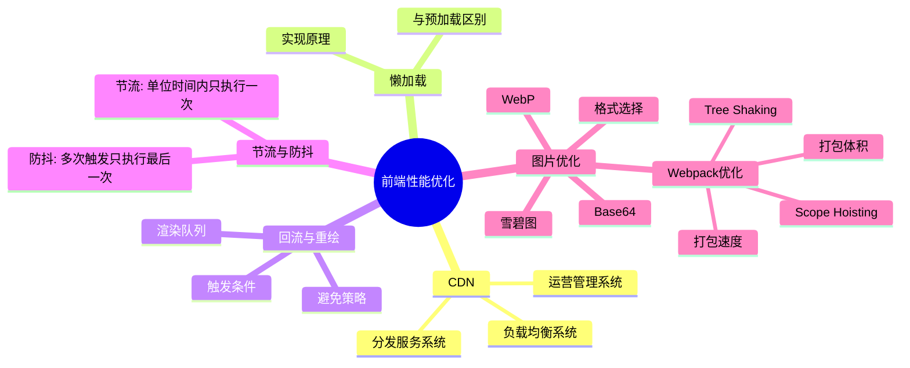

---

## 一、CDN

### 1. CDN的概念

CDN（Content Delivery Network，**内容分发网络**）是指一种通过互联网互相连接的电脑网络系统，利用最靠近每位用户的服务器，更快、更可靠地将音乐、图片、视频、应用程序及其他文件发送给用户，来提供高性能、可扩展性及低成本的网络内容传递给用户。

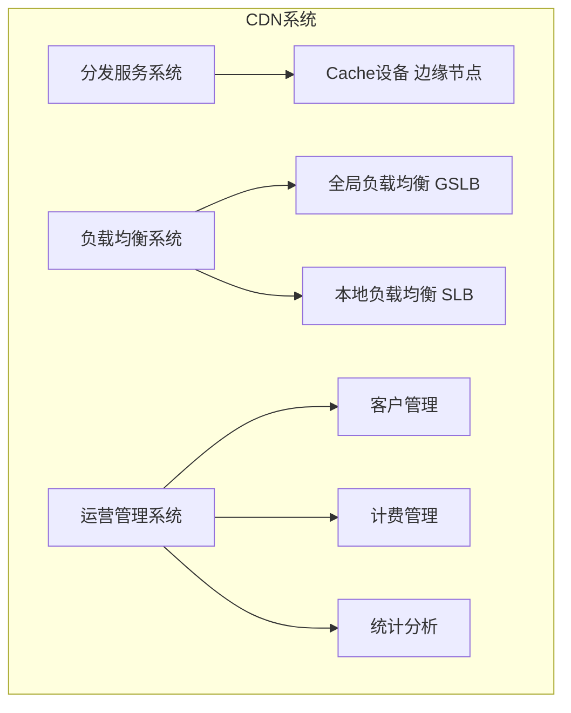

典型的CDN系统由下面三个部分组成：

- **分发服务系统：**最基本的工作单元就是Cache设备，cache（边缘cache）负责直接响应最终用户的访问请求，把缓存在本地的内容快速地提供给用户。同时cache还负责与源站点进行内容同步，把更新的内容以及本地没有的内容从源站点获取并保存在本地。
- **负载均衡系统：**主要功能是负责对所有发起服务请求的用户进行访问调度，确定提供给用户的最终实际访问地址。两级调度体系分为全局负载均衡（GSLB）和本地负载均衡（SLB）。**全局负载均衡**主要根据用户就近性原则，通过对每个服务节点进行"最优"判断，确定向用户提供服务的cache的物理位置。**本地负载均衡**主要负责节点内部的设备负载均衡
- **运营管理系统：**运营管理系统分为运营管理和网络管理子系统，负责处理业务层面的与外界系统交互所必须的收集、整理、交付工作。

### 2. CDN的作用

（1）在性能方面，引入CDN的作用在于：

- 用户收到的内容来自最近的数据中心，延迟更低，内容加载更快
- 部分资源请求分配给了CDN，减少了服务器的负载

（2）在安全方面，CDN有助于防御DDoS、MITM等网络攻击：

- 针对DDoS：通过监控分析异常流量，限制其请求频率
- 针对MITM：从源服务器到 CDN 节点到 ISP，全链路 HTTPS 通信

### 3. CDN的原理

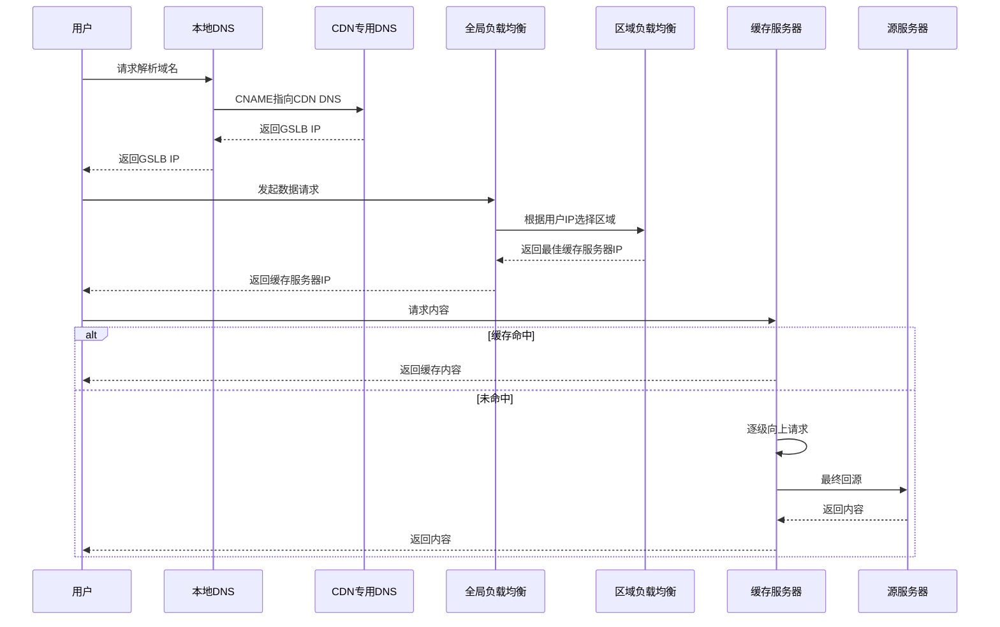

**CDN的工作原理：**

（1）用户未使用CDN缓存资源的过程：

1. 浏览器通过DNS对域名进行解析，依次得到此域名对应的IP地址
2. 浏览器根据得到的IP地址，向域名的服务主机发送数据请求
3. 服务器向浏览器返回响应数据

（2）用户使用CDN缓存资源的过程：

1. 经过本地DNS系统的解析，发现该URL对应的是一个CDN专用的DNS服务器，DNS系统就会将域名解析权交给CNAME指向的CDN专用的DNS服务器。
2. CND专用DNS服务器将CND的全局负载均衡设备IP地址返回给用户
3. 用户向CDN的全局负载均衡设备发起数据请求
4. CDN的全局负载均衡设备根据用户的IP地址以及用户请求的内容URL，选择一台用户所属区域的区域负载均衡设备
5. 区域负载均衡设备选择一台合适的缓存服务器来提供服务，将该缓存服务器的IP地址返回给全局负载均衡设备
6. 全局负载均衡设备把服务器的IP地址返回给用户
7. 用户向该缓存服务器发起请求，缓存服务器响应用户的请求

CNAME（意为：别名）：在域名解析中，实际上解析出来的指定域名对应的IP地址，或者该域名的一个CNAME，然后再根据这个CNAME来查找对应的IP地址。

### 4. CDN的使用场景

- **使用第三方的CDN服务：**如果想要开源一些项目，可以使用第三方的CDN服务
- **使用CDN进行静态资源的缓存：**将自己网站的静态资源放在CDN上，比如js、css、图片等。可以将整个项目放在CDN上，完成一键部署。
- **直播传送：**直播本质上是使用流媒体进行传送，CDN也是支持流媒体传送的

---

## 二、懒加载

### 1. 懒加载的概念

懒加载也叫做延迟加载、按需加载，指的是在长网页中延迟加载图片数据，是一种较好的网页性能优化的方式。

### 2. 懒加载的特点

- **减少无用资源的加载**：明显减少了服务器的压力和流量
- **提升用户体验**: 使用懒加载能大大的提高用户体验
- **防止加载过多图片而影响其他资源文件的加载**

### 3. 懒加载的实现原理

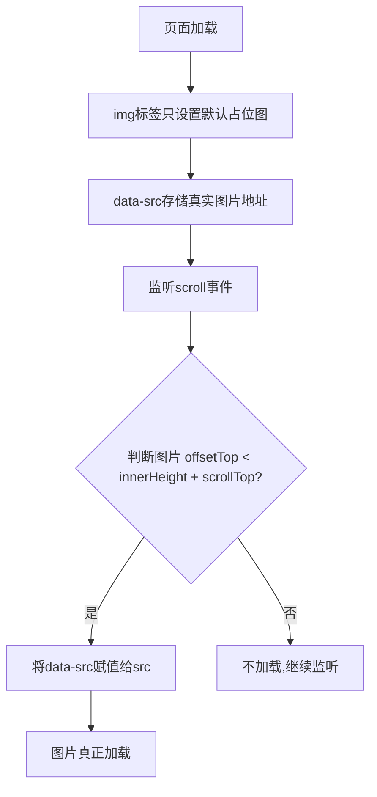

**代码实现：**

```javascript
<div class="container">
     
     
     
</div>
<script>
var imgs = document.querySelectorAll('img');
function lozyLoad(){
    var scrollTop = document.body.scrollTop || document.documentElement.scrollTop;
    var winHeight= window.innerHeight;
    for(var i=0;i < imgs.length;i++){
        if(imgs[i].offsetTop < scrollTop + winHeight ){
            imgs[i].src = imgs[i].getAttribute('data-src');
        }
    }
}
window.onscroll = lozyLoad();
</script>
```

### 4. 懒加载与预加载的区别

- **懒加载**：当用户需要访问时，再去加载，提高首屏加载速度，减少服务器压力
- **预加载**：将所需的资源提前请求加载到本地，后面需要时直接从缓存取资源

---

## 三、回流与重绘

### 1. 回流与重绘的概念及触发条件

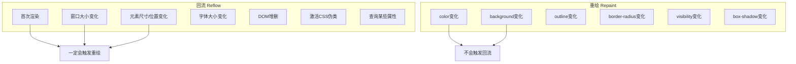

#### （1）回流

当渲染树中部分或者全部元素的尺寸、结构或者属性发生变化时，浏览器会重新渲染部分或者全部文档的过程就称为**回流**。

下面这些操作会导致回流：

- 页面的首次渲染
- 浏览器的窗口大小发生变化
- 元素的内容发生变化
- 元素的尺寸或者位置发生变化
- 元素的字体大小发生变化
- 激活CSS伪类
- 查询某些属性或者调用某些方法
- 添加或者删除可见的DOM元素

在触发回流（重排）的时候，由于浏览器渲染页面是基于流式布局的，所以当触发回流时，会导致周围的DOM元素重新排列，它的影响范围有两种：

- 全局范围：从根节点开始，对整个渲染树进行重新布局
- 局部范围：对渲染树的某部分或者一个渲染对象进行重新布局

#### （2）重绘

当页面中某些元素的样式发生变化，但是不会影响其在文档流中的位置时，浏览器就会对元素进行重新绘制，这个过程就是**重绘**。

注意： **当触发回流时，一定会触发重绘，但是重绘不一定会引发回流。**

### 2. 如何避免回流与重绘？

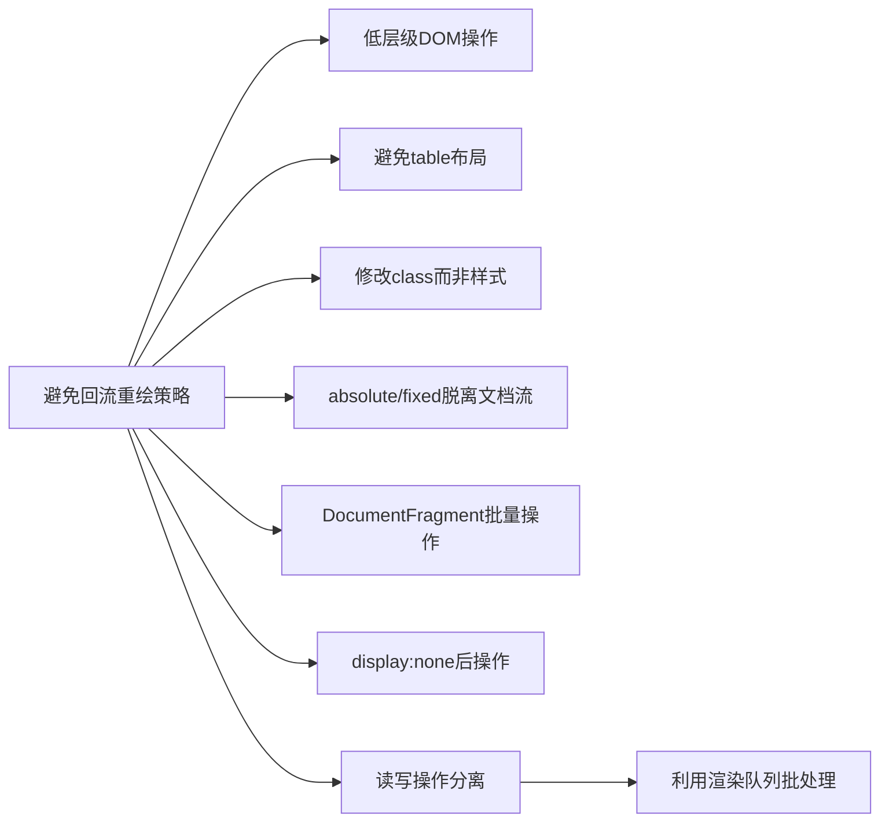

**减少回流与重绘的措施：**

- 操作DOM时，尽量在低层级的DOM节点进行操作
- 不要使用`table`布局，一个小的改动可能会使整个`table`进行重新布局
- 使用CSS的表达式
- 不要频繁操作元素的样式，对于静态页面，可以修改类名，而不是样式。
- 使用absolute或者fixed，使元素脱离文档流
- 避免频繁操作DOM，可以创建一个文档片段`documentFragment`
- 将元素先设置`display: none`，操作结束后再把它显示出来
- 将DOM的多个读操作（或者写操作）放在一起

### 3. 如何优化动画？

将动画的`position`属性设置为`absolute`或者`fixed`，将动画脱离文档流，这样他的回流就不会影响到页面了。

### 4. documentFragment 是什么？

DocumentFragment，文档片段接口，一个没有父对象的最小文档对象。它被作为一个轻量版的 Document使用，与document相比，最大的区别是DocumentFragment不是真实 DOM 树的一部分，它的变化不会触发 DOM 树的重新渲染。当我们把一个 DocumentFragment 节点插入文档树时，插入的不是 DocumentFragment 自身，而是它的所有子孙节点。

---

## 四、节流与防抖

### 1. 对节流与防抖的理解

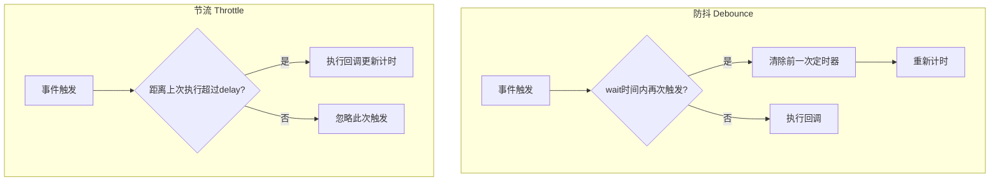

**防抖函数的应用场景：**

- 按钮提交场景：防⽌多次提交按钮，只执⾏最后提交的⼀次
- 服务端验证场景：表单验证需要服务端配合，只执⾏⼀段连续的输⼊事件的最后⼀次

**节流函数的适⽤场景：**

- 拖拽场景：固定时间内只执⾏⼀次，防⽌超⾼频次触发位置变动
- 缩放场景：监控浏览器resize
- 动画场景：避免短时间内多次触发动画引起性能问题

### 2. 实现节流函数和防抖函数

**函数防抖的实现：**

```javascript
function debounce(fn, wait) {
  var timer = null;
  return function() {
    var context = this,
      args = [...arguments];
    if (timer) {
      clearTimeout(timer);
      timer = null;
    }
    timer = setTimeout(() => {
      fn.apply(context, args);
    }, wait);
  };
}
```

**函数节流的实现：**

```javascript
// 时间戳版
function throttle(fn, delay) {
  var preTime = Date.now();
  return function() {
    var context = this,
      args = [...arguments],
      nowTime = Date.now();
    if (nowTime - preTime >= delay) {
      preTime = Date.now();
      return fn.apply(context, args);
    }
  };
}

// 定时器版
function throttle (fun, wait){
  let timeout = null
  return function(){
    let context = this
    let args = [...arguments]
    if(!timeout){
      timeout = setTimeout(() => {
        fun.apply(context, args)
        timeout = null 
      }, wait)
    }
  }
}
```

---

## 五、图片优化

### 1. 如何对项目中的图片进行优化？

1. 不用图片。很多时候会使用到很多修饰类图片，其实这类修饰图片完全可以用 CSS 去代替。
2. 对于移动端来说，屏幕宽度就那么点，完全没有必要去加载原图浪费带宽。可以计算出适配屏幕的宽度，然后去请求相应裁剪好的图片。
3. 小图使用 base64 格式
4. 将多个图标文件整合到一张图片中（雪碧图）
5. 选择正确的图片格式：
   - 对于能够显示 WebP 格式的浏览器尽量使用 WebP 格式
   - 小图使用 PNG，其实对于大部分图标这类图片，完全可以使用 SVG 代替
   - 照片使用 JPEG

### 2. 常见的图片格式及使用场景

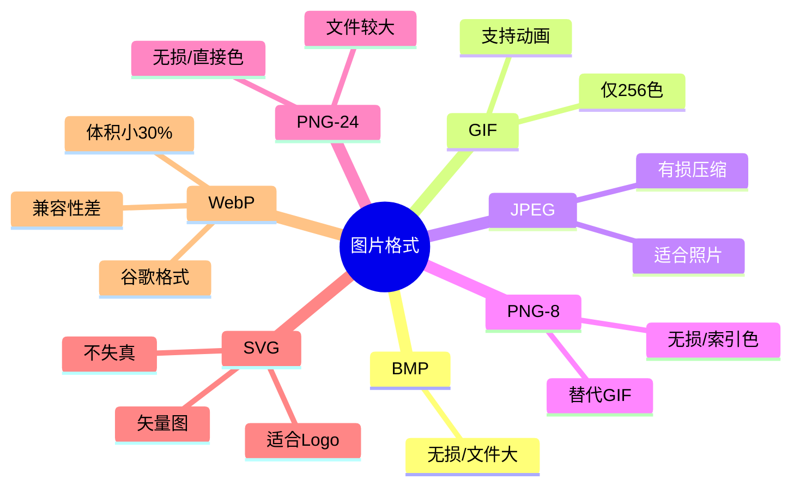

---

## 六、Webpack优化

### 1. 如何提⾼**webpack**的打包速度**?**

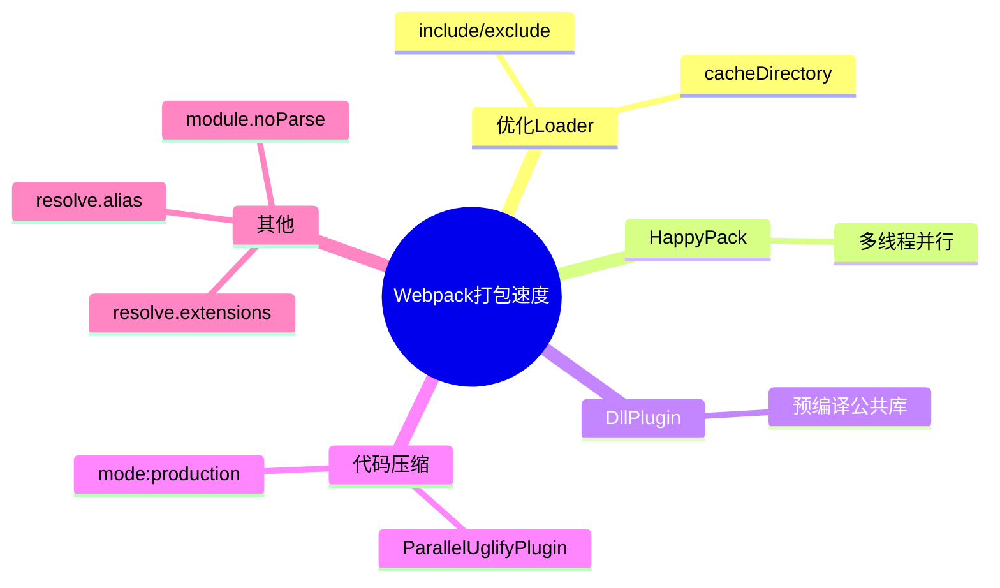

#### （1）优化 Loader

```javascript
module.exports = {
  module: {
    rules: [
      {
        test: /\.js$/,
        loader: 'babel-loader',
        include: [resolve('src')],
        exclude: /node_modules/
      }
    ]
  }
}
```

```javascript
loader: 'babel-loader?cacheDirectory=true'
```

#### （2）HappyPack

```javascript
module: {
  loaders: [
    {
      test: /\.js$/,
      include: [resolve('src')],
      exclude: /node_modules/,
      loader: 'happypack/loader?id=happybabel'
    }
  ]
},
plugins: [
  new HappyPack({
    id: 'happybabel',
    loaders: ['babel-loader?cacheDirectory'],
    threads: 4
  })
]
```

#### （3）DllPlugin

```javascript
// webpack.dll.conf.js
const path = require('path')
const webpack = require('webpack')
module.exports = {
  entry: {
    vendor: ['react']
  },
  output: {
    path: path.join(__dirname, 'dist'),
    filename: '[name].dll.js',
    library: '[name]-[hash]'
  },
  plugins: [
    new webpack.DllPlugin({
      name: '[name]-[hash]',
      context: __dirname,
      path: path.join(__dirname, 'dist', '[name]-manifest.json')
    })
  ]
}
```

### 2. 如何减少 Webpack 打包体积

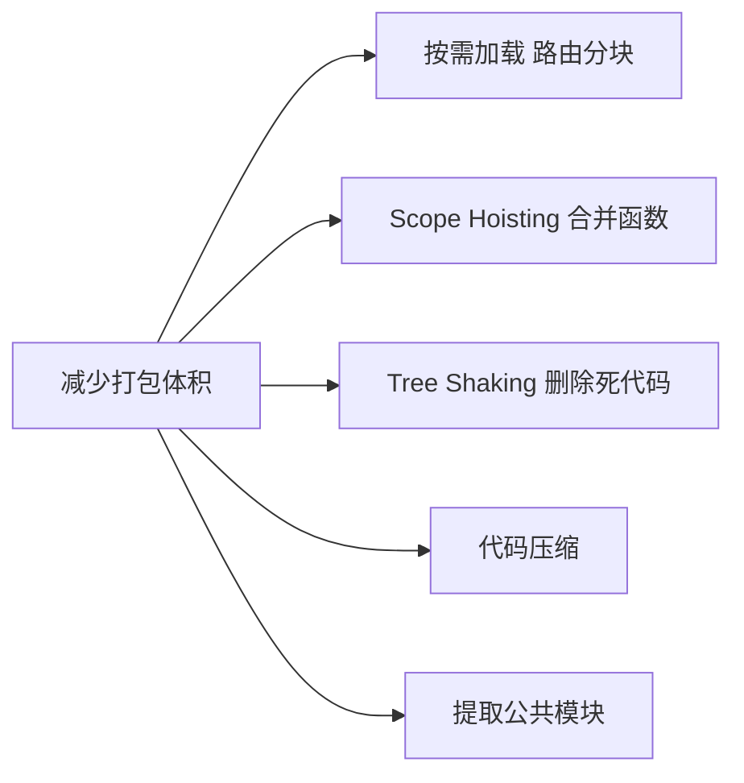

#### （1）按需加载

将每个路由页面单独打包为一个文件，当使用的时候再去下载对应文件。

#### （2）Scope Hoisting

**Scope Hoisting 会分析出模块之间的依赖关系，尽可能的把打包出来的模块合并到一个函数中去。**

```javascript
// 未使用 Scope Hoisting
[
  /* 0 */
  function (module, exports, require) { /*...*/ },
  /* 1 */
  function (module, exports, require) { /*...*/ }
]

// 使用 Scope Hoisting
[
  /* 0 */
  function (module, exports, require) { /*...*/ }
]
```

```javascript
module.exports = {
  optimization: {
    concatenateModules: true
  }
}
```

#### （3）Tree Shaking

**Tree Shaking 可以实现删除项目中未被引用的代码**，开启生产环境就会自动启动这个优化功能。

```javascript
// webpack.config.js
module.exports = {
  ...
  optimization: {
    usedExports: true
  }
}
```

---

## 七、Core Web Vitals

### 1. 核心指标概览

Core Web Vitals 是 Google 制定的用户体验量化标准，2024年后核心指标为 **LCP、INP、CLS** 三项。

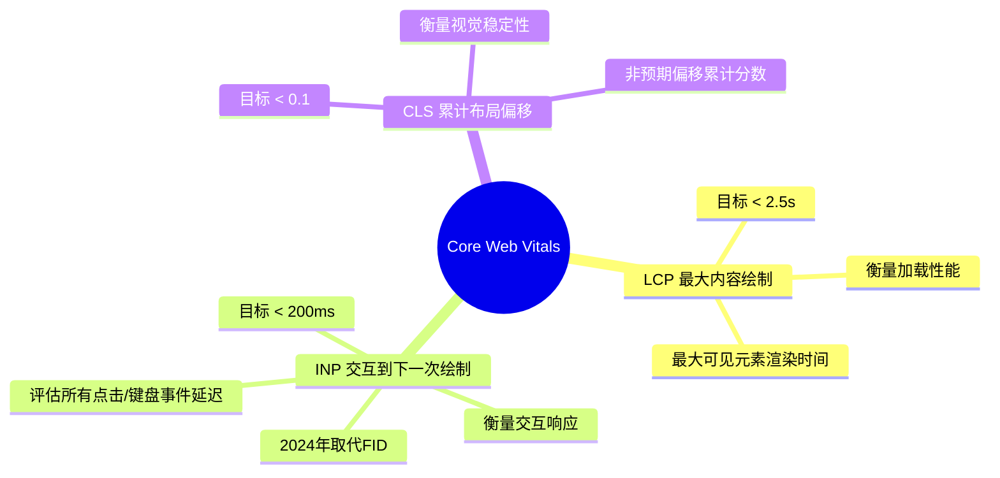

### 2. LCP 优化

LCP（Largest Contentful Paint）衡量页面主要内容对用户可见的时间。常见 LCP 元素包括 img、video、含背景图的 div、大型文本块等。

**优化目标：** < 2.5s

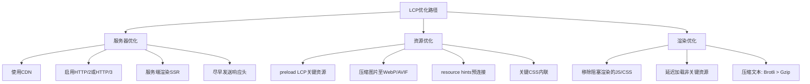

```html
<!-- preload LCP 图片 -->
<link rel="preload" as="image" href="hero.webp">

<!-- preconnect 第三方源 -->
<link rel="preconnect" href="https://fonts.googleapis.com">
```

### 3. INP 优化

INP（Interaction to Next Paint）评估页面所有交互操作的响应延迟，取最差或接近最差的延迟作为评分依据。2024年3月正式取代 FID。

**优化目标：** < 200ms

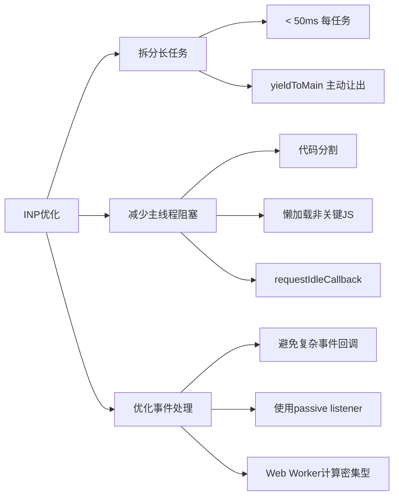

```javascript
// yieldToMain - 主动让出主线程
function yieldToMain() {
  return new Promise(resolve => {
    setTimeout(resolve, 0);
  });
}

async function processLargeData(items) {
  for (let i = 0; i < items.length; i++) {
    processItem(items[i]);
    if (i % 50 === 0) await yieldToMain();
  }
}
```

```javascript
// requestIdleCallback 利用空闲时间
requestIdleCallback((deadline) => {
  while (deadline.timeRemaining() > 0 && tasks.length > 0) {
    processTask(tasks.shift());
  }
}, { timeout: 2000 });
```

### 4. CLS 优化

CLS（Cumulative Layout Shift）量化页面在加载过程中内容的**非预期偏移**。偏移分数 = 影响比例 × 移动距离。

**优化目标：** < 0.1

**CLS 触发原因分析：**

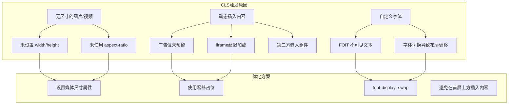

```css
/* 设置尺寸属性 */
img, video {
  width: 100%;
  height: auto;
  aspect-ratio: 16 / 9;
}

/* 为广告位预留空间 */
.ad-slot {
  min-height: 250px;
  width: 100%;
}

/* 字体优化 */
@font-face {
  font-family: 'CustomFont';
  src: url('/fonts/CustomFont.woff2') format('woff2');
  font-display: swap;
}
```

---

## 八、资源加载优化

### 1. 资源提示 (Resource Hints)

资源提示让浏览器**提前发现**并**优先处理**关键资源，是零成本的预加载优化手段。

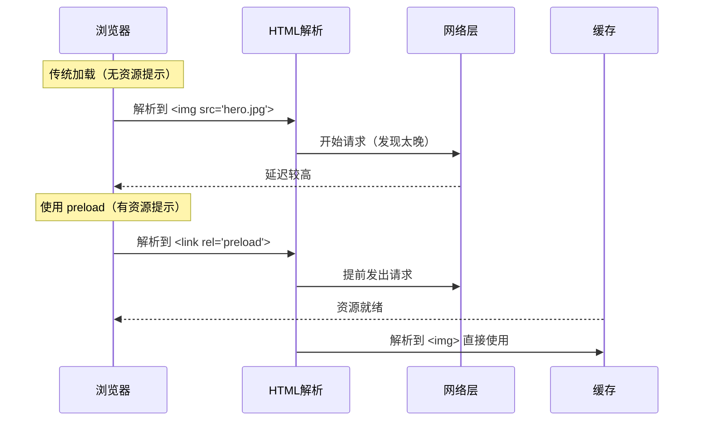

| 提示类型 | 用途 | 示例 |
|---|---|---|
| `preload` | 提前加载当前页面关键资源 | `<link rel="preload" as="font">` |
| `prefetch` | 预取下一页可能用到的资源 | `<link rel="prefetch" href="/next-page.js">` |
| `preconnect` | 提前建立源站连接（DNS+TCP+TLS） | `<link rel="preconnect" href="https://api.example.com">` |
| `dns-prefetch` | 仅提前解析DNS | `<link rel="dns-prefetch" href="//example.com">` |
| `modulepreload` | 预加载ES Module及其依赖 | `<link rel="modulepreload" href="/app.mjs">` |

```html
<!-- 资源提示示例 -->
<link rel="preload" href="/fonts/Inter.woff2" as="font" crossorigin>
<link rel="preconnect" href="https://fonts.googleapis.com">
<link rel="dns-prefetch" href="//www.googletagmanager.com">
<link rel="prefetch" href="/blog-page.js" as="script">
<link rel="modulepreload" href="/src/app.js">
```

### 2. 代码分割策略

代码分割将应用拆分为更小的 chunk，按需加载，显著减少首屏体积。

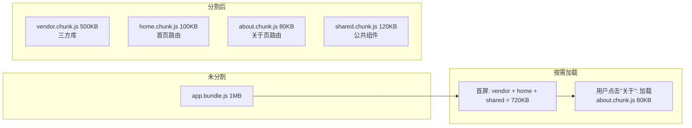

```javascript
// React: React.lazy 路由级别分割
const Home = React.lazy(() => import('./pages/Home'));
const About = React.lazy(() => import('./pages/About'));

// Vue: defineAsyncComponent 组件级别分割
const HeavyChart = defineAsyncComponent(() =>
  import('./components/HeavyChart.vue')
);
```

```javascript
// Vite 自动代码分割 (vite.config.js)
export default defineConfig({
  build: {
    rollupOptions: {
      output: {
        manualChunks: {
          vendor: ['react', 'react-dom'],
          utils: ['lodash-es', 'date-fns'],
        }
      }
    }
  }
});
```

### 3. HTTP/2 vs HTTP/3

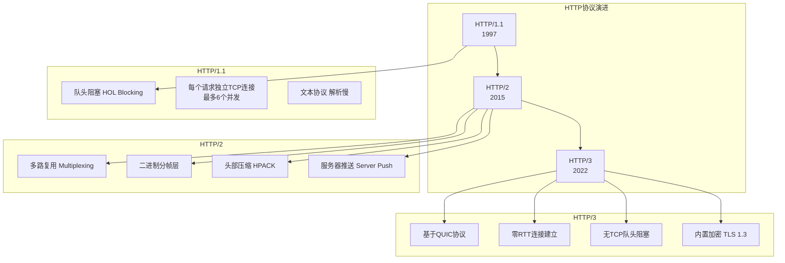

| 特性 | HTTP/1.1 | HTTP/2 | HTTP/3 |
|---|---|---|---|
| 传输协议 | TCP | TCP | QUIC (基于UDP) |
| 多路复用 | 不支持 | 支持 | 支持 |
| 队头阻塞 | 应用层+传输层 | 传输层(TCP) | 无 |
| 连接建立 | 3次握手 | 1次TCP + 协商 | 0-RTT / 1-RTT |
| 头部压缩 | 无 | HPACK | QPACK |
| 服务器推送 | 无 | 支持 | 支持 |

### 4. 压缩算法

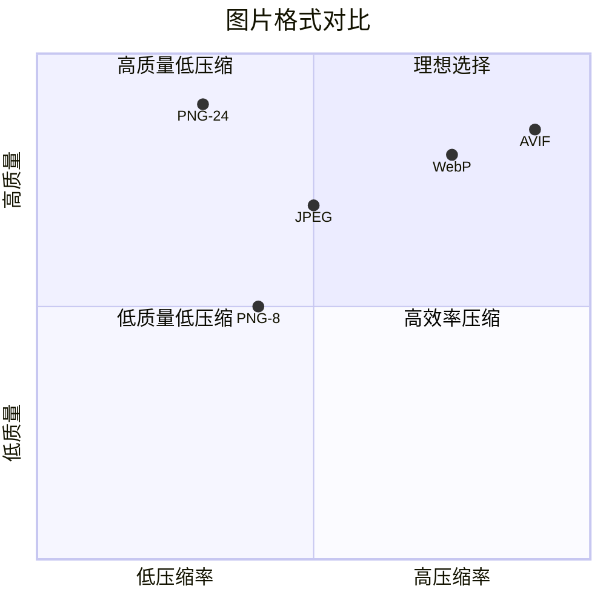

| 文本压缩 | 压缩比 | 速度 | 浏览器支持 |
|---|---|---|---|
| Gzip | ~70% | 快 | 100% |
| Brotli (质量11) | ~80% | 较慢 | ~96% |

| 图片格式 | 压缩类型 | 相对JPEG体积 | 浏览器支持 |
|---|---|---|---|
| JPEG | 有损 | 基准 | 100% |
| WebP | 有损/无损 | 小25-35% | ~96% |
| AVIF | 有损/无损 | 小50% | ~92% |
| JPEG XL | 有损/无损 | 小60% | ~20% |

---

## 九、渲染性能优化

### 1. content-visibility: auto

`content-visibility: auto` 是 CSS 原生虚拟渲染属性，浏览器自动跳过屏幕外元素的渲染（样式计算、布局、绘制）。

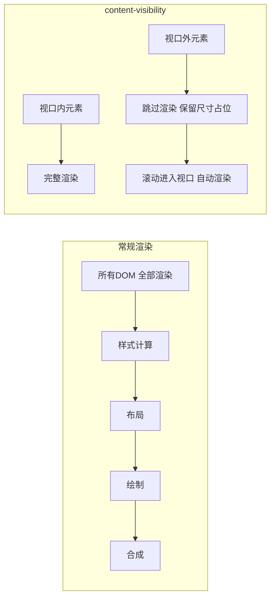

| 特性 | content-visibility | 传统懒加载 |
|---|---|---|
| 实现方式 | CSS属性 | JS监听滚动 |
| 渲染跳过 | 样式+布局+绘制 | 仅跳过资源加载 |
| 内存占用 | 低（跳过渲染） | 中 |
| 兼容性 | 现代浏览器 | 全兼容 |
| 使用难度 | 一行CSS | 需要JS逻辑 |

```css
/* 长列表优化 - 一行CSS */
.long-list-item {
  content-visibility: auto;
  contain-intrinsic-size: 200px; /* 占位高度 */
}
```

### 2. will-change 和 GPU加速

`will-change` 告知浏览器**提前优化**特定元素，而 CSS 3D transforms 可触发 GPU 合成层，将渲染从 CPU 转移到 GPU。

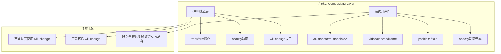

```css
/* 开启GPU加速 */
.gpu-accelerated {
  transform: translateZ(0);
  /* 或 will-change: transform; */
}

/* 动画开始前提示 */
.animated-element {
  will-change: transform, opacity;
}

/* 动画结束后移除 */
.animated-element.playing {
  will-change: auto;
}
```

### 3. Critical CSS

Critical CSS 将首屏渲染必需的样式**内联**到 HTML `<head>` 中，非关键样式异步加载，消除 CSS 阻塞渲染。

```mermaid
flowchart TD
    A["页面构建"] --> B["提取关键CSS"]
    B --> C["内联到HTML head"]
    B --> D["非关键CSS标记异步加载"]

    D --> D1["media=#quot;print#quot; 加载完成切换"]
    D --> D2["rel=#quot;preload#quot; onload转stylesheet"]

    subgraph 渲染流程
        E["浏览器解析HTML"]
        E --> F["遇到head内联CSS -> 立即应用"]
        F --> G["首屏快速渲染"]
        G --> H["异步CSS加载完成 -> 应用到全页"]
    end
```

```html
<!-- 关键CSS内联 -->
<head>
  <style>
    /* 首屏关键样式直接内联 */
    .header { display: flex; ... }
    .hero { height: 100vh; ... }
  </style>

  <!-- 非关键CSS异步加载 -->
  <link rel="preload" href="/styles/full.css" as="style"
        onload="this.onload=null;this.rel='stylesheet'">
  <noscript><link rel="stylesheet" href="/styles/full.css"></noscript>
</head>
```

```bash
# 使用 critters (webpack插件) 自动提取内联
npm i critters-webpack-plugin
```

### 4. 字体优化

自定义字体加载策略直接影响 **CLS** 和首屏渲染速度。

```mermaid
graph TD
    subgraph font-display策略
        A["block"] --> A1["FOIT 最多3秒<br/>字体加载前不可见 会阻塞"]
        B["swap"] --> B1["先用后备字体显示<br/>字体加载后切换 导致CLS"]
        C["fallback"] --> C1["极短FOIT 100ms<br/>后备字体显示 不切换"]
        D["optional"] --> D1["极短FOIT 100ms<br/>网络差时不加载字体"]
    end

    subgraph 推荐
        E["swap + size-adjust"] --> F["减少字体切换CLS"]
        E --> G["从 Google Fonts self-host"]
        E --> H["使用 woff2 格式"]
        E --> I["subset 子集化 减少体积"]
    end
```

```css
/* font-display 策略 */
@font-face {
  font-family: 'Inter';
  src: url('/fonts/Inter.woff2') format('woff2');
  font-display: swap;
  font-weight: 400;
}

/* size-adjust 减少CLS */
@font-face {
  font-family: 'Inter Fallback';
  src: local('Arial');
  size-adjust: 98%;
  ascent-override: 90%;
  descent-override: 22%;
}
```

| 策略 | FOIT时间 | 行为 | 适用场景 |
|---|---|---|---|
| `block` | 最多3s | 不可见期间不显示文本 | Logo、品牌字体 |
| `swap` | 0ms | 立即用后备字体 | 正文内容 |
| `fallback` | 100ms | 短FOIT后退化为后备 | 一般推荐 |
| `optional` | 100ms | 网络差时不加载 | 装饰性字体 |

---

## 十、监测与分析

### 1. Lighthouse

Lighthouse 是 Google 开源的自动化网站审计工具，覆盖性能、可访问性、SEO 等多个维度。

```mermaid
graph TB
    subgraph Lighthouse核心审计项
        A["Performance 性能"] --> A1["FCP / LCP / TBT / CLS / SI"]
        B["Accessibility 可访问性"] --> B1["ARIA / 对比度 / 键盘"]
        C["Best Practices 最佳实践"] --> C1["HTTPS / 控制台错误"]
        D["SEO 搜索引擎优化"] --> D1["meta / 标题 / 结构化数据"]
        E["PWA 渐进式应用"] --> E1["Service Worker / 离线"]
    end

    subgraph 评分标准
        F["90-100 绿色"]
        G["50-89 橙色"]
        H["0-49 红色"]
    end

    F --> I["快速 优秀"]
    G --> J["一般 需要改进"]
    H --> K["慢 较差"]
```

```bash
# Lighthouse CI - 自动化
npx lhci autorun --collect.url=https://example.com
```

### 2. Web Vitals 监测

全面监测需要结合 **CrUX（实验室数据）** 和 **RUM（真实用户数据）**。

```mermaid
graph LR
    subgraph 数据来源
        A["CrUX<br/>Chrome用户体验报告"]
        B["RUM<br/>真实用户监测"]
    end

    subgraph 采集方式
        C["PerformanceObserver API"]
        D["web-vitals 库"]
        E["自建采集脚本"]
    end

    subgraph 上报与可视化
        F["Google Analytics 4"]
        G["自建服务"]
        H["Grafana 仪表盘"]
    end

    A --> C
    B --> C
    C --> D
    D --> F
    D --> G
    G --> H
```

```javascript
// Performance Observer API
const observer = new PerformanceObserver((list) => {
  for (const entry of list.getEntries()) {
    console.log(entry.name, entry.startTime, entry.duration);
  }
});

observer.observe({ type: 'largest-contentful-paint', buffered: true });
observer.observe({ type: 'layout-shift', buffered: true });
observer.observe({ type: 'first-input', buffered: true });
```

```javascript
// 使用 web-vitals 库
import { onLCP, onINP, onCLS } from 'web-vitals';

onLCP(console.log);
onINP(console.log);
onCLS(console.log);
```

### 3. RAIL模型

RAIL 是 Google 提出的**以用户为中心**的性能模型，定义了四个关键阶段的响应目标。

```mermaid
xychart-beta
    title "RAIL 性能目标"
    x-axis ["Response点击响应", "Animation动画帧", "Idle空闲处理", "Load页面加载"]
    y-axis "时间 (ms)" 0 --> 5000
    bar [100, 16, 50, 5000]
```

| 阶段 | 目标 | 说明 |
|---|---|---|
| **R**esponse 响应 | < 100ms | 用户操作在100ms内得到反馈 |
| **A**nimation 动画 | < 16ms (60fps) | 每帧在16ms内完成渲染 |
| **I**dle 空闲 | 利用空闲时间 | 用 requestIdleCallback 处理延迟任务 |
| **L**oad 加载 | < 5s | 首屏内容在5秒内完成（3G网络） |

```javascript
// RAIL Response - 事件处理
button.addEventListener('click', () => {
  // 必须在100ms内给出反馈
  showLoadingIndicator(); // 立即反馈

  // 耗时任务异步处理
  setTimeout(() => {
    processHeavyTask(); // 后续处理
  }, 50);
});

// RAIL Animation - 保持60fps
function animate() {
  const start = performance.now();

  updateAnimation(); // 必须在16ms内完成

  const elapsed = performance.now() - start;
  if (elapsed > 16) {
    console.warn(`Frame dropped: ${elapsed}ms`);
  }

  requestAnimationFrame(animate);
}
```

### 4. PRPL模式

PRPL 是 Google 提出的 Web 应用性能模式，专为移动端和现代浏览器设计。

```mermaid
flowchart TD
    P["Push 推送<br/>Server Push或preload推送关键资源"] --> R
    R["Render 渲染<br/>尽快渲染首屏路径"] --> P2
    P2["Pre-cache 预缓存<br/>Service Worker预缓存剩余资源"] --> L
    L["Lazy-load 延迟加载<br/>非关键路由和组件按需加载"]

    subgraph 示例流程
        A["用户请求 /home"] --> B["Push: 推送 app-shell + 首屏CSS/JS"]
        B --> C["Render: 立即渲染首页骨架和内容"]
        C --> D["Pre-cache: SW缓存 /about /detail 等路由资源"]
        D --> E["Lazy-load: 用户点击#quot;关于#quot;时加载对应chunk"]
    end
```

```javascript
// Service Worker 预缓存 (Workbox)
import { precacheAndRoute } from 'workbox-precaching';
precacheAndRoute(self.__WB_MANIFEST); // 自动预构建资源

// 运行时缓存
import { registerRoute } from 'workbox-routing';
import { NetworkFirst } from 'workbox-strategies';

registerRoute(
  ({ request }) => request.destination === 'document',
  new NetworkFirst()
);
```

### 5. 性能预算

性能预算（Performance Budget）是团队约定的**性能指标上限**，防止性能退化。

```mermaid
graph LR
    subgraph 性能预算类型
        A["量化指标"] --> A1["LCP < 2.5s"]
        A --> A2["TTI < 5s"]
        A --> A3["CLS < 0.1"]

        B["资源体积"] --> B1["JS < 300KB gzip"]
        B --> B2["CSS < 50KB gzip"]
        B --> B3["首页总大小 < 500KB"]

        C["请求数量"] --> C1["关键资源 < 6个"]
        C --> C2["总请求 < 25个"]
    end
```

```bash
# 使用 bundlesize 设置体积预算
npx bundlesize --files "dist/**/*.js" --max-size "300 kB"

# webpack-bundle-analyzer 可视化分析
npx webpack-bundle-analyzer dist/stats.json
```

```json
// bundlesize 配置 (package.json)
{
  "bundlesize": [
    { "path": "./dist/vendor.*.js", "maxSize": "250 kB" },
    { "path": "./dist/main.*.js", "maxSize": "50 kB" },
    { "path": "./dist/*.css", "maxSize": "30 kB" }
  ]
}
```

---

## 十一、前沿性能技术

### 1. Edge Computing

边缘计算将计算能力从集中式服务器**下沉到CDN节点**，极大降低用户到服务器的物理距离和响应时间。

| 技术 | 说明 | 代表产品 |
|---|---|---|
| CDN | 静态资源缓存分发 | Cloudflare / Akamai |
| Edge Functions | 在CDN节点运行轻量计算 | Vercel Edge Functions |
| 边缘SSR | 在边缘节点完成服务器端渲染 | Cloudflare Workers + SSR |
| Edge Cache | 动态内容在边缘缓存 | Fly.io / Deno Deploy |

```javascript
// Cloudflare Workers - 边缘响应
export default {
  async fetch(request) {
    const url = new URL(request.url);

    // 边缘HTML渲染
    if (url.pathname === '/product') {
      const product = await getProductFromKV(url.searchParams.get('id'));
      return new Response(renderHTML(product), {
        headers: { 'Content-Type': 'text/html' }
      });
    }

    // 静态资源直接返回
    return fetch(request);
  }
}
```

### 2. Islands Architecture (岛屿架构)

岛屿架构将页面中的**交互组件**视为独立的"岛屿"，每个岛屿可以独立水合，而非一次性水合整个页面。

```mermaid
graph TD
    subgraph MPA Islands 架构
        A["静态HTML骨架"] --> B["Header岛屿<br/>导航交互 独立水合"]
        A --> C["图片轮播岛屿<br/>JS交互 独立水合"]
        A --> D["评论区岛屿<br/>数据获取 独立水合"]
        A --> E["静态内容区域<br/>无需水合 零JS"]
    end

    subgraph 传统SPA架构
        F["完整JS应用"] --> G["一次性水合所有组件"]
        G --> H["下载并执行全部JS"]
        G --> I["即使组件不可见或无需交互"]
    end
```

```jsx
// Astro 岛屿组件
---
// 静态部分 - 构建时渲染
const posts = await fetchPosts();
---
<html>
  <body>
    <!-- 静态HTML - 零JS -->
    <header>
      <nav>{posts.map(p => <a href={p.url}>{p.title}</a>)}</nav>
    </header>

    <!-- 交互岛屿 - 仅此处加载JS -->
    <ImageCarousel client:load />

    <!-- 首屏不可见岛屿 - 进入视口加载 -->
    <CommentSection client:visible />

    <!-- 静态内容 -->
    <article>{content}</article>
  </body>
</html>
```

### 3. Streaming SSR

流式SSR将服务器端渲染的HTML**分块发送**到客户端，让浏览器可以尽早开始渲染，无需等待完整HTML生成。

```mermaid
sequenceDiagram
    participant Server as 服务端
    participant Browser as 浏览器

    Note over Server,Browser: 非流式SSR (传统)
    Server->>Server: 等待所有数据就绪
    Server->>Server: 生成完整HTML
    Server->>Browser: 一次性发送完整HTML
    Browser->>Browser: 开始渲染（等待时间长）

    Note over Server,Browser: 流式SSR (Streaming)
    Server->>Browser: 发送Suspense骨架/Spinner
    Server->>Browser: 发送首个数据块 Shell
    Browser->>Browser: 立即渲染 Shell + Spinner
    Server->>Server: 异步获取评论数据
    Server->>Browser: 流式发送评论组件HTML
    Browser->>Browser: 替换Spinner为评论区
```

```jsx
// React 18 Streaming SSR
import { Suspense } from 'react';
import { renderToPipeableStream } from 'react-dom/server';

function handleRequest(req, res) {
  const { pipe } = renderToPipeableStream(
    <html>
      <body>
        <Header />
        <Suspense fallback={<Spinner />}>
          <SlowComments /> {/* 流式发送 */}
        </Suspense>
      </body>
    </html>
  );
  pipe(res); // 立即开始发送
}
```

### 4. Back/Forward Cache (bfcache)

bfcache 是浏览器在用户**前进/后退**导航时，将整个页面（包括JS堆）完整保存到内存中的机制，实现瞬时加载。

```mermaid
graph TD
    subgraph 正常导航
        A["用户访问页面A"] --> B["完全卸载A"]
        B --> C["加载页面B"]
        C --> D["用户点击返回"]
        D --> E["重新请求页面A"]
        E --> F["重新执行全部JS和渲染"]
    end

    subgraph bfcache
        G["用户访问页面A"] --> H["冻结A到内存"]
        H --> I["加载页面B"]
        I --> J["用户点击返回"]
        J --> K["从内存恢复A"]
        K --> L["瞬时展示 无需网络"]
    end
```

**可能导致bfcache被排除的常见原因：**

```javascript
// ❌ 使用 unload 事件 - 将阻止bfcache
window.addEventListener('unload', () => {
  sendBeacon('/analytics');
});

// ✅ 使用 pagehide 替代
window.addEventListener('pagehide', () => {
  sendBeacon('/analytics');
});

// 检测是否从bfcache恢复
window.addEventListener('pageshow', (event) => {
  if (event.persisted) {
    console.log('页面从bfcache恢复');
    // 重新连接WebSocket、刷新过期数据等
  }
});
```

| 阻止bfcache的常见因素 | 解决方案 |
|---|---|
| `unload` 事件 | 使用 `pagehide` 替代 |
| `beforeunload` 事件 | 非必要不使用 |
| `Cache-Control: no-store` | 改为 `no-cache` 或 `private` |
| 使用 `window.opener` | 添加 `rel="noopener"` |
| 活跃的 WebSocket 连接 | 在 `pagehide` 中关闭 |
| 未清理的 IndexedDB 事务 | 确保事务完成或中止 |

---

> **扩展阅读：**
>
> - [web.dev / vitals](https://web.dev/vitals/) - Core Web Vitals 官方指南
> - [Chrome DevTools Performance](https://developer.chrome.com/docs/devtools/performance/) - 性能分析工具
> - [BundlePhobia](https://bundlephobia.com/) - 检查npm包大小
> - [PageSpeed Insights](https://pagespeed.web.dev/) - Google在线性能检测
