## 知识脑图

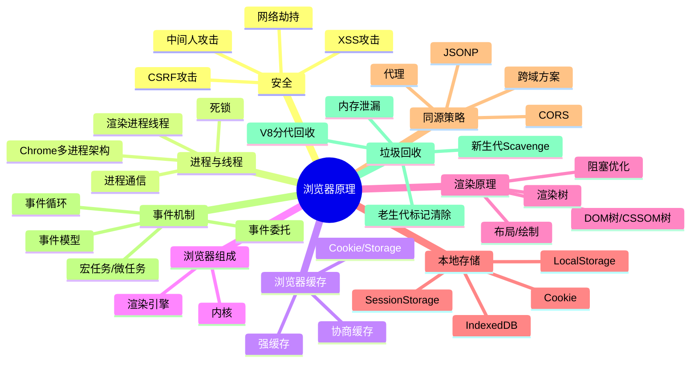

---

## 一、浏览器安全

### 1. 什么是 XSS 攻击？

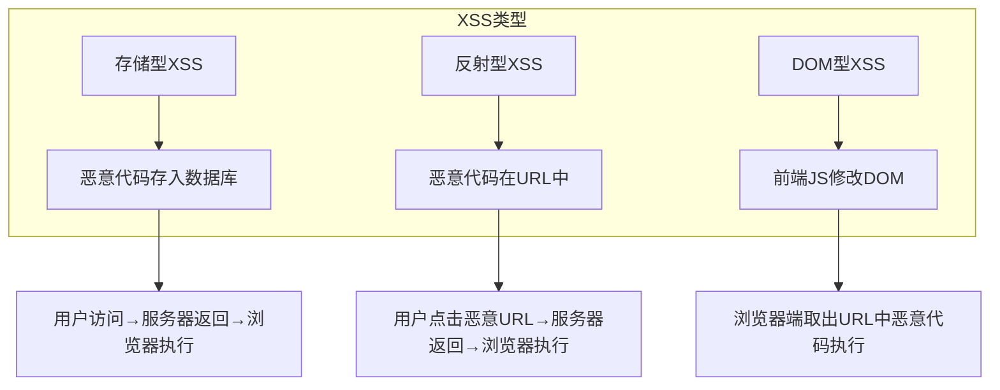

XSS 攻击指的是跨站脚本攻击，是一种代码注入攻击。攻击者通过在网站注入恶意脚本，使之在用户的浏览器上运行，从而盗取用户的信息如 cookie 等。

XSS 可以分为存储型、反射型和 DOM 型：

- **存储型**：恶意脚本会存储在目标服务器上，当浏览器请求数据时，脚本从服务器传回并执行。常见于论坛发帖、商品评论、用户私信等。
- **反射型**：攻击者诱导用户访问一个带有恶意代码的 URL 后，服务器端接收数据后处理，然后把带有恶意代码的数据发送到浏览器端执行。常见于网站搜索、跳转等。
- **DOM 型**：通过修改页面的 DOM 节点形成的 XSS。取出和执行恶意代码由浏览器端完成，属于前端 JavaScript 自身的安全漏洞。

### 2. 如何防御 XSS 攻击？

- 对需要插入到 HTML 中的代码做好充分的转义
- 使用 CSP（内容安全策略），建立白名单，告诉浏览器哪些外部资源可以加载和执行
- 对敏感信息进行保护，比如 cookie 使用 http-only

### 3. 什么是 CSRF 攻击？

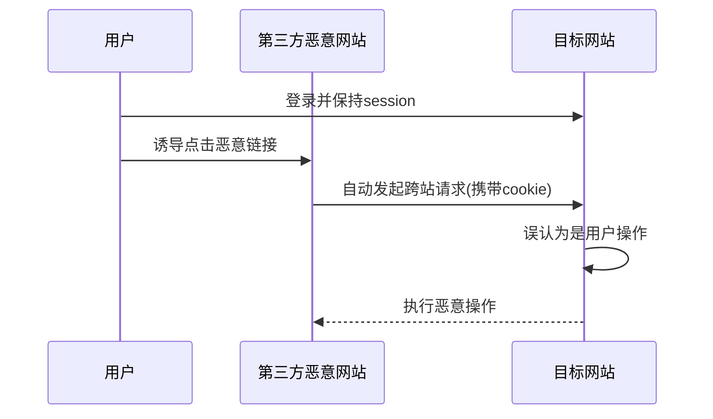

CSRF 攻击指的是跨站请求伪造攻击，攻击者诱导用户进入一个第三方网站，然后该网站向被攻击网站发送跨站请求。CSRF 攻击的本质是利用 cookie 会在同源请求中携带发送给服务器的特点，以此来实现用户的冒充。

常见的 CSRF 攻击有三种：

- GET 类型的 CSRF 攻击
- POST 类型的 CSRF 攻击
- 链接类型的 CSRF 攻击

### 4. 如何防御 CSRF 攻击？

- **进行同源检测**：根据 origin 或 referer 信息判断
- **使用 CSRF Token 进行验证**
- **对 Cookie 进行双重验证**
- **在设置 cookie 属性的时候设置 Samesite**

### 5. 什么是中间人攻击？

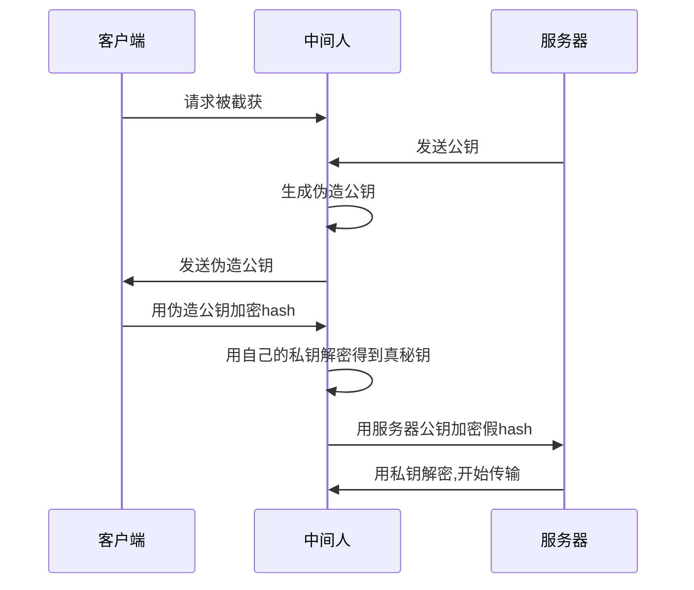

### 6. 网络劫持有哪几种？

- **DNS劫持**：修改运营商的本地DNS记录，引导用户流量到缓存服务器
- **HTTP劫持**：由于http明文传输，运营商修改http响应内容（加广告）

最有效的办法就是全站HTTPS，将HTTP加密。

---

## 二、进程与线程

### 1. 进程与线程的概念

**进程是资源分配的最小单位，线程是CPU调度的最小单位。**

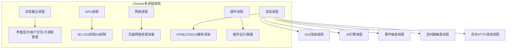

**打开一个网页，最少需要四个进程**：1 个网络进程、1 个浏览器进程、1 个 GPU 进程以及 1 个渲染进程。

### 2. 浏览器渲染进程的线程有哪些

- **GUI渲染线程**：负责渲染页面，解析HTML、CSS，构建DOM树、CSSOM树、渲染树和绘制页面
- **JS引擎线程**：负责处理Javascript脚本程序
- **事件触发线程**：控制事件循环
- **定时器触发进程**：setInterval与setTimeout所在线程
- **异步http请求线程**：XMLHttpRequest连接后通过浏览器新开一个线程请求

注意：GUI渲染线程和JS引擎线程是互斥的，当JS引擎执行时GUI线程会被挂起。

### 3. 进程之间的通信方式

- **管道通信**：操作系统在内核中开辟的一段缓冲区
- **消息队列通信**：从一个进程向另一个进程发送一个数据块
- **信号量通信**：计数器，实现进程之间的互斥与同步
- **信号通信**：操作系统通过信号来通知进程发生了某种事件
- **共享内存通信**：映射一段能被其他进程所访问的内存
- **套接字通信**：不同主机之间的进程通信

### 4. 死锁产生的原因？

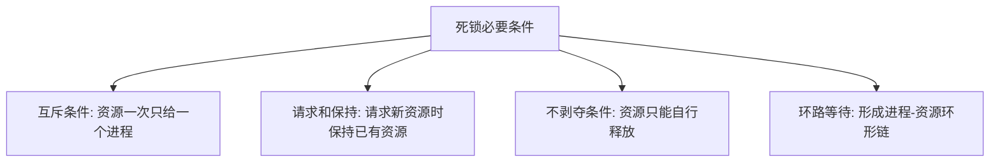

### 5. 如何实现浏览器内多个标签页之间的通信?

- 使用 websocket 协议
- 使用 ShareWorker 的方式
- 使用 localStorage 的方式（监听storage事件）
- 使用 postMessage 方法

### 6. 对Service Worker的理解

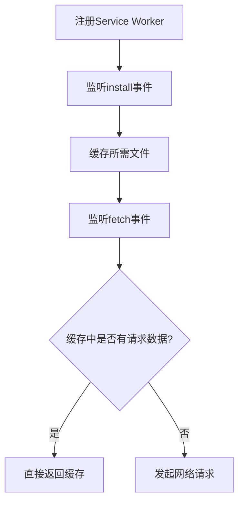

---

## 三、浏览器缓存

### 1. 浏览器缓存机制

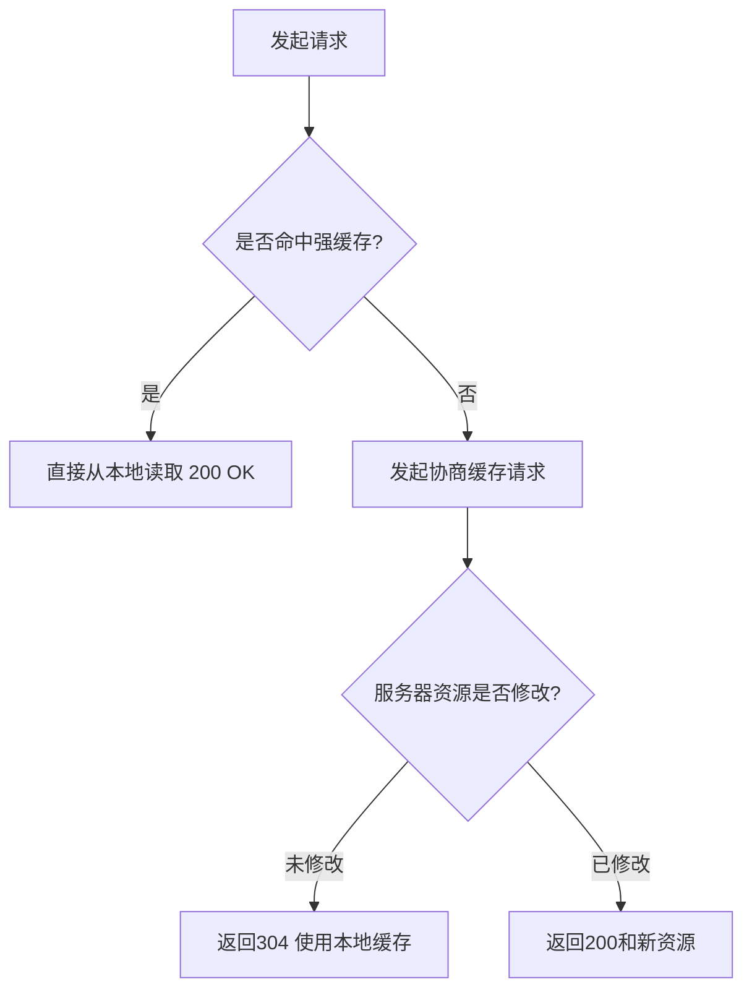

**强缓存：**
- Expires（HTTP1.0）：绝对时间
- Cache-Control（HTTP1.1）：max-age 相对时间，优先级高于Expires

**协商缓存：**
- Last-Modified / If-Modified-Since：最后修改时间（精确到秒）
- Etag / If-None-Match：唯一标识符（优先级更高）

### 2. 点击刷新/强制刷新的区别

- **F5刷新**：浏览器会带上 If-Modifed-Since、If-None-Match，服务器检查新鲜度，返回304或200
- **Ctrl+F5强制刷新**：不会带上条件请求头，相当于从未请求过，返回200
- **地址栏回车**：正常流程，本地检查是否过期，服务器检查新鲜度

---

## 四、浏览器组成

### 1. 浏览器内核

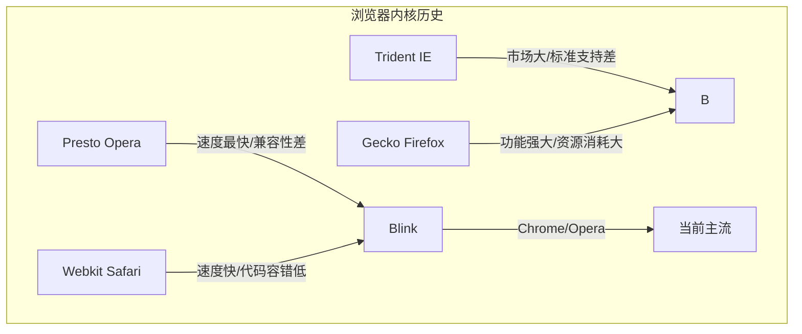

### 2. 浏览器的主要组成部分

- **用户界面**：地址栏、前进/后退按钮、书签菜单等
- **浏览器引擎**：在用户界面和呈现引擎之间传送指令
- **呈现引擎**：负责显示请求的内容
- **网络**：用于网络调用
- **用户界面后端**：用于绘制基本的窗口小部件
- **JavaScript 解释器**：用于解析和执行 JavaScript 代码
- **数据存储**：持久层，在硬盘上保存各种数据

---

## 五、浏览器渲染原理

### 1. 浏览器的渲染过程

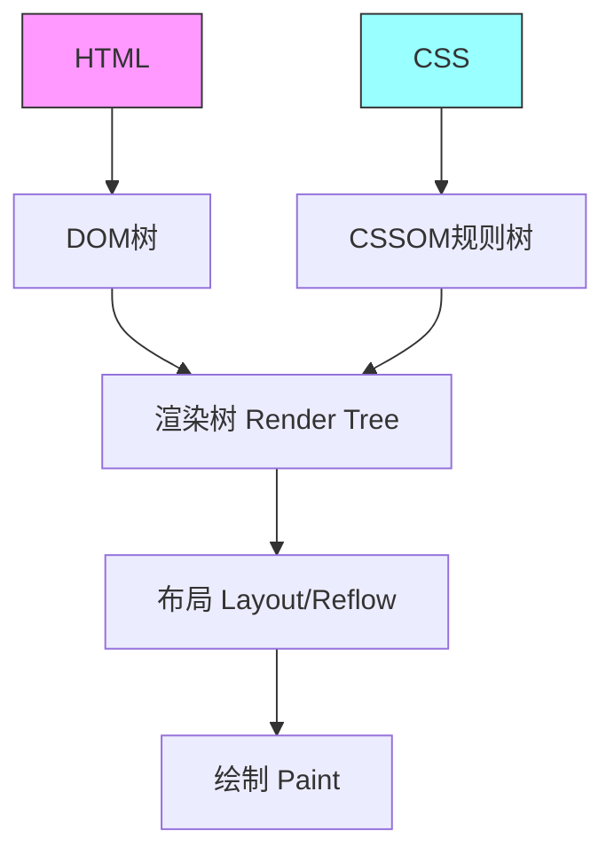

**注意：**这个过程是逐步完成的，渲染引擎将会尽可能早的将内容呈现到屏幕上，并不会等到所有的html都解析完成之后再去构建和布局 render 树。

### 2. 浏览器渲染优化

**（1）针对JavaScript：**
- 将JavaScript文件放在body的最后
- body中间尽量不要写`<script>`标签
- 使用 async 或 defer 属性异步加载

**script、async、defer的区别：**

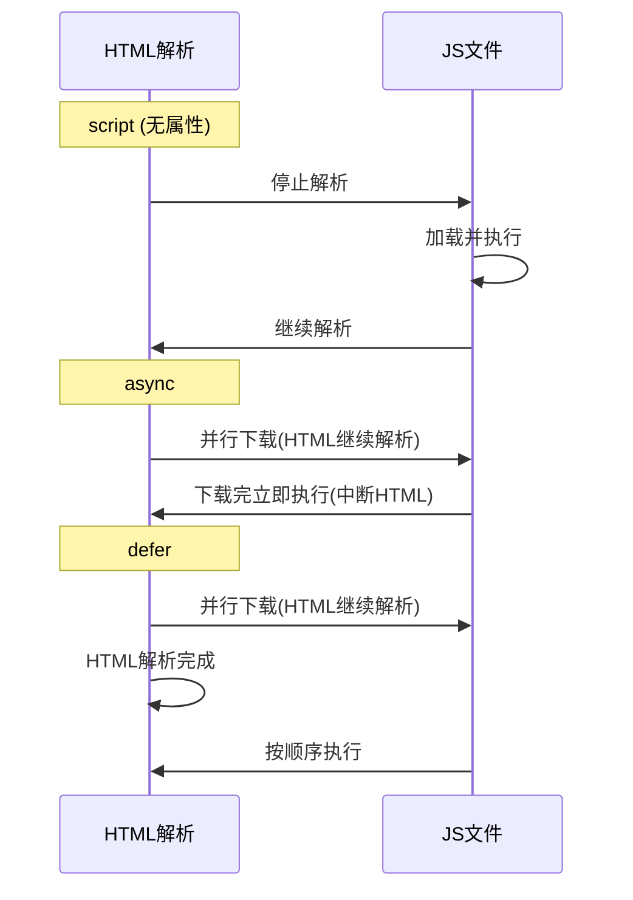

**（2）针对CSS：**
- 使用link而不用@import
- CSS一般写在header中

**（3）减少回流与重绘：**
- 使用absolute/fixed脱离文档流
- 使用documentFragment
- display:none后操作
- 读写操作分离

### 3. 渲染过程中遇到 JS 文件如何处理？

JavaScript 的加载、解析与执行会阻塞文档的解析。如果遇到了 JavaScript，浏览器会暂停文档的解析，将控制权移交给 JavaScript 引擎，等 JavaScript 引擎运行完毕，浏览器再从中断的地方恢复继续解析文档。

### 4. CSS 如何阻塞文档解析？

如果浏览器尚未完成 CSSOM 的下载和构建，而我们却想在此时运行脚本，那么浏览器将延迟 JavaScript 脚本执行和文档的解析，直至其完成 CSSOM 的下载和构建。

---

## 六、浏览器本地存储

### 1. 存储方式对比

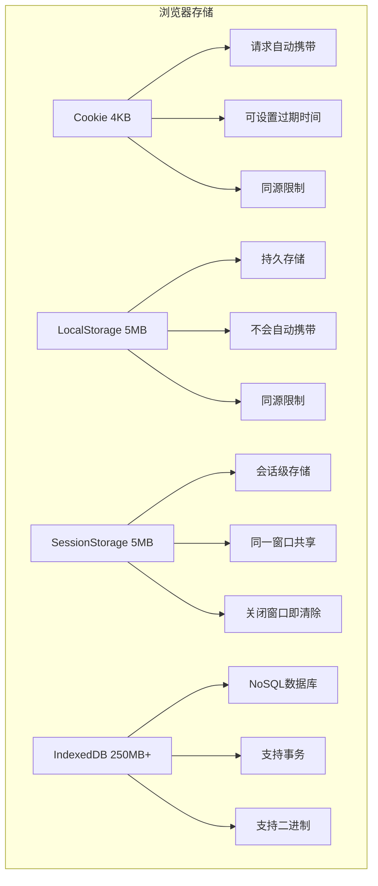

### 2. IndexedDB特点

- 键值对储存
- 异步操作，不会锁死浏览器
- 支持事务
- 同源限制
- 储存空间大（不少于250MB）
- 支持二进制储存

---

## 七、浏览器同源策略

### 1. 什么是同源策略

同源策略：**协议**、**端口号**、**域名**必须一致。

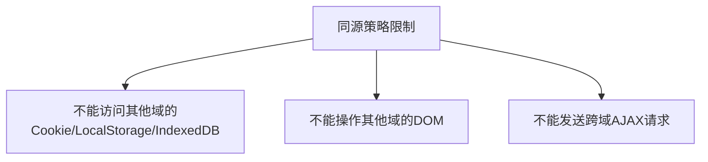

### 2. 如何解决跨域问题

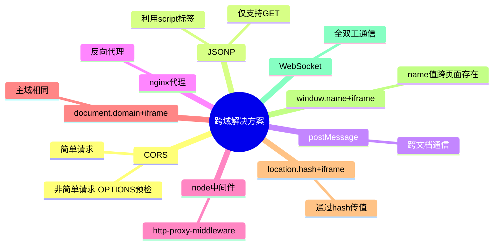

### 3. 正向代理和反向代理的区别

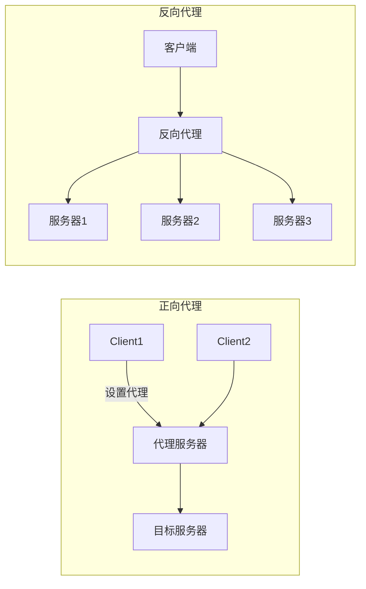

- **正向代理**：客户端设置代理服务器，隐藏客户端（如VPN）
- **反向代理**：服务器设置代理，隐藏真实服务器（如负载均衡）

---

## 八、浏览器事件机制

### 1. 事件模型

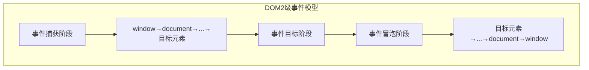

三种事件模型：
- **DOM0级事件模型**：不会传播，没有事件流概念
- **IE事件模型**：事件处理阶段 + 事件冒泡阶段
- **DOM2级事件模型**：事件捕获阶段 + 事件目标阶段 + 事件冒泡阶段

### 2. 事件委托

事件委托本质上是利用了**浏览器事件冒泡**的机制。把子节点的监听函数定义在父节点上，由父节点的监听函数统一处理多个子元素的事件。

**优点：**
- 减少内存消耗
- 动态绑定事件

**局限性：**
- focus、blur 没有事件冒泡机制
- mousemove、mouseout 对性能消耗高

### 3. 事件循环

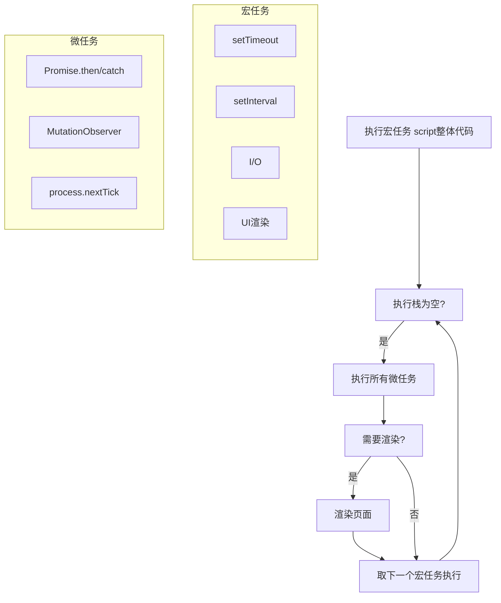

### 4. Node.js 中的 Event Loop

Node 的 Event Loop 分为 6 个阶段：

1. **Timers（计时器阶段）**：执行过期的 setTimeout/setInterval 回调
2. **Pending callbacks**：执行推迟到下一个循环的 I/O 回调
3. **Idle/Prepare**：仅供内部使用
4. **Poll（轮询阶段）**：获取新的 I/O 事件
5. **Check（查询阶段）**：执行 setImmediate 回调
6. **Close callbacks**：执行关闭回调

`process.nextTick` 独立于 Event Loop 之外，每个阶段完成后清空 nextTick 队列，优先于其他微任务执行。

---

## 九、浏览器垃圾回收机制

### 1. V8的垃圾回收机制

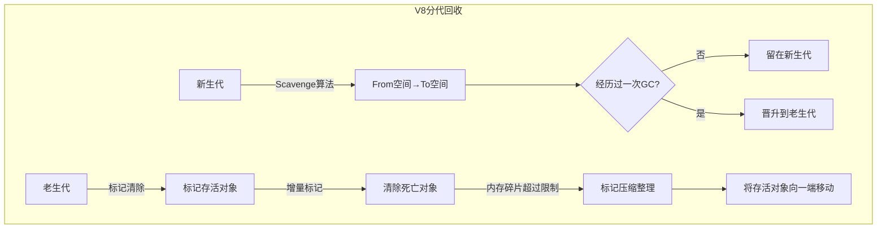

**新生代算法（Scavenge）：** 内存分为 From 和 To 两个空间，From 满时，将存活对象复制到 To 空间，然后互换 From 和 To。

**老生代算法：**
- 标记清除算法（Mark-Sweep）：标记存活对象，销毁未标记对象
- 标记压缩算法（Mark-Compact）：将存活对象向一端移动，清理碎片

V8 从 stop-the-world → 增量标记 → 并发标记，逐步优化GC性能。

### 2. 哪些操作会造成内存泄漏？

- 未声明的变量意外创建全局变量
- 设置了 setInterval 定时器忘记取消
- 获取 DOM 元素的引用后被删除，但引用未释放
- 不合理的使用闭包

---

## 十、现代浏览器安全新特性

### 1. Permissions Policy (权限策略)

Permissions Policy (原 Feature Policy) 允许站点控制哪些浏览器特性可以被使用，提供一套细粒度的权限控制机制。

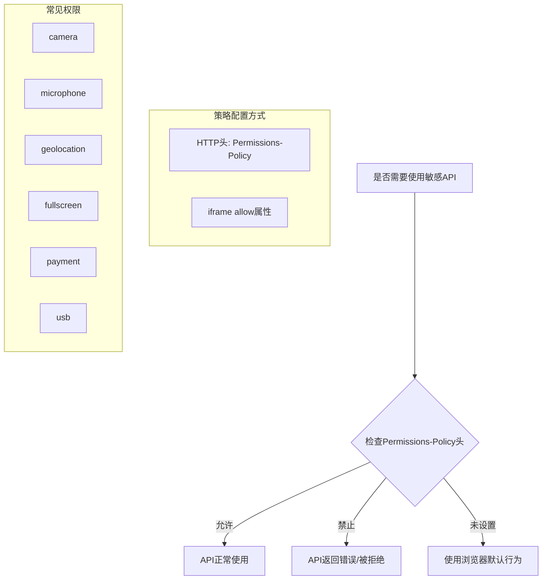

- **HTTP头方式**：`Permissions-Policy: camera=(), microphone=(self), geolocation=(self "https://trusted-site.com")`
- **iframe方式**：`<iframe allow="camera 'none'; microphone 'self'" src="...">`
- **默认值**：大多数权限默认为 `*` (允许所有) 或 `self` (仅允许同源)
- **与Feature Policy的区别**：语法更简洁，默认行为更安全（默认关闭）

### 2. Cross-Origin Isolation (跨域隔离)

跨域隔离通过 COOP + COEP 两个 HTTP 头实现，是启用 SharedArrayBuffer 等高性能API的前提。

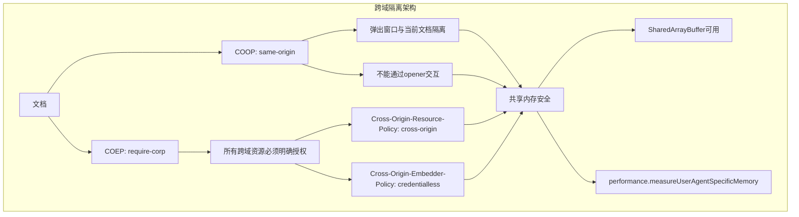

- **COOP (Cross-Origin Opener Policy)**：
  - `same-origin`：将文档从浏览器的跨域共享上下文中隔离
  - `same-origin-allow-popups`：允许弹出窗口保留引用
  - `unsafe-none`：默认值，不隔离

- **COEP (Cross-Origin Embedder Policy)**：
  - `require-corp`：要求所有跨域资源设置 CORP 头或 CORS
  - `credentialless`：跨域请求不携带凭据(新方案)

- **为何需要**：Spectre漏洞利用共享内存进行侧信道攻击，跨域隔离限制了共享内存的可用性
- **状态检测**：`crossOriginIsolated` (布尔值) 在 window 和 WorkerGlobalScope 上可用

### 3. Trusted Types (可信类型)

Trusted Types 通过禁止危险的 DOM 操作函数接收字符串，强制开发者使用安全的类型化对象，从根本上防御 DOM XSS。

```javascript
// 配置 CSP 开启 Trusted Types
// Content-Security-Policy: require-trusted-types-for 'script'

// 创建 Trusted Type 策略
const sanitizer = trustedTypes.createPolicy('my-policy', {
  createHTML: (input) => {
    return input.replace(/<script[^>]*>[\s\S]*?<\/script>/gi, '')
                .replace(/on\w+="[^"]*"/gi, '');
  },
  createScriptURL: (url) => {
    const allowed = ['https://cdn.example.com/'];
    if (allowed.some(prefix => url.startsWith(prefix))) {
      return url;
    }
    throw new TypeError('URL not allowed');
  }
});

// 使用 Trusted Type
el.innerHTML = sanitizer.createHTML(userInput);  // √ 安全
// el.innerHTML = userInput;  // × CSP 阻止，报错

// 默认策略（兜底）
document.body.innerHTML = trustedTypes.defaultPolicy.createHTML('<h1>Safe</h1>');
```

- **防御原理**：将 `innerHTML`、`document.write`、`eval` 等 XSS 高危操作拦截
- **与 CSP 结合**：`require-trusted-types-for 'script'` 开启强制模式
- **报告模式**：`require-trusted-types-for 'script'; report-uri /csp-report`
- **浏览器兼容性**：Chrome 83+，其他浏览器逐步支持

### 4. Fetch Metadata (请求元数据)

Fetch Metadata 通过 `Sec-Fetch-*` 请求头，让服务器了解请求的来源和上下文，有效防御跨域攻击。

```mermaid
flowchart TD
    Client[浏览器] -->|发起请求| Server[服务器]
    
    subgraph 浏览器自动附加
        A[Sec-Fetch-Site: cross-site]
        B[Sec-Fetch-Mode: navigate]
        C[Sec-Fetch-Dest: document]
        D[Sec-Fetch-User: ?1]
    end
    
    Client --> A
    Client --> B
    Client --> C
    Client --> D
    
    subgraph 服务端验证
        E{检查Sec-Fetch-Site}
        F{检查Sec-Fetch-Mode}
        G{检查Sec-Fetch-Dest}
    end
    
    A --> E
    B --> F
    C --> G
    
    E -->|cross-site 但预期同站| H[拒绝请求]
    F -->|navigate 但预期API| H
    G -->|document 但预期json| H
    E -->|same-origin| I[允许请求]
    F -->|cors| I
    G -->|empty/script| I
```

**Sec-Fetch-* 请求头说明：**

| 请求头 | 含义 | 示例值 |
|--------|------|--------|
| `Sec-Fetch-Site` | 请求发起者与目标的关系 | `cross-site`, `same-site`, `same-origin`, `none` |
| `Sec-Fetch-Mode` | 请求模式 | `navigate`, `cors`, `no-cors`, `websocket` |
| `Sec-Fetch-Dest` | 请求目标资源类型 | `document`, `script`, `image`, `empty`, `audioworklet` |
| `Sec-Fetch-User` | 是否由用户操作触发 | `?1` (是), `?0` (否) |

**服务端验证策略示例：**

```javascript
// Node.js 中间件示例
app.use((req, res, next) => {
  const site = req.headers['sec-fetch-site'];
  const mode = req.headers['sec-fetch-mode'];
  
  // 非导航请求禁止跨站
  if (site === 'cross-site' && mode !== 'navigate') {
    return res.status(403).send('Forbidden');
  }
  
  // API端点只允许同源请求
  if (req.path.startsWith('/api') && site !== 'same-origin') {
    return res.status(403).send('Cross-origin API calls not allowed');
  }
  
  next();
});
```

---

## 十一、现代浏览器特性

### 1. Back/Forward Cache (bfcache)

bfcache 是浏览器的一种缓存机制，当用户导航离开页面时，浏览器会保存当前页面的完整快照（包括内存中的 JavaScript 状态），以便用户使用前进/后退按钮时能立即恢复。

```mermaid
graph TD
    subgraph bfcache生命周期
        A[用户浏览页面A] --> B[导航到页面B]
        B --> C{页面B是否可缓存?}
        C -->|是| D[冻结页面A: 保存完整快照]
        C -->|否| E[页面A被销毁]
        D --> F[用户点击返回按钮]
        F --> G[恢复页面A: 触发pageshow事件]
        G --> H{页面A事件监听}
        H --> I[pageshow: persisted=true]
    end
    
    subgraph 排除bfcache的因素
        J[unload事件监听]
        K[Cache-Control: no-store]
        L[使用BroadcastChannel]
        M[使用IndexedDB事务未完成]
    end
```

**与 HTTP Cache 的区别：**

| 特性 | bfcache | HTTP Cache |
|------|---------|------------|
| 缓存内容 | 页面完整快照（HTML+JS+CSS+内存状态） | 单个资源文件 |
| 恢复速度 | 立即（0ms JS执行） | 需要重新解析和执行 |
| 触发条件 | 前进/后退导航 | 基于缓存策略的任意导航 |
| 生命周期 | 会话级别 | 由 Cache-Control 控制 |

**如何测试 bfcache 命中：**

```javascript
window.addEventListener('pageshow', (event) => {
  if (event.persisted) {
    console.log('页面从 bfcache 恢复');
    // 重新获取数据或刷新状态
    refreshData();
  }
});

window.addEventListener('pagehide', (event) => {
  if (!event.persisted) {
    console.log('页面被销毁，不会进入 bfcache');
  }
});
```

**避免被 bfcache 排除的关键点：**
- 不监听 `unload` 事件（改为使用 `pagehide`）
- 不使用 `Cache-Control: no-store`
- 在 `pagehide` 中关闭未完成的网络请求和 IndexedDB 事务
- 使用 `navigator.sendBeacon()` 发送分析数据

### 2. Prerendering (预渲染)

预渲染允许浏览器在后台完全加载并渲染页面，用户点击时立即显示。

```mermaid
graph TD
    subgraph 预渲染 vs 预获取
        A[用户意图预测] --> B{使用哪种预加载?}
        B -->|预获取 prefetch| C[下载HTML/资源]
        B -->|预渲染 prerender| D[完整渲染页面]
        C --> E[用户点击时才渲染]
        D --> E
        E --> F[立即显示]
    end
    
    subgraph Speculation Rules配置
        G[&lt;script type=speculationrules&gt;]
        G --> H[prerender: 完整预渲染]
        G --> I[prefetch: 仅预获取]
        H --> J[触发条件: 悬停/链接可见]
        I --> K[触发条件: 鼠标悬浮]
    end
```

**Speculation Rules API (新版预渲染)：**

```html
<script type="speculationrules">
{
  "prerender": [
    {
      "source": "list",
      "urls": ["/next-page", "/popular-page"],
      "requires": ["anonymous-client-ip-when-cross-origin"]
    }
  ],
  "prefetch": [
    {
      "source": "document",
      "eagerness": "moderate"
    }
  ]
}
</script>
```

**预渲染触发条件：**
- `source: "list"` — 指定预渲染的 URL 列表
- `source: "document"` — 根据用户行为(悬停)动态推测
- `eagerness`: `immediate`(立即) / `eager`(积极) / `moderate`(适度) / `conservative`(保守)

**预渲染与预获取的区别：**

| 特性 | Prerender | Prefetch |
|------|-----------|----------|
| 执行程度 | 完整渲染（HTML解析+CSS+JS执行） | 仅下载资源 |
| 资源消耗 | 高（CPU+内存） | 低 |
| 显示速度 | 立即（已渲染完成） | 需等待解析执行 |
| 适用场景 | 用户大概率访问的页面 | 可能访问的页面 |

**检测预渲染：**

```javascript
if (document.prerendering) {
  console.log('页面正在预渲染');
}

document.addEventListener('prerenderingchange', () => {
  console.log('预渲染完成，页面已激活');
});
```

### 3. Priority Hints (优先级提示)

Priority Hints 通过 `fetchpriority` 属性允许开发者提示浏览器资源的相对优先级，优化关键资源的加载顺序。

```mermaid
flowchart TD
    A[资源请求] --> B[浏览器计算默认优先级]
    B --> C{fetchpriority属性?}
    C -->|high| D[提升优先级]
    C -->|low| E[降低优先级]
    C -->|auto/无| F[使用默认优先级]
    
    D --> G[浏览器综合决策]
    E --> G
    F --> G
    G --> H[加载资源]
    
    subgraph 默认优先级计算
        I[CSS/字体: 最高]
        J[同步脚本: 高]
        K[图片(视口内): 中]
        L[图片(视口外): 低]
        M[异步脚本: 低]
    end
```

**使用示例：**

```html
<!-- LCP 图片提升优先级 -->


<!-- 非关键图片降低优先级 -->


<!-- 预加载关键字体 -->
<link rel="preload" href="font.woff2" as="font" fetchpriority="high">

<!-- 脚本优先级控制 -->
<script src="critical.js" fetchpriority="high"></script>
<script src="analytics.js" fetchpriority="low" async></script>
```

**浏览器优先级策略：**

| 资源类型 | 默认优先级 | 可调整 |
|---------|-----------|--------|
| CSS (head中) | Highest | high |
| 字体文件 | High | high/low |
| 同步脚本 | High | high/low |
| 视口内图片 | Medium | high/low |
| 视口外图片 | Low | high |
| 异步脚本/import | Low | high/low |
| 预加载(preload) | 等同目标类型 | high/low |

**影响**: LCP 图片设置 `fetchpriority="high"` 可以显著提升 Largest Contentful Paint 指标。

### 4. Document Policy

Document Policy 控制文档的行为特征（非权限类），如是否允许 document.write、图片尺寸限制等。

```mermaid
graph TD
    subgraph Document Policy vs Permissions Policy
        A[Permissions Policy] --> A1[控制权限API访问]
        A --> A2[如 camera/mic/geolocation]
        A --> A3[敏感权限安全管控]
        
        B[Document Policy] --> B1[控制文档行为]
        B --> B2[如 document.write 禁用]
        B --> B3[图片最大尺寸限制]
        B --> B4[JS执行策略]
    end
```

**使用方式：**

```http
# HTTP 头方式
Document-Policy: document-write=?0, max-image-size=2000
Document-Policy: js-profiling=?1
Document-Policy: force-load-at-top=?0
```

```html
<!-- iframe 方式 -->
<iframe document-policy="document-write=?0" src="...">
```

**策略配置示例：**

| 策略名 | 说明 | 值 |
|--------|------|-----|
| `document-write` | 是否允许 document.write | `?0`(禁止) / `?1`(允许) |
| `max-image-size` | 图片最大尺寸(kb或wpx) | 数值 / `-1`(不限制) |
| `max-parsed-stylesheet-length` | 样式表最大长度 | 数值 |
| `js-profiling` | 是否允许性能分析 | `?0` / `?1` |
| `force-load-at-top` | 是否强制页面从头加载 | `?0` / `?1` |

---

## 十二、Web性能API

### 1. Navigation Timing API

Navigation Timing 提供精确的页面加载各阶段耗时数据，分析性能瓶颈的核心工具。

```mermaid
gantt
    title 页面加载时间线
    dateFormat X
    axisFormat %s
    
    section DNS
    DNS查询 : 0, 1
    
    section TCP
    TCP连接 : 1, 2
    
    section TLS
    TLS握手 : 2, 3
    
    section TTFB
    请求响应 : 3, 5
    
    section DOM解析
    DOM解析构建 : 5, 12
    
    section 资源加载
    子资源加载 : 8, 15
    
    section DOMContentLoaded
    DCL事件 : 12, 13
    
    section Load
    Load事件 : 15, 16
```

**传统方式 (已废弃)：**

```javascript
const timing = performance.timing;
const dns = timing.domainLookupEnd - timing.domainLookupStart;
const tcp = timing.connectEnd - timing.connectStart;
const ttfb = timing.responseStart - timing.requestStart;
const domContentLoaded = timing.domContentLoadedEventEnd - timing.navigationStart;
const pageLoad = timing.loadEventEnd - timing.navigationStart;
```

**现代方式 (PerformanceNavigationTiming)：**

```javascript
const [navEntry] = performance.getEntriesByType('navigation');

// 关键指标
const dns = navEntry.domainLookupEnd - navEntry.domainLookupStart;
const tcp = navEntry.connectEnd - navEntry.connectStart;
const tls = navEntry.secureConnectionStart ? 
            navEntry.connectEnd - navEntry.secureConnectionStart : 0;
const ttfb = navEntry.responseStart - navEntry.requestStart;
const domParse = navEntry.domComplete - navEntry.domInteractive;
const dcl = navEntry.domContentLoadedEventEnd - navEntry.domContentLoadedEventStart;
const load = navEntry.loadEventEnd - navEntry.loadEventStart;

const transferSize = navEntry.transferSize;       // 总传输字节
const encodedBodySize = navEntry.encodedBodySize;  // 编码后大小
const decodedBodySize = navEntry.decodedBodySize;  // 解码后大小
const compressed = encodedBodySize < decodedBodySize; // 是否压缩

console.table({
  'DNS解析': `${dns}ms`,
  'TCP连接': `${tcp}ms`,
  'TLS握手': `${tls}ms`,
  'TTFB': `${ttfb}ms`,
  'DOM解析': `${domParse}ms`,
  'DCL': `${dcl}ms`,
  '完全加载': `${load}ms`,
  '压缩比': `${(encodedBodySize / decodedBodySize * 100).toFixed(1)}%`
});
```

### 2. Resource Timing API

Resource Timing API 监控所有页面资源的加载性能，包括图片、脚本、样式表、XHR请求等。

```javascript
// 获取所有资源加载信息
const resources = performance.getEntriesByType('resource');

// 分析慢资源
const slowResources = resources.filter(r => {
  const totalTime = r.responseEnd - r.startTime;
  return totalTime > 1000; // 超过1秒
});

// 各资源阶段耗时分析
resources.forEach(resource => {
  const { name, initiatorType, duration, transferSize } = resource;
  const dns = resource.domainLookupEnd - resource.domainLookupStart;
  const tcp = resource.connectEnd - resource.connectStart;
  const ttfb = resource.responseStart - resource.requestStart;
  
  if (duration > 500) {
    console.warn(`慢资源: ${name}`, {
      类型: initiatorType,
      总耗时: `${duration.toFixed(2)}ms`,
      DNS: `${dns.toFixed(2)}ms`,
      TCP: `${tcp.toFixed(2)}ms`,
      TTFB: `${ttfb.toFixed(2)}ms`,
      传输大小: `${(transferSize / 1024).toFixed(2)}KB`
    });
  }
});

// 统计资源类型分布
const stats = resources.reduce((acc, r) => {
  acc[r.initiatorType] = (acc[r.initiatorType] || 0) + 1;
  return acc;
}, {});

// 找出最大的资源
const sorted = [...resources].sort((a, b) => b.decodedBodySize - a.decodedBodySize);
console.log('最大资源:', sorted.slice(0, 5).map(r => ({
  url: r.name,
  size: `${(r.decodedBodySize / 1024).toFixed(2)}KB`,
  time: `${r.duration.toFixed(2)}ms`
})));
```

### 3. Performance Observer

Performance Observer 是订阅性能事件的最佳方式，替代 `performance.getEntries()` 的回调轮询模式。

```mermaid
graph TD
    subgraph 观察者模式
        Observer[PerformanceObserver] -->|observe| EntryTypes[注册entryTypes]
        EntryTypes -->|新条目产生| Callback[回调函数执行]
        Callback -->|entryList.getEntries| Entries[获取性能条目]
    end
    
    subgraph 支持的entryTypes
        T1[navigation - 导航计时]
        T2[resource - 资源计时]
        T3[paint - 绘制时间]
        T4[largest-contentful-paint - LCP]
        T5[first-input - FID]
        T6[layout-shift - CLS]
        T7[longtask - 长任务]
        T8[element - 元素计时]
    end
```

**完整示例：**

```javascript
// 创建观察者
const observer = new PerformanceObserver((list) => {
  const entries = list.getEntries();
  
  entries.forEach(entry => {
    if (entry.entryType === 'largest-contentful-paint') {
      console.log(`LCP: ${entry.startTime}ms`, entry.element);
    }
    
    if (entry.entryType === 'first-input') {
      console.log(`FID: ${entry.processingStart - entry.startTime}ms`, {
        类型: entry.name,
        延迟: entry.duration
      });
    }
    
    if (entry.entryType === 'layout-shift') {
      if (!entry.hadRecentInput) {
        console.log(`CLS: ${entry.value}`);
      }
    }
    
    if (entry.entryType === 'longtask') {
      console.warn(`长任务: ${entry.duration}ms`, entry.attribution);
    }
  });
});

// 注册需要观察的类型
observer.observe({ type: 'largest-contentful-paint', buffered: true });
observer.observe({ type: 'first-input', buffered: true });
observer.observe({ type: 'layout-shift', buffered: true });
observer.observe({ type: 'longtask', buffered: true });
observer.observe({ type: 'element', buffered: true });

// 断开观察
// observer.disconnect();
```

**与回调方式的对比：**

| 特性 | PerformanceObserver | getEntries()轮询 |
|------|-------------------|------------------|
| 实时性 | 事件驱动，即时 | 需要定时轮询 |
| 性能 | 无额外开销 | 轮询消耗CPU |
| 新API支持 | LCP/CLS/FID等 | 不支持新API |
| 代码复杂度 | 声明式 | 命令式 |

### 4. requestIdleCallback

`requestIdleCallback` 允许在浏览器空闲时段执行低优先级任务，不影响关键渲染和交互。

```mermaid
graph TD
    subgraph 任务调度
        A[帧开始] --> B[处理输入事件]
        B --> C[执行动画 rAF]
        C --> D[渲染管道]
        D --> E{是否有空闲时间?}
        E -->|是| F[执行requestIdleCallback任务]
        E -->|否| G[等待下一帧]
        F --> H{任务执行完毕?}
        H -->|超时| I[中断,等待下一帧继续]
        H -->|完成| J[释放主线程]
    end
    
    subgraph 优先级对比
        K[高: requestAnimationFrame]
        L[中: MutationObserver/微任务]
        M[低: requestIdleCallback]
    end
```

**使用示例：**

```javascript
// 注册空闲回调
requestIdleCallback(
  (deadline) => {
    // deadline.timeRemaining() 返回当前帧剩余时间(ms)
    while (deadline.timeRemaining() > 0 && tasks.length > 0) {
      const task = tasks.shift();
      task.execute();
    }
    
    // 如果还有任务未完成,继续注册
    if (tasks.length > 0) {
      requestIdleCallback(processTasks);
    }
  },
  { timeout: 2000 } // 超时: 2秒后强制执行
);

// 实际应用: 数据埋点/日志上报
function sendAnalytics(data) {
  if ('requestIdleCallback' in window) {
    requestIdleCallback(() => {
      navigator.sendBeacon('/analytics', data);
    }, { timeout: 5000 });
  } else {
    setTimeout(() => navigator.sendBeacon('/analytics', data), 0);
  }
}

// 应用: 延迟加载非关键计算
requestIdleCallback(() => {
  // 计算耗时统计报表
  const report = generateHeavyReport();
  updateUI(report);
});
```

**与 requestAnimationFrame 的区别：**

| 特性 | requestIdleCallback | requestAnimationFrame |
|------|--------------------|---------------------|
| 执行时机 | 帧空闲期 | 下一帧渲染前 |
| 优先级 | 最低 | 高 |
| 适用场景 | 非关键任务(埋点/日志) | 动画/渲染更新 |
| 执行保证 | 不保证执行 | 每帧都会执行 |
| 参数 | deadline.timeRemaining() | DOMHighResTimeStamp |

---

## 十三、浏览器渲染进阶

### 1. 渲染流水线 (Rendering Pipeline)

现代浏览器的渲染过程是一个多阶段流水线，理解各阶段触发的 CSS 属性有助于针对性优化。

```mermaid
graph LR
    subgraph 渲染流水线
        A[JavaScript] --> B[Style 样式计算]
        B --> C[Layout 布局]
        C --> D[Paint 绘制]
        D --> E[Composite 合成]
    end
    
    subgraph 仅触发Composite
        F1[transform]
        F2[opacity]
        F3[will-change]
        F1 --> E
        F2 --> E
        F3 --> E
    end
    
    subgraph 触发Paint+Composite
        G1[color]
        G2[background]
        G3[box-shadow]
        G4[outline]
        G1 --> D
        G2 --> D
        G3 --> D
        G4 --> D
    end
    
    subgraph 触发Layout+Paint+Composite
        H1[width/height]
        H2[margin/padding]
        H3[display/position]
        H4[font-size]
        H5[top/left/right/bottom]
        H1 --> C
        H2 --> C
        H3 --> C
        H4 --> C
        H5 --> C
    end
```

**各阶段说明：**

| 阶段 | 说明 | 触发示例 |
|------|------|----------|
| **JavaScript** | 脚本执行，可能触发样式变更 | `el.style.width = '200px'` |
| **Style** | 计算元素最终样式 | CSS 选择器匹配 |
| **Layout** | 计算元素几何位置和尺寸 | `width/height/margin/padding/top/left` |
| **Paint** | 绘制像素到图层 | `color/background/border/box-shadow` |
| **Composite** | 合成图层到屏幕 | `transform/opacity/will-change` |

**优化策略：**
- 使用 `transform` 和 `opacity` 做动画（仅合成）
- 使用 `will-change` 提前告知浏览器（但勿过度使用）
- 批量修改 DOM，避免频繁触发 Layout
- 使用 `requestAnimationFrame` 批量更新

### 2. 合成层 (Composite Layers)

合成层是浏览器渲染优化的核心机制，将页面拆分为多个图层独立渲染并最终合成。

```mermaid
graph TD
    subgraph 合成层结构
        Root[根图层 Root Layer] --> Layer1[合成层1: transform动画]
        Root --> Layer2[合成层2: 固定定位导航栏]
        Root --> Layer3[合成层3: iframe内容]
        Layer2 --> SubLayer1[子合成层: dropdown菜单]
    end
    
    subgraph 创建合成层的原因
        A1[有 transform/opacity 动画]
        A2[position: fixed]
        A3[will-change 属性]
        A4[<video> / <canvas> / <iframe>]
        A5[3D transforms: translateZ(0)]
    end
    
    subgraph 性能影响
        B1[✓ 避免重绘整个页面]
        B2[✓ GPU加速渲染]
        B3[✗ 过多层导致内存开销]
        B4[✗ 层爆炸降低性能]
    end
```

**创建合成层的条件：**

```css
/* 1. 3D 或透视变换 */
.element { transform: translateZ(0); }

/* 2. 使用 will-change */
.element { will-change: transform, opacity; }

/* 3. 固定定位 */
.element { position: fixed; }

/* 4. opacity 动画 */
.element { transition: opacity 0.3s; }

/* 5. 滤镜效果 */
.element { filter: blur(5px); }

/* 6. 混合模式 */
.element { mix-blend-mode: multiply; }
```

**层爆炸与层压缩：**

浏览器会尽量合并不必要的合成层以节省内存。过度使用 `will-change` 或 `translateZ(0)` 可能导致层爆炸。最佳实践：

- 只在需要动画时使用 `will-change`
- 动画结束后及时移除 `will-change`
- 使用 Chrome DevTools 的 Layers 面板监控合成层数量
- 避免在大量元素上同时创建合成层

### 3. 硬件加速 (GPU Compositing)

硬件加速指浏览器利用 GPU 进行合成操作，将某些渲染任务从 CPU 卸载到 GPU。

```mermaid
graph TD
    subgraph GPU加速过程
        A[页面元素] --> B{是否需要合成层?}
        B -->|是| C[创建位图图层]
        C --> D[上传到GPU纹理内存]
        D --> E[GPU合成]
        E --> F[显示到屏幕]
        
        B -->|否| G[CPU绘制]
        G --> H[光栅化]
        H --> E
    end
    
    subgraph 开启GPU加速的属性
        I[transform: translate3d/translateZ]
        J[opacity 过渡动画]
        K[will-change]
        L[filter]
        M[backface-visibility: hidden]
    end
```

**合理使用硬件加速：**

```css
/* 推荐：有动画的元素 */
.animated-card {
  will-change: transform;
  transition: transform 0.3s;
}

/* 避免：所有元素都开启 */
/* ✗ 不要这样做 - 导致层爆炸 */
div { transform: translateZ(0); }

/* 更优方式：动画结束移除 */
.card {
  /* 初始不开启 */
}
.card.animating {
  will-change: transform;
}
.card.finished {
  will-change: auto; /* 恢复默认 */
}
```

**优点：**
- 合成速度更快，提升动画帧率
- 减少 CPU 负载，省电
- 避免重绘，提升滚动性能

**注意事项：**
- 每个合成层占用 GPU 内存（移动端尤其敏感）
- 纹理上传（CPU→GPU）有额外开销
- 过多的合成层反而降低性能

---

## 十四、Web存储进阶

### 1. Cache API

Cache API 是 Service Worker 的核心组成部分，提供更灵活的请求/响应缓存机制。

```mermaid
flowchart TD
    A[获取资源] --> B{缓存策略选择}
    
    subgraph 缓存策略
        C[Cache First 缓存优先]
        D[Network First 网络优先]
        E[Stale While Revalidate 后台更新]
        F[Network Only 仅网络]
        G[Cache Only 仅缓存]
    end
    
    B --> C
    B --> D
    B --> E
    B --> F
    B --> G
    
    C --> H{缓存命中?}
    H -->|是| I[返回缓存]
    H -->|否| J[请求网络并缓存]
    
    D --> K[请求网络]
    K --> L{网络成功?}
    L -->|是| M[返回并更新缓存]
    L -->|否| N[返回缓存(降级)]
    
    E --> O[立即返回缓存]
    O --> P[后台请求网络更新缓存]
```

**Service Worker 结合使用：**

```javascript
// 安装阶段: 预缓存关键资源
self.addEventListener('install', event => {
  event.waitUntil(
    caches.open('v1').then(cache => {
      return cache.addAll([
        '/',
        '/index.html',
        '/styles/main.css',
        '/scripts/app.js',
        '/images/logo.png'
      ]);
    })
  );
});

// 拦截请求: 缓存策略
self.addEventListener('fetch', event => {
  event.respondWith(
    caches.match(event.request).then(cachedResponse => {
      // 缓存优先 + 后台更新 (Stale-while-revalidate)
      const fetchPromise = fetch(event.request).then(networkResponse => {
        caches.open('v1').then(cache => {
          cache.put(event.request, networkResponse.clone());
        });
        return networkResponse;
      }).catch(() => cachedResponse);
      
      return cachedResponse || fetchPromise;
    })
  );
});

// 更新缓存
self.addEventListener('activate', event => {
  const cacheWhitelist = ['v2'];
  event.waitUntil(
    caches.keys().then(cacheNames => {
      return Promise.all(
        cacheNames.map(name => {
          if (!cacheWhitelist.includes(name)) {
            return caches.delete(name);
          }
        })
      );
    })
  );
});
```

**Cache API 与 HTTP Cache 的区别：**

| 特性 | Cache API | HTTP Cache |
|------|-----------|------------|
| 控制粒度 | 完全由 JS 控制 | 由 HTTP 头控制 |
| 缓存内容 | Request/Response 对象 | 网络资源 |
| 更新机制 | 代码手动更新 | Cache-Control 策略 |
| 生命周期 | 随 Service Worker | 随浏览器策略 |
| 离线支持 | 是实现离线应用的基础 | 有限支持 |

### 2. Storage Foundation API

Storage Foundation API 提供存储容量查询和持久化请求，帮助管理浏览器的存储配额。

```javascript
// 查询存储使用情况
async function checkStorage() {
  if ('storage' in navigator && 'estimate' in navigator.storage) {
    const estimate = await navigator.storage.estimate();
    
    const usedMB = (estimate.used / (1024 * 1024)).toFixed(2);
    const quotaMB = (estimate.quota / (1024 * 1024)).toFixed(2);
    const usagePercent = ((estimate.used / estimate.quota) * 100).toFixed(1);
    
    console.table({
      '已使用': `${usedMB} MB`,
      '总配额': `${quotaMB} MB`,
      '使用率': `${usagePercent}%`
    });
    
    // 接近配额时发出警告
    if (usagePercent > 80) {
      console.warn('存储空间即将用尽!');
    }
  }
}

// 请求持久化存储
async function requestPersistentStorage() {
  if ('storage' in navigator && 'persist' in navigator.storage) {
    const isPersisted = await navigator.storage.persist();
    
    if (isPersisted) {
      console.log('存储已持久化,用户清除数据时不会被删除');
    } else {
      console.log('存储未持久化,浏览器可能自动清除');
    }
    
    // 检查当前持久化状态
    const persisted = await navigator.storage.persisted();
    console.log(`当前存储持久化状态: ${persisted ? '已持久化' : '未持久化'}`);
  }
}
```

**存储配额管理最佳实践：**
- 定期清理不再需要的数据
- 存储大文件时先检查剩余配额
- 使用 IndexedDB 的 `transaction.onabort` 处理配额超限错误
- 监听 `storageQuota` 相关事件（如 `quotaexceeded`）

### 3. Shared Storage API

Shared Storage API 是 Privacy Sandbox 的一部分，允许跨站点共享数据但限制读取能力以保护隐私。

```mermaid
graph TD
    subgraph Shared Storage执行流程
        A[站点A存储数据] --> B[Shared Storage]
        B --> C[站点B只能通过Worklet读取]
        C --> D[不能直接读取原始数据]
        D --> E[仅返回聚合结果]
    end
    
    subgraph 与传统存储对比
        F[localStorage] --> G[任意JS可读写]
        H[Shared Storage] --> I[只能通过Worklet/受限制]
        J[限制条件] --> K[跨站点数据不可直接读取]
        J --> L[数据有写但无直接读]
        J --> M[只能计算聚合结果]
    end
```

**使用示例：**

```javascript
// 写入 Shared Storage
await window.sharedStorage.set('campaign-id', '12345', {
  ignoreIfPresent: true
});

// 通过 Worklet 读取（受限）
class MyURLSelection {
  async run(urls, data) {
    const campaignId = await this.sharedStorage.get('campaign-id');
    const idx = campaignId ? parseInt(campaignId, 10) % urls.length : 0;
    return idx;
  }
}

register('select-url', MyURLSelection);
```

**主要用例：**
- **A/B 测试分组**：跨站点保持一致的分组信息，而不暴露分组依据
- **频率控制**：记录用户看到广告的次数，不暴露具体浏览历史
- **转化测量**：统计广告点击后的转化，不追踪用户个体

**与 localStorage 的区别：**

| 特性 | Shared Storage | localStorage |
|------|---------------|--------------|
| 跨域访问 | 有限制(Worklet) | 不允许 |
| 数据读取 | 仅通过受限制的 Worklet | 任意 JS |
| 隐私保护 | 内置隐私保护 | 无 |
| 用途 | 广告/测量/实验 | 常规数据存储 |

### 4. OPFS (Origin Private File System)

OPFS 是 File System Access API 的一部分，提供高效、私有的文件存储系统。

```javascript
// 获取 OPFS 根目录
const root = await navigator.storage.getDirectory();

// 创建文件
async function createLargeFile() {
  const fileHandle = await root.getFileHandle('data.bin', { create: true });
  const accessHandle = await fileHandle.createSyncAccessHandle();
  
  // 写入 1MB 数据
  const buffer = new ArrayBuffer(1024 * 1024);
  const view = new Uint8Array(buffer);
  for (let i = 0; i < view.length; i++) {
    view[i] = i % 256;
  }
  
  const writtenBytes = accessHandle.write(buffer, { at: 0 });
  accessHandle.flush(); // 确保写入磁盘
  accessHandle.close();
  
  return writtenBytes;
}

// 读取文件
async function readLargeFile() {
  const fileHandle = await root.getFileHandle('data.bin');
  const file = await fileHandle.getFile();
  const sizeInMB = (file.size / (1024 * 1024)).toFixed(2);
  
  const accessHandle = await fileHandle.createSyncAccessHandle();
  const readBuffer = new ArrayBuffer(file.size);
  accessHandle.read(readBuffer, { at: 0 });
  accessHandle.close();
  
  return { buffer: readBuffer, size: file.size };
}

// 删除文件
async function cleanup() {
  await root.removeEntry('data.bin');
}

// 目录操作
async function directoryOps() {
  const dirHandle = await root.getDirectoryHandle('images', { create: true });
  const fileHandle = await dirHandle.getFileHandle('photo.jpg', { create: true });
  
  // 遍历目录
  for await (const [name, handle] of root.entries()) {
    console.log(name, handle.kind); // 'file' 或 'directory'
  }
}
```

**性能优势：**
- **同步访问**：在 Web Worker 中支持同步文件操作（`createSyncAccessHandle`）
- **零拷贝**：使用 `ArrayBuffer` 直接操作，避免内存复制
- **无需序列化**：无需将大对象序列化为文本
- **硬盘直写**：大文件直接在磁盘操作

**使用场景：**
- 视频/音频编辑缓存
- WebAssembly 大型数据文件
- 游戏存档和资源包
- PDF/图像处理

---

## 十五、浏览器架构演进

### 1. Chrome 多进程架构

Chrome 采用多进程架构，每个进程有独立的地址空间，互不影响。

```mermaid
graph TD
    subgraph Chrome多进程架构
        BP[浏览器主进程 Browser Process]
        GP[GPU进程]
        NP[网络进程 Network Process]
        RP1[渲染进程1 Tab1]
        RP2[渲染进程2 Tab2]
        PP[插件进程 Plugin Process]
        UP[Utility进程]
        SP[存储进程 Storage Process]
    end
    
    BP --> BP_T[界面交互/地址栏/书签]
    BP --> BP_M[子进程管理]
    BP --> BP_F[文件访问]
    
    GP --> GP_C[3D CSS绘制]
    GP --> GP_U[UI合成]
    
    NP --> NP_R[网络资源加载]
    NP --> NP_C[缓存管理]
    
    RP1 --> R1_G[GUI渲染线程]
    RP1 --> R1_J[JS引擎线程]
    RP2 --> R2_G[GUI渲染线程]
    RP2 --> R2_J[JS引擎线程]
    
    PP --> PP_F[Flash/插件]
    
    UP --> UP_D[数据解码]
    UP --> UP_M[媒体处理]
    
    SP --> SP_I[IndexedDB]
    SP --> SP_L[LocalStorage]
```

**各进程职责：**

| 进程 | 职责 | 数量 |
|------|------|------|
| **浏览器主进程** | UI管理、进程调度、文件访问 | 1个 |
| **GPU进程** | GPU加速、3D渲染合成 | 1个 |
| **网络进程** | 网络请求、缓存管理 | 1个 |
| **渲染进程** | HTML/CSS/JS解析渲染（沙箱隔离） | 每个Tab(含iframe)独立 |
| **插件进程** | 运行Flash等插件 | 每个插件独立 |
| **Utility进程** | 解码、媒体处理等辅助任务 | 按需创建 |
| **存储进程** | IndexedDB/LocalStorage管理 | 1个 |

### 2. Site Isolation (站点隔离)

Site Isolation 是 Chrome 的安全架构，为每个跨站点 iframe 分配独立的渲染进程，防御 Spectre 类型攻击。

```mermaid
graph TD
    subgraph 传统架构(无Site Isolation)
        Tab[Tab页面] --> RP[单一渲染进程]
        RP --> F1[iframe: site-a.com]
        RP --> F2[iframe: site-b.com]
        RP --> F3[iframe: site-c.com]
        RP --> Mem[共享进程内存]
        Mem -.->|Spectre侧信道攻击| Hack[攻击者读取跨站数据]
    end
    
    subgraph Site Isolation架构
        Tab2[Tab页面] --> RP2[主渲染进程]
        RP2 --> F4[iframe: site-a.com]
        Tab2 --> RP3[独立渲染进程]
        RP3 --> F5[iframe: site-b.com]
        Tab2 --> RP4[独立渲染进程]
        RP4 --> F6[iframe: site-c.com]
    end
```

**Site Isolation 的安全意义：**
- 每个跨站 iframe 运行在独立的渲染进程中
- 进程级别的内存隔离，防御 Spectre/Meltdown 等侧信道攻击
- 攻击者无法通过共享内存读取其他站点的数据

**内存开销：**
- Site Isolation 增加了进程数量，每个跨站 iframe 占用约 10-20MB 额外内存
- Chrome 通过 进程限制策略（如 per-process limit）控制总进程数
- 移动端 Chrome 可能禁用或限制 Site Isolation 以节省内存

**如何判断是否启用：**
- 访问 `chrome://process-internals` 查看进程分配
- 任务管理器中查看站点所属进程（Chrome 自带任务管理器）

### 3. Navigation 架构

从输入 URL 到页面显示，Chrome 的导航流程涉及多个进程的协调。

```mermaid
sequenceDiagram
    participant User as 用户
    participant BP as 浏览器进程
    participant NP as 网络进程
    participant RP as 渲染进程
    
    User->>BP: 1. 输入URL/点击链接
    BP->>BP: 2. 搜索/URL处理
    BP->>NP: 3. 发起URL请求
    NP->>Server: 4. HTTP请求(DNS/TCP/TLS)
    Server-->>NP: 5. HTTP响应
    NP->>BP: 6. 返回响应数据
    BP->>BP: 7. 检查响应类型(HTML/下载等)
    BP->>RP: 8. 提交导航(Site Isolation分配)
    RP->>NP: 9. 获取响应体
    NP-->>RP: 10. 传输数据流
    RP->>RP: 11. 解析HTML构建DOM
    RP->>RP: 12. 加载子资源
    RP-->>BP: 13. 首次渲染通知
    BP-->>User: 14. 页面显示
```

**关键路径优化：**

```mermaid
graph LR
    subgraph 优化关键路径
        A[DNS预解析] --> A1[&lt;link rel=dns-prefetch&gt;]
        B[预连接] --> B1[&lt;link rel=preconnect&gt;]
        C[预加载] --> C1[&lt;link rel=preload&gt;]
        D[预获取] --> D1[&lt;link rel=prefetch&gt;]
        E[预渲染] --> E1[Speculation Rules]
    end
    
    A1 --> F[减少DNS时间]
    B1 --> G[减少TCP/TLS时间]
    C1 --> H[提前加载关键资源]
    D1 --> I[预取下一页资源]
    E1 --> J[后台完整渲染]
```

**主要阶段耗时参考：**

| 阶段 | 耗时(参考) | 优化手段 |
|------|-----------|---------|
| DNS解析 | 20-120ms | DNS预解析、CDN |
| TCP连接 | 10-100ms | 预连接 |
| TLS握手 | 50-300ms | 预连接、TLS1.3 |
| TTFB | 200-1000ms+ | CDN、后端优化 |
| DOM解析 | 100-500ms | 精简HTML |
| 子资源加载 | 500-3000ms+ | 懒加载、资源压缩 |

### 4. Chrome DevTools 使用技巧

**Performance 面板：**

```mermaid
graph TD
    subgraph DevTools性能分析
        A[Performance面板] --> B[录制性能数据]
        B --> C[分析FPS/CPU/Network]
        C --> D[查看Main线程火焰图]
        D --> E[定位长任务 Long Tasks]
        E --> F[优化卡顿点]
        
        A --> G[性能数据概览]
        G --> H[FPS帧率]
        G --> I[CPU使用率]
        G --> J[网络请求时间线]
        G --> K[布局/绘制事件]
    end
```

**关键使用技巧：**

1. **Performance 面板：**
   - 使用 `Ctrl+Shift+E` 开始/停止录制
   - 查看 Main 火焰图识别长任务（红色标记）
   - 关注 `Layout` 和 `Rendering` 阻塞事件
   - 使用 Bottom-Up/Call Tree 分析耗时函数

2. **Memory 面板：**
   - 使用 Heap Snapshot 查找内存泄漏
   - 比对两次快照的 Retained Size 差异
   - 使用 Allocation Timeline 记录分配过程
   - 关注 Detached DOM 节点（DOM树外的元素）
   ```javascript
   // 常见内存泄漏检测
   function findDetachedNodes() {
     // 在Heap Snapshot中搜索"Detached"
     // Detached HTMLDivElement 表示被删除但仍有引用的DOM节点
   }
   ```

3. **Network 面板：**
   - 使用 Waterfall 查看请求各阶段耗时
   - 分析请求队列和阻塞时间
   - 使用 Capture Screenshots 查看页面渲染过程
   - 使用 `@media` 模拟不同网络条件（Slow 3G）

4. **Application 面板：**
   - 查看 Service Worker 状态（离线/更新/激活）
   - 管理 Cache Storage（清除/查看缓存内容）
   - 检查 IndexedDB 存储结构
   - 管理 Cookies、LocalStorage、SessionStorage
   - 查看 Back/Forward Cache 测试结果

5. **Layers 面板：**
   - 分析合成层数量和内存使用
   - 检查哪些元素创建了独立层
   - 定位层爆炸问题
