# ✍️ 手写代码知识详解版（含 Mermaid 图解）

> 🚀 前端面试必备 - 手写代码核心知识全面梳理 | 建议收藏 ⭐

## 🧠 知识脑图

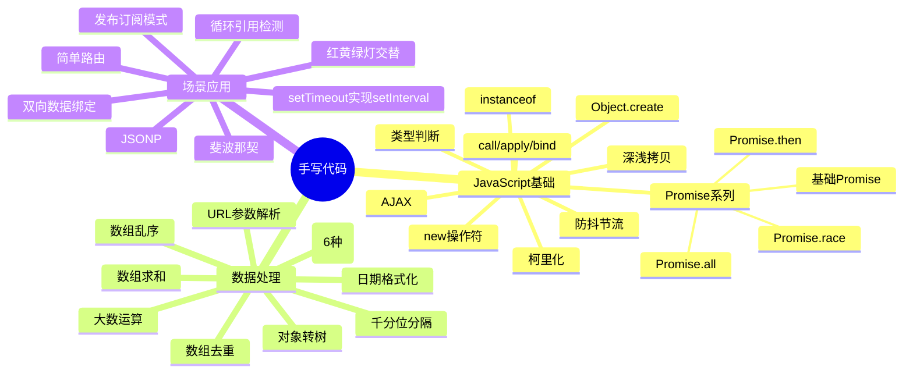
```mermaid
mindmap
  root((手写代码))
    JavaScript基础
      Object.create
      instanceof
      new操作符
      Promise系列
        基础Promise
        Promise.then
        Promise.all
        Promise.race
      防抖节流
      类型判断
      call/apply/bind
      柯里化
      AJAX
      深浅拷贝
   数据处理
      日期格式化
      数组乱序
      数组求和
      数组扁平化(6种)
      数组去重
      千分位分隔
      大数运算
      对象转树
      URL参数解析
   场景应用
      红黄绿灯交替
      发布订阅模式
      双向数据绑定
      简单路由
      斐波那契
      JSONP
      setTimeout实现setInterval
      循环引用检测
```

---

## 📑 目录

- [📜 一、JavaScript 基础](#-一javascript-基础)
- [🔄 二、数据处理](#-二数据处理)
- [🛠️ 三、场景应用](#%EF%B8%8F-三场景应用)
- [⚡ 四、现代 Promise 方法](#-四现代-promise-方法)
- [🆕 五、现代 JavaScript 手写](#-五现代-javascript-手写)
- [🧮 六、算法与数据结构](#-六算法与数据结构)

---

## 📜 一、JavaScript 基础

### 1️⃣ 手写 Object.create

> 💡 **要点**：以传入对象为原型创建新对象，核心是利用空函数 `F` 进行原型链中转，避免直接操作 `__proto__`

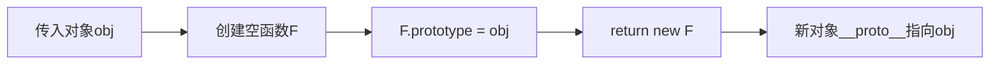
```mermaid
flowchart LR
    A["传入对象obj"] --> B["创建空函数F"]
    B --> C["F.prototype = obj"]
    C --> D["return new F"]
    D --> E["新对象__proto__指向obj"]
```

思路：将传入的对象作为原型

```javascript
function create(obj) {
  function F() {}
  F.prototype = obj
  return new F()
}
```

### 2️⃣ 手写 instanceof 方法

> 💡 **要点**：沿原型链逐层向上查找，判断构造函数的 `prototype` 是否出现在实例的原型链上

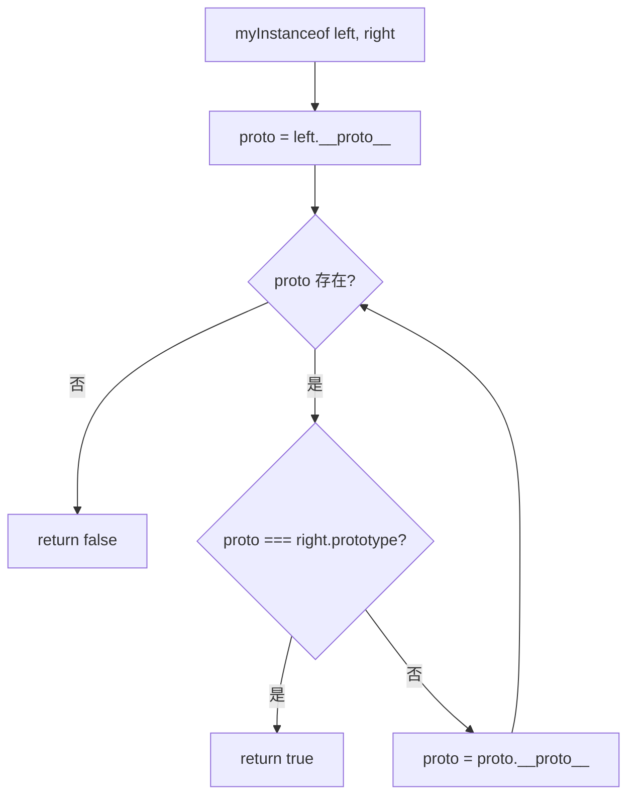
```mermaid
flowchart TD
    A["myInstanceof left, right"] --> B["proto = left.__proto__"]
    B --> C{"proto 存在?"}
    C -->|否| D["return false"]
    C -->|是| E{"proto === right.prototype?"}
    E -->|是| F["return true"]
    E -->|否| G["proto = proto.__proto__"]
    G --> C
```

```javascript
function myInstanceof(left, right) {
  let proto = Object.getPrototypeOf(left),
      prototype = right.prototype;
  while (true) {
    if (!proto) return false;
    if (proto === prototype) return true;
    proto = Object.getPrototypeOf(proto);
  }
}
```

### 3️⃣ 手写 new 操作符

> 💡 **要点**：创建新对象 → 绑定原型 → 执行构造函数 → 根据返回值类型决定返回新对象还是引用类型

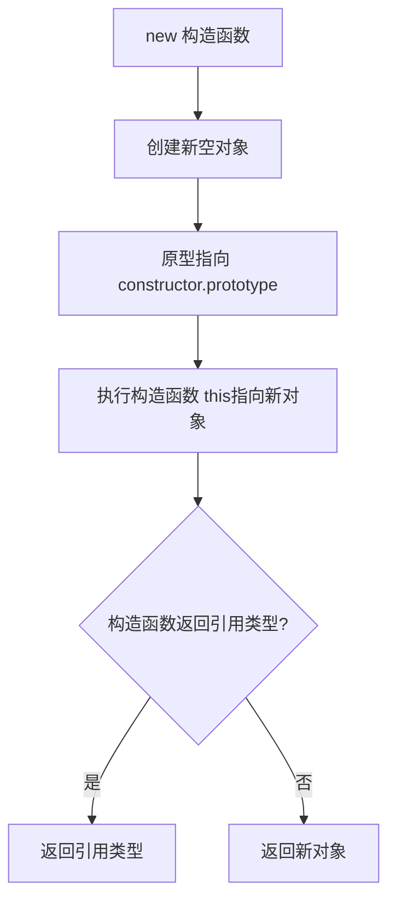
```mermaid
flowchart TD
    A["new 构造函数"] --> B["创建新空对象"]
    B --> C["原型指向 constructor.prototype"]
    C --> D["执行构造函数 this指向新对象"]
    D --> E{"构造函数返回引用类型?"}
    E -->|是| F["返回引用类型"]
    E -->|否| G["返回新对象"]
```

```javascript
function objectFactory() {
  let newObject = null;
  let constructor = Array.prototype.shift.call(arguments);
  let result = null;
  if (typeof constructor !== "function") {
    console.error("type error");
    return;
  }
  newObject = Object.create(constructor.prototype);
  result = constructor.apply(newObject, arguments);
  let flag = result && (typeof result === "object" || typeof result === "function");
  return flag ? result : newObject;
}
```

### 4️⃣ 手写 Promise

> 💡 **要点**：实现 Promise 的核心是状态机（PENDING → RESOLVED/REJECTED）和观察者模式，异步执行通过 `setTimeout` 模拟微任务

> [!NOTE]
> Promise 有三种状态：`pending`（进行中）、`resolved`（已成功）、`rejected`（已失败）。状态一旦改变就不可逆。`resolvedCallbacks` 和 `rejectedCallbacks` 数组用于收集异步回调。

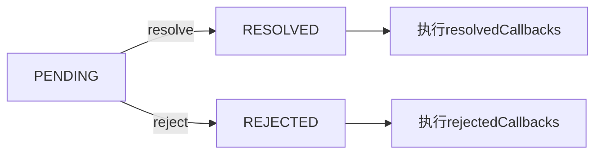
```mermaid
graph LR
    A["PENDING"] -->|resolve| B["RESOLVED"]
    A -->|reject| C["REJECTED"]
    B --> D["执行resolvedCallbacks"]
    C --> E["执行rejectedCallbacks"]
```

```javascript
const PENDING = "pending";
const RESOLVED = "resolved";
const REJECTED = "rejected";

function MyPromise(fn) {
  var self = this;
  this.state = PENDING;
  this.value = null;
  this.resolvedCallbacks = [];
  this.rejectedCallbacks = [];

  function resolve(value) {
    if (value instanceof MyPromise) {
      return value.then(resolve, reject);
    }
    setTimeout(() => {
      if (self.state === PENDING) {
        self.state = RESOLVED;
        self.value = value;
        self.resolvedCallbacks.forEach(callback => {
          callback(value);
        });
      }
    }, 0);
  }

  function reject(value) {
    setTimeout(() => {
      if (self.state === PENDING) {
        self.state = REJECTED;
        self.value = value;
        self.rejectedCallbacks.forEach(callback => {
          callback(value);
        });
      }
    }, 0);
  }

  try {
    fn(resolve, reject);
  } catch (e) {
    reject(e);
  }
}

MyPromise.prototype.then = function(onResolved, onRejected) {
  onResolved = typeof onResolved === "function" ? onResolved : function(value) { return value; };
  onRejected = typeof onRejected === "function" ? onRejected : function(error) { throw error; };

  if (this.state === PENDING) {
    this.resolvedCallbacks.push(onResolved);
    this.rejectedCallbacks.push(onRejected);
  }
  if (this.state === RESOLVED) {
    onResolved(this.value);
  }
  if (this.state === REJECTED) {
    onRejected(this.value);
  }
};
```

### 5️⃣ 手写 Promise.then

> 💡 **要点**：链式调用的核心——返回新 Promise，根据回调返回值类型决定直接 resolve 还是递归 then

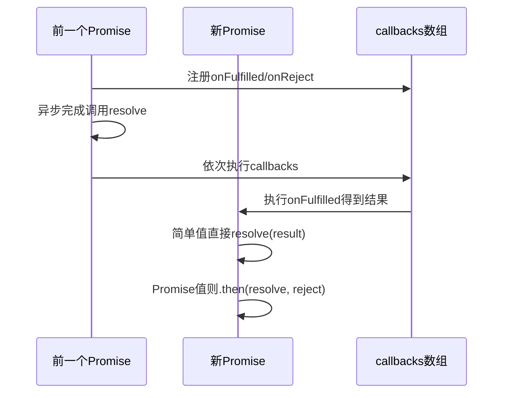
```mermaid
sequenceDiagram
    participant P1 as 前一个Promise
    participant P2 as 新Promise
    participant CB as callbacks数组

    P1->>CB: 注册onFulfilled/onReject
    P1->>P1: 异步完成调用resolve
    P1->>CB: 依次执行callbacks
    CB->>P2: 执行onFulfilled得到结果
    P2->>P2: 简单值直接resolve(result)
    P2->>P2: Promise值则.then(resolve, reject)
```

```javascript
then(onFulfilled, onReject){
    const self = this; 
    return new MyPromise((resolve, reject) => {
      let fulfilled = () => {
        try{
          const result = onFulfilled(self.value);
          return result instanceof MyPromise ? result.then(resolve, reject) : resolve(result);
        }catch(err){
          reject(err)
        }
      }
      let rejected = () => {
        try{
          const result = onReject(self.reason);
          return result instanceof MyPromise ? result.then(resolve, reject) : reject(result);
        }catch(err){
          reject(err)
        }
      }
      switch(self.status){
        case PENDING: 
          self.onFulfilledCallbacks.push(fulfilled);
          self.onRejectedCallbacks.push(rejected);
          break;
        case FULFILLED:
          fulfilled();
          break;
        case REJECT:
          rejected();
          break;
      }
    })
}
```

### 6️⃣ 手写 Promise.all

> 💡 **要点**：全部成功才 resolve，按输入顺序输出结果数组；任一失败则立即 reject

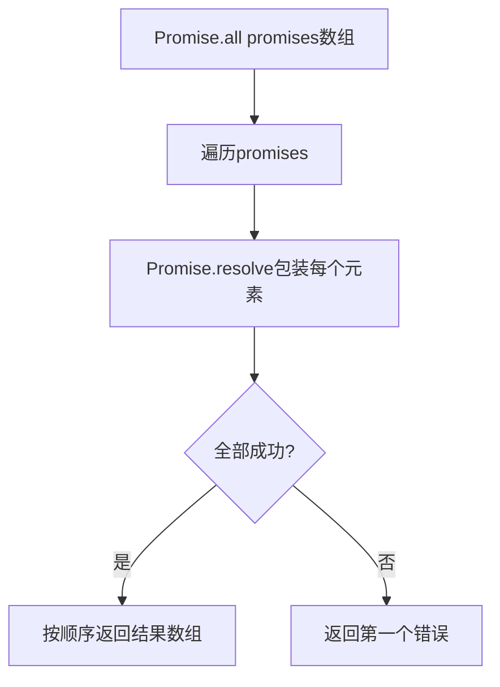
```mermaid
flowchart TD
    A["Promise.all promises数组"] --> B["遍历promises"]
    B --> C["Promise.resolve包装每个元素"]
    C --> D{"全部成功?"}
    D -->|是| E["按顺序返回结果数组"]
    D -->|否| F["返回第一个错误"]
```

```javascript
function promiseAll(promises) {
  return new Promise(function(resolve, reject) {
    if(!Array.isArray(promises)){
        throw new TypeError(`argument must be a array`)
    }
    var resolvedCounter = 0;
    var promiseNum = promises.length;
    var resolvedResult = [];
    for (let i = 0; i < promiseNum; i++) {
      Promise.resolve(promises[i]).then(value=>{
        resolvedCounter++;
        resolvedResult[i] = value;
        if (resolvedCounter == promiseNum) {
            return resolve(resolvedResult)
          }
      },error=>{
        return reject(error)
      })
    }
  })
}
```

### 7️⃣ 手写 Promise.race

> 💡 **要点**：竞速模式，谁先改变状态就返回谁的结果，无论是 resolve 还是 reject

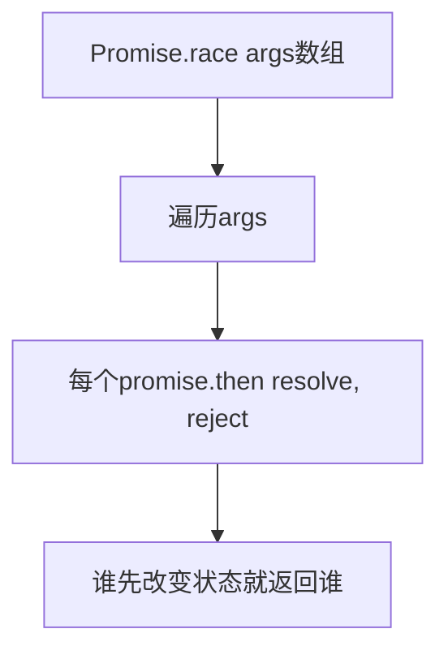
```mermaid
flowchart TD
    A["Promise.race args数组"] --> B["遍历args"]
    B --> C["每个promise.then resolve, reject"]
    C --> D["谁先改变状态就返回谁"]
```

```javascript
Promise.race = function (args) {
  return new Promise((resolve, reject) => {
    for (let i = 0, len = args.length; i < len; i++) {
      args[i].then(resolve, reject)
    }
  })
}
```

### 8️⃣ 手写防抖函数

> 💡 **要点**：高频触发时以最后一次为准，每次触发重置定时器，适用于输入搜索、窗口 resize

> [!TIP]
> 防抖的核心思想是「延迟执行 + 取消重来」。每次事件触发都清除上一个定时器并重新计时，确保只有最后一次触发能真正执行回调。

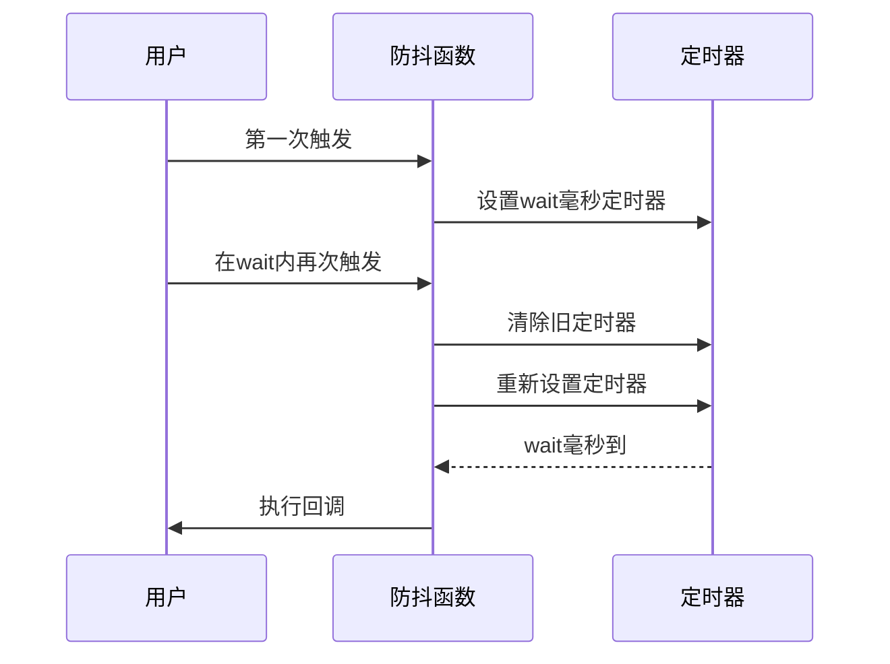
```mermaid
sequenceDiagram
    participant User as 用户
    participant DB as 防抖函数
    participant Timer as 定时器

    User->>DB: 第一次触发
    DB->>Timer: 设置wait毫秒定时器
    User->>DB: 在wait内再次触发
    DB->>Timer: 清除旧定时器
    DB->>Timer: 重新设置定时器
    Timer-->>DB: wait毫秒到
    DB->>User: 执行回调
```

```javascript
function debounce(fn, wait) {
  let timer = null;
  return function() {
    let context = this, args = arguments;
    if (timer) {
      clearTimeout(timer);
      timer = null;
    }
    timer = setTimeout(() => {
      fn.apply(context, args);
    }, wait);
  };
}
```

### 9️⃣ 手写节流函数

> 💡 **要点**：按固定时间间隔执行，每隔 delay 毫秒最多执行一次，适用于滚动加载、拖拽

> [!TIP]
> 节流与防抖的区别：节流保证在指定时间段内至少执行一次（稀释执行频率），防抖保证只执行最后一次（延迟到停止触发后）。

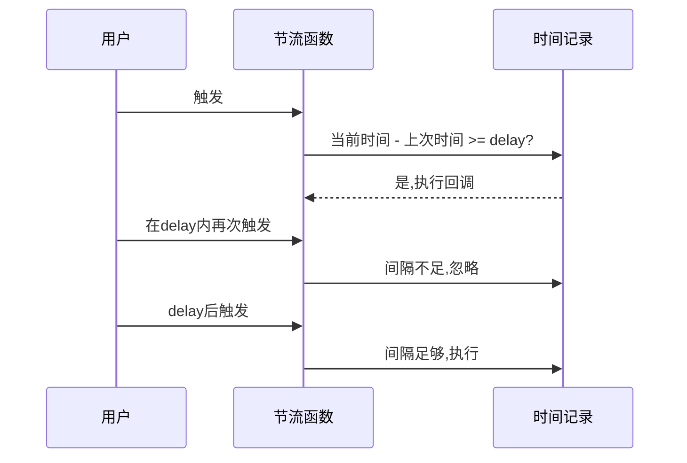
```mermaid
sequenceDiagram
    participant User as 用户
    participant TH as 节流函数
    participant Time as 时间记录

    User->>TH: 触发
    TH->>Time: 当前时间 - 上次时间 >= delay?
    Time-->>TH: 是,执行回调
    User->>TH: 在delay内再次触发
    TH->>Time: 间隔不足,忽略
    User->>TH: delay后触发
    TH->>Time: 间隔足够,执行
```

```javascript
function throttle(fn, delay) {
  let curTime = Date.now();
  return function() {
    let context = this, args = arguments, nowTime = Date.now();
    if (nowTime - curTime >= delay) {
      curTime = Date.now();
      return fn.apply(context, args);
    }
  };
}
```

### 🔟 手写类型判断函数

> 💡 **要点**：利用 `Object.prototype.toString.call()` 获取 `[object Type]` 格式字符串，再提取具体类型

```javascript
function getType(value) {
  if (value === null) {
    return value + "";
  }
  if (typeof value === "object") {
    let valueClass = Object.prototype.toString.call(value),
      type = valueClass.split(" ")[1].split("");
    type.pop();
    return type.join("").toLowerCase();
  } else {
    return typeof value;
  }
}
```

### 1️⃣1️⃣ 手写 call 函数

> 💡 **要点**：将函数设为对象的临时方法并调用，调用后删除，从而实现指定 this

```javascript
Function.prototype.myCall = function(context) {
  if (typeof this !== "function") {
    console.error("type error");
  }
  let args = [...arguments].slice(1), result = null;
  context = context || window;
  context.fn = this;
  result = context.fn(...args);
  delete context.fn;
  return result;
};
```

### 1️⃣2️⃣ 手写 apply 函数

> 💡 **要点**：与 call 类似，但参数以数组形式传入

```javascript
Function.prototype.myApply = function(context) {
  if (typeof this !== "function") {
    throw new TypeError("Error");
  }
  let result = null;
  context = context || window;
  context.fn = this;
  if (arguments[1]) {
    result = context.fn(...arguments[1]);
  } else {
    result = context.fn();
  }
  delete context.fn;
  return result;
};
```

### 1️⃣3️⃣ 手写 bind 函数

> 💡 **要点**：返回新函数而非立即执行，支持柯里化传参，需要处理 new 构造场景

```javascript
Function.prototype.myBind = function(context) {
  if (typeof this !== "function") {
    throw new TypeError("Error");
  }
  var args = [...arguments].slice(1), fn = this;
  return function Fn() {
    return fn.apply(
      this instanceof Fn ? this : context,
      args.concat(...arguments)
    );
  };
};
```

### 1️⃣4️⃣ 函数柯里化的实现

> 💡 **要点**：将多参函数转化为单参函数链，通过递归收集参数，参数数量满足 `fn.length` 时执行原函数

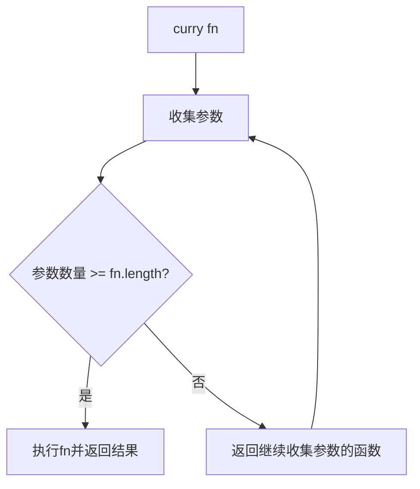
```mermaid
flowchart TD
    A["curry fn"] --> B["收集参数"]
    B --> C{"参数数量 >= fn.length?"}
    C -->|是| D["执行fn并返回结果"]
    C -->|否| E["返回继续收集参数的函数"]
    E --> B
```

```javascript
function curry(fn, args) {
  let length = fn.length;
  args = args || [];
  return function() {
    let subArgs = args.slice(0);
    for (let i = 0; i < arguments.length; i++) {
      subArgs.push(arguments[i]);
    }
    if (subArgs.length >= length) {
      return fn.apply(this, subArgs);
    } else {
      return curry.call(this, fn, subArgs);
    }
  };
}

// es6 实现
function curry(fn, ...args) {
  return fn.length <= args.length ? fn(...args) : curry.bind(null, fn, ...args);
}
```

### 1️⃣5️⃣ 实现AJAX请求

> 💡 **要点**：创建 XMLHttpRequest → open → setRequestHeader → onreadystatechange 监听 → send

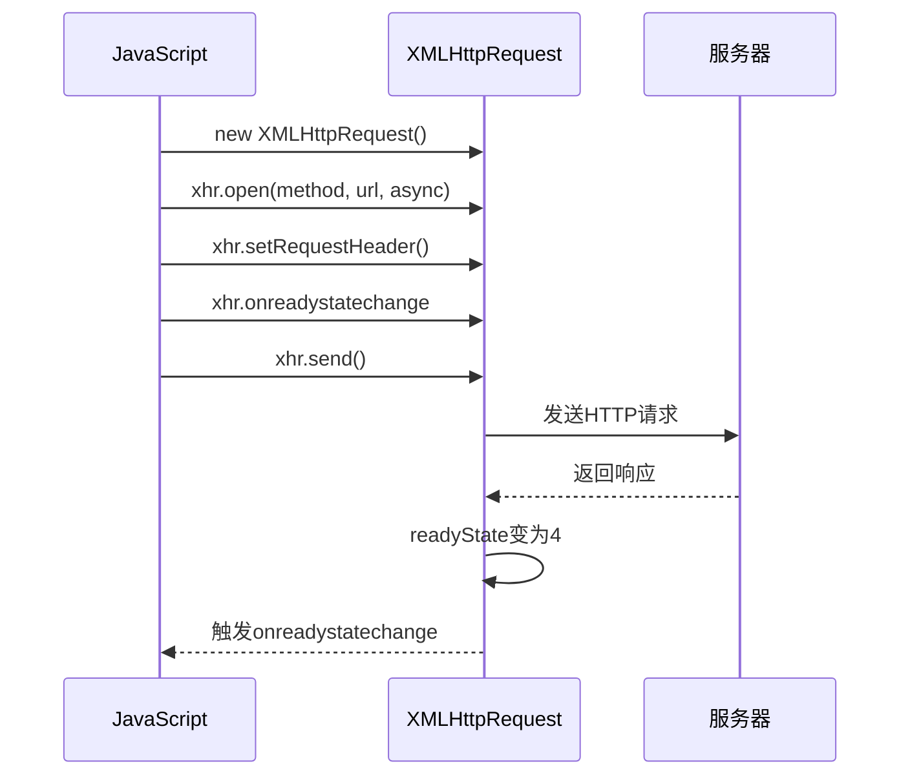
```mermaid
sequenceDiagram
    participant JS as JavaScript
    participant XHR as XMLHttpRequest
    participant Server as 服务器

    JS->>XHR: new XMLHttpRequest()
    JS->>XHR: xhr.open(method, url, async)
    JS->>XHR: xhr.setRequestHeader()
    JS->>XHR: xhr.onreadystatechange
    JS->>XHR: xhr.send()
    XHR->>Server: 发送HTTP请求
    Server-->>XHR: 返回响应
    XHR->>XHR: readyState变为4
    XHR-->>JS: 触发onreadystatechange
```

```javascript
const SERVER_URL = "/server";
let xhr = new XMLHttpRequest();
xhr.open("GET", SERVER_URL, true);
xhr.onreadystatechange = function() {
  if (this.readyState !== 4) return;
  if (this.status === 200) {
    handle(this.response);
  } else {
    console.error(this.statusText);
  }
};
xhr.onerror = function() {
  console.error(this.statusText);
};
xhr.responseType = "json";
xhr.setRequestHeader("Accept", "application/json");
xhr.send(null);
```

### 1️⃣6️⃣ 使用Promise封装AJAX请求

> 💡 **要点**：将 XMLHttpRequest 包装在 Promise 中，成功调用 resolve，失败调用 reject

```javascript
function getJSON(url) {
  let promise = new Promise(function(resolve, reject) {
    let xhr = new XMLHttpRequest();
    xhr.open("GET", url, true);
    xhr.onreadystatechange = function() {
      if (this.readyState !== 4) return;
      if (this.status === 200) {
        resolve(this.response);
      } else {
        reject(new Error(this.statusText));
      }
    };
    xhr.onerror = function() {
      reject(new Error(this.statusText));
    };
    xhr.responseType = "json";
    xhr.setRequestHeader("Accept", "application/json");
    xhr.send(null);
  });
  return promise;
}
```

### 1️⃣7️⃣ 实现浅拷贝

> 💡 **要点**：只复制对象的第一层属性，嵌套对象仍共享引用

```javascript
function shallowCopy(object) {
  if (!object || typeof object !== "object") return;
  let newObject = Array.isArray(object) ? [] : {};
  for (let key in object) {
    if (object.hasOwnProperty(key)) {
      newObject[key] = object[key];
    }
  }
  return newObject;
}
```

### 1️⃣8️⃣ 实现深拷贝

> 💡 **要点**：递归遍历对象属性，遇到对象类型则递归拷贝，需要注意循环引用和特殊对象类型

> [!WARNING]
> **注意循环引用和性能**：基础版本的深拷贝不支持 `Date`、`Map`、`Set`、`RegExp` 等特殊对象，也无法检测循环引用会导致栈溢出。完整版见第六章节。

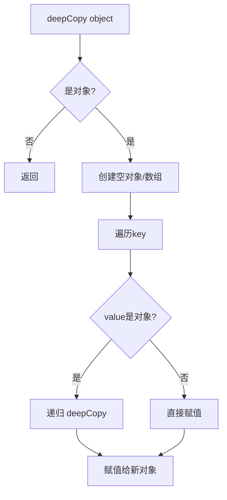
```mermaid
flowchart TD
    A["deepCopy object"] --> B{"是对象?"}
    B -->|否| C["返回"]
    B -->|是| D["创建空对象/数组"]
    D --> E["遍历key"]
    E --> F{"value是对象?"}
    F -->|否| G["直接赋值"]
    F -->|是| H["递归 deepCopy"]
    H --> I["赋值给新对象"]
    G --> I
```

```javascript
function deepCopy(object) {
  if (!object || typeof object !== "object") return;
  let newObject = Array.isArray(object) ? [] : {};
  for (let key in object) {
    if (object.hasOwnProperty(key)) {
      newObject[key] =
        typeof object[key] === "object" ? deepCopy(object[key]) : object[key];
    }
  }
  return newObject;
}
```

### 1️⃣9️⃣ 实现sleep函数

> 💡 **要点**：基于 Promise 封装 setTimeout，配合 async/await 实现同步风格的延迟执行

```javascript
function timeout(delay) {
  return new Promise(resolve => {
    setTimeout(resolve, delay)
  })
};
```

---

## 🔄 二、数据处理

### 1️⃣ 实现日期格式化函数

> 💡 **要点**：通过字符串替换将 yyyy/MM/dd 等占位符替换为实际日期值

```javascript
const dateFormat = (dateInput, format)=>{
    var day = dateInput.getDate().toString().padStart(2, '0')
    var month = (dateInput.getMonth() + 1).toString().padStart(2, '0')
    var year = dateInput.getFullYear()   
    format = format.replace(/yyyy/, year)
    format = format.replace(/MM/, month)
    format = format.replace(/dd/, day)
    return format
}
```

### 2️⃣ 交换a,b的值，不能用临时变量

> 💡 **要点**：利用加减法运算实现数值交换，`a = a + b; b = a - b; a = a - b`

```javascript
a = a + b
b = a - b
a = a - b
```

### 3️⃣ 实现数组的乱序输出（Fisher-Yates洗牌算法）

> 💡 **要点**：从后往前遍历，每次随机选取一个未处理元素与当前位置交换，确保每个排列等概率

```javascript
var arr = [1,2,3,4,5,6,7,8,9,10];
for (var i = 0; i < arr.length; i++) {
  const randomIndex = Math.round(Math.random() * (arr.length - 1 - i)) + i;
  [arr[i], arr[randomIndex]] = [arr[randomIndex], arr[i]];
}
```

### 4️⃣ 实现数组扁平化（6种方法）

> 💡 **要点**：将嵌套数组「拉平」为一维数组，递归、reduce、扩展运算符、toString、JSON 正则、ES6 flat 六种思路

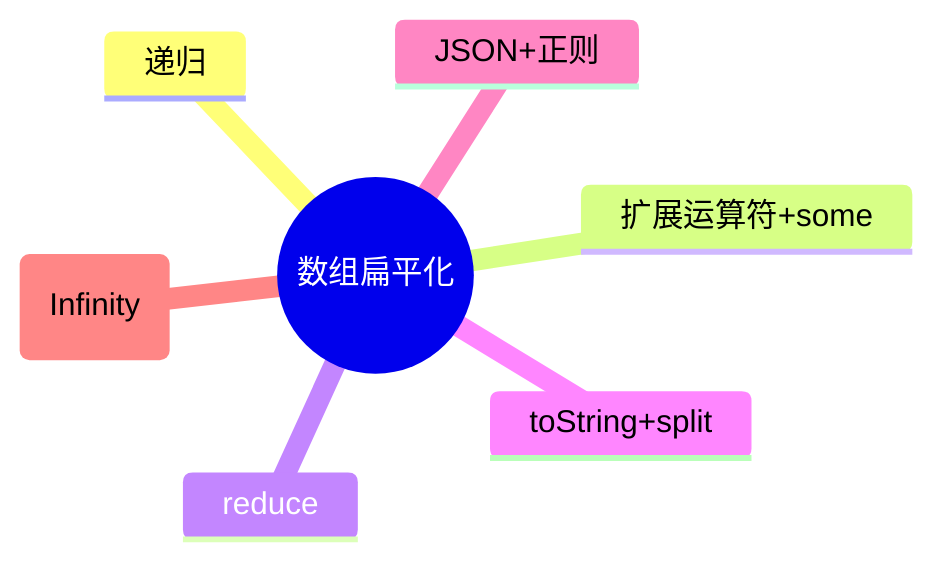
```mermaid
mindmap
  root((数组扁平化))
    递归
    扩展运算符+some
    reduce
    toString+split
    JSON+正则
    ES6 flat(Infinity)
```

```javascript
// 1. 递归
function flatten(arr) {
  let result = [];
  for(let i = 0; i < arr.length; i++) {
    if(Array.isArray(arr[i])) {
      result = result.concat(flatten(arr[i]));
    } else {
      result.push(arr[i]);
    }
  }
  return result;
}

// 2. reduce
function flatten(arr) {
    return arr.reduce(function(prev, next){
        return prev.concat(Array.isArray(next) ? flatten(next) : next)
    }, [])
}

// 3. 扩展运算符
function flatten(arr) {
    while (arr.some(item => Array.isArray(item))) {
        arr = [].concat(...arr);
    }
    return arr;
}

// 4. toString + split (仅适用于纯数字数组)
function flatten(arr) {
    return arr.toString().split(',').map(item => Number(item));
}

// 5. ES6 flat
function flatten(arr) {
  return arr.flat(Infinity);
}

// 6. JSON + 正则
function flatten(arr) {
  let str = JSON.stringify(arr);
  str = str.replace(/(\[|\])/g, '');
  str = '[' + str + ']';
  return JSON.parse(str); 
}
```

### 5️⃣ 实现数组去重

> 💡 **要点**：ES6 的 `Array.from(new Set(array))` 最简洁；ES5 利用对象属性哈希表去重

```javascript
// ES6
Array.from(new Set(array));

// ES5
function uniqueArray(array) {
  let map = {};
  let res = [];
  for(var i = 0; i < array.length; i++) {
    if(!map.hasOwnProperty([array[i]])) {
      map[array[i]] = 1;
      res.push(array[i]);
    }
  }
  return res;
}
```

### 6️⃣ 将数字每千分位用逗号隔开

> 💡 **要点**：利用模 3 余数确定第一个逗号位置，剩余部分按每三位一组用 `.match(/\d{3}/g)` 分割

```javascript
let format = n => {
    let num = n.toString()
    let decimals = ''
    num.indexOf('.') > -1 ? decimals = num.split('.')[1] : decimals
    let len = num.length
    if (len <= 3) {
        return num
    } else {
        let temp = ''
        let remainder = len % 3
        decimals ? temp = '.' + decimals : temp
        if (remainder > 0) {
            return num.slice(0, remainder) + ',' + num.slice(remainder, len).match(/\d{3}/g).join(',') + temp
        } else {
            return num.slice(0, len).match(/\d{3}/g).join(',') + temp 
        }
    }
}
```

### 7️⃣ 将js对象转化为树形结构

> 💡 **要点**：先建立 id→item 的 Map 索引，再遍历数组通过 pid 查找父节点进行挂载

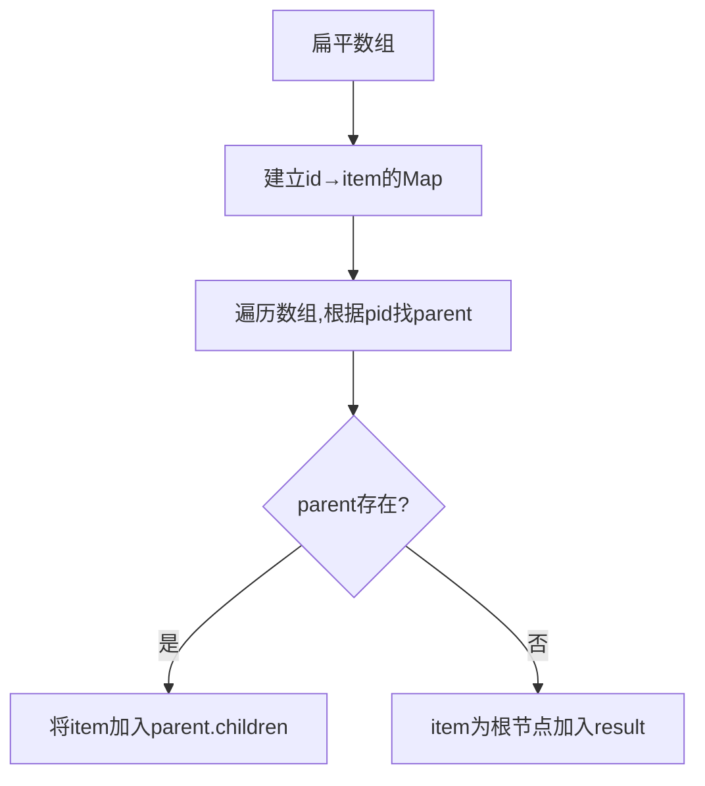
```mermaid
flowchart TD
    A["扁平数组"] --> B["建立id→item的Map"]
    B --> C["遍历数组,根据pid找parent"]
    C --> D{"parent存在?"}
    D -->|是| E["将item加入parent.children"]
    D -->|否| F["item为根节点加入result"]
```

```javascript
function jsonToTree(data) {
  let result = []
  if(!Array.isArray(data)) {
    return result
  }
  let map = {};
  data.forEach(item => {
    map[item.id] = item;
  });
  data.forEach(item => {
    let parent = map[item.pid];
    if(parent) {
      (parent.children || (parent.children = [])).push(item);
    } else {
      result.push(item);
    }
  });
  return result;
}
```

### 8️⃣ 解析 URL Params 为对象

> 💡 **要点**：正则提取参数字符串，split 解析键值对，处理重复 key（转为数组）和无值参数（设为 true）

```javascript
function parseParam(url) {
  const paramsStr = /.+\?(.+)$/.exec(url)[1];
  const paramsArr = paramsStr.split('&');
  let paramsObj = {};
  paramsArr.forEach(param => {
    if (/=/.test(param)) {
      let [key, val] = param.split('=');
      val = decodeURIComponent(val);
      val = /^\d+$/.test(val) ? parseFloat(val) : val;
      if (paramsObj.hasOwnProperty(key)) {
        paramsObj[key] = [].concat(paramsObj[key], val);
      } else {
        paramsObj[key] = val;
      }
    } else {
      paramsObj[param] = true;
    }
  })
  return paramsObj;
}
```

---

## 🛠️ 三、场景应用

### 1️⃣ 循环打印红黄绿

> 💡 **要点**：三种实现方式逐步演进：回调地狱 → Promise 链 → async/await，通过递归实现无限循环

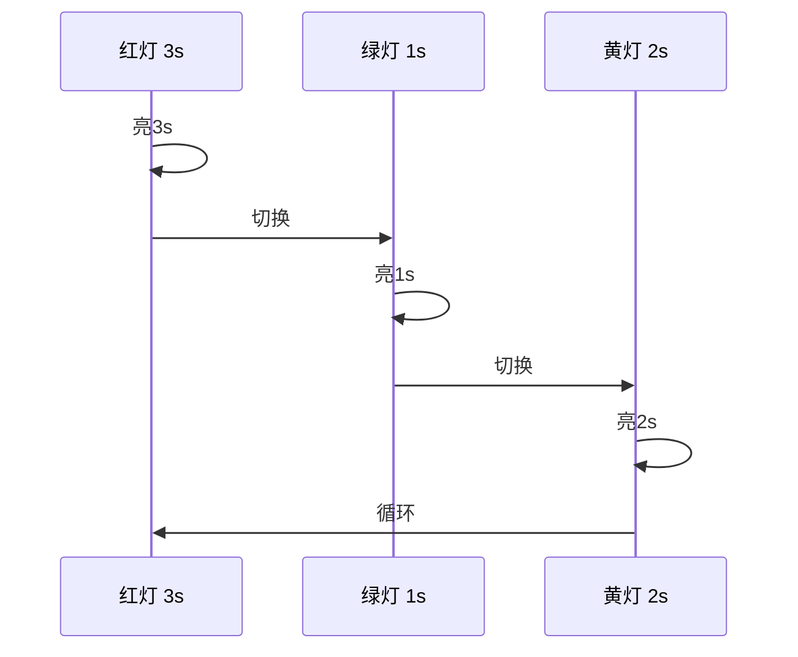
```mermaid
sequenceDiagram
    participant R as 红灯 3s
    participant G as 绿灯 1s  
    participant Y as 黄灯 2s

    R->>R: 亮3s
    R->>G: 切换
    G->>G: 亮1s
    G->>Y: 切换
    Y->>Y: 亮2s
    Y->>R: 循环
```

```javascript
function red() { console.log('red'); }
function green() { console.log('green'); }
function yellow() { console.log('yellow'); }

// callback 实现
const task = (timer, light, callback) => {
    setTimeout(() => {
        if (light === 'red') red()
        else if (light === 'green') green()
        else if (light === 'yellow') yellow()
        callback()
    }, timer)
}
const step = () => {
    task(3000, 'red', () => {
        task(2000, 'green', () => {
            task(1000, 'yellow', step)
        })
    })
}
step()

// Promise 实现
const task2 = (timer, light) => 
    new Promise((resolve, reject) => {
        setTimeout(() => {
            if (light === 'red') red()
            else if (light === 'green') green()
            else if (light === 'yellow') yellow()
            resolve()
        }, timer)
    })
const step2 = () => {
    task2(3000, 'red')
        .then(() => task2(2000, 'green'))
        .then(() => task2(2100, 'yellow'))
        .then(step2)
}
step2()

// async/await 实现
const taskRunner =  async () => {
    await task2(3000, 'red')
    await task2(2000, 'green')
    await task2(1000, 'yellow')
    taskRunner()
}
taskRunner()
```

### 2️⃣ 实现发布-订阅模式

> 💡 **要点**：事件中心模式，通过 handlers 对象存储事件回调，支持 on/emit/off 解耦通信

```javascript
class EventCenter {
  constructor() {
    this.handlers = {}
  }

  addEventListener(type, handler) {
    if (!this.handlers[type]) {
      this.handlers[type] = []
    }
    this.handlers[type].push(handler)
  }

  dispatchEvent(type, params) {
    if (!this.handlers[type]) {
      return new Error('该事件未注册')
    }
    this.handlers[type].forEach(handler => {
      handler(...params)
    })
  }

  removeEventListener(type, handler) {
    if (!this.handlers[type]) {
      return new Error('事件无效')
    }
    if (!handler) {
      delete this.handlers[type]
    } else {
      const index = this.handlers[type].findIndex(el => el === handler)
      if (index === -1) {
        return new Error('无该绑定事件')
      }
      this.handlers[type].splice(index, 1)
      if (this.handlers[type].length === 0) {
        delete this.handlers[type]
      }
    }
  }
}
```

### 3️⃣ 实现双向数据绑定

> 💡 **要点**：利用 `Object.defineProperty` 的 setter 拦截数据修改，同步更新视图（input 和 span）

```javascript
let obj = {}
let input = document.getElementById('input')
let span = document.getElementById('span')
Object.defineProperty(obj, 'text', {
  configurable: true,
  enumerable: true,
  get() {
    console.log('获取数据了')
  },
  set(newVal) {
    console.log('数据更新了')
    input.value = newVal
    span.innerHTML = newVal
  }
})
input.addEventListener('keyup', function(e) {
  obj.text = e.target.value
})
```

### 4️⃣ 使用 setTimeout 实现 setInterval

> 💡 **要点**：递归调用 setTimeout 替代 setInterval，返回包含 flag 标志的对象便于手动停止

```javascript
function mySetInterval(fn, timeout) {
  var timer = { flag: true };
  function interval() {
    if (timer.flag) {
      fn();
      setTimeout(interval, timeout);
    }
  }
  setTimeout(interval, timeout);
  return timer;
}
```

### 5️⃣ 实现 jsonp

> 💡 **要点**：利用 script 标签不受同源策略限制的特性，通过动态创建 script 并传入回调函数名实现跨域

```javascript
function addScript(src) {
  const script = document.createElement('script');
  script.src = src;
  script.type = "text/javascript";
  document.body.appendChild(script);
}
addScript("http://xxx.xxx.com/xxx.js?callback=handleRes");
function handleRes(res) {
  console.log(res);
}
```

### 6️⃣ 判断对象是否存在循环引用

> 💡 **要点**：深度遍历时记录父级引用链，每访问一个子对象就与所有祖先对象比对，有相同则存在循环引用

```javascript
const isCycleObject = (obj,parent) => {
    const parentArr = parent || [obj];
    for(let i in obj) {
        if(typeof obj[i] === 'object') {
            let flag = false;
            parentArr.forEach((pObj) => {
                if(pObj === obj[i]){ flag = true; }
            })
            if(flag) return true;
            flag = isCycleObject(obj[i],[...parentArr,obj[i]]);
            if(flag) return true;
        }
    }
    return false;
}
```

---

## ⚡ 四、现代 Promise 方法

### 1️⃣ 手写 Promise.allSettled

> 💡 **要点**：等待所有 Promise 完成，不论成功失败都收集结果，返回 `{status, value/reason}` 数组

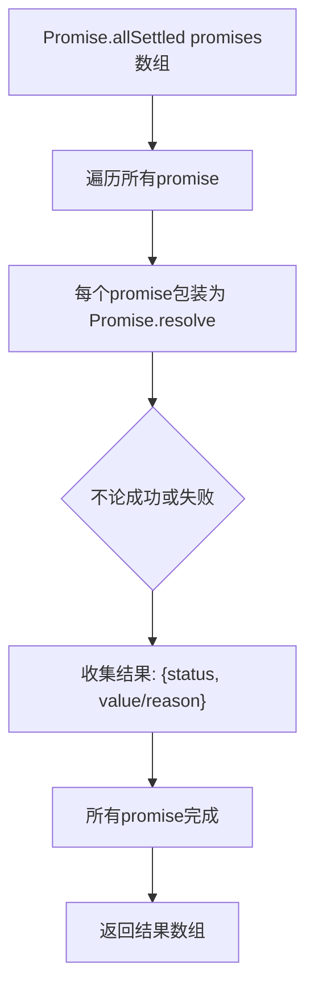
```mermaid
flowchart TD
    A["Promise.allSettled promises数组"] --> B["遍历所有promise"]
    B --> C["每个promise包装为 Promise.resolve"]
    C --> D{"不论成功或失败"}
    D --> E["收集结果: {status, value/reason}"]
    E --> F["所有promise完成"]
    F --> G["返回结果数组"]
```

`Promise.allSettled` 与 `Promise.all` 的区别：
- `all`：一个失败则整体失败，返回第一个错误
- `allSettled`：等待所有结束，无论成功失败都收集结果

```javascript
function promiseAllSettled(promises) {
  return Promise.all(
    promises.map(p =>
      Promise.resolve(p).then(
        value => ({ status: 'fulfilled', value }),
        reason => ({ status: 'rejected', reason })
      )
    )
  )
}
```

### 2️⃣ 手写 Promise.any

> 💡 **要点**：首个成功则 resolve，全部失败则 reject 一个包含所有错误信息的 AggregateError

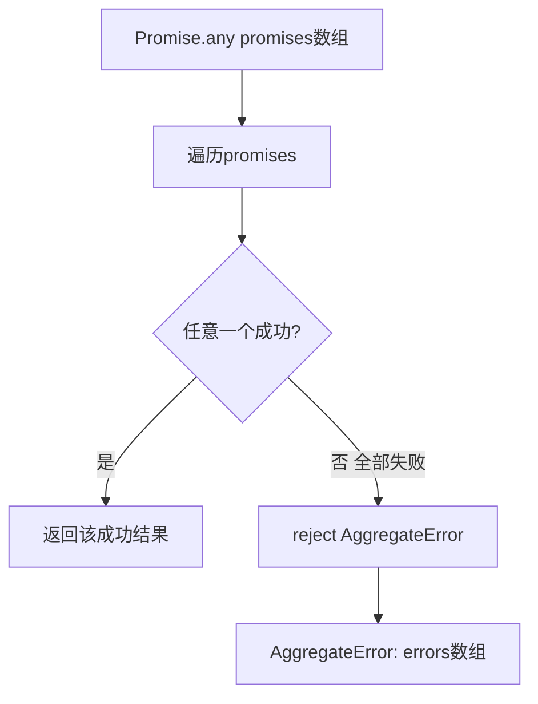
```mermaid
flowchart TD
    A["Promise.any promises数组"] --> B["遍历promises"]
    B --> C{"任意一个成功?"}
    C -->|是| D["返回该成功结果"]
    C -->|否 全部失败| E["reject AggregateError"]
    E --> F["AggregateError: errors数组"]
```

`Promise.any` 与 `Promise.race` 的区别：
- `race`：第一个定论的 Promise（可能是 reject）
- `any`：第一个 fulfilled 的 Promise；如果全部 reject，则 reject 一个 `AggregateError`

```javascript
function promiseAny(promises) {
  return new Promise((resolve, reject) => {
    let rejectedCount = 0
    const errors = []
    const len = promises.length
    if (len === 0) {
      return reject(new AggregateError([], 'All promises were rejected'))
    }
    promises.forEach((p, i) => {
      Promise.resolve(p).then(
        value => resolve(value),
        reason => {
          errors[i] = reason
          rejectedCount++
          if (rejectedCount === len) {
            reject(new AggregateError(errors, 'All promises were rejected'))
          }
        }
      )
    })
  })
}
```

### 3️⃣ 手写 Promise.withResolvers

> 💡 **要点**：将 Promise 的 resolve/reject 暴露到外部，便于在事件回调等场景下控制 Promise 状态

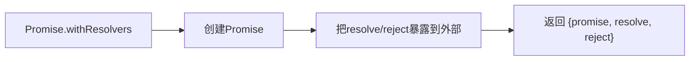
```mermaid
flowchart LR
    A["Promise.withResolvers"] --> B["创建Promise"]
    B --> C["把resolve/reject暴露到外部"]
    C --> D["返回 {promise, resolve, reject}"]
```

`Promise.withResolvers` 让你可以在 Promise 外部控制其状态，避免嵌套闭包。

```javascript
function promiseWithResolvers() {
  let resolve, reject
  const promise = new Promise((res, rej) => {
    resolve = res
    reject = rej
  })
  return { promise, resolve, reject }
}

// 使用场景：事件驱动的异步
// const { promise, resolve } = promiseWithResolvers()
// button.onclick = () => resolve('clicked')
// await promise  // 等待按钮点击
```

---

## 🆕 五、现代 JavaScript 手写

### 1️⃣ 手写 structuredClone（简化版）

> 💡 **要点**：支持 Date、Map、Set、RegExp 等特殊对象的深拷贝，使用 WeakMap 解决循环引用

```javascript
function structuredClone(obj, weakMap = new WeakMap()) {
  if (obj === null || typeof obj !== 'object') return obj

  if (weakMap.has(obj)) return weakMap.get(obj)

  let clone
  if (obj instanceof Date) {
    clone = new Date(obj.getTime())
  } else if (obj instanceof RegExp) {
    clone = new RegExp(obj.source, obj.flags)
  } else if (obj instanceof Map) {
    clone = new Map()
    weakMap.set(obj, clone)
    obj.forEach((val, key) => clone.set(key, structuredClone(val, weakMap)))
    return clone
  } else if (obj instanceof Set) {
    clone = new Set()
    weakMap.set(obj, clone)
    obj.forEach(val => clone.add(structuredClone(val, weakMap)))
    return clone
  } else if (Array.isArray(obj)) {
    clone = []
    weakMap.set(obj, clone)
    obj.forEach((item, i) => clone[i] = structuredClone(item, weakMap))
    return clone
  } else {
    clone = Object.create(Object.getPrototypeOf(obj))
    weakMap.set(obj, clone)
    const allKeys = [...Object.keys(obj), ...Object.getOwnPropertySymbols(obj)]
    allKeys.forEach(key => {
      clone[key] = structuredClone(obj[key], weakMap)
    })
    return clone
  }
}
```

### 2️⃣ 手写 LRU Cache（最近最少使用缓存）

> 💡 **要点**：利用 Map 的插入顺序特性，每次 get/put 时先删除再添加以更新顺序，超出容量时删除 Map 头部元素（最久未使用）

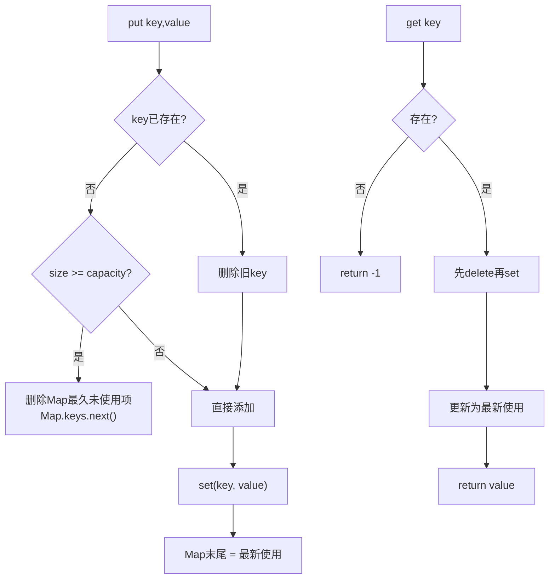
```mermaid
flowchart TD
    A["put key,value"] --> B{"key已存在?"}
    B -->|是| C["删除旧key"]
    B -->|否| D{"size >= capacity?"}
    D -->|是| E["删除Map最久未使用项<br>Map.keys.next()"]
    D -->|否| F["直接添加"]
    C --> F
    F --> G["set(key, value)"]
    G --> H["Map末尾 = 最新使用"]

    I["get key"] --> J{"存在?"}
    J -->|否| K["return -1"]
    J -->|是| L["先delete再set"]
    L --> M["更新为最新使用"]
    M --> N["return value"]
```

利用 Map 的迭代顺序（插入顺序），每次访问时先删后加，让最近使用的项保持在末尾。

```javascript
class LRUCache {
  constructor(capacity) {
    this.capacity = capacity
    this.map = new Map()
  }

  get(key) {
    if (!this.map.has(key)) return -1
    const value = this.map.get(key)
    this.map.delete(key)
    this.map.set(key, value)
    return value
  }

  put(key, value) {
    if (this.map.has(key)) {
      this.map.delete(key)
    } else if (this.map.size >= this.capacity) {
      const oldest = this.map.keys().next().value
      this.map.delete(oldest)
    }
    this.map.set(key, value)
  }
}
```

### 3️⃣ 手写 compose 和 pipe

> 💡 **要点**：compose 从右到左组合函数，pipe 从左到右，都利用 reduce 实现函数链式调用

```mermaid
flowchart LR
    subgraph compose [compose 从右到左]
        A["x"] --> B["fn"]
        B --> C["g"]
        C --> D["h"]
        D --> E["结果"]
    end
    subgraph pipe [pipe 从左到右]
        F["x"] --> G["h"]
        G --> H["g"]
        H --> I["fn"]
        I --> J["结果"]
    end
```

```javascript
// compose: 从右到左组合函数
const compose = (...fns) =>
  fns.reduce((a, b) =>
    (...args) => a(b(...args))
  )

// pipe: 从左到右组合函数
const pipe = (...fns) =>
  fns.reduce((a, b) =>
    (...args) => b(a(...args))
  )

// 使用
// const add1 = x => x + 1
// const double = x => x * 2
// compose(double, add1)(3)  // double(add1(3)) = 8
// pipe(add1, double)(3)     // double(add1(3)) = 8
```

### 4️⃣ 手写 once 函数

> 💡 **要点**：确保函数只执行一次，后续调用直接返回第一次的缓存结果，常用于初始化场景

```javascript
function once(fn) {
  let called = false
  let result
  return function(...args) {
    if (!called) {
      called = true
      result = fn.apply(this, args)
    }
    return result
  }
}

// 使用
// const init = once(() => { console.log('init once'); return 42 })
// init()  // 'init once' → 42
// init()  // 42 (不再执行)
```

### 5️⃣ 手写 memoize 函数

> 💡 **要点**：缓存函数计算结果，相同输入直接返回缓存值，可通过 resolver 自定义缓存 key

```javascript
function memoize(fn, resolver) {
  const cache = new Map()
  return function(...args) {
    const key = resolver ? resolver(...args) : args[0]
    if (cache.has(key)) return cache.get(key)
    const result = fn.apply(this, args)
    cache.set(key, result)
    return result
  }
}

// 使用
// const fib = memoize(n => n <= 1 ? n : fib(n - 1) + fib(n - 2))
```

### 6️⃣ 手写 Array.prototype.flatMap

> 💡 **要点**：`flatMap = map + flat(1)`，先用 map 映射再用 concat 拉平一层，比分别调用性能更好

```mermaid
flowchart LR
    A["arr"] --> B["map(fn)"]
    B --> C["[[1,2],[3,4]]]
    C --> D["flat一层"]
    D --> E["[1,2,3,4"]]
```

```javascript
function flatMap(arr, callback, thisArg) {
  return arr.reduce((acc, item, index) => {
    const mapped = callback.call(thisArg, item, index, arr)
    return acc.concat(mapped)
  }, [])
}

// flatMap = map + flat(1)
// [1, 2, 3].flatMap(x => [x, x * 2])
// → [1, 2, 2, 4, 3, 6]
```

### 7️⃣ 手写 Object.groupBy

> 💡 **要点**：根据分组函数对数组元素分类，返回一个以分组 key 为键、元素数组为值的对象

```javascript
function groupBy(items, keyFn) {
  return items.reduce((result, item) => {
    const key = keyFn(item)
    if (!result[key]) result[key] = []
    result[key].push(item)
    return result
  }, Object.create(null))
}

// 使用
// const inventory = [
//   { name: 'apple', type: 'fruit' },
//   { name: 'carrot', type: 'vegetable' },
//   { name: 'banana', type: 'fruit' },
// ]
// groupBy(inventory, item => item.type)
// → { fruit: [{name:'apple'},{name:'banana'}], vegetable: [{name:'carrot'}] }
```

### 8️⃣ 手写 Promise.retry（失败重试）

> 💡 **要点**：Promise 失败后自动重试，直到成功或达到最大重试次数，每次重试可配置延迟

```javascript
function promiseRetry(fn, maxRetries = 3, delay = 300) {
  return new Promise((resolve, reject) => {
    const attempt = (n) => {
      fn().then(resolve).catch(err => {
        if (n === 0) return reject(err)
        setTimeout(() => attempt(n - 1), delay)
      })
    }
    attempt(maxRetries)
  })
}

// 使用
// promiseRetry(() => fetch('/api/data'), 3, 500)
//   .then(console.log)
//   .catch(console.error)
```

---

## 🧮 六、算法与数据结构

### 1️⃣ 排序算法

> 💡 **要点**：快速排序（分治）、归并排序（合并有序数组）、冒泡排序（两两交换），面试常考快排和归并

```mermaid
flowchart TD
    subgraph 快速排序
        Q1["选基准pivot"] --> Q2["小于基准放左,大于放右"]
        Q2 --> Q3["递归左右分区"]
    end
    subgraph 归并排序
        M1["数组一分为二"] --> M2["递归排序左右"]
        M2 --> M3["合并两个有序数组"]
    end
    subgraph 冒泡排序
        B1["从头开始两两比较"] --> B2["大数逐步上浮到末尾"]
        B2 --> B3["每轮确定一个最大值"]
    end
```

| 算法 | 平均时间复杂度 | 最坏时间复杂度 | 空间复杂度 | 稳定性 |
|------|:-:|:-:|:-:|:-:|
| **快速排序** | O(n log n) | O(n²) | O(log n) | 不稳定 |
| **归并排序** | O(n log n) | O(n log n) | O(n) | 稳定 |
| **冒泡排序** | O(n²) | O(n²) | O(1) | 稳定 |

```javascript
// 快速排序
function quickSort(arr) {
  if (arr.length <= 1) return arr
  const pivot = arr[0]
  const left = [], right = []
  for (let i = 1; i < arr.length; i++) {
    arr[i] < pivot ? left.push(arr[i]) : right.push(arr[i])
  }
  return [...quickSort(left), pivot, ...quickSort(right)]
}

// 归并排序
function mergeSort(arr) {
  if (arr.length <= 1) return arr
  const mid = Math.floor(arr.length / 2)
  const left = mergeSort(arr.slice(0, mid))
  const right = mergeSort(arr.slice(mid))
  return merge(left, right)
}
function merge(left, right) {
  const result = []
  let i = 0, j = 0
  while (i < left.length && j < right.length) {
    result.push(left[i] <= right[j] ? left[i++] : right[j++])
  }
  return result.concat(left.slice(i)).concat(right.slice(j))
}

// 冒泡排序
function bubbleSort(arr) {
  const len = arr.length
  for (let i = 0; i < len - 1; i++) {
    let swapped = false
    for (let j = 0; j < len - 1 - i; j++) {
      if (arr[j] > arr[j + 1]) {
        [arr[j], arr[j + 1]] = [arr[j + 1], arr[j]]
        swapped = true
      }
    }
    if (!swapped) break
  }
  return arr
}
```

### 2️⃣ 二分查找

> 💡 **要点**：有序数组的折半搜索，每次缩小一半查找范围，时间复杂度 O(log n)

```javascript
function binarySearch(arr, target) {
  let left = 0, right = arr.length - 1
  while (left <= right) {
    const mid = left + ((right - left) >> 1)
    if (arr[mid] === target) return mid
    if (arr[mid] < target) left = mid + 1
    else right = mid - 1
  }
  return -1
}
```

### 3️⃣ 防抖节流增强版

> 💡 **要点**：支持 `leading`（立即执行）和 `trailing`（延迟执行）选项，覆盖更多实际场景

> [!TIP]
> **leading + trailing 场景**：搜索输入框需要 leading 立即响应用户操作，同时也需要 trailing 防止遗漏；滚动加载只需要 trailing 兜底即可。

```javascript
// 防抖（支持 leading + trailing）
function debounce(fn, wait, options = {}) {
  const { leading = false, trailing = true } = options
  let timer, lastArgs, lastThis

  function invoke() {
    if (timer) {
      clearTimeout(timer)
      timer = null
    }
    if (lastArgs) {
      fn.apply(lastThis, lastArgs)
      lastArgs = lastThis = null
    }
  }

  return function(...args) {
    if (!timer && leading) {
      fn.apply(this, args)
    } else {
      lastArgs = args
      lastThis = this
    }
    if (timer) clearTimeout(timer)
    timer = setTimeout(() => {
      timer = null
      if (trailing && lastArgs) invoke()
    }, wait)
  }
}

// 节流（支持 leading + trailing）
function throttle(fn, delay, options = {}) {
  const { leading = true, trailing = true } = options
  let lastTime = 0, timer, lastArgs, lastThis

  function invoke() {
    lastTime = Date.now()
    timer = null
    if (lastArgs) {
      fn.apply(lastThis, lastArgs)
      lastArgs = lastThis = null
    }
  }

  return function(...args) {
    const now = Date.now()
    if (!lastTime && !leading) lastTime = now
    const remaining = delay - (now - lastTime)

    if (remaining <= 0) {
      if (timer) { clearTimeout(timer); timer = null }
      lastTime = now
      fn.apply(this, args)
      if (!timer && lastArgs) invoke()
    } else if (!timer && trailing) {
      lastArgs = args
      lastThis = this
      timer = setTimeout(invoke, remaining)
    }
  }
}
```

### 4️⃣ 手写 EventEmitter（发布订阅）

> 💡 **要点**：完整的发布订阅实现，支持 on/off/emit/once，once 利用包装函数自动解绑

```mermaid
flowchart LR
    A["eventEmitter.on event, handler"] --> B["存入handlersMap"]
    C["eventEmitter.emit event, data"] --> D["取出 handlersMap 中的 event 列表"]
    D --> E["依次执行所有handler"]
    F["eventEmitter.off event, handler"] --> G["从handlersMap移除handler"]
    H["eventEmitter.once event, handler"] --> I["包装为临时函数<br>执行后自动off"]
```

```javascript
class EventEmitter {
  constructor() {
    this._handlers = new Map()
  }

  on(event, handler) {
    if (!this._handlers.has(event)) {
      this._handlers.set(event, [])
    }
    this._handlers.get(event).push(handler)
    return this
  }

  off(event, handler) {
    if (!this._handlers.has(event)) return this
    if (!handler) {
      this._handlers.delete(event)
      return this
    }
    const handlers = this._handlers.get(event)
    const idx = handlers.indexOf(handler)
    if (idx !== -1) handlers.splice(idx, 1)
    if (handlers.length === 0) this._handlers.delete(event)
    return this
  }

  emit(event, ...args) {
    if (!this._handlers.has(event)) return false
    this._handlers.get(event).forEach(handler => {
      handler(...args)
    })
    return true
  }

  once(event, handler) {
    const wrapper = (...args) => {
      handler(...args)
      this.off(event, wrapper)
    }
    this.on(event, wrapper)
    return this
  }
}
```

### 5️⃣ 手写 Promise 控制并发

> 💡 **要点**：PromisePool 控制同时执行的任务数量，每个任务完成后自动从队列取出下一个执行

```javascript
class PromisePool {
  constructor(maxConcurrency) {
    this.maxConcurrency = maxConcurrency
    this.queue = []
    this.activeCount = 0
  }

  add(fn) {
    return new Promise((resolve, reject) => {
      this.queue.push({ fn, resolve, reject })
      this.run()
    })
  }

  run() {
    while (this.activeCount < this.maxConcurrency && this.queue.length > 0) {
      const { fn, resolve, reject } = this.queue.shift()
      this.activeCount++
      Promise.resolve(fn())
        .then(resolve, reject)
        .finally(() => {
          this.activeCount--
          this.run()
        })
    }
  }
}

// 使用
// const pool = new PromisePool(3)
// const urls = [url1, url2, url3, url4, url5, url6]
// urls.forEach(url => pool.add(() => fetch(url)))
```

### 6️⃣ 手写深拷贝（完整版）

> 💡 **要点**：支持 Date、Map、Set、RegExp、Symbol 键、循环引用的工业级深拷贝，使用 WeakMap 记录已拷贝对象

> [!WARNING]
> 基础版深拷贝无法处理 `Date`、`Map`、`Set`、`RegExp` 等特殊对象和循环引用。完整版通过 `WeakMap` 记录已访问对象来解决循环引用，并对每种内置类型做针对性处理。

```javascript
function deepClone(obj, weakMap = new WeakMap()) {
  if (obj === null || typeof obj !== 'object') return obj
  if (weakMap.has(obj)) return weakMap.get(obj)

  let clone
  if (obj instanceof Date) clone = new Date(obj.getTime())
  else if (obj instanceof RegExp) clone = new RegExp(obj.source, obj.flags)
  else if (obj instanceof Map) {
    clone = new Map()
    weakMap.set(obj, clone)
    obj.forEach((val, key) => clone.set(deepClone(key, weakMap), deepClone(val, weakMap)))
    return clone
  } else if (obj instanceof Set) {
    clone = new Set()
    weakMap.set(obj, clone)
    obj.forEach(val => clone.add(deepClone(val, weakMap)))
    return clone
  } else {
    clone = Object.create(Object.getPrototypeOf(obj))
    weakMap.set(obj, clone)
    const allKeys = [
      ...Object.getOwnPropertyNames(obj),
      ...Object.getOwnPropertySymbols(obj)
    ]
    allKeys.forEach(key => {
      clone[key] = deepClone(obj[key], weakMap)
    })
    return clone
  }
}
```

### 7️⃣ 手写 Virtual DOM

> 💡 **要点**：h 函数创建 VNode 对象，render 函数递归渲染为真实 DOM，处理事件绑定和文本节点

```javascript
// h 函数：创建 VNode
function h(tag, props, ...children) {
  return {
    tag,
    props: props || {},
    children: children.flat()
  }
}

// 渲染 VNode 到真实 DOM
function render(vnode, container) {
  const el = document.createElement(vnode.tag)

  for (const [key, val] of Object.entries(vnode.props)) {
    if (key.startsWith('on')) {
      el.addEventListener(key.slice(2).toLowerCase(), val)
    } else {
      el.setAttribute(key, val)
    }
  }

  for (const child of vnode.children) {
    if (typeof child === 'string' || typeof child === 'number') {
      el.appendChild(document.createTextNode(child))
    } else {
      render(child, el)
    }
  }

  container.appendChild(el)
  return el
}

// 使用
// const vdom = h('div', { id: 'app', onClick: () => alert('click') },
//   h('h1', {}, 'Hello Virtual DOM'),
//   h('p', {}, 'This is a VDOM demo')
// )
// render(vdom, document.getElementById('root'))
```

### 8️⃣ 手写 JSON.stringify（简化版）

> 💡 **要点**：递归序列化，处理基本类型、Date、数组、普通对象，过滤 undefined/symbol/function，支持 toJSON

```javascript
function myStringify(data) {
  const type = typeof data

  // 基本类型
  if (type === 'string') return `"${data}"`
  if (type === 'number') return isNaN(data) ? 'null' : String(data)
  if (type === 'boolean') return String(data)
  if (type === 'bigint') throw new TypeError('Do not know how to serialize a BigInt')
  if (type === 'symbol' || type === 'undefined' || type === 'function') {
    return undefined  // JSON.stringify 会忽略或返回 undefined
  }
  if (data === null) return 'null'
  if (data instanceof Date) return `"${data.toISOString()}"`

  // 有 toJSON 方法
  if (typeof data.toJSON === 'function') return myStringify(data.toJSON())

  // 数组
  if (Array.isArray(data)) {
    const arr = data.map(item =>
      typeof item === 'undefined' || typeof item === 'symbol' || typeof item === 'function'
        ? 'null' : myStringify(item)
    )
    return `[${arr.join(',')}]`
  }

  // 普通对象
  const keys = Object.keys(data).filter(
    key => typeof data[key] !== 'function' && typeof data[key] !== 'symbol' && data[key] !== undefined
  )
  const pairs = keys.map(key => `"${key}":${myStringify(data[key])}`)
  return `{${pairs.join(',')}}`
}

---

## 🧮 七、Array 方法实现

### 1️⃣ 手写 Array.prototype.map

> 💡 **要点**：遍历数组每个元素，执行回调后将返回值收集到新数组，不改变原数组

```mermaid
flowchart TD
    A[开始] --> B[参数校验]
    B --> C{arr是数组且<br/>callback是函数?}
    C -->|否| D[返回 []]
    C -->|是| E[初始化 result=[]]
    E --> F[遍历数组]
    F --> G[调用 callback(arr[i], i, arr)]
    G --> H[将返回值 push 到 result]
    H --> I{遍历完?}
    I -->|否| F
    I -->|是| J[返回 result]
```

```javascript
function map(arr, mapCallback) {
  if (!Array.isArray(arr) || !arr.length || typeof mapCallback !== 'function') {
    return [];
  }
  let result = [];
  for (let i = 0, len = arr.length; i < len; i++) {
    result.push(mapCallback(arr[i], i, arr));
  }
  return result;
}
```

### 2️⃣ 手写 Array.prototype.filter

> 💡 **要点**：遍历数组，回调返回真值的元素收集到新数组

```javascript
function filter(arr, filterCallback) {
  if (!Array.isArray(arr) || !arr.length || typeof filterCallback !== 'function') {
    return [];
  }
  let result = [];
  for (let i = 0, len = arr.length; i < len; i++) {
    if (filterCallback(arr[i], i, arr)) {
      result.push(arr[i]);
    }
  }
  return result;
}
```

### 3️⃣ 手写 Array.prototype.reduce

> 💡 **要点**：根据 initialValue 决定初始值和起始索引，每次迭代用回调返回值作为下次的累积值

```mermaid
graph TD
    A[arr, callback, initialValue] --> B{参数正确?}
    B -->|否| C[返回 []]
    B -->|是| D{有 initialValue?}
    D -->|无| E[value = arr[0], i=1]
    D -->|有| F[value = initialValue, i=0]
    E --> G[循环 callback(value, arr[i], i, arr)]
    F --> G
    G --> H[返回 value]
```

```javascript
function reduce(arr, reduceCallback, initialValue) {
  if (!Array.isArray(arr) || !arr.length || typeof reduceCallback !== 'function') {
    return [];
  }
  let hasInitialValue = initialValue !== undefined;
  let value = hasInitialValue ? initialValue : arr[0];
  for (let i = hasInitialValue ? 1 : 0, len = arr.length; i < len; i++) {
    value = reduceCallback(value, arr[i], i, arr);
  }
  return value;
}
```

### 4️⃣ 手写 Array.prototype.push

> 💡 **要点**：在数组末尾追加元素，返回新长度，利用 this.length 动态添加

```javascript
Array.prototype.myPush = function () {
  for (let i = 0; i < arguments.length; i++) {
    this[this.length] = arguments[i];
  }
  return this.length;
};
```

### 5️⃣ 手写 Array.prototype.indexOf

> 💡 **要点**：查找指定子串首次出现的位置，未找到返回 -1，基于正则匹配实现

```javascript
function myIndexOf(string, target) {
  if (typeof string !== 'string') {
    throw new Error('string only');
  }
  let mt = string.match(new RegExp(target));
  return mt ? mt.index : -1;
}
```

### 6️⃣ 实现数组元素求和

> 💡 **要点**：支持一维数组 reduce 求和、递归求和、嵌套数组 flat 后求和

```javascript
let arr = [1, 2, 3, 4, 5, 6, 7, 8, 9, 10];
let sum = arr.reduce((total, i) => total += i, 0);

function add(arr) {
  if (arr.length === 1) return arr[0];
  return arr[0] + add(arr.slice(1));
}

let arr2 = [1, 2, 3, [[4, [10], 5], 6], 7, 8, 9];
let sum2 = arr2.flat(2).reduce((total, i) => total += i, 0);
```

### 7️⃣ 两个数组合并成一个数组

> 💡 **要点**：将 `['A1','A2',...]` 和 `['A','B',...]` 按字母和数字顺序合并

```javascript
let a1 = ['A1', 'A2', 'B1', 'B2', 'C1', 'C2', 'D1', 'D2'];
let a2 = ['A', 'B', 'C', 'D'].map(item => item + '3');
let a3 = [...a1, ...a2].sort().map(item => {
  if (item.includes('3')) return item.split('')[0];
  return item;
});
// 结果: ['A1','A2','A','B1','B2','B','C1','C2','C','D1','D2','D']
```

---

## 🔨 八、实用工具函数

### 1️⃣ ES5 实现 isInteger

> 💡 **要点**：先判断 typeof 为 number 且 isFinite，再通过 Math.floor 或取余判断整数

```javascript
Number.isInteger = function (value) {
  return typeof value === "number" && isFinite(value) && Math.floor(value) === value;
};

function isInteger(x) {
  return typeof x === "number" && isFinite(x) && (x % 1 === 0);
}
```

### 2️⃣ 判断参数为空的函数封装

> 💡 **要点**：处理空字符串、'null'/'undefined' 字符串、null/undefined、空数组、空对象

```javascript
function isEmpty(a) {
  if (a === "") return true;
  if (a === "null") return true;
  if (a === "undefined") return true;
  if (!a && a !== 0 && a !== "") return true;
  if (Array.prototype.isPrototypeOf(a) && a.length === 0) return true;
  if (Object.prototype.isPrototypeOf(a) && Object.keys(a).length === 0) return true;
  return false;
}
```

### 3️⃣ 实现字符串翻转

> 💡 **要点**：split → reverse → join 链式调用

```javascript
String.prototype._reverse = function (a) {
  return a.split("").reverse().join("");
};
```

### 4️⃣ s2 中出现的字符在 s1 中删掉

> 💡 **要点**：遍历 s2 每个字符，从 s1 中 replace 移除首次出现

```javascript
function remove(s1, s2) {
  for (let i = 0, len = s2.length; i < len; i++) {
    s1 = s1.replace(s2[i], "");
  }
  return s1;
}
```

### 5️⃣ 判断子序列

> 💡 **要点**：双指针法，依次匹配子序列元素在主数组中的相对顺序

```javascript
const isSubsequence = (b, a) => {
  let bi = 0, ai = 0;
  while (bi < b.length) {
    if (a[ai] === b[bi]) { bi++; }
    else { ai++; }
    if (ai > a.length) return false;
  }
  return true;
};
```

### 6️⃣ 判断两个对象是否相等（深度比较）

> 💡 **要点**：递归比较每个属性值，先比较 keys 数量再逐层深入

```javascript
const deepEqual = function (x, y) {
  if (x === y) return true;
  if ((typeof x === 'object' && x != null) && (typeof y === 'object' && y != null)) {
    if (Object.keys(x).length !== Object.keys(y).length) return false;
    for (let prop in x) {
      if (y.hasOwnProperty(prop)) {
        if (!deepEqual(x[prop], y[prop])) return false;
      } else { return false; }
    }
    return true;
  }
  return false;
};
```

### 7️⃣ 使用 ES5 和 ES6 求函数参数的和

> 💡 **要点**：ES5 用 arguments + Array.prototype.forEach.call；ES6 用剩余参数 ...nums

```javascript
// ES5
function totalSum() {
  let sum = 0;
  Array.prototype.forEach.call(arguments, function (item) { sum += item * 1; });
  return sum;
}

// ES6
function totalSum(...nums) {
  let sum = 0;
  nums.forEach(function (item) { sum += item * 1; });
  return sum;
}
```

### 8️⃣ JavaScript 实现方法的重载

> 💡 **要点**：利用闭包链保存旧函数，根据 fn.length 与 arguments.length 匹配执行

```javascript
function addMethod(object, name, fnt) {
  var old = object[name];
  object[name] = function () {
    if (fnt.length === arguments.length) {
      return fnt.apply(this, arguments);
    } else if (typeof old === 'function') {
      return old.apply(this, arguments);
    }
  };
}

var methods = {};
addMethod(methods, 'add', function () { return 0; });
addMethod(methods, 'add', function (a, b) { return a + b; });
addMethod(methods, 'add', function (a, b, c) { return a + b + c; });
// methods.add() → 0, methods.add(10,20) → 30, methods.add(10,20,30) → 60
```

### 9️⃣ 只执行三次的函数（闭包控制）

> 💡 **要点**：闭包中计数，超过次数后不再执行

```javascript
function setFn(fn) {
  let times = 0;
  return () => { if (times++ < 3) fn(times); };
}
```

### 🔟 add(one(two())) / add(two(one())) 都输出 3

> 💡 **要点**：无参返回数值，有参返回数组，add 对数组求和

```javascript
function add() { return arguments[0].reduce((a, b) => a + b); }

function one() {
  return arguments.length === 0 ? 1 : [arguments[0], 1];
}

function two() {
  return arguments.length === 0 ? 2 : [arguments[0], 2];
}
```

### 1️⃣1️⃣ a == 1 && a == 2 && a == 3

> 💡 **要点**：利用 == 类型转换触发 toString 或 getter，每次比较返回自增值

```javascript
// 方案一：重写 toString
var a = { i: 0, toString: function () { return ++a.i; } };

// 方案二：Object.defineProperty getter
var i = 0;
Object.defineProperty(window, 'a', {
  get: function () { return ++i; }
});

// 方案三：数组 + shift
var a = [1, 2, 3];
a.toString = a.shift;
```

### 1️⃣2️⃣ 实现寄生组合式继承

> 💡 **要点**：Parent.call 继承属性，Object.create 继承原型，修正 constructor 指向

```javascript
function Parent(name) { this.name = name; }
Parent.prototype.sayName = function () { console.log('parent name:', this.name); };

function Child(name, parentName) {
  Parent.call(this, parentName);
  this.name = name;
}

Child.prototype = Object.create(Parent.prototype);
Child.prototype.sayName = function () { console.log('child name:', this.name); };
Child.prototype.constructor = Child;
```

### 1️⃣3️⃣ 实现图片的加载（Promise 版）

> 💡 **要点**：Promise 封装图片加载，支持链式调用顺序加载多张图片

```javascript
function createImg(url) {
  return new Promise((resolve, reject) => {
    if (url) {
      let ImgEle = document.createElement("img");
      ImgEle.src = url;
      resolve(ImgEle);
    } else {
      reject("url is not right");
    }
  });
}
```

### 1️⃣4️⃣ 不更改原函数功能调用函数（拦截器）

> 💡 **要点**：扩展 Function.prototype 添加 before/after，实现 AOP 面向切面编程

```javascript
Function.prototype.before = function (callback) {
  if (typeof callback !== "function") throw new TypeError("callback must be function");
  let _self = this;
  return function proxy(...params) {
    callback.call(this, ...params);
    return _self.call(this, ...params);
  };
};

Function.prototype.after = function (callback) {
  if (typeof callback !== "function") throw new TypeError("callback must be function");
  let _self = this;
  return function proxy(...params) {
    let result = _self.call(this, ...params);
    callback.call(this, ...params);
    return result;
  };
};

// 使用
let func = () => { console.log("func"); };
func.before(() => { console.log("===before==="); })
    .after(() => { console.log("===after==="); })();
// ===before===
// func
// ===after===
```

---

## ⚙️ 九、场景实战

### 1️⃣ 实现 cacheRequest 请求缓存

> 💡 **要点**：相同 URL 的多次请求合并为一次，后续请求从缓存获取；支持 pending 状态共享 Promise

```mermaid
flowchart TD
    A[cacheRequest url] --> B{cache 有 key?}
    B -->|无| C[发起真实请求]
    C --> D[cache: status=pending]
    D --> E[完成 → status=success]
    B -->|有| F{status === pending?}
    F -->|是| G[返回缓存的 Promise]
    F -->|否| H[Promise.resolve 缓存数据]
```

```javascript
const cache = new Map();

function cacheRequest(url, option) {
  let key = `${url}:${option?.method}`;
  if (cache.has(key)) {
    if (cache.get(key).status === 'pending') {
      return cache.get(key).myWait;
    }
    return Promise.resolve(cache.get(key).data);
  }
  let requestApi = request(url, option);
  cache.set(key, { status: 'pending', myWait: requestApi });
  return requestApi.then(res => {
    cache.set(key, { status: 'success', data: res });
    return Promise.resolve(res);
  }).catch(err => {
    cache.set(key, { status: 'fail', data: err });
    return Promise.reject(err);
  });
}
```

### 2️⃣ 异步并发调度器 Scheduler

> 💡 **要点**：控制同时执行的任务数量不超过 2 个，超出部分进入队列等待

```mermaid
flowchart TD
    A[add promiseCreator] --> B{usingTask.length < 2?}
    B -->|是| C[立即执行]
    B -->|否| D[加入 tasks 队列]
    C --> E[执行完毕]
    E --> F[移除出 usingTask]
    F --> G{tasks 有任务?}
    G -->|是| H[取出第一个任务执行]
```

```javascript
class Scheduler {
  constructor() {
    this.tasks = [];
    this.usingTask = [];
  }

  add(promiseCreator) {
    return new Promise((resolve) => {
      promiseCreator.resolve = resolve;
      if (this.usingTask.length < 2) {
        this.usingRun(promiseCreator);
      } else {
        this.tasks.push(promiseCreator);
      }
    });
  }

  usingRun(promiseCreator) {
    this.usingTask.push(promiseCreator);
    promiseCreator().then(() => {
      promiseCreator.resolve();
      this.usingMove(promiseCreator);
      if (this.tasks.length > 0) {
        this.usingRun(this.tasks.shift());
      }
    });
  }

  usingMove(promiseCreator) {
    let index = this.usingTask.indexOf(promiseCreator);
    this.usingTask.splice(index, 1);
  }
}

const scheduler = new Scheduler();
const addTask = (time, order) => {
  scheduler.add(() => new Promise(resolve => setTimeout(resolve, time)))
    .then(() => console.log(order));
};
addTask(400, 4); addTask(200, 2);
addTask(300, 3); addTask(100, 1);
// 输出顺序: 2, 4, 3, 1
```

### 3️⃣ 实现 Request 并发控制器

> 💡 **要点**：控制最大并发请求数量，完成一个后再启动下一个

```javascript
function handleFetchQueue(urls, max, callback) {
  const urlCount = urls.length;
  const requestsQueue = [];
  const results = [];
  let i = 0;

  const handleRequest = (url) => {
    const req = fetch(url).then(res => {
      const len = results.push(res);
      if (len < urlCount && i + 1 < urlCount) {
        requestsQueue.shift();
        handleRequest(urls[++i]);
      } else if (len === urlCount) {
        typeof callback === 'function' && callback(results);
      }
    }).catch(e => { results.push(e); });

    if (requestsQueue.push(req) < max) {
      handleRequest(urls[++i]);
    }
  };
  handleRequest(urls[i]);
}
```

### 4️⃣ 实现 Queue 任务队列

> 💡 **要点**：链式调用 .task 注册任务，.start 后按顺序依次执行

```javascript
function sleep(delay, callback) {
  return new Promise(resolve => {
    setTimeout(() => { callback(); resolve(); }, delay);
  });
}

class Queue {
  constructor() { this.listenser = []; }

  task(delay, callback) {
    this.listenser.push(() => sleep(delay, callback));
    return this;
  }

  async start() {
    for (let l of this.listenser) { await l(); }
  }
}

new Queue()
  .task(1000, () => console.log(1))
  .task(2000, () => console.log(2))
  .task(3000, () => console.log(3))
  .start();
```

### 5️⃣ 频繁切换 Tab 精准显示（防抖应用）

> 💡 **要点**：防抖 + 请求取消，连续触发时只执行最后一次请求

```javascript
let flag = false;
let xhr = null;

let request = (i) => {
  if (flag) { clearTimeout(xhr); }
  flag = true;
  xhr = setTimeout(() => {
    console.log('请求' + i + '响应成功');
    flag = false;
  }, Math.random() * 200);
};

let fetchData = debounce(request, 50);
```

### 6️⃣ 抽奖系统（白名单优先）

> 💡 **要点**：白名单用户必定中奖，剩余名额从普通用户随机抽取

```javascript
function lottery(whiteList, participant) {
  const targetNum = 20000;
  if (participant.length === 0) return [];
  if (participant.length < targetNum) return participant;

  let res = [], i = 0;
  const map = new Map();

  while (i < whiteList.length && res.length <= targetNum) {
    const pIndex = participant.indexOf(whiteList[i]);
    if (pIndex !== -1) {
      map.set(pIndex, true);
      res.push(whiteList[i]);
    }
    i++;
  }

  while (res.length < targetNum) {
    const index = Math.floor(Math.random() * participant.length);
    if (map.has(index)) continue;
    res.push(participant[index]);
    map.set(index, true);
  }
  return res;
}
```

### 7️⃣ 基于快排分区找出最小的 k 个数

> 💡 **要点**：利用 partition 分区，pivot 索引等于 k 时返回前 k 个元素，平均 O(n)

```javascript
function partition(arr, start, end) {
  const pivot = arr[end];
  let i = start - 1;
  for (let j = start; j < end; j++) {
    if (arr[j] <= pivot) { i++; [arr[i], arr[j]] = [arr[j], arr[i]]; }
  }
  [arr[i + 1], arr[end]] = [arr[end], arr[i + 1]];
  return i + 1;
}

function getLeastNumbers(arr, k) {
  const len = arr.length;
  let start = 0, end = len - 1;
  let index = partition(arr, start, end);
  while (index !== k) {
    if (index > k) { end = index - 1; }
    else { start = index + 1; }
    index = partition(arr, start, end);
  }
  return arr.slice(0, index);
}
```

### 8️⃣ 求两个日期中间的有效日期

> 💡 **要点**：逐月/逐天递增，直到超过结束日期

```javascript
const getMonths = (startDateStr, endDateStr) => {
  let startTime = getDate(startDateStr).getTime();
  const endTime = getDate(endDateStr).getTime();
  const result = [];
  while (startTime < endTime) {
    let curDate = new Date(startTime);
    result.push(formatDate(curDate));
    curDate.setMonth(curDate.getMonth() + 1);
    startTime = curDate.getTime();
  }
  return result.slice(1);
};

const getDate = (dateStr) => {
  const [year, month] = dateStr.split('-');
  return new Date(year, month - 1);
};

const formatDate = (date) => {
  return date.getFullYear() + '-' + (date.getMonth() + 1).toString().padStart(2, '0');
};

function rangeDay(day1, day2) {
  const result = [];
  const dayTimes = 24 * 60 * 60 * 1000;
  const startTime = day1.getTime();
  const range = day2.getTime() - startTime;
  let total = 0;
  while (total <= range && range > 0) {
    result.push(new Date(startTime + total).toLocaleDateString().replace(/\//g, '-'));
    total += dayTimes;
  }
  return result;
}
```

### 9️⃣ 统计一组整形数组的最大差值

> 💡 **要点**：一次遍历找出最大值和最小值，相减即得极差

```javascript
const maxDiff = arr => {
  let max = -Infinity, min = Infinity;
  for (let i = 0; i < arr.length; i++) {
    if (arr[i] > max) max = arr[i];
    if (arr[i] < min) min = arr[i];
  }
  return max - min;
};
```

### 🔟 Cookie 的设置、读取、删除

> 💡 **要点**：封装 document.cookie 操作，正则提取 cookie 值

```javascript
function setCookie(name, value) {
  var Days = 30;
  var exp = new Date();
  exp.setTime(exp.getTime() + Days * 24 * 60 * 60 * 1000);
  document.cookie = name + "=" + encodeURI(value) + ";expires=" + exp.toGMTString();
}

function getCookie(name) {
  var arr, reg = new RegExp("(^| )" + name + "=([^;]*)(;|$)");
  if (arr = document.cookie.match(reg)) {
    return decodeURI(arr[2]);
  }
  return null;
}

function delCookie(name) {
  var exp = new Date();
  exp.setTime(exp.getTime() - 1);
  var cval = getCookie(name);
  if (cval != null) {
    document.cookie = name + "=" + cval + ";expires=" + exp.toGMTString();
  }
}
```

---

## 🏛️ 十、面向对象与设计模式

### 1️⃣ 面向对象设计停车场管理系统

> 💡 **要点**：ParkingLot、ParkingSpace、Car、DisplayBoard 四个类协作实现车辆进出管理

```mermaid
flowchart TD
    A["ParkingLot 停车场"] --> B["ParkingSpace 停车位"]
    A --> C["DisplayBoard 展示牌"]
    D["Car 车辆"] --> A
```

```javascript
class ParkingLot {
  constructor(n) {
    this.parkSites = [];
    this.leftSites = n;
    this.board = new DisplayBoard();
    for (let i = 1; i <= n; i++) {
      this.parkSites.push(new ParkingSpace(i));
    }
  }

  inPark(car) {
    if (this.leftSites === 0) { console.log('停车位已满'); return; }
    if (car.site) { console.log(car.carId + '已在停车场'); return; }
    for (let i = 0; i < this.parkSites.length; i++) {
      const site = this.parkSites[i];
      if (site.car === null) {
        site.car = car; car.site = site;
        this.leftSites--; this.showLeftSites(); return;
      }
    }
  }

  outPark(car) {
    if (car.site === null) { console.log(car.carId + '不在停车场'); return; }
    for (let i = 0; i < this.parkSites.length; i++) {
      const site = this.parkSites[i];
      if (site.car.carId === car.carId) {
        site.car = null; car.site = null;
        this.leftSites++; this.showLeftSites(); return;
      }
    }
  }

  showLeftSites() { this.board.showLeftSapce(this.leftSites); }
}

class ParkingSpace {
  constructor(id) { this.id = id; this.car = null; }
}

class Car {
  constructor(carId) { this.carId = carId; this.site = null; }
  inPark(park) { park.inPark(this); }
  outPark(park) { park.outPark(this); }
}

class DisplayBoard {
  showLeftSapce(n) { console.log('当前剩余' + n + '个停车位'); }
}
```

### 2️⃣ 深度优先和广度优先实现深拷贝

> 💡 **要点**：BFS 用队列按层遍历，DFS 用栈深度遍历，Map 处理循环引用

```javascript
function getEmpty(o) {
  if (Object.prototype.toString.call(o) === '[object Object]') return {};
  if (Object.prototype.toString.call(o) === '[object Array]') return [];
  return o;
}

function deepCopyBFS(origin) {
  let queue = [], map = new Map();
  let target = getEmpty(origin);
  if (target !== origin) { queue.push([origin, target]); map.set(origin, target); }
  while (queue.length) {
    let [ori, tar] = queue.shift();
    for (let key in ori) {
      if (map.get(ori[key])) { tar[key] = map.get(ori[key]); continue; }
      tar[key] = getEmpty(ori[key]);
      if (tar[key] !== ori[key]) { queue.push([ori[key], tar[key]]); map.set(ori[key], tar[key]); }
    }
  }
  return target;
}

function deepCopyDFS(origin) {
  let stack = [], map = new Map();
  let target = getEmpty(origin);
  if (target !== origin) { stack.push([origin, target]); map.set(origin, target); }
  while (stack.length) {
    let [ori, tar] = stack.pop();
    for (let key in ori) {
      if (map.get(ori[key])) { tar[key] = map.get(ori[key]); continue; }
      tar[key] = getEmpty(ori[key]);
      if (tar[key] !== ori[key]) { stack.push([ori[key], tar[key]]); map.set(ori[key], tar[key]); }
    }
  }
  return target;
}
```

### 3️⃣ 安全深度取值和 setter

> 💡 **要点**：路径不存在时返回默认值，避免 TypeError

```javascript
function deepGet(obj, path, defaultValue = null) {
  const keys = path.split('.');
  if (keys.length === 0) return obj;
  const key = keys.shift();
  if (obj && obj.hasOwnProperty(key)) {
    return deepGet(obj[key], keys.join('.'), defaultValue);
  }
  return defaultValue;
}

function deepGet2(obj, path, defaultValue = null) {
  const keys = path.split('.');
  while (keys.length) {
    const key = keys.shift();
    if (obj && obj.hasOwnProperty(key)) { obj = obj[key]; }
    else { return defaultValue; }
  }
  return obj;
}

function deepSet(obj, path, value) {
  const keys = path.split('.');
  const key = keys.shift();
  if (keys.length === 0) { obj[key] = value; }
  else { obj[key] = deepSet(obj[key] || {}, keys.join('.'), value); }
  return obj;
}
```

### 4️⃣ JS 中三类循环对比

> 💡 **要点**：for 性能最优，for...in 遍历原型链最慢，for...of 基于迭代器

```javascript
// 性能排序: for ≈ while > for...of > forEach > for...in
// for...in 遍历到原型链属性且不支持 Symbol
Object.prototype.fn = function fn() {};
let obj = { name: 'zhufeng', age: 12, [Symbol('AA')]: 100 };

// 正确遍历自身所有属性
let keys = Object.keys(obj);
if (typeof Symbol !== "undefined") keys = keys.concat(Object.getOwnPropertySymbols(obj));
keys.forEach(key => { console.log(key, obj[key]); });
```

### 5️⃣ 手动实现 Object.assign（浅拷贝）

> 💡 **要点**：遍历源对象可枚举自身属性，支持过滤 null/undefined 源

```javascript
Object.myAssign = function (target, ...src) {
  for (let i = 0; i < src.length; i++) {
    if (src[i] !== null && src[i] !== undefined) {
      for (let key in src[i]) {
        if (src[i].hasOwnProperty(key)) {
          target[key] = src[i][key];
        }
      }
    }
  }
  return target;
};

// 不覆盖已有属性的 merge 版本
function merge(target, ...sources) {
  for (let source of sources) {
    for (let key of Object.keys(source)) {
      if (!(key in target)) { target[key] = source[key]; }
    }
  }
  return target;
}
```
```
