## 知识脑图

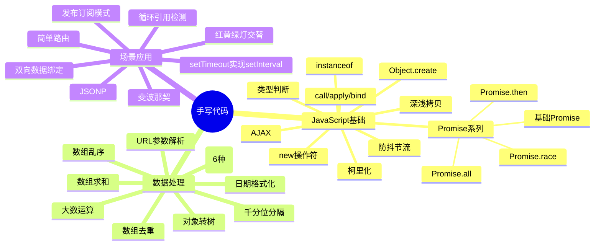
```mermaid
mindmap
  root((手写代码))
    JavaScript基础
      Object.create
      instanceof
      new操作符
      Promise系列
        基础Promise
        Promise.then
        Promise.all
        Promise.race
      防抖节流
      类型判断
      call/apply/bind
      柯里化
      AJAX
      深浅拷贝
   数据处理
      日期格式化
      数组乱序
      数组求和
      数组扁平化(6种)
      数组去重
      千分位分隔
      大数运算
      对象转树
      URL参数解析
   场景应用
      红黄绿灯交替
      发布订阅模式
      双向数据绑定
      简单路由
      斐波那契
      JSONP
      setTimeout实现setInterval
      循环引用检测
```

---

## 一、JavaScript 基础

### 1. 手写 Object.create

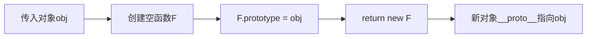
```mermaid
flowchart LR
    A["传入对象obj"] --> B["创建空函数F"]
    B --> C["F.prototype = obj"]
    C --> D["return new F"]
    D --> E["新对象__proto__指向obj"]
```

思路：将传入的对象作为原型

```javascript
function create(obj) {
  function F() {}
  F.prototype = obj
  return new F()
}
```

### 2. 手写 instanceof 方法

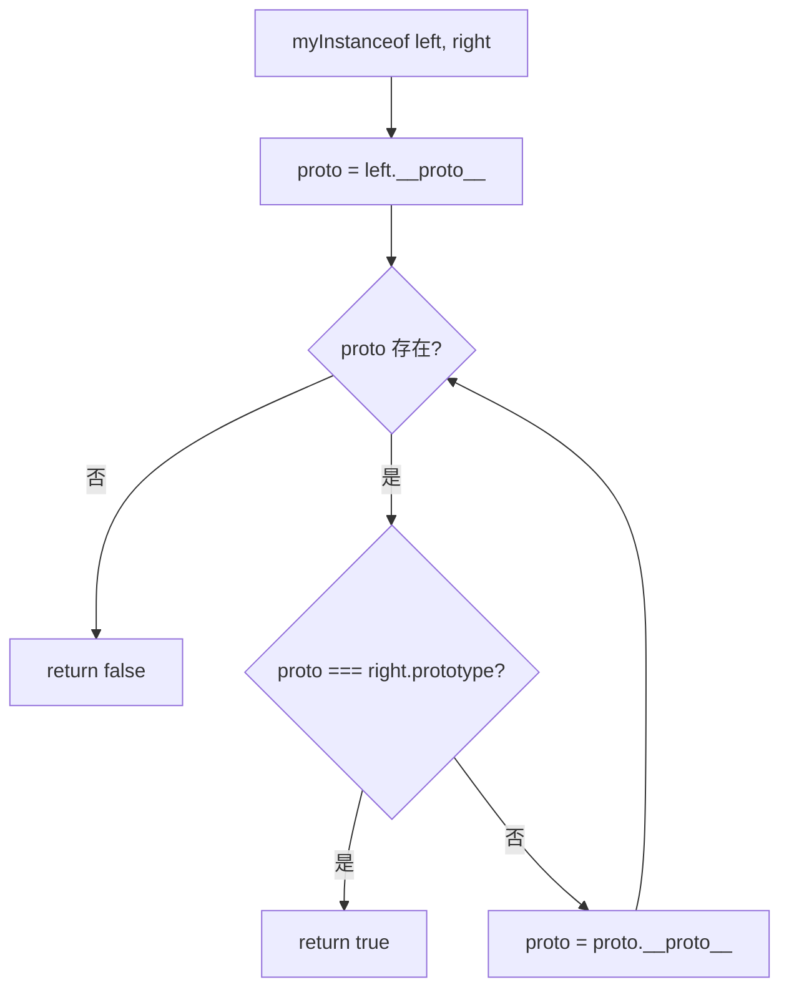
```mermaid
flowchart TD
    A["myInstanceof left, right"] --> B["proto = left.__proto__"]
    B --> C{"proto 存在?"}
    C -->|否| D["return false"]
    C -->|是| E{"proto === right.prototype?"}
    E -->|是| F["return true"]
    E -->|否| G["proto = proto.__proto__"]
    G --> C
```

```javascript
function myInstanceof(left, right) {
  let proto = Object.getPrototypeOf(left),
      prototype = right.prototype;
  while (true) {
    if (!proto) return false;
    if (proto === prototype) return true;
    proto = Object.getPrototypeOf(proto);
  }
}
```

### 3. 手写 new 操作符

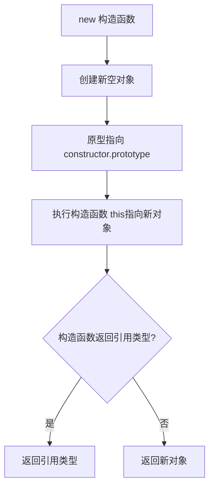
```mermaid
flowchart TD
    A["new 构造函数"] --> B["创建新空对象"]
    B --> C["原型指向 constructor.prototype"]
    C --> D["执行构造函数 this指向新对象"]
    D --> E{"构造函数返回引用类型?"}
    E -->|是| F["返回引用类型"]
    E -->|否| G["返回新对象"]
```

```javascript
function objectFactory() {
  let newObject = null;
  let constructor = Array.prototype.shift.call(arguments);
  let result = null;
  if (typeof constructor !== "function") {
    console.error("type error");
    return;
  }
  newObject = Object.create(constructor.prototype);
  result = constructor.apply(newObject, arguments);
  let flag = result && (typeof result === "object" || typeof result === "function");
  return flag ? result : newObject;
}
```

### 4. 手写 Promise

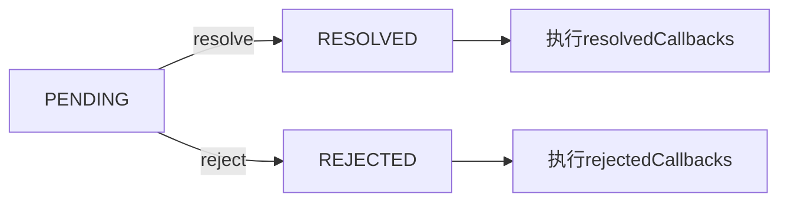
```mermaid
graph LR
    A["PENDING"] -->|resolve| B["RESOLVED"]
    A -->|reject| C["REJECTED"]
    B --> D["执行resolvedCallbacks"]
    C --> E["执行rejectedCallbacks"]
```

```javascript
const PENDING = "pending";
const RESOLVED = "resolved";
const REJECTED = "rejected";

function MyPromise(fn) {
  var self = this;
  this.state = PENDING;
  this.value = null;
  this.resolvedCallbacks = [];
  this.rejectedCallbacks = [];

  function resolve(value) {
    if (value instanceof MyPromise) {
      return value.then(resolve, reject);
    }
    setTimeout(() => {
      if (self.state === PENDING) {
        self.state = RESOLVED;
        self.value = value;
        self.resolvedCallbacks.forEach(callback => {
          callback(value);
        });
      }
    }, 0);
  }

  function reject(value) {
    setTimeout(() => {
      if (self.state === PENDING) {
        self.state = REJECTED;
        self.value = value;
        self.rejectedCallbacks.forEach(callback => {
          callback(value);
        });
      }
    }, 0);
  }

  try {
    fn(resolve, reject);
  } catch (e) {
    reject(e);
  }
}

MyPromise.prototype.then = function(onResolved, onRejected) {
  onResolved = typeof onResolved === "function" ? onResolved : function(value) { return value; };
  onRejected = typeof onRejected === "function" ? onRejected : function(error) { throw error; };

  if (this.state === PENDING) {
    this.resolvedCallbacks.push(onResolved);
    this.rejectedCallbacks.push(onRejected);
  }
  if (this.state === RESOLVED) {
    onResolved(this.value);
  }
  if (this.state === REJECTED) {
    onRejected(this.value);
  }
};
```

### 5. 手写 Promise.then

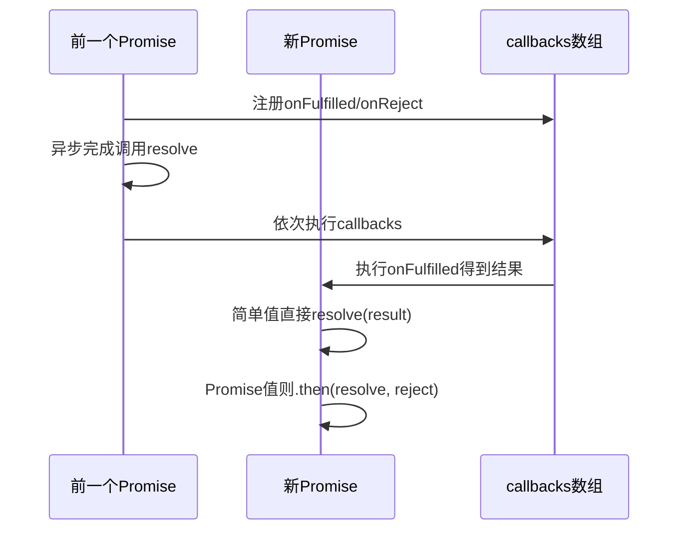
```mermaid
sequenceDiagram
    participant P1 as 前一个Promise
    participant P2 as 新Promise
    participant CB as callbacks数组

    P1->>CB: 注册onFulfilled/onReject
    P1->>P1: 异步完成调用resolve
    P1->>CB: 依次执行callbacks
    CB->>P2: 执行onFulfilled得到结果
    P2->>P2: 简单值直接resolve(result)
    P2->>P2: Promise值则.then(resolve, reject)
```

```javascript
then(onFulfilled, onReject){
    const self = this; 
    return new MyPromise((resolve, reject) => {
      let fulfilled = () => {
        try{
          const result = onFulfilled(self.value);
          return result instanceof MyPromise ? result.then(resolve, reject) : resolve(result);
        }catch(err){
          reject(err)
        }
      }
      let rejected = () => {
        try{
          const result = onReject(self.reason);
          return result instanceof MyPromise ? result.then(resolve, reject) : reject(result);
        }catch(err){
          reject(err)
        }
      }
      switch(self.status){
        case PENDING: 
          self.onFulfilledCallbacks.push(fulfilled);
          self.onRejectedCallbacks.push(rejected);
          break;
        case FULFILLED:
          fulfilled();
          break;
        case REJECT:
          rejected();
          break;
      }
    })
}
```

### 6. 手写 Promise.all

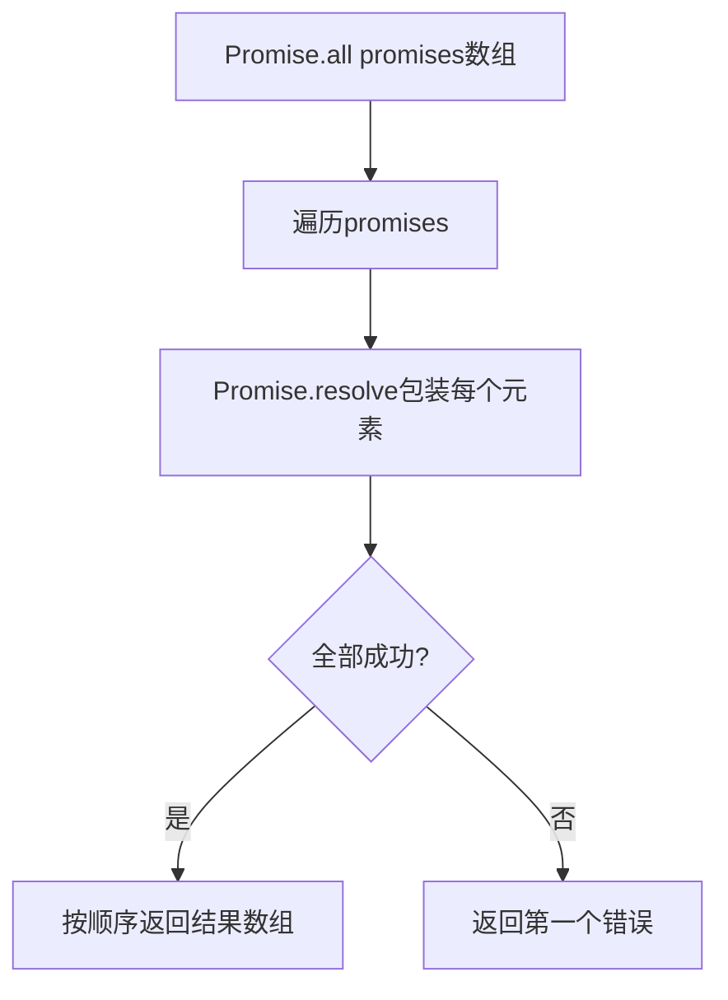
```mermaid
flowchart TD
    A["Promise.all promises数组"] --> B["遍历promises"]
    B --> C["Promise.resolve包装每个元素"]
    C --> D{"全部成功?"}
    D -->|是| E["按顺序返回结果数组"]
    D -->|否| F["返回第一个错误"]
```

```javascript
function promiseAll(promises) {
  return new Promise(function(resolve, reject) {
    if(!Array.isArray(promises)){
        throw new TypeError(`argument must be a array`)
    }
    var resolvedCounter = 0;
    var promiseNum = promises.length;
    var resolvedResult = [];
    for (let i = 0; i < promiseNum; i++) {
      Promise.resolve(promises[i]).then(value=>{
        resolvedCounter++;
        resolvedResult[i] = value;
        if (resolvedCounter == promiseNum) {
            return resolve(resolvedResult)
          }
      },error=>{
        return reject(error)
      })
    }
  })
}
```

### 7. 手写 Promise.race

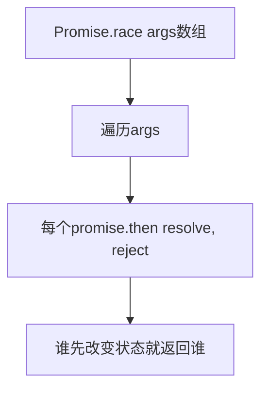
```mermaid
flowchart TD
    A["Promise.race args数组"] --> B["遍历args"]
    B --> C["每个promise.then resolve, reject"]
    C --> D["谁先改变状态就返回谁"]
```

```javascript
Promise.race = function (args) {
  return new Promise((resolve, reject) => {
    for (let i = 0, len = args.length; i < len; i++) {
      args[i].then(resolve, reject)
    }
  })
}
```

### 8. 手写防抖函数

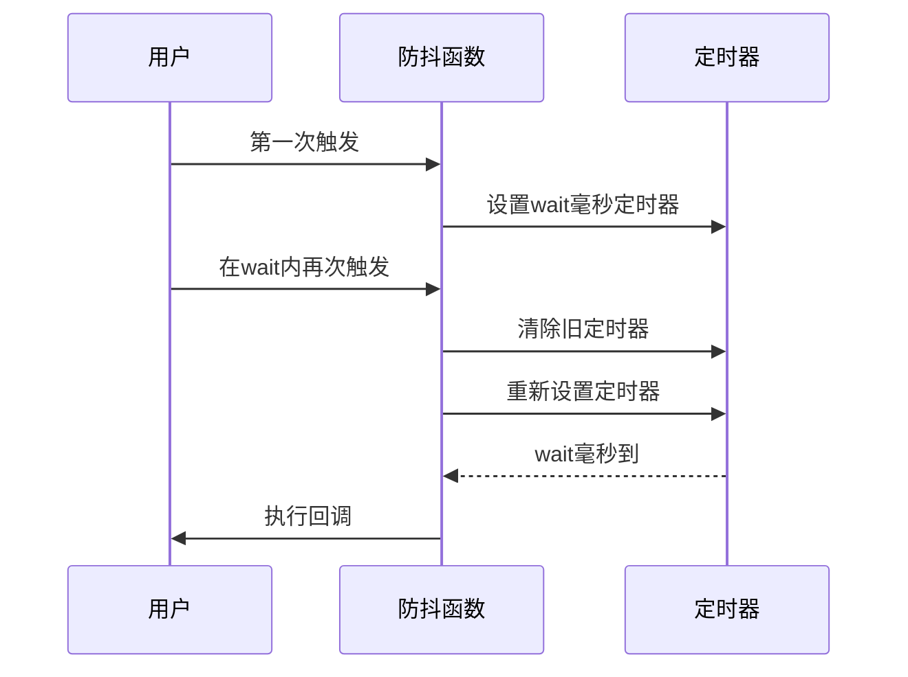
```mermaid
sequenceDiagram
    participant User as 用户
    participant DB as 防抖函数
    participant Timer as 定时器

    User->>DB: 第一次触发
    DB->>Timer: 设置wait毫秒定时器
    User->>DB: 在wait内再次触发
    DB->>Timer: 清除旧定时器
    DB->>Timer: 重新设置定时器
    Timer-->>DB: wait毫秒到
    DB->>User: 执行回调
```

```javascript
function debounce(fn, wait) {
  let timer = null;
  return function() {
    let context = this, args = arguments;
    if (timer) {
      clearTimeout(timer);
      timer = null;
    }
    timer = setTimeout(() => {
      fn.apply(context, args);
    }, wait);
  };
}
```

### 9. 手写节流函数

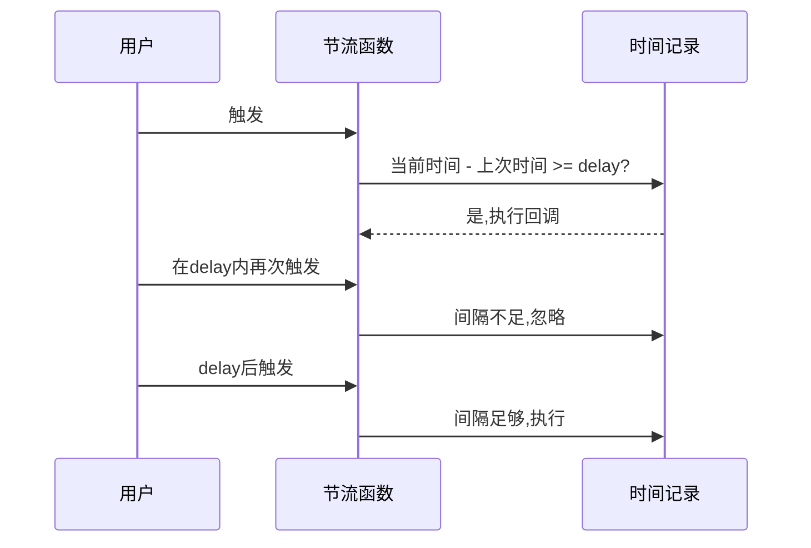
```mermaid
sequenceDiagram
    participant User as 用户
    participant TH as 节流函数
    participant Time as 时间记录

    User->>TH: 触发
    TH->>Time: 当前时间 - 上次时间 >= delay?
    Time-->>TH: 是,执行回调
    User->>TH: 在delay内再次触发
    TH->>Time: 间隔不足,忽略
    User->>TH: delay后触发
    TH->>Time: 间隔足够,执行
```

```javascript
function throttle(fn, delay) {
  let curTime = Date.now();
  return function() {
    let context = this, args = arguments, nowTime = Date.now();
    if (nowTime - curTime >= delay) {
      curTime = Date.now();
      return fn.apply(context, args);
    }
  };
}
```

### 10. 手写类型判断函数

```javascript
function getType(value) {
  if (value === null) {
    return value + "";
  }
  if (typeof value === "object") {
    let valueClass = Object.prototype.toString.call(value),
      type = valueClass.split(" ")[1].split("");
    type.pop();
    return type.join("").toLowerCase();
  } else {
    return typeof value;
  }
}
```

### 11. 手写 call 函数

```javascript
Function.prototype.myCall = function(context) {
  if (typeof this !== "function") {
    console.error("type error");
  }
  let args = [...arguments].slice(1), result = null;
  context = context || window;
  context.fn = this;
  result = context.fn(...args);
  delete context.fn;
  return result;
};
```

### 12. 手写 apply 函数

```javascript
Function.prototype.myApply = function(context) {
  if (typeof this !== "function") {
    throw new TypeError("Error");
  }
  let result = null;
  context = context || window;
  context.fn = this;
  if (arguments[1]) {
    result = context.fn(...arguments[1]);
  } else {
    result = context.fn();
  }
  delete context.fn;
  return result;
};
```

### 13. 手写 bind 函数

```javascript
Function.prototype.myBind = function(context) {
  if (typeof this !== "function") {
    throw new TypeError("Error");
  }
  var args = [...arguments].slice(1), fn = this;
  return function Fn() {
    return fn.apply(
      this instanceof Fn ? this : context,
      args.concat(...arguments)
    );
  };
};
```

### 14. 函数柯里化的实现

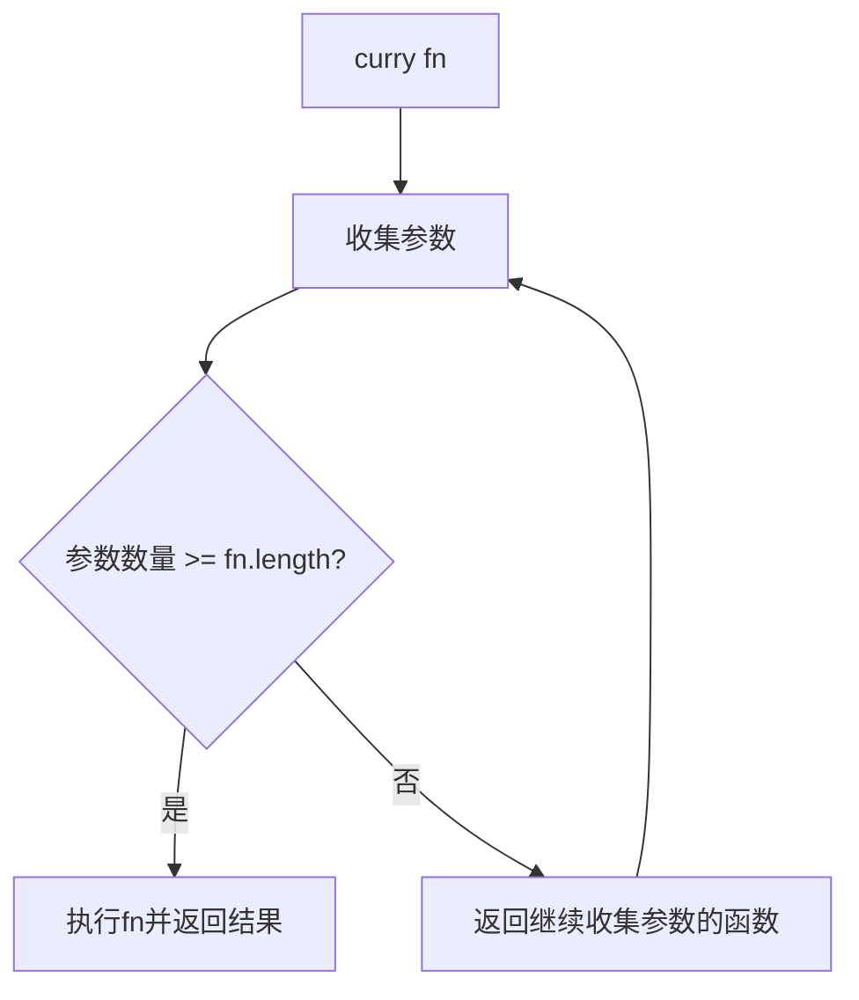
```mermaid
flowchart TD
    A["curry fn"] --> B["收集参数"]
    B --> C{"参数数量 >= fn.length?"}
    C -->|是| D["执行fn并返回结果"]
    C -->|否| E["返回继续收集参数的函数"]
    E --> B
```

```javascript
function curry(fn, args) {
  let length = fn.length;
  args = args || [];
  return function() {
    let subArgs = args.slice(0);
    for (let i = 0; i < arguments.length; i++) {
      subArgs.push(arguments[i]);
    }
    if (subArgs.length >= length) {
      return fn.apply(this, subArgs);
    } else {
      return curry.call(this, fn, subArgs);
    }
  };
}

// es6 实现
function curry(fn, ...args) {
  return fn.length <= args.length ? fn(...args) : curry.bind(null, fn, ...args);
}
```

### 15. 实现AJAX请求

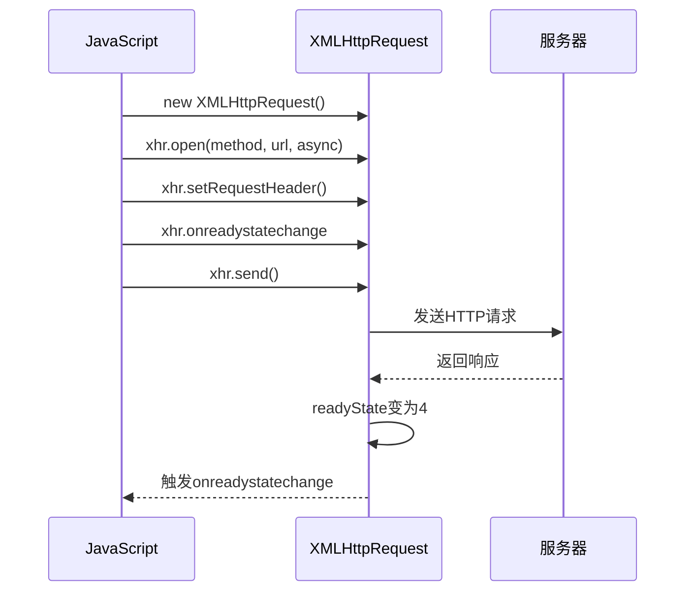
```mermaid
sequenceDiagram
    participant JS as JavaScript
    participant XHR as XMLHttpRequest
    participant Server as 服务器

    JS->>XHR: new XMLHttpRequest()
    JS->>XHR: xhr.open(method, url, async)
    JS->>XHR: xhr.setRequestHeader()
    JS->>XHR: xhr.onreadystatechange
    JS->>XHR: xhr.send()
    XHR->>Server: 发送HTTP请求
    Server-->>XHR: 返回响应
    XHR->>XHR: readyState变为4
    XHR-->>JS: 触发onreadystatechange
```

```javascript
const SERVER_URL = "/server";
let xhr = new XMLHttpRequest();
xhr.open("GET", SERVER_URL, true);
xhr.onreadystatechange = function() {
  if (this.readyState !== 4) return;
  if (this.status === 200) {
    handle(this.response);
  } else {
    console.error(this.statusText);
  }
};
xhr.onerror = function() {
  console.error(this.statusText);
};
xhr.responseType = "json";
xhr.setRequestHeader("Accept", "application/json");
xhr.send(null);
```

### 16. 使用Promise封装AJAX请求

```javascript
function getJSON(url) {
  let promise = new Promise(function(resolve, reject) {
    let xhr = new XMLHttpRequest();
    xhr.open("GET", url, true);
    xhr.onreadystatechange = function() {
      if (this.readyState !== 4) return;
      if (this.status === 200) {
        resolve(this.response);
      } else {
        reject(new Error(this.statusText));
      }
    };
    xhr.onerror = function() {
      reject(new Error(this.statusText));
    };
    xhr.responseType = "json";
    xhr.setRequestHeader("Accept", "application/json");
    xhr.send(null);
  });
  return promise;
}
```

### 17. 实现浅拷贝

```javascript
function shallowCopy(object) {
  if (!object || typeof object !== "object") return;
  let newObject = Array.isArray(object) ? [] : {};
  for (let key in object) {
    if (object.hasOwnProperty(key)) {
      newObject[key] = object[key];
    }
  }
  return newObject;
}
```

### 18. 实现深拷贝

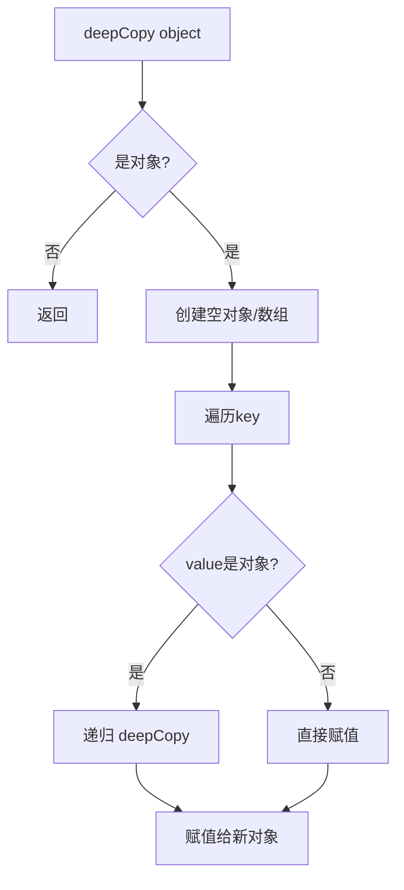
```mermaid
flowchart TD
    A["deepCopy object"] --> B{"是对象?"}
    B -->|否| C["返回"]
    B -->|是| D["创建空对象/数组"]
    D --> E["遍历key"]
    E --> F{"value是对象?"}
    F -->|否| G["直接赋值"]
    F -->|是| H["递归 deepCopy"]
    H --> I["赋值给新对象"]
    G --> I
```

```javascript
function deepCopy(object) {
  if (!object || typeof object !== "object") return;
  let newObject = Array.isArray(object) ? [] : {};
  for (let key in object) {
    if (object.hasOwnProperty(key)) {
      newObject[key] =
        typeof object[key] === "object" ? deepCopy(object[key]) : object[key];
    }
  }
  return newObject;
}
```

### 19. 实现sleep函数

```javascript
function timeout(delay) {
  return new Promise(resolve => {
    setTimeout(resolve, delay)
  })
};
```

---

## 二、数据处理

### 1. 实现日期格式化函数

```javascript
const dateFormat = (dateInput, format)=>{
    var day = dateInput.getDate() 
    var month = dateInput.getMonth() + 1  
    var year = dateInput.getFullYear()   
    format = format.replace(/yyyy/, year)
    format = format.replace(/MM/,month)
    format = format.replace(/dd/,day)
    return format
}
```

### 2. 交换a,b的值，不能用临时变量

```javascript
a = a + b
b = a - b
a = a - b
```

### 3. 实现数组的乱序输出（Fisher-Yates洗牌算法）

```javascript
var arr = [1,2,3,4,5,6,7,8,9,10];
for (var i = 0; i < arr.length; i++) {
  const randomIndex = Math.round(Math.random() * (arr.length - 1 - i)) + i;
  [arr[i], arr[randomIndex]] = [arr[randomIndex], arr[i]];
}
```

### 4. 实现数组扁平化（6种方法）

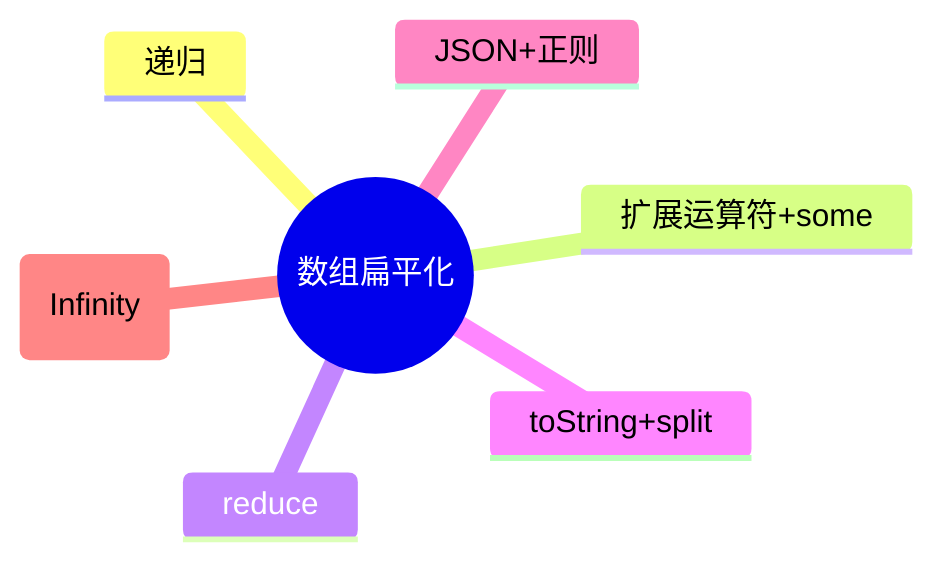
```mermaid
mindmap
  root((数组扁平化))
    递归
    扩展运算符+some
    reduce
    toString+split
    JSON+正则
    ES6 flat(Infinity)
```

```javascript
// 1. 递归
function flatten(arr) {
  let result = [];
  for(let i = 0; i < arr.length; i++) {
    if(Array.isArray(arr[i])) {
      result = result.concat(flatten(arr[i]));
    } else {
      result.push(arr[i]);
    }
  }
  return result;
}

// 2. reduce
function flatten(arr) {
    return arr.reduce(function(prev, next){
        return prev.concat(Array.isArray(next) ? flatten(next) : next)
    }, [])
}

// 3. 扩展运算符
function flatten(arr) {
    while (arr.some(item => Array.isArray(item))) {
        arr = [].concat(...arr);
    }
    return arr;
}

// 4. toString + split
function flatten(arr) {
    return arr.toString().split(',');
}

// 5. ES6 flat
function flatten(arr) {
  return arr.flat(Infinity);
}

// 6. JSON + 正则
function flatten(arr) {
  let str = JSON.stringify(arr);
  str = str.replace(/(\[|\])/g, '');
  str = '[' + str + ']';
  return JSON.parse(str); 
}
```

### 5. 实现数组去重

```javascript
// ES6
Array.from(new Set(array));

// ES5
function uniqueArray(array) {
  let map = {};
  let res = [];
  for(var i = 0; i < array.length; i++) {
    if(!map.hasOwnProperty([array[i]])) {
      map[array[i]] = 1;
      res.push(array[i]);
    }
  }
  return res;
}
```

### 6. 将数字每千分位用逗号隔开

```javascript
let format = n => {
    let num = n.toString()
    let decimals = ''
    num.indexOf('.') > -1 ? decimals = num.split('.')[1] : decimals
    let len = num.length
    if (len <= 3) {
        return num
    } else {
        let temp = ''
        let remainder = len % 3
        decimals ? temp = '.' + decimals : temp
        if (remainder > 0) {
            return num.slice(0, remainder) + ',' + num.slice(remainder, len).match(/\d{3}/g).join(',') + temp
        } else {
            return num.slice(0, len).match(/\d{3}/g).join(',') + temp 
        }
    }
}
```

### 7. 将js对象转化为树形结构

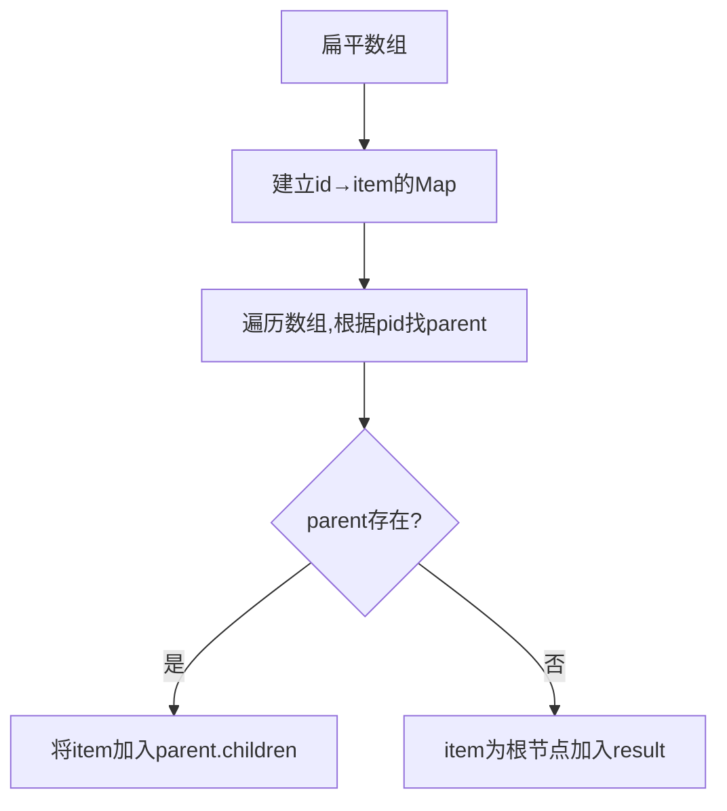
```mermaid
flowchart TD
    A["扁平数组"] --> B["建立id→item的Map"]
    B --> C["遍历数组,根据pid找parent"]
    C --> D{"parent存在?"}
    D -->|是| E["将item加入parent.children"]
    D -->|否| F["item为根节点加入result"]
```

```javascript
function jsonToTree(data) {
  let result = []
  if(!Array.isArray(data)) {
    return result
  }
  let map = {};
  data.forEach(item => {
    map[item.id] = item;
  });
  data.forEach(item => {
    let parent = map[item.pid];
    if(parent) {
      (parent.children || (parent.children = [])).push(item);
    } else {
      result.push(item);
    }
  });
  return result;
}
```

### 8. 解析 URL Params 为对象

```javascript
function parseParam(url) {
  const paramsStr = /.+\?(.+)$/.exec(url)[1];
  const paramsArr = paramsStr.split('&');
  let paramsObj = {};
  paramsArr.forEach(param => {
    if (/=/.test(param)) {
      let [key, val] = param.split('=');
      val = decodeURIComponent(val);
      val = /^\d+$/.test(val) ? parseFloat(val) : val;
      if (paramsObj.hasOwnProperty(key)) {
        paramsObj[key] = [].concat(paramsObj[key], val);
      } else {
        paramsObj[key] = val;
      }
    } else {
      paramsObj[param] = true;
    }
  })
  return paramsObj;
}
```

---

## 三、场景应用

### 1. 循环打印红黄绿

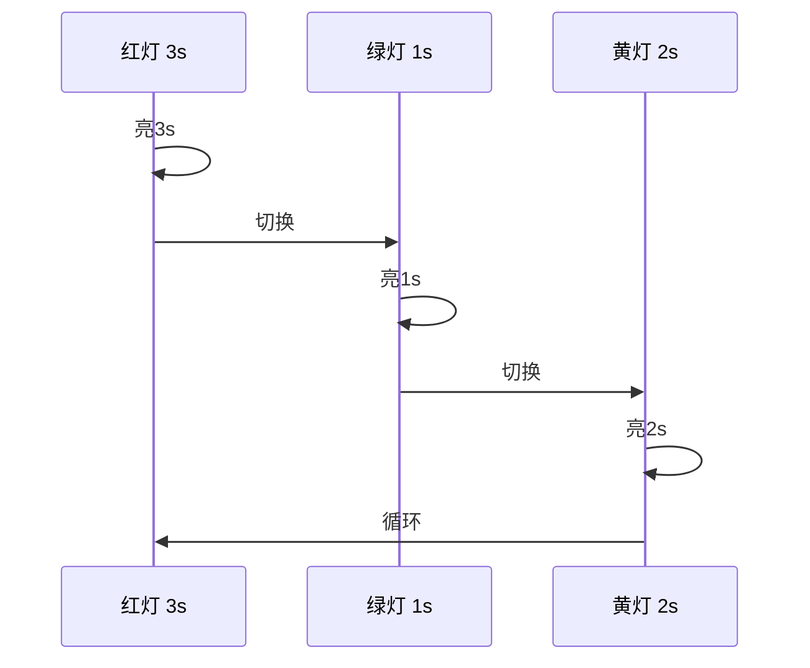
```mermaid
sequenceDiagram
    participant R as 红灯 3s
    participant G as 绿灯 1s  
    participant Y as 黄灯 2s

    R->>R: 亮3s
    R->>G: 切换
    G->>G: 亮1s
    G->>Y: 切换
    Y->>Y: 亮2s
    Y->>R: 循环
```

```javascript
function red() { console.log('red'); }
function green() { console.log('green'); }
function yellow() { console.log('yellow'); }

// callback 实现
const task = (timer, light, callback) => {
    setTimeout(() => {
        if (light === 'red') red()
        else if (light === 'green') green()
        else if (light === 'yellow') yellow()
        callback()
    }, timer)
}
const step = () => {
    task(3000, 'red', () => {
        task(2000, 'green', () => {
            task(1000, 'yellow', step)
        })
    })
}
step()

// Promise 实现
const task2 = (timer, light) => 
    new Promise((resolve, reject) => {
        setTimeout(() => {
            if (light === 'red') red()
            else if (light === 'green') green()
            else if (light === 'yellow') yellow()
            resolve()
        }, timer)
    })
const step2 = () => {
    task2(3000, 'red')
        .then(() => task2(2000, 'green'))
        .then(() => task2(2100, 'yellow'))
        .then(step2)
}
step2()

// async/await 实现
const taskRunner =  async () => {
    await task2(3000, 'red')
    await task2(2000, 'green')
    await task2(2100, 'yellow')
    taskRunner()
}
taskRunner()
```

### 2. 实现发布-订阅模式

```javascript
class EventCenter{
  let handlers = {}

  addEventListener(type, handler) {
    if (!this.handlers[type]) {
      this.handlers[type] = []
    }
    this.handlers[type].push(handler)
  }

  dispatchEvent(type, params) {
    if (!this.handlers[type]) {
      return new Error('该事件未注册')
    }
    this.handlers[type].forEach(handler => {
      handler(...params)
    })
  }

  removeEventListener(type, handler) {
    if (!this.handlers[type]) {
      return new Error('事件无效')
    }
    if (!handler) {
      delete this.handlers[type]
    } else {
      const index = this.handlers[type].findIndex(el => el === handler)
      if (index === -1) {
        return new Error('无该绑定事件')
      }
      this.handlers[type].splice(index, 1)
      if (this.handlers[type].length === 0) {
        delete this.handlers[type]
      }
    }
  }
}
```

### 3. 实现双向数据绑定

```javascript
let obj = {}
let input = document.getElementById('input')
let span = document.getElementById('span')
Object.defineProperty(obj, 'text', {
  configurable: true,
  enumerable: true,
  get() {
    console.log('获取数据了')
  },
  set(newVal) {
    console.log('数据更新了')
    input.value = newVal
    span.innerHTML = newVal
  }
})
input.addEventListener('keyup', function(e) {
  obj.text = e.target.value
})
```

### 4. 使用 setTimeout 实现 setInterval

```javascript
function mySetInterval(fn, timeout) {
  var timer = { flag: true };
  function interval() {
    if (timer.flag) {
      fn();
      setTimeout(interval, timeout);
    }
  }
  setTimeout(interval, timeout);
  return timer;
}
```

### 5. 实现 jsonp

```javascript
function addScript(src) {
  const script = document.createElement('script');
  script.src = src;
  script.type = "text/javascript";
  document.body.appendChild(script);
}
addScript("http://xxx.xxx.com/xxx.js?callback=handleRes");
function handleRes(res) {
  console.log(res);
}
```

### 6. 判断对象是否存在循环引用

```javascript
const isCycleObject = (obj,parent) => {
    const parentArr = parent || [obj];
    for(let i in obj) {
        if(typeof obj[i] === 'object') {
            let flag = false;
            parentArr.forEach((pObj) => {
                if(pObj === obj[i]){ flag = true; }
            })
            if(flag) return true;
            flag = isCycleObject(obj[i],[...parentArr,obj[i]]);
            if(flag) return true;
        }
    }
    return false;
}
```

---

## 四、现代 Promise 方法

### 1. 手写 Promise.allSettled

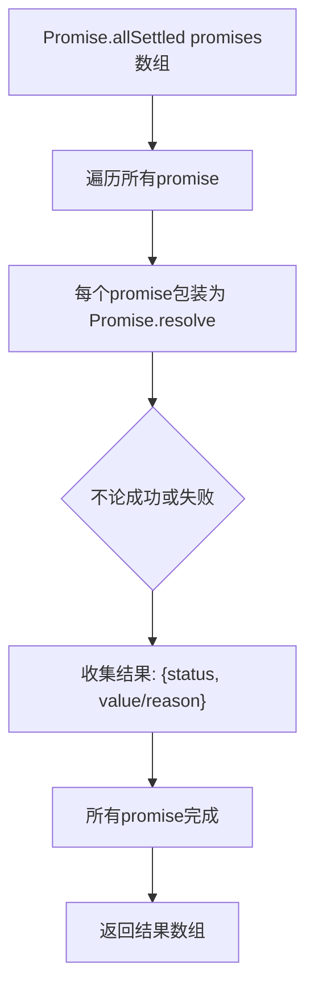
```mermaid
flowchart TD
    A["Promise.allSettled promises数组"] --> B["遍历所有promise"]
    B --> C["每个promise包装为 Promise.resolve"]
    C --> D{"不论成功或失败"}
    D --> E["收集结果: {status, value/reason}"]
    E --> F["所有promise完成"]
    F --> G["返回结果数组"]
```

`Promise.allSettled` 与 `Promise.all` 的区别：
- `all`：一个失败则整体失败，返回第一个错误
- `allSettled`：等待所有结束，无论成功失败都收集结果

```javascript
function promiseAllSettled(promises) {
  return Promise.all(
    promises.map(p =>
      Promise.resolve(p).then(
        value => ({ status: 'fulfilled', value }),
        reason => ({ status: 'rejected', reason })
      )
    )
  )
}
```

### 2. 手写 Promise.any

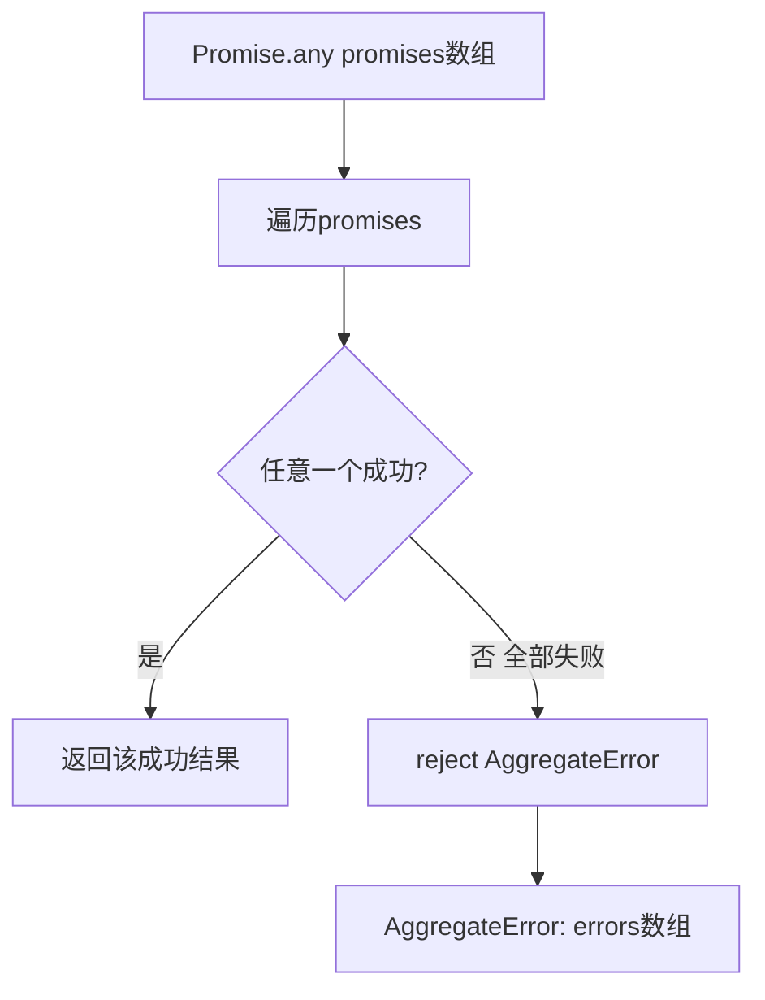
```mermaid
flowchart TD
    A["Promise.any promises数组"] --> B["遍历promises"]
    B --> C{"任意一个成功?"}
    C -->|是| D["返回该成功结果"]
    C -->|否 全部失败| E["reject AggregateError"]
    E --> F["AggregateError: errors数组"]
```

`Promise.any` 与 `Promise.race` 的区别：
- `race`：第一个定论的 Promise（可能是 reject）
- `any`：第一个 fulfilled 的 Promise；如果全部 reject，则 reject 一个 `AggregateError`

```javascript
function promiseAny(promises) {
  return new Promise((resolve, reject) => {
    let rejectedCount = 0
    const errors = []
    const len = promises.length
    if (len === 0) {
      return reject(new AggregateError([], 'All promises were rejected'))
    }
    promises.forEach((p, i) => {
      Promise.resolve(p).then(
        value => resolve(value),
        reason => {
          errors[i] = reason
          rejectedCount++
          if (rejectedCount === len) {
            reject(new AggregateError(errors, 'All promises were rejected'))
          }
        }
      )
    })
  })
}
```

### 3. 手写 Promise.withResolvers

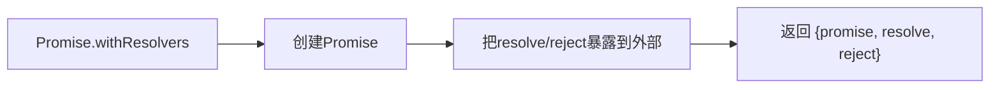
```mermaid
flowchart LR
    A["Promise.withResolvers"] --> B["创建Promise"]
    B --> C["把resolve/reject暴露到外部"]
    C --> D["返回 {promise, resolve, reject}"]
```

`Promise.withResolvers` 让你可以在 Promise 外部控制其状态，避免嵌套闭包。

```javascript
function promiseWithResolvers() {
  let resolve, reject
  const promise = new Promise((res, rej) => {
    resolve = res
    reject = rej
  })
  return { promise, resolve, reject }
}

// 使用场景：事件驱动的异步
// const { promise, resolve } = promiseWithResolvers()
// button.onclick = () => resolve('clicked')
// await promise  // 等待按钮点击
```

---

## 五、现代 JavaScript 手写

### 1. 手写 structuredClone（简化版）

```javascript
function structuredClone(obj, weakMap = new WeakMap()) {
  if (obj === null || typeof obj !== 'object') return obj

  if (weakMap.has(obj)) return weakMap.get(obj)

  let clone
  if (obj instanceof Date) {
    clone = new Date(obj.getTime())
  } else if (obj instanceof RegExp) {
    clone = new RegExp(obj.source, obj.flags)
  } else if (obj instanceof Map) {
    clone = new Map()
    weakMap.set(obj, clone)
    obj.forEach((val, key) => clone.set(key, structuredClone(val, weakMap)))
    return clone
  } else if (obj instanceof Set) {
    clone = new Set()
    weakMap.set(obj, clone)
    obj.forEach(val => clone.add(structuredClone(val, weakMap)))
    return clone
  } else if (Array.isArray(obj)) {
    clone = []
    weakMap.set(obj, clone)
    obj.forEach((item, i) => clone[i] = structuredClone(item, weakMap))
    return clone
  } else {
    clone = Object.create(Object.getPrototypeOf(obj))
    weakMap.set(obj, clone)
    const allKeys = [...Object.keys(obj), ...Object.getOwnPropertySymbols(obj)]
    allKeys.forEach(key => {
      clone[key] = structuredClone(obj[key], weakMap)
    })
    return clone
  }
}
```

### 2. 手写 LRU Cache（最近最少使用缓存）

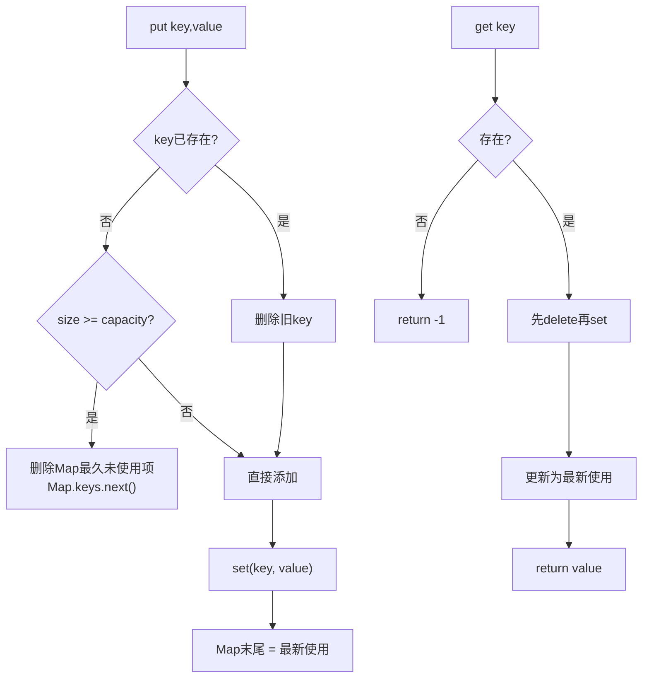
```mermaid
flowchart TD
    A["put key,value"] --> B{"key已存在?"}
    B -->|是| C["删除旧key"]
    B -->|否| D{"size >= capacity?"}
    D -->|是| E["删除Map最久未使用项<br>Map.keys.next()"]
    D -->|否| F["直接添加"]
    C --> F
    F --> G["set(key, value)"]
    G --> H["Map末尾 = 最新使用"]

    I["get key"] --> J{"存在?"}
    J -->|否| K["return -1"]
    J -->|是| L["先delete再set"]
    L --> M["更新为最新使用"]
    M --> N["return value"]
```

利用 Map 的迭代顺序（插入顺序），每次访问时先删后加，让最近使用的项保持在末尾。

```javascript
class LRUCache {
  constructor(capacity) {
    this.capacity = capacity
    this.map = new Map()
  }

  get(key) {
    if (!this.map.has(key)) return -1
    const value = this.map.get(key)
    this.map.delete(key)
    this.map.set(key, value)
    return value
  }

  put(key, value) {
    if (this.map.has(key)) {
      this.map.delete(key)
    } else if (this.map.size >= this.capacity) {
      const oldest = this.map.keys().next().value
      this.map.delete(oldest)
    }
    this.map.set(key, value)
  }
}
```

### 3. 手写 compose 和 pipe

```mermaid
flowchart LR
    subgraph compose [compose 从右到左]
        A["x"] --> B["fn"]
        B --> C["g"]
        C --> D["h"]
        D --> E["结果"]
    end
    subgraph pipe [pipe 从左到右]
        F["x"] --> G["h"]
        G --> H["g"]
        H --> I["fn"]
        I --> J["结果"]
    end
```

```javascript
// compose: 从右到左组合函数
const compose = (...fns) =>
  fns.reduce((a, b) =>
    (...args) => a(b(...args))
  )

// pipe: 从左到右组合函数
const pipe = (...fns) =>
  fns.reduce((a, b) =>
    (...args) => b(a(...args))
  )

// 使用
// const add1 = x => x + 1
// const double = x => x * 2
// compose(double, add1)(3)  // double(add1(3)) = 8
// pipe(add1, double)(3)     // double(add1(3)) = 8
```

### 4. 手写 once 函数

```javascript
function once(fn) {
  let called = false
  let result
  return function(...args) {
    if (!called) {
      called = true
      result = fn.apply(this, args)
    }
    return result
  }
}

// 使用
// const init = once(() => { console.log('init once'); return 42 })
// init()  // 'init once' → 42
// init()  // 42 (不再执行)
```

### 5. 手写 memoize 函数

```javascript
function memoize(fn, resolver) {
  const cache = new Map()
  return function(...args) {
    const key = resolver ? resolver(...args) : args[0]
    if (cache.has(key)) return cache.get(key)
    const result = fn.apply(this, args)
    cache.set(key, result)
    return result
  }
}

// 使用
// const fib = memoize(n => n <= 1 ? n : fib(n - 1) + fib(n - 2))
```

### 6. 手写 Array.prototype.flatMap

```mermaid
flowchart LR
    A["arr"] --> B["map(fn)"]
    B --> C["[[1,2],[3,4]]]
    C --> D["flat一层"]
    D --> E["[1,2,3,4"]]
```

```javascript
function flatMap(arr, callback, thisArg) {
  return arr.reduce((acc, item, index) => {
    const mapped = callback.call(thisArg, item, index, arr)
    return acc.concat(mapped)
  }, [])
}

// flatMap = map + flat(1)
// [1, 2, 3].flatMap(x => [x, x * 2])
// → [1, 2, 2, 4, 3, 6]
```

### 7. 手写 Object.groupBy

```javascript
function groupBy(items, keyFn) {
  return items.reduce((result, item) => {
    const key = keyFn(item)
    if (!result[key]) result[key] = []
    result[key].push(item)
    return result
  }, Object.create(null))
}

// 使用
// const inventory = [
//   { name: 'apple', type: 'fruit' },
//   { name: 'carrot', type: 'vegetable' },
//   { name: 'banana', type: 'fruit' },
// ]
// groupBy(inventory, item => item.type)
// → { fruit: [{name:'apple'},{name:'banana'}], vegetable: [{name:'carrot'}] }
```

### 8. 手写 Promise.retry（失败重试）

```javascript
function promiseRetry(fn, maxRetries = 3, delay = 300) {
  return new Promise((resolve, reject) => {
    const attempt = (n) => {
      fn().then(resolve).catch(err => {
        if (n === 0) return reject(err)
        setTimeout(() => attempt(n - 1), delay)
      })
    }
    attempt(maxRetries)
  })
}

// 使用
// promiseRetry(() => fetch('/api/data'), 3, 500)
//   .then(console.log)
//   .catch(console.error)
```

---

## 六、算法与数据结构

### 1. 排序算法

```mermaid
flowchart TD
    subgraph 快速排序
        Q1["选基准pivot"] --> Q2["小于基准放左,大于放右"]
        Q2 --> Q3["递归左右分区"]
    end
    subgraph 归并排序
        M1["数组一分为二"] --> M2["递归排序左右"]
        M2 --> M3["合并两个有序数组"]
    end
    subgraph 冒泡排序
        B1["从头开始两两比较"] --> B2["大数逐步上浮到末尾"]
        B2 --> B3["每轮确定一个最大值"]
    end
```

| 算法 | 平均时间复杂度 | 最坏时间复杂度 | 空间复杂度 | 稳定性 |
|------|:-:|:-:|:-:|:-:|
| **快速排序** | O(n log n) | O(n²) | O(log n) | 不稳定 |
| **归并排序** | O(n log n) | O(n log n) | O(n) | 稳定 |
| **冒泡排序** | O(n²) | O(n²) | O(1) | 稳定 |

```javascript
// 快速排序
function quickSort(arr) {
  if (arr.length <= 1) return arr
  const pivot = arr[0]
  const left = [], right = []
  for (let i = 1; i < arr.length; i++) {
    arr[i] < pivot ? left.push(arr[i]) : right.push(arr[i])
  }
  return [...quickSort(left), pivot, ...quickSort(right)]
}

// 归并排序
function mergeSort(arr) {
  if (arr.length <= 1) return arr
  const mid = Math.floor(arr.length / 2)
  const left = mergeSort(arr.slice(0, mid))
  const right = mergeSort(arr.slice(mid))
  return merge(left, right)
}
function merge(left, right) {
  const result = []
  let i = 0, j = 0
  while (i < left.length && j < right.length) {
    result.push(left[i] <= right[j] ? left[i++] : right[j++])
  }
  return result.concat(left.slice(i)).concat(right.slice(j))
}

// 冒泡排序
function bubbleSort(arr) {
  const len = arr.length
  for (let i = 0; i < len - 1; i++) {
    let swapped = false
    for (let j = 0; j < len - 1 - i; j++) {
      if (arr[j] > arr[j + 1]) {
        [arr[j], arr[j + 1]] = [arr[j + 1], arr[j]]
        swapped = true
      }
    }
    if (!swapped) break
  }
  return arr
}
```

### 2. 二分查找

```javascript
function binarySearch(arr, target) {
  let left = 0, right = arr.length - 1
  while (left <= right) {
    const mid = left + ((right - left) >> 1)
    if (arr[mid] === target) return mid
    if (arr[mid] < target) left = mid + 1
    else right = mid - 1
  }
  return -1
}
```

### 3. 防抖节流增强版

```javascript
// 防抖（支持 leading + trailing）
function debounce(fn, wait, options = {}) {
  const { leading = false, trailing = true } = options
  let timer, lastArgs, lastThis

  function invoke() {
    if (timer) {
      clearTimeout(timer)
      timer = null
    }
    if (lastArgs) {
      fn.apply(lastThis, lastArgs)
      lastArgs = lastThis = null
    }
  }

  return function(...args) {
    if (!timer && leading) {
      fn.apply(this, args)
    } else {
      lastArgs = args
      lastThis = this
    }
    if (timer) clearTimeout(timer)
    timer = setTimeout(() => {
      timer = null
      if (trailing && lastArgs) invoke()
    }, wait)
  }
}

// 节流（支持 leading + trailing）
function throttle(fn, delay, options = {}) {
  const { leading = true, trailing = true } = options
  let lastTime = 0, timer, lastArgs, lastThis

  function invoke() {
    lastTime = Date.now()
    timer = null
    if (lastArgs) {
      fn.apply(lastThis, lastArgs)
      lastArgs = lastThis = null
    }
  }

  return function(...args) {
    const now = Date.now()
    if (!lastTime && !leading) lastTime = now
    const remaining = delay - (now - lastTime)

    if (remaining <= 0) {
      if (timer) { clearTimeout(timer); timer = null }
      lastTime = now
      fn.apply(this, args)
      if (!timer && lastArgs) invoke()
    } else if (!timer && trailing) {
      lastArgs = args
      lastThis = this
      timer = setTimeout(invoke, remaining)
    }
  }
}
```

### 4. 手写 EventEmitter（发布订阅）

```mermaid
flowchart LR
    A["eventEmitter.on event, handler"] --> B["存入handlersMap"]
    C["eventEmitter.emit event, data"] --> D["取出 handlersMap 中的 event 列表"]
    D --> E["依次执行所有handler"]
    F["eventEmitter.off event, handler"] --> G["从handlersMap移除handler"]
    H["eventEmitter.once event, handler"] --> I["包装为临时函数<br>执行后自动off"]
```

```javascript
class EventEmitter {
  constructor() {
    this._handlers = new Map()
  }

  on(event, handler) {
    if (!this._handlers.has(event)) {
      this._handlers.set(event, [])
    }
    this._handlers.get(event).push(handler)
    return this
  }

  off(event, handler) {
    if (!this._handlers.has(event)) return this
    if (!handler) {
      this._handlers.delete(event)
      return this
    }
    const handlers = this._handlers.get(event)
    const idx = handlers.indexOf(handler)
    if (idx !== -1) handlers.splice(idx, 1)
    if (handlers.length === 0) this._handlers.delete(event)
    return this
  }

  emit(event, ...args) {
    if (!this._handlers.has(event)) return false
    this._handlers.get(event).forEach(handler => {
      handler(...args)
    })
    return true
  }

  once(event, handler) {
    const wrapper = (...args) => {
      handler(...args)
      this.off(event, wrapper)
    }
    this.on(event, wrapper)
    return this
  }
}
```

### 5. 手写 Promise 控制并发

```javascript
class PromisePool {
  constructor(maxConcurrency) {
    this.maxConcurrency = maxConcurrency
    this.queue = []
    this.activeCount = 0
  }

  add(fn) {
    return new Promise((resolve, reject) => {
      this.queue.push({ fn, resolve, reject })
      this.run()
    })
  }

  run() {
    while (this.activeCount < this.maxConcurrency && this.queue.length > 0) {
      const { fn, resolve, reject } = this.queue.shift()
      this.activeCount++
      Promise.resolve(fn())
        .then(resolve, reject)
        .finally(() => {
          this.activeCount--
          this.run()
        })
    }
  }
}

// 使用
// const pool = new PromisePool(3)
// const urls = [url1, url2, url3, url4, url5, url6]
// urls.forEach(url => pool.add(() => fetch(url)))
```

### 6. 手写深拷贝（完整版）

```javascript
function deepClone(obj, weakMap = new WeakMap()) {
  if (obj === null || typeof obj !== 'object') return obj
  if (weakMap.has(obj)) return weakMap.get(obj)

  let clone
  if (obj instanceof Date) clone = new Date(obj.getTime())
  else if (obj instanceof RegExp) clone = new RegExp(obj.source, obj.flags)
  else if (obj instanceof Map) {
    clone = new Map()
    weakMap.set(obj, clone)
    obj.forEach((val, key) => clone.set(deepClone(key, weakMap), deepClone(val, weakMap)))
    return clone
  } else if (obj instanceof Set) {
    clone = new Set()
    weakMap.set(obj, clone)
    obj.forEach(val => clone.add(deepClone(val, weakMap)))
    return clone
  } else {
    clone = Object.create(Object.getPrototypeOf(obj))
    weakMap.set(obj, clone)
    const allKeys = [
      ...Object.getOwnPropertyNames(obj),
      ...Object.getOwnPropertySymbols(obj)
    ]
    allKeys.forEach(key => {
      clone[key] = deepClone(obj[key], weakMap)
    })
    return clone
  }
}
```

### 7. 手写 Virtual DOM

```javascript
// h 函数：创建 VNode
function h(tag, props, ...children) {
  return {
    tag,
    props: props || {},
    children: children.flat()
  }
}

// 渲染 VNode 到真实 DOM
function render(vnode, container) {
  const el = document.createElement(vnode.tag)

  for (const [key, val] of Object.entries(vnode.props)) {
    if (key.startsWith('on')) {
      el.addEventListener(key.slice(2).toLowerCase(), val)
    } else {
      el.setAttribute(key, val)
    }
  }

  for (const child of vnode.children) {
    if (typeof child === 'string' || typeof child === 'number') {
      el.appendChild(document.createTextNode(child))
    } else {
      render(child, el)
    }
  }

  container.appendChild(el)
  return el
}

// 使用
// const vdom = h('div', { id: 'app', onClick: () => alert('click') },
//   h('h1', {}, 'Hello Virtual DOM'),
//   h('p', {}, 'This is a VDOM demo')
// )
// render(vdom, document.getElementById('root'))
```

### 8. 手写 JSON.stringify（简化版）

```javascript
function myStringify(data) {
  const type = typeof data

  // 基本类型
  if (type === 'string') return `"${data}"`
  if (type === 'number') return isNaN(data) ? 'null' : String(data)
  if (type === 'boolean') return String(data)
  if (type === 'bigint') throw new TypeError('Do not know how to serialize a BigInt')
  if (type === 'symbol' || type === 'undefined' || type === 'function') {
    return undefined  // JSON.stringify 会忽略或返回 undefined
  }
  if (data === null) return 'null'
  if (data instanceof Date) return `"${data.toISOString()}"`

  // 有 toJSON 方法
  if (typeof data.toJSON === 'function') return myStringify(data.toJSON())

  // 数组
  if (Array.isArray(data)) {
    const arr = data.map(item =>
      typeof item === 'undefined' || typeof item === 'symbol' || typeof item === 'function'
        ? 'null' : myStringify(item)
    )
    return `[${arr.join(',')}]`
  }

  // 普通对象
  const keys = Object.keys(data).filter(
    key => typeof data[key] !== 'function' && typeof data[key] !== 'symbol' && data[key] !== undefined
  )
  const pairs = keys.map(key => `"${key}":${myStringify(data[key])}`)
  return `{${pairs.join(',')}}`
}
```
