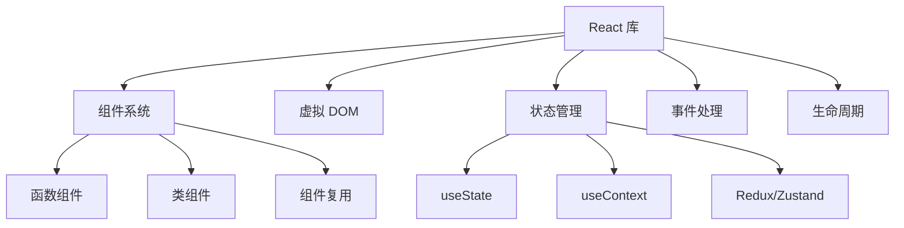
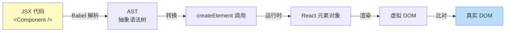
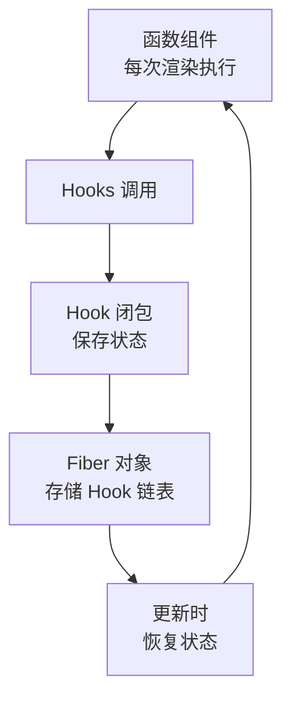
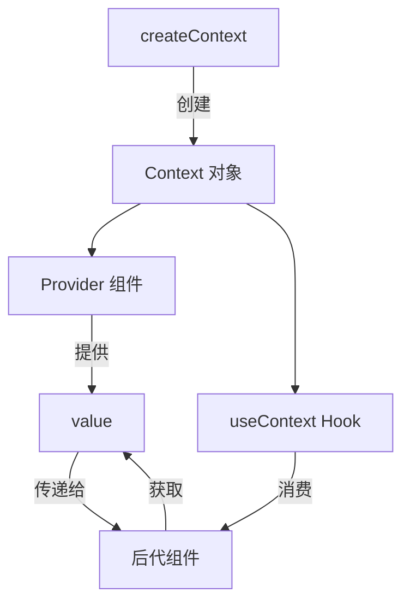
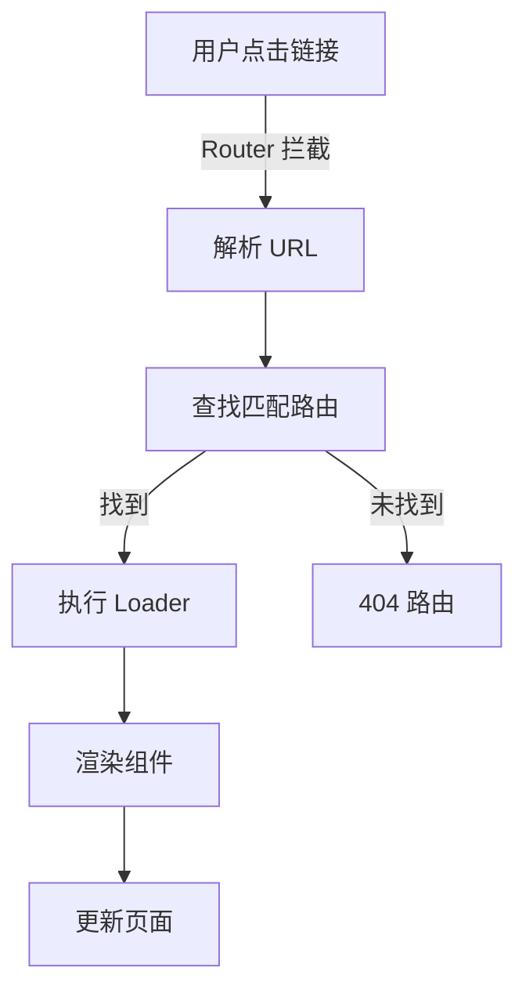

# 🚀 React 19 完整学习指南

> 这是一份全面、系统、图文并茂的 React 19 框架深度学习资料，旨在帮助开发者从基础入门到高级应用。

---

## 📑 目录结构

- [第一部分：核心基础](#第一部分核心基础)
- [第二部分：高级特性](#第二部分高级特性)
- [第三部分：工程实践](#第三部分工程实践)
- [第四部分：性能优化](#第四部分性能优化)
- [第五部分：面试题汇总](#第五部分面试题汇总)

---

# 第一部分：核心基础

## 1️⃣ React 是什么？

### 📌 核心定义

**React** 是由 Facebook 开发的 JavaScript 库，用于构建用户界面。它通过**组件化思想**和**声明式编程**，帮助开发者高效构建交互式、动态的 Web 应用。

```typescript
// React 的三大特性：
// 1. 声明式：描述你想要什么，而不是如何实现
// 2. 组件化：封装独立可复用的 UI 单元
// 3. 虚拟 DOM：高效批量更新真实 DOM
```

### 🎯 React 的核心角色



### 📊 React vs 其他框架

| 特性 | React | Vue | Angular |
|-----|-------|-----|---------|
| 学习曲线 | 🟡 中等 | 🟢 平缓 | 🔴 陡峭 |
| 灵活性 | ✅ 极高 | ⚠️ 中等 | ❌ 受限 |
| 生态系统 | ✅ 最庞大 | ⚠️ 中等 | ✅ 完整 |
| 性能 | ✅ 优秀 | ✅ 优秀 | ✅ 优秀 |
| 企业应用 | ✅ 完美 | ⚠️ 可行 | ✅ 完美 |

---

## 2️⃣ React 19 新特性详解

### 🌟 重要特性速览

```
React 19 (2024)
├─ React Compiler (自动优化)
├─ Actions (统一表单处理)
├─ use() Hook (异步数据)
├─ useOptimistic() (乐观更新)
├─ useFormStatus/useFormState
├─ Server Components 支持
└─ Web Components 增强
```

### 🔧 React Compiler (Forget)详解

#### 问题背景

手动优化 React 性能很复杂：

```typescript
// ❌ 需要手动记忆化
const MyComponent = memo((props) => {
  const handleClick = useCallback(() => {}, []);
  const value = useMemo(() => expensiveComputation(), [dep]);
  return <Child onClick={handleClick} value={value} />;
});
```

#### 解决方案：Compiler 自动优化

```typescript
// ✅ 自动转换，无需手动记忆化
function MyComponent(props) {
  const handleClick = () => {};        // ← Compiler 自动缓存
  const value = expensiveComputation(); // ← Compiler 自动缓存
  return <Child onClick={handleClick} value={value} />;
}

// Compiler 编译后会自动变成上面的 memo 版本！
```

**性能收益：**
- 自动消除不必要的重新渲染
- 减少 90%+ 的手写优化代码
- 编译时静态分析，零运行时成本

### 🎯 Actions 机制

Actions 统一了表单提交、异步操作和状态更新的处理：

```typescript
// 📍 定义一个 Server Action 或 Action
async function submitForm(prevState, formData) {
  const username = formData.get('username');
  const password = formData.get('password');
  
  try {
    const response = await fetch('/api/login', {
      method: 'POST',
      body: JSON.stringify({ username, password })
    });
    return { success: true, message: '登录成功!' };
  } catch (error) {
    return { success: false, message: '登录失败' };
  }
}

// 📍 在表单中使用
export function LoginForm() {
  const [state, formAction] = useFormState(submitForm, null);
  const { pending } = useFormStatus();
  
  return (
    <form action={formAction}>
      <input name="username" />
      <input name="password" type="password" />
      <button type="submit" disabled={pending}>
        {pending ? '登录中...' : '登录'}
      </button>
      {state?.message && <p>{state.message}</p>}
    </form>
  );
}
```

**改进点：**
- ✅ 自动加载状态管理
- ✅ 简化异步操作处理
- ✅ 内置乐观更新支持
- ✅ 类型安全的表单处理

### ⏳ `use()` Hook - 异步数据获取

```typescript
import { use, Suspense } from 'react';

// 📍 Promise 转换成同步
const dataPromise = fetch('/api/data').then(r => r.json());

function DataComponent() {
  // 直接 await Promise，React 会暂停渲染
  const data = use(dataPromise);
  return <div>{data.title}</div>;
}

// 📍 组件层级
function App() {
  return (
    <Suspense fallback={<LoadingSpinner />}>
      <DataComponent />
    </Suspense>
  );
}
```

**优势：**
- ✅ 直观的异步编程
- ✅ 无需手动订阅
- ✅ 与 Suspense 完美集成

---

## 3️⃣ JSX 与 Babel

### 📝 JSX 详解

JSX 是 **JavaScript XML**，让你能在 JS 中写 HTML 结构：

```jsx
// 原始 JSX
const element = (
  <div className="greeting">
    <h1>Hello, {userName}!</h1>
    <p>你好，欢迎来到 React</p>
  </div>
);

// Babel 编译后
const element = React.createElement(
  "div",
  { className: "greeting" },
  React.createElement("h1", null, "Hello, ", userName, "!"),
  React.createElement("p", null, "你好，欢迎来到 React")
);
```

### 🔄 JSX 转换流程图



### ⚙️ JSX 规则

```jsx
// ✅ 正确：根元素唯一
const valid = (
  <div>
    <p>Hello</p>
    <p>World</p>
  </div>
);

// ✅ 正确：使用 Fragment
const also_valid = (
  <>
    <p>Hello</p>
    <p>World</p>
  </>
);

// ❌ 错误：多个根元素
// const invalid = (<p>Hello</p><p>World</p>);

// ✅ 正确：属性驼峰命名
const element = <div className="card" data-testid="card" />;

// ✅ 正确：表达式插值
const count = 5;
const el = <p>Count: {count * 2}</p>;

// ✅ 正确：条件渲染
const showTitle = true;
const conditional = showTitle ? <h1>Title</h1> : null;
```

---

## 4️⃣ 组件与 Props 深度剖析

### 🧩 组件解剖

```typescript
import { ReactNode } from 'react';

interface CardProps {
  title: string;
  children: ReactNode;
  onClick?: (id: string) => void;
  disabled?: boolean;
}

// 📍 现代函数组件
function Card({ title, children, onClick, disabled = false }: CardProps) {
  return (
    <div className="card" style={{ opacity: disabled ? 0.5 : 1 }}>
      <h2>{title}</h2>
      <div className="card-body">
        {children}
      </div>
      <button onClick={() => onClick?.(title)} disabled={disabled}>
        Click Me
      </button>
    </div>
  );
}

export default Card;
```

### 📊 Props 完整对比

| 特征 | Props | State |
|------|-------|-------|
| 来源 | 父组件 | 组件自身 |
| 可修改 | ❌ 只读 | ✅ 可修改 |
| 默认值 | 📌 Component.defaultProps | 📌 useState 初值 |
| 类型检查 | 📌 PropTypes 或 TypeScript | 📌 TypeScript |
| 影响重建 | ✅ Props 变化重新渲染 | ✅ State 变化重新渲染 |

### 🔄 父子通信完整示例

```typescript
// ❌ 错误：试图直接修改 Props
function BadChild({ name }) {
  name = name + '!'; // ❌ 错误！Props 不可变
  return <p>{name}</p>;
}

// ✅ 正确：通过事件向上传递
interface ChildProps {
  initialName: string;
  onNameChange: (newName: string) => void;
}

function GoodChild({ initialName, onNameChange }: ChildProps) {
  const [name, setName] = useState(initialName);
  
  const handleChange = (newValue: string) => {
    setName(newValue);
    onNameChange(newValue); // 通知父组件
  };
  
  return (
    <input
      value={name}
      onChange={(e) => handleChange(e.target.value)}
    />
  );
}

// 父组件
function Parent() {
  const [parentName, setParentName] = useState('John');
  
  return (
    <div>
      <GoodChild 
        initialName={parentName}
        onNameChange={setParentName}
      />
      <p>父组件看到的名字: {parentName}</p>
    </div>
  );
}
```

---

## 5️⃣ Hooks 系统完全指南

### 🎣 Hooks 工作原理



### 📍 useState - 状态管理

```typescript
// 基础用法
const [count, setCount] = useState(0);

// 🎯 函数式初始化（避免重复计算）
const [state, setState] = useState(() => expensiveComputation());

// 🎯 更新函数（基于前一个状态）
const increment = () => {
  setState(prev => prev + 1);
};

// 🎯 多个 state 同时更新
const [user, setUser] = useState({ name: '', age: 0 });
setUser(prev => ({ ...prev, name: 'John' })); // 对象必须创建新引用
```

**规则 ⚠️：**
- ✅ 只在组件顶层调用
- ✅ 只在函数组件中调用
- ❌ 不要在循环、条件、嵌套函数中调用

### 📍 useEffect - 副作用管理

```typescript
// 运行时机完整图表
function EffectDemo() {
  useEffect(() => {
    console.log('挂载 + 每次渲染后');
    return () => console.log('清理副作用');
  }); // ← 没有依赖数组，每次都运行

  useEffect(() => {
    console.log('仅在挂载时运行');
    return () => console.log('卸载时清理');
  }, []); // ← 空依赖数组，仅一次

  useEffect(() => {
    console.log('count 或 name 变化时运行');
  }, [count, name]); // ← 指定依赖

  return null;
}
```

**常见模式：**

```typescript
// 📍 1️⃣ 数据获取
useEffect(() => {
  let ignore = false;
  
  fetchData().then(data => {
    if (!ignore) {
      setData(data);
    }
  });
  
  return () => { ignore = true; }; // 竞态条件处理
}, []);

// 📍 2️⃣ 事件监听
useEffect(() => {
  const handleResize = () => console.log('resized');
  window.addEventListener('resize', handleResize);
  
  return () => {
    window.removeEventListener('resize', handleResize);
  };
}, []);

// 📍 3️⃣ 定时器
useEffect(() => {
  const timer = setInterval(() => {
    console.log('tick');
  }, 1000);
  
  return () => clearInterval(timer);
}, []);
```

### 📍 useContext - 跨组件通信

```typescript
// 创建 Context
const ThemeContext = createContext<'light' | 'dark'>('light');

// 提供者
function ThemeProvider({ children }: { children: ReactNode }) {
  const [theme, setTheme] = useState<'light' | 'dark'>('light');
  
  return (
    <ThemeContext.Provider value={theme}>
      {children}
    </ThemeContext.Provider>
  );
}

// 消费者
function ThemedButton() {
  const theme = useContext(ThemeContext);
  
  return (
    <button style={{
      background: theme === 'light' ? '#fff' : '#333',
      color: theme === 'light' ? '#000' : '#fff'
    }}>
      按钮
    </button>
  );
}
```

### 📍 useReducer - 复杂状态逻辑

```typescript
// 状态结构
interface State {
  todos: Todo[];
  filter: 'all' | 'active' | 'completed';
  loading: boolean;
}

// Action 类型
type Action = 
  | { type: 'ADD_TODO'; payload: Todo }
  | { type: 'REMOVE_TODO'; payload: number }
  | { type: 'TOGGLE_TODO'; payload: number }
  | { type: 'SET_FILTER'; payload: State['filter'] }
  | { type: 'SET_LOADING'; payload: boolean };

// Reducer 函数
function todoReducer(state: State, action: Action): State {
  switch (action.type) {
    case 'ADD_TODO':
      return {
        ...state,
        todos: [...state.todos, action.payload]
      };
    case 'REMOVE_TODO':
      return {
        ...state,
        todos: state.todos.filter(t => t.id !== action.payload)
      };
    case 'TOGGLE_TODO':
      return {
        ...state,
        todos: state.todos.map(t =>
          t.id === action.payload ? { ...t, completed: !t.completed } : t
        )
      };
    default:
      return state;
  }
}

// 使用
function TodoApp() {
  const [state, dispatch] = useReducer(todoReducer, initialState);
  
  return (
    <div>
      {state.todos.map(todo => (
        <div key={todo.id}>
          <input
            type="checkbox"
            checked={todo.completed}
            onChange={() => dispatch({ 
              type: 'TOGGLE_TODO', 
              payload: todo.id 
            })}
          />
          {todo.text}
        </div>
      ))}
    </div>
  );
}
```

### 📍 useRef - 访问 DOM 和保存值

```typescript
// 📍 1️⃣ 访问 DOM 元素
function TextInput() {
  const inputRef = useRef<HTMLInputElement>(null);
  
  const focusInput = () => {
    inputRef.current?.focus();
  };
  
  return (
    <>
      <input ref={inputRef} />
      <button onClick={focusInput}>Focus Input</button>
    </>
  );
}

// 📍 2️⃣ 保存可变值（不触发重新渲染）
function StopWatch() {
  const intervalRef = useRef<number | null>(null);
  
  const start = () => {
    intervalRef.current = setInterval(() => {
      // 更新逻辑
    }, 1000);
  };
  
  const stop = () => {
    if (intervalRef.current) {
      clearInterval(intervalRef.current);
    }
  };
  
  return (
    <>
      <button onClick={start}>Start</button>
      <button onClick={stop}>Stop</button>
    </>
  );
}
```

### 📍 useCallback & useMemo - 性能优化

```typescript
// ❌ 问题：每次重新创建函数，导致子组件重新渲染
function Parent() {
  const handleClick = () => console.log('clicked');
  return <Child onClick={handleClick} />;
}

// ✅ 解决方案 1：useCallback 缓存函数
function Parent() {
  const handleClick = useCallback(() => {
    console.log('clicked');
  }, []); // 依赖数组为空，函数永不改变
  
  return <Child onClick={handleClick} />;
}

// ✅ 解决方案 2：useMemo 缓存计算结果
function Component() {
  const expensiveValue = useMemo(() => {
    return complexComputation(data);
  }, [data]); // 仅当 data 变化时重新计算
  
  return <div>{expensiveValue}</div>;
}

// 📍 常见错误
function BadOptimization() {
  // ❌ 无谓的 useMemo（原始值不会导致性能问题）
  const count = useMemo(() => 1, []);
  
  // ❌ 依赖数组遗漏（缓存的值过时）
  const doubled = useMemo(() => num * 2, []); // 应该包含 num
}
```

### 📍 React 19 新增 Hooks

```typescript
// 1️⃣ use() - 异步数据获取
function DataComponent() {
  const data = use(fetchPromise);
  return <div>{data}</div>;
}

// 2️⃣ useOptimistic() - 乐观更新
function TodoList() {
  const [todos, setTodos] = useState<Todo[]>([]);
  const [optimisticTodos, addOptimisticTodo] = useOptimistic(todos);
  
  const handleAdd = async (todo: Todo) => {
    // 立即显示新 Todo
    addOptimisticTodo([...optimisticTodos, todo]);
    
    // 等待服务器响应
    await saveTodo(todo);
    // 确认或回滚
  };
  
  return (
    <ul>
      {optimisticTodos.map(todo => (
        <li key={todo.id}>{todo.text}</li>
      ))}
    </ul>
  );
}

// 3️⃣ useFormStatus() - 表单状态
function SubmitButton() {
  const { pending, data, method } = useFormStatus();
  
  return (
    <button disabled={pending}>
      {pending ? '提交中...' : '提交'}
    </button>
  );
}

// 4️⃣ useFormState() - 表单结果
function LoginForm() {
  const [state, formAction] = useFormState(login, null);
  
  return (
    <form action={formAction}>
      <input name="email" type="email" />
      <input name="password" type="password" />
      <button type="submit">登录</button>
      {state?.error && <p>{state.error}</p>}
    </form>
  );
}
```

---

## 6️⃣ 自定义 Hooks 设计模式

### 🎣 常用自定义 Hooks

```typescript
// 📍 useAsync - 异步操作管理
function useAsync<T>(
  asyncFunction: () => Promise<T>,
  immediate = true
) {
  const [state, setState] = useState<{
    status: 'idle' | 'pending' | 'success' | 'error';
    data: T | null;
    error: Error | null;
  }>({
    status: 'idle',
    data: null,
    error: null,
  });

  const execute = useCallback(async () => {
    setState({ status: 'pending', data: null, error: null });
    try {
      const response = await asyncFunction();
      setState({ status: 'success', data: response, error: null });
      return response;
    } catch (error) {
      setState({ status: 'error', data: null, error: error as Error });
    }
  }, [asyncFunction]);

  useEffect(() => {
    if (immediate) {
      execute();
    }
  }, [execute, immediate]);

  return { ...state, execute };
}

// 使用
function UserProfile({ userId }: { userId: string }) {
  const { status, data: user, error } = useAsync(
    () => fetch(`/api/users/${userId}`).then(r => r.json())
  );

  if (status === 'pending') return <div>Loading...</div>;
  if (status === 'error') return <div>Error: {error?.message}</div>;
  if (status === 'success') return <div>{user?.name}</div>;
}
```

```typescript
// 📍 useLocalStorage - 本地存储 Hook
function useLocalStorage<T>(key: string, initialValue: T) {
  const [storedValue, setStoredValue] = useState<T>(() => {
    try {
      const item = window.localStorage.getItem(key);
      return item ? JSON.parse(item) : initialValue;
    } catch (error) {
      console.error(error);
      return initialValue;
    }
  });

  const setValue = (value: T | ((val: T) => T)) => {
    try {
      const valueToStore = value instanceof Function ? value(storedValue) : value;
      setStoredValue(valueToStore);
      window.localStorage.setItem(key, JSON.stringify(valueToStore));
    } catch (error) {
      console.error(error);
    }
  };

  return [storedValue, setValue] as const;
}

// 使用
function DarkModeToggle() {
  const [isDark, setIsDark] = useLocalStorage('darkMode', false);
  
  return (
    <button onClick={() => setIsDark(!isDark)}>
      {isDark ? '🌙' : '☀️'}
    </button>
  );
}
```

```typescript
// 📍 useDebounce - 防抖 Hook
function useDebounce<T>(value: T, delay: number): T {
  const [debouncedValue, setDebouncedValue] = useState(value);

  useEffect(() => {
    const handler = setTimeout(() => {
      setDebouncedValue(value);
    }, delay);

    return () => clearTimeout(handler);
  }, [value, delay]);

  return debouncedValue;
}

// 使用
function SearchUsers() {
  const [search, setSearch] = useState('');
  const debouncedSearch = useDebounce(search, 500);

  useEffect(() => {
    if (debouncedSearch) {
      fetchUsers(debouncedSearch);
    }
  }, [debouncedSearch]);

  return <input value={search} onChange={(e) => setSearch(e.target.value)} />;
}
```

---

# 第二部分：高级特性

## 7️⃣ Context API 深度应用

### 🔄 Context 完整工作流



### 🎯 实战：主题系统

```typescript
// theme-context.ts
interface Theme {
  primary: string;
  secondary: string;
  background: string;
  text: string;
}

interface ThemeContextType {
  theme: Theme;
  toggleTheme: () => void;
  currentThemeName: 'light' | 'dark';
}

const ThemeContext = createContext<ThemeContextType | undefined>(undefined);

const themes = {
  light: {
    primary: '#007bff',
    secondary: '#6c757d',
    background: '#ffffff',
    text: '#000000'
  },
  dark: {
    primary: '#0d6efd',
    secondary: '#6c757d',
    background: '#1a1a1a',
    text: '#ffffff'
  }
};

// 提供者组件
export function ThemeProvider({ children }: { children: ReactNode }) {
  const [themeName, setThemeName] = useState<'light' | 'dark'>('light');
  
  const value: ThemeContextType = {
    theme: themes[themeName],
    toggleTheme: () => setThemeName(prev => prev === 'light' ? 'dark' : 'light'),
    currentThemeName: themeName
  };
  
  return (
    <ThemeContext.Provider value={value}>
      {children}
    </ThemeContext.Provider>
  );
}

// Hook
export function useTheme() {
  const context = useContext(ThemeContext);
  if (!context) {
    throw new Error('useTheme must be used within ThemeProvider');
  }
  return context;
}

// 使用
function App() {
  return (
    <ThemeProvider>
      <Header />
      <Main />
    </ThemeProvider>
  );
}

function Header() {
  const { theme, toggleTheme, currentThemeName } = useTheme();
  
  return (
    <header style={{ background: theme.background, color: theme.text }}>
      <h1>My App</h1>
      <button onClick={toggleTheme}>
        Switch to {currentThemeName === 'light' ? 'dark' : 'light'} mode
      </button>
    </header>
  );
}
```

---

## 8️⃣ 状态管理完全指南

### 📊 状态管理金字塔

```
                    复杂全局状态
                   /            \
                  /              \
          Redux / Zustand        TanStack Query
              (客户端)           (服务器状态)
                              
      ┌─────────────────────────────────┐
      │   Context API                   │
      │   适合中等复杂度的共享状态      │
      │   主题、语言、用户信息          │
      └─────────────────────────────────┘
      
      ┌─────────────────────────────────┐
      │   useState / useReducer          │
      │   本地组件状态                   │
      └─────────────────────────────────┘
```

### 🎯 方案对比表

| 方案 | 复杂度 | 学习曲线 | 用途 |
|------|-------|----------|------|
| useState | 低 | 🟢 简单 | 简单本地状态 |
| useReducer | 中 | 🟡 中等 | 复杂本地状态 |
| Context | 中 | 🟡 中等 | 跨组件共享状态 |
| Redux | 高 | 🔴 陡峭 | 大型应用全局状态 |
| Zustand | 中 | 🟢 简单 | 轻量级全局状态 |
| TanStack Query | 中 | 🟡 中等 | 服务器数据管理 |

### 💡 Zustand 实例（推荐）

```typescript
import create from 'zustand';
import { devtools, persist } from 'zustand/middleware';

// 定义 store
interface TodoStore {
  todos: Todo[];
  addTodo: (text: string) => void;
  removeTodo: (id: number) => void;
  toggleTodo: (id: number) => void;
}

export const useTodoStore = create<TodoStore>()(
  devtools(
    persist(
      (set) => ({
        todos: [],
        addTodo: (text) => set((state) => ({
          todos: [...state.todos, { id: Date.now(), text, completed: false }]
        })),
        removeTodo: (id) => set((state) => ({
          todos: state.todos.filter(t => t.id !== id)
        })),
        toggleTodo: (id) => set((state) => ({
          todos: state.todos.map(t =>
            t.id === id ? { ...t, completed: !t.completed } : t
          )
        }))
      }),
      { name: 'todo-store' }
    ),
    { name: 'TodoStore' }
  )
);

// 使用
function TodoList() {
  const { todos, addTodo, removeTodo } = useTodoStore();
  
  return (
    <div>
      {todos.map(todo => (
        <div key={todo.id}>
          <span>{todo.text}</span>
          <button onClick={() => removeTodo(todo.id)}>Delete</button>
        </div>
      ))}
    </div>
  );
}
```

---

## 9️⃣ 路由完全指南

### 📍 React Router v6+ 流程



### 🛣️ 完整路由配置

```typescript
import { BrowserRouter, Routes, Route, Navigate, useParams } from 'react-router-dom';

// 路由配置
const routes = [
  {
    path: '/',
    element: <Layout />,
    children: [
      { index: true, element: <Home /> },
      { path: 'about', element: <About /> },
      { path: 'products/:id', element: <ProductDetail /> },
      { path: 'dashboard', element: <ProtectedRoute><Dashboard /></ProtectedRoute> },
      { path: '*', element: <NotFound /> }
    ]
  }
];

// 路由组件
function App() {
  return (
    <BrowserRouter>
      <Routes>
        <Route path="/" element={<Layout />}>
          <Route index element={<Home />} />
          <Route path="about" element={<About />} />
          <Route path="products/:id" element={<ProductDetail />} />
          <Route path="*" element={<NotFound />} />
        </Route>
      </Routes>
    </BrowserRouter>
  );
}

// 参数读取
function ProductDetail() {
  const { id } = useParams<{ id: string }>();
  return <div>Product: {id}</div>;
}

// 受保护路由
function ProtectedRoute({ children }: { children: ReactNode }) {
  const isAuthenticated = useAuth();
  return isAuthenticated ? children : <Navigate to="/login" />;
}

// 导航
function Navigation() {
  const navigate = useNavigate();
  
  return (
    <nav>
      <Link to="/">Home</Link>
      <Link to="/about">About</Link>
      <button onClick={() => navigate('/dashboard')}>Dashboard</button>
      <button onClick={() => navigate(-1)}>Back</button>
    </nav>
  );
}
```

---

## 🔟 表单系统

### 📋 受控组件 vs 非受控组件

```
受控组件                     非受控组件
━━━━━━━━━━━━━━━━━━━━━━━━━━━━━━━━━━━━━━━
值由 State 管理               DOM 管理值
onChange 更新 State           useRef 读取
⭐ 推荐用于复杂表单          简单一次性表单
表单验证容易                 验证困难
数据转换容易                 需要手动操作
```

### ✅ 受控组件完整示例

```typescript
interface FormData {
  name: string;
  email: string;
  password: string;
  agreeTerms: boolean;
}

function RegistrationForm() {
  const [formData, setFormData] = useState<FormData>({
    name: '',
    email: '',
    password: '',
    agreeTerms: false
  });
  
  const [errors, setErrors] = useState<Partial<FormData>>({});
  
  // 单个字段更新
  const handleChange = (e: ChangeEvent<HTMLInputElement>) => {
    const { name, type, value, checked } = e.target;
    setFormData(prev => ({
      ...prev,
      [name]: type === 'checkbox' ? checked : value
    }));
  };
  
  // 验证
  const validate = (): boolean => {
    const newErrors: Partial<FormData> = {};
    
    if (!formData.name) newErrors.name = '姓名必填';
    if (!formData.email) newErrors.email = '邮箱必填';
    if (!formData.password || formData.password.length < 6) {
      newErrors.password = '密码至少6个字符';
    }
    if (!formData.agreeTerms) newErrors.agreeTerms = '必须同意条款';
    
    setErrors(newErrors);
    return Object.keys(newErrors).length === 0;
  };
  
  // 提交
  const handleSubmit = async (e: FormEvent) => {
    e.preventDefault();
    
    if (!validate()) return;
    
    try {
      await submitForm(formData);
      alert('注册成功!');
    } catch (error) {
      alert('注册失败');
    }
  };
  
  return (
    <form onSubmit={handleSubmit}>
      <div>
        <label>姓名</label>
        <input
          name="name"
          value={formData.name}
          onChange={handleChange}
        />
        {errors.name && <span>{errors.name}</span>}
      </div>
      
      <div>
        <label>邮箱</label>
        <input
          type="email"
          name="email"
          value={formData.email}
          onChange={handleChange}
        />
        {errors.email && <span>{errors.email}</span>}
      </div>
      
      <div>
        <label>
          <input
            type="checkbox"
            name="agreeTerms"
            checked={formData.agreeTerms}
            onChange={handleChange}
          />
          我同意条款
        </label>
        {errors.agreeTerms && <span>{errors.agreeTerms}</span>}
      </div>
      
      <button type="submit">提交</button>
    </form>
  );
}
```

---

# 第三部分：工程实践

## 1️⃣1️⃣ 组件设计模式

### 🎭 复合组件 (Compound Component)

```typescript
// 例子：标签卡片组件

// 📍 主组件
interface TabsProps {
  defaultValue?: string;
  children: ReactNode;
}

function Tabs({ defaultValue, children }: TabsProps) {
  const [activeTab, setActiveTab] = useState(defaultValue);
  
  return (
    <TabsContext.Provider value={{ activeTab, setActiveTab }}>
      <div className="tabs">
        {children}
      </div>
    </TabsContext.Provider>
  );
}

// 📍 标签列表
function TabsList({ children }: { children: ReactNode }) {
  return <div className="tabs-list">{children}</div>;
}

// 📍 单个标签
function TabsTrigger({ value, children }: { value: string; children: ReactNode }) {
  const { activeTab, setActiveTab } = useContext(TabsContext);
  
  return (
    <button
      className={activeTab === value ? 'active' : ''}
      onClick={() => setActiveTab(value)}
    >
      {children}
    </button>
  );
}

// 📍 内容区域
function TabsContent({ value, children }: { value: string; children: ReactNode }) {
  const { activeTab } = useContext(TabsContext);
  
  if (activeTab !== value) return null;
  
  return <div className="tabs-content">{children}</div>;
}

// 🎯 组合使用
function App() {
  return (
    <Tabs defaultValue="tab1">
      <TabsList>
        <TabsTrigger value="tab1">Tab 1</TabsTrigger>
        <TabsTrigger value="tab2">Tab 2</TabsTrigger>
      </TabsList>
      
      <TabsContent value="tab1">Content 1</TabsContent>
      <TabsContent value="tab2">Content 2</TabsContent>
    </Tabs>
  );
}
```

### 🎨 Render Props 模式

```typescript
interface RenderPropsProps {
  render: (data: MousePosition) => ReactNode;
}

function MouseTracker({ render }: RenderPropsProps) {
  const [position, setPosition] = useState({ x: 0, y: 0 });
  
  useEffect(() => {
    const handleMouseMove = (e: MouseEvent) => {
      setPosition({ x: e.clientX, y: e.clientY });
    };
    
    window.addEventListener('mousemove', handleMouseMove);
    return () => window.removeEventListener('mousemove', handleMouseMove);
  }, []);
  
  return render(position);
}

// 使用
function App() {
  return (
    <MouseTracker
      render={({ x, y }) => (
        <div>Mouse is at ({x}, {y})</div>
      )}
    />
  );
}
```

---

## 1️⃣2️⃣ 性能优化完全指南

### 📊 优化策略金字塔

```
                  🚀 性能优化
                 /          \
                /            \
          代码分割        变更检测优化
        (Lazy Load)    (Memo/useMemo)
        
      ┌──────────────────────────────┐
      │  渲染优化                    │
      │  • React.memo                │
      │  • useMemo / useCallback     │
      │  • 正确使用 key 属性         │
      └──────────────────────────────┘
      
      ┌──────────────────────────────┐
      │  构建优化                    │
      │  • Tree Shaking              │
      │  • 代码分割                  │
      │  • 压缩 & Minify             │
      └──────────────────────────────┘
```

### 🎯 渲染优化技巧

```typescript
// ❌ 问题 1：列表没有正确的 key
function BadList({ items }) {
  return (
    <ul>
      {items.map((item, index) => (
        <li key={index}>{item.name}</li> // ❌ 使用 index 作为 key
      ))}
    </ul>
  );
}

// ✅ 解决
function GoodList({ items }) {
  return (
    <ul>
      {items.map((item) => (
        <li key={item.id}>{item.name}</li> // ✅ 使用唯一标识符
      ))}
    </ul>
  );
}

// ❌ 问题 2：不必要的重新渲染
function ExpensiveChild({ data, onUpdate }) {
  console.log('ExpensiveChild rendered');
  return <div>{data}</div>;
}

function Parent() {
  const [count, setCount] = useState(0);
  
  // ❌ 每次点击按钮，onUpdate 都会重新创建，导致 ExpensiveChild 重新渲染
  return (
    <>
      <button onClick={() => setCount(count + 1)}>Count: {count}</button>
      <ExpensiveChild data="data" onUpdate={() => {}} />
    </>
  );
}

// ✅ 解决方案 1：使用 React.memo
const MemoExpensiveChild = React.memo(ExpensiveChild);

// ✅ 解决方案 2：缓存回调函数
function Parent() {
  const [count, setCount] = useState(0);
  
  const handleUpdate = useCallback(() => {}, []); // 不会改变
  
  return (
    <>
      <button onClick={() => setCount(count + 1)}>Count: {count}</button>
      <ExpensiveChild data="data" onUpdate={handleUpdate} />
    </>
  );
}

// ❌ 问题 3：在渲染时创建新对象
function Parent() {
  const style = { color: 'red' }; // ❌ 每次都创建新对象
  return <Child style={style} />;
}

// ✅ 解决：使用 useMemo 或提取到常量
const CONST_STYLE = { color: 'red' };

function Parent() {
  return <Child style={CONST_STYLE} />;
}
```

### 🚀 代码分割与懒加载

```typescript
// 📍 使用 lazy + Suspense 进行代码分割
const HeavyComponent = lazy(() => import('./HeavyComponent'));
const DashboardPage = lazy(() => import('./pages/Dashboard'));

function App() {
  return (
    <Suspense fallback={<LoadingSpinner />}>
      <Routes>
        <Route path="/dashboard" element={<DashboardPage />} />
      </Routes>
    </Suspense>
  );
}

// 📍 路由级别的代码分割
const routeConfig = [
  {
    path: '/',
    element: <Home />
  },
  {
    path: '/admin',
    element: <Suspense fallback={<Spinner />}>
      <React.lazy(() => import('./pages/Admin'))
    </Suspense>
  }
];

// 📍 组件级别的代码分割
function Modal({ isOpen }: { isOpen: boolean }) {
  if (!isOpen) return null;
  
  // 只有需要时才加载组件
  const ModalContent = lazy(() => import('./ModalContent'));
  
  return (
    <Suspense fallback={<div>Loading modal...</div>}>
      <ModalContent />
    </Suspense>
  );
}
```

---

# 第四部分：性能优化

## 1️⃣3️⃣ React 18 并发特性

### ⚡ startTransition - 非紧急更新

```typescript
function SearchUsers() {
  const [searchTerm, setSearchTerm] = useState('');
  const [results, setResults] = useState<User[]>([]);
  const [isPending, startTransition] = useTransition();
  
  const handleSearch = (value: string) => {
    // 立即更新输入框（紧急更新）
    setSearchTerm(value);
    
    // 延迟搜索结果更新（非紧急更新）
    startTransition(() => {
      const newResults = performExpensiveSearch(value);
      setResults(newResults);
    });
  };
  
  return (
    <>
      <input
        value={searchTerm}
        onChange={(e) => handleSearch(e.target.value)}
        placeholder="搜索用户..."
      />
      {isPending && <span className="loading">搜索中...</span>}
      <ul>
        {results.map(user => (
          <li key={user.id}>{user.name}</li>
        ))}
      </ul>
    </>
  );
}
```

### 🎯 useDeferredValue - 延迟值

```typescript
function List({ searchTerm }: { searchTerm: string }) {
  // searchTerm 的延迟版本
  // 在 React 有空闲时更新
  const deferredSearchTerm = useDeferredValue(searchTerm);
  
  const filteredItems = useMemo(() => {
    return items.filter(item =>
      item.name.includes(deferredSearchTerm)
    );
  }, [deferredSearchTerm]);
  
  return (
    <ul>
      {filteredItems.map(item => (
        <li key={item.id}>{item.name}</li>
      ))}
    </ul>
  );
}

function App() {
  const [searchTerm, setSearchTerm] = useState('');
  
  return (
    <>
      <input
        value={searchTerm}
        onChange={(e) => setSearchTerm(e.target.value)}
      />
      <List searchTerm={searchTerm} />
    </>
  );
}
```

---

## 1️⃣4️⃣ 图片和资源优化

### 🖼️ 图片优化方案

```typescript
// 📍 1. 响应式图片
function ResponsiveImage() {
  return (
    
  );
}

// 📍 2. Next.js Image 组件（自动优化）
import Image from 'next/image';

function NextImage() {
  return (
    <Image
      src="/logo.png"
      alt="Logo"
      width={200}
      height={200}
      priority // 关键图片优先加载
      placeholder="blur"
      blurDataURL="data:image/..."
    />
  );
}

// 📍 3. 延迟加载（Intersection Observer）
function LazyImage({ src, alt }: { src: string; alt: string }) {
  const imgRef = useRef<HTMLImageElement>(null);
  const [isLoaded, setIsLoaded] = useState(false);
  
  useEffect(() => {
    const observer = new IntersectionObserver(
      ([entry]) => {
        if (entry.isIntersecting) {
          const img = entry.target as HTMLImageElement;
          img.src = src;
          setIsLoaded(true);
          observer.unobserve(img);
        }
      },
      { rootMargin: '50px' }
    );
    
    if (imgRef.current) {
      observer.observe(imgRef.current);
    }
    
    return () => observer.disconnect();
  }, [src]);
  
  return (
    
  );
}
```

---

# 第五部分：面试题汇总

## 核心概念面试题

### Q1：React 是什么？它的核心特性有哪些？

**标准答案：**

React 是一个用于构建用户界面的 JavaScript 库。它的核心特性包括：

```
1️⃣ 声明式编程：
   描述 UI 应该是什么样子，而不是如何一步步构建它

2️⃣ 组件化：
   将 UI 拆分成独立的、可复用的组件

3️⃣ 虚拟 DOM：
   通过比对新旧虚拟 DOM，最小化真实 DOM 操作，提高性能

4️⃣ 单向数据流：
   数据从父组件流向子组件，数据更新由父组件控制
```

**代码示例：**

```tsx
// 声明式
function UserCard({ user }) {
  return (
    <div>
      <h2>{user.name}</h2>
      <p>{user.email}</p>
    </div>
  );
}

// 命令式（不推荐）
const div = document.createElement('div');
const h2 = document.createElement('h2');
h2.textContent = user.name;
div.appendChild(h2);
```

---

### Q2：虚拟 DOM 是什么？它如何提高性能？

**标准答案：**

虚拟 DOM 是 React 在内存中维护的真实 DOM 的轻量级表示。

```
工作原理：
1. 组件状态改变
   ↓
2. 创建新的虚拟 DOM 树
   ↓
3. 与旧虚拟 DOM 比对（Diff）
   ↓
4. 只更新有变化的真实 DOM
```

**性能优势：**
- 批量更新：多个状态变化合并为一次 DOM 更新
- 高效 Diff：只更新改变的部分
- 避免直接 DOM 操作：直接操作 DOM 是最慢的

**对比：**

```typescript
// ❌ 直接操作 DOM（低效）
for (let i = 0; i < 1000; i++) {
  document.body.innerHTML += `<div>${i}</div>`;
  // 导致 1000 次回流和重绘！
}

// ✅ React（高效）
const items = Array.from({ length: 1000 }, (_, i) => <div key={i}>{i}</div>);
// React 会一次性更新整个 DOM 树
```

---

### Q3：useState 的闭包陷阱是什么？如何避免？

**问题演示：**

```typescript
function Counter() {
  const [count, setCount] = useState(0);
  
  const handleClick = () => {
    setTimeout(() => {
      console.log(count); // ❌ 闭包捕获的是旧值
    }, 1000);
  };
  
  return <button onClick={handleClick}>Click</button>;
}
```

**解决方案：**

```typescript
// ✅ 方案 1：使用函数式更新
setCount(prev => prev + 1);

// ✅ 方案 2：使用 useRef 保存最新值
const countRef = useRef(count);

useEffect(() => {
  countRef.current = count;
}, [count]);

const handleClick = () => {
  setTimeout(() => {
    console.log(countRef.current); // 正确的值
  }, 1000);
};

// ✅ 方案 3：依赖数组正确包含所有依赖
useEffect(() => {
  const handleClick = () => {
    console.log(count); // 闭包正确捕获最新的 count
  };
  
  window.addEventListener('click', handleClick);
  return () => window.removeEventListener('click', handleClick);
}, [count]); // 包含 count 作为依赖
```

---

### Q4：如何优化 React 应用性能？

**优化清单：**

```
🎯 渲染优化
  ✅ 使用 React.memo 缓存组件
  ✅ 使用 useCallback 缓存函数
  ✅ 使用 useMemo 缓存计算结果
  ✅ 为列表项提供稳定的 key
  ✅ 拆分大组件为小组件

📦 代码优化
  ✅ 代码分割和延迟加载
  ✅ Tree shaking 移除未使用代码
  ✅ 减少依赖库数量

🌐 网络优化
  ✅ 预加载关键资源
  ✅ 懒加载图片和组件
  ✅ 使用 CDN 部署资源

📡 服务器优化
  ✅ 使用 SSR/SSG
  ✅ API 响应缓存
  ✅ 数据预取
```

---

### Q5：Hooks 和 Class 组件有什么区别？何时使用哪个？

**对比表：**

| 特性 | Hooks（函数组件）| Class 组件 |
|------|------------------|-----------|
| 语法 | 简洁 | 复杂 |
| 状态管理 | useState | this.state |
| 副作用 | useEffect | 生命周期方法 |
| 学习曲线 | 平缓 | 陡峭 |
| 性能 | 优秀 | 良好 |
| 社区趋势 | ⭐⭐⭐⭐⭐ | ⭐⭐ |

**何时使用：**

```
✅ 使用 Hooks（函数组件）
   • 新项目
   • 简单和中等复杂的组件
   • 需要更好的代码复用性

✅ 使用 Class 组件
   • 需要错误边界（Error Boundary）
   • 与旧代码库集成
   • 团队已熟悉 Class 语法
```

---

## 实战场景题

### 场景 1：实现一个具有分页、搜索、排序的数据表格

```typescript
function DataTable() {
  const [data, setData] = useState<Item[]>([]);
  const [searchTerm, setSearchTerm] = useState('');
  const [sortBy, setSortBy] = useState<'name' | 'date'>('name');
  const [page, setPage] = useState(1);
  const pageSize = 10;

  // 搜索和过滤
  const filtered = useMemo(() => {
    return data.filter(item =>
      item.name.toLowerCase().includes(searchTerm.toLowerCase())
    );
  }, [data, searchTerm]);

  // 排序
  const sorted = useMemo(() => {
    const newData = [...filtered];
    newData.sort((a, b) => {
      if (sortBy === 'name') {
        return a.name.localeCompare(b.name);
      } else {
        return new Date(a.date).getTime() - new Date(b.date).getTime();
      }
    });
    return newData;
  }, [filtered, sortBy]);

  // 分页
  const paginatedData = useMemo(() => {
    const start = (page - 1) * pageSize;
    return sorted.slice(start, start + pageSize);
  }, [sorted, page]);

  return (
    <div>
      <input
        placeholder="搜索..."
        value={searchTerm}
        onChange={(e) => {
          setSearchTerm(e.target.value);
          setPage(1);
        }}
      />

      <select value={sortBy} onChange={(e) => setSortBy(e.target.value as any)}>
        <option value="name">按名称排序</option>
        <option value="date">按日期排序</option>
      </select>

      <table>
        <tbody>
          {paginatedData.map(item => (
            <tr key={item.id}>
              <td>{item.name}</td>
              <td>{item.date}</td>
            </tr>
          ))}
        </tbody>
      </table>

      <pagination>
        <button onClick={() => setPage(Math.max(1, page - 1))}>上一页</button>
        <span>{page}</span>
        <button onClick={() => setPage(page + 1)}>下一页</button>
      </pagination>
    </div>
  );
}
```

---

### 场景 2：实现一个具有撤销/重做功能的编辑器

```typescript
function useHistory<T>(initialValue: T) {
  const [state, setState] = useState(initialValue);
  const [history, setHistory] = useState<T[]>([initialValue]);
  const [historyStep, setHistoryStep] = useState(0);

  const updateState = (newState: T) => {
    const newHistory = history.slice(0, historyStep + 1);
    newHistory.push(newState);
    setHistory(newHistory);
    setHistoryStep(newHistory.length - 1);
    setState(newState);
  };

  const undo = () => {
    if (historyStep > 0) {
      const newStep = historyStep - 1;
      setHistoryStep(newStep);
      setState(history[newStep]);
    }
  };

  const redo = () => {
    if (historyStep < history.length - 1) {
      const newStep = historyStep + 1;
      setHistoryStep(newStep);
      setState(history[newStep]);
    }
  };

  return { state, updateState, undo, redo, canUndo: historyStep > 0, canRedo: historyStep < history.length - 1 };
}

// 使用
function Editor() {
  const { state, updateState, undo, redo, canUndo, canRedo } = useHistory('');

  return (
    <>
      <button onClick={undo} disabled={!canUndo}>撤销</button>
      <button onClick={redo} disabled={!canRedo}>重做</button>
      <textarea value={state} onChange={(e) => updateState(e.target.value)} />
    </>
  );
}
```

---

## 最佳实践总结

### 🎯 React 开发黄金法则

```
1️⃣ 优先使用函数组件和 Hooks
   → 更简洁、更易测试、更好的代码复用

2️⃣ 合理拆分组件
   → 单一职责、易于维护和测试

3️⃣ 使用 TypeScript
   → 类型安全、IDE 智能提示、减少运行时错误

4️⃣ 为列表提供稳定的 key
   → 避免在 map 中使用索引

5️⃣ 避免在渲染时创建新对象
   → 提取到常量或使用 useMemo

6️⃣ 及时清理副作用
   → 在 useEffect 中返回清理函数

7️⃣ 使用受控组件处理表单
   → 更易验证、变换、条件提交

8️⃣ 分离关注点
   → 逻辑与 UI 分离，使用自定义 Hooks

9️⃣ 规范命名
   → 清晰的变量、函数、组件名称

🔟 充分利用开发者工具
   → React DevTools、Chrome DevTools Performance
```


## 📚 推荐学习资源

- 🌐 [官方文档](https://react.dev)
- 📖 [React 最佳实践](https://react.dev/learn)
- 🎓 [React 核心概念深入](https://react.dev/reference)
- 💻 [CodeSandbox 在线编辑](https://codesandbox.io)
- 🧪 [React Testing Library](https://testing-library.com)

---

**如有问题或建议，欢迎反馈！** 🚀
