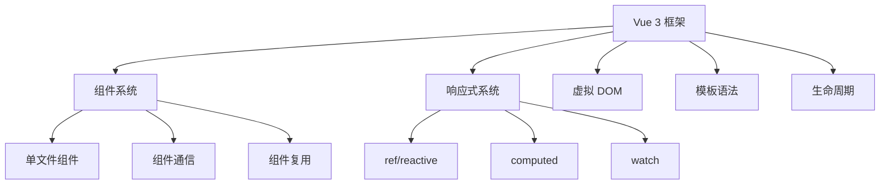
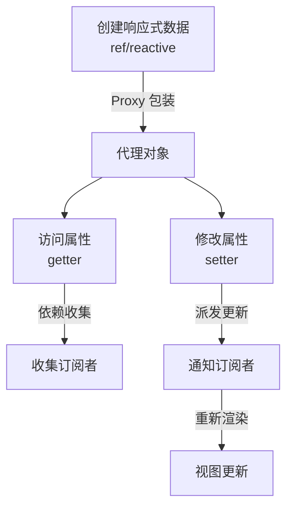
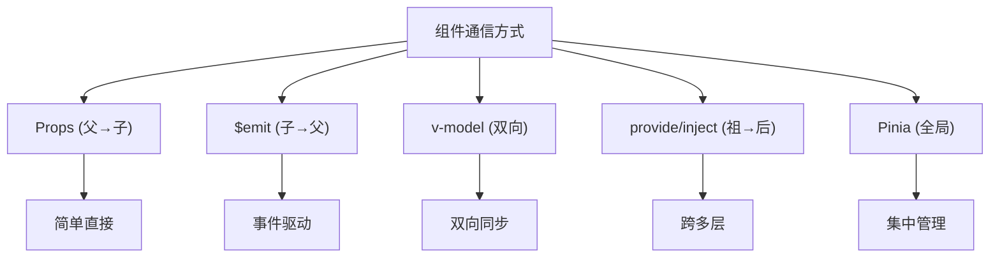
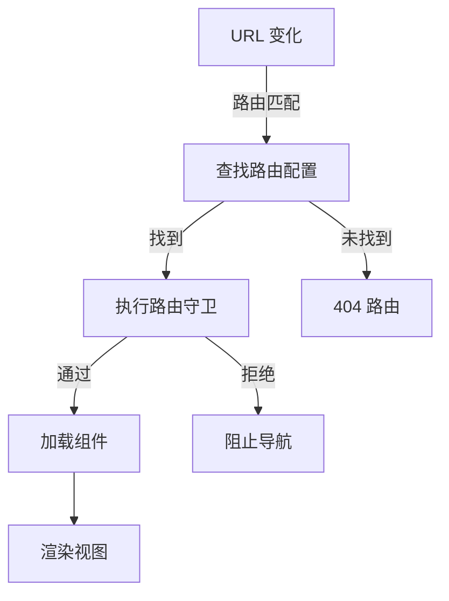

# 🚀 Vue 3 完整学习指南

> 这是一份全面、系统、图文并茂的 Vue 3 框架深度学习资料，旨在帮助开发者从基础入门到高级应用。

---

## 📑 目录结构

- [第一部分：核心基础](#第一部分核心基础)
- [第二部分：高级特性](#第二部分高级特性)
- [第三部分：工程实践](#第三部分工程实践)
- [第四部分：性能优化](#第四部分性能优化)
- [第五部分：面试题汇总](#第五部分面试题汇总)

---

# 第一部分：核心基础

## 1️⃣ Vue 是什么？

### 📌 核心定义

**Vue** 是一个渐进式 JavaScript 框架，用于构建用户界面。它以**易学易用、高性能和灵活的组件化**而闻名，是介于 React 的自由度和 Angular 的完整性之间的完美平衡。

```typescript
// Vue 的三大特性：
// 1. 渐进式：可选择使用不同的层级功能
// 2. 响应式：数据变化自动更新视图
// 3. 组件化：复用性强的独立 UI 单元
```

### 🎯 Vue 的核心角色



### 📊 框架对比

| 特性 | Vue | React | Angular |
|-----|-----|-------|---------|
| 学习曲线 | 🟢 平缓 | 🟡 中等 | 🔴 陡峭 |
| 灵活性 | ✅ 高 | ✅ 极高 | ⚠️ 受限 |
| 性能 | ✅ 优秀 | ✅ 优秀 | ✅ 优秀 |
| 生态 | ✅ 完整 | ✅ 最庞大 | ✅ 完整 |
| 中文资源 | ✅ 丰富 | ⚠️ 中等 | ⚠️ 有限 |

---

## 2️⃣ Vue 3 新特性详解

### 🌟 重要特性速览

```
Vue 3 (2020+)
├─ Composition API (组合式 API)
├─ Proxy 响应式系统
├─ Fragment & Teleport
├─ Suspense (异步组件)
├─ 更快的性能
├─ TypeScript 优化
└─ 新的全局 API
```

### 🔄 Composition API 详解

#### 问题背景

Vue 2 选项式 API 在处理复杂组件时的问题：

```typescript
// ❌ 问题：逻辑分散
export default {
  data() {
    return { count: 0, name: '' };
  },
  computed: {
    doubledCount() { return this.count * 2; }
  },
  methods: {
    increment() { this.count++; }
  },
  watch: {
    name(newVal) { console.log(newVal); }
  }
};
// 相关逻辑被分散在不同选项中，难以维护
```

#### 解决方案：Composition API

```typescript
// ✅ 解决：逻辑聚合
import { ref, computed, watch } from 'vue';

export default {
  setup() {
    const count = ref(0);
    const name = ref('');
    
    // 相关逻辑聚合在一起
    const doubledCount = computed(() => count.value * 2);
    const increment = () => { count.value++; };
    
    watch(name, (newVal) => {
      console.log(newVal);
    });
    
    return { count, name, doubledCount, increment };
  }
};
```

**改进点：**
- ✅ 逻辑聚合，易于阅读和维护
- ✅ 强大的代码复用能力
- ✅ 更好的 TypeScript 支持
- ✅ 灵活的代码组织

### ⚡ Proxy 响应式系统

#### Vue 2 vs Vue 3

```
Vue 2: Object.defineProperty
┌─────────────────────────────┐
│ 缺点：                      │
│ ❌ 无法检测属性新增/删除    │
│ ❌ 数组索引变化无法检测     │
│ ❌ 需要 $set 进行强制更新   │
└─────────────────────────────┘

Vue 3: Proxy
┌─────────────────────────────┐
│ 优点：                      │
│ ✅ 全面响应式（任何变化）   │
│ ✅ 直观的 API 设计          │
│ ✅ 更好的 TypeScript 支持   │
│ ✅ 惰性处理（按需响应）     │
└─────────────────────────────┘
```

#### 工作原理图



### 🎯 `ref` vs `reactive`

```typescript
// 📍 ref - 适用于任何类型
const count = ref(0);
const user = ref({ name: 'John' });

// 访问值需要 .value
console.log(count.value); // 0

// 在模板中自动解包
// <div>{{ count }}</div> ✅

// 📍 reactive - 仅适用于对象
const state = reactive({
  count: 0,
  user: { name: 'John' }
});

// 直接访问，无需 .value
console.log(state.count); // 0

// 模板中也无需 .value
// <div>{{ state.count }}</div> ✅

// ⚠️ 注意：reactive 重新赋值会丢失响应性
state = { count: 5 }; // ❌ 错误

// 应该修改属性
state.count = 5; // ✅ 正确
```

---

## 3️⃣ 组合式 API 完全指南

### 🎣 核心函数详解

#### `ref` - 单个值的响应式

```typescript
import { ref } from 'vue';

// 基础用法
const count = ref(0);
const name = ref('Alice');

// 访问和修改
console.log(count.value); // 0
count.value = 5;

// 模板中自动解包（无需 .value）
// {{ count }} → 5
```

#### `computed` - 计算属性

```typescript
import { ref, computed } from 'vue';

const count = ref(1);
const multiplier = ref(2);

// 只读计算属性
const doubled = computed(() => count.value * multiplier.value);

// 可写计算属性
const userFullName = computed({
  get: () => `${firstName.value} ${lastName.value}`,
  set: (newValue) => {
    const [first, last] = newValue.split(' ');
    firstName.value = first;
    lastName.value = last;
  }
});
```

#### `watch` - 监听变化

```typescript
import { ref, watch } from 'vue';

const count = ref(0);
const user = ref({ name: 'Alice', age: 30 });

// 📍 1️⃣ 监听单个 ref
watch(count, (newVal, oldVal) => {
  console.log(`Count changed from ${oldVal} to ${newVal}`);
});

// 📍 2️⃣ 监听对象（深度监听）
watch(
  user,
  (newVal, oldVal) => {
    console.log('User changed:', newVal);
  },
  { deep: true } // 深度监听
);

// 📍 3️⃣ 监听多个源
watch([count, user], ([newCount, newUser]) => {
  console.log('Count or User changed!');
});

// 📍 4️⃣ 取消监听
const stopWatching = watch(count, () => {
  console.log('Count changed!');
});
stopWatching(); // 停止监听
```

#### `watchEffect` - 自动依赖追踪

```typescript
import { ref, watchEffect } from 'vue';

const count = ref(0);
const multiplier = ref(2);

// 自动追踪依赖（count 和 multiplier）
watchEffect(() => {
  console.log(`Result: ${count.value * multiplier.value}`);
});

// 当 count 或 multiplier 变化时自动执行

// 获取停止函数
const stop = watchEffect(() => {
  console.log(`Count is now: ${count.value}`);
});

stop(); // 停止监听
```

#### 生命周期钩子

```typescript
import {
  onBeforeMount,
  onMounted,
  onBeforeUpdate,
  onUpdated,
  onBeforeUnmount,
  onUnmounted
} from 'vue';

onBeforeMount(() => {
  console.log('组件即将挂载');
});

onMounted(() => {
  console.log('组件已挂载');
  // 初始化数据、订阅等
  const timer = setInterval(() => {
    // 定时任务
  }, 1000);

  onUnmounted(() => {
    clearInterval(timer); // 清理资源
  });
});

onBeforeUpdate(() => {
  console.log('数据变化，即将更新 DOM');
});

onUpdated(() => {
  console.log('DOM 已更新');
});
```

### 🧩 完整组合式 API 示例

```vue
<script setup lang="ts">
import { ref, computed, watch, onMounted, onUnmounted } from 'vue';

// 状态
const count = ref(0);
const multiplier = ref(2);

// 计算属性
const doubled = computed(() => count.value * multiplier.value);
const countStatus = computed(() => {
  if (count.value < 0) return '负数';
  if (count.value === 0) return '零';
  return '正数';
});

// 监听
watch(count, (newVal) => {
  console.log(`Count changed to ${newVal}`);
});

// 生命周期
let timer: number;

onMounted(() => {
  console.log('组件已挂载');
  timer = setInterval(() => {
    console.log('定时器运行中...');
  }, 1000);
});

onUnmounted(() => {
  console.log('组件已卸载');
  clearInterval(timer);
});

// 方法
const increment = () => count.value++;
const decrement = () => count.value--;
const reset = () => count.value = 0;
</script>

<template>
  <div>
    <h2>计数器</h2>
    <p>Count: {{ count }} ({{ countStatus }})</p>
    <p>Multiplier: {{ multiplier }}</p>
    <p>Doubled: {{ doubled }}</p>
    
    <button @click="increment">+</button>
    <button @click="decrement">-</button>
    <button @click="reset">重置</button>
  </div>
</template>
```

---

## 4️⃣ 模板语法完全参考

### 📋 指令和绑定

```html
<!-- 插值表达式 -->
<div>{{ message }}</div>
<div>{{ count + 1 }}</div>
<div>{{ ok ? '是' : '否' }}</div>

<!-- 属性绑定 -->

<button :disabled="isDisabled">按钮</button>
<div :class="{ active: isActive }">动态类</div>
<div :style="{ color: activeColor }">动态样式</div>

<!-- 事件绑定 -->
<button @click="handleClick">点击</button>
<input @input="message = $event.target.value" />
<input @keyup.enter="submitForm" />

<!-- 双向绑定 -->
<input v-model="message" />
<input v-model.number="age" />
<input v-model.trim="name" />
<textarea v-model="description"></textarea>
<input type="checkbox" v-model="checked" />

<!-- 条件渲染 -->
<div v-if="visible">显示</div>
<div v-else-if="loading">加载中...</div>
<div v-else>隐藏</div>
<div v-show="visible">始终存在于 DOM</div>

<!-- 列表渲染 -->
<ul>
  <li v-for="item in items" :key="item.id">
    {{ item.name }}
  </li>
</ul>

<!-- 特殊属性 -->
<component :is="currentComponent"></component>
<keep-alive>
  <component :is="currentComponent"></component>
</keep-alive>
```

---

# 第二部分：高级特性

## 5️⃣ 组件通信完全指南

### 🔄 5 种通信方式对比



### 📍 Props - 父向子传递

```vue
<!-- 父组件 -->
<script setup lang="ts">
import Child from './Child.vue';

const message = ref('Hello from parent');
const user = { name: 'John', age: 30 };
</script>

<template>
  <Child
    :message="message"
    :user="user"
    :count="123"
    message-class="greeting"
  />
</template>

<!-- 子组件 -->
<script setup lang="ts">
interface User {
  name: string;
  age: number;
}

const props = defineProps<{
  message: string;
  user: User;
  count?: number;
  messageClass?: string;
}>();

// 或使用带默认值的方式
const propsWithDefaults = withDefaults(
  defineProps<Props>(),
  { count: 0 }
);
</script>

<template>
  <div>
    <p>{{ props.message }}</p>
    <p>{{ props.user.name }} - {{ props.user.age }}</p>
  </div>
</template>
```

### 📍 $emit - 子向父传递

```vue
<!-- 子组件 -->
<script setup lang="ts">
const emit = defineEmits<{
  (e: 'increment', value: number): void;
  (e: 'update-name', name: string): void;
}>();

const handleClick = () => {
  emit('increment', 1);
};

const changeName = () => {
  emit('update-name', 'Alice');
};
</script>

<template>
  <button @click="handleClick">增加</button>
  <button @click="changeName">改名</button>
</template>

<!-- 父组件 -->
<script setup lang="ts">
const count = ref(0);
const name = ref('Bob');
</script>

<template>
  <Child
    @increment="(val) => count += val"
    @update-name="(newName) => name = newName"
  />
</template>
```

### 📍 v-model - 双向绑定

```vue
<!-- 子组件 -->
<script setup lang="ts">
const props = defineProps<{
  modelValue: string;
}>();

const emit = defineEmits<{
  (e: 'update:modelValue', value: string): void;
}>();

const handleInput = (e: Event) => {
  emit('update:modelValue', (e.target as HTMLInputElement).value);
};
</script>

<template>
  <input :value="modelValue" @input="handleInput" />
</template>

<!-- 父组件 -->
<script setup lang="ts">
const message = ref('Hello');
</script>

<template>
  <!-- v-model 会自动处理 modelValue 和 update:modelValue -->
  <Child v-model="message" />
  <!-- 等价于：-->
  <!-- <Child :modelValue="message" @update:modelValue="message = $event" /> -->
</template>
```

### 📍 provide/inject - 跨多层传递

```vue
<!-- 祖先组件 -->
<script setup lang="ts">
import { provide, ref } from 'vue';

const theme = ref('light');
const user = ref({ id: 1, name: 'Admin' });

// 提供数据
provide('theme', theme);
provide('currentUser', user);

// 提供方法
provide('toggleTheme', () => {
  theme.value = theme.value === 'light' ? 'dark' : 'light';
});
</script>

<!-- 后代组件（可以跳过中间层） -->
<script setup lang="ts">
import { inject } from 'vue';

const theme = inject<'light' | 'dark'>('theme', 'light');
const user = inject('currentUser');
const toggleTheme = inject<() => void>('toggleTheme');
</script>

<template>
  <div :class="theme">
    <p>当前主题: {{ theme }}</p>
    <p>用户: {{ user?.name }}</p>
    <button @click="toggleTheme">切换主题</button>
  </div>
</template>
```

---

## 6️⃣ 路由系统详解

### 🛣️ 路由流程图



### 📍 完整路由配置示例

```typescript
// router/index.ts
import { createRouter, createWebHistory } from 'vue-router';
import type { RouteRecordRaw } from 'vue-router';

// 路由配置
const routes: RouteRecordRaw[] = [
  {
    path: '/',
    name: 'home',
    component: () => import('../views/Home.vue')
  },
  {
    path: '/about',
    name: 'about',
    component: () => import('../views/About.vue')
  },
  {
    path: '/user/:id',
    name: 'user-detail',
    component: () => import('../views/UserDetail.vue'),
    props: true // 将路由参数作为 props 传递
  },
  {
    path: '/dashboard',
    name: 'dashboard',
    component: () => import('../layouts/DashboardLayout.vue'),
    meta: { requiresAuth: true }, // 自定义元数据
    children: [
      {
        path: '', // 默认子路由
        name: 'dashboard-overview',
        component: () => import('../views/DashboardOverview.vue')
      },
      {
        path: 'settings',
        name: 'dashboard-settings',
        component: () => import('../views/DashboardSettings.vue')
      }
    ]
  },
  {
    path: '/:pathMatch(.*)*', // 404 路由
    name: 'not-found',
    component: () => import('../views/NotFound.vue')
  }
];

// 创建路由实例
const router = createRouter({
  history: createWebHistory(),
  routes
});

// 全局路由守卫
router.beforeEach((to, from, next) => {
  if (to.meta.requiresAuth && !isAuthenticated()) {
    next('/login');
  } else {
    next();
  }
});

export default router;
```

### 📍 在组件中使用路由

```vue
<script setup lang="ts">
import { useRoute, useRouter } from 'vue-router';
import { computed } from 'vue';

const route = useRoute();
const router = useRouter();

// 获取路由参数
const userId = computed(() => route.params.id);

// 获取查询参数
const searchQuery = computed(() => route.query.search);

// 编程式导航
const goToHome = () => {
  router.push('/');
};

const goToUserDetail = (id: number) => {
  router.push({
    name: 'user-detail',
    params: { id }
  });
};

const goToSearchResults = (query: string) => {
  router.push({
    path: '/search',
    query: { search: query }
  });
};

// 返回上一页
const goBack = () => {
  router.back();
};
</script>

<template>
  <div>
    <h1>用户详情: {{ userId }}</h1>
    
    <!-- 声明式导航 -->
    <router-link to="/">返回首页</router-link>
    <router-link :to="{ name: 'user-detail', params: { id: 456 } }">
      查看用户 456
    </router-link>
    
    <!-- 编程式导航 -->
    <button @click="goToHome">首页</button>
    <button @click="goBack">返回</button>
    
    <!-- 路由视图 -->
    <router-view />
  </div>
</template>
```

---

## 7️⃣ 状态管理（Pinia）

### 📊 Pinia vs Vuex

```
Pinia (推荐)            Vuex (传统)
━━━━━━━━━━━━━━━━━━━━━━━━━━━━━━
✅ 更简洁的 API         ⚠️ 样板代码多
✅ 完美的 TypeScript    ⚠️ 类型支持弱
✅ 无 Mutations        ⚠️ 必需 Mutations
✅ 按需导入             ⚠️ 需要导入全部
✅ 官方推荐             ⚠️ 逐步淘汰
```

### 📍 Pinia 完整示例

```typescript
// stores/counter.ts
import { defineStore } from 'pinia';
import { ref, computed } from 'vue';

// 方式 1：Setup 函数式
export const useCounterStore = defineStore('counter', () => {
  // 状态
  const count = ref(0);
  const name = ref('Counter Store');

  // 计算属性
  const doubled = computed(() => count.value * 2);
  const isPositive = computed(() => count.value > 0);

  // 方法（Actions）
  const increment = () => count.value++;
  const decrement = () => count.value--;
  const reset = () => count.value = 0;

  // 异步方法
  const fetchRandomCount = async () => {
    const response = await fetch('https://api.example.com/random');
    const data = await response.json();
    count.value = data.number;
  };

  return {
    // 状态
    count,
    name,
    // 计算属性
    doubled,
    isPositive,
    // 方法
    increment,
    decrement,
    reset,
    fetchRandomCount
  };
});

// 方式 2：Options 式
export const useUserStore = defineStore('user', {
  state: () => ({
    user: null,
    isLoading: false
  }),
  
  getters: {
    isLoggedIn: (state) => !!state.user,
    userName: (state) => state.user?.name || 'Guest'
  },
  
  actions: {
    async login(username: string, password: string) {
      this.isLoading = true;
      try {
        const response = await fetch('/api/login', {
          method: 'POST',
          body: JSON.stringify({ username, password })
        });
        this.user = await response.json();
      } finally {
        this.isLoading = false;
      }
    },
    
    logout() {
      this.user = null;
    }
  }
});
```

### 📍 在组件中使用 Pinia

```vue
<script setup lang="ts">
import { useCounterStore } from '../stores/counter';
import { useUserStore } from '../stores/user';

const counterStore = useCounterStore();
const userStore = useUserStore();

// 解构状态（保持响应性）
const { count, doubled } = useCounterStore();

// 修改状态
const handleIncrement = () => {
  counterStore.increment();
};

// 调用异步方法
const loadRandom = async () => {
  await counterStore.fetchRandomCount();
};
</script>

<template>
  <div>
    <!-- 使用状态 -->
    <p>Count: {{ counterStore.count }}</p>
    <p>Doubled: {{ counterStore.doubled }}</p>
    
    <!-- 使用计算属性 -->
    <p v-if="counterStore.isPositive">计数为正数</p>
    
    <!-- 调用方法 -->
    <button @click="handleIncrement">+1</button>
    <button @click="counterStore.decrement">-1</button>
    <button @click="counterStore.reset">重置</button>
    <button @click="loadRandom">加载随机数</button>
    
    <!-- 用户信息 -->
    <div v-if="userStore.isLoggedIn">
      欢迎, {{ userStore.userName }}
      <button @click="userStore.logout">退出</button>
    </div>
    <div v-else>
      <button @click="userStore.login('admin', 'password')">登录</button>
    </div>
  </div>
</template>
```

---

# 第三部分：工程实践

## 8️⃣ 单文件组件最佳实践

### 📝 现代单文件组件结构

```vue
<script setup lang="ts">
import { ref, computed, onMounted } from 'vue';
import type { PropType } from 'vue';
import ChildComponent from './ChildComponent.vue';

// 类型定义
interface User {
  id: number;
  name: string;
  email: string;
}

// Props 定义
const props = withDefaults(
  defineProps<{
    title: string;
    user?: User;
    count?: number;
  }>(),
  { count: 0 }
);

// Emits 定义
const emit = defineEmits<{
  (e: 'update:user', user: User): void;
  (e: 'delete'): void;
}>();

// 状态
const loading = ref(false);
const error = ref<string | null>(null);

// 计算属性
const displayName = computed(() => {
  return props.user?.name || 'Unknown';
});

// 方法
const handleDelete = async () => {
  loading.value = true;
  try {
    // 删除操作
    emit('delete');
  } catch (e) {
    error.value = (e as Error).message;
  } finally {
    loading.value = false;
  }
};

// 生命周期
onMounted(() => {
  console.log('Component mounted');
});

// 暴露方法给父组件
defineExpose({
  handleDelete
});
</script>

<template>
  <div class="user-card">
    <h2>{{ props.title }}</h2>
    <p>Name: {{ displayName }}</p>
    <p v-if="props.user?.email">Email: {{ props.user.email }}</p>
    
    <div v-if="loading" class="loading">加载中...</div>
    <div v-if="error" class="error">{{ error }}</div>
    
    <button @click="handleDelete">删除</button>
    
    <ChildComponent v-if="props.user" :user="props.user" />
  </div>
</template>

<style scoped>
.user-card {
  border: 1px solid #ccc;
  padding: 20px;
  border-radius: 8px;
}

.loading {
  color: #1890ff;
}

.error {
  color: #ff4d4f;
}
</style>
```

---

## 9️⃣ 可组合函数（Composables）

### 🎣 常用 Composables

```typescript
// composables/useFetch.ts
import { ref, onMounted } from 'vue';

export function useFetch<T>(url: string) {
  const data = ref<T | null>(null);
  const loading = ref(false);
  const error = ref<string | null>(null);

  const fetch = async () => {
    loading.value = true;
    error.value = null;
    try {
      const response = await fetch(url);
      if (!response.ok) throw new Error(`HTTP ${response.status}`);
      data.value = await response.json();
    } catch (e) {
      error.value = (e as Error).message;
    } finally {
      loading.value = false;
    }
  };

  onMounted(() => fetch());

  return { data, loading, error, fetch };
}

// composables/useAsync.ts
import { ref } from 'vue';

export function useAsync<T>(asyncFunction: () => Promise<T>) {
  const data = ref<T | null>(null);
  const pending = ref(false);
  const error = ref<Error | null>(null);

  const execute = async () => {
    pending.value = true;
    error.value = null;
    try {
      data.value = await asyncFunction();
    } catch (e) {
      error.value = e as Error;
    } finally {
      pending.value = false;
    }
  };

  return { data, pending, error, execute };
}

// composables/useCounter.ts
import { ref, computed } from 'vue';

export function useCounter(initialValue = 0) {
  const count = ref(initialValue);
  
  const doubled = computed(() => count.value * 2);
  const isPositive = computed(() => count.value > 0);
  
  const increment = () => count.value++;
  const decrement = () => count.value--;
  const reset = () => count.value = initialValue;
  
  return { count, doubled, isPositive, increment, decrement, reset };
}
```

### 📍 在组件中使用

```vue
<script setup lang="ts">
import { useFetch } from '../composables/useFetch';
import { useCounter } from '../composables/useCounter';

interface Post {
  id: number;
  title: string;
  body: string;
}

// 使用 fetch composable
const { data: posts, loading, error } = useFetch<Post[]>(
  'https://jsonplaceholder.typicode.com/posts?_limit=5'
);

// 使用 counter composable
const { count, doubled, increment, decrement } = useCounter(0);
</script>

<template>
  <div>
    <!-- 计数器 -->
    <div class="counter">
      <h2>计数器: {{ count }} (Double: {{ doubled }})</h2>
      <button @click="increment">+</button>
      <button @click="decrement">-</button>
    </div>
    
    <!-- 文章列表 -->
    <div class="posts">
      <h2>文章列表</h2>
      <div v-if="loading">加载中...</div>
      <div v-if="error" class="error">{{ error }}</div>
      <ul v-if="posts">
        <li v-for="post in posts" :key="post.id">
          <strong>{{ post.title }}</strong>
          <p>{{ post.body }}</p>
        </li>
      </ul>
    </div>
  </div>
</template>
```

---

# 第四部分：性能优化

## 🔟 性能优化完全指南

### 📊 优化策略金字塔

```
                    🚀 性能优化
                   /          \
                  /            \
          代码分割              响应式优化
        (Lazy Loading)    (shallowRef)
        
      ┌──────────────────────────────┐
      │   编译时优化                 │
      │   • 静态提升                 │
      │   • 块树优化                 │
      │   • 事件缓存                 │
      └──────────────────────────────┘
      
      ┌──────────────────────────────┐
      │   运行时优化                 │
      │   • v-if vs v-show          │
      │   • key 属性                │
      │   • 异步组件                │
      └──────────────────────────────┘
```

### 📍 常见优化技巧

```vue
<!-- 优化 1: v-if vs v-show -->
<!-- v-if: 销毁和重建，初始快，切换慢 -->
<Component v-if="isVisible" />

<!-- v-show: CSS 隐藏，初始慢，切换快 -->
<Component v-show="isVisible" />

<!-- 优化 2: 正确使用 key -->
<div v-for="item in items" :key="item.id">
  {{ item.name }}
</div>
<!-- ❌ 错误: 不要用 index 作为 key -->
<!-- <div v-for="(item, index) in items" :key="index"> -->

<!-- 优化 3: 异步组件懒加载 -->
<script setup lang="ts">
const HeavyComponent = defineAsyncComponent(() =>
  import('./HeavyComponent.vue')
);
</script>

<template>
  <Suspense>
    <HeavyComponent />
    <template #fallback>
      <div>加载中...</div>
    </template>
  </Suspense>
</template>

<!-- 优化 4: KeepAlive 缓存组件 -->
<KeepAlive :max="10">
  <component :is="currentComponent" />
</KeepAlive>

<!-- 优化 5: 浅层响应式 -->
<script setup lang="ts">
import { shallowRef } from 'vue';

const items = shallowRef([
  { id: 1, name: 'Item 1' }
]);

// 修改整个数组
items.value = [...items.value, { id: 2, name: 'Item 2' }];

// ❌ 不会触发更新（嵌套属性）
// items.value[0].name = 'Updated';
</script>
```

---

# 第五部分：面试题汇总

## 核心概念面试题

### Q1：Vue 3 相比 Vue 2 有什么主要改进？

**标准答案：**

```
1️⃣ 性能提升
   • 虚拟 DOM 重写，速度更快
   • 静态提升和块树优化
   • 编译器优化

2️⃣ 响应式系统
   • Proxy 替代 Object.defineProperty
   • 支持更多数据类型的响应式
   • 更直观的 API

3️⃣ API 改进
   • Composition API（组合式）
   • 更好的 TypeScript 支持
   • 新的全局 API

4️⃣ 开发体验
   • 更好的 IDE 支持
   • 更小的包体积
   • 更快的开发服务器（Vite）
```

---

### Q2：ref 和 reactive 的区别是什么？

**对比表：**

| 特性 | ref | reactive |
|------|-----|----------|
| 适用类型 | 任何 | 仅对象 |
| 访问方式 | .value | 直接 |
| 模板解包 | ✅ | ✅ |
| 深层代理 | ✅ | ✅ |
| 支持重新赋值 | ✅ | ❌ |

**何时使用：**
- 📍 简单值 → `ref`
- 📍 复杂对象 → `reactive` 或 `ref`
- 📍 需要重新赋值 → `ref`

---

### Q3：组件通信有哪几种方式？

**完整清单：**

```
1️⃣ Props + $emit (父子组件)
   • Props 向下传递数据
   • $emit 向上通知事件

2️⃣ v-model (双向绑定)
   • 简化 Props + Emit
   • 支持多个 v-model

3️⃣ provide/inject (祖先→后代)
   • 跨多层组件
   • 避免 Props Drilling

4️⃣ Pinia (全局状态)
   • 集中式状态管理
   • 复杂应用推荐

5️⃣ Event Bus (事件总线)
   • 任意组件通信
   • 需要时使用 mitt
```

---

### Q4：生命周期钩子的执行顺序是什么？

**完整顺序：**

```
创建 → 挂载 → 更新 → 卸载

1️⃣ 创建阶段
   setup() 或 beforeCreate()
   created()

2️⃣ 挂载阶段
   beforeMount()
   mounted() ← 初始化数据

3️⃣ 更新阶段
   beforeUpdate()
   updated()

4️⃣ 卸载阶段
   beforeUnmount()
   unmounted() ← 清理资源
```

---

## 最佳实践总结

### 🎯 Vue 开发黄金法则

```
1️⃣ 优先使用 Composition API
   → 更易维护、易于复用

2️⃣ 充分利用 TypeScript
   → 类型安全、IDE 支持

3️⃣ 为列表提供稳定的 key
   → 避免使用 index

4️⃣ 及时清理副作用
   → onUnmounted 中清理资源

5️⃣ 合理选择状态管理方案
   → 小应用用 Props，大应用用 Pinia

6️⃣ 使用 ref 模板引用时谨慎
   → 不要滥用，优先使用数据绑定

7️⃣ 利用 computed 缓存计算
   → 避免不必要的重复计算

8️⃣ 组件按功能拆分
   → 单一职责原则

9️⃣ 充分利用 slot 进行组件组合
   → 增强组件的灵活性

🔟 编写可复用的 Composable
   → 提高代码复用性
```


## 📚 推荐学习资源

- 🌐 [官方文档](https://vuejs.org)
- 📖 [Vue 3 中文文档](https://cn.vuejs.org)
- 🎓 [Vue Mastery 教程](https://www.vuemastery.com)
- 💻 [StackBlitz 在线编辑](https://stackblitz.com)
- 📦 [Awesome Vue](https://github.com/vuejs/awesome-vue)

---

**如有问题或建议，欢迎反馈！** 🚀
