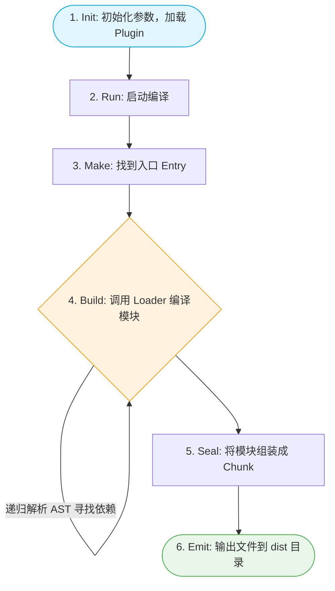
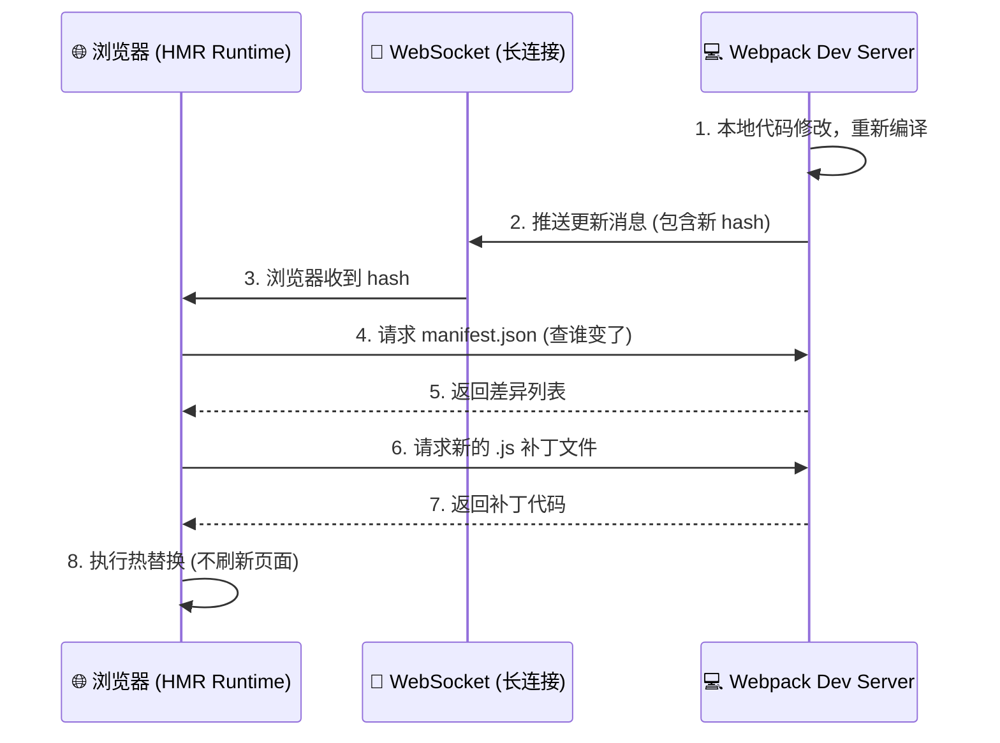
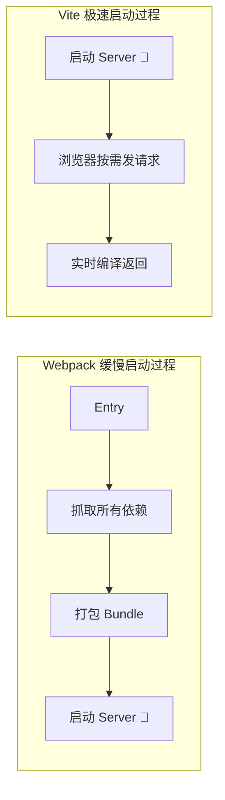
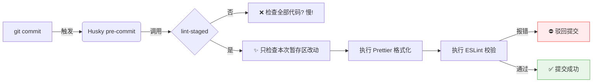
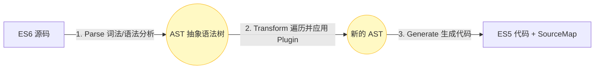

---

# 🚀 前端工程化核心面试题库（图解版）

> **💡 面试官视角**：前端工程化考察的是你如何运用工具、规范和架构思维，解决团队开发中的 **效率（快）**、**质量（好）** 和 **性能（优）** 问题。

---

## 📑 目录

* 📦 [1. 模块化规范](#-1-模块化规范)
* ⚙️ [2. 构建基石：Webpack](#️-2-构建基石webpack)
* ⚡ [3. 极速构建：Vite 与 Rollup](#-3-极速构建vite-与-rollup)
* 🗂️ [4. 包管理演进：npm / yarn / pnpm](#️-4-包管理演进npm--yarn--pnpm)
* 🛡️ [5. 代码规范与自动化](#️-5-代码规范与自动化)
* 🧬 [6. Babel 编译原理](#-6-babel-编译原理)
* ☁️ [7. CI/CD 与高阶部署](#️-7-cicd-与高阶部署)

---

## 📦 1. 模块化规范

### Q1: CommonJS 和 ES Module 的核心区别？
> 🔑 **一句话总结**：CJS 是运行时的值的拷贝，ESM 是编译时的值的引用。

| 对比维度 | CommonJS (CJS) | ES Module (ESM) |
| :--- | :--- | :--- |
| **加载时机** | 🕒 **运行时加载**（同步），可写在 if 语句里 | 🛠️ **编译时加载**（静态），必须在文件顶层 |
| **导出机制** | 📄 导出值的 **浅拷贝**（内部变化不影响外部） | 🔗 导出值的 **动态引用**（内部变化外部同步） |
| **运行环境** | 🟢 Node.js（服务端为主） | 🌐 浏览器原生支持 + Node.js (v14+) |
| **`this` 指向** | 当前模块对象 | `undefined` |

### Q2: 为什么 Tree Shaking 必须依赖 ES Module？
因为 ESM 是**静态结构**。Webpack 在构建的 **AST（抽象语法树）分析阶段**，不需要执行代码，就能清楚地知道模块导入了哪些变量、又使用了哪些变量。
而 CJS 是动态引入的（`require(condition ? 'a' : 'b')`），打包工具在运行前无法确定依赖，因此不敢随便删代码。

---

## ⚙️ 2. 构建基石：Webpack

### Q1: Webpack 的核心工作流程是怎样的？
> 💡 核心：Webpack 本质上是一个模块打包机器，它递归地构建依赖图。



### Q2: Loader 和 Plugin 的区别？

| 对比项 | 🔌 Loader (加载器/转换器) | 🧩 Plugin (插件/扩展器) |
| :--- | :--- | :--- |
| **本质** | 纯函数（源码 `->` 结果） | 带有 `apply` 方法的类，基于事件流 |
| **作用** | 将非 JS 文件翻译成 Webpack 认识的模块 | 贯穿整个生命周期，执行打包优化、压缩、资源注入 |
| **举例** | `less-loader`, `babel-loader` | `HtmlWebpackPlugin`, `TerserPlugin` |
| **配置位置**| `module.rules` 数组中 | `plugins` 数组中 |

### Q3: 热更新（HMR）底层原理？


---

## ⚡ 3. 极速构建：Vite 与 Rollup

### Q1: 为什么 Vite 在开发环境比 Webpack 快那么多？
> 🔑 **一句话总结**：Webpack 是先打包再启动服务器，Vite 是先启动服务器，再按需编译。

**传统的 Webpack 模式 (Bundle)：**
必须抓取整个项目的路由和所有模块，递归构建出一整张依赖图，**全部打包编译后**才启动服务器。项目越大，启动越慢。

**Vite 的模式 (No-Bundle)：**
1. 利用现代浏览器原生支持的 `<script type="module">` 特性。
2. 浏览器直接请求源码，Vite 本地服务器 **按需拦截并处理** 请求（如遇到 `.vue` 编译成 `.js`），只编译当前屏幕需要的代码。



---

## 🗂️ 4. 包管理演进：npm / yarn / pnpm

### Q1: 什么是“幽灵依赖”？pnpm 是如何解决它的？
* **幽灵依赖的产生**：npm v3/yarn 为了解决嵌套地狱，将所有底层依赖**扁平化**提升到了顶层。导致你在 `package.json` 没声明的库（如某依赖底层的 `lodash`），在代码里也能偷偷被引入。一旦将来主依赖升级去掉了它，你的项目直接崩溃。
* **pnpm 的解法**：使用 **软链接（Symlink）** + **硬链接（Hardlink）**。全局存一份实体，本地 `node_modules` 保持严格的树状结构，不是你声明的包，你绝对无法引用。

**📂 目录结构对比：**
```text
🔴 危险的 npm/yarn 扁平化       🟢 安全的 pnpm 虚拟存储
node_modules/                   node_modules/
 ├─ express                      ├─ express ---> 软链指向 .pnpm/express@4.x
 ├─ debug (幽灵依赖👻)          └─ .pnpm/
 └─ ms    (幽灵依赖👻)              ├─ express@4.x/node_modules/express
                                 ├─ debug@2.x/node_modules/debug
                                 └─ ms@2.x/node_modules/ms
```

---

## 🛡️ 5. 代码规范与自动化

### Q1: 描述一下常规的 Git 自动化代码规范流水线？
为了防止开发人员将格式混乱、未过 ESLint 的代码提交到仓库，我们需要配置强制拦截机制：


> **📝 扩展**：结合 `Commitizen` 还可以规范提交信息（如 `feat: xxx`, `fix: xxx`），通过 `commit-msg` 钩子拦截不规范的 message。

---

## 🧬 6. Babel 编译原理

### Q1: Babel 是如何把 ES6 转成 ES5 的？
Babel 是一个典型的编译器，整个过程分为三大步（**解析 ➡️ 转换 ➡️ 生成**）：


> **⚠️ 易错点**：Babel 的配置中，`Plugin`（插件） 的执行顺序是**从前往后**，而 `Preset`（预设大礼包） 的执行顺序是**从后往前**！

---

## ☁️ 7. CI/CD 与高阶部署

### Q1: 静态资源部署为什么要带有 Hash 值（如 `app.3a8f.js`）？
这是前端性能优化的终极形态，结合 Nginx 实现了**强缓存最大化**：
1. **HTML 入口文件**：设置 `no-cache`（不强缓存），保证用户每次访问网页都能拿到最新的资源链接。
2. **JS/CSS/图片文件**：服务器配置长达 **1年** 的强缓存（`Cache-Control: max-age=31536000`）。
3. **更新机制**：因为 Webpack 配置了基于文件内容的 `ContentHash`。只要代码不改，Hash 不变，用户永久读取本地极速缓存；一旦我们改了代码重新打包，产生了新 Hash 的文件，HTML 会自动指向新文件，用户无缝拉取新代码，旧缓存自然作废。

### Q2: Vue/React 单页应用部署后，刷新页面为什么会报 404？怎么解决？
* **🔴 原因**：前端路由（如 `/user/profile`）是 JS 在本地模拟的。当你在该页面按下 F5 刷新时，浏览器会真拿着这个完整的路径去找服务器要物理文件。服务器静态目录下只有根目录的 `index.html`，没有这个目录，所以报 404。
* **🟢 解决**：配置 Nginx 的 `try_files`，实现路由兜底。

```nginx
server {
    listen 80;
    server_name myapp.com;

    location / {
        root /usr/share/nginx/html;
        index index.html;
        
        # 🔑 核心配置：
        # 按路径找文件 -> 找目录 -> 都不存在，则把 index.html 扔给前端
        # 然后由前端内部的 vue-router 接管路由解析！
        try_files $uri $uri/ /index.html; 
    }
}
```