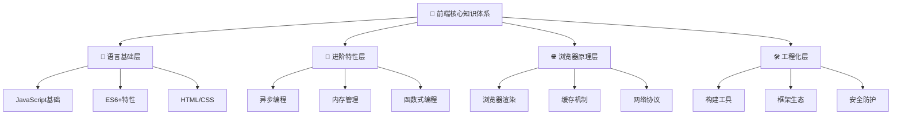
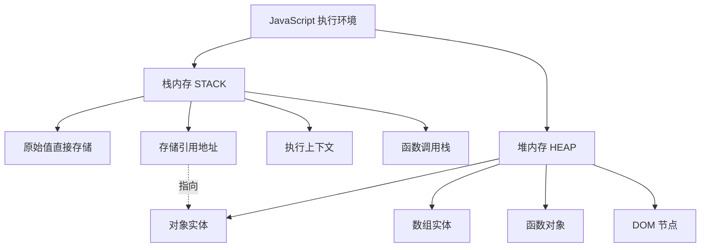
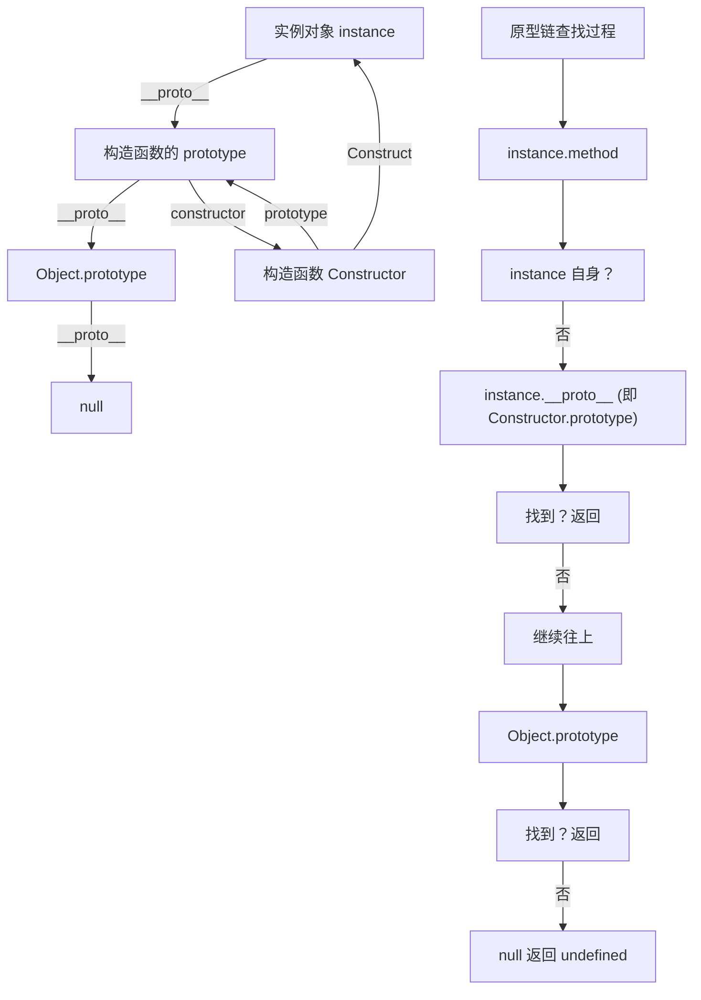
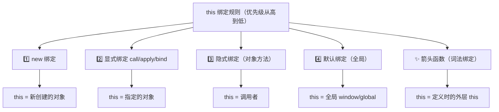
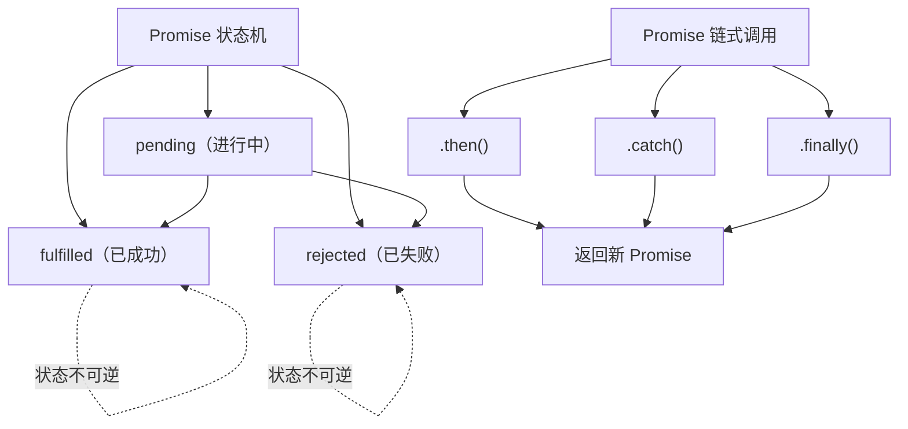
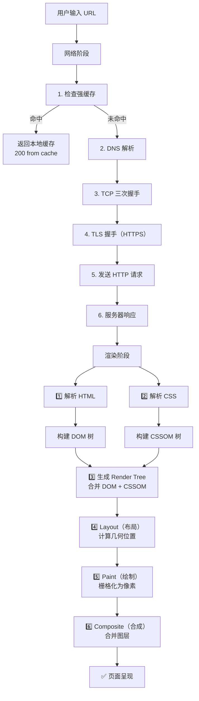
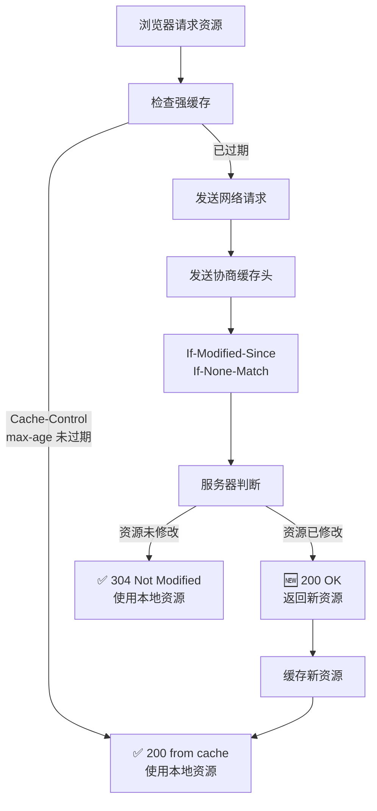
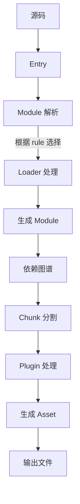
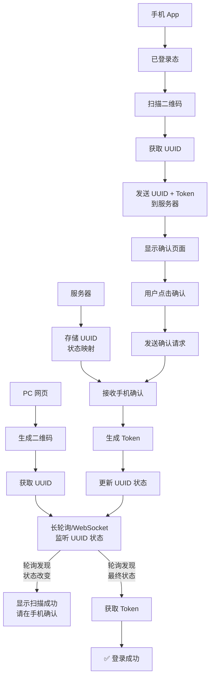

# 🎯 前端面试题库 - 深度详解版


---

## 📑 导航地图



---

## 第一部分：JavaScript 核心基础

### 🌟 重点难度系数：⭐⭐⭐

这一部分是所有前端开发的**基石**。掌握好这些基础概念，后续进阶才会游刃有余。

---

## 1️⃣ 基本类型系统详解

### 📌 题目：JavaScript 中的基本类型有哪些？各自如何存储？

#### 🎓 深度理解

```
JavaScript 类型系统（完整图谱）
┌─────────────────────────────────────────┐
│          所有类型                        │
├──────────────┬──────────────────────────┤
│  原始类型    │  引用类型                │
│  (Primitives)│  (References)           │
├──────────────┼──────────────────────────┤
│ • String     │ • Object (本质是所有)   │
│ • Number     │   ├─ Array             │
│ • Boolean    │   ├─ Function          │
│ • null       │   ├─ Date              │
│ • undefined  │   ├─ RegExp            │
│ • Symbol     │   ├─ Error             │
│ • BigInt     │   └─ 自定义对象        │
└──────────────┴──────────────────────────┘
```

#### 💾 内存模型



#### 💡 核心特性对比

| 特性 | 原始类型 | 引用类型 |
|------|--------|--------|
| **大小** | 固定，较小 | 可变，可能很大 |
| **存储位置** | 栈内存 | 堆内存（栈存引用） |
| **访问速度** | ⚡ 极快 | ⚠️ 相对慢 |
| **赋值行为** | 值拷贝 | 引用拷贝 |
| **相等判断** | 值相等 | 引用相等 |
| **垃圾回收** | 栈自动清理 | 引用计数为0时清理 |

#### 📍 代码示例

```typescript
// ✅ 原始类型：值存储在栈
const a = 1;
const b = a;
b = 2;
console.log(a); // 1 (互不影响)

// ⚠️ 引用类型：引用存储在栈，实体在堆
const obj1 = { name: 'Alice' };
const obj2 = obj1;
obj2.name = 'Bob';
console.log(obj1.name); // 'Bob' (会相互影响)

// 深层理解
const arr = [1, 2, 3];
// arr 变量 → 栈内存中存储一个地址 → 指向堆内存中的数组实体
// 修改数组内容会改变堆内存的数据，但不改变栈中的地址
arr[0] = 99; // ✅ 合法
arr = [4, 5, 6]; // ❌ const 不允许改变栈中的引用
```

---

## 2️⃣ 浮点数精度问题（IEEE 754）

### 📌 题目：0.1 + 0.2 为什么不等于 0.3？如何解决？

#### 🎓 深度理解

```
IEEE 754 双精度浮点数表示（64位）
┌────────────────────────────────────────────┐
│ 浮点数 = 符号位(1) + 指数位(11) + 尾数(52) │
└────────────────────────────────────────────┘

问题根源：十进制 → 二进制转换时的精度丢失

0.1 十进制 → 二进制？
0.1 × 2 = 0.2  (小数点后取 0)
0.2 × 2 = 0.4  (取 0)
0.4 × 2 = 0.8  (取 0)
0.8 × 2 = 1.6  (取 1) ← 进位
0.6 × 2 = 1.2  (取 1) ← 进位
... (循环往复，无限不循环)

结果：0.1 = 0.0001100110011... (二进制)

由于尾数位只有 52 位，超过部分被截断，导致精度丢失。
```

#### 💡 解决方案

```typescript
// ❌ 问题代码
console.log(0.1 + 0.2 === 0.3); // false
console.log(0.1 + 0.2); // 0.30000000000000004

// ✅ 方案 1: 使用 Number.EPSILON（最小精度值）
function isEqual(a: number, b: number): boolean {
  return Math.abs(a - b) < Number.EPSILON;
}
console.log(isEqual(0.1 + 0.2, 0.3)); // true

// ✅ 方案 2: 转整数计算
function add(a: number, b: number): number {
  const maxDecimals = Math.max(
    (a.toString().split('.')[1] || '').length,
    (b.toString().split('.')[1] || '').length
  );
  const factor = Math.pow(10, maxDecimals);
  return (a * factor + b * factor) / factor;
}
console.log(add(0.1, 0.2) === 0.3); // true

// ✅ 方案 3: 使用高精度库（生产推荐）
import Decimal from 'decimal.js';
const result = new Decimal(0.1).plus(new Decimal(0.2));
console.log(result.toString()); // "0.3"
```

#### 📊 精度问题示例

| 表达式 | 结果 | 期望 | 差异 |
|-------|------|------|------|
| `0.1 + 0.2` | `0.30000000000000004` | `0.3` | ❌ |
| `0.3 - 0.1` | `0.19999999999999998` | `0.2` | ❌ |
| `1 / 3` | `0.3333333333333333` | `0.333...` | ⚠️ |
| `Math.max(...100000000, 1)` | `Infinity` | `100000000` | ❌ |

---

## 3️⃣ 原型与原型链

### 📌 题目：什么是原型？原型链如何工作？

#### 🎓 深度理解



#### 💡 核心概念

```typescript
// 📍 构造函数、原型、实例的三角关系
function Animal(name: string) {
  this.name = name;
}

// 1️⃣ 构造函数的 prototype 属性指向原型对象
Animal.prototype.speak = function() {
  console.log(`${this.name} makes a sound`);
};

// 2️⃣ 创建实例
const dog = new Animal('Dog');

// 3️⃣ 实例的 __proto__ 指向构造函数的 prototype
console.log(dog.__proto__ === Animal.prototype); // true
console.log(dog.__proto__.constructor === Animal); // true

// 4️⃣ 原型链查找
console.log(dog.name); // 'Dog' (自身属性)
console.log(dog.speak); // ƒ (原型方法)
console.log(dog.toString); // ƒ (Object.prototype 方法)

// 5️⃣ 完整的原型链
console.log(dog.__proto__.__proto__ === Object.prototype); // true
console.log(Object.prototype.__proto__); // null (原型链终点)
```

#### 📊 ES5 vs ES6 继承对比

```typescript
// ❌ ES5 原型链继承（繁琐）
function Animal(name: string) {
  this.name = name;
}
Animal.prototype.speak = function() {
  console.log('Animal speaks');
};

function Dog(name: string, breed: string) {
  Animal.call(this, name); // 继承属性
  this.breed = breed;
}
Dog.prototype = Object.create(Animal.prototype); // 继承原型
Dog.prototype.constructor = Dog;
Dog.prototype.bark = function() {
  console.log('Woof');
};

// ✅ ES6 class 继承（简洁）
class Animal {
  name: string;
  constructor(name: string) {
    this.name = name;
  }
  speak() {
    console.log('Animal speaks');
  }
}

class Dog extends Animal {
  breed: string;
  constructor(name: string, breed: string) {
    super(name);
    this.breed = breed;
  }
  bark() {
    console.log('Woof');
  }
}

const dog = new Dog('Buddy', 'Golden');
```

---

## 4️⃣ 闭包与内存管理

### 📌 题目：什么是闭包？有哪些实际应用？

#### 🎓 深度理解

```
闭包形成的条件
┌─────────────────────────┐
│ 必须满足所有条件        │
├─────────────────────────┤
│ 1️⃣ 存在嵌套函数         │
│ 2️⃣ 内层函数引用外层变量 │
│ 3️⃣ 外层函数返回内层函数 │
└─────────────────────────┘

闭包的关键性质：
• 外层函数的局部变量被保存在内存中
• 垃圾回收机制不会清理这些变量
• 形成私有作用域，变量无法直接访问
```

#### 💡 经典应用场景

```typescript
// 📍 场景 1: 数据私有化
function createCounter() {
  let count = 0; // 私有变量
  
  return {
    increment: () => ++count,
    decrement: () => --count,
    getCount: () => count
  };
}

const counter = createCounter();
counter.increment(); // 1
counter.increment(); // 2
console.log(counter.getCount()); // 2
// ✅ count 无法直接访问，只能通过方法修改

// 📍 场景 2: 柯里化（分步传参）
function curry(fn: Function) {
  return function curried(...args: any[]) {
    if (args.length >= fn.length) {
      return fn(...args);
    }
    return (...nextArgs: any[]) => curried(...args, ...nextArgs);
  };
}

const add = (a: number, b: number, c: number) => a + b + c;
const curriedAdd = curry(add);
console.log(curriedAdd(1)(2)(3)); // 6
console.log(curriedAdd(1, 2)(3)); // 6 (灵活)

// 📍 场景 3: 防抖函数
function debounce(fn: Function, delay: number) {
  let timer: NodeJS.Timeout | null = null; // 闭包变量
  
  return function debounced(...args: any[]) {
    if (timer) clearTimeout(timer);
    timer = setTimeout(() => {
      fn(...args);
      timer = null;
    }, delay);
  };
}

const searchInput = debounce((query) => {
  console.log('Searching for:', query);
}, 500);

// 📍 场景 4: 模块化（IIFE）
const module = (function() {
  const privateVar = 'secret';
  
  return {
    publicMethod: () => console.log('Public'),
    getPrivate: () => privateVar
  };
})();
// ✅ privateVar 无法从外部访问
```

#### ⚠️ 闭包与内存泄漏

```typescript
// ❌ 常见内存泄漏案例 1: 未清理的闭包
function attachListeners() {
  const largeData = new Array(1000000).fill('data');
  
  document.getElementById('btn')?.addEventListener('click', () => {
    console.log(largeData[0]); // 闭包引用了 largeData
  });
  // largeData 永远不会被垃圾回收，即使不使用
}

// ✅ 解决方案
function attachListenersFixed() {
  const largeData = new Array(1000000).fill('data');
  const firstItem = largeData[0];
  
  const handler = () => console.log(firstItem);
  
  const button = document.getElementById('btn');
  button?.addEventListener('click', handler);
  
  // 适当时候清理
  button?.addEventListener('click', function cleanup() {
    button.removeEventListener('click', handler);
  });
}
```

---

## 5️⃣ this 绑定与箭头函数

### 📌 题目：this 的四种绑定方式？箭头函数为何特殊？

#### 🎓 深度理解



#### 💡 四种绑定详解

```typescript
// 1️⃣ 默认绑定（全局）
function hello() {
  console.log(this); // window (非严格) or undefined (严格)
}
hello();

// 2️⃣ 隐式绑定（对象方法）
const obj = {
  name: 'Alice',
  greet() {
    console.log(this.name); // 'Alice' (this = obj)
  }
};
obj.greet(); // ✅

// ⚠️ 隐式绑定丢失
const greet = obj.greet;
greet(); // this = window, undefined.name 报错❌

// 3️⃣ 显式绑定
function introduce(greeting: string) {
  console.log(`${greeting}, I'm ${this.name}`);
}

introduce.call({ name: 'Bob' }, 'Hi'); // "Hi, I'm Bob"
introduce.apply({ name: 'Charlie' }, ['Hello']); // "Hello, I'm Charlie"

const boundIntroduce = introduce.bind({ name: 'David' });
boundIntroduce('Hey'); // "Hey, I'm David"

// 4️⃣ new 绑定
class Person {
  name: string;
  constructor(name: string) {
    this.name = name; // this = 新创建的对象
  }
}
const person = new Person('Eve'); // ✅

// ✨ 箭头函数（不遵循上述规则）
const arrowObj = {
  name: 'Alice',
  greet: () => {
    console.log(this); // this = 定义时的外层 this（全局）
  }
};
arrowObj.greet(); // window 或 global，而不是 arrowObj ❌

// ✅ 箭头函数的优势场景
class Counter {
  count = 0;
  
  increment() {
    // 传递给 setTimeout 时，箭头函数保证 this 不丢失
    setTimeout(() => {
      this.count++; // ✅ this = Counter 实例
    }, 1000);
  }
}

const counter = new Counter();
counter.increment();
```

#### 📊 this 绑定优先级

| 场景 | this 值 | 可被覆盖 |
|------|--------|--------|
| `obj.method()` | obj | ✅ call/apply/bind |
| `func.call(obj)` | obj | ⚠️ 箭头函数不可改 |
| `new Class()` | 新对象 | ❌ |
| 箭头函数 | 词法 this | ❌ 无法改 |
| 严格模式全局 | undefined | ✅ call/apply/bind |

---

## 第二部分：异步编程与事件循环

### 🌟 重点难度系数：⭐⭐⭐⭐

这是前端面试的**必考重点**，也是最容易出错的地方。

---

## 6️⃣ Promise 深度解析

### 📌 题目：Promise 的三种状态、链式调用、错误处理？

#### 🎓 深度理解



#### 💡 Promise 核心机制

```typescript
// 📍 Promise 的三种状态
const promise1 = new Promise((resolve, reject) => {
  // pending 状态，等待处理
});

const promise2 = new Promise((resolve) => {
  resolve('Success!');
  // 状态立即变为 fulfilled，无法再改变
  resolve('Another value'); // 此调用无效
});

const promise3 = new Promise((resolve, reject) => {
  reject('Error!');
  resolve('Won\'t run'); // 此调用无效
  // 状态为 rejected
});

// 📍 .then() 链式调用的细节
fetch('/api/data')
  .then(response => response.json()) // 返回 Promise<JSON>
  .then(data => {
    console.log(data);
    return data.id; // 返回普通值，会被包装成 Promise
  })
  .then(id => {
    console.log('User ID:', id);
    // 隐式返回 undefined，被包装成 Promise<undefined>
  })
  .catch(error => {
    console.error('Error:', error);
    return 'Default value'; // 错误处理后可恢复
  })
  .finally(() => {
    console.log('请求完成'); // 无论成功失败都执行
  });

// 📍 .catch() 的错误穿透原理
fetch('/api/data')
  .then(r => r.json()) // ❌ 若 fetch 出错
  .then(data => console.log(data)) // ⏭️ 跳过
  .then(data => console.log('Still skipped')) // ⏭️ 跳过
  .catch(err => console.error(err)) // ✅ 在这里捕获
  .then(() => console.log('恢复正常')); // ✅ 继续执行

// 📍 Promise 值穿透
Promise.resolve(1)
  .then() // 无回调，值穿透
  .then(val => console.log(val)); // 1 (值被传递)

// 📍 常见错误：多层 .then() 嵌套
// ❌ 不推荐的金字塔写法
fetch('/url1')
  .then(res1 => {
    return fetch('/url2').then(res2 => {
      return fetch('/url3').then(res3 => {
        return [res1, res2, res3];
      });
    });
  });

// ✅ 改进：利用闭包
fetch('/url1')
  .then(res1 => fetch('/url2')
    .then(res2 => [res1, res2])
  )
  .then(([res1, res2]) => fetch('/url3')
    .then(res3 => [res1, res2, res3])
  );

// ✅ 最佳：使用 Promise.all()
Promise.all([
  fetch('/url1'),
  fetch('/url2'),
  fetch('/url3')
])
  .then(([res1, res2, res3]) => {
    return Promise.all([res1.json(), res2.json(), res3.json()]);
  })
  .then(([data1, data2, data3]) => {
    console.log(data1, data2, data3);
  });
```

#### 📊 Promise 相关的静态方法

| 方法 | 功能 | 返回 |
|------|------|------|
| `Promise.resolve(val)` | 快速创建已解决的 Promise | `Promise<val>` |
| `Promise.reject(reason)` | 快速创建已拒绝的 Promise | `Promise<rejected>` |
| `Promise.all(iterable)` | 所有都成功才成功 | `Promise<Array>` |
| `Promise.race(iterable)` | 第一个完成就返回 | `Promise<>` |
| `Promise.allSettled(iterable)` | 等待所有，返回结果数组 | `Promise<Array>` |
| `Promise.any(iterable)` | 第一个成功就返回 | `Promise<>` |

---

## 7️⃣ 事件循环（Event Loop）

### 📌 题目：宏任务、微任务、执行顺序详解？

#### 🎓 深度理解

```
事件循环工作流程
┌──────────────────────────────────────────────┐
│ 1️⃣ 执行栈：执行一个宏任务（初始：整个 script） │
├──────────────────────────────────────────────┤
│ 2️⃣ 微任务队列：清空所有微任务                 │
├──────────────────────────────────────────────┤
│ 3️⃣ 检查是否需要重排/重绘                      │
├──────────────────────────────────────────────┤
│ 4️⃣ 从宏任务队列取一个任务，回到 1️⃣          │
└──────────────────────────────────────────────┘

宏任务队列 vs 微任务队列
┌──────────────────┬──────────────────┐
│    宏任务        │     微任务       │
├──────────────────┼──────────────────┤
│ • script         │ • Promise.then   │
│ • setTimeout     │ • Promise.catch  │
│ • setInterval    │ • Promise.finally│
│ • requestAnimFrame│ • MutationObserver
│ • I/O 操作       │ • process.nextTick
│ • UI 事件        │ • queueMicrotask
└──────────────────┴──────────────────┘
```

#### 💡 事件循环详解

```typescript
// 经典事件循环题目
console.log('script start');

setTimeout(() => {
  console.log('setTimeout 0');
}, 0);

Promise.resolve()
  .then(() => {
    console.log('Promise 1');
    setTimeout(() => {
      console.log('setTimeout in Promise');
    }, 0);
  })
  .then(() => {
    console.log('Promise 2');
  });

console.log('script end');

// 执行顺序（逐步分析）
/*
第一步：执行 script（宏任务）
┌─ console.log('script start')         ✅ 输出：script start
├─ setTimeout 加入宏任务队列            ⏳ 
├─ Promise.then 加入微任务队列          ⏳
└─ console.log('script end')            ✅ 输出：script end

第二步：清空微任务队列
┌─ 执行第一个 .then()
├─ console.log('Promise 1')             ✅ 输出：Promise 1
├─ setTimeout 加入宏任务队列            ⏳
├─ 执行第二个 .then()
└─ console.log('Promise 2')             ✅ 输出：Promise 2

第三步：执行宏任务队列中第一个 setTimeout
└─ console.log('setTimeout 0')          ✅ 输出：setTimeout 0

第四步：清空微任务队列（现为空）

第五步：执行宏任务队列中第二个 setTimeout
└─ console.log('setTimeout in Promise')  ✅ 输出：setTimeout in Promise

完整输出顺序：
1. script start
2. script end
3. Promise 1
4. Promise 2
5. setTimeout 0
6. setTimeout in Promise
*/

// 更复杂的例子
console.log('开始');

setTimeout(() => console.log('A'), 0);

Promise.resolve()
  .then(() => {
    console.log('B');
    Promise.resolve().then(() => console.log('C'));
  })
  .then(() => console.log('D'));

console.log('结束');

// 输出：开始 → 结束 → B → C → D → A
// 原因：微任务中产生的新微任务在本轮继续清空
```

---

## 8️⃣ async/await 实战

### 📌 题目：async/await 如何简化异步代码？错误处理？

#### 💡 async/await 原理与实践

```typescript
// 📍 async/await 的本质是 Promise 的语法糖
// async 函数返回一个 Promise
// await 等待 Promise 解决，返回其值

async function fetchUserData() {
  try {
    const response = await fetch('/api/user');
    
    // 等价于：
    // .then(response => {
    
    if (!response.ok) {
      throw new Error(`HTTP ${response.status}`);
    }
    
    const data = await response.json();
    console.log(data);
    return data;
    
  } catch (error) {
    console.error('错误:', error);
    throw error; // 重新抛出给上层
  } finally {
    console.log('请求完成');
  }
}

// 使用
fetchUserData().then(console.log).catch(console.error);

// 📍 并发控制
async function concurrentRequests() {
  // ❌ 顺序执行（慢）
  const result1 = await fetch('/api/1');
  const result2 = await fetch('/api/2');
  
  // ✅ 并发执行（快）
  const [res1, res2] = await Promise.all([
    fetch('/api/1'),
    fetch('/api/2')
  ]);
  
  // ✅ 带超时的 Promise
  const raceWithTimeout = (promise, timeout) => {
    return Promise.race([
      promise,
      new Promise((_, reject) =>
        setTimeout(() => reject(new Error('Timeout')), timeout)
      )
    ]);
  };
  
  try {
    const result = await raceWithTimeout(
      fetch('/api/data'),
      5000
    );
  } catch (err) {
    console.error('请求超时或失败');
  }
}

// 📍 顺序异步操作
async function sequentialOperations() {
  try {
    const user = await fetchUser(1);
    const posts = await fetchPosts(user.id);
    const comments = await fetchComments(posts[0].id);
    return { user, posts, comments };
  } catch (error) {
    console.error('操作失败:', error);
  }
}

// 📍 错误处理最佳实践
async function robustFetch(url: string, retries = 3) {
  for (let i = 0; i < retries; i++) {
    try {
      const response = await fetch(url);
      if (!response.ok) throw new Error(`HTTP ${response.status}`);
      return response.json();
    } catch (error) {
      if (i === retries - 1) throw error; // 最后一次失败时抛出
      await new Promise(resolve => setTimeout(resolve, 1000)); // 延迟重试
      console.log(`重试 ${i + 1}/${retries}`);
    }
  }
}
```

---

## 第三部分：浏览器原理与性能优化

### 🌟 重点难度系数：⭐⭐⭐⭐

这一部分涉及**渲染管线、缓存策略、网络协议**等，是大厂重点考察的内容。

---

## 9️⃣ 关键渲染路径（Critical Rendering Path）

### 📌 题目：从输入 URL 到页面呈现经历了什么？

#### 🎓 完整流程图



#### 💡 渲染优化策略

```typescript
// 📍 优化 1: 减少阻塞
// ❌ CSS 阻塞 DOM 解析
<head>
  <link rel="stylesheet" href="style.css"> <!-- 会阻塞 -->
</head>

// ✅ 异步加载非关键 CSS
<link rel="stylesheet" href="theme.css" media="print"
  onload="this.media='all'">

// 📍 优化 2: 脚本加载策略
// ❌ 脚本阻塞 DOM 解析
<body>
  <script src="app.js"></script> <!-- 会等待下载和执行 -->
</body>

// ✅ defer: 下载不阻塞，执行延迟到 DOM 解析后
<script src="app.js" defer></script>

// ✅ async: 下载不阻塞，下载完立即执行
<script src="analytics.js" async></script>

// 📍 优化 3: 减少重排重绘
// ❌ 频繁修改样式（多次重排）
for (let i = 0; i < 1000; i++) {
  element.style.left = i + 'px'; // 每次都触发 reflow
}

// ✅ 使用 transform（不触发 reflow，由 GPU 加速）
element.style.transform = `translateX(1000px)`;

// ✅ 批量修改 DOM（一次重排）
const fragment = document.createDocumentFragment();
for (let i = 0; i < 1000; i++) {
  const li = document.createElement('li');
  li.textContent = i;
  fragment.appendChild(li);
}
list.appendChild(fragment);

// 📍 优化 4: 虚拟滚动（处理长列表）
class VirtualList {
  containerHeight = 500;
  itemHeight = 50;
  visibleCount = Math.ceil(this.containerHeight / this.itemHeight);
  
  render(items: any[], scrollTop: number) {
    const startIndex = Math.floor(scrollTop / this.itemHeight);
    const endIndex = Math.min(
      startIndex + this.visibleCount,
      items.length
    );
    
    // 只渲染可见区域的 DOM
    return items.slice(startIndex, endIndex);
  }
}

// 📍 优化 5: 懒加载
const imageObserver = new IntersectionObserver((entries) => {
  entries.forEach(entry => {
    if (entry.isIntersecting) {
      const img = entry.target as HTMLImageElement;
      img.src = img.dataset.src;
      imageObserver.unobserve(img);
    }
  });
});

document.querySelectorAll('img[data-src]').forEach(img => {
  imageObserver.observe(img);
});
```

---

## 🔟 重排（Reflow）vs 重绘（Repaint）

### 📌 题目：何时触发？如何避免？

#### 💡 触发条件详解

```typescript
// 📍 导致重排的操作（代价最高）
element.offsetHeight; // 读取会刷新渲染队列
element.style.width = '100px'; // 修改会触发 reflow
element.style.height = '100px'; // 又一个 reflow
// 结果：两次重排！

// ✅ 优化：批量修改
element.classList.add('new-size'); // 一次 reflow

// ✅ 优化：使用 transform（不触发 reflow）
element.style.transform = 'scale(1.1)'; // 只触发 composite

// 📍 操作 DOM 时的最佳实践
// ❌ 多个小操作
const list = document.getElementById('list');
for (let i = 0; i < 100; i++) {
  list.innerHTML += `<li>${i}</li>`; // 100 次 reflow！
}

// ✅ 集中操作
const html = Array.from({ length: 100 }, (_, i) => `<li>${i}</li>`).join('');
list.innerHTML = html; // 1 次 reflow

// ✅ 使用 DocumentFragment
const fragment = document.createDocumentFragment();
for (let i = 0; i < 100; i++) {
  const li = document.createElement('li');
  li.textContent = i;
  fragment.appendChild(li);
}
list.appendChild(fragment); // 1 次 reflow
```

| 操作类型 | 是否触发重排 | 是否触发重绘 | 代价 |
|---------|-----------|----------|------|
| 修改布局（width/height/left/top） | ✅ | ✅ | 🔴 极高 |
| 修改外观（color/background） | ❌ | ✅ | 🟡 中等 |
| 使用 transform | ❌ | ❌ | 🟢 极低 |
| 读取 offsetHeight | ✅ | ❌ | 🔴 极高 |
| 批量修改 class | ✅ | ✅ | 🟡 一次 |

---

## 1️⃣1️⃣ 浏览器缓存机制

### 📌 题目：强缓存、协商缓存、缓存策略？

#### 🎓 缓存流程图



#### 💡 缓存头详解

```typescript
// 📍 强缓存（优先级：Cache-Control > Expires）

// 过期时间相对（推荐）
// max-age=3600: 3600秒内使用缓存
Cache-Control: max-age=3600, public

// 过期时间绝对（废弃，兼容用）
// Expires: Wed, 22 Oct 2025 07:28:00 GMT

// 📍 协商缓存

// 基于修改时间（粒度：秒）
Last-Modified: Mon, 10 May 2024 09:28:00 GMT
If-Modified-Since: Mon, 10 May 2024 09:28:00 GMT
// 问题：无法精确到毫秒；文件重新生成但内容未变时会重新下载

// 基于文件哈希（推荐）
ETag: "33a64df551425fcc55e4d42a148795d9f25f89d4"
If-None-Match: "33a64df551425fcc55e4d42a148795d9f25f89d4"
// 优点：精确；缺点：计算成本高

// 📍 实际使用的缓存策略

// 🔴 HTML 文件（频繁更新）
// 不缓存或使用协商缓存
Cache-Control: no-cache, max-age=0
// 或
Cache-Control: must-revalidate

// 🟢 JS/CSS/图片（很少更新，但版本号会变）
// 长期缓存
Cache-Control: public, max-age=31536000 (一年)
// 通常与版本号结合使用：
// app.a1b2c3d4.js  → 版本号改变，重新下载

// 🟡 API 响应（可能立即过期）
// 短期缓存或不缓存
Cache-Control: no-cache
// 或使用 ETag 进行协商缓存

// 📍 代码实现：手动缓存管理
class CacheManager {
  static getCached(key: string) {
    const cached = localStorage.getItem(key);
    if (!cached) return null;
    
    const { data, expires } = JSON.parse(cached);
    if (Date.now() > expires) {
      localStorage.removeItem(key);
      return null;
    }
    return data;
  }
  
  static setCached(key: string, data: any, ttl = 3600) {
    localStorage.setItem(key, JSON.stringify({
      data,
      expires: Date.now() + ttl * 1000
    }));
  }
}

// 使用
const userId = CacheManager.getCached('user_data');
if (!userId) {
  const data = await fetch('/api/user').then(r => r.json());
  CacheManager.setCached('user_data', data, 300); // 5分钟缓存
}
```

---

## 第四部分：框架与工程化

### 🌟 重点难度系数：⭐⭐⭐⭐⭐

这是拉开候选人差距的部分，考察深度理解。

---

## 1️⃣2️⃣ 虚拟 DOM 与 Diff 算法

### 📌 题目：虚拟 DOM 为什么能优化性能？Diff 算法原理？

#### 🎓 虚拟 DOM 工作原理

```
虚拟 DOM 的价值（常见误解）
━━━━━━━━━━━━━━━━━━━━━━━━━━━━━
❌ 误解：虚拟 DOM 比原生 DOM 操作快
✅ 真相：虚拟 DOM 让你写更好的代码，
       框架在多数场景保证下限不低

虚拟 DOM 的核心优势
1️⃣ 声明式编程 → 命令式编程的抽象
2️⃣ 跨平台支持（React Native, Weex）
3️⃣ 批量更新（批处理多个状态变化）
4️⃣ 历史追踪（时间旅行调试）
```

#### 💡 Diff 算法详解

```typescript
// 📍 Vue 的快速 Diff 算法（Vue 3）
// 比起 React 的递归 Diff，Vue 采用更激进的优化

class VNode {
  type: string;
  props: any;
  children: VNode[];
}

function quickDiff(oldVdom: VNode, newVdom: VNode) {
  // 第一步：预处理
  // 如果两个 VNode 的 type 不同，直接替换
  if (oldVdom.type !== newVdom.type) {
    return '替换节点';
  }
  
  // 第二步：前置步骤（找相同的节点）
  let i = 0;
  while (i < oldVdom.children.length &&
         i < newVdom.children.length &&
         oldVdom.children[i].key === newVdom.children[i].key) {
    i++;
  }
  
  // 第三步：后置步骤（从末尾往前）
  let oldEnd = oldVdom.children.length - 1;
  let newEnd = newVdom.children.length - 1;
  while (oldEnd >= i && newEnd >= i &&
         oldVdom.children[oldEnd].key === newVdom.children[newEnd].key) {
    oldEnd--;
    newEnd--;
  }
  
  // 第四步：处理移动和新增/删除
  // ...（省略复杂的指针移动逻辑）
  
  return '需要打补丁的节点';
}

// 📍 React 的 Fiber 协调机制（React 16+）
// 相比同步 Diff，可中断的异步 Diff

interface Fiber {
  type: any;
  props: any;
  alternate: Fiber | null; // 旧 Fiber
  child: Fiber | null;
  sibling: Fiber | null;
  effectTag: 'PLACEMENT' | 'UPDATE' | 'DELETION';
}

// 可中断的工作
let nextUnitOfWork: Fiber | null = null;

function reconcile(fiber: Fiber) {
  // 1️⃣ 对比当前 Fiber 与旧 Fiber
  if (fiber.alternate) {
    diffProps(fiber, fiber.alternate);
  }
  
  // 2️⃣ 协调子元素
  if (fiber.child || fiber.sibling) {
    // ...递归处理
  }
}

// 利用时间分片，避免长时间阻塞主线程
function workLoop(deadline: IdleDeadline) {
  while (nextUnitOfWork && deadline.timeRemaining() > 1) {
    nextUnitOfWork = reconcile(nextUnitOfWork);
  }
  
  if (nextUnitOfWork) {
    // 还有工作未完成，继续
    requestIdleCallback(workLoop);
  } else {
    // 提交更新
    commit();
  }
}

// 📍 Key 属性的重要性
// ✅ 正确使用
<ul>
  {items.map(item => (
    <li key={item.id}>{item.name}</li>
  ))}
</ul>

// ❌ 错误使用（使用 index 作为 key）
// 当列表重新排序时，VNode 会错配
<ul>
  {items.map((item, index) => (
    <li key={index}>{item.name}</li>
  ))}
</ul>
// 导致：
// - 输入框等受控组件状态错乱
// - 动画混乱
// - 组件状态丢失
```

---

## 1️⃣3️⃣ Webpack 与构建优化

### 📌 题目：Loader 和 Plugin 的区别？Tree Shaking 原理？

#### 💡 Webpack 工作流程



#### 💡 Tree Shaking 深度理解

```typescript
// 📍 Tree Shaking 的前提：ESM（静态分析）

// math.js（导出多个函数）
export function add(a, b) {
  return a + b;
}

export function multiply(a, b) {
  return a * b;
}

export function unused() {
  return 'never used';
}

// app.js（只用到 add）
import { add } from './math.js';
console.log(add(1, 2));

// 编译结果：
// ✅ unused 函数被删除（Tree Shaking）
// ❌ 但 multiply 仍保留（副作用考虑）

// 📍 如何让 Tree Shaking 更激进

// package.json（声明无副作用）
{
  "sideEffects": false // 或 ["*.css", "*.scss"]
}

// webpack.config.js
{
  mode: 'production', // 自动启用 Tree Shaking
  optimization: {
    usedExports: true,
    sideEffects: true,
    minimize: true
  }
}

// 📍 CommonJS 为什么不能 Tree Shaking
// require 是动态的，无法静态分析
const { add } = require('./math.js');
// Webpack 无法确定哪些导出被使用，必须保留全部

// 📍 代码分割策略
{
  entry: {
    main: './src/index.js',
    vendor: './src/vendor.js' // 手动分割
  },
  
  output: {
    filename: '[name].[contenthash].js'
  },
  
  optimization: {
    splitChunks: {
      chunks: 'all',
      cacheGroups: {
        vendor: {
          test: /[\\/]node_modules[\\/]/,
          name: 'vendors',
          priority: 10
        },
        common: {
          minChunks: 2,
          priority: 5,
          reuseExistingChunk: true
        }
      }
    }
  }
}
```

---

## 第五部分：大厂高频面试题精选

### 🌟 难度系数：⭐⭐⭐⭐⭐

这些题目考察的是**综合能力**和**深度理解**。

---

## 1️⃣4️⃣ 经典题目解析

### 经典题 1：`['1', '2', '3'].map(parseInt)` 为什么返回 `[1, NaN, NaN]`？

#### 🎓 深度分析

```typescript
// 第一步：理解 map 的参数传递
// map(callback: (value, index, array) => any)

// 第二步：理解 parseInt 的签名
// parseInt(string, radix?)
// radix: 2-36 进制，0 或省略表示 10 进制

// 第三步：结合起来分析
['1', '2', '3'].map(parseInt)

// 等价于：
[
  parseInt('1', 0),   // 0 进制 = 10 进制 → 1
  parseInt('2', 1),   // 1 进制不存在 → NaN
  parseInt('3', 2)    // 3 不是二进制数字 → NaN
]

// 结果：[1, NaN, NaN]

// 🔧 修复方案
['1', '2', '3'].map(str => parseInt(str, 10));
// 或
['1', '2', '3'].map(Number);
// 结果：[1, 2, 3]
```

---

### 经典题 2：扫码登录的完整流程（阿里、腾讯高频）

#### 🎓 深度解析



#### 💡 代码实现

```typescript
// 📍 前端：PC 网页
class QRLoginManager {
  async initQRLogin() {
    // 1️⃣ 向服务器请求 UUID 和二维码
    const { uuid, qrCode } = await fetch('/api/auth/qr-init')
      .then(r => r.json());
    
    // 2️⃣ 显示二维码
    this.displayQRCode(qrCode);
    
    // 3️⃣ 开始长轮询监听
    await this.pollForLoginStatus(uuid);
  }
  
  private async pollForLoginStatus(uuid: string) {
    return new Promise((resolve, reject) => {
      const poll = async () => {
        try {
          const { status, token } = await fetch(
            `/api/auth/qr-check?uuid=${uuid}`
          ).then(r => r.json());
          
          switch (status) {
            case 'pending':
              // 继续轮询
              setTimeout(poll, 1000);
              break;
            case 'scanned':
              // 显示"请在手机上确认"
              this.showConfirmation();
              setTimeout(poll, 1000);
              break;
            case 'confirmed':
              // 登录成功
              localStorage.setItem('token', token);
              resolve(token);
              break;
            case 'expired':
              reject(new Error('二维码已过期'));
              break;
          }
        } catch (error) {
          reject(error);
        }
      };
      poll();
    });
  }
}

// 📍 后端：服务器
interface QRSession {
  uuid: string;
  status: 'pending' | 'scanned' | 'confirmed' | 'expired';
  userId?: number;
  createdAt: number;
}

const qrSessions = new Map<string, QRSession>();

// 初始化二维码
app.post('/api/auth/qr-init', (req, res) => {
  const uuid = generateUUID();
  qrSessions.set(uuid, {
    uuid,
    status: 'pending',
    createdAt: Date.now()
  });
  
  const qrCode = generateQRCode(
    `${APP_URL}/auth/mobile?uuid=${uuid}`
  );
  
  res.json({ uuid, qrCode });
});

// 检查二维码状态
app.get('/api/auth/qr-check', (req, res) => {
  const { uuid } = req.query;
  const session = qrSessions.get(uuid as string);
  
  if (!session) {
    return res.status(404).json({ error: 'QR expired' });
  }
  
  // 检查是否超期（5分钟）
  if (Date.now() - session.createdAt > 5 * 60 * 1000) {
    session.status = 'expired';
  }
  
  res.json({
    status: session.status,
    token: session.status === 'confirmed' ? generateToken(session.userId) : undefined
  });
});

// 📍 手机端：确认登录
app.post('/api/auth/qr-confirm', (req, res) => {
  const { uuid, token } = req.body;
  const userId = verifyToken(token);
  
  if (!userId) {
    return res.status(401).json({ error: 'Invalid token' });
  }
  
  const session = qrSessions.get(uuid);
  if (!session) {
    return res.status(404).json({ error: 'QR expired' });
  }
  
  // 更新会话状态
  session.status = 'confirmed';
  session.userId = userId;
  
  res.json({ success: true });
  
  // 30秒后清理
  setTimeout(() => qrSessions.delete(uuid), 30 * 1000);
});
```

---

## 总结与学习建议

### 🎯 学习路径

```
第一阶段（1-2周）：JavaScript 基础
├─ 数据类型与内存模型
├─ 原型与原型链
├─ 闭包与作用域
└─ this 与函数绑定

第二阶段（2-3周）：异步与事件循环
├─ Promise 详解
├─ 事件循环机制
├─ async/await 实战
└─ 错误处理

第三阶段（2-3周）：浏览器与性能
├─ 关键渲染路径
├─ 重排与重绘
├─ 缓存机制
└─ 性能指标

第四阶段（3-4周）：框架与工程化
├─ 响应式系统
├─ 虚拟 DOM 与 Diff
├─ Webpack 与构建
└─ 工程化最佳实践

第五阶段（1-2周）：系统复习 + 模拟面试
├─ 高频题目
├─ 综合场景题
├─ 项目经验总结
└─ 代码设计能力
```

### 📚 推荐资源

| 资源 | 推荐指数 | 备注 |
|------|--------|------|
| MDN Web Docs | ⭐⭐⭐⭐⭐ | 官方文档，最权威 |
| You Don't Know JS | ⭐⭐⭐⭐⭐ | 深度理解 JavaScript |
| JavaScript.info | ⭐⭐⭐⭐⭐ | 交互式教程 |
| 掘金技术社区 | ⭐⭐⭐⭐ | 国内优质技术文章 |
| LeetCode | ⭐⭐⭐⭐ | 算法与数据结构 |
| 牛客网 | ⭐⭐⭐⭐ | 面试真题库 |

### 💡 面试建议

```
1️⃣ 深度优于广度
   • 理解原理而非死记硬背
   • 能说出"为什么"而不只是"是什么"
   • 用代码演示而非口头描述

2️⃣ 准备充分
   • 准备 3-5 个项目经验讲解
   • 熟悉常见的代码笔试题
   • 做好系统设计的准备（高级职位）

3️⃣ 沟通清楚
   • 听题要听全，不要急着回答
   • 组织语言，逻辑清晰
   • 定期和面试官互动确认理解

4️⃣ 展示亮点
   • 讲述性能优化的具体实例
   • 展示系统思维和设计能力
   • 体现学习能力和解决问题的思路
```

