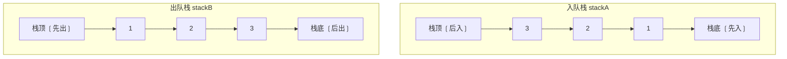
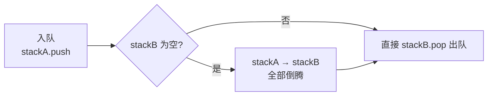

# 两个栈实现队列

## 简介

用两个"后进先出（LIFO）"的栈来模拟"先进先出（FIFO）"的队列操作。核心思路是使用两个栈倒腾数据——入队时压入 stackA，出队时将 stackA 的元素依次弹出并压入 stackB，这样 stackA 的栈底就变成了 stackB 的栈顶，从而实现先进先出。

## 数据结构示意图





## 代码实现

```javascript
/**
 * 题目：用两个栈实现队列
 * 描述：用两个栈模拟队列的"先进先出"操作。栈是后进先出，两个栈倒腾后即可实现队列效果。
 *
 * 解法思路：
 * - stackA 负责入队（push 操作）
 * - stackB 负责出队（pop 操作）
 * - 出队时，如果 stackB 为空，则将 stackA 所有元素依次弹出并压入 stackB
 * - 这样 stackA 的栈底元素就变成了 stackB 的栈顶，实现了先进先出
 * 时间复杂度：入队 O(1)，出队 均摊 O(1)；空间复杂度：O(n)
 */

/**
 * ES5 版本 - 构造函数 + 原型方法
 */
var CQueue = function () {
  this.stackA = []; // 入队栈
  this.stackB = []; // 出队栈
};

/**
 * 在队列尾部添加元素
 * @param {*} value
 */
CQueue.prototype.appendTail = function (value) {
  this.stackA.push(value);
};

/**
 * 删除队列头部元素并返回
 * @returns {*} 队列头部的值，队列为空返回 -1
 */
CQueue.prototype.deleteHead = function () {
  if (this.stackB.length) {
    return this.stackB.pop();
  } else {
    while (this.stackA.length) {
      this.stackB.push(this.stackA.pop());
    }
    if (!this.stackB.length) {
      return -1;
    } else {
      return this.stackB.pop();
    }
  }
};

/**
 * ES6 版本 - 使用 class 语法
 */
class Queue {
  constructor() {
    this.s1 = []; // 入队栈
    this.s2 = []; // 出队栈
  }

  /**
   * 入队操作
   * @param {*} item
   */
  enqueue(item) {
    this.s1.push(item);
  }

  /**
   * 出队操作
   * @returns {*} 队头元素，队列为空返回 -1
   */
  dequeue() {
    while (this.s1.length > 0) {
      this.s2.push(this.s1.pop());
    }
    if (!this.s2.length) {
      return -1;
    } else {
      return this.s2.pop();
    }
  }
}

const cQueue = new CQueue();
cQueue.appendTail(1);
cQueue.appendTail(2);

console.log(cQueue.deleteHead());
console.log(cQueue.deleteHead());
console.log(cQueue.deleteHead());
console.log(cQueue.deleteHead());

const queue = new Queue();
queue.enqueue(1);
queue.enqueue(2);
console.log(queue.dequeue());
console.log(queue.dequeue());
console.log(queue.dequeue());
console.log(queue.dequeue());
```

## 逐段解析

### 数据结构
- **stackA（s1）**：入队栈，所有新元素都 push 到这里
- **stackB（s2）**：出队栈，元素从这里 pop 实现出队

### `appendTail` / `enqueue`（入队）
直接将元素 push 到 stackA，时间复杂度 O(1)

### `deleteHead` / `dequeue`（出队）
- 如果 stackB 非空，直接从 stackB pop——O(1)
- 如果 stackB 为空，将 stackA 所有元素逐个 pop 并 push 到 stackB 中（倒腾），再从 stackB pop
- **均摊分析**：每个元素最多被倒腾一次（从 A 到 B），因此均摊 O(1)
- 队列为空时返回 `-1`

### 示例执行流程
```
入队 1, 2, 3：
stackA = [1, 2, 3]  (栈顶是 3)

出队：
stackA 倒腾到 stackB：stackB = [3, 2, 1] (栈顶是 1)
stackB.pop() → 1   ✅ 先进先出
```

## 复杂度分析

| 操作 | 时间复杂度 | 说明 |
|------|-----------|------|
| 入队 | O(1) | 直接 push |
| 出队 | 均摊 O(1) | 每个元素最多倒腾一次 |
| 空间 | O(n) | 两个栈总共存储 n 个元素 |

## 示例输入与输出

```javascript
const q = new CQueue();
q.appendTail(1);
q.appendTail(2);
q.appendTail(3);
console.log(q.deleteHead()); // 1
console.log(q.deleteHead()); // 2
console.log(q.deleteHead()); // 3
console.log(q.deleteHead()); // -1（队列为空）
```
