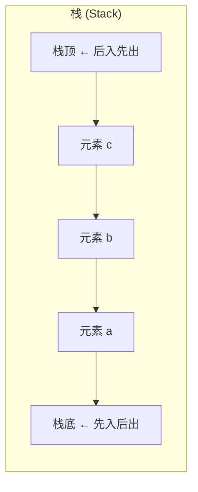
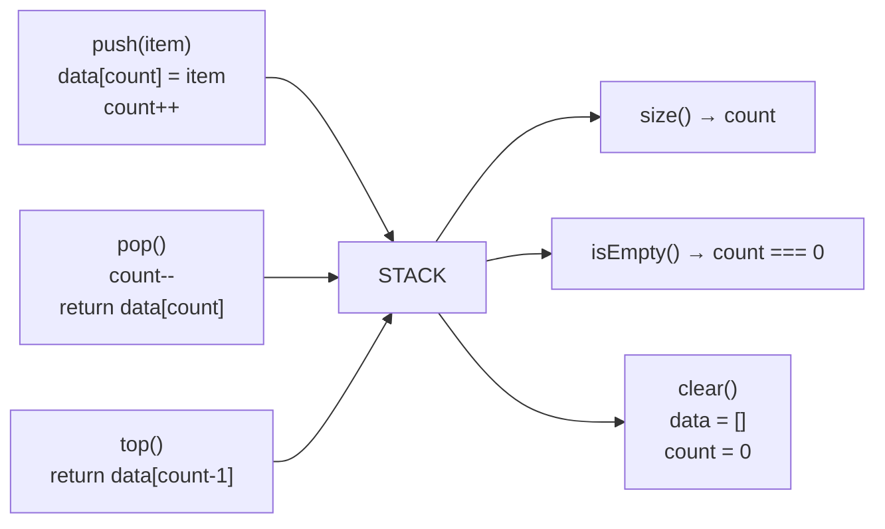

# 栈的实现

## 简介

栈（Stack）是一种遵循 **"后进先出（LIFO, Last In First Out）"** 原则的线性数据结构。就像一叠盘子——后放的盘子在最上面，最先被拿走。这里使用"数组 + 计数器"模式手动实现栈，避免直接依赖数组原生方法（如 `push/pop`），更深入理解栈的底层机制。

## 数据结构示意图





## 代码实现

```javascript
/**
 * 题目：栈的实现
 * 描述：自定义实现 Stack 数据结构，遵循"后进先出（LIFO）"原则。
 * 使用数组 + 计数器的模式实现，避免直接依赖数组原生方法。
 *
 * 栈的核心操作：
 * - push：入栈，将元素添加到栈顶
 * - pop：出栈，移除并返回栈顶元素
 * - top：查看栈顶元素（不删除）
 * - isEmpty：检测栈是否为空
 * - size：获取栈中元素个数
 * - clear：清空栈
 *
 * 时间复杂度：所有操作均为 O(1)；空间复杂度：O(n)
 */
class Stack {
  constructor() {
    /** 存储栈的数据 */
    this.data = [];
    /** 记录栈的元素个数（相当于 length） */
    this.count = 0;
  }

  /**
   * push - 入栈操作
   * 将元素添加到栈顶（即数组末尾）
   * @param {*} item 入栈的元素
   */
  push(item) {
    this.data[this.count] = item;
    this.count++;
  }

  /**
   * pop - 出栈操作
   * 移除并返回栈顶元素，栈为空时给出提示
   * @returns {*} 被移除的栈顶元素
   */
  pop() {
    if (this.isEmpty()) {
      console.log('栈为空！');
      return;
    }
    const temp = this.data[this.count - 1];
    delete this.data[--this.count];
    return temp;
  }

  /**
   * 检测栈是否为空
   * @returns {boolean}
   */
  isEmpty() {
    return this.count === 0;
  }

  /**
   * top - 获取栈顶值（不删除）
   * @returns {*} 栈顶元素
   */
  top() {
    if (this.isEmpty()) {
      console.log('栈为空！');
      return;
    }
    return this.data[this.count - 1];
  }

  /**
   * 获取栈中元素个数
   * @returns {number}
   */
  size() {
    return this.count;
  }

  /**
   * 清空栈
   */
  clear() {
    this.data = [];
    this.count = 0;
  }
}


const s = new Stack()
s.push('a')
s.push('b')
s.push('c')
console.log(s)
```

## 逐段解析

### `constructor` 构造函数
- `this.data = []`：用数组存储栈内元素
- `this.count = 0`：计数器，记录栈中元素个数，同时指向下一个空闲位置

### `push(item)` 入栈
- `this.data[this.count] = item`：将新元素放到当前 count 位置（即栈顶）
- `this.count++`：计数器加 1
- **不依赖 push 方法**，通过索引赋值实现

### `pop()` 出栈
- 先检查是否空栈
- `this.data[this.count - 1]` 获取栈顶元素
- `delete this.data[--this.count]`：count 先减 1，再删除该位置数据
- 返回被删除的栈顶元素

### `top()` 查看栈顶
- 通过 `this.data[this.count - 1]` 读取栈顶元素，但不删除
- 空栈时给出提示

### `isEmpty()` / `size()` / `clear()`
- `isEmpty`：判断 count 是否为 0
- `size`：直接返回 count
- `clear`：重置 data 和 count

## 复杂度分析

| 操作 | 时间复杂度 | 空间复杂度 |
|------|-----------|-----------|
| push | O(1) | O(1) |
| pop | O(1) | O(1) |
| top | O(1) | O(1) |
| isEmpty | O(1) | O(1) |
| size | O(1) | O(1) |
| clear | O(1) | O(1) |
| 整体 | - | O(n) |
