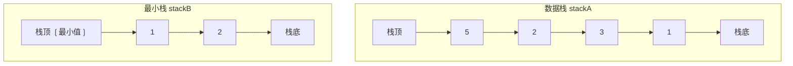
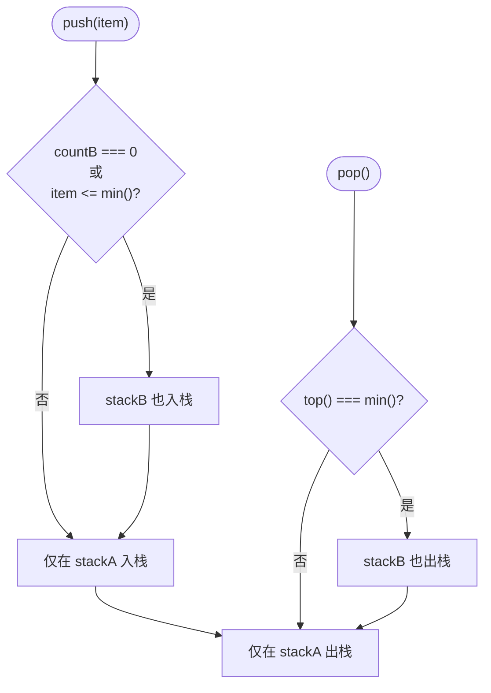

# 包含 min 函数的栈（最小栈）

## 简介

设计一个栈，除了常规的 `push`、`pop`、`top` 操作外，还需要在 **O(1) 时间内**获取栈中当前所有元素的最小值。使用 **辅助栈（最小栈）** 策略——一个数据栈正常存储，另一个最小栈降序存储最小值，保证最小栈的栈顶始终是当前全局最小值。

## 数据结构示意图





## 代码实现

```javascript
/**
 * 题目：包含 min 函数的栈（最小栈）
 * 描述：设计一个栈，除了支持常规的 push、pop、top 操作外，还支持在 O(1) 时间内获取栈中最小元素。
 *
 * 解法思路：使用"辅助栈"策略
 * - stackA（数据栈）：正常存储所有元素
 * - stackB（最小栈）：降序存储——每次入栈时，只有 <= stackB 栈顶的值才入 stackB
 * - 这样 stackB 的栈顶始终是当前所有元素的最小值
 * - 出栈时，如果出栈元素恰好是最小值，则 stackB 也出栈
 *
 * 时间复杂度：所有操作 O(1)；空间复杂度：O(n)
 */
class MinStack {
  constructor() {
    /** stackA 用于存储所有数据 */
    this.stackA = [];
    this.countA = 0;
    /** stackB 用于降序存储最小值（栈顶始终为最小值） */
    this.stackB = [];
    this.countB = 0;
  }

  /**
   * push - 入栈操作
   * @param {*} item 入栈元素
   */
  push(item) {
    this.stackA[this.countA++] = item;
    // 当前值 <= 已有最小值时，也压入 stackB
    if (this.countB === 0 || item <= this.min()) {
      this.stackB[this.countB++] = item;
    }
  }

  /**
   * 获取当前栈中的最小值
   * @returns {*} 最小值
   */
  min() {
    return this.stackB[this.countB - 1];
  }

  /**
   * top - 获取栈顶元素（不删除）
   * @returns {*} 栈顶元素
   */
  top() {
    return this.stackA[this.countA - 1];
  }

  /**
   * pop - 出栈操作
   * 如果出栈元素是当前最小值，则 stackB 也同步出栈
   */
  pop() {
    if (this.top() === this.min()) {
      delete this.stackB[--this.countB];
    }
    delete this.stackA[--this.countA];
  }
}

const m = new MinStack()
```

## 逐段解析

### 核心数据结构
- **stackA**（数据栈）：存储所有入栈元素
- **stackB**（最小栈）：降序存储最小值序列，栈顶始终是当前最小值

### `push(item)` 入栈
1. 元素先入 stackA：`stackA[countA++] = item`
2. 判断是否也入 stackB：如果 stackB 为空，或者当前值 **小于等于** stackB 栈顶（当前最小值），则也入 stackB
3. 这样 stackB 始终保持降序，栈顶即最小值

### `min()` 获取最小值
直接返回 `stackB[countB - 1]`——**O(1) 时间**

### `pop()` 出栈
1. 如果出栈元素刚好等于当前最小值（即 `top() === min()`），则 stackB 也要同步出栈
2. stackA 正常出栈

### 示例执行
```
push 3: stackA=[3], stackB=[3]        (min=3)
push 2: stackA=[3,2], stackB=[3,2]    (2<=3 → 入stackB, min=2)
push 5: stackA=[3,2,5], stackB=[3,2]  (5>2 → 不入stackB, min=2)
pop():   栈顶5 != min=2 → stackA=[3,2], stackB=[3,2]  (min=2)
pop():   栈顶2 == min=2 → stackA=[3], stackB=[3]      (min=3)
```

## 复杂度分析

| 操作 | 时间复杂度 | 说明 |
|------|-----------|------|
| push | O(1) | 常数次数组赋值 |
| pop | O(1) | 常数次删除操作 |
| top | O(1) | 直接索引访问 |
| min | O(1) | 直接取 stackB 栈顶 |
| 空间 | O(n) | stackA + stackB 最多 2n 个元素 |

## 示例输入与输出

```javascript
const m = new MinStack();
m.push(3);   // min=3
m.push(2);   // min=2
m.push(5);   // min=2
console.log(m.min()); // 2
m.pop();              // 弹出5，min=2
m.pop();              // 弹出2，min=3
console.log(m.min()); // 3
```
