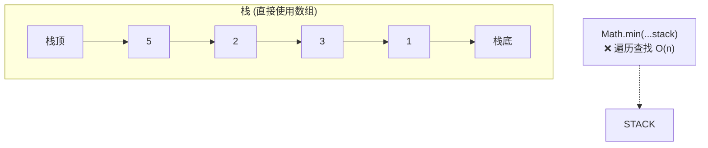
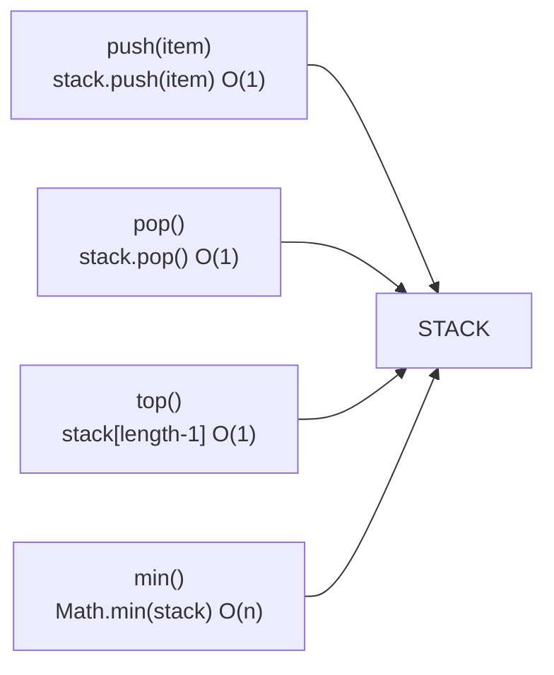

# 包含 min 函数的栈 - 数组方法版本

## 简介

这是"最小栈"的简化版，直接使用数组原生方法（`push` / `pop`）和 `Math.min` 遍历查找最小值。**注意**：此版本的 `min()` 时间复杂度为 O(n)，性能不如辅助栈版本，仅作为理解原理的对比参考。

## 数据结构示意图





## 代码实现

```javascript
/**
 * 题目：包含 min 函数的栈 - 数组方法版本
 * 描述：简化版最小栈，直接使用数组的 Math.min 遍历查找最小值。
 * 注意：此版本的 min() 时间复杂度为 O(n)，大数据量下效率较低。
 * 仅作为理解辅助栈原理的对比参考。
 *
 * 时间复杂度：push O(1)，pop O(1)，top O(1)，min O(n)
 * 空间复杂度：O(n)
 */
class MinStack {
  constructor() {
    this.stack = [];
  }

  /**
   * push - 入栈
   * @param {*} item
   */
  push(item) {
    this.stack.push(item);
  }

  /**
   * top - 获取栈顶值
   * @returns {*}
   */
  top() {
    return this.stack[this.stack.length - 1];
  }

  /**
   * min - 获取最小值（遍历查找，O(n) 复杂度）
   * @returns {number} 最小值
   */
  min() {
    return Math.min.apply(null, this.stack);
  }

  /**
   * pop - 出栈
   * @returns {*}
   */
  pop() {
    return this.stack.pop();
  }
}

const m = new MinStack()
```

## 逐段解析

### 与辅助栈版本的核心差异

| 特性 | 辅助栈版本 (02) | 数组方法版本 (03) |
|------|----------------|------------------|
| 数据结构 | stackA + stackB | 单一阵列 |
| push/pop 实现 | 索引赋值 | 原生 push/pop |
| min() 实现 | O(1) 取栈顶 | O(n) Math.min 遍历 |
| 适用场景 | 生产环境 | 教学/对比参考 |

### `min()` 的实现
- `Math.min.apply(null, this.stack)`：将数组元素展开传给 `Math.min`，遍历所有元素查找最小值
- 每次调用都要扫描整个数组，数据量大时性能差

### `push(item)`
直接调用数组原生 `push` 方法，将元素添加到栈顶

### `pop()`
直接调用数组原生 `pop` 方法，移除并返回栈顶元素

## 复杂度分析

| 操作 | 时间复杂度 | 说明 |
|------|-----------|------|
| push | O(1) | 数组尾部插入 |
| pop | O(1) | 数组尾部删除 |
| top | O(1) | 索引访问 |
| min | **O(n)** | 遍历整个数组 |
| 空间 | O(n) | 存储 n 个元素 |

> **建议**：实际开发中应使用辅助栈版本的 O(1) min 实现。
