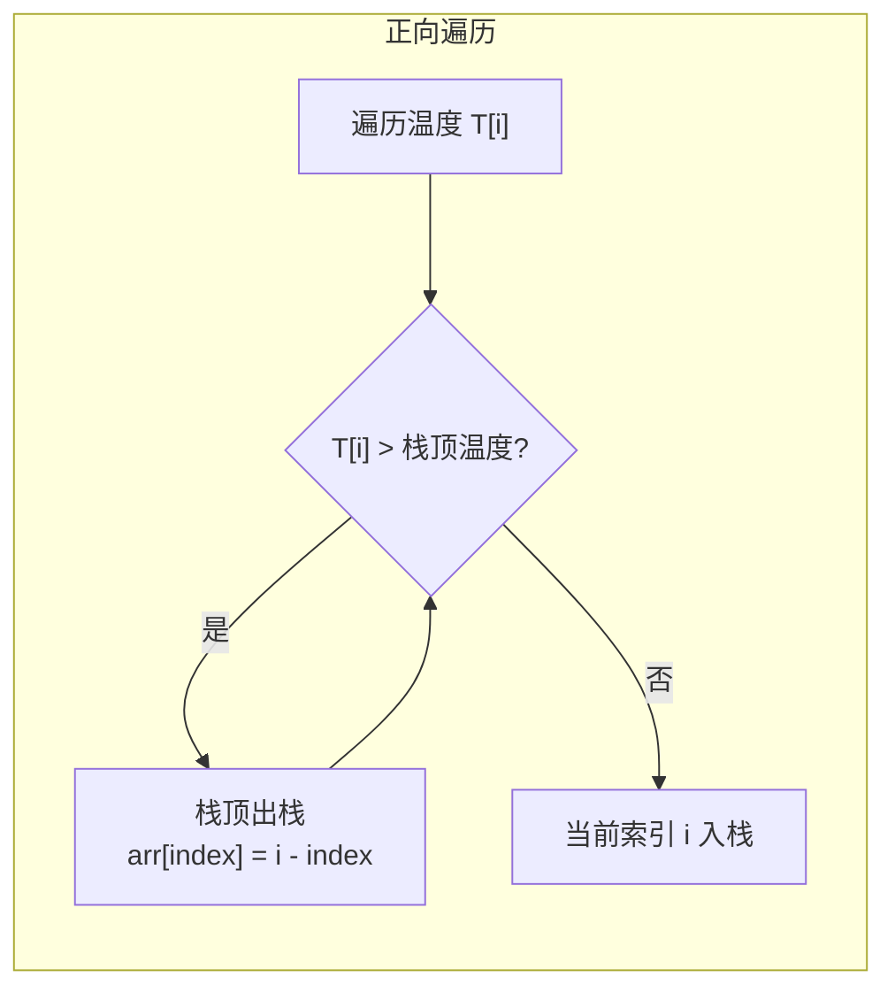
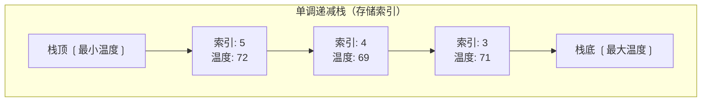

# 每日温度（LeetCode 739）

## 简介

给定每日温度数组 `T`，返回一个等长数组，每个位置表示需要等待多少天才能等到 **更高的温度**。如果之后没有更高的温度，用 0 填充。

**示例**：
```
T = [73, 74, 75, 71, 69, 72, 76, 73]
返回 [1, 1, 4, 2, 1, 1, 0, 0]

解释：
- 第0天73°C → 第1天74°C → 等待1天
- 第1天74°C → 第2天75°C → 等待1天
- 第2天75°C → 第6天76°C → 等待4天
- ...
```

核心解法：**单调栈（Monotonic Stack）**——维护一个递减栈，遇到更高温度时出栈并计算结果。

## 数据结构示意图





## 代码实现

```javascript
/**
 * 题目：每日温度（LeetCode 739）
 * 描述：给定每日温度的数组 T，返回一个等长数组，每个位置表示需要等待多少天才能等到
 *       一个更高的温度。如果之后没有更高的温度，用 0 填充。
 * 示例：T = [73, 74, 75, 71, 69, 72, 76, 73]
 *       返回 [1, 1, 4, 2, 1, 1, 0, 0]
 *
 * 解法一：单调栈（正向遍历）
 * 思路：维护一个单调递减栈（存储温度索引），栈中元素对应的温度保持递减。
 *       遍历每日温度，若当前温度 > 栈顶索引对应的温度，则说明栈顶元素遇到了
 *       第一个更高的温度，计算天数差并出栈。
 * 时间复杂度：O(n)；空间复杂度：O(n)
 */

/**
 * @param {number[]} T 每日温度数组
 * @return {number[]} 等待天数列表
 */
var dailyTemperatures = function (T) {
  const stack = [0];
  let count = 1;
  const len = T.length;
  const arr = new Array(len).fill(0);

  for (let i = 1; i < len; i++) {
    let temp = T[i];
    // 当前温度比栈顶温度高 -> 出栈并计算结果
    while (count && temp > T[stack[count - 1]]) {
      let index = stack.pop();
      count--;
      arr[index] = i - index;
    }
    stack.push(i);
    count++;
  }
  return arr;
};

/**
 * 解法二：单调栈（反向遍历）
 * 思路：从右向左遍历，维护一个单调递减栈。
 *       栈中存储"右边第一个更大温度"的索引，当前元素与栈顶比较来确定天数。
 * 时间复杂度：O(n)；空间复杂度：O(n)
 */
const dailyTemperatures2 = (T) => {
  const res = new Array(T.length).fill(0);
  const stack = [];
  for (let i = T.length - 1; i >= 0; i--) {
    while (stack.length && T[i] >= T[stack[stack.length - 1]]) {
      stack.pop();
    }
    if (stack.length) {
      res[i] = stack[stack.length - 1] - i;
    }
    stack.push(i);
  }
  return res;
};
```

## 逐段解析

### 解法一：正向遍历单调栈

**核心思想**：栈中存储温度索引，对应温度从栈底到栈顶 **单调递减**（不增）。

1. **初始化**：`stack = [0]` 放入第 0 天索引，`arr` 填充 0
2. **遍历每一天** `i`（从第 1 天开始）：
   - 当前温度 `temp = T[i]`
   - **只要栈不空 且 当前温度 > 栈顶索引对应的温度**：
     - 说明栈顶元素遇到了"右边第一个更高温度"
     - 栈顶出栈，`arr[栈顶索引] = 当前天数 - 栈顶天数`
   - 当前索引入栈
3. 遍历结束后，栈中剩余的索引对应的天数结果保持 0（没有更高温度）

### 解法二：反向遍历单调栈

**核心思想**：从右向左遍历，栈中存储"右边第一个更大温度"的索引。

1. 从右向左遍历，保持栈中温度 **单调递减**
2. 如果栈顶温度 <= 当前温度，说明栈顶不是"下一个更大"，出栈
3. 栈顶元素就是"右边第一个更大温度"的索引
4. 当前结果 = 栈顶索引 - 当前索引

### 示例推演（正向遍历）
```
T = [73, 74, 75, 71, 69, 72, 76, 73]
i=0: stack=[0]
i=1: temp=74 > 73 → stack=[], arr[0]=1-0=1, stack=[1]
i=2: temp=75 > 74 → stack=[], arr[1]=2-1=1, stack=[2]
i=3: temp=71 < 75 → stack=[2,3]
i=4: temp=69 < 71 → stack=[2,3,4]
i=5: temp=72 > 69 → arr[4]=5-4=1, stack=[2,3]; 72 > 71 → arr[3]=5-3=2, stack=[2]; stack=[2,5]
i=6: temp=76 > 72 → arr[5]=6-5=1, stack=[2]; 76 > 75 → arr[2]=6-2=4, stack=[]; stack=[6]
i=7: temp=73 < 76 → stack=[6,7]
结果: [1, 1, 4, 2, 1, 1, 0, 0] ✅
```

## 复杂度分析

| 指标 | 值 | 说明 |
|------|----|------|
| 时间复杂度 | O(n) | 每个元素最多入栈和出栈一次 |
| 空间复杂度 | O(n) | 栈在最坏情况下存储 n 个元素（递减序列） |

## 示例输入与输出

```javascript
const T = [73, 74, 75, 71, 69, 72, 76, 73];
console.log(dailyTemperatures(T));
// [1, 1, 4, 2, 1, 1, 0, 0]

console.log(dailyTemperatures2(T));
// [1, 1, 4, 2, 1, 1, 0, 0]
```
