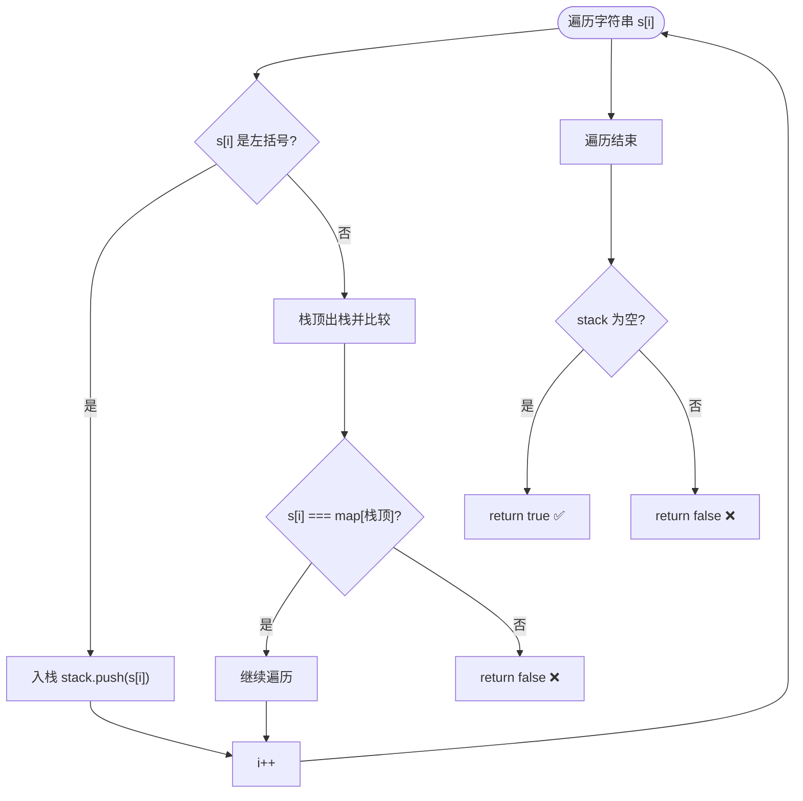
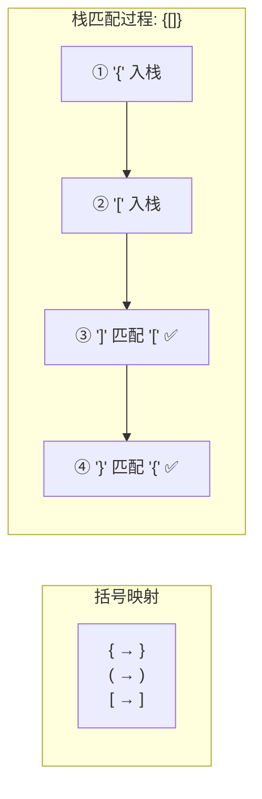

# 有效的括号（LeetCode 20）

## 简介

给定一个只包含 `(`、`)`、`{`、`}`、`[`、`]` 的字符串，判断括号是否 **有效匹配**。有效规则：
1. 左括号必须用相同类型的右括号闭合
2. 左括号必须以正确的顺序闭合
3. 每个右括号都有一个对应的相同类型的左括号

**示例**：
```
输入: "()"        → true
输入: "()[]{}"    → true
输入: "(]"        → false
输入: "([)]"      → false
输入: "{[]}"      → true
```

核心解法：**栈匹配法**——遇到左括号入栈，遇到右括号与栈顶匹配。

## 数据结构示意图





## 代码实现

```javascript
/**
 * 题目：有效的括号（LeetCode 20）
 * 描述：给定一个只包含 '('、')'、'{'、'}'、'['、']' 的字符串 s，判断字符串是否有效。
 * 有效规则：
 *   1. 左括号必须用相同类型的右括号闭合
 *   2. 左括号必须以正确的顺序闭合
 *   3. 每个右括号都有一个对应的相同类型的左括号
 *
 * 解法思路：栈匹配法
 * - 遇到左括号入栈
 * - 遇到右括号，与栈顶元素匹配：匹配则出栈，不匹配则无效
 * - 最终栈为空则全部匹配成功
 *
 * 时间复杂度：O(n)；空间复杂度：O(n)
 */

/**
 * @param {string} s 括号字符串
 * @return {boolean} 是否有效
 */
const isValid = function (s) {
  let map = {
    "{": "}",
    "(": ")",
    "[": "]",
  };
  let stack = [];
  for (let i = 0; i < s.length; i++) {
    if (map[s[i]]) {
      // 左括号入栈
      stack.push(s[i]);
    } else if (s[i] !== map[stack.pop()]) {
      // 右括号与栈顶不匹配 -> 无效
      return false;
    }
  }
  // 栈为空说明全部匹配
  return stack.length === 0;
};
```

## 逐段解析

### 括号映射表
```javascript
let map = { "{": "}", "(": ")", "[": "]" };
```
利用对象建立左括号到右括号的映射，方便 O(1) 查找。

### 遍历匹配
1. **遇到左括号**（`map[s[i]]` 存在）：入栈
2. **遇到右括号**（`map[s[i]]` 不存在）：
   - 栈顶出栈，用 `map` 查到对应的右括号类型
   - 与当前字符比较：**不匹配** → 直接 `return false`

### 最终检查
遍历结束后，如果栈为空（所有左括号都被匹配了），返回 `true`；否则返回 `false`。

### 边界情况
- 空字符串：栈为空，`return stack.length === 0` → `true`
- 只有右括号：第一次匹配时 `stack.pop()` 返回 `undefined`，`map[undefined]` 也为 `undefined`，肯定不等于右括号，`return false`
- 只有左括号：遍历结束后栈不为空，`return false`

## 复杂度分析

| 指标 | 值 | 说明 |
|------|----|------|
| 时间复杂度 | O(n) | 一次遍历，每个字符常数次操作 |
| 空间复杂度 | O(n) | 栈在最坏情况下存储 n/2 个左括号 |

## 示例输入与输出

```javascript
console.log(isValid("()"));      // true
console.log(isValid("()[]{}"));  // true
console.log(isValid("(]"));      // false
console.log(isValid("([)]"));    // false
console.log(isValid("{[]}"));    // true
console.log(isValid(""));        // true
console.log(isValid("((("));     // false
```
