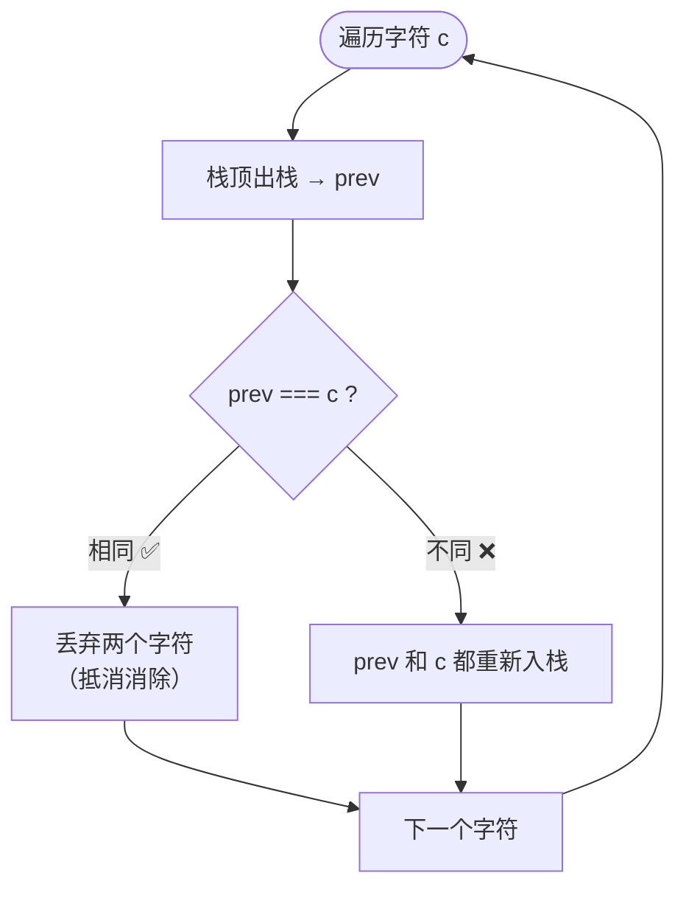
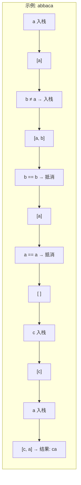

# 删除字符串中的所有相邻重复项（LeetCode 1047）

## 简介

给出由小写字母组成的字符串 `S`，重复项删除操作会选择 **两个相邻且相同** 的字母并删除它们。反复执行该操作，直到无法继续删除，返回最终字符串。

**示例**：
```
输入："abbaca"
过程：删除 "bb" → "aaca" → 删除 "aa" → "ca"
输出："ca"
```

核心解法：**栈消除法**——遍历字符，与栈顶比较，相同则抵消，不同则入栈。

## 数据结构示意图





## 代码实现

```javascript
/**
 * 题目：删除字符串中的所有相邻重复项（LeetCode 1047）
 * 描述：给出由小写字母组成的字符串 S，重复项删除操作会选择两个相邻且相同的字母并删除它们。
 *       在 S 上反复执行重复项删除操作，直到无法继续删除。返回最终字符串。
 *
 * 示例：输入 "abbaca" -> 删除 "bb" -> "aaca" -> 删除 "aa" -> 输出 "ca"
 *
 * 解法思路：栈消除法
 * - 遍历字符串中的每个字符
 * - 与栈顶元素比较：相同则抵消（出栈），不同则入栈
 * - 最终栈中元素即为结果
 *
 * 时间复杂度：O(n)；空间复杂度：O(n)
 */

/**
 * @param {string} S 输入字符串
 * @return {string} 消除相邻重复后的结果
 */
const removeDuplicates = function (S) {
  let stack = [];
  for (c of S) {
    let prev = stack.pop();
    if (prev !== c) {
      // 不重复，将弹出的元素和当前元素都放回
      stack.push(prev);
      stack.push(c);
    }
    // 如果重复，prev 被丢弃，c 也不入栈，自然消除
  }
  return stack.join("");
};
```

## 逐段解析

### 核心思路
利用栈来"消除"相邻重复对。每次遍历一个字符时，先弹出栈顶，判断是否与当前字符相等。

### 分支逻辑
1. **`prev === undefined`（空栈）**：`prev !== c` → 入栈，`stack.push(undefined)` 再 `push(c)`
   - 这里 `undefined` 入栈但被 `join("")` 忽略，相当于只入了 `c`
   - 更清晰的写法可以单独判空，但当前写法简洁

2. **`prev !== c`（不重复）**：两者都重新入栈，字符保留

3. **`prev === c`（重复）**：两者都丢弃（prev 被丢弃，c 不入栈），实现"消除"

### 示例推演：`"abbaca"`
```
stack = []
c='a': prev=undefined, undefined!=='a' → push(undefined), push('a')  → stack=['a']
c='b': prev='a', 'a'!=='b' → push('a'), push('b')                  → stack=['a','b']
c='b': prev='b', 'b'==='b' → 丢弃 prev 和 c                        → stack=['a']
c='a': prev='a', 'a'==='a' → 丢弃 prev 和 c                        → stack=[]
c='c': prev=undefined, undefined!=='c' → push(undefined), push('c') → stack=['c']
c='a': prev='c', 'c'!=='a' → push('c'), push('a')                  → stack=['c','a']
结果: stack.join("") → "ca" ✅
```

## 复杂度分析

| 指标 | 值 | 说明 |
|------|----|------|
| 时间复杂度 | O(n) | 一次遍历，每个字符入栈/出栈最多一次 |
| 空间复杂度 | O(n) | 栈中最多存储 n 个字符 |

## 示例输入与输出

```javascript
console.log(removeDuplicates("abbaca")); // "ca"
console.log(removeDuplicates("azxxzy")); // "ay"
console.log(removeDuplicates("aaaaaaaa")); // ""（全部消除）
console.log(removeDuplicates("abcd"));   // "abcd"（无重复）
```
