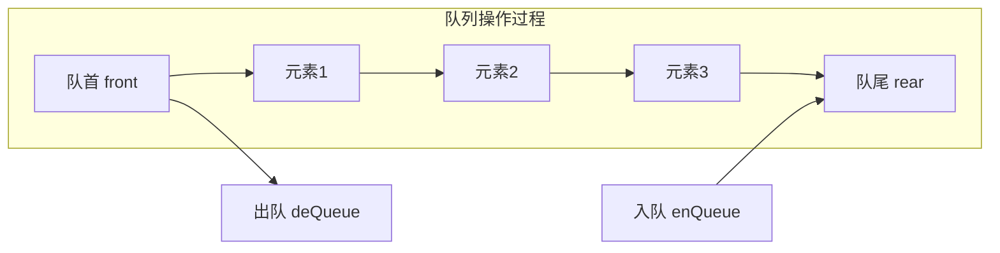
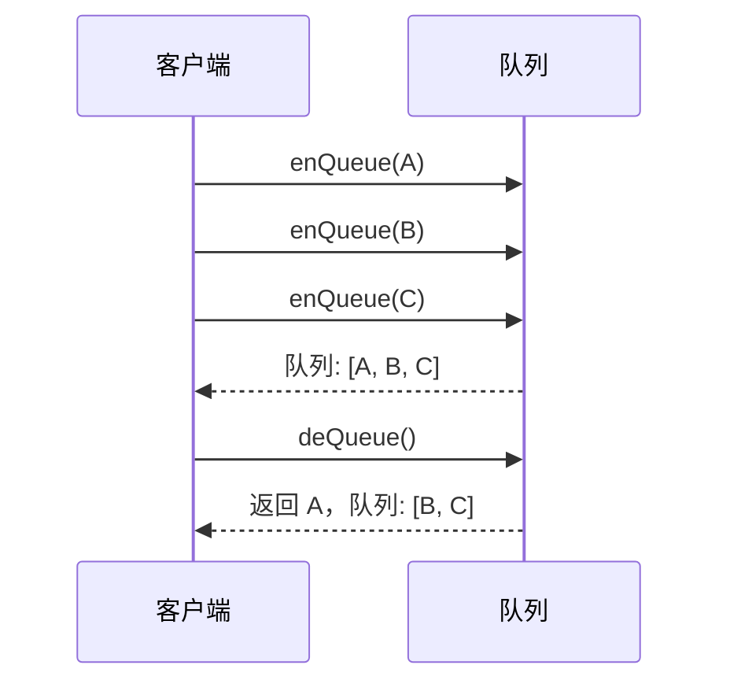

# 队列的实现 - 基于数组

## 简介

队列是一种遵循 **"先进先出（FIFO）"** 原则的线性数据结构。新元素从队尾（rear）添加，已有元素从队首（front）移除，就像排队的队伍一样——先到的人先被服务。

本文基于数组实现队列，包含入队（enQueue）、出队（deQueue）、查看队首（top）、判空（isEmpty）、获取长度（size）和清空（clear）等核心操作。

## 数据结构示意图





## 代码实现

```javascript
class Queue {
  constructor() {
    this.queue = [];
    this.count = 0;
  }

  enQueue(item) {
    this.queue[this.count++] = item;
  }

  deQueue() {
    if (this.isEmpty()) {
      return;
    }
    this.count--;
    return this.queue.shift();
  }

  isEmpty() {
    return this.count === 0;
  }

  top() {
    if (this.isEmpty()) {
      return;
    }
    return this.queue[0];
  }

  size() {
    return this.count;
  }

  clear() {
    this.queue = [];
    this.count = 0;
  }
}
```

## 逐段解析

### 构造函数 `constructor`
初始化一个空数组 `queue` 作为数据存储容器，`count` 记录队列中的元素数量。`count` 同时作为下一个入队元素的索引位置。

### enQueue — 入队操作
```javascript
enQueue(item) {
  this.queue[this.count++] = item;
}
```
以 `count` 为索引将元素存入数组，然后 `count` 自增 1。例如队列为 `[A, B]`、`count = 2` 时，执行 `enQueue(C)` 相当于 `this.queue[2] = C`，然后 `count` 变为 3。

### deQueue — 出队操作
```javascript
deQueue() {
  if (this.isEmpty()) return;
  this.count--;
  return this.queue.shift();
}
```
先判断队列是否为空（空队列无法出队）。`count` 减 1 表示元素数量减少，然后通过 `shift()` 移除数组的第一个元素（队首）并返回。

> ⚠️ 注意：`shift()` 移除数组首元素后，所有剩余元素会前移，**时间复杂度为 O(n)**。数据量大时建议使用"基于对象"的实现。

### top — 查看队首
```javascript
top() {
  if (this.isEmpty()) return;
  return this.queue[0];
}
```
直接返回数组索引 0 处的元素，不移除。空队列时返回 `undefined`。

### isEmpty / size / clear
- `isEmpty()`：通过 `count === 0` 判断队列是否为空。
- `size()`：返回 `count` 即当前元素个数。
- `clear()`：重置 `queue` 为空数组、`count` 为 0，清空所有数据。

## 复杂度分析

| 操作 | 时间复杂度 | 说明 |
|------|-----------|------|
| enQueue | **O(1)** | 直接数组索引赋值 |
| deQueue | **O(n)** | `shift()` 导致元素前移 |
| top | **O(1)** | 直接访问索引 0 |
| isEmpty | **O(1)** | 比较 count |
| size | **O(1)** | 读取 count |
| clear | **O(1)** | 重置数组 |

**空间复杂度：O(n)**，n 为队列中的元素数量。

> 数组实现的优点是简单直观，缺点是出队时 `shift()` 需要移动所有剩余元素，导致 O(n) 的开销。在需要频繁出队的大数据量场景下，推荐使用**基于对象**的实现方式。
