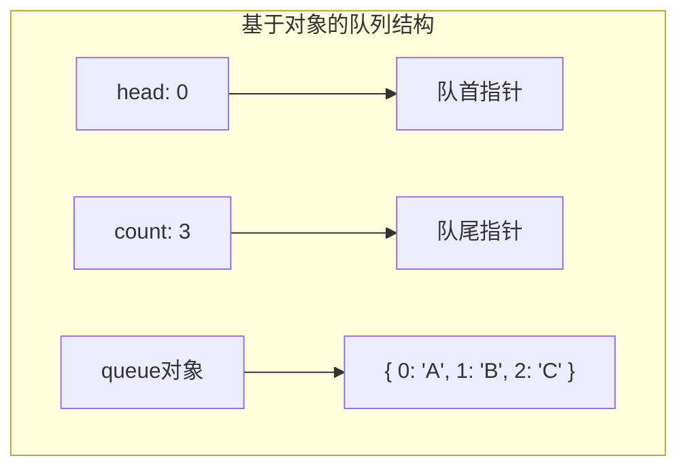
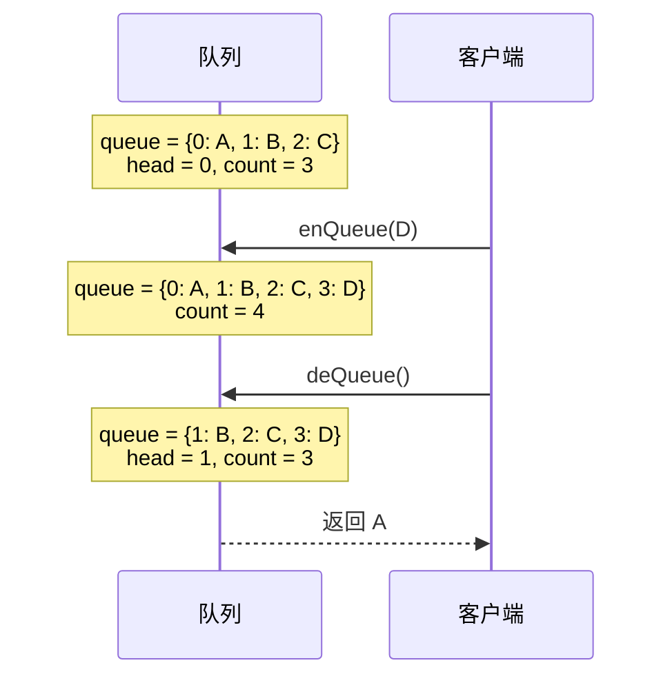

# 队列的实现 - 基于对象

## 简介

基于数组的队列在出队时使用 `shift()` 会导致 O(n) 的元素前移，性能不佳。本实现使用 **JavaScript 对象（哈希表）** 存储队列数据，通过 `head` 和 `count` 两个指针来标记队首和队尾位置，实现 **所有操作 O(1)** 的高效队列。

## 数据结构示意图





## 代码实现

```javascript
class Queue {
  constructor() {
    this.queue = {};
    this.count = 0;
    this.head = 0;
  }

  enQueue(item) {
    this.queue[this.count++] = item;
  }

  deQueue() {
    if (this.isEmpty()) {
      return;
    }
    const headData = this.queue[this.head];
    delete this.queue[this.head];
    this.head++;
    this.count--;
    return headData;
  }

  isEmpty() {
    return this.count === 0;
  }

  clear() {
    this.queue = {};
    this.count = 0;
    this.head = 0;
  }
}
```

## 逐段解析

### 核心设计思想
使用对象 `queue` 存储元素，`head` 指向队首的键名，`count` 指向下一个空位（即队尾的下一个位置）。队列的实际长度 = `count - head`。

### 构造函数 `constructor`
```javascript
this.queue = {};    // 空对象存储数据
this.count = 0;      // 记录总入队次数，也是下一个入队的键
this.head = 0;       // 记录当前队首的键
```

### enQueue — 入队
```javascript
enQueue(item) {
  this.queue[this.count++] = item;
}
```
以当前 `count` 值作为键名存入对象，然后 `count` 自增。例如连续入队 A、B、C 后，`queue` 为 `{ 0: 'A', 1: 'B', 2: 'C' }`，`count = 3`。

### deQueue — 出队
```javascript
deQueue() {
  if (this.isEmpty()) return;
  const headData = this.queue[this.head];
  delete this.queue[this.head];
  this.head++;
  this.count--;
  return headData;
}
```
1. 先判空，空队列直接返回。
2. 通过 `this.head` 获取队首元素。
3. 用 `delete` 从对象中移除该元素（**无需移动其他元素**）。
4. `head` 后移一位指向新的队首，`count` 减 1。
5. 返回被移除的元素。

例如 `{ 0: 'A', 1: 'B', 2: 'C' }` 出队时，删除键 `0` 的数据，对象变为 `{ 1: 'B', 2: 'C' }`，`head` 从 0 变为 1。

### isEmpty
```javascript
isEmpty() {
  return this.count === 0;
}
```
判断队列是否为空。

### clear
```javascript
clear() {
  this.queue = {};
  this.count = 0;
  this.head = 0;
}
```
重置所有属性，清空队列。

> ⚠️ 注意：本实现未包含 `top` 方法，但可以通过 `this.queue[this.head]` 获取队首元素。

## 复杂度分析

| 操作 | 时间复杂度 | 说明 |
|------|-----------|------|
| enQueue | **O(1)** | 对象属性直接赋值 |
| deQueue | **O(1)** | `delete` 操作不移位 |
| isEmpty | **O(1)** | 比较 count |
| clear | **O(1)** | 重置对象和指针 |

**空间复杂度：O(n)**，n 为队列中的元素数量。

> 基于对象的实现通过指针标记（head/count）避免了数组 `shift()` 带来的 O(n) 开销，所有核心操作均为 O(1)，是 JavaScript 中实现队列更高效的方式。
