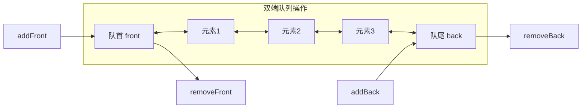
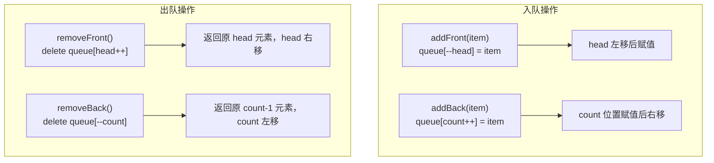

# 双端队列（Deque）

## 简介

双端队列（Double-ended Queue，简称 Deque）是一种允许在 **队首和队尾两端** 进行添加和删除操作的线性数据结构。它结合了栈和队列的能力——既能在两端插入，也能在两端删除。

基于对象实现，通过 `head` 指向队首位置、`count` 指向队尾位置来管理两端，所有操作均为 O(1)。

## 数据结构示意图





## 代码实现

```javascript
class Deque {
  constructor() {
    this.queue = {};
    this.count = 0;
    this.head = 0;
  }

  addFront(item) {
    this.queue[--this.head] = item;
  }

  addBack(item) {
    this.queue[this.count++] = item;
  }

  removeFront() {
    if (this.isEmpty()) {
      return;
    }
    const headData = this.queue[this.head];
    delete this.queue[this.head++];
    return headData;
  }

  removeBack() {
    if (this.isEmpty()) {
      return;
    }
    const backData = this.queue[this.count - 1];
    delete this.queue[--this.count];
    return backData;
  }

  frontTop() {
    if (this.isEmpty()) {
      return;
    }
    return this.queue[this.head];
  }

  backTop() {
    if (this.isEmpty()) {
      return;
    }
    return this.queue[this.count - 1];
  }

  isEmpty() {
    return this.size() === 0;
  }

  size() {
    return this.count - this.head;
  }
}
```

## 逐段解析

### 数据结构设计
```javascript
this.queue = {};  // 对象存储元素
this.count = 0;   // 队尾指针（指向下一个空位）
this.head = 0;    // 队首指针（指向第一个元素）
```
与基于对象的队列相同，`count` 和 `head` 分别标记队尾和队首。**关键区别**在于 `head` 可以向前（左）移动，即 `head` 可以为负数。

### addFront — 队首添加
```javascript
addFront(item) {
  this.queue[--this.head] = item;
}
```
先将 `head` **左移**一位（`--this.head`），然后在新位置赋值。例如 `head = 0` 时执行 `addFront(X)`，`head` 变为 `-1`，`queue[-1] = X`。

### addBack — 队尾添加
```javascript
addBack(item) {
  this.queue[this.count++] = item;
}
```
与普通队列入队相同，在 `count` 位置赋值后 `count` 自增。

### removeFront — 队首删除
```javascript
removeFront() {
  if (this.isEmpty()) return;
  const headData = this.queue[this.head];
  delete this.queue[this.head++];
  return headData;
}
```
读取当前 `head` 位置的元素，`delete` 后 `head` 右移一位。

### removeBack — 队尾删除
```javascript
removeBack() {
  if (this.isEmpty()) return;
  const backData = this.queue[this.count - 1];
  delete this.queue[--this.count];
  return backData;
}
```
读取 `count - 1`（队尾最后一个元素），`delete` 后 `count` 左移一位。

### frontTop / backTop — 查看两端
- `frontTop()`：返回 `this.queue[this.head]`，即队首元素。
- `backTop()`：返回 `this.queue[this.count - 1]`，即队尾元素。

### isEmpty / size
- `size()`：通过 `this.count - this.head` 计算元素数量（注意 `head` 可能为负数）。
- `isEmpty()`：当 `size() === 0` 时队列为空。

## 复杂度分析

| 操作 | 时间复杂度 | 说明 |
|------|-----------|------|
| addFront | **O(1)** | 对象属性直接赋值 |
| addBack | **O(1)** | 对象属性直接赋值 |
| removeFront | **O(1)** | 直接 `delete` 不移位 |
| removeBack | **O(1)** | 直接 `delete` 不移位 |
| frontTop | **O(1)** | 直接访问 |
| backTop | **O(1)** | 直接访问 |
| size | **O(1)** | 指针相减 |

**空间复杂度：O(n)**，n 为队列中的元素数量。

> 双端队列的应用场景非常广泛，如滑动窗口最大值、队列的最大值、浏览器的前进后退等都离不开 Deque。
