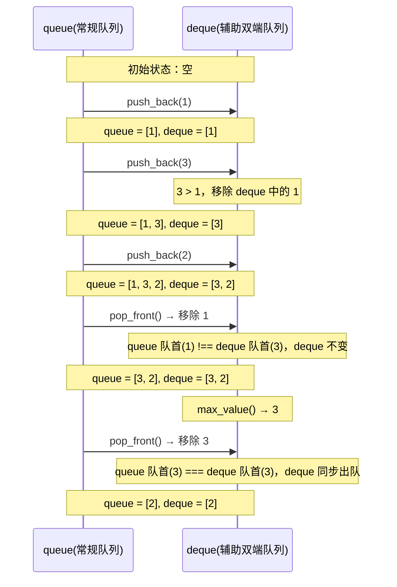

# 队列的最大值

## 简介

**题目**：剑指 Offer 59-II / LeetCode 面试题 59

设计一个队列，支持在 **O(1) 时间复杂度** 内获取队列中的最大值。需要实现三个操作：
- `push_back(value)`：队尾入队
- `pop_front()`：队首出队
- `max_value()`：获取当前队列中的最大值

**核心思路**：使用 **辅助双端队列（deque）维护一个递减序列**，队首始终为当前队列的最大值。

## 算法示意图

```mermaid
flowchart TD
    subgraph 入队操作流程 push_back(3)
        A["queue 正常入队: queue[count++] = 3"] --> B{"deque 不为空<br/>且 3 > deque 队尾？"}
        B -->|是| C["deque 队尾出队"]
        C --> B
        B -->|否| D["3 入队到 deque 队尾"]
    end
```



## 代码实现

```javascript
var MaxQueue = function () {
  this.queue = {};
  this.deque = {};
  this.countQ = this.countD = this.headQ = this.headD = 0;
};

MaxQueue.prototype.push_back = function (value) {
  this.queue[this.countQ++] = value;
  while (!this.isEmptyDeque() && value > this.deque[this.countD - 1]) {
    delete this.deque[--this.countD];
  }
  this.deque[this.countD++] = value;
};

MaxQueue.prototype.pop_front = function () {
  if (this.isEmptyQueue()) {
    return -1;
  }
  if (this.queue[this.headQ] === this.deque[this.headD]) {
    delete this.deque[this.headD++];
  }
  const frontData = this.queue[this.headQ];
  delete this.queue[this.headQ++];
  return frontData;
};

MaxQueue.prototype.max_value = function () {
  if (this.isEmptyDeque()) {
    return -1;
  }
  return this.deque[this.headD];
};

MaxQueue.prototype.isEmptyDeque = function () {
  return !(this.countD - this.headD);
};

MaxQueue.prototype.isEmptyQueue = function () {
  return !(this.countQ - this.headQ);
};
```

## 逐段解析

### 核心数据结构

使用**两个队列**：

| 队列 | 作用 | 说明 |
|-----|------|------|
| `queue` | 存储所有数据 | 基于对象的普通队列，记录完整数据 |
| `deque` | 维护当前最大值 | 双端队列，始终保持递减顺序，队首即为最大值 |

两个队列均使用对象 + 指针的方式实现（基于对象队列的优化方案），`countQ/countD` 和 `headQ/headD` 分别管理两端。

### push_back — 入队

```javascript
push_back(value) {
  this.queue[this.countQ++] = value;     // 1. 正常入队
  while (!this.isEmptyDeque() &&
         value > this.deque[this.countD - 1]) {  // 2. 清理 deque
    delete this.deque[--this.countD];
  }
  this.deque[this.countD++] = value;     // 3. 入队到 deque
}
```

三步操作：

1. 将 `value` 正常入队到 `queue`。
2. **清理递减序列**：只要 `deque` 不为空且当前值大于 `deque` 队尾元素，就将队尾元素移除（因为这些元素以后不可能再成为最大值）。
3. 将 `value` 入队到 `deque` 尾部。

> 例如队列已有 `[1, 3, 2]`，再入队 `4` 时：先移除 `deque` 中的 `2` 和 `3`（都小于 4），然后 `deque` 变为 `[4]`。

### pop_front — 出队

```javascript
pop_front() {
  if (this.isEmptyQueue()) return -1;
  if (this.queue[this.headQ] === this.deque[this.headD]) {
    delete this.deque[this.headD++];
  }
  const frontData = this.queue[this.headQ];
  delete this.queue[this.headQ++];
  return frontData;
}
```

1. 判空：空队列返回 `-1`。
2. **同步出队**：如果 `queue` 出队的元素恰好是当前最大值（即 `deque` 的队首），则 `deque` 也需要同步出队。
3. 从 `queue` 中移除队首元素并返回。

### max_value — 获取最大值

```javascript
max_value() {
  if (this.isEmptyDeque()) return -1;
  return this.deque[this.headD];
}
```

直接读取 `deque` 的队首元素，由于 `deque` 始终保持递减，队首就是当前队列的最大值。

### isEmpty 辅助方法

使用 `!(count - head)` 的判断方式，当 `count - head` 为 0（即队列为空）时返回 `true`。

## 示例演算

```
操作序列：
push_back(1)  → queue=[1]       deque=[1]
push_back(3)  → queue=[1,3]     deque=[3]      (3移除1)
push_back(2)  → queue=[1,3,2]   deque=[3,2]
max_value()   → 返回 3
pop_front()   → 返回 1          queue=[3,2]    deque=[3,2]  (1≠3, 不同步)
pop_front()   → 返回 3          queue=[2]      deque=[2]    (3=3, 同步)
max_value()   → 返回 2
```

## 复杂度分析

| 操作 | 时间复杂度 | 说明 |
|------|-----------|------|
| push_back | **O(1) 均摊** | 每个元素最多入队出队一次 |
| pop_front | **O(1)** | 指针操作 |
| max_value | **O(1)** | 直接读取 deque 队首 |

**空间复杂度：O(n)**，n 为队列中的元素数量。

> 该算法的精妙之处在于利用辅助双端队列维护一个递减序列，使得最大值始终浮在 deque 的队首。虽然清理 deque 的过程可能涉及多次 pop，但每个元素最多被移除一次，因此均摊时间复杂度仍为 O(1)。
