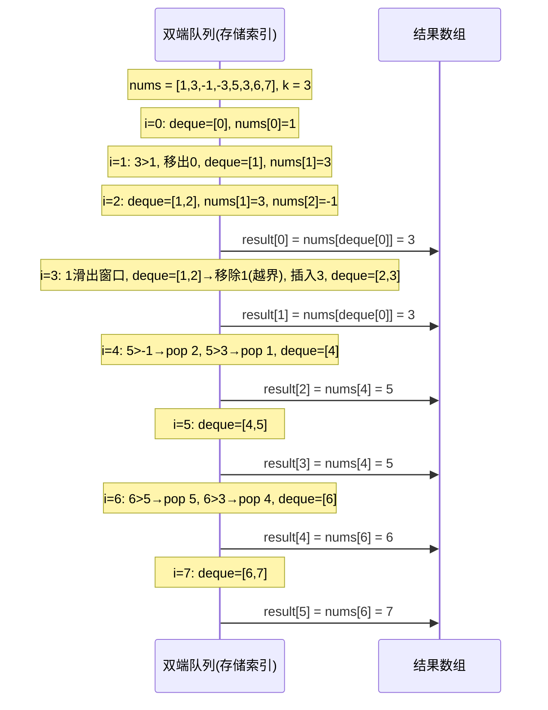

# 滑动窗口最大值

## 简介

**题目**：LeetCode 239 — Sliding Window Maximum

给定一个整数数组 `nums` 和一个大小为 `k` 的滑动窗口，窗口从数组最左侧开始，每次向右移动一位，返回每个滑动窗口中的最大值。

**示例：**

```
输入: nums = [1,3,-1,-3,5,3,6,7], k = 3
输出: [3,3,5,5,6,7]
```

本文提供三种解法：双端队列法（正向初始化）、暴力法和双端队列法（存储索引优化版）。

## 算法示意图

```mermaid
graph LR
    subgraph 滑动窗口 k=3
        A["[1, 3, -1], -3, 5, 3, 6, 7"] --> B["max = 3"]
        C["1, [3, -1, -3], 5, 3, 6, 7"] --> D["max = 3"]
        E["1, 3, [-1, -3, 5], 3, 6, 7"] --> F["max = 5"]
        G["1, 3, -1, [-3, 5, 3], 6, 7"] --> H["max = 5"]
        I["1, 3, -1, -3, [5, 3, 6], 7"] --> J["max = 6"]
        K["1, 3, -1, -3, 5, [3, 6, 7]"] --> L["max = 7"]
    end
```



## 代码实现

### 解法一：双端队列法（正向初始化）

```javascript
var maxSlidingWindow = function (nums, k) {
  if (k <= 1) return nums;
  const result = [];
  const deque = [];

  // 1. 初始化第一个窗口
  deque.push(nums[0]);
  let i = 1;
  for (; i < k; i++) {
    while (deque.length && nums[i] > deque[deque.length - 1]) {
      deque.pop();
    }
    deque.push(nums[i]);
  }
  result.push(deque[0]);

  // 2. 滑动窗口
  const len = nums.length;
  for (; i < len; i++) {
    while (deque.length && nums[i] > deque[deque.length - 1]) {
      deque.pop();
    }
    deque.push(nums[i]);
    if (deque[0] === nums[i - k]) {
      deque.shift();
    }
    result.push(deque[0]);
  }
  return result;
};
```

### 解法二：暴力法

```javascript
const maxSlidingWindowBrute = function (nums, k) {
  if (k === 1) return nums;
  let result = [], arr = [];
  for (let i = 0; i < nums.length; i++) {
    arr.push(nums[i]);
    if (i >= k - 1) {
      result.push(Math.max(...arr));
      arr.shift();
    }
  }
  return result;
};
```

### 解法三：双端队列法（存储索引优化版）

```javascript
const maxSlidingWindowOptimized = function (nums, k) {
  const deque = [];
  const result = [];
  for (let i = 0; i < nums.length; i++) {
    if (i - deque[0] >= k) {
      deque.shift();
    }
    while (nums[deque[deque.length - 1]] <= nums[i]) {
      deque.pop();
    }
    deque.push(i);
    if (i >= k - 1) {
      result.push(nums[deque[0]]);
    }
  }
  return result;
};
```

## 逐段解析

### 解法一：双端队列法（正向初始化）

**核心思路**：维护一个递减的双端队列，队首始终为当前窗口的最大值。

**第一阶段 — 初始化第一个窗口**：
```javascript
deque.push(nums[0]);
for (; i < k; i++) {
  while (deque.length && nums[i] > deque[deque.length - 1]) {
    deque.pop();
  }
  deque.push(nums[i]);
}
result.push(deque[0]);
```
先放入第一个元素，然后依次将窗口内剩余元素按递减规则入队：如果当前元素大于队尾，则队尾出队直到递减顺序成立。第一个窗口处理完后，`deque[0]` 就是该窗口的最大值。

**第二阶段 — 滑动窗口**：
```javascript
while (deque.length && nums[i] > deque[deque.length - 1]) {
  deque.pop();
}
deque.push(nums[i]);
if (deque[0] === nums[i - k]) {
  deque.shift();
}
result.push(deque[0]);
```
每次滑动时：
1. 将新元素按递减规则插入 deque。
2. 判断 **最大值是否滑出窗口**：如果 `deque[0]` 等于刚刚滑出窗口的元素 `nums[i - k]`，则从队首移除。
3. 当前 `deque[0]` 即为当前窗口的最大值。

> ⚠️ 此解法使用 `shift()` 移除越界元素，时间复杂度 O(n)（均摊）。解法三用索引判断避免 `shift()`，更优。

### 解法二：暴力法

每次窗口滑动后，使用 `Math.max(...arr)` 遍历窗口内所有元素求最大值。

**缺点**：每次求最大值需要 O(k) 时间，总时间复杂度为 **O(n·k)**，大数据量下效率极低。

### 解法三：双端队列法（存储索引优化版）

**核心优化**：deque 中存储的是数组下标而非元素值，通过下标可以同时获取元素值和判断是否在窗口内。

```javascript
// 移除不在窗口内的元素
if (i - deque[0] >= k) {
  deque.shift();
}
// 保持递减：移除所有小于当前值的队尾
while (nums[deque[deque.length - 1]] <= nums[i]) {
  deque.pop();
}
deque.push(i);
// 窗口形成后记录最大值
if (i >= k - 1) {
  result.push(nums[deque[0]]);
}
```

核心逻辑：
1. **过期检查**：如果 `i - deque[0] >= k`，说明队首索引已不在当前窗口内，从队首移除。
2. **递减维护**：移除 deque 中所有值小于等于当前元素的队尾索引。
3. **记录结果**：窗口形成后（`i >= k - 1`），`deque[0]` 对应的元素即是当前窗口的最大值。

使用索引的优势在于不需要像解法一那样显式比较值与滑动出的元素是否相等，而是直接用索引范围判断，逻辑更清晰。

## 示例演算

以 `nums = [1,3,-1,-3,5,3,6,7]`，`k = 3` 为例（解法三）：

| i | nums[i] | deque（存索引） | 窗口最大值 | 说明 |
|---|---------|----------------|-----------|------|
| 0 | 1 | [0] | — | 窗口未满 |
| 1 | 3 | [1] | — | 3 > 1，pop 0，push 1 |
| 2 | -1 | [1, 2] | **3** | 窗口形成，nums[1]=3 |
| 3 | -3 | [1, 2, 3] | **3** | i=0 未过期，nums[1]=3 |
| 4 | 5 | [4] | **5** | i=4-1=3≥k，索引1过期；5 > 队尾全部，pop 2,3 |
| 5 | 3 | [4, 5] | **5** | 5 ≥ 3，push 5 |
| 6 | 6 | [6] | **6** | 6 > 队尾全部，pop 4,5 |
| 7 | 7 | [7] | **7** | 7 > 6，pop 6，push 7 |

最终结果：`[3, 3, 5, 5, 6, 7]`

## 复杂度分析

| 解法 | 时间复杂度 | 空间复杂度 | 说明 |
|------|-----------|-----------|------|
| 双端队列（正向初始化） | **O(n)** | O(k) | 每个元素最多入队出队一次 |
| 暴力法 | **O(n·k)** | O(k) | 每次滑动遍历整个窗口 |
| 双端队列（索引优化版） | **O(n)** | O(k) | 使用索引避免值比较，更简洁 |

> 双端队列法是解决滑动窗口最大值问题的**最优解**，时间复杂度 O(n)。关键思想是维护一个单调递减队列，使得 O(1) 时间内即可获取当前窗口的最大值。建议优先掌握**解法三（存储索引优化版）**，代码更简洁，逻辑更清晰。
