# 📜 JavaScript 知识详解（面试精华版）

> 🚀 **前端面试必备** — JavaScript 核心知识全面梳理，涵盖数据类型、闭包、原型链、异步编程、ES6+、Web API 等核心考点 | 建议收藏 ⭐

---

## 📌 知识脑图

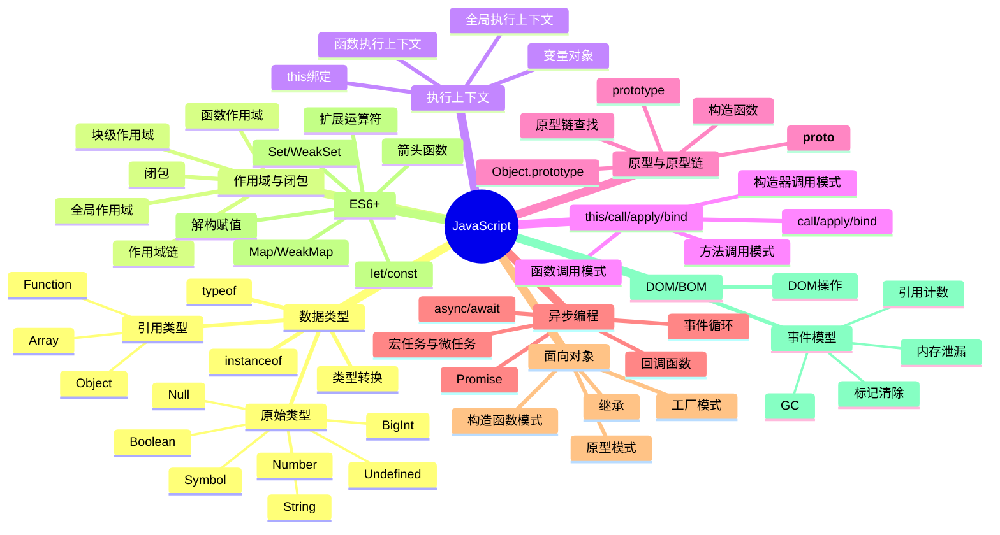
```mermaid
mindmap
  root((JavaScript))
    数据类型
      原始类型
        Undefined
        Null
        Boolean
        Number
        String
        Symbol
        BigInt
      引用类型
        Object
        Array
        Function
      typeof
      instanceof
      类型转换
    作用域与闭包
      全局作用域
      函数作用域
      块级作用域
      作用域链
      闭包
    执行上下文
      全局执行上下文
      函数执行上下文
      this绑定
      变量对象
    this/call/apply/bind
      函数调用模式
      方法调用模式
      构造器调用模式
      call/apply/bind
    原型与原型链
      构造函数
      prototype
      __proto__
      原型链查找
      Object.prototype
    异步编程
      回调函数
      Promise
      async/await
      事件循环
      宏任务与微任务
    面向对象
      工厂模式
      构造函数模式
      原型模式
      继承
    ES6+
      let/const
      箭头函数
      解构赋值
      扩展运算符
      Map/WeakMap
      Set/WeakSet
    DOM/BOM
      DOM操作
      事件模型
       GC
       标记清除
       引用计数
       内存泄漏
```

---

## 📑 内容目录（Table of Contents）

- [📦 **一、数据类型**](#一数据类型)
- [🔧 **二、ES6**](#二es6)
- [🧱 **三、JavaScript 基础**](#三javascript-基础)
- [🔗 **四、原型与原型链**](#四原型与原型链)
- [🎯 **五、执行上下文 / 作用域链 / 闭包**](#五执行上下文--作用域链--闭包)
- [🎯 **六、this / call / apply / bind**](#六this--call--apply--bind)
- [⏳ **七、异步编程**](#七异步编程)
- [🏗️ **八、面向对象**](#八面向对象)
- [🗑️ **九、垃圾回收与内存泄漏**](#九垃圾回收与内存泄漏)
- [🔄 **十、事件循环（Event Loop）详解**](#十事件循环event-loop详解)
- [✨ **十一、现代JavaScript新特性**](#十一现代javascript新特性)
- [🌐 **十二、浏览器 Web API**](#十二浏览器-web-api)
- [✍️ **十三、手写代码实现**](#十三手写代码实现)
- [💻 **十四、代码输出题**](#十四代码输出题)
- [📋 **总结**](#总结)

---

## 📦 一、数据类型

### 1️⃣ JavaScript 有哪些数据类型，它们的区别？

JavaScript 共有 **八种数据类型**，分为 **原始类型（Primitive）** 和 **引用类型（Reference）**。

**原始类型（7种）：** `Undefined`、`Null`、`Boolean`、`Number`、`String`、`Symbol`、`BigInt`

**引用类型（1种）：** `Object`（包含普通对象、数组、函数、Date、RegExp、Map、Set 等）

其中 `Symbol` 和 `BigInt` 是 ES6 中新增的数据类型：

- **Symbol**：创建后独一无二且不可变的数据类型，主要解决全局变量冲突问题。每个 `Symbol()` 返回值都是唯一的，即使传入相同描述。
- **BigInt**：可表示任意精度格式的整数，使用 `BigInt` 可以安全地存储和操作大整数，超出 `Number.MAX_SAFE_INTEGER`（2^53 - 1）范围也不会丢失精度。

#### 栈（Stack）vs 堆（Heap）存储

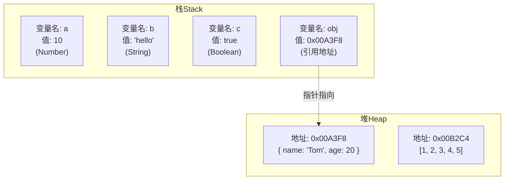
```mermaid
graph TD
    subgraph 栈Stack
        direction TB
        S1["变量名: a<br/>值: 10<br/>(Number)"]
        S2["变量名: b<br/>值: 'hello'<br/>(String)"]
        S3["变量名: c<br/>值: true<br/>(Boolean)"]
        S4["变量名: obj<br/>值: 0x00A3F8<br/>(引用地址)"]
    end

    subgraph 堆Heap
        H1["地址: 0x00A3F8<br/>{ name: 'Tom', age: 20 }"]
        H2["地址: 0x00B2C4<br/>[1, 2, 3, 4, 5]"]
    end

    S4 -.->|指针指向| H1
```

**两种类型的区别在于存储位置的不同：**

| 特性 | 原始类型 | 引用类型 |
|------|---------|---------|
| 存储位置 | 栈（Stack） | 堆（Heap） |
| 空间大小 | 固定、小 | 不固定、大 |
| 访问方式 | 按值访问 | 按引用访问 |
| 复制行为 | 独立副本 | 共享引用 |
| 比较方式 | 值比较 | 引用比较 |

**详细说明：**

- **原始数据类型** 直接存储在栈中的简单数据段，占据空间小、大小固定，属于被频繁使用数据，所以放入栈中存储。
- **引用数据类型** 存储在堆中的对象，占据空间大、大小不固定。如果存储在栈中，将会影响程序运行的性能。引用数据类型在栈中存储了**指针**，该指针指向堆中该实体的起始地址。当解释器寻找引用值时，会首先检索其在栈中的地址，取得地址后从堆中获得实体。

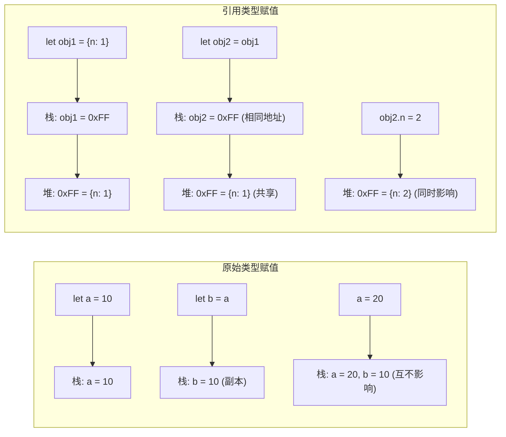
```mermaid
graph LR
    subgraph 原始类型赋值
        A1["let a = 10"] --> A2["栈: a = 10"]
        A3["let b = a"] --> A4["栈: b = 10 (副本)"]
        A5["a = 20"] --> A6["栈: a = 20, b = 10 (互不影响)"]
    end

    subgraph 引用类型赋值
        B1["let obj1 = {n: 1}"] --> B2["栈: obj1 = 0xFF"]
        B2 --> B3["堆: 0xFF = {n: 1}"]
        B4["let obj2 = obj1"] --> B5["栈: obj2 = 0xFF (相同地址)"]
        B5 --> B6["堆: 0xFF = {n: 1} (共享)"]
        B7["obj2.n = 2"] --> B8["堆: 0xFF = {n: 2} (同时影响)"]
    end
```

### 2️⃣ 数据类型检测的方式有哪些

#### 1️⃣ typeof

```javascript
// typeof 操作符检测数据类型
console.log(typeof 2);               // number
console.log(typeof true);            // boolean
console.log(typeof 'str');           // string
console.log(typeof []);              // object
console.log(typeof function(){});    // function
console.log(typeof {});              // object
console.log(typeof undefined);       // undefined
console.log(typeof null);            // object  (历史遗留bug)
console.log(typeof Symbol());        // symbol
console.log(typeof 10n);             // bigint
```

> ⚠️ **注意**：`typeof null` 返回 `"object"` 是 JavaScript 第一版就存在的 bug，因为 `null` 的机器码全 0，与 `object` 的类型标签相同。由于历史兼容性原因，这个 bug 从未被修复。

**typeof 的局限性：**
- `null` 被检测为 `object`（JS 第一版遗留bug，null 的机器码全0，与 object 的类型标签相同）
- 数组、对象都被检测为 `object`，无法区分具体对象类型

#### 2️⃣ instanceof

```javascript
// instanceof 检测构造函数原型是否在原型链上
console.log(2 instanceof Number);                    // false
console.log(true instanceof Boolean);                // false
console.log('str' instanceof String);                // false
console.log([] instanceof Array);                    // true
console.log(function(){} instanceof Function);       // true
console.log({} instanceof Object);                   // true
```

`instanceof` 的原理：判断构造函数的 `prototype` 属性是否出现在对象的原型链中。

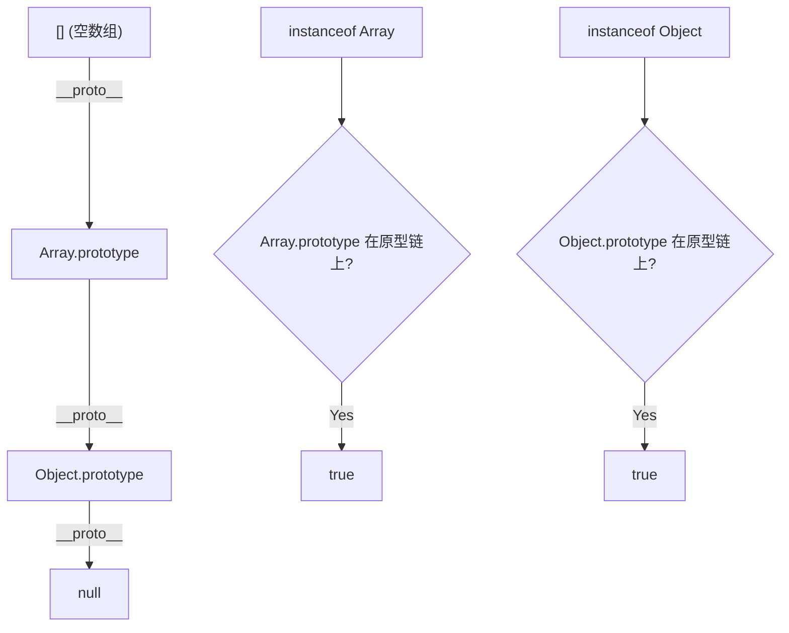
```mermaid
graph TD
    A["[] (空数组)"] -->|__proto__| B["Array.prototype"]
    B -->|__proto__| C["Object.prototype"]
    C -->|__proto__| D["null"]

    E["instanceof Array"] --> F{"Array.prototype 在原型链上?"}
    F -->|Yes| G["true"]

    H["instanceof Object"] --> I{"Object.prototype 在原型链上?"}
    I -->|Yes| J["true"]
```

#### 3️⃣ constructor

```javascript
console.log((2).constructor === Number);          // true
console.log((true).constructor === Boolean);      // true
console.log(('str').constructor === String);      // true
console.log(([]).constructor === Array);          // true
console.log((function() {}).constructor === Function); // true
console.log(({}).constructor === Object);         // true
```

**注意：** `constructor` 可以被改写，不安全。

```javascript
function Fn(){};
Fn.prototype = new Array();
var f = new Fn();
console.log(f.constructor === Fn);    // false
console.log(f.constructor === Array); // true
```

#### 4️⃣ Object.prototype.toString.call() （最准确）

```javascript
var a = Object.prototype.toString;
console.log(a.call(2));              // [object Number]
console.log(a.call(true));           // [object Boolean]
console.log(a.call('str'));          // [object String]
console.log(a.call([]));             // [object Array]
console.log(a.call(function(){}));   // [object Function]
console.log(a.call({}));             // [object Object]
console.log(a.call(undefined));      // [object Undefined]
console.log(a.call(null));           // [object Null]
```

**原理：** 每个对象都有一个内部属性 `[[Class]]`（在ES5中），`Object.prototype.toString` 返回该属性的值。Array、Function 等类型重写了 `toString` 方法，所以必须通过 `Object.prototype.toString.call()` 来调用原始版本。

### 3️⃣ 判断数组的方式有哪些

| 方法 | 代码示例 | 原理 |
|------|---------|------|
| `Object.prototype.toString.call()` | `Object.prototype.toString.call(obj).slice(8,-1) === 'Array'` | 获取内部 [[Class]] |
| 原型链 | `obj.__proto__ === Array.prototype` | 直接比较原型 |
| `Array.isArray()` | `Array.isArray(obj)` | ES6 原生方法，最推荐 |
| `instanceof` | `obj instanceof Array` | 检查原型链 |
| `isPrototypeOf` | `Array.prototype.isPrototypeOf(obj)` | 检查原型关系 |

### 4️⃣ null 和 undefined 区别

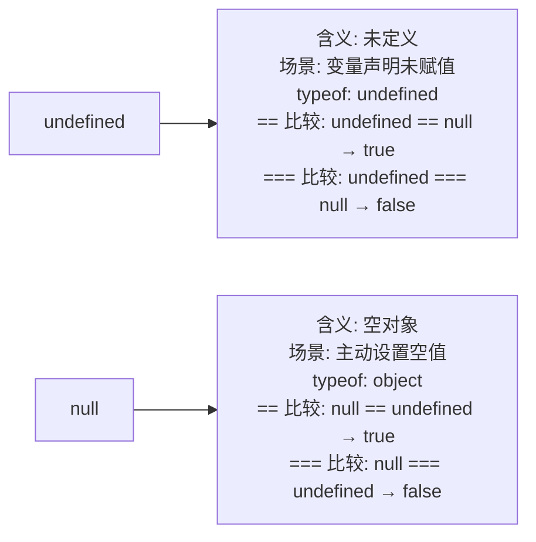
```mermaid
graph LR
    A["undefined"] --> B["含义: 未定义<br/>场景: 变量声明未赋值<br/>typeof: undefined<br/>== 比较: undefined == null → true<br/>=== 比较: undefined === null → false"]
    C["null"] --> D["含义: 空对象<br/>场景: 主动设置空值<br/>typeof: object<br/>== 比较: null == undefined → true<br/>=== 比较: null === undefined → false"]
```

| 对比项 | undefined | null |
|--------|-----------|------|
| 含义 | 未定义 | 空对象 |
| 类型 | undefined | object（typeof） |
| 转数字 | NaN | 0 |
| JSON序列化 | 被忽略 | 保留为 null |
| 常见场景 | 变量声明未赋值、函数无返回值 | 主动释放引用、原型链终点 |

`undefined` 在 JavaScript 中**不是保留字**，这意味着可以使用 `undefined` 作为变量名（极不推荐）。可以用 `void 0` 获取安全的 `undefined`。

### 5️⃣ typeof null 的结果为什么是 Object？

在 JavaScript 第一个版本中，所有值都存储在 32 位的单元中，每个单元包含一个小的**类型标签（1-3 bits）**：

```
000: object
  1: int
010: double
100: string
110: boolean
```

`null` 的值是机器码 NULL 指针（全0），类型标签也是 `000`，和 `object` 类型标签一样，所以被判定为 `object`。这是 JS 设计之初的遗留 bug，但为了兼容性一直保留至今。

### 6️⃣ instanceof 操作符的实现原理

```javascript
// myInstanceof 手动实现 instanceof 原理
function myInstanceof(left, right) {
  let proto = Object.getPrototypeOf(left)
  let prototype = right.prototype;

  while (true) {
    if (!proto) return false;
    if (proto === prototype) return true;
    proto = Object.getPrototypeOf(proto);
  }
}
```

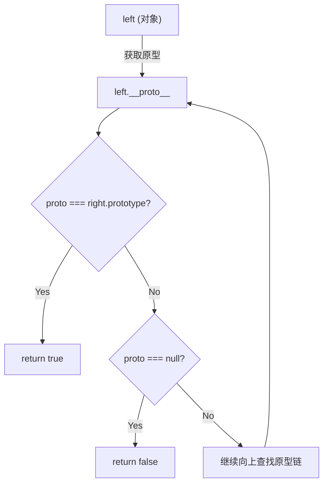
```mermaid
graph TD
    A["left (对象)"] -->|获取原型| B["left.__proto__"]
    B --> C{"proto === right.prototype?"}
    C -->|Yes| D["return true"]
    C -->|No| E{"proto === null?"}
    E -->|Yes| F["return false"]
    E -->|No| G["继续向上查找原型链"]
    G --> B
```

### 7️⃣ 为什么 0.1 + 0.2 !== 0.3？

> ⚠️ **经典面试题**：浮点数精度问题源于 IEEE 754 双精度标准。0.1 和 0.2 的二进制是无限循环小数，截断后相加产生误差。解决方案：`toFixed`、`Number.EPSILON` 或放大倍数计算。**注意：这不是 JS 特有的问题**，所有使用 IEEE 754 的语言都会遇到。

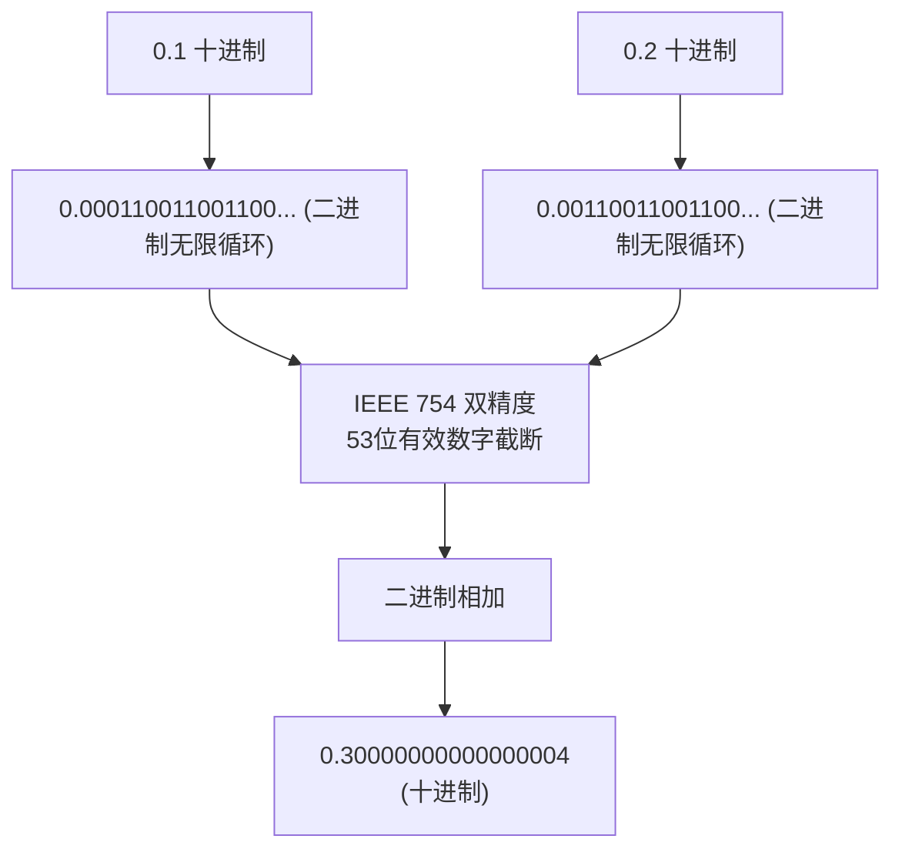
```mermaid
graph TD
    A["0.1 十进制"] --> B["0.000110011001100... (二进制无限循环)"]
    C["0.2 十进制"] --> D["0.00110011001100... (二进制无限循环)"]
    B --> E["IEEE 754 双精度<br/>53位有效数字截断"]
    D --> E
    E --> F["二进制相加"]
    F --> G["0.30000000000000004<br/>(十进制)"]
```

**原因：** JavaScript 的 Number 遵循 IEEE 754 标准，使用 64 位双精度浮点数表示。

- 符号位（sign）：1 bit
- 指数位（exponent）：11 bit
- 小数位（fraction）：52 bit

0.1 和 0.2 的二进制都是无限循环小数，IEEE 754 只能保留 53 位有效数字（52 位 + 隐含的 1 位），超出部分"0 舍 1 入"，导致精度丢失。

**解决方案：**

```javascript
// 方法1: toFixed
(0.1 + 0.2).toFixed(2)  // "0.30"

// 方法2: ES6 Number.EPSILON
function numberepsilon(arg1, arg2) {
  return Math.abs(arg1 - arg2) < Number.EPSILON;
}
console.log(numberepsilon(0.1 + 0.2, 0.3)); // true

// 方法3: 放大倍数后计算
(0.1 * 10 + 0.2 * 10) / 10  // 0.3
```

### 8️⃣ 如何获取安全的 undefined 值？

```javascript
void 0        // undefined
void (1 + 1)  // undefined
void 'hello'  // undefined
```

`void` 运算符对给定的表达式求值，然后返回 `undefined`。因为 `undefined` 可以被重写（非严格模式下），使用 `void 0` 最安全。

### 9️⃣ typeof NaN 的结果是什么？

```javascript
typeof NaN  // "number"
```

`NaN`（Not a Number）是一个"警戒值"，表示数学运算失败的结果。它是唯一一个**与自身不相等**的值：

```javascript
NaN === NaN  // false
NaN !== NaN  // true
```

### 1️⃣0️⃣ isNaN 和 Number.isNaN 的区别

| 方法 | 行为 | 特点 |
|------|------|------|
| `isNaN()` | 先尝试转换为数字，再判断 | 非数字值也会返回 true，不准确 |
| `Number.isNaN()` | 先判断是否为数字类型，再判断 | 更准确，不进行类型转换 |

```javascript
isNaN('hello')          // true (先转换 Number('hello') → NaN，然后判断)
Number.isNaN('hello')   // false (先判断类型，'hello' 不是 number，直接 false)
Number.isNaN(NaN)       // true
```

### 1️⃣1️⃣ 其他值到字符串的转换规则

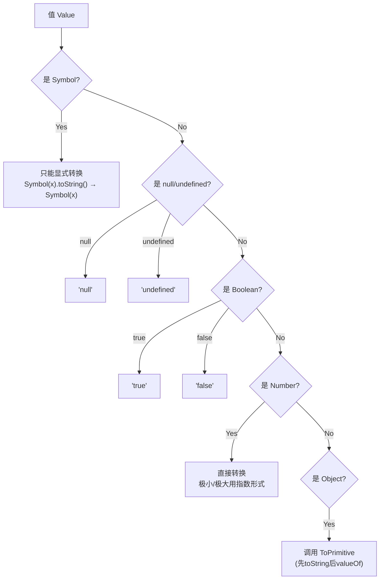
```mermaid
graph TD
    A["值 Value"] --> B{"是 Symbol?"}
    B -->|Yes| C["只能显式转换<br/>Symbol(x).toString() → Symbol(x)"]
    B -->|No| D{"是 null/undefined?"}
    D -->|null| E["'null'"]
    D -->|undefined| F["'undefined'"]
    D -->|No| G{"是 Boolean?"}
    G -->|true| H["'true'"]
    G -->|false| I["'false'"]
    G -->|No| J{"是 Number?"}
    J -->|Yes| K["直接转换<br/>极小/极大用指数形式"]
    J -->|No| L{"是 Object?"}
    L -->|Yes| M["调用 ToPrimitive<br/>(先toString后valueOf)"]
```

### 1️⃣2️⃣ 其他值到数字值的转换规则

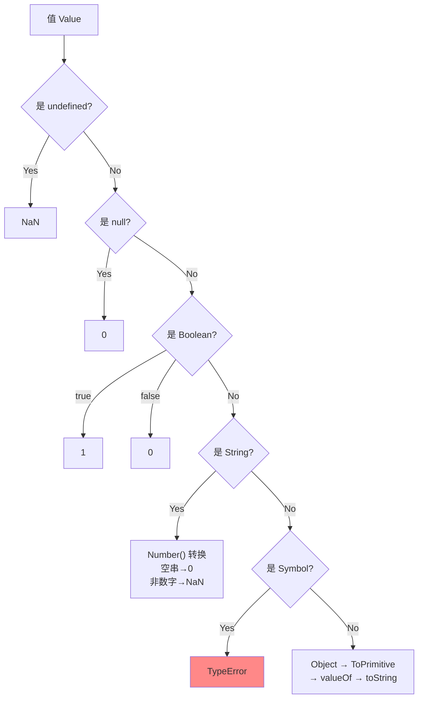
```mermaid
graph TD
    A["值 Value"] --> B{"是 undefined?"}
    B -->|Yes| C["NaN"]
    B -->|No| D{"是 null?"}
    D -->|Yes| E["0"]
    D -->|No| F{"是 Boolean?"}
    F -->|true| G["1"]
    F -->|false| H["0"]
    F -->|No| I{"是 String?"}
    I -->|Yes| J["Number() 转换<br/>空串→0<br/>非数字→NaN"]
    I -->|No| K{"是 Symbol?"}
    K -->|Yes| L["TypeError"]
    K -->|No| M["Object → ToPrimitive<br/>→ valueOf → toString"]

    style L fill:#f88
```

**ToPrimitive 抽象操作流程：**

当 `type = number` 时：
1. 调用 `valueOf()`，如果返回原始值，则返回
2. 否则调用 `toString()`，如果返回原始值，则返回
3. 否则抛出 `TypeError`

当 `type = string` 时（仅 Date 对象默认）：
1. 调用 `toString()`，如果返回原始值，则返回
2. 否则调用 `valueOf()`，如果返回原始值，则返回
3. 否则抛出 `TypeError`

### 1️⃣3️⃣ 其他值到布尔类型的转换规则

**假值（Falsy）列表：**

| 值 | 转布尔结果 |
|----|-----------|
| `undefined` | `false` |
| `null` | `false` |
| `false` | `false` |
| `+0`、`-0`、`NaN` | `false` |
| `""`（空字符串） | `false` |

所有其他值都是**真值（Truthy）**，包括 `"false"` 字符串、`[]`、`{}`、`Infinity` 等。

### 1️⃣4️⃣ || 和 && 操作符的返回值

这两个操作符返回的是**操作数的值**，而非布尔值。

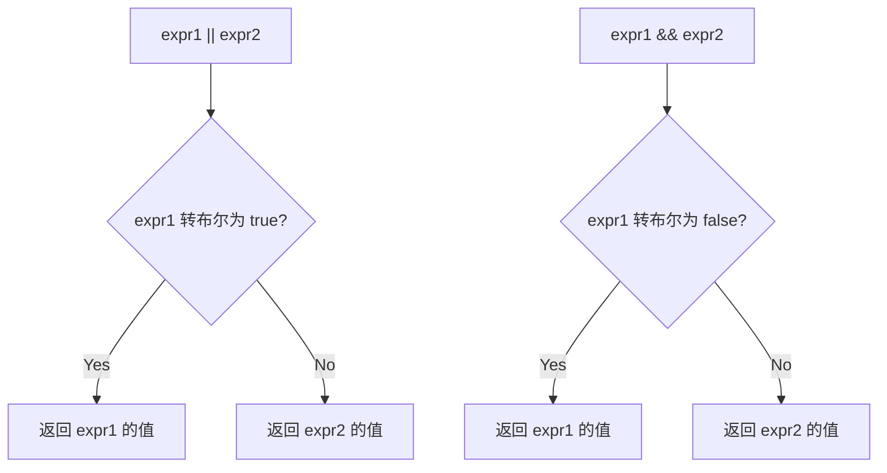
```mermaid
graph TD
    A["expr1 || expr2"] --> B{"expr1 转布尔为 true?"}
    B -->|Yes| C["返回 expr1 的值"]
    B -->|No| D["返回 expr2 的值"]

    E["expr1 && expr2"] --> F{"expr1 转布尔为 false?"}
    F -->|Yes| G["返回 expr1 的值"]
    F -->|No| H["返回 expr2 的值"]
```

```javascript
0 || 'default'       // 'default'
'' || 'hello'        // 'hello'
'abc' && 123         // 123
null && 'anything'   // null
```

### 1️⃣5️⃣ Object.is() 与 == 和 === 的区别

| 比较方式 | 类型转换 | 特殊处理 |
|---------|---------|---------|
| `==` | **会**进行类型转换 | `null == undefined` → true |
| `===` | **不**进行类型转换 | 严格相等 |
| `Object.is()` | **不**进行类型转换 | 修复了 `===` 的两种特殊情况 |

```javascript
// 区别1: NaN 处理
NaN === NaN           // false
Object.is(NaN, NaN)   // true

// 区别2: +0 和 -0
+0 === -0             // true
Object.is(+0, -0)     // false
```

### 1️⃣6️⃣ 什么是 JavaScript 中的包装类型？

原始类型本身没有属性和方法，但 JavaScript 在访问原始类型的属性或方法时，会在后台隐式地将其转换为对应的**包装对象**。

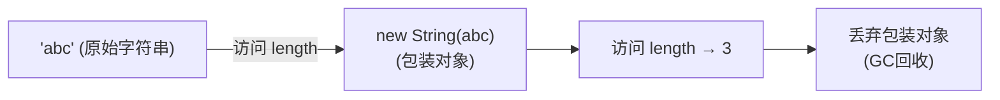
```mermaid
graph LR
    A["'abc' (原始字符串)"] -->|访问 length| B["new String(abc)<br/>(包装对象)"]
    B --> C["访问 length → 3"]
    C --> D["丢弃包装对象<br/>(GC回收)"]
```

```javascript
const a = "abc";
a.length;         // 3 → 内部临时创建 String 包装对象
a.toUpperCase();  // "ABC"

// 显式创建包装对象
Object('abc')     // String {"abc"}
new Number(123)   // Number {123}

// 包装对象转回原始值
var b = Object('abc');
b.valueOf()       // 'abc'
```

**陷阱示例：**
```javascript
var a = new Boolean(false);
if (!a) {
  console.log("不会执行");  // a 是对象，对象永远是 truthy
}
```

### 1️⃣7️⃣ JavaScript 中如何进行隐式类型转换？

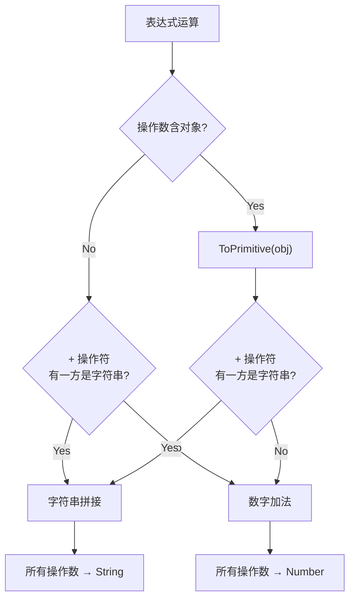
```mermaid
graph TD
    A["表达式运算"] --> B{"操作数含对象?"}
    B -->|Yes| C["ToPrimitive(obj)"]
    B -->|No| D{"+ 操作符<br/>有一方是字符串?"}
    C --> E{"+ 操作符<br/>有一方是字符串?"}
    D -->|Yes| F["字符串拼接"]
    D -->|No| G["数字加法"]
    E -->|Yes| F
    E -->|No| G
    F --> H["所有操作数 → String"]
    G --> I["所有操作数 → Number"]
```

**+ 操作符规则：**
- 有一方是字符串 → 字符串拼接
- 否则 → 数字加法

```javascript
1 + '23'        // '123'
1 + false       // 1
'1' + false     // '1false'
false + true    // 1
```

**-、*、/ 操作符规则：**
- 所有操作数转数字

```javascript
1 * '23'        // 23
1 * false       // 0
1 / 'aa'        // NaN
```

**== 操作符规则：**
- 两边的值尽量转为 `number` 比较

```javascript
3 == true       // false (3 → 3, true → 1)
'0' == false    // true  ('0' → 0, false → 0)
'0' == 0        // true  ('0' → 0)
```

### 1️⃣8️⃣ + 操作符何时用于字符串拼接？

根据 ES5 规范，如果某个操作数是字符串或能通过 `ToPrimitive` 转换为字符串，则进行拼接。如果其中一个操作数是对象（包括数组），首先对其调用 `ToPrimitive(obj, number)`：

```javascript
var a = {name: 'Jack'}
var b = {age: 18}
a + b  // "[object Object][object Object]"

// 运算过程:
// a.valueOf() → {} (还是对象)
// a.toString() → "[object Object]"
// b.valueOf() → {}
// b.toString() → "[object Object]"
// 结果: "[object Object][object Object]"
```

### 1️⃣9️⃣ 为什么会有 BigInt 的提案？

`Number.MAX_SAFE_INTEGER = 9007199254740991`（2^53 - 1）

超过这个范围，JavaScript 的数字计算会出现精度丢失：

```javascript
9007199254740991 + 1  // 9007199254740992 (正确)
9007199254740991 + 2  // 9007199254740992 (错误，应该是 9007199254740993)
```

**BigInt 解决方案：**
```javascript
BigInt(9007199254740991) + 2n  // 9007199254740993n
```

### 2️⃣0️⃣ Object.assign 和扩展运算符：深拷贝还是浅拷贝？

**两者都是浅拷贝！**

```javascript
let outObj = {
  inObj: {a: 1, b: 2}
}

// 扩展运算符
let newObj1 = {...outObj}
newObj1.inObj.a = 2
console.log(outObj.inObj.a)  // 2 (被修改了！)

// Object.assign
let newObj2 = Object.assign({}, outObj)
newObj2.inObj.a = 2
console.log(outObj.inObj.a)  // 2 (也被修改了！)
```

**区别：**
- `Object.assign()`：第一个参数为目标对象，会触发 ES6 setter
- 扩展运算符 `...`：不复制继承的属性和类的属性，但复制 ES6 symbols 属性

### 2️⃣1️⃣ 如何判断一个对象是空对象？

```javascript
// 方法1: JSON 序列化
JSON.stringify(obj) === '{}'

// 方法2: Object.keys (推荐)
Object.keys(obj).length === 0

// 方法3: 遍历 for...in + hasOwnProperty
function isEmpty(obj) {
  for (let key in obj) {
    if (obj.hasOwnProperty(key)) return false
  }
  return true
}

// 方法4: Object.getOwnPropertyNames
Object.getOwnPropertyNames(obj).length === 0
```

---

## 🔧 二、ES6

### 1️⃣ let、const、var 的区别

> 💡 **要点**：`var` 有变量提升，可重复声明，无块级作用域；`let`/`const` 有块级作用域和暂时性死区（TDZ），不可重复声明。`const` 声明时必须初始化，且不能改变指针指向（但可修改对象属性）。

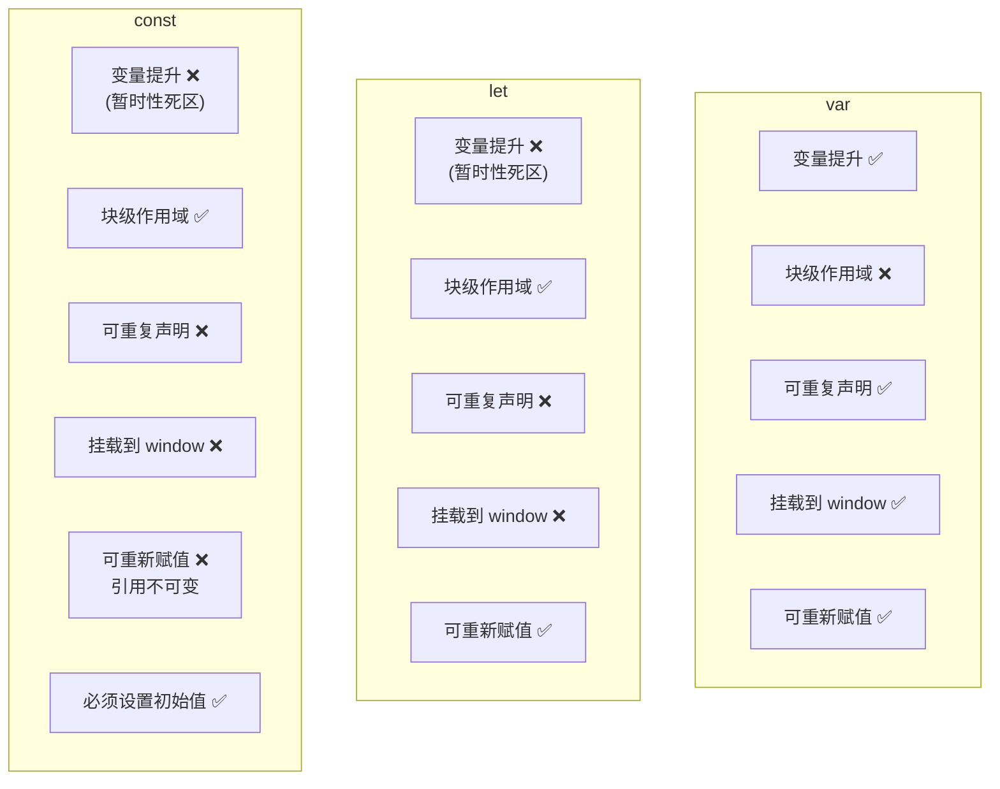
```mermaid
graph TD
    subgraph var
        V1["变量提升 ✅"]
        V2["块级作用域 ❌"]
        V3["可重复声明 ✅"]
        V4["挂载到 window ✅"]
        V5["可重新赋值 ✅"]
    end

    subgraph let
        L1["变量提升 ❌<br/>(暂时性死区)"]
        L2["块级作用域 ✅"]
        L3["可重复声明 ❌"]
        L4["挂载到 window ❌"]
        L5["可重新赋值 ✅"]
    end

    subgraph const
        C1["变量提升 ❌<br/>(暂时性死区)"]
        C2["块级作用域 ✅"]
        C3["可重复声明 ❌"]
        C4["挂载到 window ❌"]
        C5["可重新赋值 ❌<br/>引用不可变"]
        C6["必须设置初始值 ✅"]
    end
```

| 区别 | var | let | const |
|------|-----|-----|-------|
| 块级作用域 | ❌ | ✅ | ✅ |
| 变量提升 | ✅ | ❌（暂时性死区） | ❌（暂时性死区） |
| 挂载到全局对象 | ✅（window.varName） | ❌ | ❌ |
| 重复声明 | ✅（可覆盖） | ❌（报错） | ❌（报错） |
| 暂时性死区 | ❌ | ✅ | ✅ |
| 必须设置初始值 | ❌ | ❌ | ✅ |
| 改变指针指向 | ✅ | ✅ | ❌ |

**暂时性死区（Temporal Dead Zone, TDZ）：**
```javascript
console.log(a)  // undefined (var 提升)
var a = 1

console.log(b)  // ReferenceError! (TDZ)
let b = 2
```

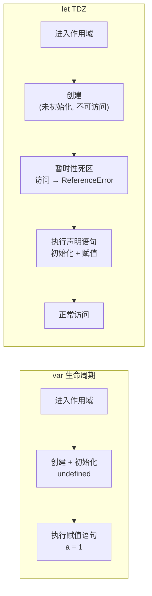
```mermaid
graph LR
    subgraph var 生命周期
        V1["进入作用域"] --> V2["创建 + 初始化<br/>undefined"]
        V2 --> V3["执行赋值语句<br/>a = 1"]
    end

    subgraph let TDZ
        L1["进入作用域"] --> L2["创建<br/>(未初始化, 不可访问)"]
        L2 --> L3["暂时性死区<br/>访问 → ReferenceError"]
        L3 --> L4["执行声明语句<br/>初始化 + 赋值"]
        L4 --> L5["正常访问"]
    end
```

### 2️⃣ const 对象的属性可以修改吗？

**可以修改属性，但不能重新赋值。**

```javascript
const obj = { name: 'Tom' }
obj.name = 'Jerry'  // ✅ 属性修改允许
obj = {}            // ❌ TypeError: Assignment to constant variable

const arr = [1, 2, 3]
arr.push(4)         // ✅ 数组操作允许
arr = []            // ❌ TypeError
```

**原理：** `const` 保证的是变量指向的内存地址不能改变。对于原始类型，值就在栈内存中，所以值本身不可变。对于引用类型，栈中保存的是指针（堆地址），`const` 保证指针不变，但堆中的数据仍然可变。

### 3️⃣ 如果 new 一个箭头函数会怎么样？

**会报错：** `arrowFn is not a constructor`

箭头函数不能作为构造函数，因为：
1. 箭头函数没有 `prototype` 属性
2. 箭头函数没有自己的 `this`，不能绑定到新对象
3. 箭头函数不能使用 `arguments`

### 4️⃣ 箭头函数与普通函数的区别

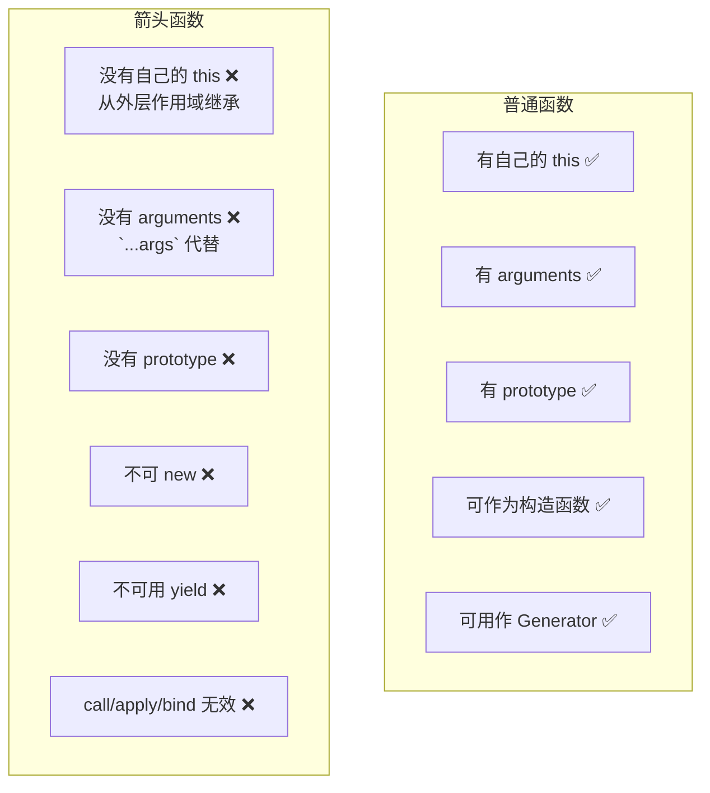
```mermaid
graph TD
    subgraph 普通函数
        A1["有自己的 this ✅"]
        A2["有 arguments ✅"]
        A3["有 prototype ✅"]
        A4["可作为构造函数 ✅"]
        A5["可用作 Generator ✅"]
    end

    subgraph 箭头函数
        B1["没有自己的 this ❌<br/>从外层作用域继承"]
        B2["没有 arguments ❌<br/>`...args` 代替"]
        B3["没有 prototype ❌"]
        B4["不可 new ❌"]
        B5["不可用 yield ❌"]
        B6["call/apply/bind 无效 ❌"]
    end
```

**（1）简洁语法：**
```javascript
// 无参数
const fn1 = () => {}
// 单参数，省略括号
const fn2 = x => x * 2
// 多参数
const fn3 = (a, b) => a + b
// 返回值是对象需要括号
const fn4 = () => ({ name: 'Tom' })
// 无返回值
const fn5 = () => void console.log('test')
```

**（2）没有自己的 this：**
```javascript
const obj = {
  id: 'OBJ',
  normal: function() { console.log(this.id) },  // this → obj
  arrow: () => { console.log(this.id) }          // this → 外层 (window/global)
}
obj.normal()  // 'OBJ'
obj.arrow()   // undefined (严格模式) 或 全局 id
```

**（3）this 不可改变：**
```javascript
const arrowFn = () => console.log(this)
arrowFn.call({id: 1})   // 还是指向外层 this
arrowFn.apply({id: 1})  // 还是指向外层 this
arrowFn.bind({id: 1})() // 还是指向外层 this
```

**（4）没有 arguments：**
```javascript
const normalFn = function() { console.log(arguments) }
normalFn(1, 2, 3)  // Arguments(3) [1, 2, 3]

const arrowFn = (...args) => console.log(args)  // 用 rest 参数替代
arrowFn(1, 2, 3)  // [1, 2, 3]
```

### 5️⃣ 箭头函数的 this 指向哪里？

箭头函数捕获其所在上下文的 `this` 值作为自己的 `this`，且不可改变。

**Babel 转译理解：**
```javascript
// ES6
const obj = {
  getArrow() {
    return () => console.log(this === obj)
  }
}

// ES5 (Babel 转译后)
var obj = {
  getArrow: function getArrow() {
    var _this = this  // → 捕获外层 this
    return function() {
      console.log(_this === obj)
    }
  }
}
```

### 6️⃣ 扩展运算符的作用及使用场景

#### 对象扩展运算符

```javascript
// 复制对象（浅拷贝）
let bar = { a: 1, b: 2 }
let baz = { ...bar }  // { a: 1, b: 2 }

// 等价于 Object.assign
let baz2 = Object.assign({}, bar)

// 覆盖属性
let merged = { ...bar, ...{a: 2, b: 4} }  // { a: 2, b: 4 }

// 修改对象的部分属性（Redux reducer 常用）
const newState = { ...state, user: { ...state.user, name: 'newName' } }
```

#### 数组扩展运算符

```javascript
// 参数序列
function add(x, y) { return x + y }
const numbers = [1, 2]
add(...numbers)  // 3

// 复制数组（浅拷贝）
const arr1 = [1, 2]
const arr2 = [...arr1]

// 合并数组
const merged = ['one', ...arr1, 'four']  // ['one', 1, 2, 'four']

// 解构赋值
const [first, ...rest] = [1, 2, 3, 4]  // first=1, rest=[2,3,4]

// 字符串转数组
[...'hello']  // ['h', 'e', 'l', 'l', 'o']

// 类数组转数组
function foo() {
  const args = [...arguments]
}
```

### 7️⃣ 对对象与数组的解构的理解

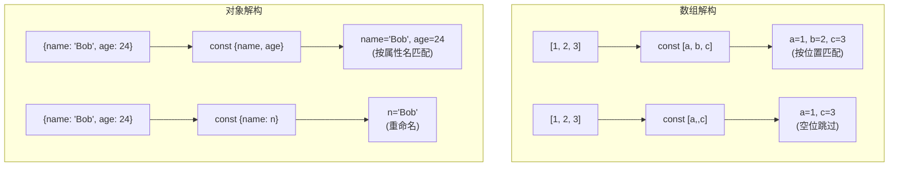
```mermaid
graph TD
    subgraph 数组解构
        A1["[1, 2, 3]"] --> A2["const [a, b, c]"]
        A2 --> A3["a=1, b=2, c=3<br/>(按位置匹配)"]
        A4["[1, 2, 3]"] --> A5["const [a,,c]"]
        A5 --> A6["a=1, c=3<br/>(空位跳过)"]
    end

    subgraph 对象解构
        B1["{name: 'Bob', age: 24}"] --> B2["const {name, age}"]
        B2 --> B3["name='Bob', age=24<br/>(按属性名匹配)"]
        B4["{name: 'Bob', age: 24}"] --> B5["const {name: n}"]
        B5 --> B6["n='Bob'<br/>(重命名)"]
    end
```

### 8️⃣ 提取高度嵌套的对象里的指定属性

```javascript
const school = {
  classes: {
    stu: {
      name: 'Bob',
      age: 24
    }
  }
}

// 方法1: 逐层解构
const { classes } = school
const { stu } = classes
const { name } = stu

// 方法2: 一行解构（推荐）
const { classes: { stu: { name } } } = school
console.log(name)  // 'Bob'

// 解构 + 重命名
const { classes: { stu: { name: studentName } } } = school
console.log(studentName)  // 'Bob'
```

### 9️⃣ 对 rest 参数的理解

Rest 参数将多个独立参数收集到一个数组中：

```javascript
// 收集剩余参数
function sum(...numbers) {
  return numbers.reduce((acc, cur) => acc + cur, 0)
}
sum(1, 2, 3, 4)  // 10

// 与解构结合
const [first, second, ...rest] = [1, 2, 3, 4, 5]
// first=1, second=2, rest=[3,4,5]

// 注意: rest 参数必须在最后
// const [...rest, last] = [1,2,3]  ❌ 语法错误
```

### 1️⃣0️⃣ ES6 中模板语法与字符串处理

**模板字符串特性：**
1. `${}` 嵌入变量/表达式
2. 保留空格、缩进、换行
3. 支持运算表达式

```javascript
const name = 'css'
const career = 'coder'
const html = `
  <div>
    <h1>${name}</h1>
    <p>${career}</p>
    <p>${1 + 2}</p>
  </div>
`
```

**新增字符串方法：**

| 方法 | 作用 | 示例 |
|------|------|------|
| `includes()` | 是否包含子串 | `'hello'.includes('ell')` → true |
| `startsWith()` | 是否以某串开头 | `'hello'.startsWith('he')` → true |
| `endsWith()` | 是否以某串结尾 | `'hello'.endsWith('lo')` → true |
| `repeat()` | 重复字符串 | `'ab'.repeat(3)` → `'ababab'` |

---

## 🧱 三、JavaScript 基础

### 1️⃣ new 操作符的实现原理

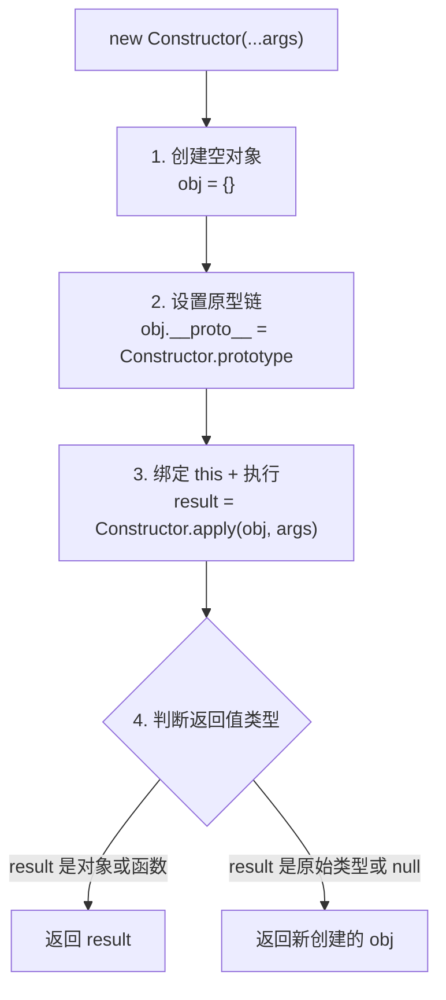
```mermaid
graph TD
    A["new Constructor(...args)"] --> B["1. 创建空对象<br/>obj = {}"]
    B --> C["2. 设置原型链<br/>obj.__proto__ = Constructor.prototype"]
    C --> D["3. 绑定 this + 执行<br/>result = Constructor.apply(obj, args)"]
    D --> E{"4. 判断返回值类型"}
    E -->|"result 是对象或函数"| F["返回 result"]
    E -->|"result 是原始类型或 null"| G["返回新创建的 obj"]
```

**手动实现：**

```javascript
function objectFactory() {
  let newObject = null
  let constructor = Array.prototype.shift.call(arguments)
  let result = null

  if (typeof constructor !== "function") {
    console.error("type error")
    return
  }

  // 1+2: 创建空对象并链接原型
  newObject = Object.create(constructor.prototype)

  // 3: 绑定 this 并执行
  result = constructor.apply(newObject, arguments)

  // 4: 判断返回类型
  let flag = result && (typeof result === "object" || typeof result === "function")
  return flag ? result : newObject
}
```

### 2️⃣ Map 和 Object 的区别

| 特性 | Map | Object |
|------|-----|--------|
| 键的类型 | 任意类型（包括对象、函数） | String 或 Symbol |
| 键的顺序 | 按插入顺序有序 | 无序（ES6 后部分有序） |
| size | `map.size` 直接获取 | 需手动计算 `Object.keys().length` |
| 迭代 | 原生可迭代（`for...of`） | 需先获取 keys |
| 性能 | 频繁增删改查更优 | 未针对此场景优化 |
| 原型继承 | 无默认键 | 有原型链，可能产生冲突 |

### 3️⃣ Map 和 WeakMap 的区别

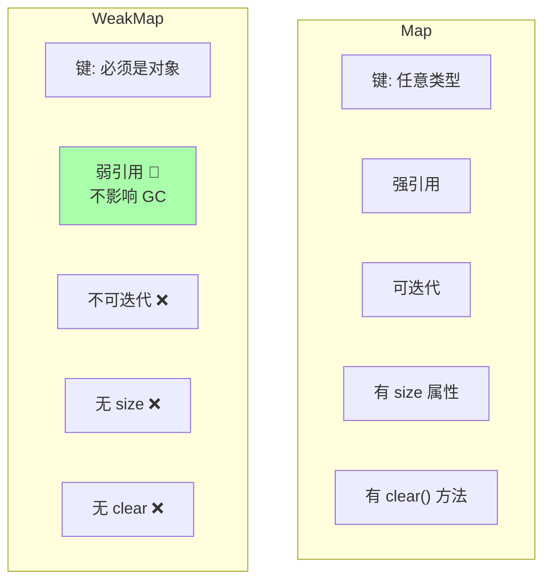
```mermaid
graph TD
    subgraph Map
        M1["键: 任意类型"]
        M2["强引用"]
        M3["可迭代"]
        M4["有 size 属性"]
        M5["有 clear() 方法"]
    end

    subgraph WeakMap
        W1["键: 必须是对象"]
        W2["弱引用 🔑<br/>不影响 GC"]
        W3["不可迭代 ❌"]
        W4["无 size ❌"]
        W5["无 clear ❌"]
    end

    style W2 fill:#afa
```

**WeakMap 弱引用机制：**
```javascript
let obj = { name: 'Tom' }
const wm = new WeakMap()
wm.set(obj, 'some data')

obj = null  // 引用被删除
// WeakMap 中的键名对象会被 GC 自动回收，无需手动删除
```

**应用场景：**
- 存储 DOM 元素的私有数据
- 缓存数据（对象不再被使用时自动释放）
- 防止内存泄漏

### 4️⃣ JavaScript 有哪些内置对象

**分类总结：**

| 分类 | 示例 |
|------|------|
| 值属性 | `Infinity`、`NaN`、`undefined`、`null` |
| 函数属性 | `eval()`、`parseInt()`、`parseFloat()`、`isNaN()` |
| 基本对象 | `Object`、`Function`、`Boolean`、`Symbol`、`Error` |
| 数字日期 | `Number`、`Math`、`Date` |
| 字符串 | `String`、`RegExp` |
| 可索引集合 | `Array`、`Int8Array`、`Uint8Array` 等 |
| 键值集合 | `Map`、`Set`、`WeakMap`、`WeakSet` |
| 结构化数据 | `JSON`、`ArrayBuffer`、`DataView` |
| 控制抽象 | `Promise`、`Generator`、`Iterator` |
| 反射 | `Reflect`、`Proxy` |
| 国际化 | `Intl`、`Intl.Collator` |

### 5️⃣ 常用的正则表达式

```javascript
// 16进制颜色
/#([0-9a-fA-F]{6}|[0-9a-fA-F]{3})/g

// 日期 yyyy-mm-dd
/^[0-9]{4}-(0[1-9]|1[0-2])-(0[1-9]|[12][0-9]|3[01])$/

// QQ号
/^[1-9][0-9]{4,10}$/g

// 手机号
/^1[34578]\d{9}$/g

// 用户名（字母开头，4-16位字母数字下划线）
/^[a-zA-Z\$][a-zA-Z0-9_\$]{4,16}$/
```

### 6️⃣ 对 JSON 的理解

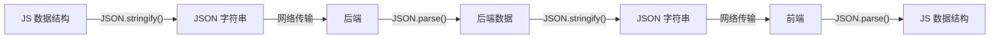
```mermaid
graph LR
    A["JS 数据结构"] -->|"JSON.stringify()"| B["JSON 字符串"]
    B -->|"网络传输"| C["后端"]
    C -->|"JSON.parse()"| D["后端数据"]
    D -->|"JSON.stringify()"| E["JSON 字符串"]
    E -->|"网络传输"| F["前端"]
    F -->|"JSON.parse()"| G["JS 数据结构"]
```

**JSON 与 JS 对象的区别：**
- JSON 属性值不能为函数
- JSON 属性名必须用双引号
- JSON 中不能出现 `undefined`、`NaN`
- JSON 中不能有注释

**JSON.stringify 的特殊处理：**
```javascript
JSON.stringify({a: undefined, b: function(){}, c: Symbol()})
// '{}'  // 忽略 undefined、函数、Symbol

JSON.stringify({a: /abc/})
// '{"a":{}}'  // RegExp 转空对象

JSON.stringify({a: NaN, b: Infinity, c: -Infinity})
// '{"a":null,"b":null,"c":null}'  // 特殊数字转 null
```

### 7️⃣ JavaScript 脚本延迟加载的方式

| 方式 | 说明 |
|------|------|
| `defer` 属性 | 与文档解析同步加载，文档解析完后按顺序执行 |
| `async` 属性 | 异步加载，加载完成后立即执行（顺序不可预测） |
| 动态创建 DOM | `document.createElement('script')`，文档加载完后插入 |
| `setTimeout` | 设置定时器延迟加载 |
| 放在底部 | `</body>` 前放置 script 标签 |

```html
<!-- defer: 解析完 HTML 后执行，多个 defer 按顺序 -->
<script defer src="script.js"></script>

<!-- async: 加载完立即执行，不保证顺序 -->
<script async src="script.js"></script>
```

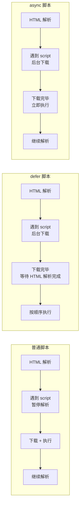
```mermaid
graph LR
    subgraph 普通脚本
        A1["HTML 解析"] --> A2["遇到 script<br/>暂停解析"] --> A3["下载 + 执行"] --> A4["继续解析"]
    end

    subgraph defer 脚本
        B1["HTML 解析"] --> B2["遇到 script<br/>后台下载"] --> B3["下载完毕<br/>等待 HTML 解析完成"] --> B4["按顺序执行"]
    end

    subgraph async 脚本
        C1["HTML 解析"] --> C2["遇到 script<br/>后台下载"] --> C3["下载完毕<br/>立即执行"] --> C4["继续解析"]
    end
```

### 8️⃣ 类数组对象的定义与转换

**类数组对象：** 拥有 `length` 属性和数字索引的对象。

```javascript
// 常见类数组
arguments         // 函数的参数对象
document.querySelectorAll('div')  // NodeList
document.forms    // HTMLCollection
```

**转换为数组的四种方法：**

```javascript
// 1. Array.prototype.slice.call
Array.prototype.slice.call(arrayLike)

// 2. Array.prototype.splice.call
Array.prototype.splice.call(arrayLike, 0)

// 3. Array.prototype.concat.apply
Array.prototype.concat.apply([], arrayLike)

// 4. Array.from (ES6 推荐)
Array.from(arrayLike)

// 5. 扩展运算符（需可迭代）
;[...arrayLike]
```

### 9️⃣ 数组有哪些原生方法？

| 类别 | 方法 | 影响原数组 | 描述 |
|------|------|-----------|------|
| 转换 | `toString()`、`join()` | ❌ | 数组转字符串 |
| 尾部操作 | `push()`、`pop()` | ✅ | 尾部增删 |
| 首部操作 | `shift()`、`unshift()` | ✅ | 首部增删 |
| 排序 | `reverse()`、`sort()` | ✅ | 排序/反转 |
| 连接 | `concat()` | ❌ | 合并数组 |
| 截取 | `slice()` | ❌ | 返回子数组 |
| 增删改 | `splice()` | ✅ | 全能操作 |
| 查找 | `indexOf()`、`lastIndexOf()`、`includes()` | ❌ | 查找元素 |
| 迭代 | `forEach()`、`map()`、`filter()`、`some()`、`every()` | ❌ | 遍历处理 |
| 归并 | `reduce()`、`reduceRight()` | ❌ | 累计计算 |
| 扁平 | `flat()`、`flatMap()` | ❌ | 数组扁平化 |
| 填充 | `fill()`、`copyWithin()` | ✅ | 批量填充 |

### 1️⃣0️⃣ Unicode、UTF-8、UTF-16、UTF-32 的区别

```mermaid
graph TD
    A["字符"] --> B["Unicode<br/>字符集<br/>给每个字符分配唯一编号"]
    B --> C["编码规则"]
    C --> D["UTF-8<br/>变长 1-4 字节<br/>兼容 ASCII"]
    C --> E["UTF-16<br/>变长 2 或 4 字节<br/>有代理对机制"]
    C --> F["UTF-32<br/>固定 4 字节<br/>空间大但直接"]
```

| 特性 | Unicode | UTF-8 | UTF-16 | UTF-32 |
|------|---------|-------|--------|--------|
| 类型 | 字符集 | 编码规则 | 编码规则 | 编码规则 |
| 字节长度 | - | 1-4 可变 | 2 或 4 | 固定 4 |
| 兼容 ASCII | - | ✅ | ❌ | ❌ |
| 中文占用 | - | 3 字节 | 2 字节 | 4 字节 |
| 容错性 | - | 差（错一个影响后续） | 好（只错一个字符） | 好 |

**Unicode 平面概念：**
- **基本平面（BMP）：** U+0000 ~ U+FFFF，65536 个码位
- **辅助平面（SMP）：** U+10000 ~ U+10FFFF，16 个平面

**UTF-16 代理对机制：**
```javascript
// "𡠀" 字 U+21800，超出 BMP
// 计算: 0x21800 - 0x10000 = 0x11800
// 二进制: 0001000110 0000000000
// 高位 (U+D800 + 前10位) → 0xD846
// 低位 (U+DC00 + 后10位) → 0xDC00
// UTF-16 编码: 0xD846 0xDC00
```

### 1️⃣1️⃣ 位运算符

| 运算符 | 名称 | 规则 |
|--------|------|------|
| `&` | 按位与 | 两个位都为1 → 1 |
| `|` | 按位或 | 两个位都为0 → 0 |
| `^` | 按位异或 | 相同为0，相异为1 |
| `~` | 按位取反 | 0变1，1变0 |
| `<<` | 左移 | 高位丢弃，低位补0，相当于乘 2^n |
| `>>` | 右移 | 正数左补0，负数左补1，相当于除 2^n |

### 1️⃣2️⃣ 为什么 arguments 是类数组而不是数组？

`arguments` 是一个对象，有 `length` 和数字索引属性，但**没有继承 `Array.prototype`**，所以不能调用 `push`、`forEach` 等数组方法。它是为了性能考虑而设计的特殊对象。

### 1️⃣3️⃣ 什么是 DOM 和 BOM？

```mermaid
graph TD
    BOM["BOM (Browser Object Model)<br/>浏览器对象模型"] --> W["window"]
    W --> L["location<br/>URL 信息"]
    W --> N["navigator<br/>浏览器信息"]
    W --> S["screen<br/>屏幕信息"]
    W --> H["history<br/>浏览历史"]
    W --> D["document<br/>(DOM 入口)"]
    D --> DOM["DOM (Document Object Model)<br/>文档对象模型"]
```

**DOM：** 文档对象模型，定义了访问和操作 HTML 文档的 API（`getElementById`、`createElement`、`appendChild` 等）。

**BOM：** 浏览器对象模型，提供了与浏览器交互的 API（`alert`、`setTimeout`、`location`、`navigator` 等）。

### 1️⃣4️⃣ escape、encodeURI、encodeURIComponent 的区别

```javascript
const url = "https://example.com/测试 page?name=张三&age=20"

encodeURI(url)
// "https://example.com/%E6%B5%8B%E8%AF%95%20page?name=%E5%BC%A0%E4%B8%89&age=20"
// 保留 URI 结构字符 (:/?#[]@!$&'()*+,;=-._~)

encodeURIComponent("测试 page?name=张三")
// "%E6%B5%8B%E8%AF%95%20page%3Fname%3D%E5%BC%A0%E4%B8%89"
// 编码所有非字母数字字符，包括 ?=& 等
```

| 函数 | 用途 | 编码范围 |
|------|------|---------|
| `encodeURI` | 编码整个 URL | 不编码 URI 保留字符 |
| `encodeURIComponent` | 编码 URL 参数值 | 编码所有特殊字符 |
| `escape`（已弃用） | 编码字符串 | 对非 ASCII 字符编码为 `%uXXXX` |

### 1️⃣5️⃣ 对 AJAX 的理解

**AJAX（Asynchronous JavaScript And XML）：** 在不重新加载整个页面的情况下，与服务器交换数据并更新部分网页。

```mermaid
graph TD
    A["创建 XMLHttpRequest"] --> B["xhr.open(method, url, async)"]
    B --> C["设置请求头<br/>xhr.setRequestHeader"]
    C --> D["注册回调<br/>xhr.onreadystatechange"]
    D --> E["xhr.send(body)"]
    E --> F{"readyState === 4?"}
    F -->|No| G["等待..."]
    F -->|Yes| H{"status 200-299 或 304?"}
    H -->|Yes| I["处理响应数据"]
    H -->|No| J["处理错误"]
```

```javascript
// Promise 封装 AJAX
function getJSON(url) {
  return new Promise(function(resolve, reject) {
    let xhr = new XMLHttpRequest()
    xhr.open("GET", url, true)
    xhr.onreadystatechange = function() {
      if (this.readyState !== 4) return
      if (this.status === 200) {
        resolve(this.response)
      } else {
        reject(new Error(this.statusText))
      }
    }
    xhr.onerror = function() {
      reject(new Error(this.statusText))
    }
    xhr.responseType = "json"
    xhr.setRequestHeader("Accept", "application/json")
    xhr.send(null)
  })
}
```

### 1️⃣6️⃣ 变量提升的原因与问题

```mermaid
graph TD
    A["JS 执行过程"] --> B["1. 解析阶段（编译）"]
    A --> C["2. 执行阶段"]
    B --> D["创建执行上下文"]
    D --> E["变量声明 → undefined"]
    D --> F["函数声明 → 完整函数"]
    D --> G["确定 this"]
    D --> H["创建作用域链"]
```

**变量提升的好处：**
1. **提高性能：** 预编译时一次解析变量和函数声明，分配栈空间，避免每次执行重复解析
2. **容错性更好：** 即使先使用后声明也能正常执行

**变量提升的问题：**
```javascript
// 问题1: 内层变量覆盖外层
var tmp = new Date();
function fn() {
  console.log(tmp);   // undefined (不是外部 Date)
  if (false) {
    var tmp = 'hello';  // 提升到函数顶部
  }
}

// 问题2: 循环变量泄露为全局
for (var i = 0; i < 10; i++) { }
console.log(i)  // 10 (i 变成全局变量)
```

**ES6 的 `let`/`const` 通过块级作用域解决了这些问题。**

### 1️⃣7️⃣ 什么是尾调用？

**尾调用（Tail Call）：** 函数的最后一步是调用另一个函数。

```javascript
// 尾调用 ✅
function f(x) {
  return g(x)
}

// 不是尾调用 ❌
function f(x) {
  return g(x) + 1  // 还有加操作
}

function f(x) {
  g(x)  // 隐式返回 undefined，不是函数最后一步的调用
}
```

**尾调用优化：** 由于是最后一步，当前函数的执行上下文不需要保留，可以直接复用，从而节省内存。ES6 的尾调用优化只在**严格模式**下开启。

```mermaid
graph TD
    subgraph 无尾调用优化
        A["调用 f()"] --> B["push f 上下文"]
        B --> C["f 调用 g()"]
        C --> D["push g 上下文"]
        D --> E["g 执行完毕"]
        E --> F["pop g 上下文"]
        F --> G["f 执行完毕"]
        G --> H["pop f 上下文"]
    end

    subgraph 尾调用优化
        A2["调用 f()"] --> B2["push f 上下文"]
        B2 --> C2["f 最后一步调用 g()"]
        C2 --> D2["pop f 上下文<br/>(无需保留)"]
        D2 --> E2["push g 上下文"]
        E2 --> F2["g 执行完毕"]
        F2 --> G2["pop g 上下文"]
    end
```

### 1️⃣8️⃣ ES6 模块与 CommonJS 模块的异同

| 对比维度 | ES6 Module | CommonJS |
|---------|-----------|----------|
| 输出方式 | 值的引用（只读） | 值的拷贝 |
| 加载方式 | 编译时加载（静态） | 运行时加载（动态） |
| 是否可修改导入值 | ❌（只读引用） | ✅（可以重新赋值） |
| 语法 | `import` / `export` | `require()` / `module.exports` |
| 树摇（Tree Shaking） | ✅ 支持 | ❌ 不支持 |

```javascript
// CommonJS — 值的拷贝
let count = 0
module.exports = { count, increment: () => count++ }
// 导入的是 count 的拷贝，导出后再变化不影响已导入的值

// ES6 Module — 值的引用
export let count = 0
export const increment = () => count++
// 导入的是对 count 的引用，始终同步
```

### 1️⃣9️⃣ 常见的 DOM 操作

```javascript
// 获取节点
document.getElementById('id')
document.getElementsByTagName('div')
document.getElementsByClassName('cls')
document.querySelector('.cls')
document.querySelectorAll('div.cls')

// 创建节点
const div = document.createElement('div')
const text = document.createTextNode('hello')
const fragment = document.createDocumentFragment()

// 插入节点
parent.appendChild(child)
parent.insertBefore(newNode, referenceNode)

// 删除节点
parent.removeChild(child)
child.remove()  // ES5+

// 修改节点
element.innerHTML = '<span>new</span>'
element.textContent = 'new text'
element.setAttribute('class', 'newClass')
element.style.color = 'red'

// 遍历节点
element.parentNode
element.childNodes
element.children
element.nextSibling
element.previousSibling
```

### 2️⃣0️⃣ use strict 是什么？

**严格模式（Strict Mode）** 是 ES5 引入的一种更严格的运行模式。

```javascript
"use strict";  // 全局或函数级开启

// 主要区别：
// 1. 禁止 with 语句
with (obj) { x = 1 }  // SyntaxError

// 2. 禁止 this 指向全局
function test() { console.log(this) }
test()  // undefined (非严格模式为 window)

// 3. 禁止重复属性名
var obj = { a: 1, a: 2 }  // SyntaxError

// 4. 禁止删除不可删除属性
delete Object.prototype  // TypeError

// 5. 禁止八进制字面量
var x = 010  // SyntaxError

// 6. 必须声明变量
x = 1  // ReferenceError
```

### 2️⃣1️⃣ 如何判断对象属于某个类？

```javascript
// 1. instanceof（检查原型链）
obj instanceof Constructor

// 2. constructor（可能被改写）
obj.constructor === Constructor

// 3. Object.prototype.toString（最可靠）
Object.prototype.toString.call(obj)  // 如 [object Array]

// 4. isPrototypeOf
Constructor.prototype.isPrototypeOf(obj)
```

### 2️⃣2️⃣ 强类型 vs 弱类型语言

| 特性 | 强类型（Java/C++） | 弱类型（JavaScript） |
|------|-------------------|-------------------|
| 类型约束 | 变量类型固定，需强制转换 | 变量类型可隐式转换 |
| 示例 | `int a = "1"` ❌ | `var a = "1"` ✅ |
| 严谨性 | 高，编译期错误少 | 低，运行时易出错 |
| 灵活性 | 低 | 高 |

### 2️⃣3️⃣ 解释型 vs 编译型语言

| 特性 | 编译型（C/C++/Go） | 解释型（JavaScript/Python） |
|------|-------------------|--------------------------|
| 执行时机 | 执行前编译成机器码 | 运行时逐行解释 |
| 执行效率 | 高 | 低 |
| 跨平台 | 差（需重新编译） | 好（平台提供解释器） |
| 开发速度 | 慢（需编译） | 快（即时运行） |

JavaScript 是**解释型语言**，但现代 JavaScript 引擎（V8）使用 **JIT（Just-In-Time）编译**技术，将热点代码编译为机器码，大幅提升性能。

### 2️⃣4️⃣ for...in 和 for...of 的区别

```mermaid
graph TD
    subgraph for...in
        A1["遍历键名（key）"]
        A2["会遍历原型链"]
        A3["适合遍历对象"]
        A4["性能较差"]
    end

    subgraph for...of
        B1["遍历键值（value）"]
        B2["不遍历原型链"]
        B3["适合遍历数组/Set/Map"]
        B4["需要迭代器协议"]
        B5["可与 await 配合"]
    end
```

```javascript
const arr = ['a', 'b', 'c']
Array.prototype.customProp = 'prototype'

for (const key in arr) {
  console.log(key)  // '0', '1', '2', 'customProp' (原型链上的也遍历了)
}

for (const val of arr) {
  console.log(val)  // 'a', 'b', 'c' (只遍历自身元素)
}
```

### 2️⃣5️⃣ 使用 for...of 遍历对象

默认对象不可迭代，需要手动添加 `[Symbol.iterator]`：

```javascript
// 方法1: 手动实现迭代器
const obj = { a: 1, b: 2, c: 3 }
obj[Symbol.iterator] = function() {
  const keys = Object.keys(this)
  let count = 0
  return {
    next: () => {
      if (count < keys.length) {
        return { value: this[keys[count++]], done: false }
      }
      return { value: undefined, done: true }
    }
  }
}

// 方法2: 使用 Generator
obj[Symbol.iterator] = function*() {
  const keys = Object.keys(this)
  for (const k of keys) {
    yield [k, this[k]]
  }
}
```

### 2️⃣6️⃣ ajax、axios、fetch 的区别

```mermaid
graph TD
    subgraph AJAX
        A1["基于 XMLHttpRequest"]
        A2["原生 API"]
        A3["回调地狱"]
        A4["配置混乱"]
    end

    subgraph Fetch
        B1["基于 Promise"]
        B2["原生 API (ES6)"]
        B3["语法简洁"]
        B4["400/500 不 reject"]
        B5["默认不带 cookie"]
        B6["不支持进度监听"]
    end

    subgraph Axios
        C1["基于 XMLHttpRequest/Promise"]
        C2["第三方库"]
        C3["请求/响应拦截"]
        C4["自动 JSON 转换"]
        C5["支持取消请求"]
        C6["支持进度监听"]
        C7["防御 XSRF"]
    end
```

### 2️⃣7️⃣ 数组遍历方法对比

| 方法 | 返回值 | 是否改变原数组 | 特点 |
|------|-------|--------------|------|
| `forEach()` | undefined | ❌ | 最基础遍历 |
| `map()` | 新数组 | ❌ | 映射转换 |
| `filter()` | 新数组 | ❌ | 过滤筛选 |
| `some()` | boolean | ❌ | 有一个满足即 true |
| `every()` | boolean | ❌ | 全部满足才 true |
| `find()` | 元素值 | ❌ | 返回第一个满足的元素 |
| `findIndex()` | 索引 | ❌ | 返回第一个满足的索引 |
| `reduce()` | 累计值 | ❌ | 归并计算 |
| `reduceRight()` | 累计值 | ❌ | 从右向左归并 |
| `flat()` | 新数组 | ❌ | 扁平化 |
| `flatMap()` | 新数组 | ❌ | map + flat |

### 2️⃣8️⃣ forEach 和 map 的区别

| 对比 | forEach | map |
|------|---------|-----|
| 返回值 | undefined | 新数组 |
| 原始数组 | 可能被操作改变 | 不变 |
| 链式调用 | ❌ | ✅ |
| 用途 | 执行副作用 | 数据转换 |

### 29. addEventListener() 的使用

```javascript
target.addEventListener(type, listener, options)
target.addEventListener(type, listener, useCapture)
```

**options 参数：**
```javascript
{
  capture: false,    // 是否在捕获阶段触发
  once: false,       // 是否只触发一次后自动移除
  passive: false,    // 是否从不调用 preventDefault（提升滚动性能）
  signal: null       // AbortSignal，用于移除监听器
}
```

**事件流三阶段：**

```mermaid
graph TD
    A["window"] -->|"1. 捕获阶段"| B["document"]
    B -->|"捕获"| C["body"]
    C -->|"捕获"| D["div"]
    D -->|"2. 目标阶段"| E["button (触发事件)"]
    E -->|"3. 冒泡阶段"| F["div"]
    F -->|"冒泡"| G["body"]
    G -->|"冒泡"| H["document"]
    H -->|"冒泡"| I["window"]
```

---

## 🔗 四、原型与原型链

### 1️⃣ 对原型、原型链的理解

> 💡 **要点**：每个函数有 `prototype`（显式原型），每个对象有 `__proto__`（隐式原型）。访问属性时沿 `__proto__` 链向上查找直到 `null`。原型链终点是 `Object.prototype.__proto__` → `null`。

```mermaid
graph TD
    subgraph 构造函数
        F["function Person(){}"]
        F -->|".prototype"| P["Person.prototype<br/>{ constructor: Person, ... }"]
    end

    subgraph 实例
        I["p = new Person()"]
        I -->|".__proto__"| P
    end

    P -->|".__proto__"| OP["Object.prototype<br/>{ toString, hasOwnProperty, ... }"]
    OP -->|".__proto__"| NULL["null (原型链终点)"]
```

**核心概念：**
1. 每个**构造函数**都有一个 `prototype` 属性，指向原型对象
2. 每个**对象**都有一个 `__proto__` 属性（也称隐式原型），指向其构造函数的 `prototype`
3. 访问对象的属性时，若自身不存在则沿着 `__proto__` 链向上查找，直到找到或到达 `null`
4. 原型链终点是 `Object.prototype.__proto__` → `null`

**特点：** JavaScript 对象通过引用传递，修改原型会影响所有相关对象。

### 2️⃣ 原型修改与重写

```javascript
function Person(name) {
  this.name = name
}

// 修改原型（添加属性/方法）
Person.prototype.getName = function() { return this.name }
var p1 = new Person('hello')
console.log(p1.__proto__ === Person.prototype)                 // true
console.log(p1.__proto__ === p1.constructor.prototype)         // true

// 重写原型（整个替换）
Person.prototype = {
  getName: function() { return this.name }
}
var p2 = new Person('hello')
console.log(p2.__proto__ === Person.prototype)                 // true
console.log(p2.__proto__ === p2.constructor.prototype)         // false!
// 原因是 Person.prototype = {} 切断了 constructor 引用
```

**修复 constructor 引用：**
```javascript
Person.prototype = {
  constructor: Person,  // 手动指回
  getName: function() { return this.name }
}
```

### 3️⃣ 原型链指向

```javascript
p.__proto__                                   // Person.prototype
Person.prototype.__proto__                    // Object.prototype
p.__proto__.__proto__                         // Object.prototype
p.__proto__.constructor.prototype.__proto__    // Object.prototype
Person.prototype.constructor                  // Person
Person.prototype.constructor.prototype        // Person.prototype
```

### 4️⃣ 原型链的终点是什么？

**原型链的终点是 `null`。**

```javascript
Object.prototype.__proto__  // null
```

因为 `Object.prototype` 是原型链的顶端，它的原型是 `null`，没有任何属性和方法。

### 5️⃣ 如何获得对象非原型链上的属性？

使用 `hasOwnProperty()` 方法判断属性是否是对象自身的（而不是原型链上的）：

```javascript
function iterate(obj) {
  var res = []
  for (var key in obj) {
    if (obj.hasOwnProperty(key)) {
      res.push(key + ': ' + obj[key])
    }
  }
  return res
}
```

**`in` 操作符 vs `hasOwnProperty`：**
- `'key' in obj`：检查自身和原型链上的所有属性
- `obj.hasOwnProperty('key')`：只检查自身属性

---

## 🎯 五、执行上下文 / 作用域链 / 闭包

### 1️⃣ 对闭包的理解

> 💡 **要点**：闭包是指内部函数可以访问外部函数作用域中变量的能力。即使外部函数执行完毕，其变量对象仍被内部函数引用而无法被 GC 回收。

**闭包（Closure）：** 一个函数内定义了另一个函数，内部函数可以访问外部函数作用域中的变量。

```mermaid
graph TD
    subgraph "闭包工作原理"
        direction TB
        A["外部函数 outer()"] --> B["创建局部变量<br/>let count = 0"]
        A --> C["定义内部函数 inner()"]
        C --> D["inner 访问 count<br/>(闭包保留引用)"]
        D --> E["outer 执行完毕<br/>执行上下文弹出"]
        E --> F["count 不会被 GC 回收<br/>因为 inner 还引用着"]

        G["window"] --> H["执行 outer()"]
        H --> I["执行上下文栈"]
        I --> J["outer 上下文入栈 → 执行 → 出栈"]
        J --> K["inner 保留对 outer 作用域的引用"]
    end
```

**闭包的用途：**

1. **创建私有变量：**
```javascript
function createCounter() {
  let count = 0
  return {
    increment: () => ++count,
    decrement: () => --count,
    getCount: () => count
  }
}
const counter = createCounter()
counter.increment()  // 1
counter.increment()  // 2
counter.getCount()   // 2
```

2. **函数柯里化：**
```javascript
function multiply(a) {
  return function(b) {
    return a * b
  }
}
const double = multiply(2)
double(5)  // 10
```

3. **经典面试题——循环中的闭包：**
```javascript
// 问题：输出 6 个 6
for (var i = 1; i <= 5; i++) {
  setTimeout(function timer() {
    console.log(i)
  }, i * 1000)
}

// 解决方案1：IIFE 闭包
for (var i = 1; i <= 5; i++) {
  (function(j) {
    setTimeout(function timer() {
      console.log(j)
    }, j * 1000)
  })(i)
}

// 解决方案2：setTimeout 第三个参数
for (var i = 1; i <= 5; i++) {
  setTimeout(function timer(j) {
    console.log(j)
  }, i * 1000, i)
}

// 解决方案3：let 块级作用域（推荐）
for (let i = 1; i <= 5; i++) {
  setTimeout(function timer() {
    console.log(i)
  }, i * 1000)
}
```

> ⚠️ **注意**：不合理使用闭包会导致内存泄漏，因为被引用的外部变量无法被 GC 回收。使用闭包时要注意及时释放不再需要的引用（如将变量置为 `null`）。

### 2️⃣ 对作用域与作用域链的理解

**作用域（Scope）的类型：**

```mermaid
graph TD
    Scope["JavaScript 作用域"] --> G["全局作用域<br/>window/global"]
    Scope --> F["函数作用域<br/>function 内部"]
    Scope --> B["块级作用域<br/>{ } let/const (ES6)"]

    G --> G1["最外层定义的变量"]
    G --> G2["未声明直接赋值的变量"]
    G --> G3["window 对象的属性"]

    F --> F1["函数内部声明的变量"]
    F --> F2["内层可访问外层，反之不行"]

    B --> B1["let/const 在 { } 内"]
    B --> B2["循环绑定计数器"]
```

**作用域链（Scope Chain）：**

```javascript
const x = 'global'

function outer() {
  const x = 'outer'
  const y = 'outer-y'

  function inner() {
    const x = 'inner'
    console.log(x)  // 'inner' (自己的 x)
    console.log(y)  // 'outer-y' (从 outer 作用域查找)
  }

  console.log(x)  // 'outer' (自己的 x)
  inner()
}

outer()
```

```mermaid
graph TD
    subgraph "作用域链"
        direction LR
        INNER["inner 作用域<br/>x = 'inner'"] --> OUTER["outer 作用域<br/>x = 'outer', y = 'outer-y'"]
        OUTER --> GLOBAL["全局作用域<br/>x = 'global'"]
    end

    subgraph "变量查找顺序"
        A["访问 x"] --> B{"inner 作用域有 x?"}
        B -->|Yes| C["'inner'"]
        B -->|No| D{"outer 作用域有 x?"}
        D -->|Yes| E["'outer'"]
        D -->|No| F{"全局作用域有 x?"}
        F -->|Yes| G["'global'"]
        F -->|No| H["ReferenceError"]
    end
```

**作用域链的实质：** 一个指向变量对象的指针列表。前端始终是当前执行上下文的变量对象，末端是全局执行上下文的变量对象。

### 3️⃣ 对执行上下文的理解

**执行上下文类型：**

```mermaid
graph TD
    subgraph 执行上下文栈 ECS
        direction TB
        T["栈顶 ← 当前执行"]
        T --> F3["函数 C 上下文"]
        F3 --> F2["函数 B 上下文"]
        F2 --> F1["函数 A 上下文"]
        F1 --> G["全局执行上下文<br/>(栈底)"]
    end
```

**创建执行上下文的两个阶段：**

```mermaid
graph TD
    A["创建阶段"] --> A1["1. 绑定 this"]
    A --> A2["2. 创建词法环境<br/>- 环境记录器<br/>- 外部环境引用"]
    A --> A3["3. 创建变量环境<br/>- var 声明 → undefined"]
    A --> A4["4. 函数声明 → 完整函数"]
    A --> A5["5. 确定 arguments (函数上下文)"]

    B["执行阶段"] --> B1["变量赋值"]
    B --> B2["执行代码"]
    B --> B3["函数调用 → 新执行上下文入栈"]
```

**全局执行上下文：**
- 任何不在函数内部的代码
- 创建全局 `window` 对象
- `this` 指向全局对象
- 程序中只有一个全局执行上下文

**函数执行上下文：**
- 每次函数调用时创建
- 可以有任意多个
- 比全局上下文多 `this`、`arguments` 和函数参数

---

## 🎯 六、this / call / apply / bind

### 1️⃣ 对 this 的理解

> 💡 **要点**：`this` 的指向遵循"谁调⽤指向谁"的原则。箭头函数不绑定 `this`，⽽是继承外层作⽤域的 `this`。优先级：`new` > `call/apply/bind` > 隐式绑定 > 默认绑定。

`this` 是执行上下文中的一个属性，指向**最后一次调用这个方法的对象**。

**四种调用模式（优先级从高到低）：**

```mermaid
graph TD
    Priority["this 绑定优先级"] --> P1["1. new 绑定<br/>优先级最高"]
    Priority --> P2["2. call / apply / bind 绑定"]
    Priority --> P3["3. 方法调用<br/>obj.method()"]
    Priority --> P4["4. 函数调用<br/>直接调用（默认绑定）"]
    Priority --> P5["5. 箭头函数<br/>不绑定 this<br/>继承外层 this"]
```

**示例：**
```javascript
// 1. 函数调用模式（this → window/global）
function test() { console.log(this) }
test()  // window (非严格模式) / undefined (严格模式)

// 2. 方法调用模式（this → 调用对象）
const obj = { name: 'obj', test: function() { console.log(this) } }
obj.test()  // obj

// 3. 构造器调用模式（this → 新创建对象）
function Person(name) { this.name = name }
const p = new Person('Tom')
console.log(p.name)  // 'Tom'

// 4. call/apply/bind（this → 指定对象）
function greet() { console.log(this.name) }
greet.call({ name: 'call' })    // 'call'
greet.apply({ name: 'apply' })  // 'apply'
greet.bind({ name: 'bind' })()  // 'bind'
```

### 2️⃣ call 和 apply 的区别

**相同点：** 都用于改变函数执行时的 `this` 指向，立即调用函数。

**不同点：** 参数传递形式不同。

| 方法 | 第二个参数 | 使用场景 |
|------|-----------|---------|
| `call(thisArg, arg1, arg2, ...)` | 参数列表 | 参数数量固定时 |
| `apply(thisArg, [argsArray])` | 数组或类数组 | 参数数量不固定或已有数组时 |

```javascript
function sum(a, b, c) { return a + b + c }

sum.call(null, 1, 2, 3)    // 6
sum.apply(null, [1, 2, 3]) // 6

// 典型应用：借用数组方法
Math.max.apply(null, [1, 3, 2])  // 3
// ES6 写法：Math.max(...[1, 3, 2])
```

### 3️⃣ 实现 call、apply、bind

**call 实现：**
```javascript
Function.prototype.myCall = function(context) {
  if (typeof this !== "function") throw new TypeError("Error")
  const args = Array.from(arguments).slice(1)
  context = context || window
  const fnSymbol = Symbol()  // 避免属性名冲突
  context[fnSymbol] = this
  const result = context[fnSymbol](...args)
  delete context[fnSymbol]
  return result
}
```

**apply 实现：**
```javascript
Function.prototype.myApply = function(context, argsArr) {
  if (typeof this !== "function") throw new TypeError("Error")
  context = context || window
  const fnSymbol = Symbol()
  context[fnSymbol] = this
  const result = argsArr
    ? context[fnSymbol](...argsArr)
    : context[fnSymbol]()
  delete context[fnSymbol]
  return result
}
```

**bind 实现：**
```javascript
Function.prototype.myBind = function(context, ...bindArgs) {
  if (typeof this !== "function") throw new TypeError("Error")
  const fn = this
  return function boundFn(...callArgs) {
    return fn.apply(
      this instanceof boundFn ? this : context,
      bindArgs.concat(callArgs)
    )
  }
}
```

---

## ⏳ 七、异步编程

### 1️⃣ 异步编程的实现方式

```mermaid
graph TD
    subgraph JavaScript 异步编程演进
        A["1. 回调函数<br/>Callback"] --> B["问题: 回调地狱"]
        B --> C["2. Promise<br/>链式调用"]
        C --> D["问题: then 链仍冗长"]
        D --> E["3. Generator + Co<br/>同步写法"]
        E --> F["问题: 需手动执行"]
        F --> G["4. async/await<br/>终极方案"]
    end
```

| 方式 | 优点 | 缺点 |
|------|------|------|
| 回调函数 | 简单、通用 | 回调地狱、耦合高 |
| Promise | 链式调用、错误处理好 | then 链仍不够直观 |
| Generator | 同步风格写法 | 需要执行器 |
| async/await | 同步风格、自动执行 | 不能并行（需配合 Promise.all） |

### 2️⃣ setTimeout、Promise、Async/Await 的区别

```mermaid
graph TD
    subgraph 事件循环 Event Loop
        E["执行栈"] --> F{"是同步任务?"}
        F -->|Yes| G["立即执行"]
        F -->|No| H["进入 Web API"]
        H --> I{"宏任务 MacroTask?"}
        I -->|setTimeout/setInterval/I/O| J["MacroTask Queue"]
        I -->|No → 微任务 MicroTask| K["MicroTask Queue"]
        J --> L["事件循环取任务"]
        K --> L
        L --> E
    end
```

**执行顺序示例：**
```javascript
console.log('script start')  // 1. 同步

setTimeout(() => {
  console.log('settimeout')  // 4. 宏任务
}, 0)

Promise.resolve()
  .then(() => console.log('promise1'))  // 3. 微任务
  .then(() => console.log('promise2'))  // 5. 第二个微任务

console.log('script end')  // 2. 同步

// 输出: script start → script end → promise1 → promise2 → settimeout
```

**async/await 执行顺序详解：**
```javascript
async function async1() {
  console.log('async1 start')    // 2
  await async2()                 // await 让出线程
  console.log('async1 end')      // 5 (微任务)
}

async function async2() {
  console.log('async2')          // 3
}

console.log('script start')      // 1
async1()
console.log('script end')        // 4

// 输出: script start → async1 start → async2 → script end → async1 end
```

### 3️⃣ 对 Promise 的理解

> 💡 **要点**：Promise 是一个状态机，从 Pending 可以变为 Fulfilled 或 Rejected，且状态一旦改变就不可逆转。构造函数中的代码是**立即执行的**，`.then()` 中的回调是**微任务**。

```mermaid
graph TD
    subgraph Promise 状态机
        P["Pending (进行中)"] -->|"resolve(value)"| F["Fulfilled (已完成)"]
        P -->|"reject(reason)"| R["Rejected (已拒绝)"]
    end

    note["状态一经改变，不可逆转！<br/>Pending → Fulfilled<br/>Pending → Rejected"]
```

**Promise 的三个状态：**
- **Pending（进行中）：** 初始状态，异步操作尚未完成
- **Fulfilled（已成功）：** 异步操作成功完成，调用 `resolve()`
- **Rejected（已失败）：** 异步操作失败，调用 `reject()`

**特点：**
1. 状态不受外界影响，只能由异步操作结果决定
2. 状态一旦改变就不会再变
3. 构造函数中的代码是**立即执行的**

### 4️⃣ Promise 的基本用法

**创建 Promise：**
```javascript
const promise = new Promise((resolve, reject) => {
  // 异步操作
  if (success) {
    resolve(value)   // → fulfilled
  } else {
    reject(error)    // → rejected
  }
})
```

**快捷方式：**
```javascript
Promise.resolve(42)      // 等价于 new Promise(r => r(42))
Promise.reject('err')    // 等价于 new Promise((_, r) => r('err'))
```

**实例方法：**

```javascript
// then: 注册回调，返回新 Promise
promise.then(
  value => { /* fulfilled */ },
  reason => { /* rejected */ }
)

// catch: rejected 回调 + 处理 then 中的异常
promise.catch(error => { /* 处理错误 */ })

// finally: 无论成功失败都执行
promise.finally(() => { /* 清理操作 */ })
```

**静态方法：**

```mermaid
graph TD
    subgraph Promise.all
        A["promise1 ✅"] --> D["all ✅"]
        B["promise2 ✅"] --> D
        C["promise3 ✅"] --> D
        D --> E["resolved[val1, val2, val3]"]
    end

    subgraph Promise.race
        F["promise1 (3s)"] --> I["race 取第一个完成"]
        G["promise2 (1s) ⚡"] --> I
        H["promise3 (2s)"] --> I
        I --> J["返回最快的 promise 结果"]
    end

    subgraph Promise.allSettled
        K["promise1 ✅"] --> N["allSettled ✅"]
        L["promise2 ❌"] --> N
        M["promise3 ✅"] --> N
        N --> O["[ {status:'fulfilled',value:...},<br/>{status:'rejected',reason:...}, ...]"]
    end
```

```javascript
Promise.all([p1, p2, p3])       // 全部成功才成功，一个失败则失败
Promise.race([p1, p2, p3])     // 第一个完成的结果（无论成功失败）
Promise.allSettled([p1, p2])    // 等所有完成，返回每个的状态
Promise.any([p1, p2])           // 第一个成功的（忽略失败）
```

### 5️⃣ Promise 解决了什么问题？

**解决"回调地狱"（Callback Hell）：**

```javascript
// 回调地狱（嵌套金字塔）
fs.readFile('./a.txt', function(err, data) {
  fs.readFile(data, function(err, data) {
    fs.readFile(data, function(err, data) {
      console.log(data)
    })
  })
})

// Promise 扁平链式调用
read('./a.txt')
  .then(data => read(data))
  .then(data => read(data))
  .then(data => console.log(data))
  .catch(err => console.error(err))
```

### 6️⃣ Promise.all 和 Promise.race 的使用场景

**Promise.all 适用场景：**
- 多个不相关的请求需要全部完成后处理
- 并行请求且需要保持结果顺序

```javascript
// 并行请求用户信息
const [user, posts, friends] = await Promise.all([
  fetch('/user'),
  fetch('/posts'),
  fetch('/friends')
])
```

**Promise.race 适用场景：**
- 超时控制
- 多个数据源取最快响应

```javascript
// 超时控制
const timeout = (ms) => new Promise((_, reject) =>
  setTimeout(() => reject(new Error('timeout')), ms)
)

Promise.race([
  fetch('/data'),
  timeout(5000)
]).then(data => console.log(data))
  .catch(err => console.log('请求超时'))
```

### 7️⃣ 对 async/await 的理解

async/await 是 **Generator + Promise** 的语法糖。

```javascript
async function test() {
  return 'hello'
}
// 等价于
function test() {
  return Promise.resolve('hello')
}

// async 函数返回 Promise
test().then(v => console.log(v))  // 'hello'
```

### 8️⃣ await 到底在等什么？

```javascript
async function test() {
  const v1 = await '直接量'       // v1 = '直接量'（不是 Promise 直接返回值）
  const v2 = await Promise.resolve(42)  // v2 = 42（Promise 则等 resolve）
  return [v1, v2]
}

test().then(console.log)  // ['直接量', 42]
```

**await 的工作原理：**
1. 如果 await 后面不是 Promise → 直接返回值
2. 如果 await 后面是 Promise → 暂停 async 函数执行，等待 Promise resolve，然后继续执行

### 9️⃣ async/await 的优势

```javascript
// Promise 链式
function doIt() {
  return step1(300)
    .then(time2 => step2(time2))
    .then(time3 => step3(time3))
    .then(result => console.log(result))
}

// async/await（更清晰）
async function doIt() {
  const time1 = 300
  const time2 = await step1(time1)
  const time3 = await step2(time2)
  const result = await step3(time3)
  console.log(result)
}
```

| 对比 | Promise | async/await |
|------|---------|-------------|
| 代码风格 | 链式 | 同步风格 |
| 中间值传递 | 需要嵌套/传参 | 直接赋值 |
| 错误处理 | `.catch()` | `try/catch` |
| 调试 | 困难（不能步进 then） | 友好（像同步代码） |

### 1️⃣0️⃣ async/await 如何捕获异常

```javascript
async function fn() {
  try {
    const data = await fetch('/api')
    // 处理 data
  } catch (error) {
    // 网络错误 OR 返回的 rejected Promise
    console.error(error)
  }
}

// 全局捕获
async function fn2() {
  const data = await fetch('/api').catch(err => {
    console.error(err)
    return null  // 返回默认值
  })
  if (data) { /* 处理 */ }
}
```

---

## 🏗️ 八、面向对象

### 1️⃣ 对象创建的方式

| 模式 | 优点 | 缺点 |
|------|------|------|
| 字面量 | 简单直接 | 不适用于大量相似对象 |
| 工厂模式 | 封装复用代码 | 不能识别对象类型 |
| 构造函数模式 | 可识别类型（instanceof） | 方法不能复用（每次创建新函数） |
| 原型模式 | 方法复用 | 引用类型属性共享问题、不能传参 |
| 组合模式 | 构造函数初始化+原型复用方法 | 封装性不够好 |
| 动态原型模式 | 封装性更好 | - |
| 寄生构造函数模式 | 扩展已有类型 | 不能识别类型 |

**最佳实践：组合使用构造函数和原型**
```javascript
function Person(name, age) {
  this.name = name   // 实例属性（每个实例独有）
  this.age = age
}

Person.prototype.sayName = function() {  // 共享方法
  console.log(this.name)
}
```

### 2️⃣ 对象继承的方式

| 继承方式 | 原理 | 优点 | 缺点 |
|---------|------|------|------|
| 原型链继承 | `Child.prototype = new Parent()` | 简单 | 引用类型共享、不能传参 |
| 借用构造函数 | `Parent.call(this)` | 可传参、独有属性 | 方法不能复用 |
| 组合继承 | 原型链 + 借用构造函数 | 两者优点 | 调用两次父构造函数 |
| 原型式继承 | `Object.create()` | 简洁 | 引用类型共享 |
| 寄生式继承 | 增强对象 | 可添加额外属性 | 方法不能复用 |
| **寄生组合继承** | 借用构造函数 + 原型副本 | **最理想** | - |

**最佳实践：寄生组合继承**
```javascript
function Parent(name) {
  this.name = name
  this.colors = ['red', 'blue']
}

Parent.prototype.sayName = function() {
  console.log(this.name)
}

function Child(name, age) {
  Parent.call(this, name)  // 继承实例属性
  this.age = age
}

// 关键：使用父类原型副本来替代父类实例
Child.prototype = Object.create(Parent.prototype)
Child.prototype.constructor = Child

Child.prototype.sayAge = function() {
  console.log(this.age)
}
```

---

## 🗑️ 九、垃圾回收与内存泄漏

### 1️⃣ 浏览器的垃圾回收机制

```mermaid
graph TD
    subgraph 垃圾回收机制
        direction LR
        A["标记清除<br/>Mark-and-Sweep"] --> B["引用计数<br/>Reference Counting"]
    end

    subgraph 标记清除过程
        C["1. 标记所有对象"] --> D["2. 从根开始遍历<br/>标记可达对象"]
        D --> E["3. 清除未标记对象"]
        E --> F["4. 内存整理（可选）"]
    end

    subgraph 引用计数问题
        G["obj1.a = obj2"] --> H["obj2.a = obj1"]
        H --> I["互相引用，计数不为0"]
        I --> J["内存泄漏"]
    end
```

**现代浏览器使用"标记清除"算法，分为新生代（Scavenge）和老生代（Mark-Sweep/Mark-Compact）：**

- **新生代：** 空间小、存活时间短的对象（局部变量），使用 Scavenge 算法
- **老生代：** 空间大、存活时间长的对象（全局变量、闭包），使用 Mark-Sweep + Mark-Compact

### 2️⃣ 哪些情况会导致内存泄漏？

```javascript
// 1. 意外的全局变量
function foo() {
  bar = 'global'  // 未声明 → 全局变量
}

// 2. 遗忘的定时器
const data = { /* 大量数据 */ }
setInterval(() => {
  // 使用 data，但未清理定时器
}, 1000)
// clearInterval(timer)  // 忘记清理

// 3. 脱离 DOM 的引用
const button = document.getElementById('btn')
document.body.removeChild(button)
// button 变量仍持有引用 → DOM 无法被 GC

// 4. 闭包不合理使用
function outer() {
  const largeData = new Array(1000000)
  return function inner() {
    // 引用 largeData，外部持有 inner 时 largeData 无法释放
  }
}
```

| 泄漏原因 | 解决方案 |
|---------|---------|
| 意外全局变量 | 使用严格模式 `'use strict'` |
| 遗忘定时器 | 及时 `clearInterval` / `clearTimeout` |
| DOM 引用 | 删除 DOM 时同时清除引用 |
| 闭包 | 用完后置为 `null` 释放 |
| 事件监听器 | `removeEventListener` |
| WeakMap/WeakSet | 使用 WeakMap 替代 Map（键为对象时） |

---

## 🔄 十、事件循环（Event Loop）详解

> 💡 **要点**：JS 是单线程语言，通过事件循环实现异步。执行顺序：同步代码 → 微任务（Promise.then/MutationObserver）→ 宏任务（setTimeout/setInterval/I/O）。每取一个宏任务执行，清空所有微任务，再进行 UI 渲染。

```mermaid
graph TD
    subgraph 事件循环
        ST["同步代码执行栈"] -->|"遇到异步"| WA["Web APIs<br/>setTimeout / AJAX / DOM 事件"]
        WA -->|"回调入队"| MQ{"判断类型"}

        MQ -->|"宏任务 MacroTask"| MacroQ["MacroTask Queue<br/>setTimeout / setInterval / I/O / UI render"]
        MQ -->|"微任务 MicroTask"| MicroQ["MicroTask Queue<br/>Promise.then / MutationObserver / queueMicrotask"]

        ST -->|"执行栈清空"| Check["检查微任务队列"]
        Check -->|"清空所有微任务"| MicroQ
        Check -->|"取一个宏任务"| MacroQ
        Check --> ST
    end
```

**事件循环规则：**

```mermaid
graph TD
    A["开始循环"] --> B["执行一个宏任务<br/>（从宏任务队列取一个）"]
    B --> C["执行过程中产生的<br/>微任务入队"]
    C --> D["检查微任务队列"]
    D --> E{"微任务队列非空?"}
    E -->|Yes| F["执行全部微任务<br/>（清空队列）"]
    F --> D
    E -->|No| G["进行 UI 渲染（如果需要）"]
    G --> H["检查宏任务队列"]
    H --> I{"宏任务队列非空?"}
    I -->|Yes| B
    I -->|No| A
```

**任务优先级：**
1. **同步代码**（当前执行栈）
2. **微任务**（Promise.then/catch/finally、MutationObserver、queueMicrotask）
3. **宏任务**（setTimeout、setInterval、setImmediate、I/O、UI render）

**经典面试题：**
```javascript
console.log('1')  // 同步：1

setTimeout(() => {
  console.log('2')  // 宏任务
}, 0)

Promise.resolve().then(() => {
  console.log('3')  // 微任务
})

console.log('4')  // 同步：4

// 输出顺序: 1 → 4 → 3 → 2
```

---

## 📋 总结

```mermaid
mindmap
  root((JavaScript 核心))
    数据类型
      原始类型: Undefined, Null, Boolean, Number, String, Symbol, BigInt
      引用类型: Object, Array, Function
      检测: typeof, instanceof, Object.prototype.toString
    作用域与闭包
      词法作用域
      作用域链
      闭包: 函数+外部变量引用
      内存管理
    this指向
      默认绑定: window
      隐式绑定: obj.fn（）
      显式绑定: call/apply/bind
      new绑定
      箭头函数: 不绑定this
    原型链
      constructor.prototype
      instance.__proto__
      原型链查找
      Object.prototype → null
    异步编程
      回调函数
      Promise: 状态机
      async/await: 语法糖
      事件循环: 宏任务+微任务
     ES6+
      let/const: 块级作用域
       解构赋值: 数组+对象
       扩展运算符: ...
       Map/Set: 新集合
       Symbol: 唯一值
       BigInt: 大整数
```

---

## ✨ 十一、现代JavaScript新特性

### 1️⃣ 可选链操作符 ?.

#### 语法和用法

可选链 `?.` 允许读取位于连接对象链深处的属性，而不必明确验证链中的每个引用是否有效。如果某个环节是 `null` 或 `undefined`，表达式会短路返回 `undefined`。

```javascript
const obj = {
  user: {
    address: {
      street: '长安街'
    }
  }
}

// 传统写法：层层判空
const street1 = obj && obj.user && obj.user.address && obj.user.address.street

// 可选链写法
const street2 = obj?.user?.address?.street

// 函数调用
const result = obj?.method?.()  // 如果 method 不存在返回 undefined
```

#### 与 && 的对比

| 对比项 | 传统 && | 可选链 ?. |
|--------|---------|-----------|
| 语法简洁度 | 嵌套多层时代码冗余 | 链式调用，语义清晰 |
| 短路行为 | 遇到 falsy 值即停止 | 仅对 `null/undefined` 短路 |
| 函数调用 | `obj && obj.fn()` | `obj?.fn?.()` |
| 表达式支持 | 支持任意表达式 | 仅支持属性访问和函数调用 |

```mermaid
graph LR
    A["obj?.user?.address?.street"] --> B{"obj 存在?"}
    B -->|"是"| C{"user 存在?"}
    B -->|"否 → undefined"| F["返回 undefined"]
    C -->|"是"| D{"address 存在?"}
    C -->|"否 → undefined"| F
    D -->|"是"| E["返回 street 值"]
    D -->|"否 → undefined"| F
```

#### 实战: 深层嵌套属性安全读取

```javascript
// API 返回的深层嵌套数据
const response = {
  data: {
    articles: [
      { title: 'JS 新特性', author: { name: '张三', email: 'zhang@example.com' } }
    ]
  }
}

// 安全读取第一篇文章的作者邮箱
const email = response?.data?.articles?.[0]?.author?.email ?? '未知'

// 动态属性名
const key = 'articles'
const firstTitle = response?.data?.[key]?.[0]?.title
```

### 2️⃣ 空值合并操作符 ??

#### 语法和用法

空值合并运算符 `??` 是一个逻辑运算符，当左侧的操作数为 `null` 或 `undefined` 时，返回其右侧操作数，否则返回左侧操作数。

```javascript
const foo = null ?? '默认值'   // '默认值'
const bar = 0 ?? '默认值'       // 0
const baz = '' ?? '默认值'      // ''
const qux = false ?? '默认值'   // false
```

#### 与 || 的区别

`||` 对所有 falsy 值（`0`、`''`、`false`、`null`、`undefined`、`NaN`）都会取右侧值，而 `??` 仅对 `null` 和 `undefined`。

```javascript
const count = 0
console.log(count || 100)   // 100（0 被当作 falsy）
console.log(count ?? 100)   // 0（0 不是 null/undefined）

const name = ''
console.log(name || '匿名')  // '匿名'
console.log(name ?? '匿名')  // ''
```

```mermaid
graph TD
    subgraph "空值合并 ??"
        A["value ?? defaultValue"] --> B{"value === null || undefined?"}
        B -->|"是"| C["返回 defaultValue"]
        B -->|"否"| D["返回 value 本身<br/>(包括 0, '', false)"]
    end

    subgraph "逻辑或 ||"
        E["value || defaultValue"] --> F{"value 是 falsy?"}
        F -->|"是<br/>(null,undefined,0,'',false,NaN)"| G["返回 defaultValue"]
        F -->|"否"| H["返回 value"]
    end
```

#### 实战: 默认值设置场景

```javascript
// 用户配置
const config = {
  theme: undefined,
  pageSize: 0,
  showSidebar: false
}

// 使用 ?? 保留有意义的值
const theme = config.theme ?? 'light'        // 'light'
const pageSize = config.pageSize ?? 20       // 0（用户设置每页0条，有意义）
const showSidebar = config.showSidebar ?? true // false（用户关闭了侧边栏）

// 结合可选链
const userName = response?.data?.user?.name ?? '访客'
```

### 3️⃣ Top-level await

#### ES2022特性

Top-level await 允许在模块的顶层使用 `await` 关键字，无需包裹在 `async` 函数中。

```javascript
// 以前需要包裹在 async 函数中
(async () => {
  const data = await fetch('/api/data').then(r => r.json())
  console.log(data)
})()

// 现在可以直接在模块顶层使用
// module.mjs
const response = await fetch('/api/data')
const data = await response.json()
export default data
```

#### 在 Module 中的使用

```javascript
// 仅 ES Module 支持，script 需加 type="module"
// <script type="module" src="app.js"></script>

// config.mjs
export const config = await loadConfig()

// app.mjs
import { config } from './config.mjs'
console.log(config)  // 等 config 加载完成后再执行
```

#### 动态导入结合

```javascript
// 动态导入 + top-level await
const module = await import(`./locale/${navigator.language}.js`)

// 条件加载
const lodash = await (Condition ? import('lodash') : import('lodash-es'))
```

#### 实战: 模块初始化依赖

```javascript
// db.mjs - 数据库连接初始化
export const db = await createConnection({
  host: process.env.DB_HOST,
  port: process.env.DB_PORT
})

// service.mjs - 依赖 db 模块
import { db } from './db.mjs'
// 此模块会自动等待 db 初始化完成
export const users = await db.query('SELECT * FROM users')
```

### 4️⃣ Promise 新方法

#### Promise.allSettled()

等待所有 Promise 完成（无论成功或失败），返回每个 Promise 的结果状态。

```javascript
const promises = [
  fetch('/api/a'),
  fetch('/api/b'),
  fetch('/api/c')
]

const results = await Promise.allSettled(promises)
results.forEach(result => {
  if (result.status === 'fulfilled') {
    console.log('成功:', result.value)
  } else {
    console.log('失败:', result.reason)
  }
})
```

#### Promise.any()

接收一组 Promise，返回**第一个成功（fulfilled）** 的结果。如果全部失败，则返回 `AggregateError`。

```javascript
const promises = [
  fetch('/api/slow').then(r => r.json()),
  fetch('/api/fast').then(r => r.json()),
  fetch('/api/cache').then(r => r.json())
]

// 返回最先成功的
Promise.any(promises)
  .then(firstResult => console.log('最快响应:', firstResult))
  .catch(err => console.log('全部失败:', err.errors))
```

#### Promise.withResolvers()

创建一个 Promise 并同时暴露 resolve 和 reject 方法，避免嵌套。

```javascript
// 传统写法
function createPromise() {
  let resolve, reject
  const promise = new Promise((res, rej) => {
    resolve = res
    reject = rej
  })
  return { promise, resolve, reject }
}

// 新写法
const { promise, resolve, reject } = Promise.withResolvers()

// 使用场景：事件驱动
const { promise: loaded, resolve: onLoaded } = Promise.withResolvers()
img.onload = () => onLoaded(img)
await loaded
```

#### 对比表

| 方法 | 行为 | 短路条件 | 返回结果 |
|------|------|----------|----------|
| `Promise.all` | 全部完成 | 任一拒绝 | 所有值 / 首个拒绝原因 |
| `Promise.allSettled` | 全部完成 | 不短路 | 每个 Promise 的 {status, value/reason} |
| `Promise.race` | 首个完成 | 首个敲定 | 首个结果（不论成功/失败） |
| `Promise.any` | 首个成功 | 首个成功 | 首个成功值 / AggregateError |

```mermaid
stateDiagram-v2
    [*] --> Pending: Promise 创建
    Pending --> Fulfilled: resolve(value)
    Pending --> Rejected: reject(reason)

    state "Promise.all" as ALL
    state "Promise.allSettled" as ALLS
    state "Promise.race" as RACE
    state "Promise.any" as ANY

    ALL --> Rejected: 任一reject
    ALL --> Fulfilled: 全部resolve
    ALLS --> Fulfilled: 全部完成(记录状态)
    RACE --> Fulfilled: 首个resolve
    RACE --> Rejected: 首个reject
    ANY --> Fulfilled: 首个resolve
    ANY --> Rejected: 全部reject
```

### 5️⃣ structuredClone() 深度克隆

#### 浏览器原生深度克隆

`structuredClone()` 是浏览器原生提供的深度克隆函数，使用结构化克隆算法。

```javascript
const original = {
  name: '张三',
  age: 30,
  hobbies: ['reading', 'coding'],
  address: { city: '北京', district: '海淀' },
  birth: new Date('1994-01-01'),
  regex: /hello/gi,
  map: new Map([['key1', 'value1']]),
  set: new Set([1, 2, 3])
}

const cloned = structuredClone(original)
console.log(cloned === original)          // false
console.log(cloned.hobbies === original.hobbies)  // false
console.log(cloned.address === original.address)  // false
console.log(cloned.birth === original.birth)      // false
```

#### 与 JSON.parse(JSON.stringify()) 的对比

```javascript
const obj = {
  date: new Date('2024-01-01'),
  regex: /test/gi,
  func: () => {},
  undef: undefined,
  nan: NaN,
  infinity: Infinity,
  map: new Map([['a', 1]])
}

// JSON 方式
const jsonClone = JSON.parse(JSON.stringify(obj))
console.log(jsonClone.date)     // "2024-01-01T00:00:00.000Z"（字符串）
console.log(jsonClone.regex)    // {}（空对象）
console.log(jsonClone.func)     // 丢失
console.log(jsonClone.undef)    // 丢失
console.log(jsonClone.map)      // {}（空对象）

// structuredClone 方式
const structClone = structuredClone(obj)
console.log(structClone.date)   // Date 对象（保留类型）
console.log(structClone.regex)  // RegExp 对象
console.log(structClone.map)    // Map 对象
console.log(structClone.nan)    // NaN
console.log(structClone.infinity) // Infinity
```

#### 支持的数据类型

| 数据类型 | JSON.parse | structuredClone |
|---------|------------|-----------------|
| Object/Array | ✅ | ✅ |
| Date | ❌ 转为字符串 | ✅ 保留 Date 对象 |
| RegExp | ❌ 转为空对象 | ✅ |
| Map | ❌ 转为空对象 | ✅ |
| Set | ❌ 转为空对象 | ✅ |
| Blob/File | ❌ | ✅ |
| TypedArray | ❌ | ✅ |
| Function | ❌ 丢失 | ❌ 抛出异常 |
| Symbol | ❌ 丢失 | ❌ 抛出异常 |
| DOM 元素 | ❌ | ❌ 抛出异常 |

#### 限制条件

```javascript
// ❌ 不支持 Function
structuredClone({ fn: () => {} })  // DOMException

// ❌ 不支持 Symbol
structuredClone({ sym: Symbol('a') })  // DOMException

// ❌ 不支持 DOM 节点
structuredClone(document.body)  // DOMException

// ❌ 不支持 Error
structuredClone(new Error('msg'))  // DOMException

// ❌ 循环引用
const cyclic = {}
cyclic.self = cyclic
structuredClone(cyclic)  // DOMException
```

### 6️⃣ 新的 Set 方法

#### Set.prototype.intersection() - 交集

```javascript
const set1 = new Set([1, 2, 3, 4])
const set2 = new Set([3, 4, 5, 6])

const intersection = set1.intersection(set2)
console.log([...intersection])  // [3, 4]
```

#### Set.prototype.union() - 并集

```javascript
const set1 = new Set([1, 2, 3])
const set2 = new Set([3, 4, 5])

const union = set1.union(set2)
console.log([...union])  // [1, 2, 3, 4, 5]
```

#### Set.prototype.difference() - 差集

```javascript
const set1 = new Set([1, 2, 3, 4])
const set2 = new Set([3, 4, 5, 6])

const difference = set1.difference(set2)
console.log([...difference])  // [1, 2]
```

#### Set.prototype.symmetricDifference() - 对称差集

```javascript
const set1 = new Set([1, 2, 3, 4])
const set2 = new Set([3, 4, 5, 6])

const symDiff = set1.symmetricDifference(set2)
console.log([...symDiff])  // [1, 2, 5, 6]
```

#### Set.prototype.isSubsetOf() - 子集判断

```javascript
const set1 = new Set([1, 2])
const set2 = new Set([1, 2, 3, 4])

console.log(set1.isSubsetOf(set2))  // true
console.log(set2.isSubsetOf(set1))  // false
```

```mermaid
graph TD
    subgraph "集合运算"
        direction LR
        A["Set A: {1,2,3,4}"]
        B["Set B: {3,4,5,6}"]
    end

    subgraph "结果"
        I["intersection: {3,4}<br/>交集: 共有的元素"]
        U["union: {1,2,3,4,5,6}<br/>并集: 全部元素去重"]
        D["difference(A-B): {1,2}<br/>差集: A有B没有"]
        SD["symmetricDifference: {1,2,5,6}<br/>对称差: 互不共有的"]
        SUB["isSubsetOf({1,2}, {1,2,3,4})<br/>子集: true"]
    end
```

### 7️⃣ Array 和 Object 新方法

#### Array.fromAsync()

异步版本的 `Array.from()`，用于从异步可迭代对象创建数组。

```javascript
// 异步生成器
async function* asyncGenerator() {
  yield 1
  yield 2
  yield 3
}

const arr = await Array.fromAsync(asyncGenerator())
console.log(arr)  // [1, 2, 3]

// 从 Promise 数组
const promises = [Promise.resolve(1), Promise.resolve(2), Promise.resolve(3)]
const result = await Array.fromAsync(promises)
console.log(result)  // [1, 2, 3]
```

#### Iterator Helper

为迭代器提供链式调用的 map、filter、take、drop、flatMap、reduce 方法。

```javascript
function* naturals() {
  let i = 1
  while (true) yield i++
}

const result = naturals()
  .map(x => x * 2)         // 每个元素乘以2
  .filter(x => x > 5)      // 过滤大于5
  .take(3)                  // 取前3个
  .drop(1)                  // 跳过第1个
  .toArray()                // 转为数组

console.log(result)  // [8, 10]

// flatMap
function* nums() {
  yield 1; yield 2; yield 3
}

const flat = nums()
  .flatMap(x => [x, x * 10])
  .toArray()

console.log(flat)  // [1, 10, 2, 20, 3, 30]

// reduce
const sum = naturals()
  .take(5)
  .reduce((acc, x) => acc + x, 0)

console.log(sum)  // 15
```

#### Object.groupBy() / Map.groupBy()

```javascript
const inventory = [
  { name: '苹果', type: '水果', quantity: 10 },
  { name: '香蕉', type: '水果', quantity: 20 },
  { name: '鲫鱼', type: '水产', quantity: 5 },
  { name: '草鱼', type: '水产', quantity: 8 }
]

// 按类型分组 -> Object
const byType = Object.groupBy(inventory, item => item.type)
console.log(byType)
// {
//   水果: [{ name: '苹果', ... }, { name: '香蕉', ... }],
//   水产: [{ name: '鲫鱼', ... }, { name: '草鱼', ... }]
// }

// 按数量范围分组 -> Map
const byQuantityRange = Map.groupBy(inventory, item => {
  return item.quantity > 10 ? '充足' : '不足'
})
console.log(byQuantityRange)
// Map { '不足' => [{苹果}, {鲫鱼}, {草鱼}], '充足' => [{香蕉}] }
```

#### Array.prototype.findLast() / findLastIndex()

从数组末尾开始查找。

```javascript
const arr = [1, 2, 3, 4, 5, 3, 2, 1]

// 查找最后一个大于2的元素
const lastLarge = arr.findLast(x => x > 2)
console.log(lastLarge)  // 3（不是5，因为是3是最后一个 >2 的）

// 查找最后一个大于2的元素索引
const lastLargeIndex = arr.findLastIndex(x => x > 2)
console.log(lastLargeIndex)  // 5

// 对比
console.log(arr.find(x => x > 2))         // 3（正向第一个）
console.log(arr.findIndex(x => x > 2))    // 2（正向第一个索引）
console.log(arr.findLast(x => x > 2))     // 3（反向第一个）
console.log(arr.findLastIndex(x => x > 2)) // 5（反向第一个索引）
```

### 8️⃣ Error Cause

#### Error 构造函数添加 cause 选项

ES2022 引入 `cause` 属性，用于构建错误链。

```javascript
// 基本用法
const error = new Error('用户不存在', {
  cause: { code: 404, service: 'user-service' }
})

console.log(error.message)   // '用户不存在'
console.log(error.cause)     // { code: 404, service: 'user-service' }
```

#### 错误链追踪

```javascript
async function getUser(userId) {
  try {
    const response = await fetch(`/api/users/${userId}`)
    if (!response.ok) {
      throw new Error(`HTTP ${response.status}`, {
        cause: { status: response.status, url: response.url }
      })
    }
    return await response.json()
  } catch (err) {
    throw new Error('获取用户信息失败', { cause: err })
  }
}

async function getProfile() {
  try {
    const user = await getUser(123)
    return user.profile
  } catch (err) {
    // 完整错误链
    console.log(err.message)     // '获取用户信息失败'
    console.log(err.cause.message)  // 'HTTP 404'
    console.log(err.cause.cause)    // { status: 404, url: '/api/users/123' }
    throw new Error('页面加载失败', { cause: err })
  }
}
```

#### 实战: 多层调用的错误传递

```javascript
// 数据库层
async function queryDatabase(sql) {
  try {
    return await db.query(sql)
  } catch (err) {
    throw new Error('数据库查询失败', {
      cause: { original: err.message, sql, time: new Date() }
    })
  }
}

// 服务层
async function getUserOrders(userId) {
  try {
    return await queryDatabase(`SELECT * FROM orders WHERE user_id = ${userId}`)
  } catch (err) {
    throw new Error('获取用户订单失败', { cause: err })
  }
}

// API 层
async function handler(req, res) {
  try {
    const orders = await getUserOrders(req.params.userId)
    res.json(orders)
  } catch (err) {
    // 最终统一处理，保留完整错误链
    console.error(err)
    console.error('原因链:', err.cause?.cause?.original)
    res.status(500).json({ error: err.message })
  }
}
```

### 9️⃣ WeakRef 和 FinalizationRegistry

#### WeakRef 弱引用

`WeakRef` 允许创建对象的弱引用，不阻止垃圾回收。

```javascript
let target = { data: '重要数据' }
const ref = new WeakRef(target)

// 获取弱引用的目标对象
function getData() {
  const obj = ref.deref()
  if (obj) {
    return obj.data
  }
  return '对象已被回收'
}

console.log(getData())  // '重要数据'

// 解除强引用
target = null
// 此时目标可能已被 GC 回收
```

#### FinalizationRegistry 注册清理回调

```javascript
const registry = new FinalizationRegistry((heldValue) => {
  console.log(`${heldValue} 已被回收`)
})

let obj = { name: '缓存对象' }
registry.register(obj, 'obj的清理标记')

// 释放引用
obj = null
// GC 后输出: 'obj的清理标记 已被回收'
```

#### 使用场景: 内存敏感缓存

```javascript
class WeakCache {
  constructor() {
    this.cache = new Map()
    this.registry = new FinalizationRegistry((key) => {
      // 值被回收后自动清理键
      this.cache.delete(key)
      console.log(`缓存 [${key}] 已清理`)
    })
  }

  set(key, value) {
    this.cache.set(key, new WeakRef(value))
    this.registry.register(value, key)
  }

  get(key) {
    const ref = this.cache.get(key)
    if (ref) {
      const value = ref.deref()
      if (value) return value
      this.cache.delete(key)  // 已被回收，清理条目
    }
    return undefined
  }
}

const cache = new WeakCache()
let data = { heavy: new Array(1000000).fill('*') }
cache.set('large', data)
console.log(cache.get('large'))  // { heavy: [...] }
data = null  // 解除引用，GC 后缓存自动清理
```

#### 注意事项

```javascript
// ⚠️ 不要过度依赖 WeakRef
// 1. deref() 的结果不可预测，可能在下一刻就被回收
const ref = new WeakRef(obj)
const obj2 = ref.deref()
// 此时 obj2 可能已经为 undefined

// 2. GC 时机不确定，不同引擎/版本行为不同
// 3. FinalizationRegistry 的回调可能不按注册顺序执行
// 4. 尽量使用 WeakMap/WeakSet 替代 WeakRef
```

### 1️⃣0️⃣ globalThis

#### 跨环境全局对象

`globalThis` 是 ES2020 引入的标准全局对象，在任何 JavaScript 环境中都能访问。

```javascript
// 在任何环境中都能获得正确的全局对象
console.log(globalThis)

// 全局变量声明
globalThis.appName = 'MyApp'
console.log(appName)  // 'MyApp'
```

#### 在浏览器/Node/WebWorker 中获取全局对象

```javascript
// 不同环境下的全局对象
// 浏览器: window
// Node.js: global
// Web Worker: self

// 以前需要判断环境
function getGlobal() {
  if (typeof self !== 'undefined') return self
  if (typeof window !== 'undefined') return window
  if (typeof global !== 'undefined') return global
  throw new Error('无法获取全局对象')
}

// 现在
const env = globalThis
console.log(env === window)   // 浏览器: true
console.log(env === global)   // Node: true
console.log(env === self)     // WebWorker: true
```

#### 与 window/global/self 的对比

| 环境 | window | global | self | globalThis |
|------|--------|--------|------|------------|
| 浏览器 | ✅ | ❌ | ✅ | ✅ |
| Node.js | ❌ | ✅ | ❌ | ✅ |
| WebWorker | ❌ | ❌ | ✅ | ✅ |
| Deno | ❌ | ❌ | ❌ | ✅ |

```javascript
// polyfill (仅在不支持的环境中需要)
// 实际上现代浏览器/Node都已支持
if (!globalThis) {
  Object.defineProperty(Object.prototype, 'globalThis', {
    get() {
      // 通过 Function 构造函数获取全局对象
      return Function('return this')()
    },
    configurable: true
  })
}
```

```mermaid
graph TD
    title["globalThis - 统一全局对象访问"]
    Browser["浏览器<br/>window"] --> globalThis
    NodeJS["Node.js<br/>global"] --> globalThis
    WebWorker["Web Worker<br/>self"] --> globalThis
    Deno["Deno"] --> globalThis
    globalThis --> APIs["统一API访问<br/>setTimeout, fetch, console, Math"]
```

---

## 🌐 十二、浏览器 Web API

### 1️⃣ IntersectionObserver

#### 概念和作用

`IntersectionObserver` 提供了一种异步观察目标元素与祖先元素或视口（viewport）交叉状态的方法。用于检测元素是否可见。

```javascript
const observer = new IntersectionObserver((entries) => {
  entries.forEach(entry => {
    if (entry.isIntersecting) {
      console.log('元素进入视口:', entry.target)
    }
  })
})

const target = document.querySelector('.lazy-image')
observer.observe(target)

// 停止观察
// observer.unobserve(target)
// observer.disconnect()
```

#### 配置项

```javascript
const observer = new IntersectionObserver(callback, {
  // 目标与视口交叉比例，0~1 或数组 [0, 0.5, 1]
  threshold: 0.5,

  // 视口偏移量，类似 CSS margin
  rootMargin: '10px 20px 30px 40px',

  // 指定父级元素作为视口（默认使用浏览器视口）
  root: document.querySelector('.scroll-container'),

  // 延迟触发时机
  delay: 100,

  // 是否跟踪实际可见性（实验性）
  trackVisibility: false
})
```

#### 实战: 图片懒加载

```javascript
const lazyImages = document.querySelectorAll('img[data-src]')

const imageObserver = new IntersectionObserver((entries, observer) => {
  entries.forEach(entry => {
    if (!entry.isIntersecting) return

    const img = entry.target
    img.src = img.dataset.src
    img.onload = () => {
      img.classList.add('loaded')
    }
    img.removeAttribute('data-src')
    observer.unobserve(img)
  })
}, {
  rootMargin: '100px',  // 提前100px加载
  threshold: 0.01
})

lazyImages.forEach(img => imageObserver.observe(img))
```

#### 实战: 无限滚动

```javascript
const sentinel = document.querySelector('#scroll-sentinel')

const scrollObserver = new IntersectionObserver(async (entries) => {
  const entry = entries[0]
  if (entry.isIntersecting && !isLoading) {
    isLoading = true
    try {
      const newData = await fetchMoreData()
      appendData(newData)
    } finally {
      isLoading = false
    }
  }
}, {
  rootMargin: '200px'
})

scrollObserver.observe(sentinel)
```

#### 实战: 曝光埋点

```javascript
class ExposureTracker {
  constructor(options = {}) {
    this.reported = new WeakSet()
    this.observer = new IntersectionObserver((entries) => {
      entries.forEach(entry => {
        if (entry.isIntersecting && !this.reported.has(entry.target)) {
          this.reported.add(entry.target)
          const eventData = entry.target.dataset.track
          this.report(eventData)
        }
      })
    }, {
      threshold: options.threshold ?? 0.5
    })
  }

  observe(element) {
    this.observer.observe(element)
  }

  report(data) {
    // 发送埋点请求
    navigator.sendBeacon('/api/track', JSON.stringify({
      element: data,
      timestamp: Date.now()
    }))
  }

  destroy() {
    this.observer.disconnect()
  }
}

// 使用
const tracker = new ExposureTracker({ threshold: 0.3 })
document.querySelectorAll('[data-track]').forEach(el => tracker.observe(el))
```

```mermaid
graph TD
    A["创建 IntersectionObserver"] --> B["调用 observe(target)"]
    B --> C{"目标与视口交叉?"}
    C -->|"是"| D["触发回调"]
    C -->|"否"| E["等待下一次滚动"]
    D --> F{"intersectionRatio >= threshold?"}
    F -->|"是"| G["执行操作<br/>加载图片/加载更多/上报曝光"]
    F -->|"否"| E
    G --> H["unobserve(target)"]
    H --> I["结束观察"]
```

### 2️⃣ ResizeObserver

#### 监听元素尺寸变化

`ResizeObserver` 用于监听元素的尺寸变化，提供元素内容盒（content-box）、边框盒（border-box）的精确尺寸。

```javascript
const observer = new ResizeObserver((entries) => {
  entries.forEach(entry => {
    const { width, height } = entry.contentBoxSize[0]
    console.log(`${entry.target.id}: ${width} x ${height}`)
  })
})

const element = document.querySelector('.resizable')
observer.observe(element)

// 观察边框盒
observer.observe(element, { box: 'border-box' })
```

#### 与 window.resize 的区别

```javascript
// window.resize 只能监听窗口变化
window.addEventListener('resize', () => {
  console.log('窗口大小变化')
})

// ResizeObserver 可以监听任意元素
const resizeObserver = new ResizeObserver((entries) => {
  entries.forEach(entry => {
    // 元素尺寸变化（包括由内部内容变化引起的）
    console.log(`元素 ${entry.target.id} 尺寸变化:`, entry.contentRect)
  })
})

// 适用场景
const sidebar = document.querySelector('#sidebar')
const chartContainer = document.querySelector('#chart')
const textarea = document.querySelector('#auto-resize')

resizeObserver.observe(sidebar)
resizeObserver.observe(chartContainer)
resizeObserver.observe(textarea)
```

| 对比项 | window.resize | ResizeObserver |
|--------|--------------|----------------|
| 监听对象 | 仅 window | 任意元素 |
| 触发时机 | 窗口大小改变 | 元素内容/边框盒改变 |
| 性能 | 高频触发，可能卡顿 | 批量处理，性能更好 |
| 精确度 | 仅获取窗口尺寸 | 获取 contentBox/borderBox/devicePixelContentBox |
| 触发原因 | 仅用户调整窗口 | 元素尺寸变化（含 JS 修改、子元素变化等） |

#### 实战: 自适应组件

```javascript
class ResponsiveComponent {
  constructor(element) {
    this.element = element
    this.observer = new ResizeObserver(this.handleResize.bind(this))
    this.observer.observe(element)
  }

  handleResize(entries) {
    const entry = entries[0]
    const { width, height } = entry.contentRect

    // 根据宽度切换布局
    if (width > 800) {
      this.element.classList.add('layout-wide')
      this.element.classList.remove('layout-narrow')
    } else if (width > 400) {
      this.element.classList.add('layout-medium')
      this.element.classList.remove('layout-wide', 'layout-narrow')
    } else {
      this.element.classList.add('layout-narrow')
      this.element.classList.remove('layout-wide', 'layout-medium')
    }

    // 更新图表或画布
    if (this.chart) {
      this.chart.resize({ width, height })
    }
  }

  destroy() {
    this.observer.disconnect()
  }
}

// 使用
const chartWidget = new ResponsiveComponent(document.querySelector('#chart-widget'))
```

### 3️⃣ MutationObserver

#### 监听 DOM 变化

`MutationObserver` 用于监听 DOM 树的变更事件，包括节点增删、属性变化、文本内容变化等。

```javascript
const observer = new MutationObserver((mutations) => {
  mutations.forEach(mutation => {
    console.log('变更类型:', mutation.type)
    console.log('目标节点:', mutation.target)

    if (mutation.type === 'childList') {
      console.log('新增节点:', mutation.addedNodes)
      console.log('移除节点:', mutation.removeNodes)
    }

    if (mutation.type === 'attributes') {
      console.log('属性名:', mutation.attributeName)
      console.log('旧值:', mutation.oldValue)
    }

    if (mutation.type === 'characterData') {
      console.log('文本变化:', mutation.oldValue, '→', mutation.target.textContent)
    }
  })
})
```

#### 配置项

```javascript
const targetNode = document.querySelector('#observable-area')

observer.observe(targetNode, {
  // 监听子节点增删
  childList: true,

  // 监听属性变化
  attributes: true,

  // 监听文本变化
  characterData: true,

  // 是否监听所有后代节点
  subtree: true,

  // 是否记录属性旧值
  attributeOldValue: true,

  // 是否记录文本旧值
  characterDataOldValue: true,

  // 监听的特定属性列表（默认监听所有）
  attributeFilter: ['class', 'style', 'data-*']
})
```

#### 实战: 监听子元素变化

```javascript
// 动态列表监控
class DynamicListMonitor {
  constructor(listElement, options = {}) {
    this.list = listElement
    this.onItemAdd = options.onItemAdd || (() => {})
    this.onItemRemove = options.onItemRemove || (() => {})

    this.observer = new MutationObserver((mutations) => {
      mutations.forEach(mutation => {
        mutation.addedNodes.forEach(node => {
          if (node.nodeType === 1) {  // 元素节点
            this.onItemAdd(node)
          }
        })
        mutation.removedNodes.forEach(node => {
          if (node.nodeType === 1) {
            this.onItemRemove(node)
          }
        })
      })
    })

    this.observer.observe(listElement, {
      childList: true,
      subtree: false
    })
  }

  destroy() {
    this.observer.disconnect()
  }
}

// 使用: 监控聊天消息列表
const chatMonitor = new DynamicListMonitor(
  document.querySelector('#chat-messages'),
  {
    onItemAdd: (node) => {
      console.log('新消息:', node.textContent)
      node.classList.add('message-enter')
      // 自动滚动到底部
      node.parentElement.scrollTop = node.parentElement.scrollHeight
    },
    onItemRemove: (node) => {
      console.log('消息被移除:', node.id)
    }
  }
)
```

### 4️⃣ AbortController

#### 中止请求

`AbortController` 提供一个 `signal` 属性和 `abort()` 方法，用于中止正在进行 DOM 操作或网络请求。

```javascript
const controller = new AbortController()
const signal = controller.signal

// 监听中止事件
signal.addEventListener('abort', () => {
  console.log('请求已中止:', signal.aborted ? '是' : '否')
  console.log('中止原因:', signal.reason)
})

// 发起可中止的请求
fetch('/api/large-data', { signal })
  .then(response => response.json())
  .catch(err => {
    if (err.name === 'AbortError') {
      console.log('请求被用户取消')
    } else {
      console.error('其他错误:', err)
    }
  })

// 在超时或其他条件下中止请求
setTimeout(() => controller.abort('用户取消了请求'), 5000)
```

#### 与 fetch 配合

```javascript
function fetchWithTimeout(url, timeout = 5000) {
  const controller = new AbortController()
  const timeoutId = setTimeout(() => controller.abort('请求超时'), timeout)

  return fetch(url, { signal: controller.signal })
    .finally(() => clearTimeout(timeoutId))
}

// 使用
try {
  const response = await fetchWithTimeout('https://api.example.com/data', 3000)
  const data = await response.json()
  console.log(data)
} catch (err) {
  if (err.name === 'AbortError') {
    console.log('请求超时或被取消')
  }
}
```

#### 实战: 取消重复请求

```javascript
class RequestManager {
  constructor() {
    this.pendingRequests = new Map()
  }

  async request(url, options = {}) {
    // 如果已有相同 url 的请求，取消旧的
    if (this.pendingRequests.has(url)) {
      const oldController = this.pendingRequests.get(url)
      oldController.abort('请求被新的请求替代')
      this.pendingRequests.delete(url)
    }

    const controller = new AbortController()
    this.pendingRequests.set(url, controller)

    try {
      const response = await fetch(url, {
        ...options,
        signal: controller.signal
      })
      return await response.json()
    } finally {
      this.pendingRequests.delete(url)
    }
  }

  cancelAll(reason = '页面离开') {
    this.pendingRequests.forEach(controller => {
      controller.abort(reason)
    })
    this.pendingRequests.clear()
  }
}

// 搜索防抖 + 取消旧请求
const requestManager = new RequestManager()
const searchInput = document.querySelector('#search')

let debounceTimer
searchInput.addEventListener('input', (e) => {
  clearTimeout(debounceTimer)
  debounceTimer = setTimeout(() => {
    requestManager.request(`/api/search?q=${e.target.value}`)
  }, 300)
})
```

### 5️⃣ PerformanceObserver

#### 性能指标监控

`PerformanceObserver` 用于监测性能度量事件，获取页面性能数据。

```javascript
// 基本用法
const observer = new PerformanceObserver((list) => {
  list.getEntries().forEach(entry => {
    console.log(`${entry.name}: ${entry.duration}ms`)
  })
})

// 观察特定类型的性能条目
observer.observe({ entryTypes: ['resource', 'navigation', 'paint', 'largest-contentful-paint'] })
```

#### LCP/FID/CLS 监控

```javascript
// LCP - Largest Contentful Paint (最大内容绘制)
const lcpObserver = new PerformanceObserver((list) => {
  const entries = list.getEntries()
  const lastEntry = entries[entries.length - 1]
  console.log('LCP:', lastEntry.startTime, 'ms')
  console.log('LCP元素:', lastEntry.element)
})
lcpObserver.observe({ type: 'largest-contentful-paint', buffered: true })

// FID - First Input Delay (首次输入延迟)
const fidObserver = new PerformanceObserver((list) => {
  list.getEntries().forEach(entry => {
    console.log('FID:', entry.processingStart - entry.startTime, 'ms')
    console.log('交互类型:', entry.name)
  })
})
fidObserver.observe({ type: 'first-input', buffered: true })

// CLS - Cumulative Layout Shift (累计布局偏移)
let clsValue = 0
let clsEntries = []
const clsObserver = new PerformanceObserver((list) => {
  list.getEntries().forEach(entry => {
    if (!entry.hadRecentInput) {
      clsValue += entry.value
      clsEntries.push(entry)
      console.log('CLS值:', clsValue, '来源:', entry.sources)
    }
  })
})
clsObserver.observe({ type: 'layout-shift', buffered: true })
```

#### 实战: 性能埋点

```javascript
class PerformanceMonitor {
  constructor(reportUrl) {
    this.reportUrl = reportUrl
    this.metrics = {}
    this.initObservers()
  }

  initObservers() {
    // 页面导航性能
    const navObserver = new PerformanceObserver((list) => {
      const [entry] = list.getEntries()
      this.metrics.navigation = {
        dns: entry.domainLookupEnd - entry.domainLookupStart,
        tcp: entry.connectEnd - entry.connectStart,
        ttfb: entry.responseStart - entry.requestStart,
        domReady: entry.domContentLoadedEventEnd - entry.domContentLoadedEventStart,
        loadTime: entry.loadEventEnd - entry.loadEventStart
      }
    })
    navObserver.observe({ type: 'navigation', buffered: true })

    // 资源加载
    const resObserver = new PerformanceObserver((list) => {
      list.getEntries().forEach(entry => {
        if (entry.initiatorType === 'script' || entry.initiatorType === 'link' ||
            entry.initiatorType === 'img') {
          this.metrics.resources ||= {}
          this.metrics.resources[entry.name] = entry.duration
        }
      })
    })
    resObserver.observe({ type: 'resource', buffered: true })

    // Web Vitals
    const vitalsObserver = new PerformanceObserver((list) => {
      list.getEntries().forEach(entry => {
        if (entry.entryType === 'largest-contentful-paint') {
          this.metrics.LCP = entry.startTime
        }
        if (entry.entryType === 'first-input') {
          this.metrics.FID = entry.processingStart - entry.startTime
        }
        if (entry.entryType === 'layout-shift' && !entry.hadRecentInput) {
          this.metrics.CLS = (this.metrics.CLS || 0) + entry.value
        }
      })
    })
    vitalsObserver.observe({ entryTypes: ['largest-contentful-paint', 'first-input', 'layout-shift'], buffered: true })
  }

  report() {
    // 页面关闭前上报
    if (navigator.sendBeacon) {
      navigator.sendBeacon(this.reportUrl, JSON.stringify(this.metrics))
    }
  }
}

// 使用
const monitor = new PerformanceMonitor('/api/perf-report')
document.addEventListener('visibilitychange', () => {
  if (document.visibilityState === 'hidden') {
    monitor.report()
  }
})
```

### 6️⃣ BroadcastChannel

#### 跨标签页通信

`BroadcastChannel` 允许同源的不同浏览上下文（标签页、iframe、Worker）之间进行消息通信。

```javascript
// 页面 A - 发送消息
const channelA = new BroadcastChannel('app_channel')
channelA.postMessage({ type: 'USER_LOGIN', data: { userId: 123, name: '张三' } })

// 页面 B - 接收消息
const channelB = new BroadcastChannel('app_channel')
channelB.onmessage = (event) => {
  console.log('收到消息:', event.data)
  // { type: 'USER_LOGIN', data: { userId: 123, name: '张三' } }
}

// 清理
// channelA.close()
// channelB.close()
```

#### 与 postMessage / localStorage 对比

```javascript
// 方案1: BroadcastChannel
const bc = new BroadcastChannel('channel')
bc.postMessage('hello')
bc.onmessage = (e) => console.log(e.data)
// 优点: 专门用于同源跨标签页通信，API 简洁
// 缺点: 仅支持同源

// 方案2: window.postMessage
// window.opener.postMessage('hello', '*')
// window.addEventListener('message', (e) => console.log(e.data))
// 优点: 支持跨域
// 缺点: 需要获取窗口引用，安全性需注意 origin

// 方案3: localStorage
window.addEventListener('storage', (e) => {
  if (e.key === 'shared-data') {
    console.log('数据变化:', e.newValue)
  }
})
localStorage.setItem('shared-data', JSON.stringify({ msg: 'hello' }))
// 优点: 简单易用，不需要建立连接
// 缺点: 存储大小限制，存储事件不会在触发页面触发，会序列化
```

| 对比项 | BroadcastChannel | postMessage | localStorage |
|--------|-----------------|-------------|--------------|
| 通信范围 | 同源标签页/iframe/Worker | 任意窗口（可跨域） | 同源标签页 |
| API 复杂度 | 简单 | 中等 | 简单 |
| 数据格式 | 结构化克隆 | 结构化克隆 | 仅字符串 |
| 是否需要引用 | 不需要 | 需要窗口对象 | 不需要 |
| 事件接收 | 所有同源页面 | 指定窗口 | 除自身外的同源页面 |
| 安全性 | 同源限制 | 需验证 origin | 同源限制 |

```mermaid
graph TD
    subgraph "BroadcastChannel"
        T1A["标签页A<br/>channel.postMessage(data)"] --> CH["BroadcastChannel<br/>'app_channel'"]
        CH --> T1B["标签页B<br/>channel.onmessage"]
        CH --> T1C["标签页C<br/>channel.onmessage"]
        CH --> W1["Web Worker<br/>channel.onmessage"]
    end

    subgraph "postMessage"
        W2["window A"] -->|"postMessage"| W3["window B<br/>需获取B的引用"]
        W3 -->|"message事件"| W2
    end

    subgraph "localStorage"
        T2A["标签页A<br/>setItem(key, value)"] -->|"storage事件"| T2B["标签页B<br/>onstorage"]
        T2A -.-|"❌ 不会触发自身"| T2A
    end

    style CH fill:#e1f5fe
```

```javascript
// 实战: 跨标签页状态同步
class CrossTabState {
  constructor(channelName = 'app_state') {
    this.channel = new BroadcastChannel(channelName)
    this.listeners = new Map()

    this.channel.onmessage = (event) => {
      const { type, payload } = event.data
      const callbacks = this.listeners.get(type) || []
      callbacks.forEach(cb => cb(payload, event.origin))
    }
  }

  // 发送消息到所有同源页面
  broadcast(type, payload) {
    this.channel.postMessage({ type, payload })
  }

  // 监听特定消息类型
  on(type, callback) {
    if (!this.listeners.has(type)) {
      this.listeners.set(type, [])
    }
    this.listeners.get(type).push(callback)
  }

  // 取消监听
  off(type, callback) {
    const callbacks = this.listeners.get(type)
    if (callbacks) {
      this.listeners.set(type, callbacks.filter(cb => cb !== callback))
    }
  }

  close() {
    this.channel.close()
    this.listeners.clear()
  }
}

// 使用: 用户登录状态同步
const stateSync = new CrossTabState('user_state')

// 页面 A: 用户登录
stateSync.broadcast('LOGIN', { userId: 1, name: '张三', token: 'xxx' })

// 页面 B: 监听登录事件
stateSync.on('LOGIN', (userData) => {
  console.log(`用户 ${userData.name} 在其他标签页登录了`)
  updateUI(userData)
})

// 页面 C: 监听登出事件
stateSync.on('LOGOUT', () => {
  console.log('用户已从其他标签页登出')
  redirectToLogin()
})
```

```mermaid
graph LR
    subgraph "同源页面"
        P1["标签页 A<br/>用户登录"]
        P2["标签页 B<br/>接收同步"]
        P3["标签页 C<br/>接收同步"]
    end

    P1 -->|"postMessage<br/>{type:'LOGIN', payload}"| BC["BroadcastChannel<br/>user_state"]
    BC --> P2
    BC --> P3

    P2 -->|"on(LOGIN)"| U1["更新 UI<br/>显示登录状态"]
    P3 -->|"on(LOGIN)"| U2["更新 UI<br/>同步登录"]
```

---

## ✍️ 十三、手写代码实现

### 1️⃣ JavaScript基础

以传入对象为原型创建新对象，核心是利用空函数 `F` 进行原型链中转，避免直接操作 `__proto__`。

```mermaid
flowchart LR
    A["传入对象obj"] --> B["创建空函数F"]
    B --> C["F.prototype = obj"]
    C --> D["return new F"]
    D --> E["新对象__proto__指向obj"]
```

```javascript
function create(obj) {
  function F() {}
  F.prototype = obj
  return new F()
}

const parent = { name: 'parent' };
const child = create(parent);
console.log(child.name);              // 'parent'
console.log(child.__proto__);         // { name: 'parent' }
console.log(child.__proto__ === parent); // true
```

#### 2️⃣ 手写 instanceof 方法

沿原型链逐层向上查找，判断构造函数的 `prototype` 是否出现在实例的原型链上。

```mermaid
flowchart TD
    A["myInstanceof left, right"] --> B["proto = left.__proto__"]
    B --> C{"proto 存在?"}
    C -->|否| D["return false"]
    C -->|是| E{"proto === right.prototype?"}
    E -->|是| F["return true"]
    E -->|否| G["proto = proto.__proto__"]
    G --> C
```

```javascript
function myInstanceof(left, right) {
  let proto = Object.getPrototypeOf(left),
      prototype = right.prototype;
  while (true) {
    if (!proto) return false;
    if (proto === prototype) return true;
    proto = Object.getPrototypeOf(proto);
  }
}

function Person(name, age) { this.name = name; this.age = age; }
const p = new Person('Tom', 18);
console.log(myInstanceof(p, Person));   // true
console.log(myInstanceof(p, Object));   // true
console.log(myInstanceof(p, Array));    // false
```

#### 3️⃣ 手写 new 操作符

创建新对象 → 绑定原型 → 执行构造函数 → 根据返回值类型决定返回新对象还是引用类型。

```mermaid
flowchart TD
    A["new 构造函数"] --> B["创建新空对象"]
    B --> C["原型指向 constructor.prototype"]
    C --> D["执行构造函数 this指向新对象"]
    D --> E{"构造函数返回引用类型?"}
    E -->|是| F["返回引用类型"]
    E -->|否| G["返回新对象"]
```

```javascript
function objectFactory() {
  let newObject = null;
  let constructor = Array.prototype.shift.call(arguments);
  let result = null;
  if (typeof constructor !== "function") {
    console.error("type error");
    return;
  }
  newObject = Object.create(constructor.prototype);
  result = constructor.apply(newObject, arguments);
  let flag = result && (typeof result === "object" || typeof result === "function");
  return flag ? result : newObject;
}

function Person(name) { this.name = name; }
const p = objectFactory(Person, 'Tom');
console.log(p.name);              // 'Tom'
console.log(p instanceof Person); // true
```

#### 4️⃣ 手写 Promise

Promise 的核心是状态机（PENDING → RESOLVED/REJECTED）和观察者模式。三种状态：`pending`、`resolved`、`rejected`，状态一旦改变就不可逆。`resolvedCallbacks` 和 `rejectedCallbacks` 数组用于收集异步回调。

```mermaid
graph LR
    A["PENDING"] -->|resolve| B["RESOLVED"]
    A -->|reject| C["REJECTED"]
    B --> D["执行resolvedCallbacks"]
    C --> E["执行rejectedCallbacks"]
```

```javascript
const PENDING = "pending";
const RESOLVED = "resolved";
const REJECTED = "rejected";

function MyPromise(fn) {
  var self = this;
  this.state = PENDING;
  this.value = null;
  this.resolvedCallbacks = [];
  this.rejectedCallbacks = [];

  function resolve(value) {
    if (value instanceof MyPromise) {
      return value.then(resolve, reject);
    }
    setTimeout(() => {
      if (self.state === PENDING) {
        self.state = RESOLVED;
        self.value = value;
        self.resolvedCallbacks.forEach(callback => {
          callback(value);
        });
      }
    }, 0);
  }

  function reject(value) {
    setTimeout(() => {
      if (self.state === PENDING) {
        self.state = REJECTED;
        self.value = value;
        self.rejectedCallbacks.forEach(callback => {
          callback(value);
        });
      }
    }, 0);
  }

  try {
    fn(resolve, reject);
  } catch (e) {
    reject(e);
  }
}

MyPromise.prototype.then = function(onResolved, onRejected) {
  onResolved = typeof onResolved === "function" ? onResolved : function(value) { return value; };
  onRejected = typeof onRejected === "function" ? onRejected : function(error) { throw error; };

  if (this.state === PENDING) {
    this.resolvedCallbacks.push(onResolved);
    this.rejectedCallbacks.push(onRejected);
  }
  if (this.state === RESOLVED) {
    onResolved(this.value);
  }
  if (this.state === REJECTED) {
    onRejected(this.value);
  }
};

new MyPromise((resolve) => resolve(1)).then(v => console.log(v)); // 1
new MyPromise((_, reject) => reject('err')).then(null, e => console.log(e)); // 'err'
```

#### 5️⃣ 手写 Promise.then

链式调用的核心——返回新 Promise，根据回调返回值类型决定直接 resolve 还是递归 then。

```mermaid
sequenceDiagram
    participant P1 as 前一个Promise
    participant P2 as 新Promise
    participant CB as callbacks数组
    P1->>CB: 注册onFulfilled/onReject
    P1->>P1: 异步完成调用resolve
    P1->>CB: 依次执行callbacks
    CB->>P2: 执行onFulfilled得到结果
    P2->>P2: 简单值直接resolve(result)
    P2->>P2: Promise值则.then(resolve, reject)
```

```javascript
MyPromise.prototype.then = function(onFulfilled, onReject){
    const self = this;
    return new MyPromise((resolve, reject) => {
      let fulfilled = () => {
        try{
          const result = onFulfilled(self.value);
          return result instanceof MyPromise ? result.then(resolve, reject) : resolve(result);
        }catch(err){
          reject(err)
        }
      }
      let rejected = () => {
        try{
          const result = onReject(self.reason);
          return result instanceof MyPromise ? result.then(resolve, reject) : reject(result);
        }catch(err){
          reject(err)
        }
      }
      switch(self.status){
        case PENDING:
          self.onFulfilledCallbacks.push(fulfilled);
          self.onRejectedCallbacks.push(rejected);
          break;
        case FULFILLED:
          fulfilled();
          break;
        case REJECT:
          rejected();
          break;
      }
    })
}

new MyPromise((resolve) => resolve(1)).then(v => console.log(v)); // 1
```

#### 6️⃣ 手写 Promise.all

全部成功才 resolve，按输入顺序输出结果数组；任一失败则立即 reject。

```mermaid
flowchart TD
    A["Promise.all promises数组"] --> B["遍历promises"]
    B --> C["Promise.resolve包装每个元素"]
    C --> D{"全部成功?"}
    D -->|是| E["按顺序返回结果数组"]
    D -->|否| F["返回第一个错误"]
```

```javascript
function promiseAll(promises) {
  return new Promise(function(resolve, reject) {
    if(!Array.isArray(promises)){
        throw new TypeError(`argument must be a array`)
    }
    var resolvedCounter = 0;
    var promiseNum = promises.length;
    var resolvedResult = [];
    for (let i = 0; i < promiseNum; i++) {
      Promise.resolve(promises[i]).then(value=>{
        resolvedCounter++;
        resolvedResult[i] = value;
        if (resolvedCounter == promiseNum) {
            return resolve(resolvedResult)
          }
      },error=>{
        return reject(error)
      })
    }
  })
}

promiseAll([Promise.resolve(1), Promise.resolve(2)]).then(v => console.log(v)); // [1, 2]
```

#### 7️⃣ 手写 Promise.race

竞速模式，谁先改变状态就返回谁的结果，无论是 resolve 还是 reject。

```mermaid
flowchart TD
    A["Promise.race args数组"] --> B["遍历args"]
    B --> C["每个promise.then resolve, reject"]
    C --> D["谁先改变状态就返回谁"]
```

```javascript
Promise.race = function (args) {
  return new Promise((resolve, reject) => {
    for (let i = 0, len = args.length; i < len; i++) {
      args[i].then(resolve, reject)
    }
  })
}

const slow = new Promise(r => setTimeout(r, 100, 'slow'));
const fast = Promise.resolve('fast');
Promise.race([slow, fast]).then(v => console.log(v)); // 'fast'

Promise.race([Promise.reject('err'), Promise.resolve('ok')])
  .catch(e => console.log(e)); // 'err'
```

#### 8️⃣ 手写防抖函数

高频触发时以最后一次为准，每次触发重置定时器。核心思想是「延迟执行 + 取消重来」——每次事件触发都清除上一个定时器并重新计时，确保只有最后一次触发能真正执行回调。适用于输入搜索、窗口 resize。

```mermaid
sequenceDiagram
    participant User as 用户
    participant DB as 防抖函数
    participant Timer as 定时器
    User->>DB: 第一次触发
    DB->>Timer: 设置wait毫秒定时器
    User->>DB: 在wait内再次触发
    DB->>Timer: 清除旧定时器
    DB->>Timer: 重新设置定时器
    Timer-->>DB: wait毫秒到
    DB->>User: 执行回调
```

```javascript
function debounce(fn, wait) {
  let timer = null;
  return function() {
    let context = this, args = arguments;
    if (timer) {
      clearTimeout(timer);
      timer = null;
    }
    timer = setTimeout(() => {
      fn.apply(context, args);
    }, wait);
  };
}

let count = 0;
const increment = debounce(() => { count++; }, 50);
increment(); increment(); increment();
setTimeout(() => console.log(count), 100); // 1 (只执行最后一次)
```

#### 9️⃣ 手写节流函数

按固定时间间隔执行，每隔 delay 毫秒最多执行一次。节流保证在指定时间段内至少执行一次（稀释执行频率），防抖保证只执行最后一次（延迟到停止触发后）。适用于滚动加载、拖拽。

```mermaid
sequenceDiagram
    participant User as 用户
    participant TH as 节流函数
    participant Time as 时间记录
    User->>TH: 触发
    TH->>Time: 当前时间 - 上次时间 >= delay?
    Time-->>TH: 是,执行回调
    User->>TH: 在delay内再次触发
    TH->>Time: 间隔不足,忽略
    User->>TH: delay后触发
    TH->>Time: 间隔足够,执行
```

```javascript
function throttle(fn, delay) {
  let curTime = Date.now();
  return function() {
    let context = this, args = arguments, nowTime = Date.now();
    if (nowTime - curTime >= delay) {
      curTime = Date.now();
      return fn.apply(context, args);
    }
  };
}

let callCount = 0;
const log = throttle(() => { callCount++; }, 100);
log(); log(); log();
setTimeout(() => console.log(callCount), 150); // 2 (节流后实际执行次数)
```

#### 🔟 手写类型判断函数

利用 `Object.prototype.toString.call()` 获取 `[object Type]` 格式字符串，再提取具体类型。

```javascript
function getType(value) {
  if (value === null) {
    return value + "";
  }
  if (typeof value === "object") {
    let valueClass = Object.prototype.toString.call(value),
      type = valueClass.split(" ")[1].split("");
    type.pop();
    return type.join("").toLowerCase();
  } else {
    return typeof value;
  }
}
```

#### 1️⃣1️⃣ 手写 call 函数

将函数设为对象的临时方法并调用，调用后删除，从而实现指定 this。

```javascript
Function.prototype.myCall = function(context) {
  if (typeof this !== "function") {
    console.error("type error");
  }
  let args = [...arguments].slice(1), result = null;
  context = context || window;
  context.fn = this;
  result = context.fn(...args);
  delete context.fn;
  return result;
};

const obj = { value: 42 };
function getValue() { return this.value; }
console.log(getValue.myCall(obj)); // 42

function sum(a, b) { return a + b; }
console.log(sum.myCall(null, 1, 2)); // 3
```

#### 1️⃣2️⃣ 手写 apply 函数

与 call 类似，但参数以数组形式传入。

```javascript
Function.prototype.myApply = function(context) {
  if (typeof this !== "function") {
    throw new TypeError("Error");
  }
  let result = null;
  context = context || window;
  context.fn = this;
  if (arguments[1]) {
    result = context.fn(...arguments[1]);
  } else {
    result = context.fn();
  }
  delete context.fn;
  return result;
};

const obj = { value: 100 };
function getVal(a, b) { return this.value + a + b; }
console.log(getVal.myApply(obj, [10, 20])); // 130
```

#### 1️⃣3️⃣ 手写 bind 函数

返回新函数而非立即执行，支持柯里化传参，需要处理 new 构造场景。

```javascript
Function.prototype.myBind = function(context) {
  if (typeof this !== "function") {
    throw new TypeError("Error");
  }
  var args = [...arguments].slice(1), fn = this;
  return function Fn() {
    return fn.apply(
      this instanceof Fn ? this : context,
      args.concat(...arguments)
    );
  };
};

const obj = { x: 10 };
function getBound(y) { return this.x + y; }
const bound = getBound.myBind(obj, 5);
console.log(bound());  // 15
console.log(bound(20)); // 15 (预设参数5已固定)
```

#### 1️⃣4️⃣ 函数柯里化的实现

将多参函数转化为单参函数链，通过递归收集参数，参数数量满足 `fn.length` 时执行原函数。

```mermaid
flowchart TD
    A["curry fn"] --> B["收集参数"]
    B --> C{"参数数量 >= fn.length?"}
    C -->|是| D["执行fn并返回结果"]
    C -->|否| E["返回继续收集参数的函数"]
    E --> B
```

```javascript
function curry(fn, args) {
  let length = fn.length;
  args = args || [];
  return function() {
    let subArgs = args.slice(0);
    for (let i = 0; i < arguments.length; i++) {
      subArgs.push(arguments[i]);
    }
    if (subArgs.length >= length) {
      return fn.apply(this, subArgs);
    } else {
      return curry.call(this, fn, subArgs);
    }
  };
}

// es6 实现
// const curry = (fn, ...args) =>
//   fn.length <= args.length ? fn(...args) : curry.bind(null, fn, ...args);

const add = (a, b, c) => a + b + c;
const curriedAdd = curry(add);
console.log(curriedAdd(1)(2)(3)); // 6
console.log(curriedAdd(1, 2)(3)); // 6
```

#### 1️⃣5️⃣ 实现 AJAX 请求

创建 XMLHttpRequest → open → setRequestHeader → onreadystatechange 监听 → send。

```mermaid
sequenceDiagram
    participant JS as JavaScript
    participant XHR as XMLHttpRequest
    participant Server as 服务器
    JS->>XHR: new XMLHttpRequest()
    JS->>XHR: xhr.open(method, url, async)
    JS->>XHR: xhr.setRequestHeader()
    JS->>XHR: xhr.onreadystatechange
    JS->>XHR: xhr.send()
    XHR->>Server: 发送HTTP请求
    Server-->>XHR: 返回响应
    XHR->>XHR: readyState变为4
    XHR-->>JS: 触发onreadystatechange
```

```javascript
const SERVER_URL = "/server";
let xhr = new XMLHttpRequest();
xhr.open("GET", SERVER_URL, true);
xhr.onreadystatechange = function() {
  if (this.readyState !== 4) return;
  if (this.status === 200) {
    handle(this.response);
  } else {
    console.error(this.statusText);
  }
};
xhr.onerror = function() {
  console.error(this.statusText);
};
xhr.responseType = "json";
xhr.setRequestHeader("Accept", "application/json");
xhr.send(null);
```

#### 1️⃣6️⃣ 使用 Promise 封装 AJAX 请求

将 XMLHttpRequest 包装在 Promise 中，成功调用 resolve，失败调用 reject。

```javascript
function getJSON(url) {
  let promise = new Promise(function(resolve, reject) {
    let xhr = new XMLHttpRequest();
    xhr.open("GET", url, true);
    xhr.onreadystatechange = function() {
      if (this.readyState !== 4) return;
      if (this.status === 200) {
        resolve(this.response);
      } else {
        reject(new Error(this.statusText));
      }
    };
    xhr.onerror = function() {
      reject(new Error(this.statusText));
    };
    xhr.responseType = "json";
    xhr.setRequestHeader("Accept", "application/json");
    xhr.send(null);
  });
  return promise;
}
```

#### 1️⃣7️⃣ 实现浅拷贝

只复制对象的第一层属性，嵌套对象仍共享引用。

```javascript
function shallowCopy(object) {
  if (!object || typeof object !== "object") return;
  let newObject = Array.isArray(object) ? [] : {};
  for (let key in object) {
    if (object.hasOwnProperty(key)) {
      newObject[key] = object[key];
    }
  }
  return newObject;
}

const a = { x: 1, y: { z: 2 } };
const b = shallowCopy(a);
console.log(b.x);           // 1
console.log(b.y === a.y);   // true (浅拷贝，嵌套对象共享引用)
```

#### 1️⃣8️⃣ 实现深拷贝（基础版）

递归遍历对象属性，遇到对象类型则递归拷贝。注意：基础版不支持 `Date`、`Map`、`Set`、`RegExp` 等特殊对象，也无法检测循环引用（完整版见第六节）。

```mermaid
flowchart TD
    A["deepCopy object"] --> B{"是对象?"}
    B -->|否| C["返回"]
    B -->|是| D["创建空对象/数组"]
    D --> E["遍历key"]
    E --> F{"value是对象?"}
    F -->|否| G["直接赋值"]
    F -->|是| H["递归 deepCopy"]
    H --> I["赋值给新对象"]
    G --> I
```

```javascript
function deepCopy(object) {
  if (!object || typeof object !== "object") return;
  let newObject = Array.isArray(object) ? [] : {};
  for (let key in object) {
    if (object.hasOwnProperty(key)) {
      newObject[key] =
        typeof object[key] === "object" ? deepCopy(object[key]) : object[key];
    }
  }
  return newObject;
}

const src = { a: 1, b: { c: 2 }, d: [3, 4] };
const copy = deepCopy(src);
console.log(copy);                // { a: 1, b: { c: 2 }, d: [3, 4] }
console.log(copy.b === src.b);    // false (深拷贝，嵌套对象不同引用)
```

#### 1️⃣9️⃣ 实现 sleep 函数

基于 Promise 封装 setTimeout，配合 async/await 实现同步风格的延迟执行。

```javascript
function timeout(delay) {
  return new Promise(resolve => {
    setTimeout(resolve, delay)
  })
};

async function test() {
  console.log('start');
  await timeout(1000);
  console.log('1秒后执行');
}
test();
```

### 2️⃣ 数据处理

#### 1️⃣ 实现日期格式化函数

通过字符串替换将 yyyy/MM/dd 等占位符替换为实际日期值。

```javascript
const dateFormat = (dateInput, format)=>{
    var day = dateInput.getDate().toString().padStart(2, '0')
    var month = (dateInput.getMonth() + 1).toString().padStart(2, '0')
    var year = dateInput.getFullYear()
    format = format.replace(/yyyy/, year)
    format = format.replace(/MM/, month)
    format = format.replace(/dd/, day)
    return format
}

const d = new Date('2024-03-15');
console.log(dateFormat(d, 'yyyy年MM月dd日')); // '2024年03月15日'
console.log(dateFormat(d, 'yyyy/MM/dd'));     // '2024/03/15'
```

#### 2️⃣ 交换 a,b 的值（不用临时变量）

利用加减法运算实现数值交换：`a = a + b; b = a - b; a = a - b`。

```javascript
a = a + b
b = a - b
a = a - b
```

#### 3️⃣ 数组乱序输出（Fisher-Yates 洗牌算法）

从后往前遍历，每次随机选取一个未处理元素与当前位置交换，确保每个排列等概率。

```javascript
var arr = [1,2,3,4,5,6,7,8,9,10];
for (var i = 0; i < arr.length; i++) {
  const randomIndex = Math.round(Math.random() * (arr.length - 1 - i)) + i;
  [arr[i], arr[randomIndex]] = [arr[randomIndex], arr[i]];
}
console.log(arr); // 乱序后的数组（每次结果不同）
```

#### 4️⃣ 数组扁平化（6种方法）

将嵌套数组「拉平」为一维数组，以下是六种实现思路。

```mermaid
mindmap
  root((数组扁平化))
    递归
    扩展运算符+some
    reduce
    toString+split
    JSON+正则
    ES6 flat(Infinity)
```

```javascript
// 1. 递归
function flatten(arr) {
  let result = [];
  for(let i = 0; i < arr.length; i++) {
    if(Array.isArray(arr[i])) {
      result = result.concat(flatten(arr[i]));
    } else {
      result.push(arr[i]);
    }
  }
  return result;
}

// 2. reduce
function flatten(arr) {
    return arr.reduce(function(prev, next){
        return prev.concat(Array.isArray(next) ? flatten(next) : next)
    }, [])
}

// 3. 扩展运算符
function flatten(arr) {
    while (arr.some(item => Array.isArray(item))) {
        arr = [].concat(...arr);
    }
    return arr;
}

// 4. toString + split (仅适用于纯数字数组)
function flatten(arr) {
    return arr.toString().split(',').map(item => Number(item));
}

// 5. ES6 flat
function flatten(arr) {
  return arr.flat(Infinity);
}

// 6. JSON + 正则
function flatten(arr) {
  let str = JSON.stringify(arr);
  str = str.replace(/(\[|\])/g, '');
  str = '[' + str + ']';
  return JSON.parse(str);
}

console.log(flatten([1, [2, [3, [4]]]])); // [1, 2, 3, 4]
```

#### 5️⃣ 数组去重

ES6 的 `Array.from(new Set(array))` 最简洁；ES5 利用对象属性哈希表去重。

```javascript
// ES6
Array.from(new Set(array));

// ES5
function uniqueArray(array) {
  let map = {};
  let res = [];
  for(var i = 0; i < array.length; i++) {
    if(!map.hasOwnProperty([array[i]])) {
      map[array[i]] = 1;
      res.push(array[i]);
    }
  }
  return res;
}

const arr = [1, 2, 2, 3, 3, 4];
console.log(Array.from(new Set(arr))); // [1, 2, 3, 4]
console.log(uniqueArray(arr));         // [1, 2, 3, 4]
```

#### 6️⃣ 千分位分隔符

利用模 3 余数确定第一个逗号位置，剩余部分按每三位一组用 `.match(/\d{3}/g)` 分割。

```javascript
let format = n => {
    let num = n.toString()
    let decimals = ''
    num.indexOf('.') > -1 ? decimals = num.split('.')[1] : decimals
    let len = num.length
    if (len <= 3) {
        return num
    } else {
        let temp = ''
        let remainder = len % 3
        decimals ? temp = '.' + decimals : temp
        if (remainder > 0) {
            return num.slice(0, remainder) + ',' + num.slice(remainder, len).match(/\d{3}/g).join(',') + temp
        } else {
            return num.slice(0, len).match(/\d{3}/g).join(',') + temp
        }
    }
}

console.log(format(1234567));      // '1,234,567'
console.log(format(1234567.89));   // '1,234,567.89'
console.log(format(123));          // '123'
```

#### 7️⃣ 对象转树形结构

先建立 id→item 的 Map 索引，再遍历数组通过 pid 查找父节点进行挂载。

```mermaid
flowchart TD
    A["扁平数组"] --> B["建立id→item的Map"]
    B --> C["遍历数组,根据pid找parent"]
    C --> D{"parent存在?"}
    D -->|是| E["将item加入parent.children"]
    D -->|否| F["item为根节点加入result"]
```

```javascript
function jsonToTree(data) {
  let result = []
  if(!Array.isArray(data)) {
    return result
  }
  let map = {};
  data.forEach(item => {
    map[item.id] = item;
  });
  data.forEach(item => {
    let parent = map[item.pid];
    if(parent) {
      (parent.children || (parent.children = [])).push(item);
    } else {
      result.push(item);
    }
  });
  return result;
}

const data = [
  { id: 1, pid: 0, name: '总部' },
  { id: 2, pid: 1, name: '研发部' },
  { id: 3, pid: 1, name: '市场部' },
];
console.log(jsonToTree(data));
```

#### 8️⃣ 解析 URL Params 为对象

正则提取参数字符串，split 解析键值对，处理重复 key（转为数组）和无值参数（设为 true）。

```javascript
function parseParam(url) {
  const paramsStr = /.+\?(.+)$/.exec(url)[1];
  const paramsArr = paramsStr.split('&');
  let paramsObj = {};
  paramsArr.forEach(param => {
    if (/=/.test(param)) {
      let [key, val] = param.split('=');
      val = decodeURIComponent(val);
      val = /^\d+$/.test(val) ? parseFloat(val) : val;
      if (paramsObj.hasOwnProperty(key)) {
        paramsObj[key] = [].concat(paramsObj[key], val);
      } else {
        paramsObj[key] = val;
      }
    } else {
      paramsObj[param] = true;
    }
  })
  return paramsObj;
}

const url = 'http://example.com?name=Tom&age=25&hobby=reading&hobby=sports';
console.log(parseParam(url));
// { name: 'Tom', age: 25, hobby: ['reading', 'sports'] }

const url2 = 'http://example.com?debug&type=admin';
console.log(parseParam(url2));
// { debug: true, type: 'admin' }
```

### 3️⃣ 场景应用

#### 1️⃣ 循环打印红黄绿

三种实现方式逐步演进：回调地狱 → Promise 链 → async/await，通过递归实现无限循环。

```mermaid
sequenceDiagram
    participant R as 红灯 3s
    participant G as 绿灯 1s
    participant Y as 黄灯 2s
    R->>R: 亮3s
    R->>G: 切换
    G->>G: 亮1s
    G->>Y: 切换
    Y->>Y: 亮2s
    Y->>R: 循环
```

```javascript
function red() { console.log('red'); }
function green() { console.log('green'); }
function yellow() { console.log('yellow'); }

// callback 实现
const task = (timer, light, callback) => {
    setTimeout(() => {
        if (light === 'red') red()
        else if (light === 'green') green()
        else if (light === 'yellow') yellow()
        callback()
    }, timer)
}
const step = () => {
    task(3000, 'red', () => {
        task(2000, 'green', () => {
            task(1000, 'yellow', step)
        })
    })
}
step()

// Promise 实现
const task2 = (timer, light) =>
    new Promise((resolve, reject) => {
        setTimeout(() => {
            if (light === 'red') red()
            else if (light === 'green') green()
            else if (light === 'yellow') yellow()
            resolve()
        }, timer)
    })
const step2 = () => {
    task2(3000, 'red')
        .then(() => task2(2000, 'green'))
        .then(() => task2(2100, 'yellow'))
        .then(step2)
}
step2()

// async/await 实现
const taskRunner =  async () => {
    await task2(3000, 'red')
    await task2(2000, 'green')
    await task2(1000, 'yellow')
    taskRunner()
}
taskRunner()
```

#### 2️⃣ 实现发布-订阅模式

事件中心模式，通过 handlers 对象存储事件回调，支持 on/emit/off 解耦通信。

```javascript
class EventCenter {
  constructor() {
    this.handlers = {}
  }

  addEventListener(type, handler) {
    if (!this.handlers[type]) {
      this.handlers[type] = []
    }
    this.handlers[type].push(handler)
  }

  dispatchEvent(type, params) {
    if (!this.handlers[type]) {
      return new Error('该事件未注册')
    }
    this.handlers[type].forEach(handler => {
      handler(...params)
    })
  }

  removeEventListener(type, handler) {
    if (!this.handlers[type]) {
      return new Error('事件无效')
    }
    if (!handler) {
      delete this.handlers[type]
    } else {
      const index = this.handlers[type].findIndex(el => el === handler)
      if (index === -1) {
        return new Error('无该绑定事件')
      }
      this.handlers[type].splice(index, 1)
      if (this.handlers[type].length === 0) {
        delete this.handlers[type]
      }
    }
  }
}

const bus = new EventCenter();
const fn1 = (msg) => console.log('fn1:', msg);
const fn2 = (msg) => console.log('fn2:', msg);
bus.addEventListener('msg', fn1);
bus.addEventListener('msg', fn2);
bus.dispatchEvent('msg', ['hello']); // fn1: hello, fn2: hello
bus.removeEventListener('msg', fn1);
bus.dispatchEvent('msg', ['world']); // fn2: world
```

#### 3️⃣ 实现双向数据绑定

利用 `Object.defineProperty` 的 setter 拦截数据修改，同步更新视图（input 和 span）。

```javascript
let obj = {}
let input = document.getElementById('input')
let span = document.getElementById('span')
Object.defineProperty(obj, 'text', {
  configurable: true,
  enumerable: true,
  get() {
    console.log('获取数据了')
  },
  set(newVal) {
    console.log('数据更新了')
    input.value = newVal
    span.innerHTML = newVal
  }
})
input.addEventListener('keyup', function(e) {
  obj.text = e.target.value
})
```

#### 4️⃣ 使用 setTimeout 实现 setInterval

递归调用 setTimeout 替代 setInterval，返回包含 flag 标志的对象便于手动停止。

```javascript
function mySetInterval(fn, timeout) {
  var timer = { flag: true };
  function interval() {
    if (timer.flag) {
      fn();
      setTimeout(interval, timeout);
    }
  }
  setTimeout(interval, timeout);
  return timer;
}

let i = 0;
const timer = mySetInterval(() => { console.log(++i); if (i >= 3) timer.flag = false; }, 500);
// 每500ms输出递增数字，输出3次后停止
```

#### 5️⃣ 实现 JSONP

利用 script 标签不受同源策略限制的特性，通过动态创建 script 并传入回调函数名实现跨域。

```javascript
function addScript(src) {
  const script = document.createElement('script');
  script.src = src;
  script.type = "text/javascript";
  document.body.appendChild(script);
}
addScript("http://xxx.xxx.com/xxx.js?callback=handleRes");
function handleRes(res) {
  console.log(res);
}
```

#### 6️⃣ 判断对象是否存在循环引用

深度遍历时记录父级引用链，每访问一个子对象就与所有祖先对象比对，有相同则存在循环引用。

```javascript
const isCycleObject = (obj,parent) => {
    const parentArr = parent || [obj];
    for(let i in obj) {
        if(typeof obj[i] === 'object') {
            let flag = false;
            parentArr.forEach((pObj) => {
                if(pObj === obj[i]){ flag = true; }
            })
            if(flag) return true;
            flag = isCycleObject(obj[i],[...parentArr,obj[i]]);
            if(flag) return true;
        }
    }
    return false;
}

const a = { b: 1 };
a.self = a; // 循环引用
console.log(isCycleObject(a)); // true

const b = { c: { d: 1 } };
console.log(isCycleObject(b)); // false

---

### 4️⃣ 现代 Promise 方法

#### 1️⃣ 手写 Promise.allSettled

等待所有 Promise 完成，不论成功失败都收集结果，返回 `{status, value/reason}` 数组。

```mermaid
flowchart TD
    A["Promise.allSettled promises数组"] --> B["遍历所有promise"]
    B --> C["每个promise包装为 Promise.resolve"]
    C --> D{"不论成功或失败"}
    D --> E["收集结果: {status, value/reason}"]
    E --> F["所有promise完成"]
    F --> G["返回结果数组"]
```

`Promise.allSettled` 与 `Promise.all` 的区别：
- `all`：一个失败则整体失败，返回第一个错误
- `allSettled`：等待所有结束，无论成功失败都收集结果

```javascript
function promiseAllSettled(promises) {
  return Promise.all(
    promises.map(p =>
      Promise.resolve(p).then(
        value => ({ status: 'fulfilled', value }),
        reason => ({ status: 'rejected', reason })
      )
    )
  )
}

promiseAllSettled([
  Promise.resolve(1),
  Promise.reject('err'),
  Promise.resolve(3)
]).then(v => console.log(v));
// [{status:'fulfilled', value:1}, {status:'rejected', reason:'err'}, {status:'fulfilled', value:3}]
```

#### 2️⃣ 手写 Promise.any

首个成功则 resolve，全部失败则 reject 一个包含所有错误信息的 AggregateError。

```mermaid
flowchart TD
    A["Promise.any promises数组"] --> B["遍历promises"]
    B --> C{"任意一个成功?"}
    C -->|是| D["返回该成功结果"]
    C -->|否 全部失败| E["reject AggregateError"]
    E --> F["AggregateError: errors数组"]
```

`Promise.any` 与 `Promise.race` 的区别：
- `race`：第一个定论的 Promise（可能是 reject）
- `any`：第一个 fulfilled 的 Promise；如果全部 reject，则 reject 一个 `AggregateError`

```javascript
function promiseAny(promises) {
  return new Promise((resolve, reject) => {
    let rejectedCount = 0
    const errors = []
    const len = promises.length
    if (len === 0) {
      return reject(new AggregateError([], 'All promises were rejected'))
    }
    promises.forEach((p, i) => {
      Promise.resolve(p).then(
        value => resolve(value),
        reason => {
          errors[i] = reason
          rejectedCount++
          if (rejectedCount === len) {
            reject(new AggregateError(errors, 'All promises were rejected'))
          }
        }
      )
    })
  })
}

promiseAny([Promise.reject('err1'), Promise.resolve('ok'), Promise.reject('err2')])
  .then(v => console.log(v)); // 'ok'
promiseAny([Promise.reject('e1'), Promise.reject('e2')])
  .catch(e => console.log(e instanceof AggregateError)); // true
```

#### 3️⃣ 手写 Promise.withResolvers

将 Promise 的 resolve/reject 暴露到外部，便于在事件回调等场景下控制 Promise 状态。

```mermaid
flowchart LR
    A["Promise.withResolvers"] --> B["创建Promise"]
    B --> C["把resolve/reject暴露到外部"]
    C --> D["返回 {promise, resolve, reject}"]
```

```javascript
function promiseWithResolvers() {
  let resolve, reject
  const promise = new Promise((res, rej) => {
    resolve = res
    reject = rej
  })
  return { promise, resolve, reject }
}

// 使用场景：事件驱动的异步
// const { promise, resolve } = promiseWithResolvers()
// button.onclick = () => resolve('clicked')
// await promise  // 等待按钮点击
```

### 5️⃣ 现代 JavaScript 手写

#### 1️⃣ 手写 structuredClone（简化版）

支持 Date、Map、Set、RegExp 等特殊对象的深拷贝，使用 WeakMap 解决循环引用。

```javascript
function structuredClone(obj, weakMap = new WeakMap()) {
  if (obj === null || typeof obj !== 'object') return obj

  if (weakMap.has(obj)) return weakMap.get(obj)

  let clone
  if (obj instanceof Date) {
    clone = new Date(obj.getTime())
  } else if (obj instanceof RegExp) {
    clone = new RegExp(obj.source, obj.flags)
  } else if (obj instanceof Map) {
    clone = new Map()
    weakMap.set(obj, clone)
    obj.forEach((val, key) => clone.set(key, structuredClone(val, weakMap)))
    return clone
  } else if (obj instanceof Set) {
    clone = new Set()
    weakMap.set(obj, clone)
    obj.forEach(val => clone.add(structuredClone(val, weakMap)))
    return clone
  } else if (Array.isArray(obj)) {
    clone = []
    weakMap.set(obj, clone)
    obj.forEach((item, i) => clone[i] = structuredClone(item, weakMap))
    return clone
  } else {
    clone = Object.create(Object.getPrototypeOf(obj))
    weakMap.set(obj, clone)
    const allKeys = [...Object.keys(obj), ...Object.getOwnPropertySymbols(obj)]
    allKeys.forEach(key => {
      clone[key] = structuredClone(obj[key], weakMap)
    })
    return clone
  }
}

const obj = { a: 1, b: { c: 2 } };
const c = structuredClone(obj);
console.log(c.b === obj.b); // false
```

#### 2️⃣ 手写 LRU Cache（最近最少使用缓存）

利用 Map 的插入顺序特性，每次 get/put 时先删除再添加以更新顺序，超出容量时删除 Map 头部元素（最久未使用）。

```mermaid
flowchart TD
    A["put key,value"] --> B{"key已存在?"}
    B -->|是| C["删除旧key"]
    B -->|否| D{"size >= capacity?"}
    D -->|是| E["删除Map最久未使用项<br>Map.keys.next()"]
    D -->|否| F["直接添加"]
    C --> F
    F --> G["set(key, value)"]
    G --> H["Map末尾 = 最新使用"]

    I["get key"] --> J{"存在?"}
    J -->|否| K["return -1"]
    J -->|是| L["先delete再set"]
    L --> M["更新为最新使用"]
    M --> N["return value"]
```

```javascript
class LRUCache {
  constructor(capacity) {
    this.capacity = capacity
    this.map = new Map()
  }

  get(key) {
    if (!this.map.has(key)) return -1
    const value = this.map.get(key)
    this.map.delete(key)
    this.map.set(key, value)
    return value
  }

  put(key, value) {
    if (this.map.has(key)) {
      this.map.delete(key)
    } else if (this.map.size >= this.capacity) {
      const oldest = this.map.keys().next().value
      this.map.delete(oldest)
    }
    this.map.set(key, value)
  }
}

const cache = new LRUCache(2);
cache.put(1, 'a'); cache.put(2, 'b');
console.log(cache.get(1)); // 'a'
cache.put(3, 'c');
console.log(cache.get(2)); // -1
```

#### 3️⃣ 手写 compose 和 pipe

compose 从右到左组合函数，pipe 从左到右，都利用 reduce 实现函数链式调用。

```mermaid
flowchart LR
    subgraph compose [compose 从右到左]
        A["x"] --> B["fn"]
        B --> C["g"]
        C --> D["h"]
        D --> E["结果"]
    end
    subgraph pipe [pipe 从左到右]
        F["x"] --> G["h"]
        G --> H["g"]
        H --> I["fn"]
        I --> J["结果"]
    end
```

```javascript
// compose: 从右到左组合函数
const compose = (...fns) =>
  fns.reduce((a, b) =>
    (...args) => a(b(...args))
  )

// pipe: 从左到右组合函数
const pipe = (...fns) =>
  fns.reduce((a, b) =>
    (...args) => b(a(...args))
  )

const add1 = x => x + 1
const double = x => x * 2
console.log(compose(double, add1)(3));  // double(add1(3)) = 8
console.log(pipe(add1, double)(3));     // double(add1(3)) = 8
```

#### 4️⃣ 手写 once 函数

确保函数只执行一次，后续调用直接返回第一次的缓存结果，常用于初始化场景。

```javascript
function once(fn) {
  let called = false
  let result
  return function(...args) {
    if (!called) {
      called = true
      result = fn.apply(this, args)
    }
    return result
  }
}

const init = once(() => { console.log('init once'); return 42 })
console.log(init());  // 'init once' → 42
console.log(init());  // 42 (不再执行)
```

#### 5️⃣ 手写 memoize 函数

缓存函数计算结果，相同输入直接返回缓存值，可通过 resolver 自定义缓存 key。

```javascript
function memoize(fn, resolver) {
  const cache = new Map()
  return function(...args) {
    const key = resolver ? resolver(...args) : args[0]
    if (cache.has(key)) return cache.get(key)
    const result = fn.apply(this, args)
    cache.set(key, result)
    return result
  }
}

const fib = memoize(n => n <= 1 ? n : fib(n - 1) + fib(n - 2))
console.log(fib(10)); // 55
```

#### 6️⃣ 手写 Array.prototype.flatMap

`flatMap = map + flat(1)`，先用 map 映射再用 concat 拉平一层，比分别调用性能更好。

```mermaid
flowchart LR
    A["arr"] --> B["map(fn)"]
    B --> C["[[1,2],[3,4]]"]
    C --> D["flat一层"]
    D --> E["[1,2,3,4]"]
```

```javascript
function flatMap(arr, callback, thisArg) {
  return arr.reduce((acc, item, index) => {
    const mapped = callback.call(thisArg, item, index, arr)
    return acc.concat(mapped)
  }, [])
}

console.log([1, 2, 3].flatMap(x => [x, x * 2]));
// [1, 2, 2, 4, 3, 6]
```

#### 7️⃣ 手写 Object.groupBy

根据分组函数对数组元素分类，返回一个以分组 key 为键、元素数组为值的对象。

```javascript
function groupBy(items, keyFn) {
  return items.reduce((result, item) => {
    const key = keyFn(item)
    if (!result[key]) result[key] = []
    result[key].push(item)
    return result
  }, Object.create(null))
}

const inventory = [
  { name: 'apple', type: 'fruit' },
  { name: 'carrot', type: 'vegetable' },
  { name: 'banana', type: 'fruit' },
]
console.log(groupBy(inventory, item => item.type));
// { fruit: [{name:'apple'},{name:'banana'}], vegetable: [{name:'carrot'}] }
```

#### 8️⃣ 手写 Promise.retry（失败重试）

Promise 失败后自动重试，直到成功或达到最大重试次数，每次重试可配置延迟。

```javascript
function promiseRetry(fn, maxRetries = 3, delay = 300) {
  return new Promise((resolve, reject) => {
    const attempt = (n) => {
      fn().then(resolve).catch(err => {
        if (n === 0) return reject(err)
        setTimeout(() => attempt(n - 1), delay)
      })
    }
    attempt(maxRetries)
  })
}

// promiseRetry(() => fetch('/api/data'), 3, 500)
//   .then(console.log)
//   .catch(console.error)
```

### 6️⃣ 算法与数据结构

#### 1️⃣ 排序算法

快速排序（分治）、归并排序（合并有序数组）、冒泡排序（两两交换），面试常考快排和归并。

```mermaid
flowchart TD
    subgraph 快速排序
        Q1["选基准pivot"] --> Q2["小于基准放左,大于放右"]
        Q2 --> Q3["递归左右分区"]
    end
    subgraph 归并排序
        M1["数组一分为二"] --> M2["递归排序左右"]
        M2 --> M3["合并两个有序数组"]
    end
    subgraph 冒泡排序
        B1["从头开始两两比较"] --> B2["大数逐步上浮到末尾"]
        B2 --> B3["每轮确定一个最大值"]
    end
```

| 算法 | 平均时间复杂度 | 最坏时间复杂度 | 空间复杂度 | 稳定性 |
|------|:-:|:-:|:-:|:-:|
| **快速排序** | O(n log n) | O(n²) | O(log n) | 不稳定 |
| **归并排序** | O(n log n) | O(n log n) | O(n) | 稳定 |
| **冒泡排序** | O(n²) | O(n²) | O(1) | 稳定 |

```javascript
// 快速排序
function quickSort(arr) {
  if (arr.length <= 1) return arr
  const pivot = arr[0]
  const left = [], right = []
  for (let i = 1; i < arr.length; i++) {
    arr[i] < pivot ? left.push(arr[i]) : right.push(arr[i])
  }
  return [...quickSort(left), pivot, ...quickSort(right)]
}

// 归并排序
function mergeSort(arr) {
  if (arr.length <= 1) return arr
  const mid = Math.floor(arr.length / 2)
  const left = mergeSort(arr.slice(0, mid))
  const right = mergeSort(arr.slice(mid))
  return merge(left, right)
}
function merge(left, right) {
  const result = []
  let i = 0, j = 0
  while (i < left.length && j < right.length) {
    result.push(left[i] <= right[j] ? left[i++] : right[j++])
  }
  return result.concat(left.slice(i)).concat(right.slice(j))
}

// 冒泡排序
function bubbleSort(arr) {
  const len = arr.length
  for (let i = 0; i < len - 1; i++) {
    let swapped = false
    for (let j = 0; j < len - 1 - i; j++) {
      if (arr[j] > arr[j + 1]) {
        [arr[j], arr[j + 1]] = [arr[j + 1], arr[j]]
        swapped = true
      }
    }
    if (!swapped) break
  }
  return arr
}

console.log(quickSort([3,1,4,1,5,9]));
console.log(mergeSort([3,1,4,1,5,9]));
console.log(bubbleSort([3,1,4,1,5,9]));
```

#### 2️⃣ 二分查找

有序数组的折半搜索，每次缩小一半查找范围，时间复杂度 O(log n)。

```javascript
function binarySearch(arr, target) {
  let left = 0, right = arr.length - 1
  while (left <= right) {
    const mid = left + ((right - left) >> 1)
    if (arr[mid] === target) return mid
    if (arr[mid] < target) left = mid + 1
    else right = mid - 1
  }
  return -1
}

console.log(binarySearch([1,2,3,4,5,6,7], 4)); // 3
console.log(binarySearch([1,2,3,4,5,6,7], 8)); // -1
```

#### 3️⃣ 防抖节流增强版（支持 leading / trailing）

支持 `leading`（立即执行）和 `trailing`（延迟执行）选项，覆盖更多实际场景。搜索输入框需要 leading 立即响应用户操作，同时也需要 trailing 防止遗漏；滚动加载只需要 trailing 兜底即可。

```javascript
// 防抖（支持 leading + trailing）
function debounce(fn, wait, options = {}) {
  const { leading = false, trailing = true } = options
  let timer, lastArgs, lastThis

  function invoke() {
    if (timer) {
      clearTimeout(timer)
      timer = null
    }
    if (lastArgs) {
      fn.apply(lastThis, lastArgs)
      lastArgs = lastThis = null
    }
  }

  return function(...args) {
    if (!timer && leading) {
      fn.apply(this, args)
    } else {
      lastArgs = args
      lastThis = this
    }
    if (timer) clearTimeout(timer)
    timer = setTimeout(() => {
      timer = null
      if (trailing && lastArgs) invoke()
    }, wait)
  }
}

// 节流（支持 leading + trailing）
function throttle(fn, delay, options = {}) {
  const { leading = true, trailing = true } = options
  let lastTime = 0, timer, lastArgs, lastThis

  function invoke() {
    lastTime = Date.now()
    timer = null
    if (lastArgs) {
      fn.apply(lastThis, lastArgs)
      lastArgs = lastThis = null
    }
  }

  return function(...args) {
    const now = Date.now()
    if (!lastTime && !leading) lastTime = now
    const remaining = delay - (now - lastTime)

    if (remaining <= 0) {
      if (timer) { clearTimeout(timer); timer = null }
      lastTime = now
      fn.apply(this, args)
      if (!timer && lastArgs) invoke()
    } else if (!timer && trailing) {
      lastArgs = args
      lastThis = this
      timer = setTimeout(invoke, remaining)
    }
  }
}

let count = 0;
const fn = debounce(() => count++, 50);
fn(); fn(); fn();
setTimeout(() => console.log(count), 100); // 1
```

#### 4️⃣ 手写 EventEmitter（发布订阅）

完整的发布订阅实现，支持 on/off/emit/once，once 利用包装函数自动解绑。

```mermaid
flowchart LR
    A["eventEmitter.on event, handler"] --> B["存入handlersMap"]
    C["eventEmitter.emit event, data"] --> D["取出 handlersMap 中的 event 列表"]
    D --> E["依次执行所有handler"]
    F["eventEmitter.off event, handler"] --> G["从handlersMap移除handler"]
    H["eventEmitter.once event, handler"] --> I["包装为临时函数<br>执行后自动off"]
```

```javascript
class EventEmitter {
  constructor() {
    this._handlers = new Map()
  }

  on(event, handler) {
    if (!this._handlers.has(event)) {
      this._handlers.set(event, [])
    }
    this._handlers.get(event).push(handler)
    return this
  }

  off(event, handler) {
    if (!this._handlers.has(event)) return this
    if (!handler) {
      this._handlers.delete(event)
      return this
    }
    const handlers = this._handlers.get(event)
    const idx = handlers.indexOf(handler)
    if (idx !== -1) handlers.splice(idx, 1)
    if (handlers.length === 0) this._handlers.delete(event)
    return this
  }

  emit(event, ...args) {
    if (!this._handlers.has(event)) return false
    this._handlers.get(event).forEach(handler => {
      handler(...args)
    })
    return true
  }

  once(event, handler) {
    const wrapper = (...args) => {
      handler(...args)
      this.off(event, wrapper)
    }
    this.on(event, wrapper)
    return this
  }
}

const ee = new EventEmitter();
ee.on('e', v => console.log(v));
ee.emit('e', 1);
```

#### 5️⃣ 手写 Promise 控制并发（PromisePool）

PromisePool 控制同时执行的任务数量，每个任务完成后自动从队列取出下一个执行。

```javascript
class PromisePool {
  constructor(maxConcurrency) {
    this.maxConcurrency = maxConcurrency
    this.queue = []
    this.activeCount = 0
  }

  add(fn) {
    return new Promise((resolve, reject) => {
      this.queue.push({ fn, resolve, reject })
      this.run()
    })
  }

  run() {
    while (this.activeCount < this.maxConcurrency && this.queue.length > 0) {
      const { fn, resolve, reject } = this.queue.shift()
      this.activeCount++
      Promise.resolve(fn())
        .then(resolve, reject)
        .finally(() => {
          this.activeCount--
          this.run()
        })
    }
  }
}

// const pool = new PromisePool(3)
// const urls = [url1, url2, url3, url4, url5, url6]
// urls.forEach(url => pool.add(() => fetch(url)))
```

#### 6️⃣ 手写深拷贝（完整版）

支持 Date、Map、Set、RegExp、Symbol 键、循环引用的工业级深拷贝，使用 WeakMap 记录已拷贝对象。

```javascript
function deepClone(obj, weakMap = new WeakMap()) {
  if (obj === null || typeof obj !== 'object') return obj
  if (weakMap.has(obj)) return weakMap.get(obj)

  let clone
  if (obj instanceof Date) clone = new Date(obj.getTime())
  else if (obj instanceof RegExp) clone = new RegExp(obj.source, obj.flags)
  else if (obj instanceof Map) {
    clone = new Map()
    weakMap.set(obj, clone)
    obj.forEach((val, key) => clone.set(deepClone(key, weakMap), deepClone(val, weakMap)))
    return clone
  } else if (obj instanceof Set) {
    clone = new Set()
    weakMap.set(obj, clone)
    obj.forEach(val => clone.add(deepClone(val, weakMap)))
    return clone
  } else {
    clone = Object.create(Object.getPrototypeOf(obj))
    weakMap.set(obj, clone)
    const allKeys = [
      ...Object.getOwnPropertyNames(obj),
      ...Object.getOwnPropertySymbols(obj)
    ]
    allKeys.forEach(key => {
      clone[key] = deepClone(obj[key], weakMap)
    })
    return clone
  }
}

const src = { a:1, b:{c:2}, d:new Date() };
const c = deepClone(src);
console.log(c.b === src.b); // false
```

#### 7️⃣ 手写 Virtual DOM

h 函数创建 VNode 对象，render 函数递归渲染为真实 DOM，处理事件绑定和文本节点。

```javascript
// h 函数：创建 VNode
function h(tag, props, ...children) {
  return {
    tag,
    props: props || {},
    children: children.flat()
  }
}

// 渲染 VNode 到真实 DOM
function render(vnode, container) {
  const el = document.createElement(vnode.tag)

  for (const [key, val] of Object.entries(vnode.props)) {
    if (key.startsWith('on')) {
      el.addEventListener(key.slice(2).toLowerCase(), val)
    } else {
      el.setAttribute(key, val)
    }
  }

  for (const child of vnode.children) {
    if (typeof child === 'string' || typeof child === 'number') {
      el.appendChild(document.createTextNode(child))
    } else {
      render(child, el)
    }
  }

  container.appendChild(el)
  return el
}

// const vdom = h('div', { id: 'app', onClick: () => alert('click') },
//   h('h1', {}, 'Hello Virtual DOM'),
//   h('p', {}, 'This is a VDOM demo')
// )
// render(vdom, document.getElementById('root'))
```

#### 8️⃣ 手写 JSON.stringify（简化版）

递归序列化，处理基本类型、Date、数组、普通对象，过滤 undefined/symbol/function，支持 toJSON。

```javascript
function myStringify(data) {
  const type = typeof data

  // 基本类型
  if (type === 'string') return `"${data}"`
  if (type === 'number') return isNaN(data) ? 'null' : String(data)
  if (type === 'boolean') return String(data)
  if (type === 'bigint') throw new TypeError('Do not know how to serialize a BigInt')
  if (type === 'symbol' || type === 'undefined' || type === 'function') {
    return undefined  // JSON.stringify 会忽略或返回 undefined
  }
  if (data === null) return 'null'
  if (data instanceof Date) return `"${data.toISOString()}"`

  // 有 toJSON 方法
  if (typeof data.toJSON === 'function') return myStringify(data.toJSON())

  // 数组
  if (Array.isArray(data)) {
    const arr = data.map(item =>
      typeof item === 'undefined' || typeof item === 'symbol' || typeof item === 'function'
        ? 'null' : myStringify(item)
    )
    return `[${arr.join(',')}]`
  }

  // 普通对象
  const keys = Object.keys(data).filter(
    key => typeof data[key] !== 'function' && typeof data[key] !== 'symbol' && data[key] !== undefined
  )
  const pairs = keys.map(key => `"${key}":${myStringify(data[key])}`)
  return `{${pairs.join(',')}}`
}

### 7️⃣ Array 方法实现

#### 1️⃣ 手写 Array.prototype.map

遍历数组每个元素，执行回调后将返回值收集到新数组，不改变原数组。

```mermaid
flowchart TD
    A[开始] --> B[参数校验]
    B --> C{arr是数组且<br/>callback是函数?}
    C -->|否| D[返回 []]
    C -->|是| E[初始化 result=[]]
    E --> F[遍历数组]
    F --> G[调用 callback(arr[i], i, arr)]
    G --> H[将返回值 push 到 result]
    H --> I{遍历完?}
    I -->|否| F
    I -->|是| J[返回 result]
```

```javascript
function map(arr, mapCallback) {
  if (!Array.isArray(arr) || !arr.length || typeof mapCallback !== 'function') {
    return [];
  }
  let result = [];
  for (let i = 0, len = arr.length; i < len; i++) {
    result.push(mapCallback(arr[i], i, arr));
  }
  return result;
}

console.log(map([1, 2, 3], x => x * 2)); // [2, 4, 6]
```

#### 2️⃣ 手写 Array.prototype.filter

遍历数组，回调返回真值的元素收集到新数组。

```javascript
function filter(arr, filterCallback) {
  if (!Array.isArray(arr) || !arr.length || typeof filterCallback !== 'function') {
    return [];
  }
  let result = [];
  for (let i = 0, len = arr.length; i < len; i++) {
    if (filterCallback(arr[i], i, arr)) {
      result.push(arr[i]);
    }
  }
  return result;
}

console.log(filter([1, 2, 3, 4, 5], x => x > 2)); // [3, 4, 5]
```

#### 3️⃣ 手写 Array.prototype.reduce

根据 initialValue 决定初始值和起始索引，每次迭代用回调返回值作为下次的累积值。

```mermaid
graph TD
    A[arr, callback, initialValue] --> B{参数正确?}
    B -->|否| C["返回[]"]
    B -->|是| D{有 initialValue?}
    D -->|无| E["value = arr[0], i=1"]
    D -->|有| F[value = initialValue, i=0]
    E --> G["循环 callback(value, arr[i], i, arr)"]
    F --> G
    G --> H[返回 value]
```

```javascript
function reduce(arr, reduceCallback, initialValue) {
  if (!Array.isArray(arr) || !arr.length || typeof reduceCallback !== 'function') {
    return [];
  }
  let hasInitialValue = initialValue !== undefined;
  let value = hasInitialValue ? initialValue : arr[0];
  for (let i = hasInitialValue ? 1 : 0, len = arr.length; i < len; i++) {
    value = reduceCallback(value, arr[i], i, arr);
  }
  return value;
}

console.log(reduce([1, 2, 3, 4], (a,x) => a+x, 0)); // 10
```

#### 4️⃣ 手写 Array.prototype.push

在数组末尾追加元素，返回新长度，利用 this.length 动态添加。

```javascript
Array.prototype.myPush = function () {
  for (let i = 0; i < arguments.length; i++) {
    this[this.length] = arguments[i];
  }
  return this.length;
};

const arr = [1,2,3];
console.log(arr.myPush(4,5)); // 5
console.log(arr); // [1,2,3,4,5]
```

#### 5️⃣ 手写 indexOf（字符串）

查找指定子串首次出现的位置，未找到返回 -1，基于正则匹配实现。

```javascript
function myIndexOf(string, target) {
  if (typeof string !== 'string') {
    throw new Error('string only');
  }
  let mt = string.match(new RegExp(target));
  return mt ? mt.index : -1;
}

console.log(myIndexOf('hello world', 'world')); // 6
console.log(myIndexOf('hello world', 'xyz')); // -1
```

#### 6️⃣ 数组元素求和

支持一维数组 reduce 求和、递归求和、嵌套数组 flat 后求和。

```javascript
let arr = [1, 2, 3, 4, 5, 6, 7, 8, 9, 10];
let sum = arr.reduce((total, i) => total += i, 0);

function add(arr) {
  if (arr.length === 1) return arr[0];
  return arr[0] + add(arr.slice(1));
}

let arr2 = [1, 2, 3, [[4, [10], 5], 6], 7, 8, 9];
let sum2 = arr2.flat(2).reduce((total, i) => total += i, 0);

console.log(sum); // 55
console.log(add([1,2,3,4,5])); // 15
console.log(sum2); // 55
```

#### 7️⃣ 两个数组合并

将 `['A1','A2',...]` 和 `['A','B',...]` 按字母和数字顺序合并。

```javascript
let a1 = ['A1', 'A2', 'B1', 'B2', 'C1', 'C2', 'D1', 'D2'];
let a2 = ['A', 'B', 'C', 'D'].map(item => item + '3');
let a3 = [...a1, ...a2].sort().map(item => {
  if (item.includes('3')) return item.split('')[0];
  return item;
});
console.log(a3);
// 结果: ['A1','A2','A','B1','B2','B','C1','C2','C','D1','D2','D']
```

### 8️⃣ 实用工具函数

#### 1️⃣ ES5 实现 isInteger

先判断 typeof 为 number 且 isFinite，再通过 Math.floor 或取余判断整数。

```javascript
Number.isInteger = function (value) {
  return typeof value === "number" && isFinite(value) && Math.floor(value) === value;
};

function isInteger(x) {
  return typeof x === "number" && isFinite(x) && (x % 1 === 0);
}

console.log(isInteger(42));    // true
console.log(isInteger(42.5));  // false
console.log(isInteger(NaN));   // false
```

#### 2️⃣ 判断参数为空

处理空字符串、'null'/'undefined' 字符串、null/undefined、空数组、空对象。

```javascript
function isEmpty(a) {
  if (a === "") return true;
  if (a === "null") return true;
  if (a === "undefined") return true;
  if (!a && a !== 0 && a !== "") return true;
  if (Array.prototype.isPrototypeOf(a) && a.length === 0) return true;
  if (Object.prototype.isPrototypeOf(a) && Object.keys(a).length === 0) return true;
  return false;
}

console.log(isEmpty(''));      // true
console.log(isEmpty(null));    // true
console.log(isEmpty([]));      // true
console.log(isEmpty(0));       // false
```

#### 3️⃣ 字符串翻转

split → reverse → join 链式调用。

```javascript
String.prototype._reverse = function (a) {
  return a.split("").reverse().join("");
};

console.log('hello'._reverse('hello')); // 'olleh'
```

#### 4️⃣ s2 中出现的字符在 s1 中删掉

遍历 s2 每个字符，从 s1 中 replace 移除首次出现。

```javascript
function remove(s1, s2) {
  for (let i = 0, len = s2.length; i < len; i++) {
    s1 = s1.replace(s2[i], "");
  }
  return s1;
}

console.log(remove('hello world', 'ol')); // 'he wrd'
```

#### 5️⃣ 判断子序列

双指针法，依次匹配子序列元素在主数组中的相对顺序。

```javascript
const isSubsequence = (b, a) => {
  let bi = 0, ai = 0;
  while (bi < b.length) {
    if (a[ai] === b[bi]) { bi++; }
    else { ai++; }
    if (ai > a.length) return false;
  }
  return true;
};

console.log(isSubsequence('abc', 'a1b2c3')); // true
console.log(isSubsequence('abc', 'a1b2'));   // false
```

#### 6️⃣ 深度比较两个对象是否相等

递归比较每个属性值，先比较 keys 数量再逐层深入。

```javascript
const deepEqual = function (x, y) {
  if (x === y) return true;
  if ((typeof x === 'object' && x != null) && (typeof y === 'object' && y != null)) {
    if (Object.keys(x).length !== Object.keys(y).length) return false;
    for (let prop in x) {
      if (y.hasOwnProperty(prop)) {
        if (!deepEqual(x[prop], y[prop])) return false;
      } else { return false; }
    }
    return true;
  }
  return false;
};

console.log(deepEqual({a:1,b:{c:2}}, {a:1,b:{c:2}})); // true
console.log(deepEqual({a:1}, {a:2})); // false
```

#### 7️⃣ 函数参数求和（ES5 / ES6）

ES5 用 arguments + Array.prototype.forEach.call；ES6 用剩余参数 ...nums。

```javascript
// ES5
function totalSum() {
  let sum = 0;
  Array.prototype.forEach.call(arguments, function (item) { sum += item * 1; });
  return sum;
}

// ES6
function totalSum(...nums) {
  let sum = 0;
  nums.forEach(function (item) { sum += item * 1; });
  return sum;
}
```

#### 8️⃣ 实现方法的重载

利用闭包链保存旧函数，根据 fn.length 与 arguments.length 匹配执行。

```javascript
function addMethod(object, name, fnt) {
  var old = object[name];
  object[name] = function () {
    if (fnt.length === arguments.length) {
      return fnt.apply(this, arguments);
    } else if (typeof old === 'function') {
      return old.apply(this, arguments);
    }
  };
}

var methods = {};
addMethod(methods, 'add', function () { return 0; });
addMethod(methods, 'add', function (a, b) { return a + b; });
addMethod(methods, 'add', function (a, b, c) { return a + b + c; });
// methods.add() → 0, methods.add(10,20) → 30, methods.add(10,20,30) → 60
```

#### 9️⃣ 只执行三次的函数（闭包控制）

闭包中计数，超过次数后不再执行。

```javascript
function setFn(fn) {
  let times = 0;
  return () => { if (times++ < 3) fn(times); };
}

const fn = setFn((n) => console.log('第' + n + '次'));
fn(); fn(); fn(); fn(); // 输出第1次到第3次
```

#### 🔟 add(one(two())) / add(two(one())) 都输出 3

无参返回数值，有参返回数组，add 对数组求和。

```javascript
function add() { return arguments[0].reduce((a, b) => a + b); }

function one() {
  return arguments.length === 0 ? 1 : [arguments[0], 1];
}

function two() {
  return arguments.length === 0 ? 2 : [arguments[0], 2];
}
```

#### 1️⃣1️⃣ a == 1 && a == 2 && a == 3

利用 == 类型转换触发 toString 或 getter，每次比较返回自增值。

```javascript
// 方案一：重写 toString
var a = { i: 0, toString: function () { return ++a.i; } };

// 方案二：Object.defineProperty getter
var i = 0;
Object.defineProperty(window, 'a', {
  get: function () { return ++i; }
});

// 方案三：数组 + shift
var a = [1, 2, 3];
a.toString = a.shift;
```

#### 1️⃣2️⃣ 寄生组合式继承

Parent.call 继承属性，Object.create 继承原型，修正 constructor 指向。

```javascript
function Parent(name) { this.name = name; }
Parent.prototype.sayName = function () { console.log('parent name:', this.name); };

function Child(name, parentName) {
  Parent.call(this, parentName);
  this.name = name;
}

Child.prototype = Object.create(Parent.prototype);
Child.prototype.sayName = function () { console.log('child name:', this.name); };
Child.prototype.constructor = Child;
```

#### 1️⃣3️⃣ 图片加载（Promise 版）

Promise 封装图片加载，支持链式调用顺序加载多张图片。

```javascript
function createImg(url) {
  return new Promise((resolve, reject) => {
    if (url) {
      let ImgEle = document.createElement("img");
      ImgEle.src = url;
      resolve(ImgEle);
    } else {
      reject("url is not right");
    }
  });
}
```

#### 1️⃣4️⃣ 不更改原函数功能调用函数（拦截器 / AOP）

扩展 Function.prototype 添加 before/after，实现 AOP 面向切面编程。

```javascript
Function.prototype.before = function (callback) {
  if (typeof callback !== "function") throw new TypeError("callback must be function");
  let _self = this;
  return function proxy(...params) {
    callback.call(this, ...params);
    return _self.call(this, ...params);
  };
};

Function.prototype.after = function (callback) {
  if (typeof callback !== "function") throw new TypeError("callback must be function");
  let _self = this;
  return function proxy(...params) {
    let result = _self.call(this, ...params);
    callback.call(this, ...params);
    return result;
  };
};

let func = () => { console.log("func"); };
func.before(() => { console.log("===before==="); })
    .after(() => { console.log("===after==="); })();
// ===before===
// func
// ===after===
```

### 9️⃣ 场景实战

#### 1️⃣ 实现 cacheRequest 请求缓存

相同 URL 的多次请求合并为一次，后续请求从缓存获取；支持 pending 状态共享 Promise。

```mermaid
flowchart TD
    A[cacheRequest url] --> B{cache 有 key?}
    B -->|无| C[发起真实请求]
    C --> D[cache: status=pending]
    D --> E[完成 → status=success]
    B -->|有| F{status === pending?}
    F -->|是| G[返回缓存的 Promise]
    F -->|否| H[Promise.resolve 缓存数据]
```

```javascript
const cache = new Map();

function cacheRequest(url, option) {
  let key = `${url}:${option?.method}`;
  if (cache.has(key)) {
    if (cache.get(key).status === 'pending') {
      return cache.get(key).myWait;
    }
    return Promise.resolve(cache.get(key).data);
  }
  let requestApi = request(url, option);
  cache.set(key, { status: 'pending', myWait: requestApi });
  return requestApi.then(res => {
    cache.set(key, { status: 'success', data: res });
    return Promise.resolve(res);
  }).catch(err => {
    cache.set(key, { status: 'fail', data: err });
    return Promise.reject(err);
  });
}

const request = (url) => Promise.resolve(url + ' data');
cacheRequest('/api', {method:'GET'}).then(console.log);
cacheRequest('/api', {method:'GET'}).then(console.log); // 命中缓存
```

#### 2️⃣ 异步并发调度器 Scheduler

控制同时执行的任务数量不超过 2 个，超出部分进入队列等待。

```mermaid
flowchart TD
    A[add promiseCreator] --> B{usingTask.length < 2?}
    B -->|是| C[立即执行]
    B -->|否| D[加入 tasks 队列]
    C --> E[执行完毕]
    E --> F[移除出 usingTask]
    F --> G{tasks 有任务?}
    G -->|是| H[取出第一个任务执行]
```

```javascript
class Scheduler {
  constructor() {
    this.tasks = [];
    this.usingTask = [];
  }

  add(promiseCreator) {
    return new Promise((resolve) => {
      promiseCreator.resolve = resolve;
      if (this.usingTask.length < 2) {
        this.usingRun(promiseCreator);
      } else {
        this.tasks.push(promiseCreator);
      }
    });
  }

  usingRun(promiseCreator) {
    this.usingTask.push(promiseCreator);
    promiseCreator().then(() => {
      promiseCreator.resolve();
      this.usingMove(promiseCreator);
      if (this.tasks.length > 0) {
        this.usingRun(this.tasks.shift());
      }
    });
  }

  usingMove(promiseCreator) {
    let index = this.usingTask.indexOf(promiseCreator);
    this.usingTask.splice(index, 1);
  }
}

const scheduler = new Scheduler();
const addTask = (time, order) => {
  scheduler.add(() => new Promise(resolve => setTimeout(resolve, time)))
    .then(() => console.log(order));
};
addTask(400, 4); addTask(200, 2);
addTask(300, 3); addTask(100, 1);
// 输出顺序: 2, 4, 3, 1
```

#### 3️⃣ 实现 Request 并发控制器

控制最大并发请求数量，完成一个后再启动下一个。

```javascript
function handleFetchQueue(urls, max, callback) {
  const urlCount = urls.length;
  const requestsQueue = [];
  const results = [];
  let i = 0;

  const handleRequest = (url) => {
    const req = fetch(url).then(res => {
      const len = results.push(res);
      if (len < urlCount && i + 1 < urlCount) {
        requestsQueue.shift();
        handleRequest(urls[++i]);
      } else if (len === urlCount) {
        typeof callback === 'function' && callback(results);
      }
    }).catch(e => { results.push(e); });

    if (requestsQueue.push(req) < max) {
      handleRequest(urls[++i]);
    }
  };
  handleRequest(urls[i]);
}

// handleFetchQueue(['url1','url2','url3'], 2, r => console.log('done', r.length));
```

#### 4️⃣ 实现 Queue 任务队列

链式调用 .task 注册任务，.start 后按顺序依次执行。

```javascript
function sleep(delay, callback) {
  return new Promise(resolve => {
    setTimeout(() => { callback(); resolve(); }, delay);
  });
}

class Queue {
  constructor() { this.listenser = []; }

  task(delay, callback) {
    this.listenser.push(() => sleep(delay, callback));
    return this;
  }

  async start() {
    for (let l of this.listenser) { await l(); }
  }
}

new Queue()
  .task(1000, () => console.log(1))
  .task(2000, () => console.log(2))
  .task(3000, () => console.log(3))
  .start();
```

#### 5️⃣ 频繁切换 Tab 精准显示（防抖应用）

防抖 + 请求取消，连续触发时只执行最后一次请求。

```javascript
let flag = false;
let xhr = null;

let request = (i) => {
  if (flag) { clearTimeout(xhr); }
  flag = true;
  xhr = setTimeout(() => {
    console.log('请求' + i + '响应成功');
    flag = false;
  }, Math.random() * 200);
};

let fetchData = debounce(request, 50);
```

#### 6️⃣ 抽奖系统（白名单优先）

白名单用户必定中奖，剩余名额从普通用户随机抽取。

```javascript
function lottery(whiteList, participant) {
  const targetNum = 20000;
  if (participant.length === 0) return [];
  if (participant.length < targetNum) return participant;

  let res = [], i = 0;
  const map = new Map();

  while (i < whiteList.length && res.length <= targetNum) {
    const pIndex = participant.indexOf(whiteList[i]);
    if (pIndex !== -1) {
      map.set(pIndex, true);
      res.push(whiteList[i]);
    }
    i++;
  }

  while (res.length < targetNum) {
    const index = Math.floor(Math.random() * participant.length);
    if (map.has(index)) continue;
    res.push(participant[index]);
    map.set(index, true);
  }
  return res;
}

const participants = Array.from({length: 50000}, (_, i) => 'user_' + i);
const whiteList = ['user_1', 'user_100', 'user_999'];
const winners = lottery(whiteList, participants);
console.log(winners.length); // 20000
console.log(winners.includes('user_1')); // true
```

#### 7️⃣ 基于快排分区找出最小的 k 个数

利用 partition 分区，pivot 索引等于 k 时返回前 k 个元素，平均 O(n)。

```javascript
function partition(arr, start, end) {
  const pivot = arr[end];
  let i = start - 1;
  for (let j = start; j < end; j++) {
    if (arr[j] <= pivot) { i++; [arr[i], arr[j]] = [arr[j], arr[i]]; }
  }
  [arr[i + 1], arr[end]] = [arr[end], arr[i + 1]];
  return i + 1;
}

function getLeastNumbers(arr, k) {
  const len = arr.length;
  let start = 0, end = len - 1;
  let index = partition(arr, start, end);
  while (index !== k) {
    if (index > k) { end = index - 1; }
    else { start = index + 1; }
    index = partition(arr, start, end);
  }
  return arr.slice(0, index);
}

console.log(getLeastNumbers([3,1,4,1,5,9,2,6], 3));
```

#### 8️⃣ 求两个日期中间的有效日期

逐月/逐天递增，直到超过结束日期。

```javascript
const getMonths = (startDateStr, endDateStr) => {
  let startTime = getDate(startDateStr).getTime();
  const endTime = getDate(endDateStr).getTime();
  const result = [];
  while (startTime < endTime) {
    let curDate = new Date(startTime);
    result.push(formatDate(curDate));
    curDate.setMonth(curDate.getMonth() + 1);
    startTime = curDate.getTime();
  }
  return result.slice(1);
};

const getDate = (dateStr) => {
  const [year, month] = dateStr.split('-');
  return new Date(year, month - 1);
};

const formatDate = (date) => {
  return date.getFullYear() + '-' + (date.getMonth() + 1).toString().padStart(2, '0');
};

function rangeDay(day1, day2) {
  const result = [];
  const dayTimes = 24 * 60 * 60 * 1000;
  const startTime = day1.getTime();
  const range = day2.getTime() - startTime;
  let total = 0;
  while (total <= range && range > 0) {
    result.push(new Date(startTime + total).toLocaleDateString().replace(/\//g, '-'));
    total += dayTimes;
  }
  return result;
}

console.log(getMonths('2024-01', '2024-04')); // ['2024-02', '2024-03']
```

#### 9️⃣ 统计数组的最大差值

一次遍历找出最大值和最小值，相减即得极差。

```javascript
const maxDiff = arr => {
  let max = -Infinity, min = Infinity;
  for (let i = 0; i < arr.length; i++) {
    if (arr[i] > max) max = arr[i];
    if (arr[i] < min) min = arr[i];
  }
  return max - min;
};

console.log(maxDiff([1, 5, 3, 9, 2])); // 8
```

#### 🔟 Cookie 的设置、读取、删除

封装 document.cookie 操作，正则提取 cookie 值。

```javascript
function setCookie(name, value) {
  var Days = 30;
  var exp = new Date();
  exp.setTime(exp.getTime() + Days * 24 * 60 * 60 * 1000);
  document.cookie = name + "=" + encodeURI(value) + ";expires=" + exp.toGMTString();
}

function getCookie(name) {
  var arr, reg = new RegExp("(^| )" + name + "=([^;]*)(;|$)");
  if (arr = document.cookie.match(reg)) {
    return decodeURI(arr[2]);
  }
  return null;
}

function delCookie(name) {
  var exp = new Date();
  exp.setTime(exp.getTime() - 1);
  var cval = getCookie(name);
  if (cval != null) {
    document.cookie = name + "=" + cval + ";expires=" + exp.toGMTString();
  }
}
```

### 🔟 面向对象与设计模式

#### 1️⃣ 停车场管理系统

ParkingLot、ParkingSpace、Car、DisplayBoard 四个类协作实现车辆进出管理。

```mermaid
flowchart TD
    A["ParkingLot 停车场"] --> B["ParkingSpace 停车位"]
    A --> C["DisplayBoard 展示牌"]
    D["Car 车辆"] --> A
```

```javascript
class ParkingLot {
  constructor(n) {
    this.parkSites = [];
    this.leftSites = n;
    this.board = new DisplayBoard();
    for (let i = 1; i <= n; i++) {
      this.parkSites.push(new ParkingSpace(i));
    }
  }

  inPark(car) {
    if (this.leftSites === 0) { console.log('停车位已满'); return; }
    if (car.site) { console.log(car.carId + '已在停车场'); return; }
    for (let i = 0; i < this.parkSites.length; i++) {
      const site = this.parkSites[i];
      if (site.car === null) {
        site.car = car; car.site = site;
        this.leftSites--; this.showLeftSites(); return;
      }
    }
  }

  outPark(car) {
    if (car.site === null) { console.log(car.carId + '不在停车场'); return; }
    for (let i = 0; i < this.parkSites.length; i++) {
      const site = this.parkSites[i];
      if (site.car.carId === car.carId) {
        site.car = null; car.site = null;
        this.leftSites++; this.showLeftSites(); return;
      }
    }
  }

  showLeftSites() { this.board.showLeftSapce(this.leftSites); }
}

class ParkingSpace {
  constructor(id) { this.id = id; this.car = null; }
}

class Car {
  constructor(carId) { this.carId = carId; this.site = null; }
  inPark(park) { park.inPark(this); }
  outPark(park) { park.outPark(this); }
}

class DisplayBoard {
  showLeftSapce(n) { console.log('当前剩余' + n + '个停车位'); }
}

const park = new ParkingLot(3);
const car1 = new Car('京A·88888');
car1.inPark(park);
// car2.inPark(park);
// car1.outPark(park);
```

#### 2️⃣ 深度优先和广度优先实现深拷贝

BFS 用队列按层遍历，DFS 用栈深度遍历，Map 处理循环引用。

```javascript
function getEmpty(o) {
  if (Object.prototype.toString.call(o) === '[object Object]') return {};
  if (Object.prototype.toString.call(o) === '[object Array]') return [];
  return o;
}

function deepCopyBFS(origin) {
  let queue = [], map = new Map();
  let target = getEmpty(origin);
  if (target !== origin) { queue.push([origin, target]); map.set(origin, target); }
  while (queue.length) {
    let [ori, tar] = queue.shift();
    for (let key in ori) {
      if (map.get(ori[key])) { tar[key] = map.get(ori[key]); continue; }
      tar[key] = getEmpty(ori[key]);
      if (tar[key] !== ori[key]) { queue.push([ori[key], tar[key]]); map.set(ori[key], tar[key]); }
    }
  }
  return target;
}

function deepCopyDFS(origin) {
  let stack = [], map = new Map();
  let target = getEmpty(origin);
  if (target !== origin) { stack.push([origin, target]); map.set(origin, target); }
  while (stack.length) {
    let [ori, tar] = stack.pop();
    for (let key in ori) {
      if (map.get(ori[key])) { tar[key] = map.get(ori[key]); continue; }
      tar[key] = getEmpty(ori[key]);
      if (tar[key] !== ori[key]) { stack.push([ori[key], tar[key]]); map.set(ori[key], tar[key]); }
    }
  }
  return target;
}

const origin = { a: { b: [1, 2], c: { d: 3 } } };
const bfs = deepCopyBFS(origin);
const dfs = deepCopyDFS(origin);
console.log(bfs.a.b === origin.a.b); // false
console.log(dfs.a.c === origin.a.c); // false
```

#### 3️⃣ 安全深度取值和 setter

路径不存在时返回默认值，避免 TypeError。

```javascript
function deepGet(obj, path, defaultValue = null) {
  const keys = path.split('.');
  if (keys.length === 0) return obj;
  const key = keys.shift();
  if (obj && obj.hasOwnProperty(key)) {
    return deepGet(obj[key], keys.join('.'), defaultValue);
  }
  return defaultValue;
}

function deepGet2(obj, path, defaultValue = null) {
  const keys = path.split('.');
  while (keys.length) {
    const key = keys.shift();
    if (obj && obj.hasOwnProperty(key)) { obj = obj[key]; }
    else { return defaultValue; }
  }
  return obj;
}

function deepSet(obj, path, value) {
  const keys = path.split('.');
  const key = keys.shift();
  if (keys.length === 0) { obj[key] = value; }
  else { obj[key] = deepSet(obj[key] || {}, keys.join('.'), value); }
  return obj;
}

const o = { a: { b: 1 } };
console.log(deepGet(o, 'a.b')); // 1
console.log(deepGet(o, 'x', 'default')); // 'default'
```

#### 4️⃣ JS 中三类循环对比

for 性能最优，for...in 遍历原型链最慢，for...of 基于迭代器。性能排序: for ≈ while > for...of > forEach > for...in。

```javascript
// for...in 遍历到原型链属性且不支持 Symbol
Object.prototype.fn = function fn() {};
let obj = { name: 'zhufeng', age: 12, [Symbol('AA')]: 100 };

// 正确遍历自身所有属性
let keys = Object.keys(obj);
if (typeof Symbol !== "undefined") keys = keys.concat(Object.getOwnPropertySymbols(obj));
keys.forEach(key => { console.log(key, obj[key]); });
```

#### 5️⃣ 手动实现 Object.assign（浅拷贝）

遍历源对象可枚举自身属性，支持过滤 null/undefined 源。

```javascript
Object.myAssign = function (target, ...src) {
  for (let i = 0; i < src.length; i++) {
    if (src[i] !== null && src[i] !== undefined) {
      for (let key in src[i]) {
        if (src[i].hasOwnProperty(key)) {
          target[key] = src[i][key];
        }
      }
    }
  }
  return target;
};

// 不覆盖已有属性的 merge 版本
function merge(target, ...sources) {
  for (let source of sources) {
    for (let key of Object.keys(source)) {
      if (!(key in target)) { target[key] = source[key]; }
    }
  }
  return target;
}
```


## 💻 十四、代码输出题

```mermaid
mindmap
  root((代码输出))
    异步&事件循环
      Promise微任务
      async/await
      宏任务与微任务顺序
      Promise链式调用
      Promise静态方法
    this指向
      默认绑定
      隐式绑定
      显式绑定call/apply/bind
      new绑定
      箭头函数
      优先级
    作用域&变量提升
      var变量提升
      函数提升
      闭包
      作用域链
    原型&继承
      原型链查找
      constructor
      instanceof
      new操作
      属性覆盖
```

### 1️⃣ 异步 & 事件循环

```mermaid
flowchart TD
    subgraph 事件循环
        A["执行同步代码 宏任务"] --> B["清空微任务队列"]
        B --> C["更新渲染"]
        C --> D["执行下一个宏任务"]
        D --> B
    end
    subgraph 微任务
        E["Promise.then/catch/finally"]
        F["process.nextTick"]
        G["MutationObserver"]
    end
    subgraph 宏任务
        H["script整体代码"]
        I["setTimeout/setInterval"]
        J["I/O操作"]
        K["UI渲染"]
    end
```

#### 1️⃣ 代码输出结果

> 💡 **要点**：Promise 构造函数是**同步执行**的，`.then()` 注册的回调是**微任务**。若 Promise 状态一直为 `pending`，则 `.then()` 永远不会执行。

```javascript
const promise = new Promise((resolve, reject) => {
  console.log(1);
  console.log(2);
});
promise.then(() => {
  console.log(3);
});
console.log(4);
```

输出结果如下：`1 2 4`

promise.then 是微任务，它会在所有的宏任务执行完之后才会执行，同时需要promise内部的状态发生变化，因为这里内部没有发生变化，一直处于pending状态，所以不输出3。

#### 2️⃣ 代码输出结果

> 💡 **要点**：Promise 构造函数**同步执行**并立即改变状态，`.then()` 是微任务延迟执行。注意 `promise1` 此时已是 `resolved`，而 `promise2` 还是 `pending`（因为 then 还没执行）。

```javascript
const promise1 = new Promise((resolve, reject) => {
  console.log('promise1')
  resolve('resolve1')
})
const promise2 = promise1.then(res => {
  console.log(res)
})
console.log('1', promise1);
console.log('2', promise2);
```

输出结果如下：

```javascript
promise1
1 Promise{<resolved>: resolve1}
2 Promise{<pending>}
resolve1
```

#### 3️⃣ 代码输出结果

> 💡 **要点**：`setTimeout` 是**宏任务**，其中的 `resolve` 要在宏任务执行时才会调用，而 `.then()` 微任务需要等 `resolve` 之后才注册到微任务队列。

```javascript
const promise = new Promise((resolve, reject) => {
  console.log(1);
  setTimeout(() => {
    console.log("timerStart");
    resolve("success");
    console.log("timerEnd");
  }, 0);
  console.log(2);
});
promise.then((res) => {
  console.log(res);
});
console.log(4);
```

输出结果如下：`1 2 4 timerStart timerEnd success`

#### 4️⃣ 代码输出结果

> 💡 **要点**：理解 **宏任务（MacroTask）与微任务（MicroTask）的交替执行规则**：每一轮宏任务执行完毕后，会清空当前所有的微任务，然后进行下一轮宏任务。

```mermaid
sequenceDiagram
    participant M as 宏任务
    participant μ as 微任务
    
    Note over M: 第一轮宏任务: script
    M->>μ: Promise.resolve().then
    M->>M: timer1加入宏任务队列
    M->>M: 打印 start
    M->>μ: 执行微任务
    μ->>μ: 打印 promise1
    μ->>M: timer2加入宏任务队列
    M->>M: 执行timer1, 打印 timer1
    M->>μ: Promise.resolve().then 加入微任务
    μ->>μ: 打印 promise2
    M->>M: 执行timer2, 打印 timer2
```

#### 5️⃣ 代码输出结果

> 💡 **要点**：Promise 的**状态一旦变更就不可逆转**（从 pending 变为 resolved/rejected 后即锁定），后续的 resolve/reject 调用均被忽略。

```javascript
const promise = new Promise((resolve, reject) => {
    resolve('success1');
    reject('error');
    resolve('success2');
});
promise.then((res) => {
    console.log('then:', res);
}).catch((err) => {
    console.log('catch:', err);
})
```

输出：`then：success1`

**Promise的状态在发生变化之后，就不会再发生变化。**

#### 6️⃣ 代码输出结果

> 💡 **要点**：`.then()` 接受的参数必须是**函数**，传入非函数（如数字、对象等）会导致**值透传**——前一个 Promise 的值直接传递到下一个 `.then()`。

```javascript
Promise.resolve(1)
  .then(2)
  .then(Promise.resolve(3))
  .then(console.log)
```

输出：`1`

then方法接受的参数必须是函数，如果传递的并非是一个函数，实际上会将其解释为then(null)，这就会导致前一个Promise的结果会透传到后面。

#### 7️⃣ 代码输出结果

> 💡 **要点**：`.then()` 会返回一个新的 Promise。初始状态为 `pending`，等到 then 中的回调执行完毕后，新 Promise 才会改变状态。`throw` 会使新 Promise 变为 `rejected`。

```javascript
const promise1 = new Promise((resolve, reject) => {
  setTimeout(() => { resolve('success') }, 1000)
})
const promise2 = promise1.then(() => {
  throw new Error('error!!!')
})
console.log('promise1', promise1)
console.log('promise2', promise2)
setTimeout(() => {
  console.log('promise1', promise1)
  console.log('promise2', promise2)
}, 2000)
```

输出：

```javascript
promise1 Promise {<pending>}
promise2 Promise {<pending>}
Uncaught (in promise) Error: error!!!
promise1 Promise {<fulfilled>: "success"}
promise2 Promise {<rejected>: Error: error!!}
```

#### 8️⃣ 代码输出结果

> 💡 **要点**：Promise 链中，`.catch()` 只在前面的 Promise 为 `rejected` 时才会执行。未出错时 `.catch()` 会被跳过，值直接传给下一个 `.then()`。

```javascript
Promise.resolve(1)
  .then(res => { console.log(res); return 2; })
  .catch(err => { return 3; })
  .then(res => { console.log(res); });
```

输出：`1 2`

#### 9️⃣ 代码输出结果

> 💡 **要点**：在 `.then()` 中 `return new Error(...)` 不会触发 `.catch()`，因为返回的 Error 对象会被当作**普通值**包裹成 resolved Promise。要让 catch 捕获，需要使用 `throw new Error(...)` 或 `return Promise.reject(...)`。

```javascript
Promise.resolve().then(() => {
  return new Error('error!!!')
}).then(res => {
  console.log("then: ", res)
}).catch(err => {
  console.log("catch: ", err)
})
```

输出：`"then: " "Error: error!!!"`

返回任意一个非 promise 的值都会被包裹成 promise 对象。

#### 🔟 代码输出结果

> 💡 **要点**：`.then()` 或 `.catch()` 的返回值**不能是 Promise 自身**，否则会形成**死循环**（Chaining cycle），抛出 `TypeError`。

```javascript
const promise = Promise.resolve().then(() => {
  return promise;
})
promise.catch(console.err)
```

输出：`Uncaught (in promise) TypeError: Chaining cycle detected for promise`

`.then` 或 `.catch` 返回的值不能是 promise 本身，否则会造成死循环。

#### 1️⃣1️⃣ 代码输出结果

> ⚠️ **易错点**：与第 6 题类似，`.then()` 传非函数导致**值透传**。`Promise.resolve(3)` 虽然传给了 `.then()`，但 `.then()` 期望的是函数而非 Promise 对象，所以不会执行。

```javascript
Promise.resolve(1)
  .then(2)
  .then(Promise.resolve(3))
  .then(console.log)
```

输出：`1`

传入非函数则会发生**值透传**。

#### 1️⃣2️⃣ 代码输出结果

> 💡 **要点**：`.then()` 的**第二个参数**（错误处理回调）和 `.catch()` 都能捕获错误，但被第二个参数捕获的错误**不会再传递给**后续的 `.catch()`。

```javascript
Promise.reject('err!!!')
  .then((res) => { console.log('success', res) },
        (err) => { console.log('error', err) })
  .catch(err => { console.log('catch', err) })
```

输出：`error err!!!`

错误直接被then的第二个参数捕获，就不会被catch捕获了。

#### 1️⃣3️⃣ 代码输出结果

> 💡 **要点**：`.finally()` **不管 Promise 成功还是失败都会执行**，但它**不接受任何参数**，且返回值**不会影响**链中下一个 `.then()` 收到的值（仍为前一个 Promise 的值）。

```javascript
Promise.resolve('1')
  .then(res => { console.log(res) })
  .finally(() => { console.log('finally') })
Promise.resolve('2')
  .finally(() => {
    console.log('finally2')
    return '我是finally2返回的值'
  })
  .then(res => { console.log('finally2后面的then函数', res) })
```

输出：`1 finally2 finally finally2后面的then函数 2`

**.finally()** 不管Promise对象最后的状态如何都会执行，不接受任何参数，返回默认是上一次的Promise对象值。

#### 1️⃣4️⃣ 代码输出结果

> 💡 **要点**：`Promise.all` 接收一个 Promise 数组，**所有 Promise 都成功**后才进入 `.then()`，结果数组**按传入顺序**返回。多个 Promise **同步启动**，但各自异步执行。

```javascript
function runAsync (x) {
    const p = new Promise(r => setTimeout(() => r(x, console.log(x)), 1000))
    return p
}
Promise.all([runAsync(1), runAsync(2), runAsync(3)]).then(res => console.log(res))
```

输出：`1 2 3 [1, 2, 3]`

三个函数是同步执行的，结果和函数的执行顺序一致。

#### 1️⃣5️⃣ 代码输出结果

> 💡 **要点**：`Promise.all` 遵循**快速失败**原则——只要有一个 Promise 被 `rejected`，整体立即进入 `.catch()`，但**其他 Promise 仍会继续执行**（只是其结果被忽略）。

```javascript
function runAsync (x) {
  const p = new Promise(r => setTimeout(() => r(x, console.log(x)), 1000))
  return p
}
function runReject (x) {
  const p = new Promise((res, rej) => setTimeout(() => rej(`Error: ${x}`, console.log(x)), 1000 * x))
  return p
}
Promise.all([runAsync(1), runReject(4), runAsync(3), runReject(2)])
       .then(res => console.log(res))
       .catch(err => console.log(err))
```

输出：

```javascript
// 1s后输出
1 3
// 2s后输出
2 Error: 2
// 4s后输出
4
```

catch捕获到了第一个错误`runReject(2)`的结果。

#### 1️⃣6️⃣ 代码输出结果

> 💡 **要点**：`Promise.race` 返回**第一个状态变更**（无论是 resolved 还是 rejected）的 Promise 结果。其他慢的 Promise 虽然会继续执行，但结果不会被消费。

```javascript
function runAsync (x) {
  const p = new Promise(r => setTimeout(() => r(x, console.log(x)), 1000))
  return p
}
Promise.race([runAsync(1), runAsync(2), runAsync(3)])
  .then(res => console.log('result: ', res))
  .catch(err => console.log(err))
```

输出：`1 'result: ' 1 2 3`

then只会捕获第一个成功的方法。

#### 1️⃣7️⃣ async/await 输出

> 💡 **要点**：`await` 后面的代码相当于包裹在 `new Promise` 的构造函数中同步执行，而 `await` 下面的代码相当于放在 `.then()` 中的**微任务**，会等待当前宏任务中的同步代码执行完毕后执行。

```javascript
async function async1() {
  console.log("async1 start");
  await async2();
  console.log("async1 end");
}
async function async2() {
  console.log("async2");
}
async1();
console.log('start')
```

输出：`async1 start async2 start async1 end`

await 后面的语句相当于放到了new Promise中，下一行及之后的语句相当于放在Promise.then中。

#### 1️⃣8️⃣ async/await + Promise + setTimeout 综合

> 💡 **要点**：经典**面试综合题**，考察三者的执行顺序：**同步代码 → 微任务（await 后续 + Promise.then）→ 宏任务（setTimeout）**。注意 `await` 会先执行右侧函数，然后将后续代码放入微任务队列。

```javascript
async function async1() {
  console.log("async1 start");
  await async2();
  console.log("async1 end");
}
async function async2() {
  console.log("async2");
}
console.log("script start");
setTimeout(function() { console.log("setTimeout"); }, 0);
async1();
new Promise(resolve => {
  console.log("promise1");
  resolve();
}).then(function() { console.log("promise2"); });
console.log('script end')
```

输出：`script start async1 start async2 promise1 script end async1 end promise2 setTimeout`

#### 1️⃣9️⃣ Promise 嵌套

> 💡 **要点**：Promise 的 `resolve` 是同步调用的，但 `.then()` 是微任务。已经 resolve 的 Promise 后续再 resolve/reject 无效，所以 `setTimeout` 中的 `resolve(6)` 不会产生效果。

```javascript
const first = () => (new Promise((resolve, reject) => {
    console.log(3);
    let p = new Promise((resolve, reject) => {
        console.log(7);
        setTimeout(() => {
            console.log(5);
            resolve(6);
            console.log(p)
        }, 0)
        resolve(1);
    });
    resolve(2);
    p.then((arg) => { console.log(arg); });
}));
first().then((arg) => { console.log(arg); });
console.log(4);
```

```mermaid
sequenceDiagram
    participant S as 同步
    participant μ as 微任务
    participant M as 宏任务
    
    S->>S: 打印 3
    S->>S: 进入p打印7
    S->>M: 定时器加入宏任务
    S->>S: p.resolve(1)
    S->>S: first.resolve(2)
    S->>μ: p.then 加入微任务
    S->>μ: first().then 加入微任务
    S->>S: 打印 4
    μ->>μ: 打印 1
    μ->>μ: 打印 2
    M->>M: 打印 5
    M->>M: resolve(6) 不执行
    M->>M: console.log(p) 打印 Promise{<resolved>: 1}
```

### 2️⃣ this 指向

#### 1️⃣ 代码输出结果

> 💡 **要点**：**箭头函数不绑定 this**，它的 `this` 继承自定义时的**外层作用域**（此处为全局/模块作用域）。`call/apply/bind` 无法改变箭头函数的 this 指向。

```javascript
var a = 10
var obj = {
  a: 20,
  say: () => {
    console.log(this.a)
  }
}
obj.say()
var anotherObj = { a: 30 }
obj.say.apply(anotherObj)
```

输出：`10 10`

箭头函数不绑定this，它的this来自其父级所处的上下文。

如果是普通函数，say方法中的this就会指向他所在的对象，输出：`20 30`。

#### 2️⃣ this 绑定优先级

> 💡 **要点**：this 的 **4 种绑定规则**的优先级：**new 绑定 > 显式绑定（call/apply/bind）> 隐式绑定（对象调用）> 默认绑定（全局对象）**。bind 返回的函数被 new 时，bind 绑定失效。

```mermaid
flowchart LR
    A["this绑定优先级"] --> B["new绑定 最高"]
    A --> C["显式绑定 call/apply/bind"]
    A --> D["隐式绑定 对象调用"]
    A --> E["默认绑定 全局对象 最低"]
```

```javascript
function foo(something){
    this.a = something
}
var obj1 = {}
var bar = foo.bind(obj1);
bar(2);
console.log(obj1.a); // 2

var baz = new bar(3);
console.log(obj1.a); // 2
console.log(baz.a);  // 3
```

**结论：new绑定 > 显式绑定 > 隐式绑定 > 默认绑定**

#### 3️⃣ 综合 this 题目

> 💡 **要点**：`fn()` 是**默认绑定**，this 指向全局（或 undefined 严格模式）。`arguments[0]()` 是**隐式绑定**，this 指向 `arguments` 对象，因此 `this.length` 等于传入的参数个数。

```javascript
var length = 10;
function fn() { console.log(this.length); }
var obj = {
  length: 5,
  method: function(fn) {
    fn();
    arguments[0]();
  }
};
obj.method(fn, 1);
```

输出：`10 2`

- 第一次fn()，this指向window，输出10
- 第二次arguments[0]()，this指向arguments，传了两个参数，输出arguments长度为2

### 3️⃣ 作用域 & 变量提升

#### 1️⃣ 代码输出结果

> 💡 **要点**：`var x = y = 1` **从右向左执行**：`y = 1` 没有 `var` 声明，成为**全局变量**；`var x` 是**函数局部变量**，外部无法访问。

```javascript
(function(){
   var x = y = 1;
})();
var z;
console.log(y); // 1
console.log(z); // undefined
console.log(x); // Uncaught ReferenceError: x is not defined
```

var x = y = 1 实际上是从右往左执行，y = 1 没有var声明，所以是全局变量，x是局部变量。

#### 2️⃣ 变量提升

> 💡 **要点**：`var` 声明会被提升到**函数作用域顶部**。IIFE 内部的 `var friendName` 被提升到函数顶部，导致 `typeof friendName` 为 `'undefined'`（覆盖了外部变量），所以进入 if 分支。

```javascript
var friendName = 'World';
(function() {
  if (typeof friendName === 'undefined') {
    var friendName = 'Jack';
    console.log('Goodbye ' + friendName);
  } else {
    console.log('Hello ' + friendName);
  }
})();
```

```mermaid
flowchart TD
    A["变量提升"] --> B["var声明提升到函数作用域顶部"]
    B --> C["代码等价于在函数顶部声明var name"]
    C --> D["typeof name 为 undefined"]
    D --> E["进入if分支 输出Goodbye Jack"]
```

输出：`Goodbye Jack`

#### 3️⃣ 闭包经典题

> 💡 **要点**：闭包中的内部函数**记住了外部函数的 `n` 值**。关键在于区分每次返回的对象中 `fun` 方法调用时传入的 `n` 是由哪个作用域提供的——这是闭包的核心考点。

```javascript
function fun(n, o) {
  console.log(o)
  return {
    fun: function(m){
      return fun(m, n);
    }
  };
}
var a = fun(0);  a.fun(1);  a.fun(2);  a.fun(3);
var b = fun(0).fun(1).fun(2).fun(3);
var c = fun(0).fun(1);  c.fun(2);  c.fun(3);
```

输出：

```javascript
undefined  0  0  0
undefined  0  1  2
undefined  0  1  1
```

闭包中内部函数记住了外部函数的n值，每次调用都会记住当时传入的参数。

### 4️⃣ 原型 & 继承

#### 1️⃣ 原型链

> 💡 **要点**：JavaScript 通过 `__proto__` 链接形成**原型链**，最顶层是 `Object.prototype.__proto__ === null`。`Person.prototype.constructor` 指向 `Person` 自身。

```mermaid
flowchart TD
    A["p2 实例"] --> B["p2.__proto__"]
    B --> C["Person.prototype"]
    C --> D["Person.prototype.constructor"]
    D --> E["Person"]
    C --> F["Person.prototype.__proto__"]
    F --> G["Object.prototype"]
    G --> H["Object.prototype.__proto__"]
    H --> I["null"]
```

```javascript
function Person(name) {
    this.name = name
}
var p2 = new Person('king');
console.log(p2.__proto__) //Person.prototype
console.log(p2.__proto__.__proto__) //Object.prototype
console.log(p2.__proto__.__proto__.__proto__) // null
console.log(Person.constructor)//Function
console.log(Function.prototype.__proto__)//Object.prototype
```

#### 2️⃣ 综合原型题

> 💡 **要点**：属性查找优先级：**实例自身属性 > 原型属性 > 静态方法**。`new Foo()` 时函数内部的 `Foo.a` 覆盖了外部的静态方法，而 `this.a` 则成为实例属性。

```javascript
function Foo(){
    Foo.a = function(){ console.log(1); }
    this.a = function(){ console.log(2); }
}
Foo.prototype.a = function(){ console.log(3); }
Foo.a = function(){ console.log(4); }

Foo.a();      // 4 - 静态方法
let obj = new Foo();
obj.a();      // 2 - 实例方法优先于原型
Foo.a();      // 1 - Foo函数内部覆盖了静态方法
```

#### 3️⃣ 原型继承

> 💡 **要点**：**原型链继承**的核心是 `SubType.prototype = new SuperType()`，子类原型指向父类实例，从而能够访问父类原型上的方法。这是最经典的继承方式之一。

```javascript
function SuperType(){
    this.property = true;
}
SuperType.prototype.getSuperValue = function(){
    return this.property;
};
function SubType(){
    this.subproperty = false;
}
SubType.prototype = new SuperType();
SubType.prototype.getSubValue = function (){
    return this.subproperty;
};
var instance = new SubType();
console.log(instance.getSuperValue()); // true
```

#### 4️⃣ 原型属性查找

> 💡 **要点**：**实例属性 > 原型属性**。`new B()` 时 `this.n = 9999` 在实例上创建了自身属性，不会去原型查找。而 `new C()` 没有给 `this.n` 赋值，读取时沿原型链找到 `A.n`（已被 `A.n++` 改为 4400）。

```javascript
var A = {n: 4399};
var B =  function(){this.n = 9999};
var C =  function(){var n = 8888};
B.prototype = A;
C.prototype = A;
var b = new B();
var c = new C();
A.n++
console.log(b.n); // 9999 - 自身有n属性
console.log(c.n); // 4400 - 自身无n,去原型找A.n为4400
```

### 5️⃣ 空值合并 & 可选链

#### 1️⃣ ?? vs || 对比

> 💡 **要点**：`||` 判断**所有 falsy 值**（0、''、false、null、undefined、NaN），而 `??` 只判断 **null 和 undefined**。因此 `0 ?? 'default'` 返回 0，`0 || 'default'` 返回 'default'。

```javascript
const a = 0;
const b = '';
const c = false;
console.log(a || 'default');  // ?
console.log(a ?? 'default');  // ?
console.log(b || 'default');  // ?
console.log(b ?? 'default');  // ?
console.log(c || 'default');  // ?
console.log(c ?? 'default');  // ?
```

**输出：**

```javascript
default
0
default

default
false
```

```mermaid
flowchart TD
    subgraph 逻辑或
        A1["左值"] --> B1{"左值 为 falsy?"}
        B1 -->|是 0 '' false null undefined NaN| C1["返回右值"]
        B1 -->|否| D1["返回左值"]
    end
    subgraph 空值合并??
        A2["左值"] --> B2{"左值 为 null/undefined?"}
        B2 -->|是| C2["返回右值"]
        B2 -->|否| D2["返回左值"]
    end
```

**解析：** `||` 判断**所有 falsy 值**（0、''、false、null、undefined、NaN），而 `??` 只判断 **null 和 undefined**。所以 `0 ?? 'default'` 返回 0，而 `0 || 'default'` 返回 'default'。同理，空字符串和 false 在 `??` 下被认为是有效值。

#### 2️⃣ 可选链 ?. 配合 ??

> 💡 **要点**：**可选链 `?.`** 在遇到 `null/undefined` 时会**短路**返回 `undefined`，不会报错。结合 `??` 使用可以优雅地处理深层嵌套数据的默认值。

```javascript
const obj = { a: { b: 0 } };
console.log(obj?.a?.b ?? 'default');   // ?
console.log(obj?.x?.y ?? 'default');   // ?
console.log(obj?.a?.c?.d ?? 'fallback'); // ?
```

**输出：**

```javascript
0
default
fallback
```

**解析：** `obj?.a?.b` 正常访问到 0，`??` 判断 0 不是 null/undefined，所以返回 0。`obj?.x?.y` 中 x 不存在，可选链短路返回 undefined，`??` 检测到 undefined 返回 'default'。`obj?.a?.c?.d` 中 c 不存在，短路返回 undefined，返回 'fallback'。

#### 3️⃣ 混合运算

> 💡 **要点**：`??` 的优先级**高于** `||`，因此 `null ?? 'a' || 'b'` 等价于 `(null ?? 'a') || 'b'`。了解运算符优先级可以避免意外的逻辑错误。

```javascript
const x = null ?? 'a' || 'b';
const y = (null ?? 'a') || 'b';
console.log(x); // ?
console.log(y); // ?
```

**输出：**

```javascript
a
a
```

**解析：** `null ?? 'a' || 'b'` 等价于 `(null ?? 'a') || 'b'`，因为 `??` 优先级高于 `||`。`null ?? 'a'` 返回 `'a'`，`'a' || 'b'` 返回 `'a'`，所以两者结果相同。如果写成 `null ?? ('a' || 'b')`，结果相同但运算顺序不同。

### 6️⃣ Promise 进阶方法

#### 1️⃣ Promise.allSettled

> 💡 **要点**：`Promise.allSettled` **不会短路**，会等待所有 Promise 完成（无论成功或失败），返回每个 Promise 的结果对象 `{status, value/reason}`。

```javascript
const p1 = Promise.resolve(1);
const p2 = Promise.reject('err');
const p3 = new Promise(r => setTimeout(() => r(3), 100));

Promise.allSettled([p1, p2, p3]).then(console.log);
```

**输出：**

```javascript
[
  { status: 'fulfilled', value: 1 },
  { status: 'rejected', reason: 'err' },
  { status: 'fulfilled', value: 3 }
]
```

```mermaid
flowchart TD
    subgraph Promise.all
        A1["任一拒绝"] --> B1["整体立即拒绝"]
    end
    subgraph Promise.allSettled
        A2["全部执行完毕"] --> B2["返回每个结果 包含status:fulfilled/rejected"]
    end
    subgraph Promise.any
        A3["任一成功"] --> B3["整体立即成功"]
        A3 -->|全部失败| C3["拒绝并返回AggregateError"]
    end
    subgraph Promise.race
        A4["任一状态变更"] --> B4["整体立即跟随"]
    end
```

**解析：** `Promise.allSettled` 不会短路，等待所有 promise 完成，返回每个 promise 的结果对象（包含 status 和 value/reason）。即使 p2 被拒绝，仍会等待 p3 的 100ms 定时器完成再输出。

#### 2️⃣ Promise.any

> 💡 **要点**：`Promise.any` 返回**第一个成功**的 Promise 结果，忽略所有拒绝。只有**全部失败**时才会进入 catch，抛出 `AggregateError`。

```javascript
const p1 = Promise.reject('err1');
const p2 = Promise.reject('err2');
const p3 = Promise.resolve('success');

Promise.any([p1, p2, p3]).then(console.log).catch(console.log);
```

**输出：**

```javascript
success
```

**解析：** `Promise.any` 返回第一个成功的 promise 结果。p3 立即成功，所以输出 'success'。p1、p2 的拒绝被忽略。如果所有 promise 都失败，才会进入 catch。

#### 3️⃣ Promise.any 全部失败

> 💡 **要点**：当 `Promise.any` 的所有 Promise 都失败时，抛出 `AggregateError`，其 `errors` 属性是一个包含所有拒绝原因的数组。

```javascript
const p1 = Promise.reject('err1');
const p2 = Promise.reject('err2');

Promise.any([p1, p2]).catch(err => {
  console.log(err.name);
  console.log(err.errors);
});
```

**输出：**

```javascript
AggregateError
['err1', 'err2']
```

**解析：** 当 `Promise.any` 的所有 promise 都失败时，会抛出一个 `AggregateError` 类型的错误。`err.name` 为 'AggregateError'，`err.errors` 是一个数组，包含所有 promise 的拒绝原因。

### 7️⃣ Generator & 迭代器

#### 1️⃣ 基础 Generator

> 💡 **要点**：Generator 函数通过 `yield` 暂停执行并返回值。`return` 也会返回值并将 `done` 置为 `true`。之后调用 `next()` 返回 `{value: undefined, done: true}`。

```javascript
function* gen() {
  yield 1;
  yield 2;
  return 3;
}
const g = gen();
console.log(g.next());
console.log(g.next());
console.log(g.next());
console.log(g.next());
```

**输出：**

```javascript
{ value: 1, done: false }
{ value: 2, done: false }
{ value: 3, done: true }
{ value: undefined, done: true }
```

```mermaid
flowchart LR
    A["开始"] --> B["yield 1"]
    B --> C["g.next => {value:1, done:false}"]
    C --> D["yield 2"]
    D --> E["g.next => {value:2, done:false}"]
    E --> F["return 3"]
    F --> G["g.next => {value:3, done:true}"]
    G --> H["g.next => {value:undefined, done:true}"]
```

**解析：** Generator 函数通过 `yield` 暂停执行并返回值。`return` 也会返回值，同时将 `done` 置为 true。之后再次调用 `next()` 返回 `{value: undefined, done: true}`。

#### 2️⃣ Generator + yield 委托

> 💡 **要点**：`yield*` 表达式将执行**委托给另一个 Generator**，相当于内联展开被委托的 Generator 中的所有 yield。`[...gen1()]` 展开迭代器收集所有 yield 的值（不包含 return）。

```javascript
function* gen1() {
  yield 1;
  yield* gen2();
  yield 4;
}
function* gen2() {
  yield 2;
  yield 3;
}
console.log([...gen1()]);
```

**输出：**

```javascript
[1, 2, 3, 4]
```

**解析：** `yield*` 表达式用于委托给另一个 generator。当执行到 `yield* gen2()` 时，进入 gen2 并依次 yield 2 和 3，然后回到 gen1 继续 yield 4。`[...gen1()]` 展开迭代器，收集所有 yield 的值（不包括 return 的值）。

#### 3️⃣ async Generator

> 💡 **要点**：**异步 Generator** 可同时使用 `await` 和 `yield`：先用 `await` 等待 Promise，再 `yield` 结果。`for await...of` 用于消费异步迭代器。

```javascript
async function* asyncGen() {
  yield await Promise.resolve(1);
  yield await Promise.resolve(2);
}
(async () => {
  for await (const val of asyncGen()) {
    console.log(val);
  }
})();
```

**输出：**

```javascript
1
2
```

**解析：** 异步 Generator 可以同时使用 `await` 和 `yield`。每次迭代时，先用 `await` 等待 promise 完成，再 `yield` 结果。`for await...of` 用于消费异步迭代器。

### 8️⃣ Proxy & Reflect

#### 1️⃣ Proxy 基础

> 💡 **要点**：Proxy 通过**陷阱（trap）** 拦截对象的基础操作。`get` 陷阱拦截属性读取，`set` 陷阱拦截属性赋值，需返回 `true` 表示成功。修改 proxy 会同步影响原对象（因为操作的是 target）。

```javascript
const obj = { a: 1, b: 2 };
const proxy = new Proxy(obj, {
  get(target, key) {
    return key in target ? target[key] : 'not found';
  },
  set(target, key, value) {
    console.log(`set ${key} = ${value}`);
    target[key] = value;
    return true;
  }
});
console.log(proxy.a);
console.log(proxy.c);
proxy.b = 3;
console.log(obj.b);
```

**输出：**

```javascript
1
not found
set b = 3
3
```

```mermaid
flowchart TD
    subgraph Proxy 拦截流程
        A["proxy.a"] --> B{"get陷阱"}
        B --> C{"a in target?"}
        C -->|是| D["返回 target.a = 1"]
        C -->|否| E["返回 not found"]
        
        F["proxy.b = 3"] --> G{"set陷阱"}
        G --> H["打印 set b = 3"]
        H --> I["target.b = 3"]
        I --> J["返回 true"]
    end
```

**解析：** Proxy 的 `get` 陷阱拦截属性读取，当 key 不在目标对象中时返回 'not found'。`set` 陷阱拦截属性赋值，可以在赋值前后执行自定义逻辑。修改 proxy 会同步影响原对象（因为修改的是 target）。

#### 2️⃣ Proxy vs defineProperty

> 💡 **要点**：Proxy 只能拦截通过 proxy 对象进行的操作。`proxy.arr` 触发 get 陷阱返回原数组引用后，`.push()` 直接在原数组上操作，不再触发 Proxy 拦截。Proxy 相比 `Object.defineProperty` 能拦截更多底层操作（如数组索引赋值）。

```javascript
const data = { arr: [1, 2, 3] };
const proxy = new Proxy(data, {
  get(target, key) {
    console.log(`get: ${key}`);
    return target[key];
  }
});
proxy.arr.push(4); // 会输出什么？
```

**输出：**

```javascript
get: arr
```

**解析：** Proxy 只拦截了 `get` 操作。`proxy.arr` 触发了 get 陷阱打印 "get: arr"，返回的是原数组引用。后续 `.push(4)` 直接在原数组上操作，不会触发 Proxy 的 get 陷阱（因为 push 内部通过索引访问数组元素是在数组内部进行的）。相比之下，`Object.defineProperty` 无法监听数组元素的增删（push、pop 等），而 Proxy 可以拦截 `[[Get]]`、`[[Set]]` 等底层操作。

#### 3️⃣ Reflect 使用

> 💡 **要点**：`Reflect` 提供了一套操作对象的**规范化 API**。`Reflect.getPrototypeOf` 获取原型，`Reflect.ownKeys` 返回对象自身所有属性键（包括不可枚举和 Symbol 属性）。

```javascript
class Animal {
  constructor(name) {
    this.name = name;
  }
}
class Dog extends Animal {
  constructor(name, breed) {
    super(name);
    this.breed = breed;
  }
}
// 使用Reflect检测
console.log(Reflect.getPrototypeOf(Dog) === Animal);
console.log(Reflect.ownKeys(new Dog('Buddy', 'Lab')));
```

**输出：**

```javascript
true
['name', 'breed']
```

**解析：** `Reflect.getPrototypeOf(Dog)` 返回 Dog 的原型，即 Animal（因为 `class Dog extends Animal`）。`Reflect.ownKeys` 返回对象自身的所有属性键（包括不可枚举和 Symbol 属性），Buddy 实例有 name 和 breed 两个自身属性。

### 9️⃣ Class 语法 & 继承

#### 1️⃣ Class 基础

> 💡 **要点**：`extends` 实现继承，`super()` 必须在子类 constructor 中首先调用以初始化 this。子类会继承父类原型上的方法，`instanceof` 沿原型链检查。

```javascript
class Parent {
  constructor() {
    this.name = 'parent';
  }
  sayHello() {
    console.log('Hello from ' + this.name);
  }
}
class Child extends Parent {
  constructor() {
    super();
    this.name = 'child';
  }
}
const c = new Child();
c.sayHello();
console.log(c instanceof Parent);
console.log(c instanceof Child);
```

**输出：**

```javascript
Hello from child
true
true
```

```mermaid
flowchart TD
    A["Child实例 c"] --> B["c.__proto__"]
    B --> C["Child.prototype"]
    C --> D["Child.prototype.__proto__"]
    D --> E["Parent.prototype"]
    E --> F["Parent.prototype.__proto__"]
    F --> G["Object.prototype"]
    G --> H["null"]
    
    C --> I["Child.prototype.constructor"]
    I --> J["Child"]
    E --> K["Parent.prototype.constructor"]
    K --> L["Parent"]
```

**解析：** `super()` 必须在子类 constructor 中调用，它会调用父类的构造函数初始化 this。Child 类继承了 Parent 的 sayHello 方法，由于 this.name 在子类 constructor 中被覆盖为 'child'，所以输出 'Hello from child'。`instanceof` 检查原型链，c 同时是 Child 和 Parent 的实例。

#### 2️⃣ 静态属性和私有字段

> 💡 **要点**：`static` 属性定义在**类本身**（所有实例共享）。`#` 开头的**私有字段**是 JavaScript 的**硬性私有**机制，只能在类内部访问，外部访问会抛出语法错误。

```javascript
class Foo {
  static count = 0;
  #secret = 'hidden';
  
  constructor() {
    Foo.count++;
  }
  
  getSecret() {
    return this.#secret;
  }
}
const f1 = new Foo();
const f2 = new Foo();
console.log(Foo.count);
console.log(f1.getSecret());
console.log(f1.#secret); // 报错?
```

**输出：**

```javascript
2
hidden
Uncaught SyntaxError: Private field '#secret' must be declared in an enclosing class
```

**解析：** `static count` 是类本身的属性，所有实例共享。创建了两个实例，count 为 2。`#secret` 是私有字段，只能在类内部通过 `this.#secret` 访问，`getSecret()` 方法可以正常返回。外部直接访问 `f1.#secret` 会抛出语法错误，这是 JavaScript 的**硬性私有**机制。

#### 3️⃣ super 关键字

> 💡 **要点**：`super()` 必须在子类 constructor 中使用 `this` **之前**调用。执行顺序：先进入子类 constructor → 调用 `super()` 进入父类 constructor → 回到子类继续执行。

```javascript
class A {
  constructor() {
    console.log('A');
  }
}
class B extends A {
  constructor() {
    console.log('B start');
    super();
    console.log('B end');
  }
}
new B();
```

**输出：**

```javascript
B start
A
B end
```

**解析：** 子类 constructor 中 `super()` 必须在 `this` 使用前调用（ES6 要求）。执行顺序是：先进入 B 的 constructor（打印'B start'），然后调用 `super()` 进入 A 的 constructor（打印'A'），最后回到 B 继续执行（打印'B end'）。这保证了父类的初始化先于子类的自定义逻辑。

### 🔟 Map / Set / WeakMap / WeakSet

#### 1️⃣ Map 与 Object 区别

> 💡 **要点**：Map 的 key 可以是**任意类型**（包括对象、数字），而 Object 的 key 只能是字符串或 Symbol。Map 有 `size` 属性，可直接 `for...of` 遍历，且**保持插入顺序**。

```javascript
const map = new Map();
const objKey = { id: 1 };
map.set(objKey, 'value');
map.set('key', 'value2');
map.set(42, 'value3');

console.log(map.size);
console.log(map.get(objKey));
console.log(map.has(42));

for (const [k, v] of map) {
  console.log(typeof k, v);
}
```

**输出：**

```javascript
3
value
true
object value
string value2
number value3
```

**解析：** Map 的 key 可以是任意类型（对象、原始值），而 Object 的 key 只能是字符串或 Symbol。Map 有 `size` 属性直接获取元素数量，可以 `for...of` 直接遍历（Object 需要 `Object.keys()` 或 `Object.entries()`）。Map 保持插入顺序。

#### 2️⃣ Set 唯一性

> 💡 **要点**：Set 中的值**唯一**（自动去重）。`NaN` 在 Set 中被视为相等（尽管 `NaN !== NaN`），只添加一次。两个 `{}` 是**不同引用**，都会被添加。

```javascript
const set = new Set([1, 2, 3, 3, 4, 4, 5]);
console.log([...set]);

set.add(NaN);
set.add(NaN);
set.add({});
set.add({});
console.log(set.size);
```

**输出：**

```javascript
[1, 2, 3, 4, 5]
7
```

**解析：** Set 中的值具有唯一性，重复的 3 和 4 被自动去重。`NaN` 在 Set 中被视为相等（虽然 `NaN !== NaN`），所以只添加一次。两个 `{}` 是不同的引用，所以都会被添加。最终 Set 包含：1, 2, 3, 4, 5, NaN, {}, {} → 共 7 个元素。

#### 3️⃣ WeakMap 弱引用

> 💡 **要点**：WeakMap 的 key 是**弱引用**，不会阻止垃圾回收。当 `obj = null` 断开强引用后，对象被 GC 回收，WeakMap 中的对应键值对**自动清除**。WeakMap 不可迭代，无 `size` 属性，key 必须是对象。

```javascript
let obj = { data: 'important' };
const wm = new WeakMap();
wm.set(obj, 'metadata');
obj = null;
// 此时WeakMap中的键会被GC回收吗？
console.log(wm.has(obj)); // ?
```

**输出：**

```javascript
false
```

```mermaid
flowchart TD
    subgraph WeakMap弱引用
        A["obj 引用"] -->|强引用| B["{data: important}"]
        C["WeakMap"] -->|弱引用| B
        A -.->|obj = null| D["强引用断开"]
        B -.->|GC回收| E["对象被回收"]
        E --> F["WeakMap中对应键值对自动清除"]
    end
    subgraph Map强引用
        G["obj 引用"] -->|强引用| H["{data: important}"]
        I["Map"] -->|强引用| H
        G -.->|obj = null| J["强引用断开"]
        H -.->|Map持有强引用 不会被回收| K["内存泄漏风险"]
    end
```

**解析：** WeakMap 的 key 是**弱引用**，不会阻止垃圾回收。当 `obj = null` 断开强引用后，对象没有其他强引用指向它，会被 GC 回收。此时 `wm.has(obj)` 传入 `null`，返回 false（且 WeakMap 已经自动清除了该键值对）。WeakMap 不可迭代，没有 `size` 属性，key 必须是对象。**注意**：`wm.has(obj)` 中 obj 已经是 null，WeakMap 的 key 只能是对象，所以这里实际传入了 null，返回 false。设计上 WeakMap 不允许原始值作为 key，传入非对象会抛出 TypeError，但 null 不会报错，而是返回 false。更准确地说，WeakMap 中已无该键值对，`wm.has(null)` 返回 false。

**WeakMap 的主要用途：** 存储 DOM 节点的元数据（节点被移除后自动清理，防止内存泄漏）、缓存私有数据。

---

## 📋 总结

```mermaid
mindmap
  root((现代 JavaScript))
    ES2020+
      可选链 ?.
      空值合并 ??
      globalThis
      Promise.allSettled
    ES2022
      Top-level await
      Error cause
      Array.fromAsync
      .at（） 方法
    ES2023+
      Array findLast/findLastIndex
      Hashbang Grammar
      Set 新方法
      Iterator Helpers
    ES2024
      Promise.withResolvers
      Object.groupBy / Map.groupBy
    Web API
      IntersectionObserver: 懒加载/曝光
      ResizeObserver: 自适应
      MutationObserver: DOM监控
      AbortController: 请求中止
      PerformanceObserver: 性能监控
      BroadcastChannel: 跨标签通信
    新工具
      structuredClone: 深度克隆
      WeakRef / FinalizationRegistry: 弱引用
```
