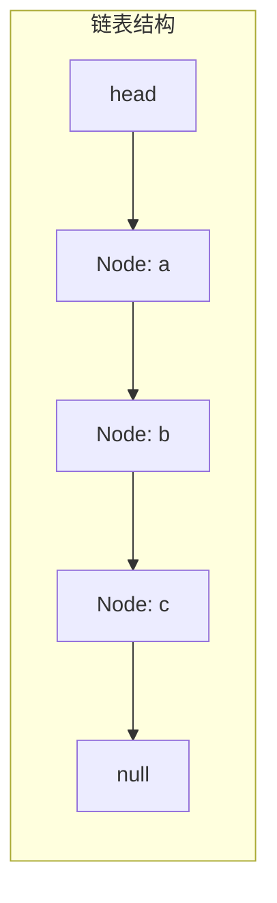
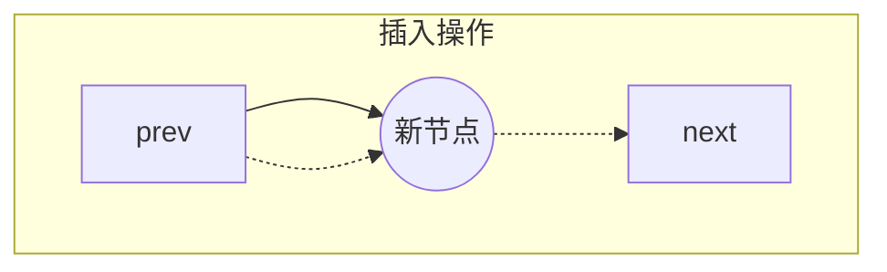
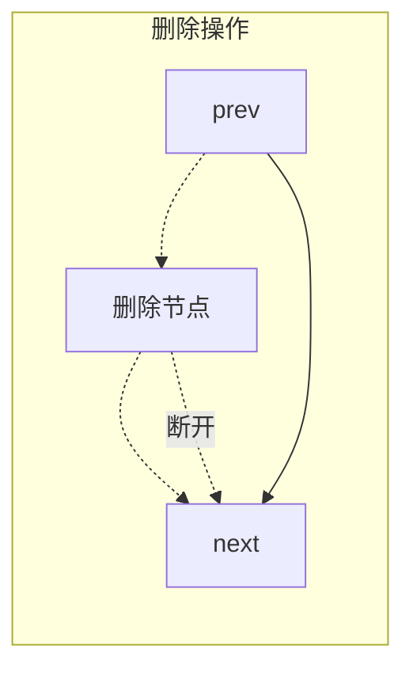

# 单向链表的实现

## 简介

实现完整的单向链表数据结构，包含节点类和链表类。链表通过节点间的引用（指针）相连，支持动态增删。

**与数组对比：**
- 优势：插入/删除操作 O(1)（已知位置），无需移动其他元素
- 劣势：随机访问 O(n)，需要从头遍历

**核心操作：**
- `addAtTail`：尾部添加
- `addAtHead`：头部添加
- `addAtIndex`：指定位置添加
- `get`：按索引获取节点
- `removeAtIndex`：按索引删除节点

## 链表结构示意图







## 代码实现

```javascript
/**
 * 题目：单向链表的实现
 * 描述：实现完整的单向链表数据结构，包含节点类和链表类。
 *       链表通过节点间的引用（指针）相连，支持动态增删。
 *
 * 与数组的对比优势：插入/删除操作 O(1)（已知位置），无需移动其他元素
 * 劣势：随机访问 O(n)，需要从头遍历
 *
 * 核心操作：
 * - addAtTail：尾部添加
 * - addAtHead：头部添加
 * - addAtIndex：指定位置添加
 * - get：按索引获取节点
 * - removeAtIndex：按索引删除节点
 */

/** 节点类 */
class LinkedNode {
  constructor(value) {
    this.value = value;
    this.next = null; // 指向下一个节点的引用
  }
}

/** 链表类 */
class LinkedList {
  constructor() {
    this.count = 0; // 节点数量
    this.head = null; // 头节点引用
  }

  /**
   * addAtTail - 在链表尾部添加节点
   * 需要遍历到最后一个节点，时间复杂度 O(n)
   * @param {*} value
   */
  addAtTail(value) {
    const node = new LinkedNode(value);
    if (this.count === 0) {
      this.head = node;
    } else {
      let cur = this.head;
      while (cur.next != null) {
        cur = cur.next;
      }
      cur.next = node;
    }
    this.count++;
  }

  /**
   * addAtHead - 在链表头部添加节点
   * 只需要修改头指针，时间复杂度 O(1)
   * @param {*} value
   */
  addAtHead(value) {
    const node = new LinkedNode(value);
    if (this.count === 0) {
      this.head = node;
    } else {
      node.next = this.head;
      this.head = node;
    }
    this.count++;
  }

  /**
   * get - 按索引获取节点
   * 需要从头遍历到指定位置，时间复杂度 O(n)
   * @param {number} index
   * @returns {LinkedNode|undefined}
   */
  get(index) {
    if (this.count === 0 || index < 0 || index >= this.count) {
      return;
    }
    let current = this.head;
    for (let i = 0; i < index; i++) {
      current = current.next;
    }
    return current;
  }

  /**
   * addAtIndex - 在指定索引位置添加节点
   * @param {*} value
   * @param {number} index
   */
  addAtIndex(value, index) {
    if (this.count === 0 || index >= this.count) {
      return;
    }
    if (index <= 0) {
      return this.addAtHead(value);
    }
    const prev = this.get(index - 1);
    const next = prev.next;
    const node = new LinkedNode(value);
    prev.next = node;
    node.next = next;
    this.count++;
  }

  /**
   * removeAtIndex - 按索引删除节点
   * 删除头节点时特殊处理，直接移动 head 指针
   * @param {number} index
   */
  removeAtIndex(index) {
    if (this.count === 0 || index < 0 || index >= this.count) {
      return;
    }
    if (index === 0) {
      this.head = this.head.next;
    } else {
      const prev = this.get(index - 1);
      prev.next = prev.next.next;
    }
    this.count--;
  }
}

// 测试代码
const l = new LinkedList()
l.addAtTail('a')
l.addAtTail('b')
l.addAtTail('c')
```

## 逐行解析

### 节点类 `LinkedNode`
- **第 18-23 行**：定义节点类，每个节点包含 `value`（存储数据）和 `next`（指向下一个节点的引用，初始为 `null`）。

### 链表类 `LinkedList`
- **第 27-30 行**：构造函数，初始化 `count`（节点计数器）为 0，`head`（头指针）为 `null`。

#### `addAtTail`（尾部添加 O(n)）
- **第 39-40 行**：空链表时，新节点直接作为头节点。
- **第 42-46 行**：非空时遍历到链表末尾（`cur.next === null`），将最后一个节点的 `next` 指向新节点。
- **第 48 行**：节点计数加 1。

#### `addAtHead`（头部添加 O(1)）
- **第 57-63 行**：创建新节点，将其 `next` 指向当前 `head`，然后将 `head` 更新为新节点。
- **第 64 行**：节点计数加 1。

#### `get`（按索引获取 O(n)）
- **第 74-75 行**：边界判断：空链表或索引越界返回 `undefined`。
- **第 77-80 行**：从头节点开始，循环 `index` 次，找到目标节点。

#### `addAtIndex`（指定位置添加）
- **第 96-100 行**：找到前驱节点 `prev`，将新节点的 `next` 指向 `prev.next`，再将 `prev.next` 指向新节点。

#### `removeAtIndex`（按索引删除）
- **第 113-114 行**：删除头节点：直接将 `head` 指向 `head.next`。
- **第 116-117 行**：删除非头节点：找到前驱节点，将其 `next` 指向 `prev.next.next`（跳过待删节点）。

## 复杂度分析

| 操作 | 时间复杂度 | 空间复杂度 |
|------|-----------|-----------|
| `addAtHead` | O(1) | O(1) |
| `addAtTail` | O(n) | O(1) |
| `get` | O(n) | O(1) |
| `addAtIndex` | O(n) | O(1) |
| `removeAtIndex` | O(n) | O(1) |
