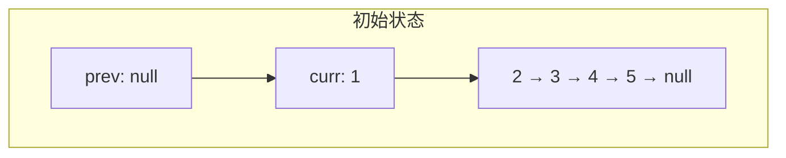
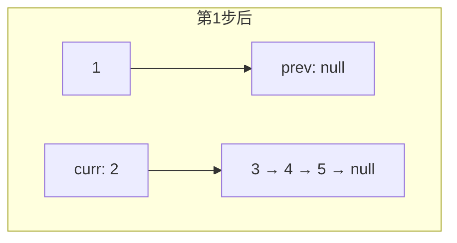
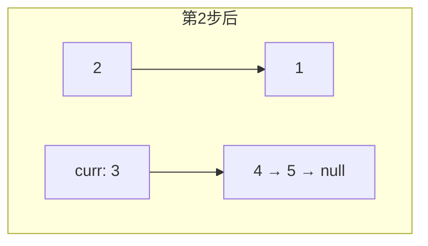
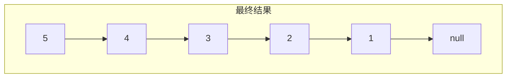
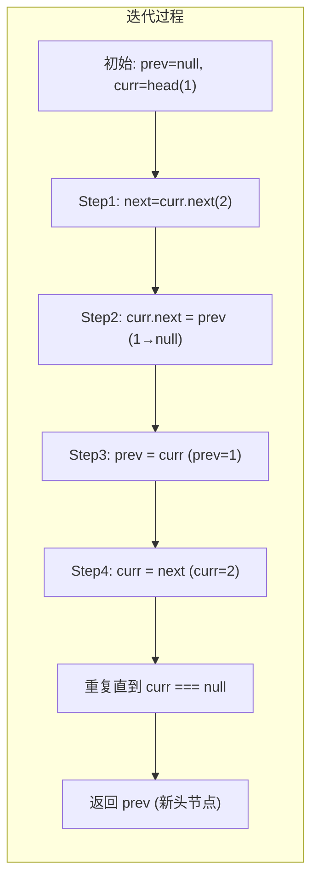

# 反转链表

## 简介

反转一个单链表（LeetCode 206）。

**示例：**
- 输入：`1 -> 2 -> 3 -> 4 -> 5`
- 输出：`5 -> 4 -> 3 -> 2 -> 1`

**解法：迭代法（三指针）**

思路：遍历链表，逐个改变节点的 `next` 指向。使用三个指针：`prev`（前驱）、`curr`（当前）、`next`（后继），每次将 `curr.next` 指向 `prev`，然后三个指针整体后移。

## 指针变化示意图









### 完整过程动画



## 代码实现

```javascript
/**
 * 题目：反转链表（LeetCode 206）
 * 描述：反转一个单链表。
 * 示例：输入 1->2->3->4->5，输出 5->4->3->2->1
 *
 * 解法：迭代法（三指针）
 * 思路：遍历链表，逐个改变节点的 next 指向。
 *       使用三个指针：prev（前驱）、curr（当前）、next（后继）
 *       每次将 curr.next 指向 prev，然后三个指针整体后移。
 * 时间复杂度：O(n)；空间复杂度：O(1)
 */

/**
 * @param {ListNode} head
 * @return {ListNode}
 */
var reverseList = function (head) {
  let prev = null;
  let curr = head;
  let next = null;
  while (curr !== null) {
    next = curr.next; // 保存下一个节点
    curr.next = prev; // 反转指针
    prev = curr; // prev 前移
    curr = next; // curr 前移
  }
  return prev; // prev 即为新头节点
};
```

## 逐行解析

| 行号 | 代码 | 说明 |
|------|------|------|
| 18 | `let prev = null` | 初始化前驱指针为 `null`，反转后原头节点的 `next` 将指向它 |
| 19 | `let curr = head` | 当前指针指向链表头节点 |
| 20 | `let next = null` | 后继指针，用于保存 `curr.next`，防止链表断裂 |
| 21 | `while (curr !== null)` | 遍历链表，直到当前节点为空 |
| 22 | `next = curr.next` | 先保存 `curr.next`，否则反转后无法找到原链表剩余部分 |
| 23 | `curr.next = prev` | **关键操作**：将当前节点的 `next` 指向前驱节点，实现反转 |
| 24 | `prev = curr` | `prev` 指针后移一位 |
| 25 | `curr = next` | `curr` 指针后移一位，指向原链表的下一个节点 |
| 27 | `return prev` | 循环结束时 `prev` 指向原链表的最后一个节点，即新链表的头节点 |

## 复杂度分析

- **时间复杂度：O(n)** — 需要遍历整个链表一次
- **空间复杂度：O(1)** — 只使用了三个指针变量，不随输入规模变化

## 示例输入输出

| 输入 | 输出 |
|------|------|
| `1 -> 2 -> 3 -> 4 -> 5` | `5 -> 4 -> 3 -> 2 -> 1` |
| `1 -> 2` | `2 -> 1` |
| `[]` | `[]` |
