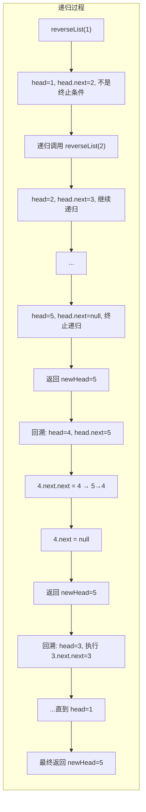
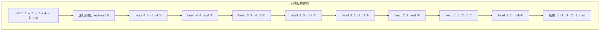

# 反转链表 — 递归法

## 简介

使用递归方式反转单链表。

**解法思路：**
1. 递归到链表的最后一个节点（`newHead`）
2. 回溯时，将当前节点的下一个节点的 `next` 指向当前节点（`head.next.next = head`）
3. 将当前节点的 `next` 设为 `null`
4. 每次递归返回 `newHead`（原链表的尾节点）

**关键理解：** `head.next.next = head` 实现了指针反向，将 `head` 的下一个节点指向 `head` 自己。

## 递归过程示意图





## 代码实现

```javascript
/**
 * 题目：反转链表 - 递归法
 * 描述：使用递归方式反转单链表。
 *
 * 解法思路：
 * - 递归到链表的最后一个节点（newHead）
 * - 回溯时，将当前节点的下一个节点的 next 指向当前节点（head.next.next = head）
 * - 将当前节点的 next 设为 null
 * - 每次递归返回 newHead（原链表的尾节点）
 *
 * 关键理解：head.next.next = head 实现了指针反向，
 *           将 head 的下一个节点指向 head 自己。
 * 时间复杂度：O(n)；空间复杂度：O(n)（递归调用栈）
 */

/**
 * @param {ListNode} head
 * @return {ListNode}
 */
var reverseList = function (head) {
  if (head === null || head.next === null) {
    return head; // 递归终止条件：空链表或只有一个节点
  }
  const newHead = reverseList(head.next);
  // 将当前节点的下一个节点指向自己（反转）
  head.next.next = head;
  head.next = null; // 断开原方向的指向
  return newHead;
};
```

## 逐行解析

| 行号 | 代码 | 说明 |
|------|------|------|
| 21 | `if (head === null \|\| head.next === null)` | **递归终止条件**：空链表或只有一个节点时，直接返回自身 |
| 22 | `return head` | 返回当前节点作为新的头节点（原链表尾节点） |
| 24 | `const newHead = reverseList(head.next)` | **递推**：递归处理下一个节点，保存返回的新头节点 |
| 26 | `head.next.next = head` | **关键反转**：将 `head` 的下一个节点的 `next` 指向 `head`，实现反向连接。例如 `2→3` 变为 `2←3` |
| 27 | `head.next = null` | 断开 `head` 原来的 `next` 指向，避免形成环 |
| 28 | `return newHead` | 将新头节点（原链表最后一个节点）逐层返回 |

## 复杂度分析

- **时间复杂度：O(n)** — 需要遍历整个链表
- **空间复杂度：O(n)** — 递归调用栈的深度等于链表长度 n

## 递归 vs 迭代

| 方式 | 时间复杂度 | 空间复杂度 | 优势 |
|------|-----------|-----------|------|
| 迭代法（三指针） | O(n) | O(1) | 空间效率高，不易栈溢出 |
| 递归法 | O(n) | O(n) | 代码简洁，逻辑优雅 |

## 示例输入输出

| 输入 | 输出 |
|------|------|
| `1 -> 2 -> 3 -> 4 -> 5` | `5 -> 4 -> 3 -> 2 -> 1` |
| `[1]` | `[1]` |
| `[]` | `[]` |
