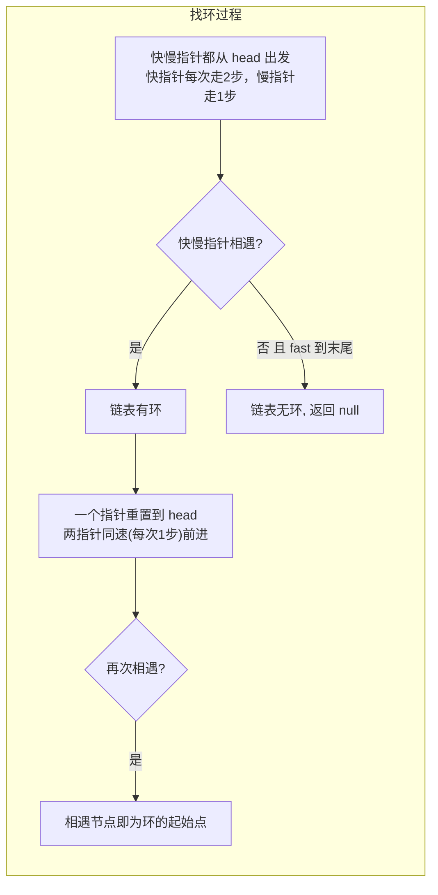
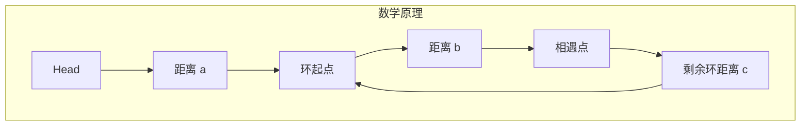
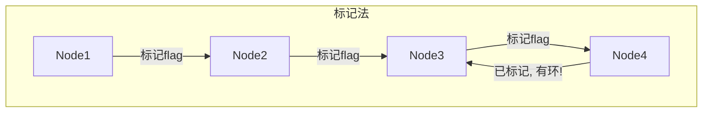

# 环路检测

## 简介

给定一个链表，返回链表开始入环的第一个节点。如果链表无环，返回 `null`（LeetCode 142 / 剑指 Offer II 022）。

**三种解法：**
1. **快慢指针法（Floyd 判圈算法）** — 最优解，O(1) 空间
2. **标记法** — 直观易懂，O(n) 空间
3. **JSON.stringify 法** — 奇技淫巧

## 快慢指针法示意图





**数学推导：** 设 head 到环起点距离为 a，环起点到相遇点距离为 b，剩余环距离为 c。慢指针走了 a+b，快指针走了 a+b+k(b+c)，且快指针路程是慢指针的 2 倍，可得 a = c，即从 head 到环起点的距离等于从相遇点到环起点的距离。

## 标记法示意图



## 代码实现

```javascript
/**
 * 题目：环路检测（LeetCode 142 / 剑指 Offer II 022）
 * 描述：给定一个链表，返回链表开始入环的第一个节点。如果链表无环，返回 null。
 *
 * 解法一：快慢指针法（Floyd 判圈算法）
 * 思路：
 * 1. 快指针每次走两步，慢指针每次走一步，若相遇则有环
 * 2. 相遇后，将其中一个指针重置到 head，两指针同速前进
 * 3. 再次相遇的节点即为环的起始节点
 *
 * 数学原理：设 head 到环起点距离为 a，环起点到相遇点距离为 b
 *           慢指针走了 a+b，快指针走了 a+b+圈数，快指针路程是慢指针的 2 倍
 *           可推导出从 head 到环起点的距离 == 从相遇点到环起点的距离
 * 时间复杂度：O(n)；空间复杂度：O(1)
 *
 * 解法二：标记法
 * 思路：遍历链表，给每个节点添加 flag 标记。如果遇到已标记的节点则有环。
 * 时间复杂度：O(n)；空间复杂度：O(n)
 *
 * 解法三：JSON.stringify 法（奇技淫巧）
 * 思路：JSON.stringify 无法序列化循环引用的结构，会抛出异常。
 * 时间复杂度：O(n)；空间复杂度：O(n)
 */

/**
 * detectCycle - 检测链表环并返回环的起始节点（快慢指针法）
 * @param {ListNode} head
 * @return {ListNode}
 */
var detectCycle = function (head) {
  if (head === null || head.next === null) {
    return null;
  }
  let slow = head;
  let fast = head;

  while (fast !== null) {
    slow = slow.next;
    if (fast.next === null) {
      return null; // 无环
    }
    fast = fast.next.next;

    if (fast === slow) {
      // 有环，找环起点
      let ptr = head;
      while (ptr !== slow) {
        ptr = ptr.next;
        slow = slow.next;
      }
      return ptr;
    }
  }
  return null;
};

/**
 * hasCycle - 标记法判断是否有环
 * @param {ListNode} head
 * @return {boolean}
 */
const hasCycleMark = function (head) {
  while (head) {
    if (head.flag) return true;
    head.flag = true;
    head = head.next;
  }
  return false;
};

/**
 * hasCycle - 利用 JSON.stringify 检测环
 * @param {ListNode} head
 * @return {boolean}
 */
const hasCycleJSON = function (head) {
  try {
    JSON.stringify(head);
    return false;
  } catch (err) {
    return true;
  }
};
```

## 逐行解析

### 快慢指针法 `detectCycle`

| 行号 | 代码 | 说明 |
|------|------|------|
| 31-33 | `if (head === null \|\| head.next === null)` | 空链表或只有一个节点不可能有环 |
| 34-35 | `slow = head, fast = head` | 快慢指针都从头节点出发 |
| 37 | `while (fast !== null)` | 遍历链表 |
| 38 | `slow = slow.next` | 慢指针每次走 1 步 |
| 39-41 | `if (fast.next === null) return null` | 快指针走到了末尾，说明无环 |
| 42 | `fast = fast.next.next` | 快指针每次走 2 步 |
| 44 | `if (fast === slow)` | 快慢指针相遇，说明有环 |
| 46 | `let ptr = head` | 新指针指向头节点 |
| 47-50 | `while (ptr !== slow)` | ptr 和 slow 同速前进，相遇点即为环起点 |
| 51 | `return ptr` | 返回环起始节点 |

### 标记法 `hasCycleMark`

| 行号 | 代码 | 说明 |
|------|------|------|
| 63 | `while (head)` | 遍历链表 |
| 64 | `if (head.flag) return true` | 如果当前节点已被标记，说明有环 |
| 65 | `head.flag = true` | 给当前节点添加标记 |
| 66 | `head = head.next` | 继续遍历下一个节点 |

### JSON 法 `hasCycleJSON`

| 行号 | 代码 | 说明 |
|------|------|------|
| 77 | `try { JSON.stringify(head) }` | 尝试序列化链表 |
| 78 | `return false` | 序列化成功 → 无环 |
| 80-81 | `catch (err) { return true }` | 序列化抛异常（循环引用）→ 有环 |

## 复杂度分析

| 解法 | 时间复杂度 | 空间复杂度 | 优劣势 |
|------|-----------|-----------|--------|
| 快慢指针法 | O(n) | O(1) | ✅ 最优，不修改原链表 |
| 标记法 | O(n) | O(n) | ⚠️ 修改了原链表节点 |
| JSON.stringify 法 | O(n) | O(n) | ⚠️ 奇技淫巧，不推荐生产使用 |

## 示例输入输出

| 输入 | 输出 | 说明 |
|------|------|------|
| `3 -> 2 -> 0 -> -4 -> (回到2)` | 返回节点 `2` | 环起始于节点 2 |
| `1 -> 2 -> (回到1)` | 返回节点 `1` | 环起始于节点 1 |
| `1 -> 2 -> 3 -> null` | `null` | 无环 |
