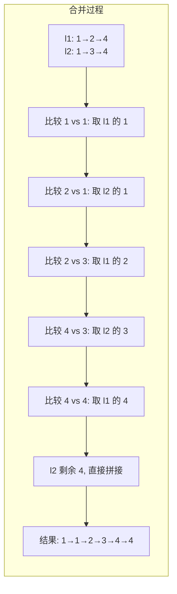
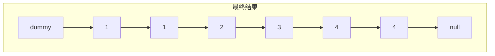
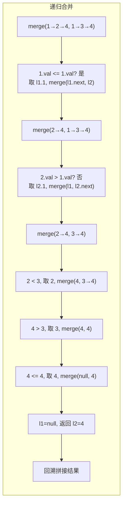

# 合并两个有序链表

## 简介

将两个升序链表合并为一个新的升序链表并返回（LeetCode 21）。新链表是通过拼接给定的两个链表的所有节点组成的。

**示例：**
- 输入：`1 -> 2 -> 4`, `1 -> 3 -> 4`
- 输出：`1 -> 1 -> 2 -> 3 -> 4 -> 4`

**两种解法：**
1. **递归法** — 代码简洁，利用函数调用栈
2. **迭代法（哑节点 + 双指针）** — 空间效率更高

## 合并过程示意图

### 迭代法合并过程





### 递归法合并过程



## 代码实现

```javascript
/**
 * 题目：合并两个有序链表（LeetCode 21）
 * 描述：将两个升序链表合并为一个新的升序链表并返回。
 *       新链表是通过拼接给定的两个链表的所有节点组成的。
 * 示例：输入 1->2->4, 1->3->4，输出 1->1->2->3->4->4
 *
 * 解法一：递归法
 * 思路：比较两个链表头节点，将较小者作为结果头节点，
 *       其 next 指向剩余部分合并的结果。
 * 时间复杂度：O(m+n)；空间复杂度：O(m+n)（递归调用栈）
 *
 * 解法二：迭代法（哑节点 + 双指针）
 * 思路：使用哑节点作为合并后链表的起始，
 *       双指针遍历两个链表，每次取较小值接入，
 *       最后将剩余部分直接拼接。
 * 时间复杂度：O(m+n)；空间复杂度：O(1)
 */

/**
 * mergeTwoLists - 递归法合并
 * @param {ListNode} l1
 * @param {ListNode} l2
 * @return {ListNode}
 */
const mergeTwoListsRecursive = function (l1, l2) {
  if (l1 === null) return l2;
  if (l2 === null) return l1;
  if (l1.val < l2.val) {
    l1.next = mergeTwoListsRecursive(l1.next, l2);
    return l1;
  } else {
    l2.next = mergeTwoListsRecursive(l1, l2.next);
    return l2;
  }
};

/**
 * mergeTwoLists - 迭代法合并
 * @param {ListNode} l1
 * @param {ListNode} l2
 * @return {ListNode}
 */
var mergeTwoLists = function (l1, l2) {
  const prehead = new ListNode();
  let prev = prehead;
  while (l1 != null && l2 != null) {
    if (l1.val <= l2.val) {
      prev.next = l1;
      l1 = l1.next;
    } else {
      prev.next = l2;
      l2 = l2.next;
    }
    prev = prev.next;
  }
  prev.next = l1 === null ? l2 : l1;
  return prehead.next;
};
```

## 逐行解析

### 递归法 `mergeTwoListsRecursive`

| 行号 | 代码 | 说明 |
|------|------|------|
| 34 | `if (l1 === null) return l2` | 基线条件：l1 为空，直接返回 l2 |
| 35 | `if (l2 === null) return l1` | 基线条件：l2 为空，直接返回 l1 |
| 36 | `if (l1.val < l2.val)` | 比较两个链表当前节点的值 |
| 37 | `l1.next = mergeTwoListsRecursive(l1.next, l2)` | l1 较小，其 next 指向剩余合并结果 |
| 38 | `return l1` | 返回 l1 作为当前合并结果的头节点 |
| 40 | `l2.next = mergeTwoListsRecursive(l1, l2.next)` | l2 较小，其 next 指向剩余合并结果 |
| 41 | `return l2` | 返回 l2 作为当前合并结果的头节点 |

### 迭代法 `mergeTwoLists`

| 行号 | 代码 | 说明 |
|------|------|------|
| 52 | `const prehead = new ListNode()` | 创建哑节点，简化边界处理 |
| 53 | `let prev = prehead` | prev 指针初始指向哑节点 |
| 54 | `while (l1 != null && l2 != null)` | 两个链表都未遍历完时循环 |
| 55-57 | 取 l1 的情况 | l1 值较小，将 l1 接入结果链表，l1 指针后移 |
| 58-60 | 取 l2 的情况 | l2 值较小，将 l2 接入结果链表，l2 指针后移 |
| 62 | `prev = prev.next` | prev 指针后移，准备接下一个节点 |
| 64 | `prev.next = l1 === null ? l2 : l1` | 将剩余未遍历完的链表直接拼接 |
| 65 | `return prehead.next` | 返回哑节点的 next 即合并后的头节点 |

## 复杂度分析

| 解法 | 时间复杂度 | 空间复杂度 |
|------|-----------|-----------|
| 递归法 | O(m+n) | O(m+n) — 递归调用栈 |
| 迭代法 | O(m+n) | O(1) |

其中 m、n 分别为两个链表的长度。

## 示例输入输出

| 输入 l1 | 输入 l2 | 输出 |
|---------|---------|------|
| `1 -> 2 -> 4` | `1 -> 3 -> 4` | `1 -> 1 -> 2 -> 3 -> 4 -> 4` |
| `[]` | `1 -> 2` | `1 -> 2` |
| `[]` | `[]` | `[]` |
