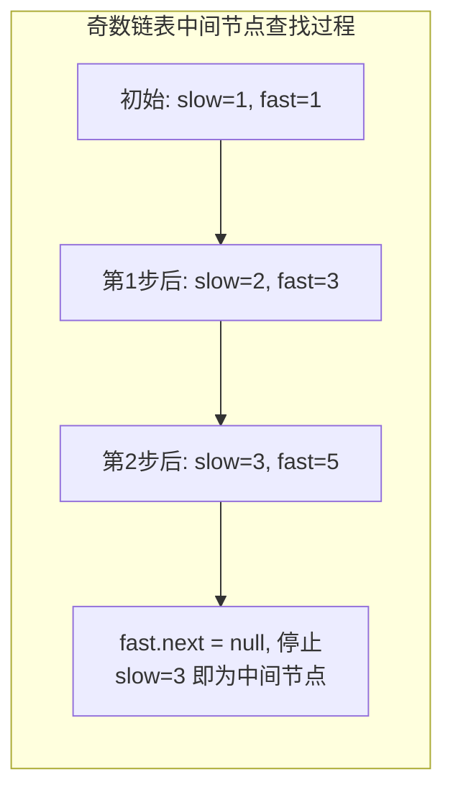
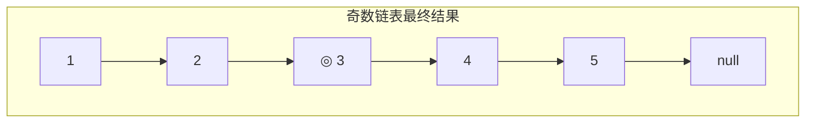
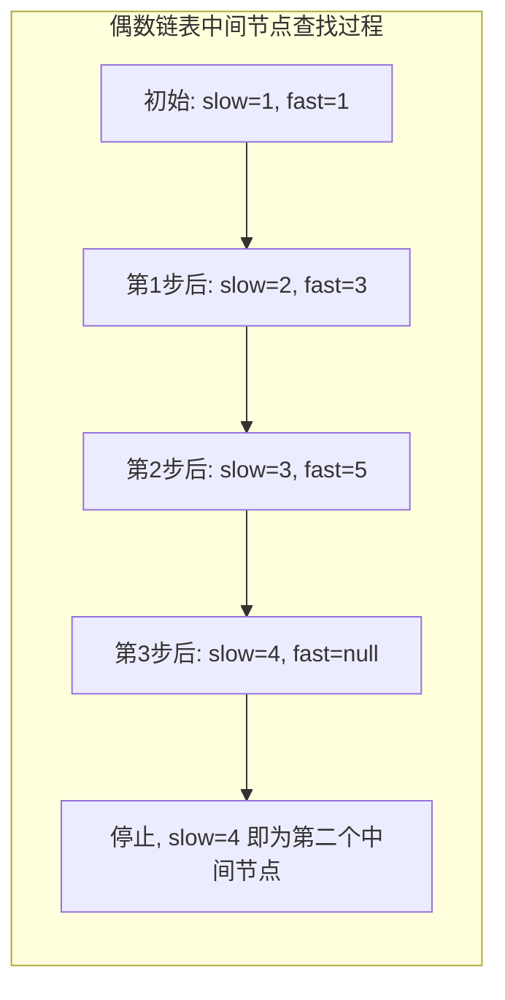
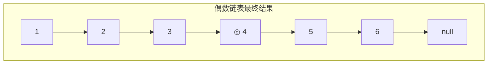

# 求链表的中间结点

## 简介

给定一个非空单链表，返回链表的中间结点。如果有两个中间结点（偶数个节点），则返回第二个中间结点（LeetCode 876）。

**示例：**
- `[1,2,3,4,5]` → 返回节点 **3**（奇数个节点，正中间）
- `[1,2,3,4,5,6]` → 返回节点 **4**（偶数个节点，有两个中间结点 3 和 4，返回第二个）

**解法：快慢指针法**
- 快指针每次走两步，慢指针每次走一步
- 快指针到达末尾时，慢指针恰好在中间

## 指针过程示意图

### 奇数个节点（n=5）





### 偶数个节点（n=6）





## 代码实现

```javascript
/**
 * 题目：求链表的中间结点（LeetCode 876）
 * 描述：给定一个非空单链表，返回链表的中间结点。
 *       如果有两个中间结点（偶数个节点），则返回第二个中间结点。
 * 示例：
 *   [1,2,3,4,5] -> 返回节点 3
 *   [1,2,3,4,5,6] -> 返回节点 4（有两个中间结点 3 和 4，返回第二个）
 *
 * 解法：快慢指针法
 * 思路：快指针每次走两步，慢指针每次走一步。
 *       快指针到达末尾时，慢指针恰好在中间。
 * 时间复杂度：O(n)；空间复杂度：O(1)
 */

/**
 * @param {ListNode} head
 * @return {ListNode}
 */
const middleNode = function (head) {
  let fast = head,
    slow = head;
  while (fast && fast.next) {
    slow = slow.next;
    fast = fast.next.next;
  }
  return slow;
};
```

## 逐行解析

| 行号 | 代码 | 说明 |
|------|------|------|
| 20 | `let fast = head, slow = head` | 快慢指针都从头节点出发 |
| 21 | `while (fast && fast.next)` | 循环条件：快指针不为 null 且快指针的下一个也不为 null（保证能走两步） |
| 22 | `slow = slow.next` | 慢指针每次走 1 步 |
| 23 | `fast = fast.next.next` | 快指针每次走 2 步 |
| 25 | `return slow` | 循环结束时 slow 指向中间节点。奇数个节点时在正中间；偶数个节点时在第二个中间节点 |

**为什么偶数个节点时返回第二个中间结点？** 当链表有 6 个节点时，快指针走到 `null`（第 7 个位置），慢指针走到第 4 个节点，即为第二个中间节点。

## 复杂度分析

- **时间复杂度：O(n)** — 只需遍历链表一次（快指针走完整个链表）
- **空间复杂度：O(1)** — 只使用了两个指针变量

## 示例输入输出

| 输入 | 输出 | 说明 |
|------|------|------|
| `1 -> 2 -> 3 -> 4 -> 5` | 节点 3 | 奇数个节点，正中间 |
| `1 -> 2 -> 3 -> 4 -> 5 -> 6` | 节点 4 | 偶数个节点，返回第二个中间结点 |
| `1` | 节点 1 | 只有一个节点 |
| `1 -> 2` | 节点 2 | 两个节点，返回第二个 |
