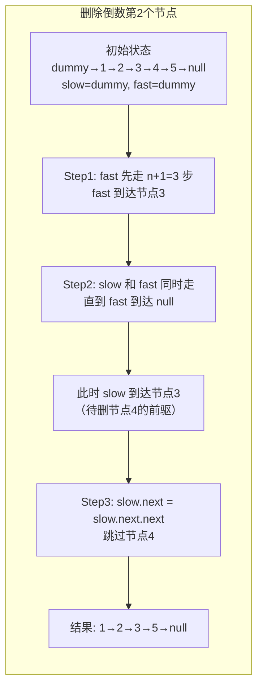
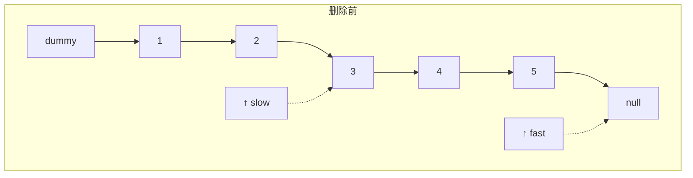
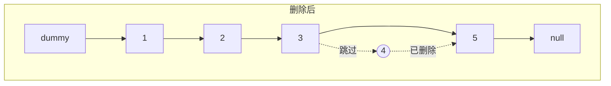

# 删除链表倒数第 n 个结点

## 简介

给定一个链表，删除链表的倒数第 n 个节点，并返回链表的头结点（LeetCode 19）。

**示例：**
- 输入：链表 `1 -> 2 -> 3 -> 4 -> 5`，n = 2
- 输出：`1 -> 2 -> 3 -> 5`（删除了倒数第 2 个节点 4）

**解法思路：快慢指针 + 哑节点**
1. 快指针先走 n+1 步（使用哑节点处理边界，避免头节点被删除时的特殊情况）
2. 然后快慢指针同时走，快指针到末尾时，慢指针指向待删除节点的前一个节点
3. 将慢指针的 `next` 指向 `next.next` 完成删除

## 过程示意图







## 代码实现

```javascript
/**
 * 题目：删除链表倒数第 n 个结点（LeetCode 19）
 * 描述：给定一个链表，删除链表的倒数第 n 个节点，并返回链表的头结点。
 * 示例：链表 1->2->3->4->5, n = 2
 *       删除倒数第二个节点后，链表变为 1->2->3->5
 *
 * 解法思路：快慢指针 + 哑节点
 * - 快指针先走 n+1 步（使用哑节点处理边界）
 * - 然后快慢指针同时走，快指针到末尾时，慢指针指向待删除节点的前一个节点
 * - 将慢指针的 next 指向 next.next 完成删除
 * 时间复杂度：O(n)；空间复杂度：O(1)
 */
```

> **注意：** 此文件仅包含注释文档，未提供完整实现。下面是一个完整的参考实现。

### 参考实现

```javascript
var removeNthFromEnd = function (head, n) {
  const dummy = new ListNode(0, head);
  let fast = dummy;
  let slow = dummy;

  // 快指针先走 n+1 步
  for (let i = 0; i <= n; i++) {
    fast = fast.next;
  }

  // 快慢指针同时走
  while (fast !== null) {
    fast = fast.next;
    slow = slow.next;
  }

  // 删除目标节点
  slow.next = slow.next.next;

  return dummy.next;
};
```

## 逐行解析（参考实现）

| 行号 | 代码 | 说明 |
|------|------|------|
| — | `const dummy = new ListNode(0, head)` | 创建哑节点，其 `next` 指向 head。哑节点简化了头节点被删除时的边界处理 |
| — | `let fast = dummy, slow = dummy` | 快慢指针都从哑节点出发 |
| — | `for` 循环 | 快指针先走 n+1 步，使得当快指针到达 `null` 时，慢指针恰好指向待删节点的前一个节点 |
| — | `while (fast !== null)` | 快慢指针同时移动，直到快指针到达末尾 |
| — | `slow.next = slow.next.next` | 跳过待删除节点，完成删除 |
| — | `return dummy.next` | 返回新链表的头节点 |

**为什么快指针要走 n+1 步？** 因为需要让慢指针指向待删除节点的 **前一个节点**，这样删除操作 `slow.next = slow.next.next` 才能正确执行。如果只走 n 步，慢指针会直接指向待删除节点本身。

## 复杂度分析

- **时间复杂度：O(n)** — 只需遍历链表一次
- **空间复杂度：O(1)** — 只使用了哑节点和两个指针变量

## 示例输入输出

| 输入 | n | 输出 | 说明 |
|------|---|------|------|
| `1 -> 2 -> 3 -> 4 -> 5` | 2 | `1 -> 2 -> 3 -> 5` | 删除倒数第 2 个节点 4 |
| `1 -> 2` | 1 | `1` | 删除倒数第 1 个节点 2 |
| `1` | 1 | `[]` | 删除唯一节点，返回空链表 |
| `1 -> 2` | 2 | `2` | 删除头节点，哑节点处理边界 |
