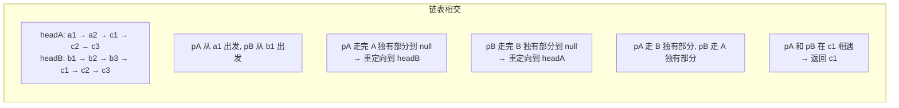
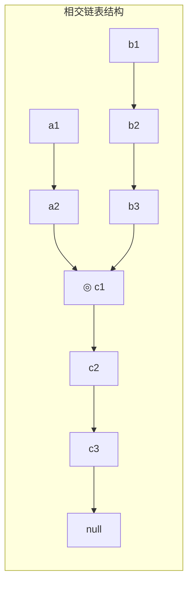
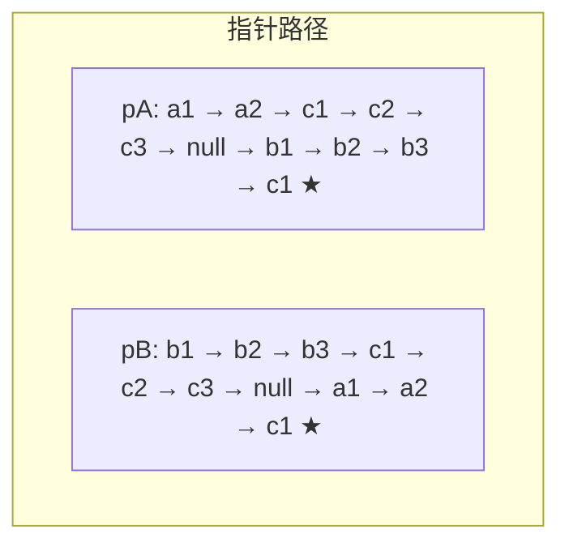

# 相交链表 — 找到两个单链表相交的起始节点

## 简介

找到两个单链表相交的起始节点。如果两个链表没有交点，返回 `null`（LeetCode 160）。

**解法思路：双指针消除长度差法**
- 两个指针 `pA`、`pB` 分别从 `headA`、`headB` 出发
- 当 `pA` 到达尾部时，重定向到 `headB`；`pB` 同理
- 这样两个指针走过的路程相同，消除了长度差
- 当 `pA === pB` 时即为相交节点

**数学原理：**
- `pA` 走过的路程 = headA 独有部分 + 公共部分 + headB 独有部分
- `pB` 走过的路程 = headB 独有部分 + 公共部分 + headA 独有部分
- 两者相等，必然在公共部分相遇

## 相交过程示意图







## 代码实现

```javascript
/**
 * 题目：相交链表（LeetCode 160）
 * 描述：找到两个单链表相交的起始节点。如果两个链表没有交点，返回 null。
 *
 * 解法思路：双指针消除长度差法
 * - 两个指针 pA、pB 分别从 headA、headB 出发
 * - 当 pA 到达尾部时，重定向到 headB；pB 同理
 * - 这样两个指针走过的路程相同，消除了长度差
 * - 当 pA === pB 时即为相交节点
 *
 * 数学原理：pA 走过的路程 = headA 独有部分 + 公共部分 + headB 独有部分
 *           pB 走过的路程 = headB 独有部分 + 公共部分 + headA 独有部分
 *           两者相等，必然在公共部分相遇
 * 时间复杂度：O(n)；空间复杂度：O(1)
 */

/**
 * @param {ListNode} headA
 * @param {ListNode} headB
 * @return {ListNode|null}
 */
const getIntersectionNode = function (headA, headB) {
  let pA = headA,
    pB = headB;
  while (pA || pB) {
    if (pA === pB) return pA;
    pA = pA === null ? headB : pA.next;
    pB = pB === null ? headA : pB.next;
  }
  return null;
};
```

## 逐行解析

| 行号 | 代码 | 说明 |
|------|------|------|
| 23 | `let pA = headA, pB = headB` | 两个指针分别指向两个链表的头节点 |
| 24 | `while (pA \|\| pB)` | 只要有一个指针不为 null 就继续遍历。当两个指针都为 null 时，说明无相交 |
| 25 | `if (pA === pB) return pA` | 如果两个指针指向同一个节点，说明找到了相交节点 |
| 26 | `pA = pA === null ? headB : pA.next` | **关键**：pA 走到末尾后，重定向到 headB，继续遍历 |
| 27 | `pB = pB === null ? headA : pB.next` | pB 走到末尾后，重定向到 headA，继续遍历 |
| 29 | `return null` | 循环结束，两个链表没有交点 |

**为什么这样能消除长度差？** 假设 A 链表长度为 a+c，B 链表长度为 b+c（c 为公共部分长度）。pA 走完 A（a+c）后走 B 的独有部分（b），总共 a+c+b；pB 走完 B（b+c）后走 A 的独有部分（a），总共 b+c+a。两者路程相等，因此必然在公共部分的起始节点相遇。

## 复杂度分析

- **时间复杂度：O(m+n)** — 最坏情况下需要遍历两个链表各一遍
- **空间复杂度：O(1)** — 只使用了两个指针变量

## 示例输入输出

| 链表A | 链表B | 相交节点 | 说明 |
|-------|-------|---------|------|
| `a1 -> a2 -> c1 -> c2 -> c3` | `b1 -> b2 -> b3 -> c1 -> c2 -> c3` | `c1` | 在 c1 处相交 |
| `1 -> 2 -> 3` | `4 -> 5 -> 6` | `null` | 不相交 |
| `1 -> 2 -> 3` | `1 -> 2 -> 3` | `1` | 完全重合（在头节点相交） |
