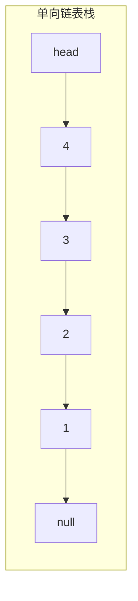
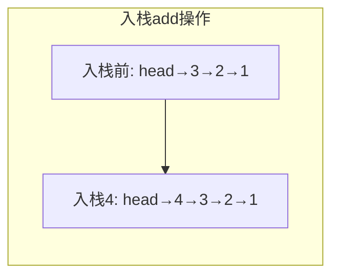
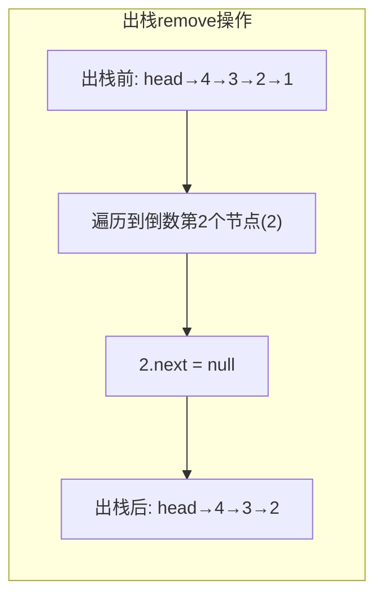

# 单向链表实现栈

## 简介

使用单向链表实现栈（后进先出 LIFO）数据结构。

- 头部插入/删除 = O(1)
- 尾部操作 = O(n)

当前实现采用头插法实现入栈（`add`），从头遍历到尾部实现出栈（`remove` 删除尾节点）。注意 `remove` 遍历到尾部效率较低，更优方案是始终在头部操作（既在头部入也在头部出）。

## 栈结构示意图







## 代码实现

```javascript
/**
 * 题目：单向链表实现栈
 * 描述：使用单向链表实现栈（后进先出 LIFO）数据结构。
 *       头部插入/删除 = O(1)，尾部操作 = O(n)
 *       因此采用头插法实现入栈，从头遍历到尾部实现出栈（删除尾节点）。
 *
 * 注意：文件名虽为 LinkQueue，实际实现的是栈的 add（头插）和 remove（尾部删除）语义，
 *       不过 remove 遍历到尾部效率较低。更优方案是始终在头部操作。
 */

/** 节点构造函数 */
function Node(val, next) {
  this.val = val;
  this.next = next || null;
}

/**
 * LinkStack - 基于单向链表的栈实现
 */
function LinkQueue() {
  this.head = null; // 头指针
  this.len = 0; // 栈长度
}

/**
 * add - 入栈（头插法）
 * @param {*} val
 */
LinkQueue.prototype.add = function (val) {
  const node = new Node(val, this.head);
  this.head = node;
  this.len++;
};

/**
 * remove - 出栈（移除最后一个节点）
 */
LinkQueue.prototype.remove = function () {
  if (this.len === 0) return;
  if (this.len === 1) {
    this.head = null;
  } else {
    let p = this.head;
    while (p.next.next !== null) {
      p = p.next;
    }
    p.next = null;
  }
  this.len--;
};

/**
 * getHead - 获取栈顶元素
 * @returns {Node}
 */
LinkQueue.prototype.getHead = function () {
  return this.head;
};

/**
 * clear - 清空栈
 */
LinkQueue.prototype.clear = function () {
  while (this.head) {
    let node = this.head;
    node.next = null;
    node = null;
    this.head = this.head.next;
  }
  this.len = 0;
};

/**
 * console - 打印栈中所有元素
 */
LinkQueue.prototype.console = function () {
  console.log('打印队列');
  if (!this.head) return;
  let p = this.head;
  while (p) {
    console.log(p.val);
    p = p.next;
  }
  console.log('打印队列完成');
};

const queue = new LinkQueue()
queue.add(1)
queue.add(2)
queue.add(3)
queue.add(4)
console.log('队列长度：' + queue.len)
console.log('-----split remove----')
queue.remove()
console.log('队列长度：' + queue.len)
queue.console()
queue.clear()
console.log('队列长度：' + queue.len)
queue.console()
```

## 逐行解析

### 节点构造函数 `Node`

| 行号 | 代码 | 说明 |
|------|------|------|
| 12-15 | `function Node(val, next)` | 节点构造函数，包含 `val`（数据）和 `next`（指向下一节点） |

### 栈构造函数 `LinkQueue`

| 行号 | 代码 | 说明 |
|------|------|------|
| 20-23 | `function LinkQueue()` | 初始化栈，`head` 为 `null`，`len` 为 0 |

### `add`（入栈 — 头插法 O(1)）

| 行号 | 代码 | 说明 |
|------|------|------|
| 29 | `const node = new Node(val, this.head)` | 创建新节点，其 `next` 指向当前头节点 |
| 30 | `this.head = node` | 将头指针指向新节点（新节点成为栈顶） |
| 31 | `this.len++` | 栈长度加 1 |

### `remove`（出栈 — 移除尾节点 O(n)）

| 行号 | 代码 | 说明 |
|------|------|------|
| 39 | `if (this.len === 0) return` | 空栈直接返回 |
| 40-42 | `if (this.len === 1)` 将 `head` 设为 `null` | 只有一个节点时，直接清空 |
| 43-46 | 遍历到倒数第二个节点，将其 `next` 设为 `null` | 删除最后一个节点 |
| 49 | `this.len--` | 栈长度减 1 |

### `getHead` / `clear` / `console`

| 方法 | 说明 |
|------|------|
| `getHead` | 返回头节点（栈顶元素） |
| `clear` | 遍历链表，逐个清除节点的 `next` 引用，重置 `len` |
| `console` | 遍历链表并打印每个节点的值 |

## 复杂度分析

| 操作 | 时间复杂度 | 空间复杂度 |
|------|-----------|-----------|
| `add`（入栈） | O(1) | O(1) |
| `remove`（出栈） | O(n) | O(1) |
| `getHead`（获取栈顶） | O(1) | O(1) |
| `clear`（清空） | O(n) | O(1) |
| `console`（打印） | O(n) | O(1) |

> **优化建议：** 若需 O(1) 出栈，可将出栈操作改为删除头节点（`this.head = this.head.next`），同时入栈也使用头插，这样栈的入和出都是 O(1)。
