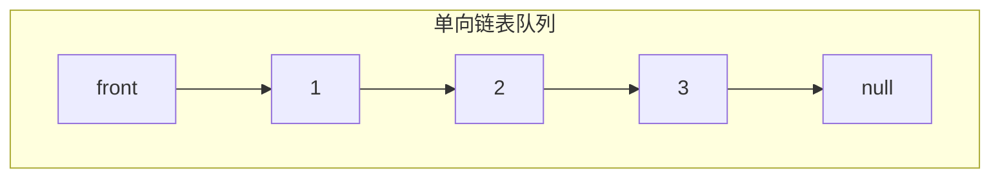

# 单向链表实现队列

## 简介

使用单向链表实现队列（先进先出 FIFO）数据结构。

- 入队在尾部添加（遍历到尾部 O(n)）
- 出队在头部删除（O(1)）

> **注意：** 当前实现入队为 O(n)，可优化为维护 `tail` 指针实现 O(1) 入队。

## 队列结构示意图



```mermaid
flowchart TD
    subgraph 入队add操作（尾部）
        direction TB
        A0["入队前: front→1→2→3→null"] --> A1["遍历到尾部节点3"] --> A2["3.next = 4"] --> A3["入队后: front→1→2→3→4→null"]
    end
```

```mermaid
flowchart TD
    subgraph 出队remove操作（头部）
        direction TB
        B0["出队前: front→1→2→3→null"] --> B1["保存 front.data=1"] --> B2["front = front.next"] --> B3["出队后: front→2→3→null"]
    end
```

## 代码实现

```javascript
/**
 * 题目：单向链表实现队列
 * 描述：使用单向链表实现队列（先进先出 FIFO）数据结构。
 *       入队在尾部添加（遍历到尾部 O(n)），出队在头部删除（O(1)）。
 *       注意：当前实现入队为 O(n)，可优化为维护 tail 指针实现 O(1) 入队。
 */

/** 节点构造函数 */
function Node(data) {
  this.data = data;
  this.next = null;
}

/**
 * Queue - 基于单向链表的队列实现
 */
function Queue() {
  this.front = null;
}

/**
 * add - 入队（在链表尾部添加）
 * @param {*} node
 */
Queue.prototype.add = function (node) {
  var current = this.front;
  if (current) {
    while (current.next != null) {
      current = current.next;
    }
    current.next = new Node(node);
  } else {
    this.front = new Node(node);
  }
};

/**
 * remove - 出队（移除头节点）
 * @returns {*} 被移除节点的数据
 * @throws 队列为空时抛出异常
 */
Queue.prototype.remove = function () {
  if (this.front) {
    let current = this.front;
    let data = current.data;
    this.front = current.next;
    return data;
  } else {
    throw new Error('the queue is empty!');
  }
};

/**
 * isEmpty - 判断队列是否为空
 * @returns {boolean}
 */
Queue.prototype.isEmpty = function () {
  return this.front === null;
};

/**
 * getFront - 读取队头元素
 * @returns {*}
 */
Queue.prototype.getFront = function () {
  return this.front.data;
};

/**
 * printQueue - 打印队列所有元素
 */
Queue.prototype.printQueue = function () {
  var temp = this.front;
  while (temp) {
    console.log(temp.data);
    temp = temp.next;
  }
};

/** test ***/
var queue = new Queue();
queue.add(1);
queue.add(2);
queue.add(3);
queue.printQueue();
console.log('-----split remove----')
queue.remove();
queue.printQueue();
console.log('-----split getFront----')
console.log(queue.getFront());
console.log(queue.isEmpty());
```

## 逐行解析

### 节点构造函数 `Node`

| 行号 | 代码 | 说明 |
|------|------|------|
| 9-12 | `function Node(data)` | 节点构造函数，`data` 存储数据，`next` 指向下一节点 |

### 队列构造函数 `Queue`

| 行号 | 代码 | 说明 |
|------|------|------|
| 17-19 | `function Queue()` | 初始化队列，`front` 指向队列头部 |

### `add`（入队 — 尾部添加 O(n)）

| 行号 | 代码 | 说明 |
|------|------|------|
| 25 | `var current = this.front` | 从头节点开始遍历 |
| 26-31 | 如果链表非空，遍历到最后一个节点 | 将最后一个节点的 `next` 指向新节点 |
| 32-34 | 如果链表为空，新节点直接作为头节点 | `this.front = new Node(node)` |

### `remove`（出队 — 头部删除 O(1)）

| 行号 | 代码 | 说明 |
|------|------|------|
| 43-47 | 队列非空：保存头节点的数据，将 `front` 指向下一个节点 | 返回被移除节点的数据 |
| 48-50 | 队列为空：抛出异常 | `'the queue is empty!'` |

### 其他方法

| 方法 | 说明 |
|------|------|
| `isEmpty` | 判空，检查 `this.front === null` |
| `getFront` | 读取队头元素（不移除） |
| `printQueue` | 遍历打印队列所有元素 |

## 复杂度分析

| 操作 | 时间复杂度 | 空间复杂度 |
|------|-----------|-----------|
| `add`（入队） | O(n) | O(1) |
| `remove`（出队） | O(1) | O(1) |
| `isEmpty` | O(1) | O(1) |
| `getFront` | O(1) | O(1) |
| `printQueue` | O(n) | O(1) |

> **优化建议：** 维护一个 `tail` 指针始终指向队列尾部，这样入队操作可以从 O(n) 降为 O(1)。

## 示例输入输出

| 操作序列 | 结果 |
|---------|------|
| `add(1)`, `add(2)`, `add(3)` | 队列: `1 -> 2 -> 3` |
| `remove()` | 返回 1，队列: `2 -> 3` |
| `getFront()` | 返回 2 |
| `isEmpty()` | `false` |
