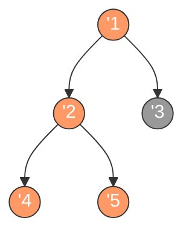

# 二叉树的前序遍历

## 简介

前序遍历（Preorder Traversal）是二叉树深度优先遍历的一种方式，遍历顺序为：**根节点 → 左子树 → 右子树**。

LeetCode 144 题：给你二叉树的根节点 `root`，返回它节点值的前序遍历结果。

## 遍历示意图



前序遍历顺序（橙色高亮）：**1 → 2 → 4 → 5 → 3**

## 代码实现

```javascript
/**
 * 题目：二叉树的前序遍历（LeetCode 144）
 * 描述：按照"根-左-右"的顺序遍历二叉树。
 *
 * 解法一：递归法
 * 思路：先访问根节点，再递归遍历左子树，最后递归遍历右子树。
 * 时间复杂度：O(n)；空间复杂度：O(n)（递归调用栈）
 *
 * 解法二：迭代法（显式栈）
 * 思路：利用栈模拟递归过程。先将右子节点入栈，访问当前节点，
 *       再转向左子树，左子树处理完毕后从栈中取出右子节点处理。
 * 时间复杂度：O(n)；空间复杂度：O(n)
 */

/**
 * preorderTraversal - 递归前序遍历
 * @param {TreeNode} root
 * @return {number[]}
 */
var preorderTraversal = function (root) {
  const res = [];
  const preorder = (root) => {
    if (!root) return;
    res.push(root.val);
    preorder(root.left);
    preorder(root.right);
  };
  preorder(root);
  return res;
};

/**
 * preorderTraversal - 迭代前序遍历
 * @param {TreeNode} root
 * @return {number[]}
 */
const preorderTraversalIterative = function (root) {
  const res = [];
  const stk = [];
  while (root || stk.length) {
    while (root) {
      stk.push(root.right);
      res.push(root.val);
      root = root.left;
    }
    root = stk.pop();
  }
  return res;
};
```

## 逐段解析

### 递归法

```javascript
var preorderTraversal = function (root) {
  const res = [];
```
定义主函数 `preorderTraversal`，接收根节点。初始化结果数组 `res` 用于存储遍历顺序。

```javascript
  const preorder = (root) => {
    if (!root) return;
```
定义内部递归函数 `preorder`。如果当前节点为空，直接返回（递归终止条件）。

```javascript
    res.push(root.val);
    preorder(root.left);
    preorder(root.right);
```
**核心逻辑**：先访问根节点（将值加入 `res`），然后递归遍历左子树，最后递归遍历右子树。这正好体现了"根 → 左 → 右"的前序遍历顺序。

```javascript
  preorder(root);
  return res;
};
```
从根节点开始调用递归函数，最后返回结果数组。

### 迭代法

```javascript
const preorderTraversalIterative = function (root) {
  const res = [];
  const stk = [];
```
定义迭代版本，使用显式栈 `stk` 来模拟递归过程。

```javascript
  while (root || stk.length) {
    while (root) {
      stk.push(root.right);
      res.push(root.val);
      root = root.left;
    }
```
外层循环控制整体遍历。内层循环沿着左子树深入：每次先将右子节点入栈（后续处理），访问当前节点值，然后转向左子节点。这使得左子节点被优先处理，符合前序顺序。

```javascript
    root = stk.pop();
  }
  return res;
};
```
当左子树遍历完毕，从栈中弹出之前保存的右子节点，继续处理。最终返回结果数组。

## 示例输入与输出

**输入：**
```
root = [1, null, 2, 3]
    1
     \
      2
     /
    3
```

**输出：** `[1, 2, 3]`

**输入：**
```
root = [1, 2, 3, 4, 5, null, null]
       1
      / \
     2   3
    / \
   4   5
```

**输出：** `[1, 2, 4, 5, 3]`

## 复杂度分析

| 解法 | 时间复杂度 | 空间复杂度 |
|------|-----------|-----------|
| 递归法 | O(n) | O(n) |
| 迭代法 | O(n) | O(n) |

- **时间复杂度 O(n)**：每个节点恰好被访问一次。
- **空间复杂度 O(n)**：递归法需要递归调用栈深度为树高（最差 O(n)）；迭代法需要显式栈存储节点。
