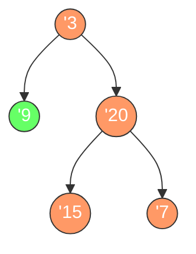

# 二叉树的最大深度

## 简介

二叉树的最大深度是指从根节点到最远叶子节点的最长路径上的节点数。LeetCode 104 题。

## 遍历示意图



最大深度路径（橙色）：**3 → 20 → 15** 或 **3 → 20 → 7**，深度为 **3**

## 代码实现

```javascript
/**
 * 题目：二叉树的最大深度（LeetCode 104）
 * 描述：给定一个二叉树，找出其最大深度。最大深度是从根节点到最远叶子节点的最长路径上的节点数。
 *
 * 解法一：递归法（DFS）
 * 思路：树的深度 = max(左子树深度, 右子树深度) + 1
 * 时间复杂度：O(n)；空间复杂度：O(n)（递归调用栈）
 *
 * 解法二：层序遍历法（BFS）
 * 思路：逐层遍历二叉树，每遍历一层深度加 1，直到遍历完所有节点。
 * 时间复杂度：O(n)；空间复杂度：O(n)
 */

/**
 * maxDepth - 递归法求最大深度
 * @param {TreeNode} root
 * @return {number}
 */
var maxDepth = function (root) {
  if (!root) return 0;
  return Math.max(maxDepth(root.left), maxDepth(root.right)) + 1;
};

/**
 * maxDepth - BFS 层序遍历求最大深度
 * @param {TreeNode} root
 * @return {number}
 */
var maxDepthBFS = (root) => {
  if (root == null) return 0;
  const queue = [root];
  let depth = 1;
  while (queue.length) {
    const levelSize = queue.length;
    for (let i = 0; i < levelSize; i++) {
      const cur = queue.shift();
      if (cur.left) queue.push(cur.left);
      if (cur.right) queue.push(cur.right);
    }
    if (queue.length) depth++;
  }
  return depth;
};
```

## 逐段解析

### 递归法（DFS）

```javascript
var maxDepth = function (root) {
  if (!root) return 0;
```
如果当前节点为空，深度为 0（递归基）。

```javascript
  return Math.max(maxDepth(root.left), maxDepth(root.right)) + 1;
```
**核心递推关系**：当前树的最大深度 = max(左子树最大深度, 右子树最大深度) + 1（当前节点占一层）。通过递归不断下探到叶子节点，然后逐层向上归并结果。

### BFS 层序遍历法

```javascript
var maxDepthBFS = (root) => {
  if (root == null) return 0;
  const queue = [root];
  let depth = 1;
```
使用队列存储当前层节点，`depth` 初始为 1（根节点所在层）。

```javascript
  while (queue.length) {
    const levelSize = queue.length;
    for (let i = 0; i < levelSize; i++) {
      const cur = queue.shift();
      if (cur.left) queue.push(cur.left);
      if (cur.right) queue.push(cur.right);
    }
```
`levelSize` 记录当前层的节点数。内层循环逐个出队当前层节点，并将它们的子节点入队（供下一层处理）。这确保了每次 while 循环恰好处理完一层。

```javascript
    if (queue.length) depth++;
  }
  return depth;
};
```
如果队列中还有节点（即还有下一层），深度加 1。最终返回总深度。

## 示例输入与输出

**输入：**
```
root = [3, 9, 20, null, null, 15, 7]
    3
   / \
  9  20
     / \
    15  7
```

**输出：** `3`

**输入：**
```
root = [1, null, 2]
    1
     \
      2
```

**输出：** `2`

## 复杂度分析

| 解法 | 时间复杂度 | 空间复杂度 |
|------|-----------|-----------|
| 递归法（DFS） | O(n) | O(n) |
| BFS 层序遍历 | O(n) | O(n) |

- **时间复杂度 O(n)**：每个节点恰好被访问一次。
- **空间复杂度 O(n)**：递归法最坏情况下递归栈深度为 n（链状树）；BFS 队列最多存储一层节点，最坏为 n/2。
