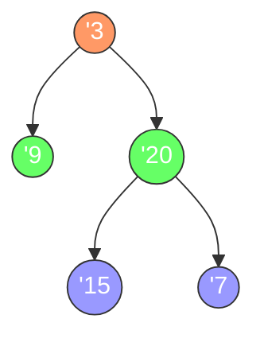

# 二叉树的层序遍历

## 简介

层序遍历（Level Order Traversal）是二叉树的广度优先遍历方式，从上到下、从左到右逐层访问每个节点，每层的节点值作为一个子数组返回。LeetCode 102 题。

## 遍历示意图



**层序遍历顺序：**
- 第 1 层（橙色）：`[3]`
- 第 2 层（绿色）：`[9, 20]`
- 第 3 层（蓝色）：`[15, 7]`

**输出：** `[[3], [9, 20], [15, 7]]`

## 代码实现

```javascript
/**
 * 题目：二叉树的层序遍历（LeetCode 102）
 * 描述：从上到下、从左到右逐层遍历二叉树，返回按层分组的结果数组。
 * 示例：
 *     3
 *    / \
 *   9  20
 *      / \
 *     15  7
 * 输出：[[3], [9,20], [15,7]]
 *
 * 解法：BFS（广度优先遍历）
 * 思路：使用队列存储节点。每轮循环处理一层的所有节点：
 *       1. 记录当前队列长度（当前层的节点数）
 *       2. 依次出队当前层所有节点，将值加入当前层结果数组
 *       3. 将左右子节点入队，供下一层处理
 * 时间复杂度：O(n)；空间复杂度：O(n)
 */

/**
 * @param {TreeNode} root
 * @return {number[][]}
 */
var levelOrder = function (root) {
  const res = [];
  if (!root) return res;
  const q = [root];

  while (q.length !== 0) {
    res.push([]);
    let len = q.length;
    for (let i = 0; i < len; i++) {
      const node = q.shift();
      res[res.length - 1].push(node.val);
      if (node.left) q.push(node.left);
      if (node.right) q.push(node.right);
    }
  }
  return res;
};
```

## 逐段解析

```javascript
var levelOrder = function (root) {
  const res = [];
  if (!root) return res;
  const q = [root];
```
初始化结果数组 `res` 和队列 `q`。如果根节点为空，直接返回空数组。队列初始放入根节点。

```javascript
  while (q.length !== 0) {
    res.push([]);
    let len = q.length;
```
每次进入新的一层，先在结果数组中添加一个空子数组。`len` 记录当前层的节点数量，这个值在后续操作中不会变化，保证了内层循环恰好处理完当前层的所有节点。

```javascript
    for (let i = 0; i < len; i++) {
      const node = q.shift();
      res[res.length - 1].push(node.val);
      if (node.left) q.push(node.left);
      if (node.right) q.push(node.right);
    }
```
`for` 循环逐个出队当前层的节点：将节点值加入当前层结果，然后将左右子节点入队。由于 `len` 是固定的，即使新节点入队，循环次数也不会增加，确保一层一处理。

```javascript
  }
  return res;
};
```
当队列为空时，所有层处理完毕，返回二维结果数组。

## 示例输入与输出

**输入：**
```
root = [3, 9, 20, null, null, 15, 7]
    3
   / \
  9  20
     / \
    15  7
```

**输出：** `[[3], [9, 20], [15, 7]]`

**输入：**
```
root = [1]
```

**输出：** `[[1]]`

**输入：**
```
root = []
```

**输出：** `[]`

## 复杂度分析

| 指标 | 值 |
|------|-----|
| 时间复杂度 | O(n) |
| 空间复杂度 | O(n) |

- **时间复杂度 O(n)**：每个节点入队和出队各一次，即每个节点被访问一次。
- **空间复杂度 O(n)**：队列最多存储一层的节点。最坏情况（完全二叉树最后一层）约有 n/2 个节点，因此空间 O(n)。
