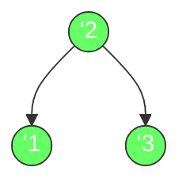
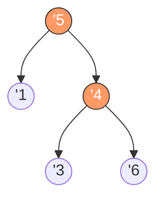

# 验证二叉搜索树

## 简介

给定一个二叉树，判断其是否是一个有效的二叉搜索树（BST）。LeetCode 98 题。

**BST 定义：**
1. 左子树所有节点的值 **小于** 根节点的值
2. 右子树所有节点的值 **大于** 根节点的值
3. 左右子树也必须是 BST

## 遍历示意图



有效 BST：中序遍历结果为 `[1, 2, 3]`（严格递增）✅



无效 BST：中序遍历结果为 `[1, 5, 3, 6]`，其中 `3 < 5` 不满足递增 ❌

## 代码实现

```javascript
/**
 * 题目：验证二叉搜索树（LeetCode 98）
 * 描述：给定一个二叉树，判断其是否是一个有效的二叉搜索树（BST）。
 * BST 定义：
 *   1. 左子树所有节点的值 < 根节点的值
 *   2. 右子树所有节点的值 > 根节点的值
 *   3. 左右子树也必须是 BST
 *
 * 解法一（注释部分）：递归边界法
 * 思路：递归时传递上下界（lower, upper），当前节点值必须在 (lower, upper) 范围内。
 *       左子树更新上界为 root.val，右子树更新下界为 root.val。
 * 时间复杂度：O(n)；空间复杂度：O(n)
 *
 * 解法二（当前代码）：中序遍历法
 * 思路：BST 的中序遍历结果一定是严格升序的。
 *       中序遍历二叉树，依次比较每个节点值与上一个节点值。
 *       如果当前值 <= 上一个值，说明不是 BST。
 * 时间复杂度：O(n)；空间复杂度：O(n)
 */

/**
 * isValidBST - 中序遍历法验证
 * @param {TreeNode} root
 * @return {boolean}
 */
var isValidBST = function (root) {
  let stk = [];
  let oldNode = -Infinity; // 记录上一个节点的值

  while (root || stk.length) {
    while (root) {
      stk.push(root);
      root = root.left;
    }
    root = stk.pop();
    if (root.val <= oldNode) {
      return false; // 中序遍历未严格递增
    }
    oldNode = root.val;
    root = root.right;
  }
  return true;
};
```

## 逐段解析

```javascript
var isValidBST = function (root) {
  let stk = [];
  let oldNode = -Infinity;
```
初始化栈 `stk` 用于模拟中序遍历。`oldNode` 记录上一个访问的节点值，初始为负无穷，确保根节点大于它。

```javascript
  while (root || stk.length) {
    while (root) {
      stk.push(root);
      root = root.left;
    }
```
外层循环控制遍历过程。内层循环不断将当前节点入栈并向左深入，直到左子节点为空（中序遍历先处理左子树）。

```javascript
    root = stk.pop();
    if (root.val <= oldNode) {
      return false;
    }
    oldNode = root.val;
```
出栈访问节点。**关键判断**：如果当前节点值 `<=` 上一个节点值，说明序列不是严格递增，返回 `false`。否则更新 `oldNode` 为当前节点值。

```javascript
    root = root.right;
  }
  return true;
};
```
转向右子树继续遍历。当栈空且当前节点为空时遍历结束，所有节点都满足严格递增，返回 `true`。

## 示例输入与输出

**输入：**
```
root = [2, 1, 3]
    2
   / \
  1   3
```

**输出：** `true`

**输入：**
```
root = [5, 1, 4, null, null, 3, 6]
    5
   / \
  1   4
     / \
    3   6
```

**输出：** `false`（因为根节点 5 的右子树中存在 3 < 4 < 5，不符合 BST 定义）

## 复杂度分析

| 指标 | 值 |
|------|-----|
| 时间复杂度 | O(n) |
| 空间复杂度 | O(n) |

- **时间复杂度 O(n)**：每个节点恰好被访问一次。
- **空间复杂度 O(n)**：栈最多存储树的高度个节点。最坏情况（链状树）为 O(n)。
