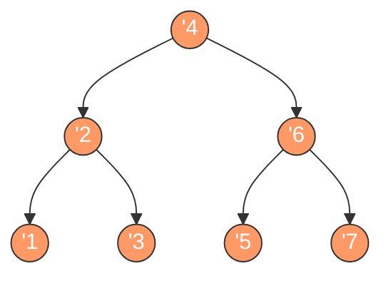

# 二叉树的中序遍历

## 简介

中序遍历（Inorder Traversal）是二叉树深度优先遍历的一种方式，遍历顺序为：**左子树 → 根节点 → 右子树**。

对于二叉搜索树（BST），中序遍历得到的结果是严格递增的序列。LeetCode 94 题。

## 遍历示意图



中序遍历顺序（橙色高亮）：**1 → 2 → 3 → 4 → 5 → 6 → 7**

## 代码实现

```javascript
/**
 * 题目：二叉树的中序遍历（LeetCode 94）
 * 描述：按照"左-根-右"的顺序遍历二叉树。
 *
 * 解法一：递归法
 * 思路：递归遍历左子树 -> 访问根节点 -> 递归遍历右子树
 * 时间复杂度：O(n)；空间复杂度：O(n)
 *
 * 解法二：迭代法（显式栈）
 * 思路：使用栈模拟递归。先将左子节点全部入栈，
 *       然后出栈访问节点，再转向右子节点。
 * 时间复杂度：O(n)；空间复杂度：O(n)
 */

/**
 * inorderTraversal - 递归中序遍历
 * @param {TreeNode} root
 * @return {number[]}
 */
const inorderTraversal = (root) => {
  let result = [];
  const inorder = (node) => {
    if (node) {
      inorder(node.left);
      result.push(node.val);
      inorder(node.right);
    }
  };
  inorder(root);
  return result;
};

/**
 * inorderTraversal - 迭代中序遍历
 * @param {TreeNode} root
 * @return {number[]}
 */
const inorderTraversalIterative = (root) => {
  let list = [];
  let stack = [];
  let node = root;
  while (node || stack.length) {
    while (node) {
      stack.push(node);
      node = node.left;
    }
    node = stack.pop();
    list.push(node.val);
    node = node.right;
  }
  return list;
};
```

## 逐段解析

### 递归法

```javascript
const inorderTraversal = (root) => {
  let result = [];
  const inorder = (node) => {
    if (node) {
      inorder(node.left);
      result.push(node.val);
      inorder(node.right);
    }
  };
  inorder(root);
  return result;
};
```

递归版本代码非常简洁。`inorder` 函数内部：先递归左子树，然后访问根节点（加入结果数组），最后递归右子树。当节点为空时直接返回（递归终止条件）。这精确地体现了 **"左 → 根 → 右"** 的顺序。

### 迭代法

```javascript
const inorderTraversalIterative = (root) => {
  let list = [];
  let stack = [];
  let node = root;
```
使用显式栈模拟递归过程。

```javascript
  while (node || stack.length) {
    while (node) {
      stack.push(node);
      node = node.left;
    }
```
内层循环沿着左子树一路向下，将所有左子节点入栈。这对应于递归中不断调用 `inorder(node.left)` 的过程。

```javascript
    node = stack.pop();
    list.push(node.val);
    node = node.right;
  }
  return list;
};
```
出栈访问节点（对应递归中的"访问根节点"），然后转向右子树继续遍历。当栈空且节点为空时结束。

## 示例输入与输出

**输入：**
```
root = [1, null, 2, 3]
    1
     \
      2
     /
    3
```

**输出：** `[1, 3, 2]`

**输入：**
```
root = [1, 2, 3, 4, 5, null, null]
       4
      / \
     2   6
    / \ / \
   1  3 5  7
```

**输出：** `[1, 2, 3, 4, 5, 6, 7]`

## 复杂度分析

| 解法 | 时间复杂度 | 空间复杂度 |
|------|-----------|-----------|
| 递归法 | O(n) | O(n) |
| 迭代法 | O(n) | O(n) |

- **时间复杂度 O(n)**：每个节点恰好被访问一次。
- **空间复杂度 O(n)**：递归法需要调用栈深度为树高；迭代法需要显式栈存储节点。
