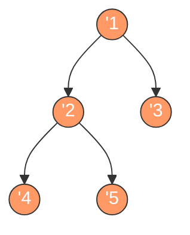

# 二叉树的后序遍历

## 简介

后序遍历（Postorder Traversal）是二叉树深度优先遍历的一种方式，遍历顺序为：**左子树 → 右子树 → 根节点**。

后序遍历常用于树的操作中需要在处理子节点之后处理父节点的场景，如计算树的深度、删除树等。LeetCode 145 题。

## 遍历示意图



后序遍历顺序（橙色高亮）：**4 → 5 → 2 → 3 → 1**

## 代码实现

```javascript
/**
 * 题目：二叉树的后序遍历（LeetCode 145）
 * 描述：按照"左-右-根"的顺序遍历二叉树。
 *
 * 解法一：递归法
 * 思路：递归遍历左子树 -> 递归遍历右子树 -> 访问根节点
 * 时间复杂度：O(n)；空间复杂度：O(n)
 *
 * 解法二：迭代法（头插法变形）
 * 思路：前序遍历是"根-左-右"，改为"根-右-左"后 reverse 即为"左-右-根"。
 *       用 unshift（头插法）改变入栈顺序，出栈时自然变为后序
 * 时间复杂度：O(n)；空间复杂度：O(n)
 */

/**
 * postorderTraversal - 递归后序遍历
 * @param {TreeNode} root
 * @return {number[]}
 */
const postorderTraversal = function (root) {
  let result = [];
  const postorder = (node) => {
    if (node) {
      postorder(node.left);
      postorder(node.right);
      result.push(node.val);
    }
  };
  postorder(root);
  return result;
};

/**
 * postorderTraversal - 迭代后序遍历
 * @param {TreeNode} root
 * @return {number[]}
 */
const postorderTraversalIterative = (root) => {
  const list = [];
  const stack = [];
  if (root) stack.push(root);
  while (stack.length > 0) {
    const node = stack.pop();
    list.unshift(node.val); // 头插法，逆序构造结果
    if (node.left !== null) stack.push(node.left);
    if (node.right !== null) stack.push(node.right);
  }
  return list;
};
```

## 逐段解析

### 递归法

```javascript
const postorderTraversal = function (root) {
  let result = [];
  const postorder = (node) => {
    if (node) {
      postorder(node.left);
      postorder(node.right);
      result.push(node.val);
    }
  };
  postorder(root);
  return result;
};
```

递归版本非常直观。`postorder` 函数严格按照 **"左 → 右 → 根"** 的顺序：先递归左子树，再递归右子树，最后将根节点的值加入结果数组。当节点为空时返回。

### 迭代法

```javascript
const postorderTraversalIterative = (root) => {
  const list = [];
  const stack = [];
  if (root) stack.push(root);
```
使用栈和头插法实现。栈初始放入根节点。

```javascript
  while (stack.length > 0) {
    const node = stack.pop();
    list.unshift(node.val);
```
出栈节点，将值**插入到结果数组的开头**（`unshift`）。这个逆序构造是关键技巧。

```javascript
    if (node.left !== null) stack.push(node.left);
    if (node.right !== null) stack.push(node.right);
  }
  return list;
};
```
**注意入栈顺序**：先入左子节点，再入右子节点。由于栈是 LIFO，出栈顺序为"根 → 右 → 左"。使用 `unshift`（每次插入到头部）后，结果变为"左 → 右 → 根"，即后序遍历。

## 示例输入与输出

**输入：**
```
root = [1, null, 2, 3]
    1
     \
      2
     /
    3
```

**输出：** `[3, 2, 1]`

**输入：**
```
root = [1, 2, 3, 4, 5, null, null]
       1
      / \
     2   3
    / \
   4   5
```

**输出：** `[4, 5, 2, 3, 1]`

## 复杂度分析

| 解法 | 时间复杂度 | 空间复杂度 |
|------|-----------|-----------|
| 递归法 | O(n) | O(n) |
| 迭代法 | O(n) | O(n) |

- **时间复杂度 O(n)**：每个节点恰好被访问一次。
- **空间复杂度 O(n)**：递归法需要递归栈；迭代法需要显式栈存储节点。
