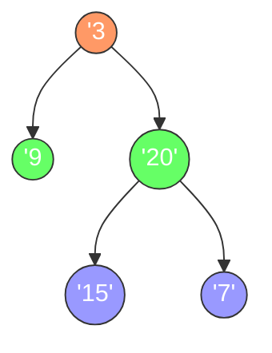

# 二叉树的层次遍历（自底向上）

## 简介

二叉树的层次遍历 II（自底向上）：从叶子节点所在层到根节点所在层，逐层从左到右遍历。LeetCode 107 题。

本质上是标准层序遍历的逆序输出——先得到从上到下的层序结果，再反转。

## 遍历示意图



**从上到下（标准层序）：** `[[3], [9, 20], [15, 7]]`
**从下到上（本题结果）：** `[[15, 7], [9, 20], [3]]`

## 代码实现

```javascript
/**
 * 题目：二叉树的层次遍历 II - 自底向上（LeetCode 107）
 * 描述：从叶子节点所在层到根节点所在层，从左到右遍历。
 * 示例：
 *     3
 *    / \
 *   9  20
 *      / \
 *     15  7
 * 输出：[[15,7], [9,20], [3]]
 *
 * 解法一：BFS + reverse
 * 思路：按从上到下的 BFS 层序遍历，最后将结果 reverse。
 * 时间复杂度：O(n)；空间复杂度：O(n)
 *
 * 解法二：DFS + 记录深度
 * 思路：递归时根据深度将节点值放入对应深度的数组中，
 *       最后将结果 reverse。
 * 时间复杂度：O(n)；空间复杂度：O(n)
 */

/**
 * levelOrderBottom - BFS 自底向上层序遍历
 * @param {TreeNode} root
 * @return {number[][]}
 */
const levelOrderBottom = function (root) {
  if (!root) return [];
  let res = [],
    queue = [root];
  while (queue.length) {
    let curr = [],
      temp = [];
    while (queue.length) {
      let node = queue.shift();
      curr.push(node.val);
      if (node.left) temp.push(node.left);
      if (node.right) temp.push(node.right);
    }
    res.push(curr);
    queue = temp;
  }
  return res.reverse();
};

/**
 * levelOrderBottom - DFS 自底向上层序遍历
 * @param {TreeNode} root
 * @return {number[][]}
 */
const levelOrderBottomDFS = function (root) {
  const res = [];
  const dfs = function (node, depth) {
    if (!node) return;
    res[depth] = res[depth] || [];
    res[depth].push(node.val);
    dfs(node.left, depth + 1);
    dfs(node.right, depth + 1);
  };
  dfs(root, 0);
  return res.reverse();
};
```

## 逐段解析

### BFS + reverse 法

```javascript
const levelOrderBottom = function (root) {
  if (!root) return [];
  let res = [],
    queue = [root];
```
处理空树。`queue` 初始放入根节点。

```javascript
  while (queue.length) {
    let curr = [],
      temp = [];
    while (queue.length) {
      let node = queue.shift();
      curr.push(node.val);
      if (node.left) temp.push(node.left);
      if (node.right) temp.push(node.right);
    }
```
内层循环处理同一层的所有节点：`curr` 收集当前层的值，`temp` 暂存下一层的节点。使用两个独立数组（而不是用 `len` 固定循环次数）实现逐层分离。

```javascript
    res.push(curr);
    queue = temp;
  }
  return res.reverse();
};
```
将当前层结果加入 `res`，将 `temp` 赋值给 `queue` 以处理下一层。最后调用 `reverse()` 将从上到下的结果逆序，得到自底向上的层序遍历结果。

### DFS + 记录深度法

```javascript
const levelOrderBottomDFS = function (root) {
  const res = [];
  const dfs = function (node, depth) {
    if (!node) return;
    res[depth] = res[depth] || [];
    res[depth].push(node.val);
    dfs(node.left, depth + 1);
    dfs(node.right, depth + 1);
  };
  dfs(root, 0);
  return res.reverse();
};
```
DFS 递归遍历每个节点，`depth` 参数记录当前深度。将节点值按深度放入 `res[depth]` 数组中。由于 DFS 是先序遍历，`res[0]` 是根节点所在层，`res[1]` 是第二层……最后 `reverse()` 即可。

## 示例输入与输出

**输入：**
```
root = [3, 9, 20, null, null, 15, 7]
    3
   / \
  9  20
     / \
    15  7
```

**输出：** `[[15, 7], [9, 20], [3]]`

**输入：**
```
root = [1]
```

**输出：** `[[1]]`

**输入：**
```
root = []
```

**输出：** `[]`

## 复杂度分析

| 解法 | 时间复杂度 | 空间复杂度 |
|------|-----------|-----------|
| BFS + reverse | O(n) | O(n) |
| DFS + 记录深度 | O(n) | O(n) |

- **时间复杂度 O(n)**：每个节点恰好被访问一次，`reverse` 操作为 O(n)。
- **空间复杂度 O(n)**：BFS 队列最多存储一层的节点；DFS 递归栈深度为树高。
