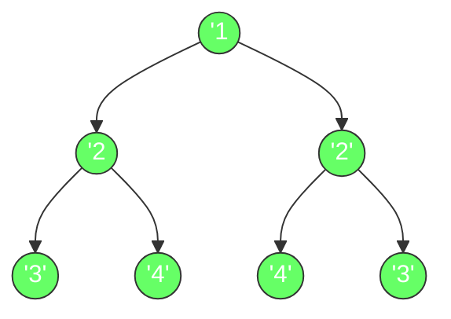
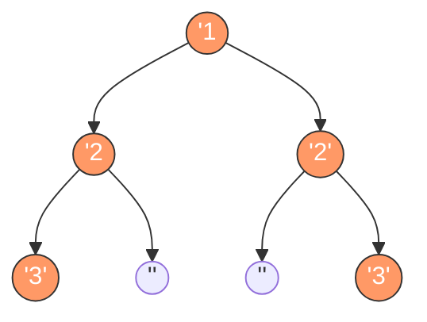

# 对称二叉树

## 简介

给定一个二叉树，检查它是否是镜像对称的。LeetCode 101 题。

一个二叉树对称等价于它的左右子树互为镜像。

## 遍历示意图

**对称的二叉树 ✅**


**不对称的二叉树 ❌**


## 代码实现

```javascript
/**
 * 题目：对称二叉树（LeetCode 101）
 * 描述：给定一个二叉树，检查它是否是镜像对称的。
 * 示例：二叉树 [1,2,2,3,4,4,3] 是对称的
 *       1
 *      / \
 *     2   2
 *    / \ / \
 *   3  4 4  3
 *
 * 解法：递归比较
 * 思路：一棵树对称等价于左右子树互为镜像。
 *       比较两个节点是否对称：
 *       - 两个节点值相等
 *       - 左节点的左子树与右节点的右子树对称
 *       - 左节点的右子树与右节点的左子树对称
 * 时间复杂度：O(n)；空间复杂度：O(n)
 */

/**
 * @param {TreeNode} root
 * @return {boolean}
 */
const isSymmetric = function (root) {
  if (!root) return true;

  const isEqual = function (left, right) {
    if (!left && !right) return true;
    if (!left || !right) return false;
    return (
      left.val === right.val &&
      isEqual(left.left, right.right) &&
      isEqual(left.right, right.left)
    );
  };

  return isEqual(root.left, root.right);
};
```

## 逐段解析

```javascript
const isSymmetric = function (root) {
  if (!root) return true;
```
空树是对称的，直接返回 `true`。

```javascript
  const isEqual = function (left, right) {
    if (!left && !right) return true;
    if (!left || !right) return false;
```
定义递归比较函数 `isEqual`，比较两个节点是否镜像对称：
- 如果两个节点都为空 → 对称，返回 `true`
- 如果其中一个为空另一个不为空 → 不对称，返回 `false`

```javascript
    return (
      left.val === right.val &&
      isEqual(left.left, right.right) &&
      isEqual(left.right, right.left)
    );
  };
```
**核心判断**：三个条件必须同时满足：
1. 两个节点的值相等
2. 左节点的左子树 与 右节点的右子树 对称（外侧比较）
3. 左节点的右子树 与 右节点的左子树 对称（内侧比较）

这正是镜像对称的定义。

```javascript
  return isEqual(root.left, root.right);
};
```
从根节点的左右子树开始比较。

## 示例输入与输出

**输入：**
```
root = [1, 2, 2, 3, 4, 4, 3]
       1
      / \
     2   2
    / \ / \
   3  4 4  3
```

**输出：** `true`

**输入：**
```
root = [1, 2, 2, null, 3, null, 3]
       1
      / \
     2   2
      \   \
       3   3
```

**输出：** `false`

**输入：**
```
root = []
```

**输出：** `true`

## 复杂度分析

| 指标 | 值 |
|------|-----|
| 时间复杂度 | O(n) |
| 空间复杂度 | O(n) |

- **时间复杂度 O(n)**：每个节点恰好被比较一次。
- **空间复杂度 O(n)**：递归调用栈深度取决于树的高度，最坏情况（链状树）为 O(n)。
