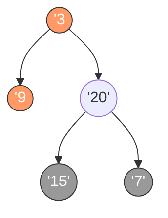
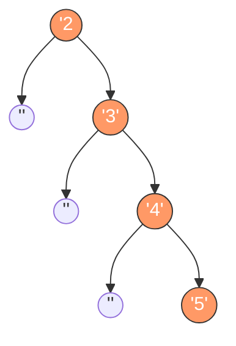

# 二叉树的最小深度

## 简介

给定一个二叉树，找出其最小深度。最小深度是从根节点到**最近叶子节点**的最短路径上的节点数。LeetCode 111 题。

**注意：** 叶子节点是指没有子节点的节点。与最大深度不同，当一个节点只有左子树或只有右子树时，不能简单取 `min`，因为缺少子树的那一侧深度为 0 不代表叶子节点。

## 遍历示意图



最小深度路径（橙色）：**3 → 9**，深度为 **2**



链状树最小深度路径（橙色）：**2 → 3 → 4 → 5**，深度为 **4**

**注意**：对于链状树若简单取 `min(左,右)+1` 会得到错误结果 `1`，因为缺失子树的那一侧深度为 0 不代表叶子节点。

## 代码实现

```javascript
/**
 * 题目：二叉树的最小深度（LeetCode 111）
 * 描述：给定一个二叉树，找出其最小深度。最小深度是从根节点到最近叶子节点的最短路径上的节点数。
 *       注意：叶子节点是指没有子节点的节点。
 *
 * 与最大深度的区别：当一个节点只有左子树或只有右子树时，不能简单取 min，
 *       因为缺少子树的那一侧深度为 0 不代表叶子节点。
 *       正确的做法是取左右子树中非空的深度 + 1。
 *
 * 解法一：递归（简洁版）
 * 思路：叶子节点返回 1，缺左或右子树时取较大值（跳过缺失的一侧），左右都有时取较小值。
 * 时间复杂度：O(n)；空间复杂度：O(n)
 *
 * 解法二：递归（清晰版）
 * 思路：分四种情况讨论：左右子树都存在、只有左子树、只有右子树、都没有。
 * 时间复杂度：O(n)；空间复杂度：O(n)
 */

/**
 * minDepth - 递归求最小深度（简洁版）
 * @param {TreeNode} root
 * @return {number}
 */
var minDepth = function (root) {
  if (!root) return 0;
  if (!root.left && !root.right) return 1;
  let lh = minDepth(root.left);
  let rh = minDepth(root.right);
  if (!root.left || !root.right) return Math.max(lh, rh) + 1;
  return Math.min(lh, rh) + 1;
};

/**
 * minDepth - 递归求最小深度（清晰版）
 * @param {TreeNode} root
 * @return {number}
 */
var minDepthDetailed = (root) => {
  if (root == null) return 0;
  if (root.left && root.right) {
    return 1 + Math.min(minDepthDetailed(root.left), minDepthDetailed(root.right));
  } else if (root.left) {
    return 1 + minDepthDetailed(root.left);
  } else if (root.right) {
    return 1 + minDepthDetailed(root.right);
  } else {
    return 1;
  }
};
```

## 逐段解析

### 简洁版

```javascript
var minDepth = function (root) {
  if (!root) return 0;
  if (!root.left && !root.right) return 1;
```
空节点深度为 0；叶子节点（左右子节点都为空）深度为 1。

```javascript
  let lh = minDepth(root.left);
  let rh = minDepth(root.right);
  if (!root.left || !root.right) return Math.max(lh, rh) + 1;
```
**关键逻辑**：如果缺少左子树或右子树（`!root.left || !root.right`），说明当前节点只有一侧有子节点，不是完整的子树分支。这时候应该取 `max` 而非 `min`——因为缺失的那一侧深度 0 不算有效路径，取 `max` 相当于跳过了缺失侧，沿着存在的子树继续计算。

```javascript
  return Math.min(lh, rh) + 1;
};
```
如果左右子树都存在，则取两者中的较小值加 1。

### 清晰版

```javascript
var minDepthDetailed = (root) => {
  if (root == null) return 0;
  if (root.left && root.right) {
    return 1 + Math.min(minDepthDetailed(root.left), minDepthDetailed(root.right));
  } else if (root.left) {
    return 1 + minDepthDetailed(root.left);
  } else if (root.right) {
    return 1 + minDepthDetailed(root.right);
  } else {
    return 1;
  }
};
```
清晰版将四种情况显式处理：
1. **左右子树都存在**：取较小值 + 1
2. **只有左子树**：沿左子树继续计算
3. **只有右子树**：沿右子树继续计算
4. **叶子节点**：返回 1

这种分情况讨论的方式更易理解，避免了简洁版中 `Math.max(lh, rh) + 1` 的"反直觉"写法。

## 示例输入与输出

**输入：**
```
root = [3, 9, 20, null, null, 15, 7]
    3
   / \
  9  20
     / \
    15  7
```

**输出：** `2`

**输入：**
```
root = [2, null, 3, null, 4, null, 5, null, 6]
    2
     \
      3
       \
        4
         \
          5
           \
            6
```

**输出：** `5`

## 复杂度分析

| 解法 | 时间复杂度 | 空间复杂度 |
|------|-----------|-----------|
| 简洁版递归 | O(n) | O(n) |
| 清晰版递归 | O(n) | O(n) |

- **时间复杂度 O(n)**：每个节点恰好被访问一次。
- **空间复杂度 O(n)**：递归调用栈深度取决于树的高度，最坏情况（链状树）为 O(n)。
