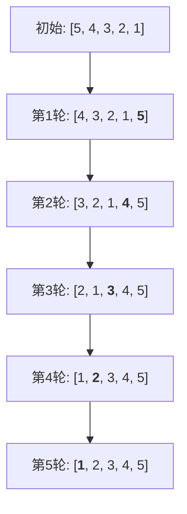

# 冒泡排序

## 简介

冒泡排序（Bubble Sort）是最基础的排序算法之一。它重复遍历数组，依次比较相邻两个元素，如果顺序错误则交换。每轮遍历会将当前未排序部分中的最大（或最小）元素"冒泡"到数组末尾，如同水中的气泡一样浮到水面。

**特性一览：**
- 稳定排序
- 原地排序（In-place）
- 时间复杂度：最好 O(n)、最坏 O(n²)、平均 O(n²)
- 空间复杂度：O(1)

---

## 排序过程示意图

以初始数组 `[5, 4, 3, 2, 1]` 为例，每轮将最大元素冒泡到末尾：



每轮对比与交换的详细过程（第一轮）：

```mermaid
flowchart LR
    subgraph 初始
        A1["5"] --> A2["4"]
        A2 --> A3["3"]
        A3 --> A4["2"]
        A4 --> A5["1"]
    end
    subgraph "比 5>4 交换"
        B1["4"] --> B2["5"]
        B2 --> B3["3"]
        B3 --> B4["2"]
        B4 --> B5["1"]
    end
    subgraph "比 5>3 交换"
        C1["4"] --> C2["3"]
        C2 --> C5["5"]
        C5 --> C3["2"]
        C3 --> C4["1"]
    end
    subgraph "比 5>2 交换"
        D1["4"] --> D2["3"]
        D2 --> D3["2"]
        D3 --> D5["5"]
        D5 --> D4["1"]
    end
    subgraph "比 5>1 交换 → 5冒泡到末尾"
        E1["4"] --> E2["3"]
        E2 --> E3["2"]
        E3 --> E4["1"]
        E4 --> E5["5"]
    end
```



---

## 代码实现

```javascript
const arr = [5, 4, 3, 2, 1, 0];

/** 标准冒泡排序 */
function bubbleSort(arr) {
  const len = arr.length;
  for (let i = 0; i < len; i++) {
    for (let j = 0; j < len - 1 - i; j++) {
      if (arr[j] > arr[j + 1]) [arr[j], arr[j + 1]] = [arr[j + 1], arr[j]];
    }
  }
  return arr;
}

/** 改进版：记录最后交换位置，已排序部分不再比较 */
function bubbleSort2(arr) {
  let i = arr.length - 1;
  while (i > 0) {
    let pos = 0;
    for (let j = 0; j < i; j++) {
      if (arr[j] > arr[j + 1]) {
        pos = j;
        [arr[j], arr[j + 1]] = [arr[j + 1], arr[j]];
      }
    }
    i = pos;
  }
  return arr;
}

/** 改进版：提前退出，一轮无交换即有序 */
function bubbleSort3(arr) {
  for (let i = 0; i < arr.length; i++) {
    let flag = false;
    for (let j = 0; j < arr.length - i - 1; j++) {
      if (arr[j] > arr[j + 1]) {
        [arr[j], arr[j + 1]] = [arr[j + 1], arr[j]];
        flag = true;
      }
    }
    if (!flag) break;
  }
  return arr;
}
```

---

## 逐段解析

### 标准冒泡（bubbleSort）

外层循环 `i` 控制轮数，每轮确定一个最大元素放到末尾。内层循环 `j` 从 `0` 遍历到 `len - 1 - i`（**已排序的末尾元素无需再参与**），比较相邻元素，前者大于后者则交换。使用解构赋值 `[arr[j], arr[j+1]] = [arr[j+1], arr[j]]` 实现交换。

### 改进版：记录最后交换位置（bubbleSort2）

关键思路：**一轮中最后一次交换发生在位置 `pos`，则 `pos` 之后的所有元素已经有序**，下一轮只需遍历到 `pos` 即可。变量 `i` 从末尾递减，内层循环每次只遍历到 `i`，并记录最后交换的位置 `pos`，下一轮 `i = pos`，从而缩小遍历范围。

### 改进版：提前退出（bubbleSort3）

设置标志位 `flag`。如果某一轮内层循环**没有任何交换**，说明数组已经完全有序，直接 `break` 终止外层循环。最好情况下（数组已有序）只需一次遍历，复杂度降为 O(n)。

---

## 复杂度分析

| 版本 | 最好 | 最坏 | 平均 | 空间 | 稳定 |
|------|------|------|------|------|------|
| 标准版 | O(n²) | O(n²) | O(n²) | O(1) | 是 |
| 记录交换位置 | O(n) | O(n²) | O(n²) | O(1) | 是 |
| 提前退出 | O(n) | O(n²) | O(n²) | O(1) | 是 |

**稳定性说明：** 当 `arr[j] > arr[j+1]` 时才交换，相等的元素不会交换相对位置，因此冒泡排序是**稳定的**。
