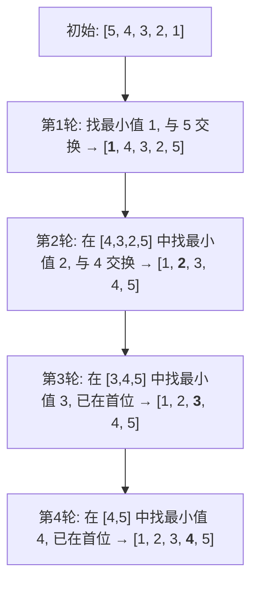
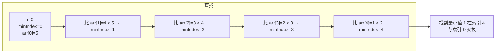

# 选择排序

## 简介

选择排序（Selection Sort）的核心思想非常直观：**每轮从未排序部分选出最小值，放到已排序部分的末尾**。它把数组看作两部分——左侧是已排序区，右侧是未排序区，每次从未排序区中挑出最小的一个，与未排序区的第一个元素交换，从而扩大已排序区。

**特性一览：**
- **不稳定**排序
- 原地排序（In-place）
- 时间复杂度：O(n²)（任何情况）
- 空间复杂度：O(1)

---

## 排序过程示意图

以初始数组 `[5, 4, 3, 2, 1]` 为例：



每轮搜索最小值的详细过程（第一轮，定位最小值 1）：



---

## 代码实现

```javascript
/**
 * @param {number[]} arr
 * @returns {number[]}
 */
function selectionSort(arr) {
  const len = arr.length;
  for (let i = 0; i < len - 1; i++) {
    let minIndex = i;
    for (let j = i + 1; j < len; j++) {
      minIndex = arr[j] < arr[minIndex] ? j : minIndex;
    }
    if (minIndex !== i) [arr[minIndex], arr[i]] = [arr[i], arr[minIndex]];
  }
  return arr;
}
```

---

## 逐段解析

- **外层循环** `i`：从 0 到 `len - 2`，每轮确定一个位置 `i` 的最终元素。一共需要 `n - 1` 轮（最后一个元素自动归位）。
- **`minIndex`**：记录当前轮最小值的索引，初始化为 `i`（未排序区的第一个位置）。
- **内层循环** `j`：从 `i + 1` 到末尾，逐一比较 `arr[j]` 和 `arr[minIndex]`，遇到更小的元素就更新 `minIndex`。这里使用**三元运算符**简洁地实现判断。
- **交换**：如果 `minIndex !== i`，说明最小值不在当前位置，交换二者。交换使用解构赋值。

---

## 为什么不稳定？

看一个例子：`[5, 5, 2]`。第一轮找到最小值 2 在索引 2，与索引 0 的 5 交换，得到 `[2, 5, 5]`。原来的第一个 5 被换到了后面，**两个 5 的相对顺序被改变了**，所以选择排序是**不稳定**的。

---

## 复杂度分析

| 最好 | 最坏 | 平均 | 空间 | 稳定 |
|------|------|------|------|------|
| O(n²) | O(n²) | O(n²) | O(1) | 否 |

无论数组是否有序，内层循环**始终要完整遍历未排序部分**，因此最好、最坏、平均时间复杂度都是 O(n²)。空间上只使用了常数个临时变量。
