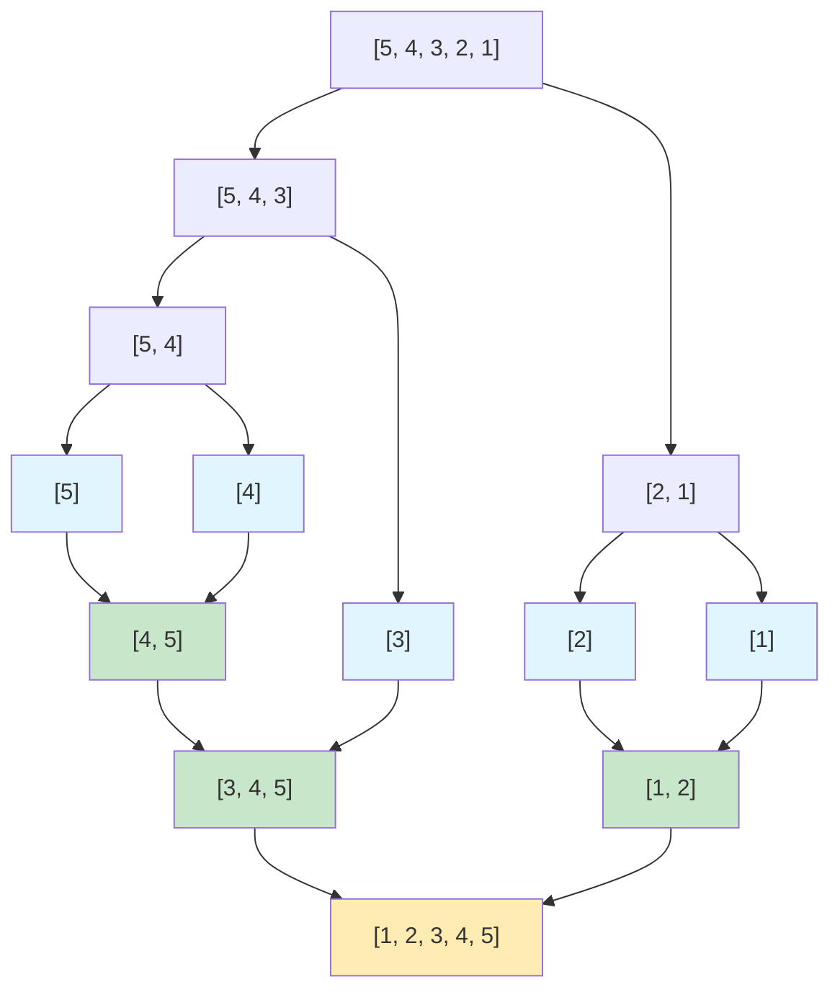
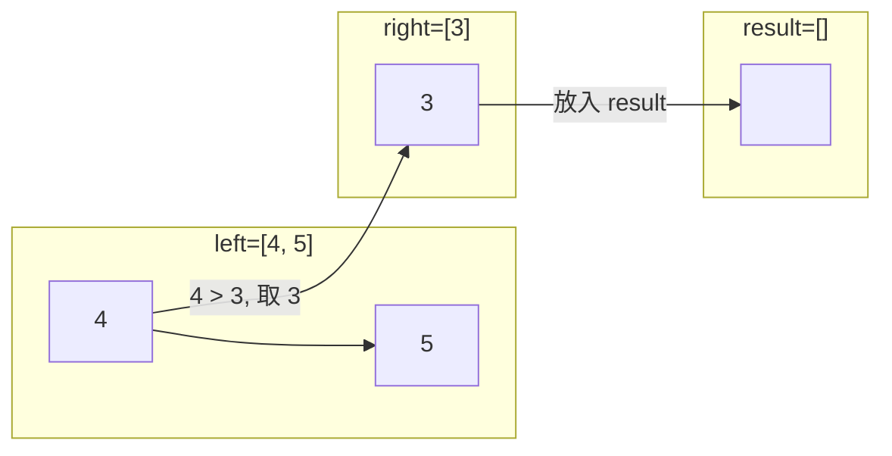

# 归并排序

## 简介

归并排序（Merge Sort）采用**分治（Divide and Conquer）**思想，将数组递归地分成两半，分别排序后再合并。它的核心在于"合并"操作——将两个已经有序的子数组合并为一个更大的有序数组。

**步骤分解：**
1. **分（Divide）**：将数组平分成两个子数组
2. **治（Conquer）**：递归对子数组排序，直到子数组长度为 1（天然有序）
3. **合（Merge）**：合并两个有序子数组为一个有序数组

**特性一览：**
- 稳定排序
- 非原地排序（需要 O(n) 额外空间）
- 时间复杂度：O(n log n)（任何情况）
- 空间复杂度：O(n)

---

## 排序过程示意图

以初始数组 `[5, 4, 3, 2, 1]` 为例，展示分治与合并的完整过程：



合并过程的详细步骤——合并 `[4, 5]` 和 `[3]`：



---

## 代码实现

```javascript
const mergeSort = (arr) => {
  if (arr.length > 1) {
    const middle = Math.floor(arr.length / 2);
    const left = mergeSort(arr.slice(0, middle));
    const right = mergeSort(arr.slice(middle));
    arr = merge(left, right);
  }
  return arr;
};

const merge = (left, right) => {
  let i = 0, j = 0;
  const res = [];
  while (i < left.length && j < right.length) {
    res.push(left[i] < right[j] ? left[i++] : right[j++]);
  }
  return res.concat(i < left.length ? left.slice(i) : right.slice(j));
};
```

---

## 逐段解析

### 主函数 `mergeSort`

1. **递归终止条件**：`if (arr.length > 1)` —— 当数组长度为 1 时直接返回，因为长度为 1 的数组天然有序。
2. **分**：`const middle = Math.floor(arr.length / 2)` 找到中间位置，用 `slice` 切分出左右子数组。
3. **治**：递归调用 `mergeSort` 分别对左右子数组排序。
4. **合**：调用 `merge(left, right)` 将两个有序数组合并，结果覆盖原数组引用。

### 合并函数 `merge`

使用双指针技巧：`i` 指向 `left`，`j` 指向 `right`，每次比较二者当前元素，**取较小的放入结果数组**（`<` 保证稳定性），指针后移。当其中一个数组遍历完毕后，用 `concat` 将剩余元素全部追加到结果末尾。注意 `left[i] < right[j]` 使用严格小于，相等时取左数组元素，保证稳定。

---

## 复杂度分析

| 最好 | 最坏 | 平均 | 空间 | 稳定 |
|------|------|------|------|------|
| O(n log n) | O(n log n) | O(n log n) | O(n) | 是 |

- **时间复杂度**：无论数据如何，都是先分后合。分的过程产生 O(log n) 层递归，每层合并需要 O(n) 时间，总 O(n log n)。
- **空间复杂度**：合并时需要创建新数组存储结果，每层合并总空间 O(n)（递归栈不计入，但辅助数组 O(n)）。
- **稳定性**：合并时 `left[i] < right[j]`，相等时取左，不会改变相同元素的相对顺序，**稳定**。
