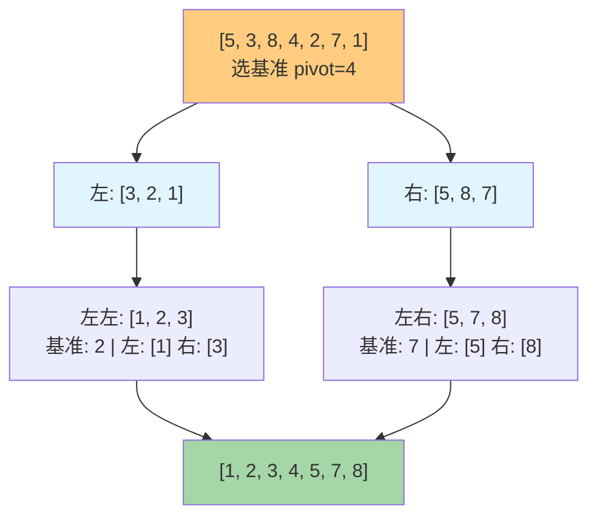

# 快速排序

## 简介

快速排序（Quick Sort）是应用最广泛的排序算法之一，同样采用**分治**思想。它选择一个**基准（pivot）**元素，将数组分为小于基准和大于基准两部分，然后递归排序这两部分。

**核心要点：**
- 选基准 → 分区 → 递归
- 分区时完成元素的"粗排序"，使得基准元素到达最终正确位置

**特性一览：**
- **不稳定**排序
- 原地排序（分区法）/ 非原地（简单法）
- 时间复杂度：最好/平均 O(n log n)，最坏 O(n²)
- 空间复杂度：O(log n)（递归栈）

---

## 排序过程示意图

以初始数组 `[5, 3, 8, 4, 2, 7, 1]` 为例（选择中间元素为基准）：



---

## 代码实现

```javascript
/** 原地分区快速排序 */
function quickSort(arr) {
  quick(arr, 0, arr.length - 1);
  return arr;
}

function quick(arr, start, end) {
  if (arr.length > 1) {
    const index = partition(arr, start, end);
    if (start < index - 1) quick(arr, start, index - 1);
    if (index < end) quick(arr, index, end);
  }
}

/** 分区函数：选中间元素为基准，双指针向中间扫描 */
function partition(arr, start, end) {
  const pivot = arr[Math.floor((start + end) / 2)];
  let i = start, j = end;
  while (i <= j) {
    while (arr[i] < pivot) i++;
    while (arr[j] > pivot) j--;
    if (i <= j) {
      [arr[i], arr[j]] = [arr[j], arr[i]];
      i++;
      j--;
    }
  }
  return i;
}

/** 非原地快速排序（易理解） */
function quickSortSimple(arr) {
  if (arr.length < 2) return arr;
  const cur = arr[arr.length - 1];
  let left = [];
  let right = [];
  for (let i = 0; i < arr.length - 1; i++) {
    if (arr[i] >= cur) {
      right.push(arr[i]);
    } else {
      left.push(arr[i]);
    }
  }
  return [...quickSortSimple(left), cur, ...quickSortSimple(right)];
}
```

---

## 逐段解析

### 解法一：原地分区法

**核心思想：选中间元素为基准，双指针从两端向中间扫描。**

1. **`quickSort` 入口**：接收数组，调用 `quick(arr, 0, len - 1)`，返回原数组（原地排序）。

2. **`quick` 递归函数**：`arr.length > 1` 时才需分区。调用 `partition` 得到分区索引 `index`（此时 `index` 左侧元素 ≤ pivot，右侧 ≥ pivot）。然后递归排序左右两部分。

3. **`partition` 分区函数**：
   - 选中间位置元素为基准 `pivot`
   - 双指针 `i`（从左向右）、`j`（从右向左）同时扫描
   - 左指针跳过小于 pivot 的元素（已在正确侧），右指针跳过大于 pivot 的元素
   - 当两边都找到不符合条件的元素时，交换 `arr[i]` 和 `arr[j]`，然后指针同时向中间移动
   - 当 `i > j` 时退出，返回 `i` 作为分区点

### 解法二：非原地法

**核心思路：简单直观，但浪费空间。**

以最后一个元素为基准，遍历剩余所有元素，小于基准的放 `left` 数组，大于等于的放 `right` 数组。然后递归排序左右数组，最后用展开运算符合并 `[...left, pivot, ...right]`。代码简洁但空间复杂度高（O(n)）。

---

## 分区过程详解

以 `[5, 3, 8, 4, 2]` 为例（中间元素 8 为 pivot）：

```
初始:  i=0(5)  pivot=8  j=4(2)
   5 < 8 → i=1(3)
   3 < 8 → i=2(8)    // 找到左侧第一个 >= pivot 的元素
   2 < 8 → j=3(4)    // 右侧跳过 < pivot 的
   4 < 8 → j=2(8)    // 右侧也找到了
   i=2, j=2, i<=j → 交换 arr[2] 和 arr[2]（自己换自己），i=3, j=1
   i > j → 返回 i=3

结果: [5, 3, 2, 4, 8]  ← 8 已到达正确位置
       ⬆       ⬆
      左分区   右分区
```

---

## 复杂度分析

| 版本 | 最好 | 最坏 | 平均 | 空间 | 稳定 |
|------|------|------|------|------|------|
| 原地分区 | O(n log n) | O(n²) | O(n log n) | O(log n) | 否 |
| 非原地 | O(n log n) | O(n²) | O(n log n) | O(n) | 否 |

- **最好/平均**：每次分区都能将数组均匀地分成两半，递归深度 O(log n)，每层 O(n)，总 O(n log n)。
- **最坏 O(n²)**：数组已经有序或逆序，且每次选到最边上的元素作为基准，分区极度不平衡，递归深度 O(n)。
- **不稳定**：分区时跨距离交换元素可能改变相同值的相对顺序。
