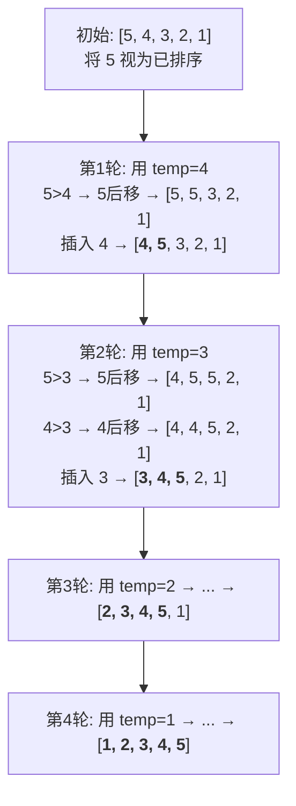

# 插入排序

## 简介

插入排序（Insertion Sort）的思想类似于**打扑克牌时整理手牌**——将每一张新牌插入到手中已经排好序的牌中的正确位置。它构建有序序列，遍历未排序数据，在已排序序列中**从后向前**扫描找到插入位置。

**特性一览：**
- 稳定排序
- 原地排序（In-place）
- 时间复杂度：最好 O(n)（已有序），最坏/平均 O(n²)
- 空间复杂度：O(1)
- **小规模数据时性能优于冒泡和选择排序**
- 对于基本有序的数组效率极高

---

## 排序过程示意图

以初始数组 `[5, 4, 3, 2, 1]` 为例：



---

## 代码实现

```javascript
/**
 * @param {number[]} arr
 * @returns {number[]}
 */
function insertionSort(arr) {
  const len = arr.length;
  let temp;
  for (let i = 1; i < len; i++) {
    temp = arr[i];
    let j = i;
    while (j > 0 && arr[j - 1] > temp) {
      arr[j] = arr[j - 1];
      j--;
    }
    arr[j] = temp;
  }
  return arr;
}
```

---

## 逐段解析

1. **外层循环** `i`：从索引 1 开始遍历到末尾。因为索引 0 的元素可以视为"已排序部分"（只有一个元素，天然有序）。`i` 指向当前要插入的元素。

2. **保存当前值**：`temp = arr[i]`，暂存待插入元素的值，因为后续后移操作会覆盖这个位置。

3. **内层 while 循环**：`j` 从 `i` 开始向左移动。
   - 条件 `j > 0 && arr[j - 1] > temp`：只要前一个元素比 `temp` 大，就将前一个元素**后移一位**（`arr[j] = arr[j-1]`），然后 `j--` 继续向左比较。
   - 这个循环本质上是**为 temp 找到合适的插入位置**，同时将比 temp 大的元素逐个向右挪动。

4. **插入**：退出 while 循环后，`j` 就是 temp 应该插入的位置，执行 `arr[j] = temp`。

---

## 为什么说插入排序对"基本有序"的数组效率高？

如果数组基本有序，while 循环的条件 `arr[j-1] > temp` 很快就会不成立，内层循环几乎不需要移动元素，退化为 O(n)。这是插入排序相比冒泡和选择排序在小规模数据上的优势。

---

## 复杂度分析

| 最好 | 最坏 | 平均 | 空间 | 稳定 |
|------|------|------|------|------|
| O(n) | O(n²) | O(n²) | O(1) | 是 |

- **最好 O(n)**：数组已有序，内层 while 每次立即退出，只有外层循环 n-1 次。
- **最坏 O(n²)**：数组逆序，每次都要将 temp 移动到最前面，内层循环移动 i 次。
- **稳定性**：`arr[j-1] > temp` 使用严格大于，相等时不移动，相同值的相对顺序保持不变，因此**稳定**。
