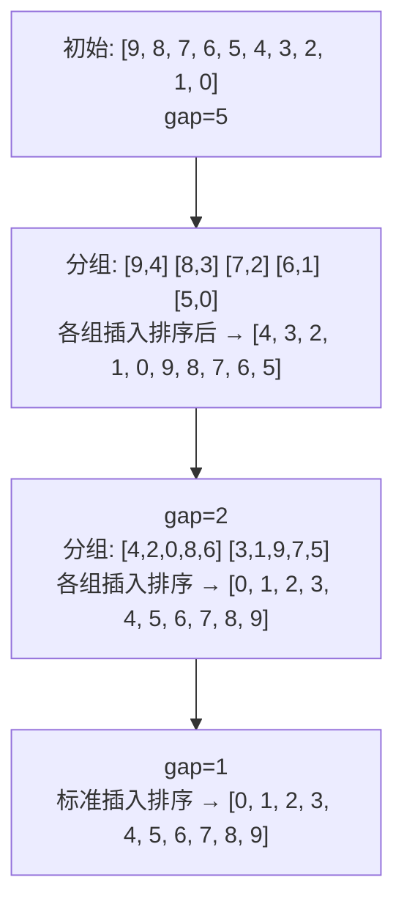
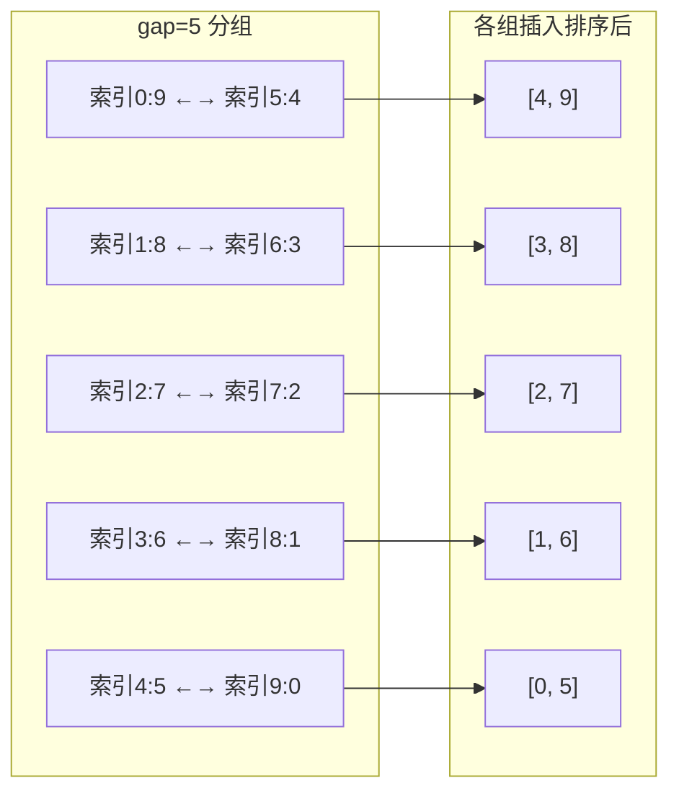

# 希尔排序

## 简介

希尔排序（Shell Sort）是**插入排序的改进版**，由 Donald Shell 于 1959 年提出。它通过将数组**分组**进行插入排序来减少元素的移动距离，克服了插入排序每次只能移动一位的缺陷。

**核心思想：**
1. 先取一个间隔 `gap`，将数组分为 `gap` 组
2. 每组分别进行插入排序（称为"希尔增量排序"）
3. 缩小 `gap`，重复上述操作
4. 当 `gap = 1` 时，执行最后一次标准的插入排序（此时数组已经"基本有序"，插入排序效率极高）

**特性一览：**
- **不稳定**排序
- 原地排序（In-place）
- 时间复杂度：O(n log n) ~ O(n²) 取决于 gap 序列
- 空间复杂度：O(1)

---

## 排序过程示意图

以初始数组 `[9, 8, 7, 6, 5, 4, 3, 2, 1, 0]` 为例：



第一轮 gap=5 时详细分组情况：



---

## 代码实现

```javascript
/**
 * @param {number[]} arr
 * @returns {number[]}
 */
function shellSort(arr) {
  let length = arr.length;
  let interval = Math.floor(length / 2);

  while (interval >= 1) {
    for (let i = interval; i < length; i++) {
      let temp = arr[i];
      let j = i;
      while (arr[j - interval] > temp && j - interval >= 0) {
        arr[j] = arr[j - interval];
        j -= interval;
      }
      arr[j] = temp;
    }
    interval = Math.floor(interval / 2);
  }
  return arr;
}
```

---

## 逐段解析

### 外层 gap 控制

`interval = Math.floor(length / 2)` 初始化间隔为数组长度的一半。每次外层循环结束后 `interval = Math.floor(interval / 2)`，间隔逐渐缩小，直到 `interval = 1`。常用的 gap 序列是 Shell 原始序列：`n/2, n/4, ..., 1`。

### 中间层：对每组进行插入排序

`for (let i = interval; i < length; i++)`：这个循环从 `interval` 开始遍历到末尾。为什么不是分多个循环分别处理各组？因为 `i` 每自增 1，就切换到下一组，循环一次就完成了**所有组的交替插入排序**。这比写多个嵌套循环要简洁得多。

### 最内层：组内插入排序

`while (arr[j - interval] > temp && j - interval >= 0)`：
- `arr[j - interval]` 是当前元素所在组中的前一个元素
- 如果前一个元素比 `temp` 大，则将其后移 `interval` 个位置
- 继续向左（以 `interval` 为步长）比较，直到找到插入位置

这与插入排序的核心逻辑完全一致，只是步长从 1 变成了 `interval`。

---

## gap 序列对性能的影响

不同的 gap 序列会显著影响希尔排序的性能：

| gap 序列 | 时间复杂度 | 提出者 |
|----------|-----------|--------|
| n/2, n/4, ..., 1 | O(n²) | Shell |
| 2ᵏ - 1（Hibbard） | O(n³/²) | Hibbard |
| 3ᵏ - 1（Knuth） | O(n³/²) | Knuth |
| Sedgewick 序列 | O(n⁷/⁶) | Sedgewick |

---

## 复杂度分析

| 最好 | 最坏 | 平均 | 空间 | 稳定 |
|------|------|------|------|------|
| O(n log n) | O(n²) | O(n log n) ~ O(n²) | O(1) | 否 |

- **不稳定**：分组排序时，相同元素可能被分到不同的组中，跨组移动会破坏相对顺序。
- **空间**：O(1)，原地排序，只使用常数临时变量。
