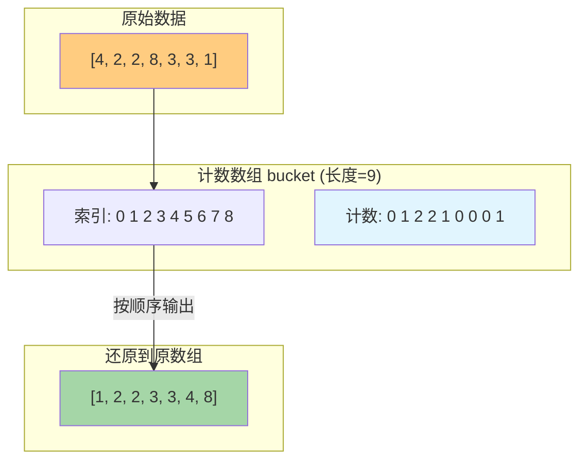
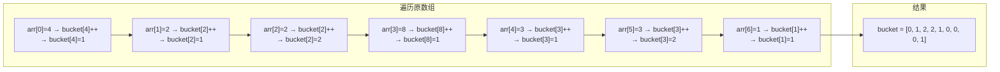

# 计数排序

## 简介

计数排序（Counting Sort）是一种**非比较排序**算法。它将输入数据的值直接转化为键（数组下标）存储在额外开辟的数组空间中，因此**不是比较排序**。

**适用场景：**
- 数据范围不大（k 相对较小）
- 数据为整数（或可以映射为整数）
- 例如：学生成绩排序（0~100 分）、年龄排序等

**特性一览：**
- 稳定排序（本实现中通过按顺序输出保持稳定）
- 非原地排序（需要额外数组）
- 时间复杂度：O(n + k)（k 为数据范围）
- 空间复杂度：O(n + k)

---

## 排序过程示意图

以数组 `[4, 2, 2, 8, 3, 3, 1]` 为例，最大值为 8：



计数数组填充过程详解：



---

## 代码实现

```javascript
/**
 * @param {number[]} arr
 * @param {number} maxValue 数据中的最大值
 * @returns {number[]}
 */
function countingSort(arr, maxValue) {
  var bucket = new Array(maxValue + 1),
    sortedIndex = 0,
    arrLen = arr.length,
    bucketLen = maxValue + 1;

  for (var i = 0; i < arrLen; i++) {
    if (!bucket[arr[i]]) bucket[arr[i]] = 0;
    bucket[arr[i]]++;
  }

  for (var j = 0; j < bucketLen; j++) {
    while (bucket[j]-- > 0) {
      arr[sortedIndex++] = j;
    }
  }
  return arr;
}
```

---

## 逐段解析

### 初始化

```javascript
var bucket = new Array(maxValue + 1)
```

创建一个长度为 `maxValue + 1` 的数组，下标刚好覆盖所有可能的数值。例如最大值为 8，则数组长度为 9（下标 0~8）。

### 计数阶段

```javascript
for (var i = 0; i < arrLen; i++) {
  if (!bucket[arr[i]]) bucket[arr[i]] = 0;
  bucket[arr[i]]++;
}
```

遍历原数组，以**元素值**为下标，统计每个数值出现的次数。`if (!bucket[arr[i]])` 处理 JavaScript 稀疏数组——如果该位置尚未初始化，先置为 0 再递增。

### 输出阶段

```javascript
for (var j = 0; j < bucketLen; j++) {
  while (bucket[j]-- > 0) {
    arr[sortedIndex++] = j;
  }
}
```

按数值从小到大遍历计数数组，将每个值根据其计数重复输出到原数组中。`sortedIndex` 指向当前填充位置。`bucket[j]-- > 0` 利用了后置自减：先判断是否大于 0，再自减，循环执行 `bucket[j]` 次。

---

## 复杂度分析

| 最好 | 最坏 | 平均 | 空间 | 稳定 |
|------|------|------|------|------|
| O(n + k) | O(n + k) | O(n + k) | O(n + k) | 是 |

- **时间复杂度 O(n + k)**：`n` 是原数组长度，`k` 是数据范围（最大值 - 最小值 + 1）。计数阶段遍历 n 次，输出阶段遍历 k 次。
- **空间复杂度 O(n + k)**：计数数组长度为 `k+1`，同时在原数组上覆写（不计额外空间）或需要 O(n) 存储结果。
- **稳定**：按数值顺序依次输出，相同数值的相对顺序不会改变。

### 局限性

当 `k` 远大于 `n` 时（例如对 `[1, 1000000]` 排序），计数排序极度低效，浪费大量空间。此时应考虑桶排序或比较排序。
